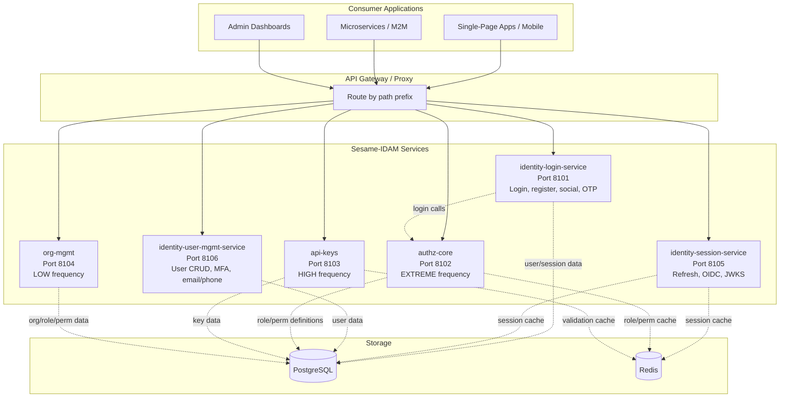
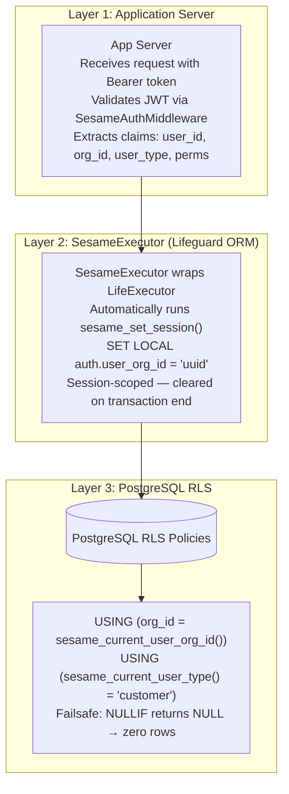

# Sesame-IDAM

> **Open-source bolt-on identity & access management for B2B SaaS.**  
> Zero auth logic in your app. Deployed as six independent Rust microservices.  
> Matches the full PropelAuth API surface with native PostgreSQL RLS security.

[Design Document](docs/design-doc.md) · [Gap Analysis](docs/propelauth-gap-analysis.md) · [Service Topology](docs/service-topology-design.md) · [RLS Integration](docs/rls-design-v2.md)

---

## What Is Sesame-IDAM?

Sesame-IDAM is an **open-source bolt-on identity platform** that any B2B SaaS application can integrate in hours — not months. The consuming application implements **zero authentication logic**.

Sesame manages:
- **Login & Registration** — email/password, social OAuth, email/phone OTP, dual OTP, magic links
- **Session Management** — token refresh, OIDC discovery, JWKS, logout
- **User Management** — create, fetch, update, delete, search, MFA, email/phone verification, social links, migration
- **Organizations** — org lifecycle, memberships, invites, seat limits, domain controls, SSO/SCIM
- **Roles & Permissions** — RBAC with inheritance, ABAC attributes, fine-grained checks
- **API Keys** — M2M authentication for services and CLI tools
- **Enterprise SSO** — SAML/OIDC per organization
- **Webhooks** — real-time event delivery for identity state changes
- **MCP** — Model Context Protocol authentication for AI agents

The application receives **enriched JWTs** containing all identity, org, role, and permission claims. It reads the JWT and enforces access control — route-level, RLS, feature flags. **Nothing else is needed.**

---

## Why Sesame?

| Feature | **PropelAuth** | **Supabase Auth** | **Sesame-IDAM** |
|---------|---------------|-------------------|----------------|
| Core promise | "Auth for your SaaS" | "Auth for your database" | **"Auth for your SaaS with database-level security"** |
| User/org model | Built-in B2B | Flat users | **Built-in B2B (same as PropelAuth)** |
| Database security | JWT claims only | Native RLS | **Native RLS helpers (we provide the SQL)** |
| Integration | Backend API + Frontend SDK | SDK + PostgREST | **Backend API + SDK + RLS Helper SQL** |
| Source | Proprietary / Paid | Open source | **Open source (Rust), self-hosted** |
| Per-user pricing | Yes | Yes | **No — free, self-hosted** |
| Vendor lock-in | Yes | Yes | **None** |

Sesame combines the **B2B complexity of PropelAuth** with the **database-native security of Supabase** — delivered as open-source infrastructure.

---

## Architecture

Sesame is **six independent Rust microservices**, not a monolith. Split by per-request frequency and cost so each can scale independently:


```mermaid
graph TB
    subgraph "Consumer Applications"
        SPA[Single-Page Apps / Mobile]
        Microsvc[Microservices / M2M]
        Admin[Admin Dashboards]
    end

    subgraph "API Gateway / Proxy"
        Proxy[Route by path prefix]
    end

    subgraph "Sesame-IDAM Services"
        IL[identity-login-service<br/>Port 8101<br/>Login, register, social, OTP]
        IS[identity-session-service<br/>Port 8105<br/>Refresh, OIDC, JWKS]
        IU[identity-user-mgmt-service<br/>Port 8106<br/>User CRUD, MFA, email/phone]
        AC[authz-core<br/>Port 8102<br/>EXTREME frequency]
        AK[api-keys<br/>Port 8103<br/>HIGH frequency]
        OM[org-mgmt<br/>Port 8104<br/>LOW frequency]
    end

    subgraph "Storage"
        PG[(PostgreSQL)]
        Redis[(Redis)]
    end

    SPA --> Proxy
    Microsvc --> Proxy
    Admin --> Proxy
    Proxy --> IL
    Proxy --> IS
    Proxy --> IU
    Proxy --> AC
    Proxy --> AK
    Proxy --> OM

    IL -. login calls .-> AC
    IS -. session cache .-> Redis
    AC -. role/perm cache .-> Redis
    AK -. validation cache .-> Redis
    IL -. user/session data .-> PG
    IS -. session cache .-> PG
    IU -. user data .-> PG
    AC -. role/perm definitions .-> PG
    AK -. key data .-> PG
    OM -. org/role/perm data .-> PG
```

### Service Breakdown

| Service | Base Path | Frequency | Purpose |
|---------|-----------|-----------|---------|
| **identity-login-service** | `/auth/login`, `/auth/register`, `/auth/logout`, `/social/*`, `/oauth/authorize` | HIGH | Email/password login, social OAuth, email/phone OTP, dual OTP, magic links, registration |
| **identity-session-service** | `/auth/refresh`, `/.well-known/openid-configuration`, `/.well-known/jwks.json` | HIGH | Token refresh, OIDC discovery, JWKS endpoint |
| **identity-user-mgmt-service** | `/api/v1/identity/users/*`, `/api/v1/identity/users/{id}/mfa/*`, `/api/v1/identity/users/{id}/email/*`, `/api/v1/identity/users/{id}/phone/*`, `/api/v1/identity/users/{id}/social/*` | HIGH | User CRUD, MFA setup/verify, email/phone verification, social link management, migration |
| **authz-core** | `/api/v1/am/authorize`, `/api/v1/am/principal/*`, `/api/v1/am/principals/*` | EXTREME | Per-request authorization, principal/effective, role evaluation, attribute management |
| **api-keys** | `/api/v1/am/api-keys/*` | HIGH | API key lifecycle, validation (personal + org), rotation, archival |
| **org-mgmt** | `/orgs/*`, `/api/v1/am/applications/*` | LOW | Org lifecycle, memberships, SSO/SCIM, roles, permissions, applications, webhooks |

---

## The RLS Bridge — Our Killer Feature

PropelAuth gives you the JWT. Supabase gives you RLS helpers. **Sesame gives you both.**


```mermaid
graph TB
    subgraph "Layer 1: Application Server"
        App["App Server<br/>Receives request with Bearer token<br/>Validates JWT via SesameAuthMiddleware<br/>Extracts claims: user_id, org_id, user_type, perms"]
    end

    subgraph "Layer 2: SesameExecutor (Lifeguard ORM)"
        SE["SesameExecutor wraps LifeExecutor<br/>Automatically runs sesame_set_session()<br/>SET LOCAL auth.user_org_id = 'uuid'<br/>Session-scoped — cleared on transaction end"]
    end

    subgraph "Layer 3: PostgreSQL RLS"
        PG[(PostgreSQL RLS Policies)]
        RLS["USING (org_id = sesame_current_user_org_id())<br/>USING (sesame_current_user_type() = 'customer')<br/>Failsafe: NULLIF returns NULL → zero rows"]
    end

    App --> SE --> PG --> RLS
```

The application validates the JWT in the application layer. SesameExecutor automatically calls `SET LOCAL` at the start of every database transaction. RLS policies reference `sesame_current_user_org_id()` to filter rows. The JWT itself **never enters the database**.

### SQL Helpers (Deployed Once Into Your DB)

```sql
CREATE OR REPLACE FUNCTION public.sesame_set_session(
    p_user_id uuid, p_user_org_id uuid,
    p_user_org_type text DEFAULT 'consumer',
    p_user_type text DEFAULT 'customer',
    p_permissions text[] DEFAULT '{}',
    p_user_email text DEFAULT NULL
) RETURNS void LANGUAGE plpgsql SECURITY DEFINER AS $$
BEGIN
    SET LOCAL auth.user_id := p_user_id;
    SET LOCAL auth.user_org_id := p_user_org_id;
    SET LOCAL auth.user_org_type := p_user_org_type;
    SET LOCAL auth.user_type := p_user_type;
    SET LOCAL auth.permissions := p_permissions;
    SET LOCAL auth.user_email := p_user_email;
END;
$$;
```

Deploy this once per consuming application's database. All subsequent queries are automatically org-scoped.

---

## Developer Contract

When a developer integrates Sesame, this is exactly what they interact with:

### Frontend (User-Facing)
```typescript
import { useAuth } from '@sesame-idam/frontend';

function App() {
  const { user, orgs, isLoading, login, logout } = useAuth();
  // Never write login logic — Sesame handles it
}
```

### Backend Admin API (Server-Facing)
```typescript
// Manage users, orgs, memberships, roles, permissions
const users = await sesame.users.list({ limit: 10 });
const org = await sesame.orgs.get('org_xyz789');
await sesame.orgs.update('org_xyz789', {
  name: 'Acme Corp 2.0',
  settings: { max_users: 100, password_rotation_enabled: true }
});
const members = await sesame.orgs.getMembers('org_xyz789');
await sesame.orgs.addMember('org_xyz789', { userId: 'user_abc', role: 'Admin' });
```

### Database (Automatic RLS)
```typescript
// All queries are automatically org-scoped via SesameExecutor
// No changes needed to application code
const rows = await db.query('SELECT * FROM my_custom_table');
// RLS policy fires automatically: USING (org_id = sesame_current_user_org_id())
```

---

## JWT Schema

Every token issued by Sesame is an RS256-signed JWT containing everything the application needs:

```json
{
  "sub": "31c41c16-...",
  "user_id": "31c41c16-...",
  "user_type": "customer",
  "org_id": "1189c444-...",
  "org_name": "Acme Inc",
  "roles": ["admin", "billing-viewer"],
  "permissions": ["org:admin", "billing:read", "billing:write"],
  "mfa_enabled": true,
  "is_platform_admin": false,
  "email_verified": true,
  "locked": false,
  "enabled": true
}
```

All claims are **authoritative in Sesame** — written at token generation, never modifiable by the client.

**Coarse-grained checks** (e.g., "is Admin?") use JWT claims directly — zero latency. **Fine-grained checks** (e.g., "can user delete invoice #123?") call `POST /authorize` with ABAC rules.

---

## OpenAPI Surface

| Service | Specs | Endpoints | Schemas |
|---------|-------|-----------|---------|
| identity-login-service | `openapi/idam/identity-login-service/openapi.yaml` | 20 | 29 |
| identity-session-service | `openapi/idam/identity-session-service/openapi.yaml` | 16 | 59 |
| identity-user-mgmt-service | `openapi/idam/identity-user-mgmt-service/openapi.yaml` | 25 | 23 |
| authz-core | `openapi/idam/authz-core/openapi.yaml` | 5 | 8 |
| api-keys | `openapi/idam/api-keys/openapi.yaml` | 11 | 16 |
| org-mgmt | `openapi/idam/org-mgmt/openapi.yaml` | 43 | 44 |
| **Total** | **6 spec files** | **120 endpoints** | **179 schemas** |

Each OpenAPI spec is self-contained (schemas duplicated across specs). Each feeds BRRTRouter codegen for its own gen crate.

---

## Sesame-Only Features

| Feature | Description |
|---------|-------------|
| **RLS Helper SQL** | `sesame_set_session()`, `sesame_current_*()` — database-level security |
| **SesameExecutor** | Automatic RLS injection at ORM level via Lifeguard wrapper |
| **Dual OTP** | Email + phone simultaneous verification |
| **Phone OTP** | SMS OTP login |
| **Role inheritance** | Explicit `parent_role_id` in data model |
| **Application model** | First-class Application entities |
| **Webhook system** | Complete delivery with retries, HMAC signing, tracking |
| **User type** | `customer` / `platform` distinction at JWT claim level |
| **Token rotation** | Explicit refresh token rotation on every `/refresh` |
| **org_type** | Provider/consumer/platform persona classification |
| **MCP support** | Model Context Protocol authentication for AI agents |
| **Open source** | Self-hosted, no per-user pricing, no vendor lock-in |

---

## Getting Started

### Prerequisites
- Rust toolchain
- Docker + Docker Compose (or Kind cluster)
- PostgreSQL (or Tilt-deployed Supabase stack)
- Redis

### Quick Setup
```bash
just init        # Create tooling venv
just dev-up      # Start Kind cluster + Tilt (port 10351)
just supabase-apply  # Deploy Supabase stack (PostgreSQL)
just port-forward    # Forward postgres + redis to localhost
```

### Build & Generate
```bash
just gen         # Generate all 6 crates from OpenAPI specs
just gen-identity-login   # Generate identity-login-service crate only
just gen-identity-session # Generate identity-session-service crate only
just gen-identity-user-mgmt # Generate identity-user-mgmt-service crate only
just gen-authz-core       # Generate authz-core crate only
just gen-api-keys         # Generate api-keys crate only
just gen-org-mgmt         # Generate org-mgmt crate only
just lint-openapi         # Lint all specs via brrtrouter-gen
just serve-identity-login # Start echo server for local testing
```

### Guard Rails
- **Ruff** — same select/ignore and complexity limits as RERP
- **Pre-commit** — `just qa` (lint + format-check + pytest) before every commit
- Install hooks: `just install-hooks`

---

## Status

- **OpenAPI:** 146 endpoints across 7 spec files — **100% coverage** of PropelAuth API surface plus 11 Sesame-only features
- **Gap Analysis:** [docs/propelauth-gap-analysis.md](docs/propalauth-gap-analysis.md) — full line-by-line comparison
- **Design:** [docs/design-doc.md](docs/design-doc.md) — comprehensive architecture, data model, security, integration patterns
- **Rust:** Zero implementation currently. `gen/` + `impl/` crates per microservice planned (BRRTRouter codegen + Lifeguard ORM)
- **Kubernetes:** Helm charts and Tiltfile ready for deployment once implementations exist
- **Archive:** Pre-pivot state preserved on branch `archive/saas-idam-pre-microservice-pivot`

---

## Links

- [Full Design Document](docs/design-doc.md)
- [Gap Analysis vs PropelAuth](docs/propalauth-gap-analysis.md)
- [Service Topology](docs/service-topology-design.md)
- [RLS Integration Design](docs/rls-design-v2.md)
- [OpenAPI Specs](openapi/README.md)
- [AGENTS.md](AGENTS.md) — developer notes and tooling

---

*Sesame-IDAM is part of the Microscaler ecosystem — alongside BRRTRouter (API gateway), RERP (resource planning), PriceWhisperer (market data), and Hauliage (logistics).*
