 

# Sesame-idam
Sesame is a simple identity and access management system designed to be easy to use, flexible, and secure. 
It provides user authentication and authorization for your applications, and backed by a simple API and Postgres database.

# Performance

Sesame is designed to be fast and efficient. It can handle millions of requests per second and can scale.

The following is an example of the performance of Sesame using the wrk tool with 400 connections and 1 thread.

```bash
wrk http://127.0.0.1:8080/api/backend/v1/user/a04d69d7-9347-48a3-aa01-8e7ce9aeee04?token_refresh=true -d 10 -t 1 -c 400

Running 10s test @ http://127.0.0.1:8080/api/backend/v1/user/a04d69d7-9347-48a3-aa01-8e7ce9aeee04?token_refresh=true
1 threads and 400 connections
Thread Stats   Avg      Stdev     Max   +/- Stdev
Latency     1.65ms  520.40us  21.79ms   98.50%
Req/Sec   126.29k    10.45k  149.14k    75.00%
1261308 requests in 10.05s, 120.29MB read
Socket errors: connect 0, read 338, write 0, timeout 0
Requests/sec: 125532.89
Transfer/sec:     11.97MB
```

# Architecture

Sesame is built using a microservices architecture. It consists of several services that communicate with each other

# Client Libraries
- Client side libraries for:
  - React
  - Vue
  - Angular
  - Svelte
  - SolidJS
  - Vanilla JS
  - Rust
  - Python
  - Java
  - Kotlin
  - C#
  - C++
  - Go
  - Swift
  - Objective-C

# Features

| Function                                                                            | Description | API Spec Complete | BDD Tests created | Implemented |
|-------------------------------------------------------------------------------------| ----------- |-------------------|-------------------|-------------|
| login                                                                               | |                   | |                   |             |
| User registration                                                                   | |                   | |                   |             |
| Password hashing                                                                    | |                   | |                   |             |
| Password reset                                                                      | |                   | |                   |             |
| Email verification                                                                  | |                   | |                   |             |
| JWT authentication                                                                  | |                   | |                   |             |
| User management                                                                     | |                   | |                   |             |
| Role-based access control                                                           | |                   | |                   |             |
| Rate limiting                                                                       | |                   | |                   |             |
| Organisation management                                                             | |                   | |                   |             |
| Waitlist                                                                            | |                   | |                   |             |
| API Key Authentication                                                              | |                   | |                   |             |
| Security                                                                            | |                   | |                   |             |
| User properties                                                                     | |                   | |                   |             |
| Roles and Permissions (RBAC)                                                        | |                   | |                   |             |
| Advanced RBAC                                                                       | |                   | |                   |             |
| User impersonation                                                                  | |                   | |                   |             |
| User Management <br/>(backend admin panel or <br/>each organisations administrator) | |                   |
| Metrics & user insights                                                             | |                   | |                   |             |
| Enterprise SSO (SAML)                                                               | |                   | |                   |             |
| MFA Enforcement                                                                     | |                   | |                   |             |
| SCIM (System for Cross Domain Identity Management)                                  | |                   | |                   |             |
| Restricted login methods                                                            | |                   | |                   |             |
| API Key rate limiting                                                               | |                   | |                   |             |
| Audit logs                                                                          | |                   | |                   |             |


# Database UML

```mermaid
classDiagram
    class Organization {
        UUID org_id PK
        text org_name
        jsonb org_metadata
    }
    class User {
        UUID user_id PK
        text legacy_user_id
        text email
        boolean email_confirmed
        text username
        text first_name
        text last_name
        text picture_url
        jsonb properties
        boolean has_password
        boolean update_password_required
        boolean locked
        boolean enabled
        boolean mfa_enabled
        boolean can_create_orgs
        bigint created_at
        bigint last_active_at
    }
    class UserOrganizationInfo {
        UUID user_id FK
        UUID org_id FK
        text user_role
        text url_safe_org_name
        text org_role_structure
        text[] inherited_user_roles_plus_current_role
        text[] user_permissions
        text[] additional_roles
    }
    class Role {
        UUID role_id PK
        UUID org_id FK
        text name
        text description
        timestamptz created_at
    }
    class Permission {
        UUID permission_id PK
        UUID org_id FK
        text name
        text description
        timestamptz created_at
    }
    class RolePermission {
        UUID role_id FK
        UUID permission_id FK
    }
    class UserRole {
        UUID user_id FK
        UUID role_id FK
        timestamptz assigned_at
    }
    class RoleInheritance {
        UUID role_id FK
        UUID parent_role_id FK
    }
    class RateLimitPolicy {
        int policy_id PK
        text name
        text scope
        int limit_count
        int window_sec
        text description
        timestamptz created_at
    }
    class RateLimitAssignment {
        int policy_id FK
        UUID user_id FK
        UUID org_id FK
    }
    class RateLimitCounter {
        int policy_id FK
        UUID user_id FK
        UUID org_id FK
        timestamptz window_start PK
        int count
        timestamptz last_updated
    }
    class Session {
        UUID session_id PK
        UUID user_id FK
        text refresh_token
        timestamptz created_at
        timestamptz expires_at
        boolean revoked
        inet ip_address
        text user_agent
    }
    class PasswordResetToken {
        UUID token PK
        UUID user_id FK
        timestamptz created_at
        timestamptz expires_at
        timestamptz used_at
    }
    class EmailVerificationToken {
        UUID token PK
        UUID user_id FK
        timestamptz created_at
        timestamptz expires_at
        timestamptz used_at
    }
    class LoginAttempt {
        UUID attempt_id PK
        UUID user_id FK
        UUID org_id FK
        timestamptz timestamp
        boolean success
        inet ip_address
        text user_agent
    }
    class WaitlistSignup {
        UUID signup_id PK
        text email
        boolean invited
        timestamptz invited_at
    }
    class APIKey {
        UUID api_key_id PK
        UUID user_id FK
        text key_hash
        text description
        timestamptz created_at
        timestamptz expires_at
        boolean revoked
    }
    class APIKeyRateLimit {
        UUID api_key_id FK
        int policy_id FK
    }
    class MFADevice {
        UUID device_id PK
        UUID user_id FK
        text type
        text secret
        timestamptz created_at
        boolean enabled
        timestamptz last_used
    }
    class IdentityProvider {
        UUID provider_id PK
        UUID org_id FK
        text type
        text name
        jsonb config
        boolean enabled
        timestamptz created_at
    }
    class SCIMClient {
        UUID client_id PK
        UUID org_id FK
        text client_secret
        timestamptz created_at
        timestamptz expires_at
        boolean enabled
    }
    class SCIMMapping {
        UUID mapping_id PK
        UUID client_id FK
        text local_attribute
        text scim_attribute
    }
    class SCIMToken {
        UUID token_id PK
        UUID client_id FK
        text token
        timestamptz expires_at
    }
    class OrgLoginMethod {
        UUID org_id FK
        text method PK
        boolean enabled
    }
    class AuditLog {
        UUID log_id PK
        UUID user_id FK
        UUID org_id FK
        text action
        text object_type
        text object_id
        inet ip_address
        text user_agent
        timestamptz timestamp
        jsonb details
    }
    class ImpersonationLog {
        UUID log_id PK
        UUID admin_user_id FK
        UUID impersonated_user_id FK
        timestamptz started_at
        timestamptz ended_at
        inet ip_address
        text user_agent
    }
    class MetricsEvent {
        UUID event_id PK
        UUID user_id FK
        UUID org_id FK
        text event_type
        timestamptz event_timestamp
        jsonb metadata
    }

    %% Relationships
    Organization "1" <-- "0..*" UserOrganizationInfo
    User         "1" <-- "0..*" UserOrganizationInfo

    Organization "1" <-- "0..*" Role
    Organization "1" <-- "0..*" Permission

    Role        "1" <-- "0..*" RolePermission
    Permission  "1" <-- "0..*" RolePermission

    User        "1" <-- "0..*" UserRole
    Role        "1" <-- "0..*" UserRole

    Role        "1" <-- "0..*" RoleInheritance : child
    Role        "1" <-- "0..*" RoleInheritance : parent

    RateLimitPolicy "1" <-- "0..*" RateLimitAssignment
    User             "1" <-- "0..*" RateLimitAssignment
    Organization     "1" <-- "0..*" RateLimitAssignment

    RateLimitPolicy "1" <-- "0..*" RateLimitCounter
    User             "1" <-- "0..*" RateLimitCounter
    Organization     "1" <-- "0..*" RateLimitCounter

    User           "1" <-- "0..*" Session
    User           "1" <-- "0..*" PasswordResetToken
    User           "1" <-- "0..*" EmailVerificationToken

    User           "1" <-- "0..*" LoginAttempt
    Organization   "1" <-- "0..*" LoginAttempt

    User           "1" <-- "0..*" WaitlistSignup

    User           "1" <-- "0..*" APIKey
    APIKey         "1" <-- "0..*" APIKeyRateLimit
    RateLimitPolicy "1" <-- "0..*" APIKeyRateLimit

    User           "1" <-- "0..*" MFADevice

    Organization   "1" <-- "0..*" IdentityProvider

    Organization   "1" <-- "0..*" SCIMClient
    SCIMClient     "1" <-- "0..*" SCIMMapping
    SCIMClient     "1" <-- "0..*" SCIMToken

    Organization   "1" <-- "0..*" OrgLoginMethod

    User           "1" <-- "0..*" AuditLog
    Organization   "1" <-- "0..*" AuditLog

    User           "1" <-- "0..*" ImpersonationLog : admin_user_id
    User           "1" <-- "0..*" ImpersonationLog : impersonated_user_id

    User           "1" <-- "0..*" MetricsEvent
    Organization   "1" <-- "0..*" MetricsEvent

```



# contributing

Contributions are welcome! Please read the [contributing guide](CONTRIBUTING.md) for more information.

# Testing

Testing is handled with a combination of unit tests, integration tests, and end-to-end tests. 
- Rust unit tests
- BBD playwright tests
- locus performance tests

# API Documentation

The API documentation is generated using OpenAPI 3.1.0 and is available in the `specs` directory.
```bash

## Prism Mock server

Prism is a mock server that can be used to test the API. It can be used to generate mock data and test the API
endpoints.

run the following command to start the mock server:

```bash
npx prism mock openapi.yaml
```

This will start the mock server on port 3000. You can then use the following command to test the API:

# Status
Project is currently in development. The API is not yet stable and is subject to change.

Development is currently blocked on the following:
- Robust dynamic dispatch request routing - pending the completion of [BRRTRouter](https://github.com/microscaler/BRRTRouter)
- No Database connection pooling library - pending the completion of [lifeguard](https://github.com/microscaler/lifeguard)
- No easy to use wrapper of the above two libraries - pending the completion of [photon](https://github.com/microscaler/photon)

Development is actively progressing on the above libraries, and once they are in a usable mvp state, development on Sesame will resume.
