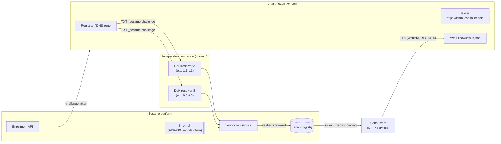
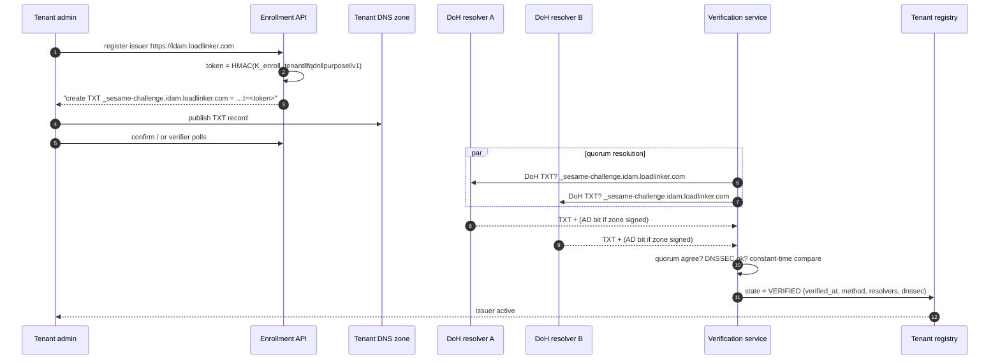
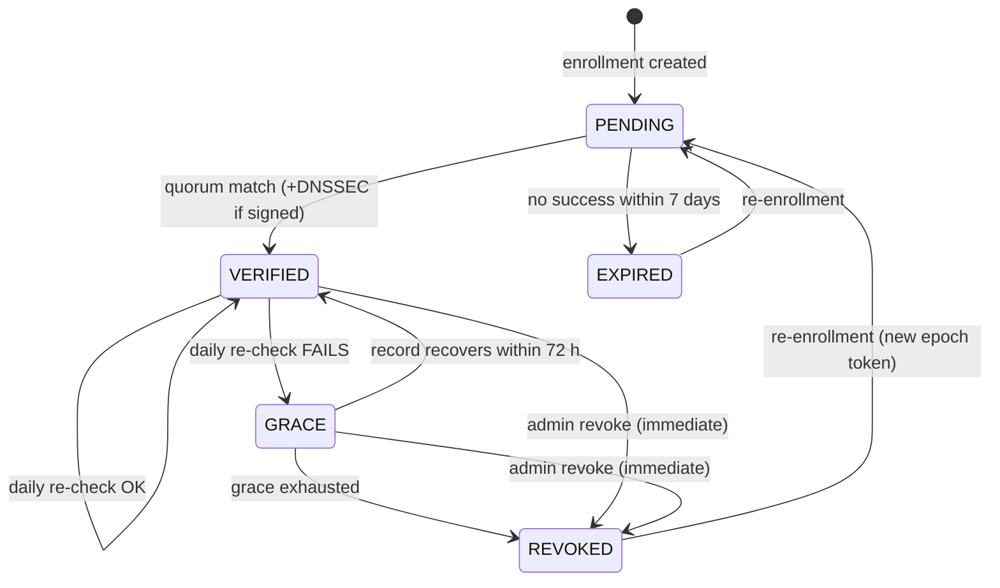

# Design: Tenant Domain Verification — DNS TXT challenge, continuous re-verification

Companion to `ADR-007-tenant-domain-verification.md`. This document specifies
the token construction, record format, resolution pipeline, verification state
machine, re-verification schedule, registry binding, threat model, and RFC
compliance matrix.

Terminology (RFC 2119): MUST / SHOULD / MAY are used normatively.

---

## 1. Actors and trust chain



Trust is anchored twice and heartbeated once:

- **Birth (DNS):** the enrollment TXT challenge proves zone control.
- **Operation (TLS):** every JWKS fetch re-proves domain control via WebPKI
  host verification of the issuer URL.
- **Heartbeat (daily TXT):** re-verification detects ownership change —
  the case both anchors miss.

## 2. Challenge token

### 2.1 Construction

```
purpose = "sesame-domain-verify"
version = "v1"
token   = base64url( HMAC-SHA256( K_enroll_epochN,
              tenant_id || 0x00 || fqdn || 0x00 || purpose || 0x00 || version ) )
```

- HMAC-SHA256 per RFC 2104; output is 32 bytes → 43 base64url chars.
- Field separator `0x00` prevents ambiguous concatenation
  (`tenant "ab" + domain "c.com"` vs `"a" + "bc.com"`).
- `fqdn` is the lower-cased, IDNA A-label (RFC 5890) form of the name being
  verified, without trailing dot.
- The token is a **claim ticket**, not a message: it is never decrypted or
  signature-verified — only recomputed and compared.

### 2.2 Properties

| Property | How |
|---|---|
| Unguessable | 256-bit PRF output; `K_enroll` generated with ≥128 bits entropy (RFC 4086) |
| Tenant-bound | `tenant_id` in the PRF input — loadlinker's token is invalid for any other tenant |
| Name-bound | `fqdn` in the PRF input — a token for `idam.loadlinker.com` cannot verify `loadlinker.com` |
| Stateless | Any verifier replica recomputes; no challenge storage |
| Rotatable | `epoch` in key derivation; both current and previous epoch MUST be accepted during rotation overlap |

### 2.3 `K_enroll` custody

`K_enroll` is born in the secret backend and delivered per ADR-006 (OpenBao /
GCP SM → external-secrets → mounted Secret). It MUST NOT appear in git, even
SOPS-encrypted. Leak impact is bounded: possession of `K_enroll` lets an
attacker *predict* tokens, but enrollment still requires publishing the
record in DNS the attacker controls — the secret is one layer, zone control
is the load-bearing one.

## 3. DNS record

### 3.1 Name

```
_sesame-challenge.<verified-name>
```

- Underscored leaf per RFC 8552/8553 (attrleaf); avoids collision with real
  hosts and is the established convention (`_acme-challenge`, `_dmarc`, …).
- `<verified-name>` is normally the **issuer host**
  (`_sesame-challenge.idam.loadlinker.com`) — least privilege.
- Apex verification (`_sesame-challenge.loadlinker.com`) MAY be requested and
  grants org-wide scope (any issuer host under the apex); this is an explicit
  tenant-admin opt-in recorded in the registry.

### 3.2 Value

```
"sesame-domain-verify=v1;t=<43-char base64url token>"
```

- Single TXT character-string, well under the 255-octet limit (RFC 1035
  §3.3.14); no chunking needed (a design constraint that PGP-armored
  signatures would have violated).
- Verifiers MUST select only strings with the `sesame-domain-verify=` prefix
  and MUST tolerate unrelated TXT records at the same name.
- Unknown `v=` versions MUST be ignored (forward compatibility).

## 4. Resolution pipeline



Rules:

- **Quorum:** two independent DoH resolvers (RFC 8484) over distinct
  providers/paths MUST return the matching record. Disagreement → verification
  FAILS CLOSED and is retried with backoff. This defeats any single poisoned
  or coerced resolver.
- **DNSSEC:** if the zone is signed, validation MUST succeed (AD bit from a
  validating resolver, or local validation per RFC 4033–4035). Unsigned zones
  are accepted (DNSSEC is not universal) but the registry records
  `dnssec: false` and signed zones SHOULD be recommended to tenants.
- **Comparison** of the token MUST be constant-time.
- **Negative results** honor DNS negative caching (RFC 2308) with a retry
  floor of 60 s and exponential backoff to 1 h during PENDING.
- CNAME at the challenge name is followed (ACME-compatible behaviour, allows
  delegated verification to a tenant's automation zone).

## 5. Verification lifecycle



### 5.1 Continuous re-verification (the deliberate enhancement)

- Cadence: **daily** per verified name, jittered; additionally a floor of
  `max(record TTL, 1 h)` — never poll faster than the record's own TTL
  semantics justify.
- On failure: state → GRACE. Issuer trust REMAINS ACTIVE during grace
  (72 h default, per-tenant configurable downward) — a DNS outage must not
  take down a tenant's logins — but alerting fires immediately (registry
  event + notification), and each subsequent failure re-alerts.
- Grace exhausted: state → REVOKED. The tenant-registry binding is disabled;
  verifiers refuse the issuer at the registry layer (consumers do not need
  individual reconfiguration). Existing tokens continue to fail closed at
  their expiry.
- Rationale: the industry default (verify once) silently transfers tenant
  standing to whoever re-registers a lapsed domain. Daily re-check converts
  domain expiry/transfer from an inherited compromise into a detected,
  alerting event with a bounded window (≤ 24 h detection + 72 h grace).

### 5.2 Registry entry

```json
{
  "tenant_id": "loadlinker",
  "verified_name": "idam.loadlinker.com",
  "scope": "host",
  "issuer": "https://idam.loadlinker.com",
  "jwks_uri": "https://idam.loadlinker.com/.well-known/jwks.json",
  "state": "VERIFIED",
  "dnssec": true,
  "verified_at": "2026-07-22T18:00:00Z",
  "last_verified_at": "2026-07-22T18:00:00Z",
  "epoch": 3,
  "audit": ["…append-only events…"]
}
```

Constraints enforced at write time:

- `issuer` host MUST equal or be a descendant of `verified_name`
  (descendant allowed only when `scope: "apex"`).
- `jwks_uri` host MUST equal the `issuer` host (no cross-domain key fetch).
- All registry mutations are append-only audited.

## 6. Binding to token verification

Consumers (BRRTRouter `JwksBearerProvider`) resolve trust strictly through
the registry: configured issuer → registry entry (state must be VERIFIED or
GRACE) → `jwks_uri` → TLS fetch with RFC 6125/9110 host verification →
strict RFC-cased JWKS parsing (see the 2026-07-22 postmortem) → per-issuer
algorithm allow-list → `iss`/`aud`/`typ` claim enforcement. A token can never
select its own key source (`jku`/`x5u` are not honored).

## 7. Threat model

| Threat | Defense |
|---|---|
| Attacker fabricates keypair + fake JWKS "claiming to be Sesame/tenant" | Verifiers only fetch keys via registry-bound issuer → verified domain → TLS. Fabricated keys are unreachable unless the attacker controls the verified DNS name itself. |
| Token guessing | 256-bit HMAC output; infeasible. |
| Token replay across tenants/names | `tenant_id` and `fqdn` inside the PRF input. |
| Poisoned/coerced single resolver | Two-resolver DoH quorum over independent providers; fail closed on disagreement. |
| On-path DNS tampering | DoH transport (RFC 8484) to both resolvers; DNSSEC validation where signed. |
| Domain expiry / transfer / squatter re-registration | **Daily re-verification** → GRACE → REVOKED; ≤24 h detection. |
| `K_enroll` leak | Predicting tokens ≠ publishing records; zone control still required. Epoch rotation bounds exposure; custody per ADR-006 (never in git). |
| Malicious registrar / zone compromise at tenant | Out of Sesame's control by definition (the tenant's zone IS the identity); daily check at least detects post-facto changes to the challenge record; DNSSEC-signed zones narrow the window. |
| Registry tampering (insider) | Append-only audit, admin authn, mutation constraints in §5.2. |
| Phishing of tenant *users* (fake login site) | Explicitly out of scope of this mechanism — mitigated by WebPKI/HSTS and (recommended, separate ADR) passkeys/WebAuthn origin-bound credentials. |

## 8. RFC compliance matrix

| RFC | Requirement | How this design complies |
|---|---|---|
| RFC 1035 §3.3.14 | TXT RDATA is one or more ≤255-octet strings | Single string, ≤80 octets total |
| RFC 2104 | HMAC construction | HMAC-SHA256 for token derivation |
| RFC 2119 | Normative language | Used throughout |
| RFC 2308 | DNS negative caching | Honored in PENDING retry/backoff |
| RFC 4033–4035 | DNSSEC validation | Required when zone is signed; recorded in registry |
| RFC 4086 | Randomness requirements | `K_enroll` ≥128-bit entropy, CSPRNG, backend-generated |
| RFC 5890 | IDNA | fqdn normalized to lower-case A-labels before hashing |
| RFC 6125 / 9110 | TLS reference-identity verification | Issuer/JWKS fetches verify host identity against WebPKI |
| RFC 8484 | DNS over HTTPS | Both quorum resolvers queried over DoH |
| RFC 8552 / 8553 | Underscored node names, attrleaf registry practice | `_sesame-challenge` leaf; single-purpose, prefix-tagged value |
| RFC 8555 §8.4 | (Prior art, not binding) ACME DNS-01 | Same shape: unguessable token in underscored TXT; CNAME chasing compatible |
| RFC 7638 | JWK thumbprints | kids of tenant keys (via ADR-006) |

## 9. Operations

- **Metrics:** verifications attempted/succeeded/failed per resolver; quorum
  disagreements; states by count; time-in-GRACE; DNSSEC coverage %.
- **Alerts:** any VERIFIED→GRACE transition (page-level for production
  tenants); quorum disagreement (possible attack indicator); epoch rotation
  overdue.
- **Runbook stubs:** tenant "record disappeared" (walk registrar UI, verify
  with `dig +dnssec TXT _sesame-challenge.<name>` against both quorum
  resolvers); suspected hijack (immediate admin revoke, then investigate);
  `K_enroll` rotation (new epoch, dual-accept window, re-issue instructions
  only for PENDING enrollments — VERIFIED names are unaffected because
  re-checks recompute against both epochs).

## 10. Explicit non-goals

- Proving the *legal identity* of the tenant organization (contracts/KYC —
  different layer).
- Defending tenant end-users against phishing (see passkeys recommendation).
- Verifying domains for anything other than issuer/JWKS placement.
