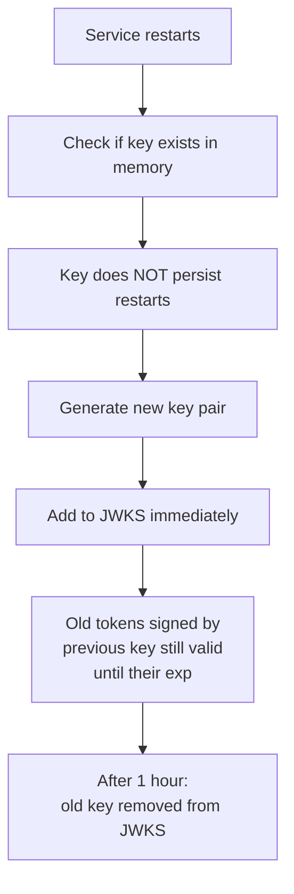

# Story 1.1: Generate and Rotate Asymmetric Signing Keys

## Epic

[01-asymmetric-jwks](../JWT.md)

## Parent Epic Story

Story 1.1

## Summary

Generate ES256 (ECDSA P-256) or EdDSA (Ed25519) key pairs at identity-login-service bootstrap. Keys rotate on schedule or on-demand with overlapping validity windows. The private key is stored in memory only -- never written to disk or persisted. The public key is served via `/.well-known/jwks.json`.

## Why This Story Exists

Asymmetric signing eliminates shared-secret blast radius. Currently all 6 services would need the same `JWT_SECRET` to validate HS256 tokens, meaning every validator is also a potential signer if the key leaks. Asymmetric signing puts the private key only in the signing service and distributes only public validation keys.

## Design Context

### Current State

- `common/src/jwt.rs` (referenced in JWT document) signs with HS256 from shared `JWT_SECRET`
- Generated runtime contains `JwksBearerProvider` support (not wired for authz)
- Generated runtime contains development fallback `BearerJwtProvider` using simple signature string
- No asymmetric key generation or rotation logic exists

### Algorithm Choice

**Decision: ES256 (ECDSA + P-256 + SHA-256)** as the default. Rationale:
- Widest library support across Rust crypto crates (jsonwebtoken, ring, p256)
- 256-bit key size (matches P-256 curve) vs Ed25519's 256 bits (comparable security)
- RS256 is slower (1024-2048 bit RSA) and adds 2-3x signing latency
- EdDSA/Ed25519 has best performance but narrower library support;可作为未来升级

Alternative: EdDSA can be added as a second supported algorithm once ES256 is proven in production.

### Key Rotation Strategy

Keys rotate with an **overlapping validity window** to avoid interruption:

1. A new key is generated with a future `valid_from` time
2. The new key's public portion is immediately published to JWKS
3. After `valid_from`, the new key is used for signing
4. The old key remains in JWKS for `grace_period` (default 1 hour)
5. After `grace_period`, the old key is removed from JWKS
6. The old private key is dropped from memory

This ensures:
- Services fetching JWKS during rotation always have a valid key
- Existing tokens signed by the old key remain valid until their `exp`
- No gap where no key is available

### Key Storage

- **Private key**: In-memory only. Stored as an `ecdsa::SigningKey` (or `ed25519::SigningKey`)
- **Public key**: Extracted and encoded as JWK for JWKS publication
- **Kid generation**: `key-{year}-{month}-{index}` (e.g., `key-2026-05-01`)
- **Never on disk**: The private key is never serialized to disk, environment variables, or configuration files
- **Key persistence across restarts**: Not persisted. A restart generates a new key. This is intentional -- if a private key leaks, it is rotated immediately, and any tokens signed with it are simply short-lived

## Implementation Notes

### Rust Types

```rust
// Pseudocode for key management types

#[derive(Debug, Clone)]
pub struct JwtSigningKey {
    pub kid: String,
    pub alg: String,        // "ES256"
    pub valid_from: SystemTime,
    pub public_key_jwk: JsonWebKey,
    pub signing_key: EcdsaSigningKey,  // In-memory only
}

#[derive(Debug, Clone)]
pub struct KeyManager {
    current_key: JwtSigningKey,
    next_key: Option<JwtSigningKey>,    // For rotation preparation
    revoked_keys: Vec<JwkOnly>,         // Public keys only (dropped after grace period)
}
```

### Initialization Flow

1. On service startup, generate a new ES256 key pair
2. Set `valid_from` to a few seconds in the future (allows time for service discovery)
3. Add to `KeyManager.current_key`
4. Set up a background task that generates the next key at `rotation_interval - grace_period`
5. The background task creates the next key with `valid_from = now + rotation_interval`

### Key Rotation Schedule

| Parameter | Default | Configurable Via |
|-----------|---------|------------------|
| `JWT_KEY_ROTATION_INTERVAL` | 30 days | Environment variable |
| `JWT_KEY_GRACE_PERIOD` | 1 hour | Environment variable |
| `JWT_KEY_ALGORITHM` | ES256 | Environment variable (ES256, EdDSA, RS256) |

### Redis Interaction

Keys are NOT stored in Redis. They are in-memory only. Redis is used for token state (refresh tokens, denylist), not key storage.

## Mermaid Diagrams

### Key Lifecycle


### Service Restart Behavior



### Rotation Timeline

```mermaid
gantt
    title Key Rotation Timeline
    dateFormat X
    axisFormat %H:%M
    section Old Key
    Valid for signing       :0, 720
    In JWKS (valid)       :0, 720
    In JWKS (grace)       :720, 60
    Removed from JWKS     :780, 0
    section New Key
    Generated             :660, 0
    In JWKS               :660, 60
    Valid for signing     :720, 60
```



## OpenAPI Changes

No OpenAPI changes needed for key generation (internal operation). The `/.well-known/jwks.json` endpoint already exists in the identity-session-service spec -- it needs to be wired to serve the dynamic key set rather than a static one.

## Design Doc References

- `design-doc.md` section 10.2: Asymmetric Signing & JWKS -- updated in this session
- `design-doc.md` section 6.2: JWT Schema -- `alg: ES256`, `typ: at+jwt`, `kid` field
- `design-doc.md` section 10.1: Token Security -- algorithm property changed to ES256
- `service-topology-design.md`: identity-session-service serves `/.well-known/jwks.json` (EXTREME freq, NEGLIGIBLE cost)
- `topics/topic-architecture-overview.md`: 12 workspace crates, shared tooling
- `topics/topic-jwt-schema.md`: currently states RS256 -- needs update

## Wiki Pages to Update/Create

- `topics/topic-jwt-schema.md`: Update status from "partially-verified" to reflect ES256
- `topics/topic-authorization-flow.md`: Note JWKS cache TTL (5 minutes)
- `topics/topic-token-lifecycle.md`: (new) Document key management lifecycle

## Acceptance Criteria

- [ ] A new ES256 key pair is generated at service startup
- [ ] The private key is never serialized to disk, environment, or config files
- [ ] The public key is served in standard JWKS format (RFC 7517) with `kid`
- [ ] Key rotation generates a new key 1 hour before the old key's grace period expires
- [ ] During rotation, both old and new keys are available in JWKS
- [ ] After the grace period, the old key is removed from JWKS and the private key is dropped from memory
- [ ] Existing tokens signed by a rotated-out key remain valid until their `exp`
- [ ] A service restart generates a fresh key pair
- [ ] The `alg` claim in all signed tokens is `ES256`
- [ ] The `typ` claim in all signed tokens is `at+jwt` (per RFC 9068)

## Dependencies

- Blocks Stories 2.1, 4.1, 5.1 (JWT validation depends on signing being correct)
- Requires `jsonwebtoken` Rust crate with ES256 support (check available)
- Requires the identity-session-service to serve the JWKS endpoint

## Risk / Trade-offs

- **Restart key generation**: A restart invalidates the signing key. Existing tokens are still valid until `exp`, but new tokens are signed with a different `kid`. This is acceptable because access tokens have short TTLs (5 min).
- **No key backup**: If the signing service goes down for an extended period, new tokens cannot be issued. This is intentional -- a compromised private key should be rotated immediately. Backup implies the old key must be recovered, which defeats the security model.
- **ES256 vs EdDSA**: ES256 is chosen for widest library support. EdDSA can be added as a second algorithm later without breaking changes (algorithm allow-list supports multiple).
