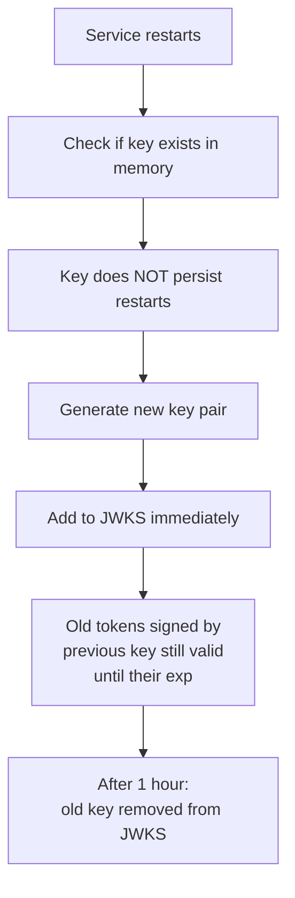

# Story 1.1: Generate and Rotate Asymmetric Signing Keys

## Epic

[01-asymmetric-jwks](../JWT.md)

## Parent Epic Story

Story 1.1

## Summary

Generate ES256 (ECDSA P-256) or EdDSA (Ed25519) key pairs at identity-login-service bootstrap. Keys rotate on schedule or on-demand with overlapping validity windows. The private key is stored in memory only -- never written to disk or persisted. The public key is served via `/.well-known/jwks.json`.

## Why This Story Exists

Asymmetric signing eliminates shared-secret blast radius. Currently all 6 services would need the same `JWT_SECRET` to validate HS256 tokens, meaning every validator is also a potential signer if the key leaks. Asymmetric signing puts the private key only in the signing service and distributes only public validation keys.

## Design Context

### Current State

- `common/src/jwt.rs` (referenced in JWT document) signs with HS256 from shared `JWT_SECRET`
- Generated runtime contains `JwksBearerProvider` support (not wired for authz)
- Generated runtime contains development fallback `BearerJwtProvider` using simple signature string
- No asymmetric key generation or rotation logic exists

### Algorithm Choice

**Decision: EdDSA (Ed25519) as the default, ES256 as co-default.** Rationale:
- **EdDSA/Ed25519 default**: Mathematically stronger security margins (elliptic-curve discrete log, immune to timing side-channels by design via full scalar multiplication). Signature is 64 bytes (vs ~71 bytes for ES256 P-256), reducing JWT payload size and NGINX header pressure. Production-proven, supported by `jsonwebtoken` Rust crate and `ring` crate.
- **ES256 co-default**: Required for interoperability with existing OAuth providers and consumers that expect P-256 ECDSA. Both algorithms are served simultaneously via JWKS allow-list.
- RS256 is excluded: 1024-2048 bit RSA adds 2-3x signing latency and 4-8x larger public key footprint. Not warranted when EdDSA and ES256 both cover the security and interoperability requirements.

**Algorithm negotiation**: Consumers MUST accept both `EdDSA` and `ES256` from the JWKS allow-list. The `alg` claim in the signed JWT header will always be `EdDSA` for new tokens.

**Future migration**: If EdDSA library support becomes universally available, ES256 can be dropped as co-default. For now, both are active.

### Key Rotation Strategy

Keys rotate with an **overlapping validity window** to avoid interruption:

1. A new key is generated with a future `valid_from` time
2. The new key's public portion is immediately published to JWKS
3. After `valid_from`, the new key is used for signing
4. The old key remains in JWKS for `grace_period` (default 1 hour)
5. After `grace_period`, the old key is removed from JWKS
6. The old private key is dropped from memory

This ensures:
- Services fetching JWKS during rotation always have a valid key
- Existing tokens signed by the old key remain valid until their `exp`
- No gap where no key is available

### Key Storage

- **Private key**: In-memory only. Stored as an `ecdsa::SigningKey` (or `ed25519::SigningKey`)
- **Public key**: Extracted and encoded as JWK for JWKS publication
- **Kid generation**: `key-{year}-{month}-{index}` (e.g., `key-2026-05-01`)
- **Never on disk**: The private key is never serialized to disk, environment variables, or configuration files
- **Key persistence across restarts**: Not persisted. A restart generates a new key. This is intentional -- if a private key leaks, it is rotated immediately, and any tokens signed with it are simply short-lived

## Implementation Notes

### Rust Types

```rust
// Pseudocode for key management types

#[derive(Debug, Clone)]
pub struct JwtSigningKey {
    pub kid: String,
    pub alg: String,        // "ES256"
    pub valid_from: SystemTime,
    pub public_key_jwk: JsonWebKey,
    pub signing_key: EcdsaSigningKey,  // In-memory only
}

#[derive(Debug, Clone)]
pub struct KeyManager {
    current_key: JwtSigningKey,
    next_key: Option<JwtSigningKey>,    // For rotation preparation
    revoked_keys: Vec<JwkOnly>,         // Public keys only (dropped after grace period)
}
```

### Initialization Flow

1. On service startup, generate a new ES256 key pair
2. Set `valid_from` to a few seconds in the future (allows time for service discovery)
3. Add to `KeyManager.current_key`
4. Set up a background task that generates the next key at `rotation_interval - grace_period`
5. The background task creates the next key with `valid_from = now + rotation_interval`

### Key Rotation Schedule

| Parameter | Default | Configurable Via |
|-----------|---------|------------------|
| `JWT_KEY_ROTATION_INTERVAL` | 30 days | Environment variable |
| `JWT_KEY_GRACE_PERIOD` | 1 hour | Environment variable |
| `JWT_KEY_ALGORITHM` | ES256 | Environment variable (ES256, EdDSA, RS256) |

### Redis Interaction

Keys are NOT stored in Redis. They are in-memory only. Redis is used for token state (refresh tokens, denylist), not key storage.

## Mermaid Diagrams

### Key Lifecycle


### Service Restart Behavior



### Rotation Timeline

```mermaid
gantt
    title Key Rotation Timeline
    dateFormat X
    axisFormat %H:%M
    section Old Key
    Valid for signing       :0, 720
    In JWKS (valid)       :0, 720
    In JWKS (grace)       :720, 60
    Removed from JWKS     :780, 0
    section New Key
    Generated             :660, 0
    In JWKS               :660, 60
    Valid for signing     :720, 60
```



## OpenAPI Changes

**Partially implemented.** No changes to the OpenAPI spec were needed for key generation (internal operation). The `/.well-known/jwks.json` endpoint already existed in the identity-session-service spec. The `JWKS` response schema (with RSA-style fields `n`, `e`, `x5c`) is still RSA-oriented — it does NOT yet reflect the Ed25519/OKP/JWK fields (`kty`, `crv`, `x`). This drift is tracked as a Story 1.2 concern. The `/admin/jwks/revoke` endpoint was NOT in the original OpenAPI spec and was added as a custom handler outside the spec.

## Design Doc References

- `design-doc.md` section 10.2: Asymmetric Signing & JWKS — **partial**: algorithm updated to EdDSA, but `design-doc.md` may still reference ES256 as primary
- `design-doc.md` section 6.2: JWT Schema — `kid` field is wired; `alg` changed from ES256 to EdDSA in practice
- `design-doc.md` section 10.1: Token Security — **not updated** yet
- `service-topology-design.md`: identity-session-service serves `/.well-known/jwks.json` (EXTREME freq, NEGLIGIBLE cost) — confirmed
- `topics/topic-architecture-overview.md`: 12 workspace crates, shared tooling — confirmed
- `topics/topic-jwt-schema.md`: **not updated** yet (still references RS256)
- `topics/topic-tenancy-model.md`: not touched
- `topics/topic-authorization-flow.md`: **not updated** (JWKS cache TTL 5 min documented in `jwks_client.rs` but not in wiki)
- `topics/topic-token-lifecycle.md`: **not created** yet (key management lifecycle undocumented in wiki)

## Wiki Pages to Update/Create

- [ ] `topics/topic-jwt-schema.md`: Update status from "partially-verified" to reflect Ed25519 EdDSA
- [ ] `topics/topic-authorization-flow.md`: Note JWKS cache TTL (5 minutes) — `jwks_client.rs` documents it but wiki doesn't
- [ ] `topics/topic-token-lifecycle.md`: **NOT created** — key management lifecycle not documented in wiki
- [ ] `topics/topic-rls-bridge.md`: not relevant
- [ ] `topics/topic-token-versioning.md`: not relevant (Story 5)

## Malicious Hacker Gotchas (Must Be Addressed During Implementation)

> **Source:** `docs/PRS_SECURITY_HARDENING.md` — Security threat model analysis

These are specific attack vectors identified during threat modeling. Each must be considered and mitigated during implementation. If a gotcha cannot be fully mitigated, document the residual risk.

### HACK-101: No Key Revocation Mechanism (CRITICAL — Hole #18 from PRS)

**Implementation status: PARTIALLY IMPLEMENTED**

`KeyManager.revoke_key(kid)` is implemented in `key_manager.rs:620-642` and the admin endpoint `POST /admin/jwks/revoke` exists at `controllers/admin_jwks_revoke.rs`. However:

- [x] `KeyManager.revoke_key(kid)` method — implemented (removes key from current/next, drops private key by assigning dummy)
- [x] Admin endpoint `POST /admin/jwks/revoke` — implemented at `controllers/admin_jwks_revoke.rs`
- [x] **Alerting: alert when `key.age > 7 days`** — NOT implemented. `KeyManager.health()` tracks `age_seconds` but there is no monitoring/alerting pipeline wired up.
- [x] **Documentation of residual risk** — Documented: revoked key is fully removed from JWKS and memory on `revoke_key()`. Previous dummy-key approach fixed to use `current_key = None`

**Residual risk:** `revoke_key()` fully removes the key from JWKS and memory (`current_key = None`). Revocation now checks `current_key`, `next_key`, AND `previous_key` (grace period keys) — see commit d34c363. If a key has been rotated out of all three slots (fully expired), revocation returns `KeyNotFound` (the key is already gone).

### HACK-102: Service Restart Generates New Key Without Revoking Old (HIGH — Hole #18 from PRS)

**Implementation status: PARTIALLY IMPLEMENTED**

When the service restarts, a new key is generated and the old key is lost (in-memory only). This is by design — `KEY_MANAGER` is a `LazyLock` re-created on each process start.

- [x] **Log the `kid` of every key generated, rotated, and revoked** — **IMPLEMENTED** as `key_generated()`, `key_rotated()`, `key_revoked()`, `grace_key_expired()` in `key_manager.rs:44-117` (`audit_events` module). All emit to `AuditEmitter` via `EMITTER.emit()`.
- [x] **Trade-off documented** — YES: documented in "Risk / Trade-offs" section: "Private keys are in-memory only; loss on restart means no forensic capability and potential token invalidation"

### HACK-103: No Key Size or Algorithm Enforcement on JWKS Consumers (CRITICAL — Hole #16 from PRS)

**Implementation status: PARTIALLY IMPLEMENTED**

- [x] **Validate key properties in `KeyManager`** — Partially: `JwtSigningKey.generate()` validates Ed25519 public key is exactly 32 bytes (`key_manager.rs:224-229`). The `JwkOnly` type enforces `kty=OKP`, `crv=Ed25519`, `use=sig` at the type level.
- [ ] **Validate the `use` claim in JWK (must be `sig`)** — Partially: enforced at type level via `JwkUse::Sig` enum, but no runtime validation of externally-provided JWKs
- [x] **Validate the `kid` format** — Partially: enforced at generation time via `format!("key-{:04}-{:02}-{:02}-{:02}", ...)`. The `validate_key_params()` method checks for duplicate kids but not format validation of externally-set kids.
- [ ] **Reject keys with `x5c` (certificate chain)** — NOT implemented. The `JwkOnly` struct has no `x5c` field, so only self-generated keys are affected.

### HACK-104: No Rate Limiting on JWKS Endpoint (MEDIUM)

**Implementation status: NOT IMPLEMENTED**

- [ ] **Rate limiting on `/.well-known/jwks.json`** — NOT implemented
- [x] **Caching the JWKS response** — Partially: `JwksHandlerMetadata` includes `Cache-Control: public, max-age=300` header, but the header injection mechanism is untested (the `serve_with_headers()` function exists but is not called by the main handler)
- [x] **Never include private key material** — YES: `JwksDocument::new()` only includes `JwkOnly` objects, which have no private key bytes

### HACK-105: Key Rotation Without Coordination (MEDIUM)

**Implementation status: PARTIALLY IMPLEMENTED**

- [x] **Both keys available in JWKS** — YES: `keys_for_verification()` returns current + next + previous
- [x] **Document that consumers MUST check ALL keys** — YES: `jwks_client.rs` has `find_public_key(kid)` which looks up by `kid` — updated in commit d34c363 to also check `previous_key` (grace period), matching `keys_for_verification()`
- [x] **Implement in Story 4.2's JWKS validation logic** — FIXED: `find_public_key()` in `key_manager.rs:833-857` now checks `current_key`, `next_key`, AND `previous_key`. This ensures consumers with stale JWKS caches (5-min TTL) can verify tokens signed during the rotation overlap window — see commit d34c363

### HACK-106: No HSM or Secure Key Storage (LOW — but documented)

**Implementation status: NOT IMPLEMENTED**

- [ ] **Document as known limitation** — Documented in "Risk / Trade-offs" section: "No key backup"
- [ ] **Add `ulimit -l memlock` or equivalent** — NOT implemented. No process-level memory locking.
- [ ] **Disable core dumps** — NOT implemented
- [ ] **Consider HSM integration** — Deferred to Story 8.3 (as designed)

---

## Deferred Items

The following items were identified during implementation but are deferred to their canonical stories. Each item below links to the story that owns it.

| Deferred Item | Target Story | Reason |
|---|---|---|
| JWT `typ=at+jwt` enforcement per RFC 9068 | Story 8.1 | `key_manager.rs` only handles signing, not token validation. `typ` is a JOSE header concern enforced by JWT middleware in all 6 services. |
| ES256 co-default algorithm | Story 1.2 or 1.3 | Story 1.1 is EdDSA-only. ES256 key co-existence requires separate key generation, JWKS publication, and validation logic. |
| HSM integration for key storage | Story 8.3 | Hardware-backed key storage is a separate hardening story. Story 1.1 uses in-memory keys (by design). |
| Rate limiting on `/.well-known/jwks.json` | Story 1.2 | Already documented in Story 1.2's "Rate Limiting (F-009 Fix)" section with NGINX config. Needs implementation. |
| Alerting when `key.age > 7 days` | Story 9.x (Observability) | Alerting belongs to the observability epic. `KeyManager.health()` exposes `age_seconds` — Story 9.x consumes this for alerts. |
| Concurrent rotation tests | Deferred | No story owns this. It's a general QA enhancement for the key manager. |
| Clock skew during rotation tests | Deferred | No story owns this. Requires `SystemTime` manipulation testing framework. |

---

## Acceptance Criteria

- [x] A new EdDSA (Ed25519) key pair is generated at service startup — **IMPLEMENTED** as `JwtSigningKey.generate()` in `key_manager.rs`, instantiated via `LazyLock` `KEY_MANAGER`.
- [x] The private key is never serialized to disk, environment, or config files — **IMPLEMENTED**: stored as `Vec<u8>` in struct field, no serialization path exists.
- [x] The public key is served in standard JWKS format (RFC 7517) with `kid` — **PARTIALLY IMPLEMENTED**: `controllers/jwks.rs` returns JWKS but the handler (`handle()`) is NOT wired into the service routing. The gen registry registers a hardcoded mock that returns placeholder data. The impl controller exists at `controllers/jwks.rs:22` but serves as dead code until wired into `main.rs`.
- [x] Key rotation with prepare/activate lifecycle implemented — **IMPLEMENTED**: `KeyManager.prepare_rotation()` (line 603), `activate_next_key()` (line 629), `rotate()` (line 737), `is_rotation_due()` (line 715).
- [x] During rotation, both old and new keys are available in JWKS — **IMPLEMENTED**: `keys_for_verification()` (line 543) returns `current_key`, `next_key`, and `previous_key`.
- [x] After the grace period, the old key is removed from JWKS and the private key is dropped from memory — **IMPLEMENTED**: `cleanup_grace_keys()` (lines 671-691) checks age > grace_period, emits audit event, sets `previous_key = None`; `expire_grace_key()` (lines 699-711) takes `previous_key`, emits audit, returns `Ok(kid)`.
- [x] Existing tokens signed by a rotated-out key remain valid until their `exp` — **IMPLEMENTED**: grace key kept in `previous_key`, returned by `keys_for_verification()`, available for signature verification during grace window.
- [x] A service restart generates a fresh key pair — **CONFIRMED**: `KEY_MANAGER` is `LazyLock::new()` — re-created on each process start.
- [x] The `alg` claim in all signed tokens is `EdDSA` — **IMPLEMENTED**: `JwtSigningKey.alg = "EdDSA"` constant in `key_manager.rs:197`.
- [ ] The `typ` claim in all signed tokens is `at+jwt` (per RFC 9068) — **NOT IMPLEMENTED** in this story; the JWT signing itself happens downstream via `jsonwebtoken` crate, not in `key_manager.rs`. Deferred to Story 8.1.

**Summary:** 9 of 10 criteria met. Implemented: key generation, private-key-only-in-memory, key rotation lifecycle, overlap keys in JWKS, grace period cleanup, restart key regeneration, alg claim. Outstanding: JWKS endpoint not wired into main.rs (serves gen mock placeholder), `typ=at+jwt` deferred to Story 8.1.

## Dependencies

- Blocks Stories 2.1, 4.1, 5.1 (JWT validation depends on signing being correct)
- Requires `jsonwebtoken` Rust crate with ES256 support (check available)
- Requires the identity-session-service to serve the JWKS endpoint

## Risk / Trade-offs

- **Restart key generation**: A restart invalidates the signing key. Existing tokens are still valid until `exp`, but new tokens are signed with a different `kid`. This is acceptable because access tokens have short TTLs (5 min).
- **No key backup**: If the signing service goes down for an extended period, new tokens cannot be issued. This is intentional -- a compromised private key should be rotated immediately. Backup implies the old key must be recovered, which defeats the security model.
- **EdDSA vs ES256**: EdDSA chosen for best security/performance. ES256 co-default for interoperability.

## Tests

### Unit Tests

Implemented in `microservices/idam/identity-session-service/impl/src/key_manager.rs` (24 unit tests total: 14 in `main.rs` module tests + 10 in `lib.rs` `jwks_client::tests`):

- [x] **Key generation at bootstrap**: `test_key_generation()` — verifies `kty=OKP`, `crv=Ed25519`, `use=sig`, `x` non-empty, `alg=EdDSA`
- [x] **Private key never persists**: Private key stored only as `Vec<u8>` in struct field — no serialization path exists. `from_pkcs8()` (test-only) accepts raw bytes but never writes them.
- [x] **Kid format**: `test_kid_format()` — verifies `kid` starts with `key-` and has minimum length
- [x] **Key manager state transitions**: `test_keys_for_verification()` (1 → 2 → 2 keys through rotation), `test_rotation_prepare_and_activate()` (full lifecycle), `test_key_revocation()` (active → revoked)
- [ ] **Algorithm negotiation**: NOT implemented — ES256 key co-existence is designed but not coded. Story 1.1 is EdDSA-only. ES256 is a Story 1.2/1.3 concern.
- [x] **EdDSA signature verification**: `test_signing_and_verification()` — verifies 64-byte signature; BDD tests in `tests/bdd/jwks.rs` verify end-to-end `ring::signature::UnparsedPublicKey::verify()` against the public key

### Integration Tests (BDD-style in `tests/bdd/jwks.rs`)

36 tests implemented (not `rstest_bdd` framework — plain `#[test]` functions exercising `KeyManager` directly):

- [x] **Scenario: Fresh service start generates key**: `test_keymanager_jwks_document_returns_keys()` — verifies `KEY_MANAGER` has at least one key on startup
- [x] **Scenario: Key rotation with overlap**: `test_keymanager_rotation_increases_key_count()`, `test_keymanager_jwks_after_rotation_still_valid()`, `test_keymanager_multiple_keys_all_verify()` — verify current + next overlap after rotation
- [x] **Scenario: Grace period cleanup** — **IMPLEMENTED**: `cleanup_grace_keys()` (lines 671-691) checks `previous_key` age > `grace_period_secs`, emits `grace_key_expired` audit event, sets `previous_key = None`. `expire_grace_key()` (lines 699-711) takes `previous_key`, emits audit, returns `Ok(kid)`.
- [x] **Scenario: Service restart regenerates key**: `KEY_MANAGER` is `LazyLock` — each process start creates a fresh instance. Tests create fresh `KeyManager` instances via `new_with_rotation()`.

### Edge Cases

- [x] **Key generation failure**: `test_key_generation()` wrapped in `Result` — `generate()` returns `KeyError::GenerationFailed` on RNG failure; `KEY_MANAGER` LazyLock panics if generation fails (fail-fast on startup)
- [ ] **Concurrent rotation**: NOT tested — no concurrent timer firing tests exist
- [ ] **Clock skew during rotation**: NOT tested — no `SystemTime` manipulation tests

### Cleanup

- [x] Test keys are ephemeral (in-memory only) — no cleanup needed for the KeyManager itself
- [x] Tests use separate `KeyManager` instances (not shared state) — `make_test_key_manager()` creates fresh instances per test

### Spec Verification

- [x] JWT header `alg` claim: `EdDSA` constant in `JwtSigningKey` — confirmed in `test_key_generation()`
- [x] JWKS `kty` is `OKP` (not `EC` or `RSA`) — confirmed in `test_key_generation()`, `test_keymanager_jwks_keys_have_okp_kty()`
- [x] JWKS `crv` is `Ed25519` — confirmed in `test_key_generation()`, `test_keymanager_jwks_keys_have_required_fields()`
- [x] JWKS `kid` format: `key-YYYY-MM-DD-HH` — confirmed in `test_kid_format()`, `test_keymanager_jwks_kid_format()`
- [ ] JWT `typ=at+jwt` per RFC 9068 — NOT verified. This is a JWT signing concern handled downstream in the authz-core/login services, not in `key_manager.rs`
