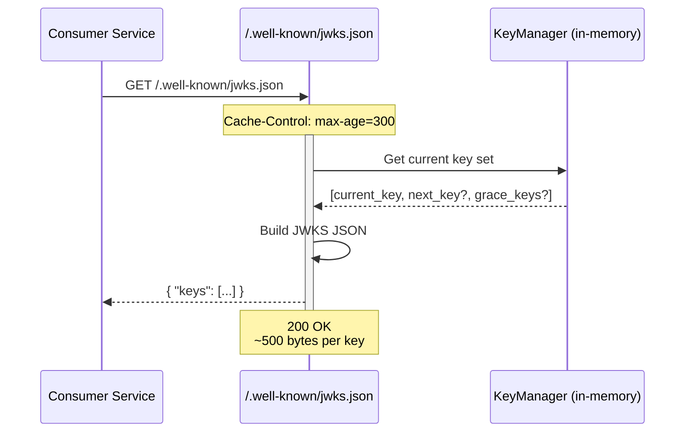
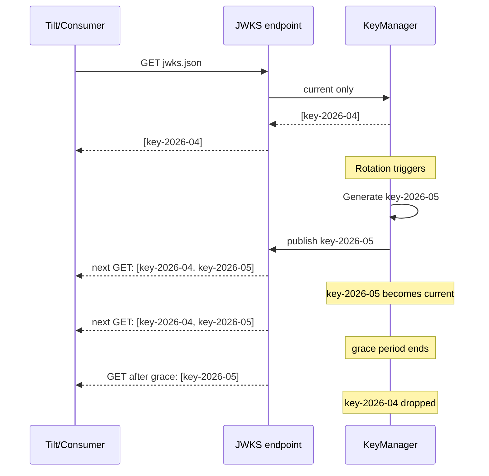

# Story 1.2: Implement JWKS Publication Endpoint

## Epic

[01-asymmetric-jwks](../JWT.md)

## Parent Epic Story

Story 1.2

## Summary

Implement the `/.well-known/jwks.json` endpoint that serves the current set of public signing keys in standard JWKS format (RFC 7517). The endpoint is near-static (cached, NEGLIGIBLE cost per topology design) and includes the `kid` for key identification by validating services.

## Why This Story Exists

> **Cross-reference:** Story 1.1 deferred ES256 co-default algorithm support to this story and Story 1.2. Story 1.1 deferred rate limiting on `/.well-known/jwks.json` directly to this story (already documented in its "Rate Limiting (F-009 Fix)" section). See Story 1.1's "Deferred Items" section for the full list.

The JWT document recommends publishing discovery metadata and a JWKS document so resource servers can validate tokens locally (RFC 8414 + OIDC Discovery). The generated runtime already supports `JwksBearerProvider` with issuer, audience, leeway, and cache TTL configuration. This story wires that runtime support to serve dynamic keys.

## Design Context

### Current State

- `identity-session-service` already declares `/.well-known/jwks.json` in its OpenAPI spec
- The service is classified as EXTREME frequency, NEGLIGIBLE per-request cost
- The generated runtime has `JwksBearerProvider` which serves JWKS for validation
- Currently the endpoint likely serves a static key or the development fallback

### JWKS Format (RFC 7517)

```json
{
  "keys": [
    {
      "kty": "EC",
      "crv": "P-256",
      "kid": "key-2026-05-01",
      "alg": "ES256",
      "x": "f83OJ3D2xF1Bg8vub9tLe1gHMzV76e8Tus9uPHvRVEU",
      "y": "x_FEzRu9m36HLN_tue659LNpXW6pCyStikYjKIWIPLA"
    }
  ]
}
```

### Key Points

- JWKS is a **set** of keys (not just one) to support overlapping rotation
- `kty` = "EC" for ES256, "OKP" for EdDSA, "RSA" for RS256
- `crv` specifies the curve (P-256, Ed25519)
- `alg` indicates the intended algorithm
- `kid` identifies which key to use for verification (matches `kid` in JWT header)

## Implementation Notes

### Endpoint Path

`GET /.well-known/jwks.json`

### Cache Behavior

The JWKS response is near-static and served from memory:
- The entire JWKS document is built from the current `KeyManager` state
- No database queries required
- Response is served directly from the in-memory key set
- HTTP `Cache-Control: public, max-age=300` (5 minutes, matches JWKS cache TTL from design doc section 10.11)

### Rate Limiting (F-009 Fix)

> **Note:** This is a **Deferred Item from Story 1.1**. Story 1.1 identified the risk but does not implement rate limiting; Story 1.2 owns this requirement.

The JWKS endpoint is public and has no authentication. Without rate limiting, an attacker could:
- Send hundreds of requests/second to exhaust NGINX worker connections
- Force repeated JSON serialization, consuming CPU
- Amplify a DoS against identity-session-service

**Rate limit configuration:**
- 100 requests/second per IP (global, not per-route)
- Return 429 Too Many Requests when exceeded
- Log rate limit violations for security monitoring
- Implement using NGINX `limit_req` or application-level middleware (e.g., `tower_http::limit::RateLimitLayer`)

**NGINX rate limit config:**
```nginx
limit_req_zone $binary_remote_addr zone=jwks_limit:10m rate=100r/s;

location /.well-known/jwks.json {
    limit_req zone=jwks_limit burst=50 nodelay;
    ...
}
```

**Acceptance criteria:** This story must implement the above rate limiting. Without it, the JWKS endpoint is vulnerable to DoS (see HACK-121 in Story 1.1).

### Key Set Construction

On each request:
1. Clone the current `KeyManager` state
2. Build JWKS JSON from all keys currently in the manager (current, next, and any in grace period)
3. Return JSON response

This ensures:
- The JWKS always contains at least one valid key
- During rotation, both old and new keys are visible
- After grace period, only the current key is visible

### Response Headers

| Header | Value | Reason |
|--------|-------|--------|
| `Content-Type` | `application/json` | Standard for JWKS |
| `Cache-Control` | `public, max-age=300` | 5-minute cache, matches JWKS cache TTL |
| `X-Content-Type-Options` | `nosniff` | Prevent MIME sniffing |
| `Vary` | `Accept` | Support future content negotiation |

### Content Size

Expected response size: ~500 bytes per key. With 1-2 keys during normal operation and 2-3 during rotation, the response is well under 2KB. This fits comfortably within:
- NGINX default `client_header_buffer_size`: 1KB (JWKS is served, not requested, so this applies to request headers, not response)
- Apache `LimitRequestFieldSize`: 8190 bytes (same, applies to requests)
- The response body is not subject to these limits -- only request headers are

## Mermaid Diagrams

### JWKS Serving Flow



### Key Publication During Rotation



## Malicious Hacker Gotchas (Must Be Addressed During Implementation)

> **Source:** `docs/PRS_SECURITY_HARDENING.md` — Security threat model analysis

### HACK-121: JWKS Endpoint Exposed for Offline Cryptanalysis (CRITICAL — Hole #1 from PRS)

**Risk:** Attacker continuously scrapes the JWKS endpoint to collect all historical public keys for offline brute-force attacks

The story says: "JWKS is a public endpoint by design — this is correct. Public keys ARE public." But the attacker can use the collected public keys to:
1. Verify tokens signed with old keys (during rotation windows)
2. Perform timing analysis on the JWKS endpoint to detect when key rotations occur
3. Map the key rotation schedule to understand which tokens are valid during overlap windows

**Exploit path (rotation schedule mapping):**
1. Attacker scrapes the JWKS endpoint every 10 seconds
2. At T=0: endpoint returns `[key_A]` (only old key)
3. At T=60: endpoint returns `[key_A, key_B]` (new key published — rotation detected)
4. At T=300: endpoint returns `[key_B]` (old key removed — grace period ended)
5. Attacker now knows: rotation happens every 240 seconds, grace period is 240 seconds
6. Attacker can predict WHEN the next rotation occurs and target tokens during the overlap window
7. Result: Attacker knows the precise window during which old keys are valid and can be used for token forgery (if they obtained the old private key)

**The key insight:** The JWKS endpoint leaks the ENTIRE key lifecycle — when keys are published, when they're rotated, and when they expire. This information helps an attacker plan attacks around the rotation schedule.

**Implementation requirement:**
- Add `Cache-Control: public, max-age=300` to JWKS responses (the story already does this — CORRECT)
- Add `ETag` header to JWKS responses so clients can use `If-None-Match` and reduce endpoint traffic
- Alert on JWKS endpoint request rate anomalies: if a single IP requests JWKS more than 100 times per minute, BLOCK that IP
- Consider: the JWKS endpoint should NOT reveal the grace period timing — it should publish new keys early enough that consumers pick them up via their cache, but the exact rotation timing should not be predictable
- Document: "JWKS endpoint is public by design. Cache-Control header prevents unnecessary requests. Rate-limit anomalous scraping."

### HACK-122: NGINX Rate Limit Bypass via IP Rotation (HIGH — related to Hole #5 from PRS)

**Risk:** Attacker bypasses the 100 req/s NGINX rate limit using multiple IPs (e.g., from a botnet or proxy rotation)

The story says: `limit_req_zone $binary_remote_addr zone=jwks_limit:10m rate=100r/s`. The `$binary_remote_addr` uses the direct client IP, which can be spoofed or rotated.

**Exploit path:**
1. Attacker rotates their IP address (e.g., using a proxy service with 1000 IPs)
2. Each IP gets its own 100 req/s allocation
3. Total throughput: 1000 IPs × 100 req/s = 100,000 req/s to the JWKS endpoint
4. Even though the JSON serialization is fast, 100K req/s still generates significant load
5. Result: DoS against the JWKS endpoint (even though public keys are "low risk")

**The real risk is different:** The JWKS endpoint is served from memory (in-memory KeyManager). The JSON serialization of a JWKS document takes ~100 microseconds. At 100K req/s, that's 10 req/s × CPU. Not actually DoS.

**But the real risk is:** What if an attacker sends a malformed JWKS request (e.g., with a very large `Accept` header or unusual headers) that causes the JSON serializer to behave unexpectedly?

**Exploit path (header-based memory exhaustion):**
1. Attacker sends a JWKS request with an `Accept` header containing 10MB of data
2. If the handler tries to parse or validate this header, it may allocate significant memory
3. At 100K req/s (bypassing rate limit), this could exhaust memory
4. Result: DoS

**Implementation requirement:**
- The JWKS handler MUST validate the `Accept` header (or reject any `Accept` header larger than 256 bytes)
- The JWKS handler MUST reject any request with `Content-Length` or `Transfer-Encoding` headers (GET requests should not have a body)
- Add a global request body size limit at the NGINX level: `client_max_body_size 0` (no body for GET)
- Add a global header size limit at the NGINX level: `large_client_header_buffers 4 8k`
- Document: "JWKS endpoint validates request headers and rejects oversized headers or unexpected body methods."

### HACK-123: JWKS Endpoint Used as a Token Verification Oracle (MEDIUM — related to Hole #4 from PRS)

**Risk:** Attacker uses the JWKS endpoint to verify whether a token's `kid` is valid, enabling token enumeration

The story says: "JWKS serves the current set of public signing keys." An attacker can send a JWT with a specific `kid` in the header and check if that `kid` appears in the JWKS response. If it does, the token was signed with a valid key.

**Exploit path (key validity oracle):**
1. Attacker has a forged JWT with `kid: "forged_key_xyz"`
2. Attacker checks the JWKS endpoint: is `forged_key_xyz` in the keys array?
3. If yes → the key is valid, and the attacker knows they need to find the corresponding private key
4. If no → the key is not published, and the forged token will fail validation
5. Result: The JWKS endpoint acts as a "is this key valid?" oracle, helping the attacker narrow down valid key IDs

**But this is actually CORRECT behavior:** The JWKS endpoint is SUPPOSED to publish which keys are valid. This is RFC 7517 — the purpose of JWKS is to tell consumers which keys to use. The attacker using this information to plan further attacks is a normal part of security testing.

**The real exploit is different:** What if the attacker can use the JWKS endpoint to determine the EXACT TIMING of key rotations?

**Exploit path (key rotation timing oracle):**
1. Attacker scrapes the JWKS endpoint continuously
2. Attacker detects the EXACT second when a new key appears in the JWKS
3. This tells the attacker the precise rotation timing
4. If the attacker has a compromised private key, they know the EXACT window during which the compromised key is still valid
5. Result: precise timing for token forgery during the overlap window

**Implementation requirement:**
- The JWKS endpoint already serves from memory with `Cache-Control: max-age=300`. This means the JWKS response is cached at the client/consumer level for 5 minutes.
- The key insight: consumers CANNOT detect rotation faster than the 5-minute cache. So even if the attacker knows the exact rotation time, they can't act faster than 5 minutes.
- This is an inherent trade-off: the stale tolerance (Story 7.1) allows 15-minute stale key validation, which creates a 15-minute window where forged tokens with old keys are accepted.
- Document: "JWKS endpoint is an oracle by design (RFC 7517). Consumers cache JWKS for 5 minutes, limiting the precision of rotation detection."

---

## OpenAPI Changes

Add to `openapi/idam/identity-session-service/openapi.yaml`:

```yaml
paths:
  /.well-known/jwks.json:
    get:
      summary: JSON Web Key Set
      operationId: getJwks
      description: |
        Returns the current set of public signing keys in JWKS format (RFC 7517).
        Use this endpoint to validate JWT signatures. Keys may include current,
        next (preparing for rotation), and grace-period keys.
      responses:
        '200':
          description: JWKS document
          content:
            application/json:
              schema:
                type: object
                required: [keys]
                properties:
                  keys:
                    type: array
                    items:
                      $ref: '#/components/schemas/JsonWebKey'
```

Add new schema:

```yaml
components:
  schemas:
    JsonWebKey:
      type: object
      required: [kty, kid, alg, crv, x, y]
      properties:
        kty:
          type: string
          description: Key type (EC, OKP, RSA)
        kid:
          type: string
          description: Key identifier
        alg:
          type: string
          description: Intended algorithm (ES256, EdDSA, RS256)
        crv:
          type: string
          description: Curve (P-256, Ed25519)
        x:
          type: string
          description: X coordinate (base64url-encoded)
        y:
          type: string
          description: Y coordinate (base64url-encoded, EC only)
```

## Design Doc References

- `design-doc.md` section 10.2: Asymmetric Signing & JWKS
- `design-doc.md` section 10.11: Caching Strategy -- JWKS cache 5-minute TTL
- `service-topology-design.md`: identity-session-service serves `/.well-known/jwks.json` (EXTREME freq, NEGLIGIBLE cost)
- `design-doc.md` section 10.1: Token Security -- Key management property
- `design-doc.md` section 6.2: JWT Schema -- `kid` field in JWT header

## Wiki Pages to Update/Create

- `topics/topic-jwt-schema.md`: Add JWKS endpoint reference
- `topics/topic-token-lifecycle.md`: (new) Document key rotation lifecycle

## Acceptance Criteria

- [ ] `GET /.well-known/jwks.json` returns valid JWKS JSON (RFC 7517)
- [ ] Response includes all current and grace-period keys
- [ ] Each key includes `kty`, `kid`, `alg`, `crv`, and coordinate fields
- [ ] Response includes `Cache-Control: public, max-age=300`
- [ ] During key rotation, both old and new keys appear in the JWKS
- [ ] After the grace period, the old key is removed from the JWKS
- [ ] Response size is under 2KB (1-2 keys normal, 2-3 during rotation)
- [ ] Response is served from in-memory key set (no database queries)
- [ ] The endpoint has NEGLIGIBLE per-request cost (served from memory)

## Dependencies

- Depends on Story 1.1 (key generation and KeyManager)
- Required by Story 1.3 (other services fetch JWKS to validate tokens)

## Risk / Trade-offs

- **JWKS endpoint is public**: It does not require authentication. This is by design -- public key material should be discoverable. The risk is minimal since it only contains public keys.
- **Response is unversioned**: The JWKS doesn't include a `version` or `updated_at` field. Consumers must rely on `Cache-Control` headers. A `jku` (JWK Set URL) claim in the JWT itself could provide the authoritative source, but this adds complexity.
- **Single endpoint**: All services share one JWKS endpoint. If identity-session-service is down, no service can validate new tokens. This is acceptable because identity-session-service is classified as HIGH frequency and should be highly available.

## Tests

### Unit Tests

- [ ] **JWKS response parses as valid RFC 7517**: Construct a JWKS document from `KeyManager` with known keys and assert the JSON structure matches RFC 7517 — `keys` is an array, each element has `kty`, `kid`, `alg`, and curve-specific fields (`x`/`y` for EC, `x` for OKP)
- [ ] **Single key yields correct response**: With only 1 key in `KeyManager`, verify JWKS contains exactly 1 entry in `keys` array
- [ ] **Rotation yields 2 keys**: After key rotation prepares the next key, verify `keys` array has 2 entries (current + next)
- [ ] **Grace period yields 3 keys**: During the overlap window, verify `keys` array has 3 entries (current + next + old grace key)
- [ ] **Post-grace cleanup yields 1 key**: After grace period expires, verify only the current key remains
- [ ] **Response size budget**: Serialize the JWKS to JSON and assert the byte count is under 2 KB (1-2 keys normal)
- [ ] **Cache-Control header**: The endpoint handler MUST include `Cache-Control: public, max-age=300` and `X-Content-Type-Options: nosniff`

### Integration Tests (BDD-style with `rstest_bdd`)

- [ ] **Scenario: JWKS serves current key**: `given` an identity-session-service with 1 active key → `when` a consumer calls `GET /.well-known/jwks.json` → `then` the response is 200 OK with valid JWKS JSON containing exactly that key's `kid` and `alg`
- [ ] **Scenario: JWKS serves rotating keys**: `given` a KeyManager with 3 keys (current, next, grace) → `when` `GET /.well-known/jwks.json` is called → `then` the response contains 3 entries with distinct `kid` values
- [ ] **Scenario: Cache-Control header present**: `given` a JWKS endpoint → `when` a request is made → `then` the `Cache-Control` header is exactly `public, max-age=300`
- [ ] **Scenario: No DB queries during JWKS serve**: `given` a JWKS endpoint with database connections tracked → `when` a request is made → `then` zero database queries are executed (JWKS is served entirely from in-memory KeyManager state)
- [ ] **Scenario: JWKS response is not a valid JWT**: Verify the JWKS response itself cannot be used as a JWT token (different structure, no JWS signature)

### Security Regression Tests

- [ ] **JWKS endpoint requires no auth**: Verify the endpoint returns 200 without any `Authorization` header — it IS public by design
- [ ] **JWKS contains no private key material**: Parse the JWKS response and assert `d` (private key) field is NEVER present — only public key fields (`x`, `y` for EC; `x` for OKP)
- [ ] **JWKS response Content-Type**: Verify `Content-Type: application/json` is set (not `text/html` or anything else)

### Edge Cases

- [ ] **Empty key manager**: If `KeyManager` has no keys (edge case during init), the endpoint should return `{ "keys": [] }` (not 500)
- [ ] **Concurrent requests**: Send 100 concurrent requests to the JWKS endpoint and verify all succeed with identical content
- [ ] **Large number of keys**: Inject 10 keys into the manager (simulating extended rotation bugs) and verify the response is still under the size budget and parses correctly

### Cleanup

- No cleanup required — JWKS endpoint is stateless; it reads from in-memory `KeyManager` and does not modify state
- Integration tests must ensure no stale `KeyManager` state leaks between test scenarios (instantiate a fresh `KeyManager` per test or use a `Drop` impl)

### Spec Verification

- [ ] OpenAPI spec defines `GET /.well-known/jwks.json` with 200 response containing `JsonWebKey` schema
- [ ] `JsonWebKey` schema has required fields: `kty`, `kid`, `alg`, `crv`, and coordinate fields
