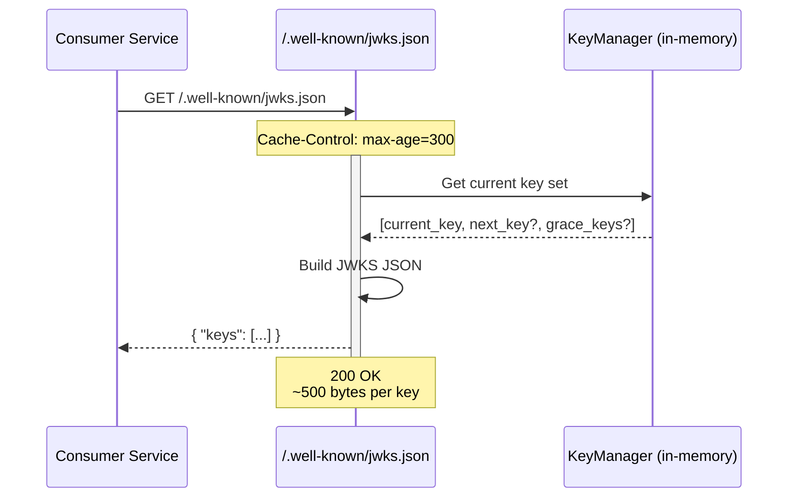
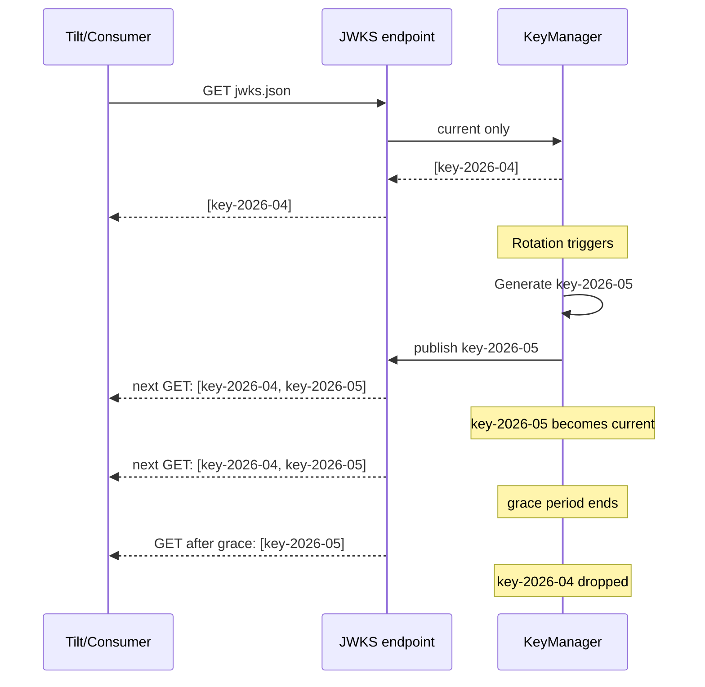

# Story 1.2: Implement JWKS Publication Endpoint

## Epic

[01-asymmetric-jwks](../JWT.md)

## Parent Epic Story

Story 1.2

## Summary

Implement the `/.well-known/jwks.json` endpoint that serves the current set of public signing keys in standard JWKS format (RFC 7517). The endpoint is near-static (cached, NEGLIGIBLE cost per topology design) and includes the `kid` for key identification by validating services.

## Why This Story Exists

The JWT document recommends publishing discovery metadata and a JWKS document so resource servers can validate tokens locally (RFC 8414 + OIDC Discovery). The generated runtime already supports `JwksBearerProvider` with issuer, audience, leeway, and cache TTL configuration. This story wires that runtime support to serve dynamic keys.

## Design Context

### Current State

- `identity-session-service` already declares `/.well-known/jwks.json` in its OpenAPI spec
- The service is classified as EXTREME frequency, NEGLIGIBLE per-request cost
- The generated runtime has `JwksBearerProvider` which serves JWKS for validation
- Currently the endpoint likely serves a static key or the development fallback

### JWKS Format (RFC 7517)

```json
{
  "keys": [
    {
      "kty": "EC",
      "crv": "P-256",
      "kid": "key-2026-05-01",
      "alg": "ES256",
      "x": "f83OJ3D2xF1Bg8vub9tLe1gHMzV76e8Tus9uPHvRVEU",
      "y": "x_FEzRu9m36HLN_tue659LNpXW6pCyStikYjKIWIPLA"
    }
  ]
}
```

### Key Points

- JWKS is a **set** of keys (not just one) to support overlapping rotation
- `kty` = "EC" for ES256, "OKP" for EdDSA, "RSA" for RS256
- `crv` specifies the curve (P-256, Ed25519)
- `alg` indicates the intended algorithm
- `kid` identifies which key to use for verification (matches `kid` in JWT header)

## Implementation Notes

### Endpoint Path

`GET /.well-known/jwks.json`

### Cache Behavior

The JWKS response is near-static and served from memory:
- The entire JWKS document is built from the current `KeyManager` state
- No database queries required
- Response is served directly from the in-memory key set
- HTTP `Cache-Control: public, max-age=300` (5 minutes, matches JWKS cache TTL from design doc section 10.11)

### Rate Limiting (F-009 Fix)

The JWKS endpoint is public and has no authentication. Without rate limiting, an attacker could:
- Send hundreds of requests/second to exhaust NGINX worker connections
- Force repeated JSON serialization, consuming CPU
- Amplify a DoS against identity-session-service

**Rate limit configuration:**
- 100 requests/second per IP (global, not per-route)
- Return 429 Too Many Requests when exceeded
- Log rate limit violations for security monitoring
- Implement using NGINX `limit_req` or application-level middleware (e.g., `tower_http::limit::RateLimitLayer`)

**NGINX rate limit config:**
```nginx
limit_req_zone $binary_remote_addr zone=jwks_limit:10m rate=100r/s;

location /.well-known/jwks.json {
    limit_req zone=jwks_limit burst=50 nodelay;
    ...
}
```

### Key Set Construction

On each request:
1. Clone the current `KeyManager` state
2. Build JWKS JSON from all keys currently in the manager (current, next, and any in grace period)
3. Return JSON response

This ensures:
- The JWKS always contains at least one valid key
- During rotation, both old and new keys are visible
- After grace period, only the current key is visible

### Response Headers

| Header | Value | Reason |
|--------|-------|--------|
| `Content-Type` | `application/json` | Standard for JWKS |
| `Cache-Control` | `public, max-age=300` | 5-minute cache, matches JWKS cache TTL |
| `X-Content-Type-Options` | `nosniff` | Prevent MIME sniffing |
| `Vary` | `Accept` | Support future content negotiation |

### Content Size

Expected response size: ~500 bytes per key. With 1-2 keys during normal operation and 2-3 during rotation, the response is well under 2KB. This fits comfortably within:
- NGINX default `client_header_buffer_size`: 1KB (JWKS is served, not requested, so this applies to request headers, not response)
- Apache `LimitRequestFieldSize`: 8190 bytes (same, applies to requests)
- The response body is not subject to these limits -- only request headers are

## Mermaid Diagrams

### JWKS Serving Flow



### Key Publication During Rotation



## OpenAPI Changes

Add to `openapi/idam/identity-session-service/openapi.yaml`:

```yaml
paths:
  /.well-known/jwks.json:
    get:
      summary: JSON Web Key Set
      operationId: getJwks
      description: |
        Returns the current set of public signing keys in JWKS format (RFC 7517).
        Use this endpoint to validate JWT signatures. Keys may include current,
        next (preparing for rotation), and grace-period keys.
      responses:
        '200':
          description: JWKS document
          content:
            application/json:
              schema:
                type: object
                required: [keys]
                properties:
                  keys:
                    type: array
                    items:
                      $ref: '#/components/schemas/JsonWebKey'
```

Add new schema:

```yaml
components:
  schemas:
    JsonWebKey:
      type: object
      required: [kty, kid, alg, crv, x, y]
      properties:
        kty:
          type: string
          description: Key type (EC, OKP, RSA)
        kid:
          type: string
          description: Key identifier
        alg:
          type: string
          description: Intended algorithm (ES256, EdDSA, RS256)
        crv:
          type: string
          description: Curve (P-256, Ed25519)
        x:
          type: string
          description: X coordinate (base64url-encoded)
        y:
          type: string
          description: Y coordinate (base64url-encoded, EC only)
```

## Design Doc References

- `design-doc.md` section 10.2: Asymmetric Signing & JWKS
- `design-doc.md` section 10.11: Caching Strategy -- JWKS cache 5-minute TTL
- `service-topology-design.md`: identity-session-service serves `/.well-known/jwks.json` (EXTREME freq, NEGLIGIBLE cost)
- `design-doc.md` section 10.1: Token Security -- Key management property
- `design-doc.md` section 6.2: JWT Schema -- `kid` field in JWT header

## Wiki Pages to Update/Create

- `topics/topic-jwt-schema.md`: Add JWKS endpoint reference
- `topics/topic-token-lifecycle.md`: (new) Document key rotation lifecycle

## Acceptance Criteria

- [ ] `GET /.well-known/jwks.json` returns valid JWKS JSON (RFC 7517)
- [ ] Response includes all current and grace-period keys
- [ ] Each key includes `kty`, `kid`, `alg`, `crv`, and coordinate fields
- [ ] Response includes `Cache-Control: public, max-age=300`
- [ ] During key rotation, both old and new keys appear in the JWKS
- [ ] After the grace period, the old key is removed from the JWKS
- [ ] Response size is under 2KB (1-2 keys normal, 2-3 during rotation)
- [ ] Response is served from in-memory key set (no database queries)
- [ ] The endpoint has NEGLIGIBLE per-request cost (served from memory)

## Dependencies

- Depends on Story 1.1 (key generation and KeyManager)
- Required by Story 1.3 (other services fetch JWKS to validate tokens)

## Risk / Trade-offs

- **JWKS endpoint is public**: It does not require authentication. This is by design -- public key material should be discoverable. The risk is minimal since it only contains public keys.
- **Response is unversioned**: The JWKS doesn't include a `version` or `updated_at` field. Consumers must rely on `Cache-Control` headers. A `jku` (JWK Set URL) claim in the JWT itself could provide the authoritative source, but this adds complexity.
- **Single endpoint**: All services share one JWKS endpoint. If identity-session-service is down, no service can validate new tokens. This is acceptable because identity-session-service is classified as HIGH frequency and should be highly available.

## Tests

### Unit Tests

- [ ] **JWKS response parses as valid RFC 7517**: Construct a JWKS document from `KeyManager` with known keys and assert the JSON structure matches RFC 7517 — `keys` is an array, each element has `kty`, `kid`, `alg`, and curve-specific fields (`x`/`y` for EC, `x` for OKP)
- [ ] **Single key yields correct response**: With only 1 key in `KeyManager`, verify JWKS contains exactly 1 entry in `keys` array
- [ ] **Rotation yields 2 keys**: After key rotation prepares the next key, verify `keys` array has 2 entries (current + next)
- [ ] **Grace period yields 3 keys**: During the overlap window, verify `keys` array has 3 entries (current + next + old grace key)
- [ ] **Post-grace cleanup yields 1 key**: After grace period expires, verify only the current key remains
- [ ] **Response size budget**: Serialize the JWKS to JSON and assert the byte count is under 2 KB (1-2 keys normal)
- [ ] **Cache-Control header**: The endpoint handler MUST include `Cache-Control: public, max-age=300` and `X-Content-Type-Options: nosniff`

### Integration Tests (BDD-style with `rstest_bdd`)

- [ ] **Scenario: JWKS serves current key**: `given` an identity-session-service with 1 active key → `when` a consumer calls `GET /.well-known/jwks.json` → `then` the response is 200 OK with valid JWKS JSON containing exactly that key's `kid` and `alg`
- [ ] **Scenario: JWKS serves rotating keys**: `given` a KeyManager with 3 keys (current, next, grace) → `when` `GET /.well-known/jwks.json` is called → `then` the response contains 3 entries with distinct `kid` values
- [ ] **Scenario: Cache-Control header present**: `given` a JWKS endpoint → `when` a request is made → `then` the `Cache-Control` header is exactly `public, max-age=300`
- [ ] **Scenario: No DB queries during JWKS serve**: `given` a JWKS endpoint with database connections tracked → `when` a request is made → `then` zero database queries are executed (JWKS is served entirely from in-memory KeyManager state)
- [ ] **Scenario: JWKS response is not a valid JWT**: Verify the JWKS response itself cannot be used as a JWT token (different structure, no JWS signature)

### Security Regression Tests

- [ ] **JWKS endpoint requires no auth**: Verify the endpoint returns 200 without any `Authorization` header — it IS public by design
- [ ] **JWKS contains no private key material**: Parse the JWKS response and assert `d` (private key) field is NEVER present — only public key fields (`x`, `y` for EC; `x` for OKP)
- [ ] **JWKS response Content-Type**: Verify `Content-Type: application/json` is set (not `text/html` or anything else)

### Edge Cases

- [ ] **Empty key manager**: If `KeyManager` has no keys (edge case during init), the endpoint should return `{ "keys": [] }` (not 500)
- [ ] **Concurrent requests**: Send 100 concurrent requests to the JWKS endpoint and verify all succeed with identical content
- [ ] **Large number of keys**: Inject 10 keys into the manager (simulating extended rotation bugs) and verify the response is still under the size budget and parses correctly

### Cleanup

- No cleanup required — JWKS endpoint is stateless; it reads from in-memory `KeyManager` and does not modify state
- Integration tests must ensure no stale `KeyManager` state leaks between test scenarios (instantiate a fresh `KeyManager` per test or use a `Drop` impl)

### Spec Verification

- [ ] OpenAPI spec defines `GET /.well-known/jwks.json` with 200 response containing `JsonWebKey` schema
- [ ] `JsonWebKey` schema has required fields: `kty`, `kid`, `alg`, `crv`, and coordinate fields
