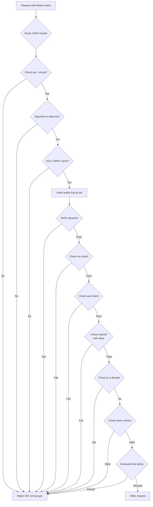
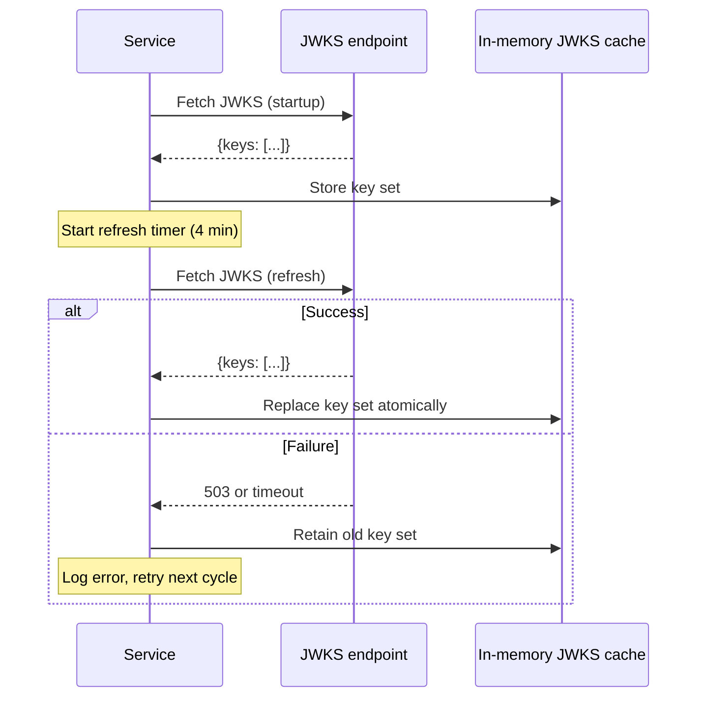
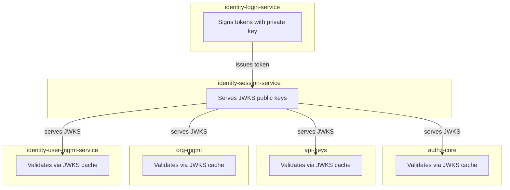

# Story 1.3: Wire All Services to Validate JWTs via JWKS

## Epic

[01-asymmetric-jwks](../JWT.md)

## Parent Epic Story

Story 1.3

## Summary

Wire all 6 services (identity-login-service, identity-session-service, identity-user-mgmt-service, authz-core, api-keys, org-mgmt) to validate JWTs using the JWKS-based `JwksBearerProvider`. Each service fetches the JWKS from identity-session-service on startup, caches it for 5 minutes, and uses it to validate token signatures locally. This eliminates the need for every service to hold the shared `JWT_SECRET`.

## Why This Story Exists

The JWT document flags "shared-secret blast radius" as a critical security issue. With HS256, every validating service also has the signing key. With JWKS-based validation, only the identity-login-service holds the private key; all other services use only the public key. This story wires the existing `JwksBearerProvider` runtime support to all services.

## Design Context

### Current State

- JWT claims module signs with HS256 from shared `JWT_SECRET`
- Generated runtime contains `JwksBearerProvider` support (not wired)
- Generated runtime contains development fallback `BearerJwtProvider` using simple signature string
- All services that validate JWTs currently share the same symmetric key
- `config.yaml` exposes JWKS configuration settings but they are not wired

### Validation Pipeline (RFC 9068) -- CRITICAL: Pipeline Ordering

The validation pipeline MUST be executed in the exact order below. This is NOT optional -- the ordering prevents specific attack vectors:

```
1. Parse JOSE header              -- Extract typ, alg, kid before ANY trust decision
2. Require typ = at+jwt           -- Reject type confusion (F-002) BEFORE signature check
3. Require algorithm from allow   -- Reject alg: none, reject HS256, reject unexpected alg
4. Choose key by kid from JWKS    -- Select public key for verification
5. Verify signature               -- CRYPTOGRAPHIC TRUST DECISION POINT
6. Validate iss, aud, exp, nbf    -- Claim validation (after trust is established)
7. Reject if jti in local deny    -- Revocation check (optimization only, NEVER bypass step 5)
8. Compare token ver to cached    -- Version check for high-risk routes
9. Evaluate local policy from     -- Authorization decision
10. If high-risk route: call      -- Selective online fallback
```

**F-002 Fix: extract_jti deprecation.** The existing repo's `extract_jti` helper that disables signature validation to pre-check denylists MUST be removed or deprecated. If retained as a pre-validation optimization:
- It MUST NEVER be used in production validation logic
- It MUST be behind a feature flag `DISABLE_EXTRACT_JTI=true` by default
- It MUST have a clear comment: "WARNING: signature validation disabled. Do NOT use as trust decision path."
- The canonical `validate_jti` check (step 7 above) MUST always follow step 5 (signature verification)

**Zero-trust principle**: Steps 1-4 are pre-trust. Step 5 is the ONLY trust decision. Steps 6-10 operate on established trust. The `extract_jti` helper inverts this and MUST be eliminated.

### Algorithm Allow-List

| Algorithm | Supported | Reason |
|-----------|-----------|--------|
| ES256 | Yes | Default algorithm |
| EdDSA | Planned | Second algorithm for future |
| RS256 | Optional | For legacy consumers; requires review |
| HS256 | **No** (deprecated) | Shared-secret blast radius |
| `alg: none` | **Never** | RFC 8725 rejection |

| Service | Issuer | Audience | Cache TTL | Clock Skew | Rate Limit |
|---------|--------|----------|-----------|------------|------------|
| identity-login-service | `https://idam.example.com` | `["myapp.com"]` | 5 min | 60s | N/A (signer) |
| identity-session-service | `https://idam.example.com` | `["myapp.com"]` | 5 min | 60s | **N/A — serves JWKS** |
| identity-user-mgmt-service | `https://idam.example.com` | `["myapp.com"]` | 5 min | 60s | **100 req/s** (F-009) |
| authz-core | `https://idam.example.com` | `["authz-core.myapp.com"]` | 5 min | 60s | **100 req/s** (F-009) |
| api-keys | `https://idam.example.com` | `["api-keys.myapp.com"]` | 5 min | 60s | **100 req/s** (F-009) |
| org-mgmt | `https://idam.example.com` | `["org-mgmt.myapp.com"]` | 5 min | 60s | **100 req/s** (F-009) |

**F-009 Fix: JWKS endpoint rate limiting.** Rate limiting is applied to the JWKS endpoint (`/.well-known/jwks.json`) only — it is the only unauthenticated endpoint and the only one with no operational reason for high request volume.

**F-011 Fix: Key health monitoring.** Add a health check endpoint to the identity-session-service:

```
GET /health/jwks
```

This endpoint returns:
```json
{
  "keys": [
    {
      "kid": "key-2026-05-01",
      "alg": "EdDSA",
      "age_seconds": 2592000,
      "active": true
    },
    {
      "kid": "key-2026-06-01",
      "alg": "EdDSA",
      "age_seconds": 0,
      "active": true
    }
  ],
  "key_count": 2,
  "last_rotation": "2026-06-01T00:00:00Z",
  "next_rotation": "2026-07-01T00:00:00Z"
}
```

**Alerting rules:**
- **CRITICAL**: `key_count == 1` for more than 10 minutes (should be 2 during overlap window — rotation has failed)
- **WARNING**: `key_count == 0` (no keys at all — service misconfigured or crashed during key generation)
- **WARNING**: `last_rotation` is more than 35 days ago (rotation has not occurred — possible stuck rotation timer)
- **CRITICAL**: JWKS endpoint health check returns non-200 (endpoint is down)

## Implementation Notes

### Initialization Sequence

1. Service starts
2. Fetch JWKS from `identity-session-service/.well-known/jwks.json`
3. Validate the response is valid JWKS JSON
4. Cache the key set locally (in-memory, 5-minute TTL)
5. Start a background task to refresh the JWKS every 4 minutes (before TTL expires)
6. On JWKS refresh: validate the new set, replace the old set atomically
7. On refresh failure: retain the old set (stale but better than nothing)

### Error Handling

| Scenario | Behavior |
|----------|----------|
| JWKS fetch fails at startup | Log error, return 503, use cached keys from previous run (if any) |
| JWKS refresh fails | Retain cached keys, log error, retry on next cycle |
| Token has unknown `kid` | Log warning, return 401 "invalid token" |
| Token signature fails to verify | Log error, return 401 "invalid token" |
| `typ` is not `at+jwt` | Reject immediately (RFC 9068 compliance) |
| `alg` is not in allow-list | Reject immediately (RFC 8725 compliance) |
| `iss` does not match | Reject immediately |
| `aud` does not contain expected | Reject immediately |
| `exp` is past (with 60s skew) | Reject immediately |
| `nbf` is future (with 60s skew) | Reject immediately |

### Metrics to Track

| Metric | Labels | Description |
|--------|--------|-------------|
| `jwks_fetch_total` | {result: "success", "failure"} | JWKS fetch attempts |
| `jwks_cache_hit_total` | - | JWTs validated from cached JWKS |
| `jwt_validation_total` | {result: "valid", "invalid"}, {reason: "exp", "sig", "iss", "aud", "typ", "alg", "kid"} | Validation results |
| `jwt_validation_latency_ms` | - | Time to validate a JWT |

## Mermaid Diagrams

### Validation Pipeline



### JWKS Refresh Cycle



### Multi-Service Validation



## OpenAPI Changes

No OpenAPI changes needed for validation (internal operation). However, the OpenAPI specs should document that all protected endpoints accept `Bearer` tokens validated via JWKS, not just API keys.

Change from:
```yaml
security:
  - ApiKeyHeader: []
```

To:
```yaml
security:
  - ApiKeyHeader: []
  - bearerAuth: []
```

Add to components/securitySchemes:
```yaml
bearerAuth:
  type: http
  scheme: bearer
  bearerFormat: JWT
  description: JWT validated via JWKS at /.well-known/jwks.json
```

## Design Doc References

- `design-doc.md` section 10.2: Asymmetric Signing & JWKS -- algorithm allow-list, `typ` enforcement, `iss`/`aud` validation
- `design-doc.md` section 10.11: Caching Strategy -- JWKS cache 5-minute TTL
- `design-doc.md` section 10.12: Observability -- `jwks_cache_hit_ratio`, `jwks_refresh_failures_total`, `jwt_validation_latency_ms`
- `design-doc.md` section 6.2: JWT Schema -- `alg`, `typ`, `kid`, `iss`, `aud`, `exp`, `nbf`, `jti` claims
- `service-topology-design.md`: All services that validate JWTs need JWKS configuration

## Wiki Pages to Update/Create

- `topics/topic-jwt-schema.md`: Document validation requirements per claim
- `topics/topic-authorization-flow.md`: Note JWKS cache TTL (5 minutes)
- `topics/topic-token-lifecycle.md`: (new) Document validation pipeline

## Acceptance Criteria

- [ ] All 6 services that receive JWTs validate them via JWKS
- [ ] Each service fetches JWKS on startup, caches for 5 minutes
- [ ] `typ` is validated to equal `at+jwt`; tokens with wrong `typ` are rejected
- [ ] Algorithm is validated against allow-list; `alg: none` is explicitly rejected
- [ ] `iss` is validated against expected issuer
- [ ] `aud` is validated to contain expected audience
- [ ] `exp` and `nbf` are validated with 60-second clock skew
- [ ] Unknown `kid` in JWT header returns 401 "invalid token"
- [ ] JWKS refresh failure retains the old key set (graceful degradation)
- [ ] Metrics: `jwks_cache_hit_ratio` and `jwks_refresh_failures_total` are emitted
- [ ] Metrics: `jwt_validation_total{result,reason}` and `jwt_validation_latency_ms` are emitted
- [ ] No service holds the HS256 shared secret for JWT validation

## Dependencies

- Depends on Story 1.1 (key generation) and Story 1.2 (JWKS endpoint)
- Required for all downstream epics (Epic 2 claims schema, Epic 4 hybrid authz)

## Risk / Trade-offs

- **JWKS refresh failure**: If identity-session-service is down during refresh, services retain stale JWKS. This is acceptable -- stale keys are valid until token expiry. The risk is that a rotated-out key remains in the cache, but since keys are in-memory only and rotated on schedule, this window is short.
- **Clock skew tolerance**: 60 seconds is generous but safe. NTP drift on Linux is typically under 100ms, so 60s is a safety margin for clock changes, not drift.
- **Algorithm allow-list**: Starting with only ES256. If EdDSA or RS256 is added later, they are added to the allow-list without breaking existing tokens.

## Tests

### Unit Tests

- [ ] **typ enforcement rejects wrong type**: Given a valid JWT with `typ: refresh+token`, assert the validation pipeline returns 401 with reason `invalid_token_type` — the pipeline checks `typ` BEFORE any signature verification
- [ ] **typ enforcement rejects missing typ**: Given a valid JWT with no `typ` header field, assert rejection with reason `invalid_token_type`
- [ ] **typ enforcement accepts `at+jwt`**: Given a valid JWT with `typ: at+jwt`, assert the pipeline passes the type check and continues to signature verification
- [ ] **Algorithm allow-list rejects `alg: none`**: Given a JWT with `alg: none` in the header, assert the pipeline rejects immediately with reason `algorithm_not_allowed` (RFC 8725 compliance)
- [ ] **Algorithm allow-list rejects HS256**: Given a JWT signed with HS256 (the deprecated symmetric algorithm), assert the pipeline rejects it even if the signature is valid
- [ ] **Algorithm allow-list accepts EdDSA**: Given a JWT with `alg: EdDSA` and a valid signature from the public key in the JWKS cache, assert the pipeline passes the algorithm check
- [ ] **Algorithm allow-list accepts ES256 co-default**: Given a JWT with `alg: ES256` and a valid signature from the ES256 key in the JWKS cache, assert the pipeline passes (interoperability)
- [ ] **iss validation rejects wrong issuer**: Given a JWT with `iss: https://evil.example.com` and otherwise valid claims, assert the pipeline returns 401 with reason `invalid_issuer`
- [ ] **iss validation accepts correct issuer**: Given a JWT with `iss: https://idam.example.com`, assert the pipeline passes
- [ ] **aud validation rejects missing audience**: Given a JWT with no `aud` claim, assert the pipeline returns 401 with reason `invalid_audience`
- [ ] **aud validation rejects wrong audience**: Given a JWT with `aud: other-service` when the service expects `authz-core.myapp.com`, assert rejection with reason `invalid_audience`
- [ ] **aud validation accepts matching audience**: Given a JWT with `aud` containing the expected audience value, assert the pipeline passes
- [ ] **exp validation rejects expired token (with skew)**: Given a JWT whose `exp` is 61 seconds ago (past the 60-second skew tolerance), assert the pipeline rejects with reason `token_expired`
- [ ] **exp validation accepts token just before expiry (with skew)**: Given a JWT whose `exp` is 30 seconds from now, assert the pipeline passes
- [ ] **nbf validation rejects future token**: Given a JWT whose `nbf` is 120 seconds in the future (past 60s skew), assert rejection with reason `not_yet_valid`
- [ ] **Unknown kid returns 401**: Given a JWT with a `kid` not present in the JWKS cache, assert the pipeline returns 401 with reason `unknown_key`
- [ ] **Valid key resolves from JWKS cache**: Given a JWT with a valid `kid`, assert the pipeline finds the public key in the JWKS cache and proceeds to signature verification
- [ ] **Signature verification rejects invalid signature**: Given a JWT with valid `typ`, `iss`, `aud`, `exp` but an invalid signature, assert the pipeline returns 401 with reason `invalid_signature`
- [ ] **Signature verification accepts valid signature**: Given a JWT signed with the private key corresponding to the `kid` in the JWKS cache, assert signature verification passes

### Integration Tests (BDD-style with `rstest_bdd`)

- [ ] **Scenario: Valid token passes full pipeline**: `given` a JWT issued by identity-session-service with all correct claims → `when` authz-core receives it → `then` the token is accepted and local policy is evaluated from claims
- [ ] **Scenario: Expired token is rejected at step 6**: `given` a valid JWT with `exp` in the past → `when` authz-core validates it → `then` the pipeline returns 401 at step 6 (exp validation) without reaching step 7 (jti denylist)
- [ ] **Scenario: JWKS refresh at startup**: `given` an authz-core service with no cached JWKS → `when` it starts → `then` it fetches JWKS from identity-session-service and caches the key set
- [ ] **Scenario: JWKS refresh failure retains old keys**: `given` a service with a cached JWKS key set → `when` the identity-session-service returns 503 during refresh → `then` the service retains and uses the old key set, logs an error
- [ ] **Scenario: Token with new kid after rotation**: `given` a consumer whose JWKS cache has key-A → `when` the issuer rotates and issues a token with key-B's kid → `then` if the consumer's JWKS cache has been refreshed, the new key is used; if not, the token is rejected (grace period overlap prevents this in production)
- [ ] **Scenario: All 6 services validate JWTs**: `given` a JWT issued from identity-session-service → `when` each of the 6 services (identity-login, identity-session, identity-user-mgmt, authz-core, api-keys, org-mgmt) validates it → `then` all 6 accept it (assuming correct `aud` per service)
- [ ] **Scenario: Metrics are emitted on valid token**: `given` a valid JWT → `when` a service validates it → `then` `jwt_validation_total{result: "valid"}` and `jwt_validation_latency_ms` are emitted

### Security Regression Tests

- [ ] **Reject `alg: none` token**: Inject a JWT with `alg: none` into the validation pipeline — assert 401 rejection (RFC 8725)
- [ ] **Reject token with `typ: refresh+token`**: Inject a JWT with `typ: refresh+token` — assert it is rejected before any signature check (F-002 pipeline ordering)
- [ ] **Reject token with wrong `iss`**: Inject a JWT from a different issuer — assert 401
- [ ] **Reject token with `extract_jti` helper**: If the legacy `extract_jti` helper is present, assert it is behind a `DISABLE_EXTRACT_JTI=true` feature flag and NOT used in production validation (F-002)
- [ ] **No HS256 secret in config**: Verify no service config file, environment variable, or source code contains the literal string `JWT_SECRET` used for HS256 validation

### Edge Cases

- [ ] **Malformed JWT header**: Send a request with a JWT where the header segment cannot be decoded as base64 — assert the pipeline returns 401 with a clear error message (not a panic/500)
- [ ] **Oversized JWT**: Send a JWT exceeding the token size budget (target <8KB, max <750B) — assert the pipeline rejects or truncates gracefully
- [ ] **JWKS cache concurrent access**: Spawn 100 concurrent requests that all trigger a JWKS refresh simultaneously — assert only one fetch is made (single-flight) and all requests receive a valid key set
- [ ] **Clock skew edge**: Set the system clock to 59 seconds ahead of the JWT's `iat` — assert the pipeline accepts (within 60s skew). Set to 61 seconds ahead — assert rejection
- [ ] **Multiple audiences in `aud`**: JWT with `aud: ["svc-a", "svc-b"]` — assert a service matching either audience passes

### Cleanup

- Validation tests are stateless — no cleanup needed for individual token validation scenarios
- Integration tests that modify the JWKS cache must reset the cache between scenarios (each service has its own in-memory JWKS cache instance)
- `extract_jti` cleanup: if the legacy helper exists in code, integration tests must verify it is disabled in the active validation path
