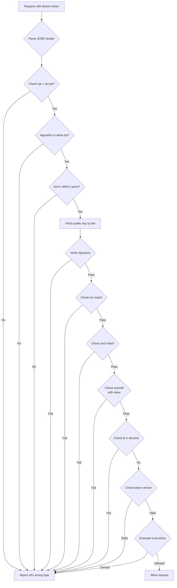
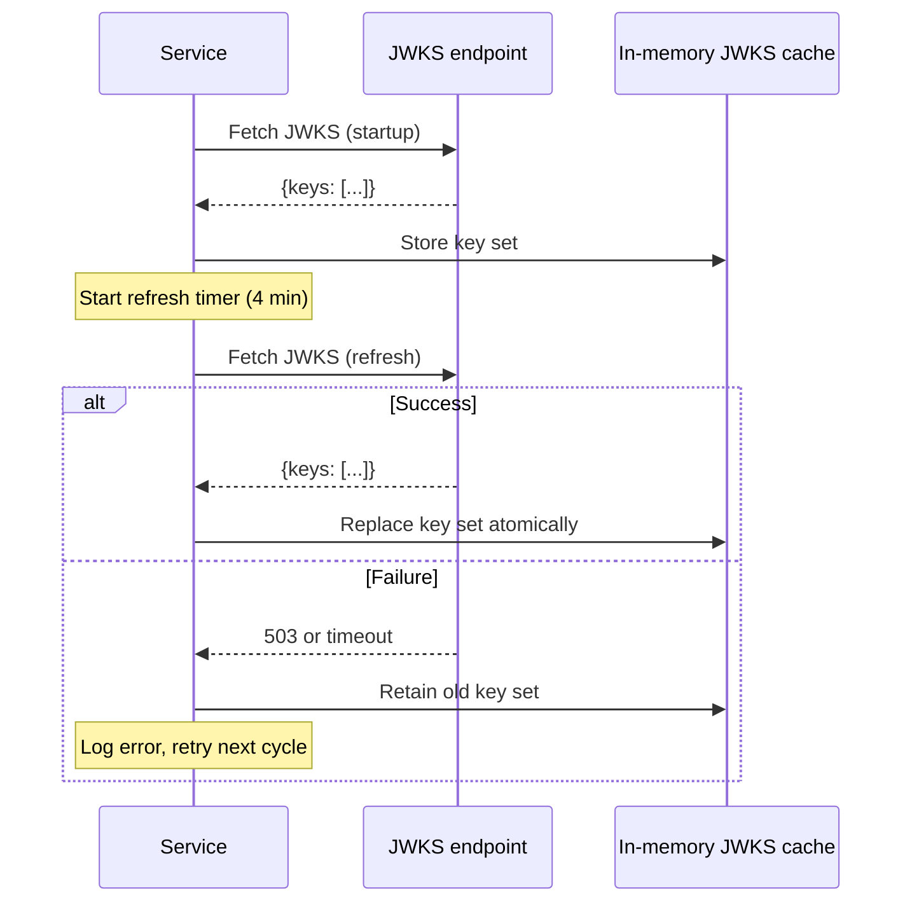
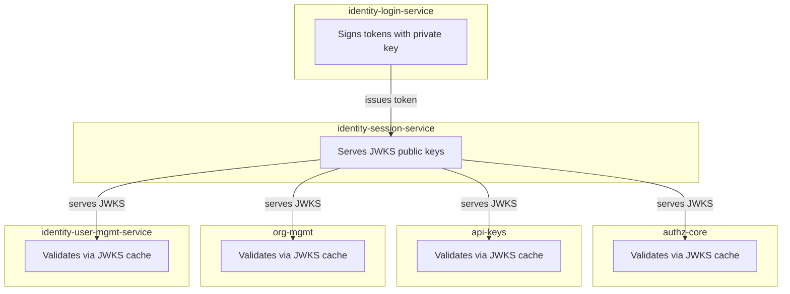

# Story 1.3: Wire All Services to Validate JWTs via JWKS

## Epic

[01-asymmetric-jwks](../JWT.md)

## Parent Epic Story

Story 1.3

## Summary

Wire all 6 services (identity-login-service, identity-session-service, identity-user-mgmt-service, authz-core, api-keys, org-mgmt) to validate JWTs using the JWKS-based `JwksBearerProvider`. Each service fetches the JWKS from identity-session-service on startup, caches it for 5 minutes, and uses it to validate token signatures locally. This eliminates the need for every service to hold the shared `JWT_SECRET`.

## Why This Story Exists

The JWT document flags "shared-secret blast radius" as a critical security issue. With HS256, every validating service also has the signing key. With JWKS-based validation, only the identity-login-service holds the private key; all other services use only the public key. This story wires the existing `JwksBearerProvider` runtime support to all services.

## Design Context

### Current State

- JWT claims module signs with HS256 from shared `JWT_SECRET`
- Generated runtime contains `JwksBearerProvider` support (not wired)
- Generated runtime contains development fallback `BearerJwtProvider` using simple signature string
- All services that validate JWTs currently share the same symmetric key
- `config.yaml` exposes JWKS configuration settings but they are not wired

### Validation Pipeline (RFC 9068)

```
1. Parse JOSE header
2. Require typ = at+jwt
3. Require algorithm from allow-list
4. Choose key by kid from JWKS cache
5. Verify signature
6. Validate iss, aud, exp, nbf (with clock skew)
7. Reject if jti in local deny cache
8. Compare token ver to cached version (for high-risk routes)
9. Evaluate local policy from scope, roles, permissions, tenant
10. If high-risk route: call online fallback
```

### Algorithm Allow-List

| Algorithm | Supported | Reason |
|-----------|-----------|--------|
| ES256 | Yes | Default algorithm |
| EdDSA | Planned | Second algorithm for future |
| RS256 | Optional | For legacy consumers; requires review |
| HS256 | **No** (deprecated) | Shared-secret blast radius |
| `alg: none` | **Never** | RFC 8725 rejection |

### Service Configuration

Each service that validates JWTs needs:

```yaml
jwks:
  issuer: "https://idam.example.com"      # Expected iss
  audience: ["myapp.com"]                  # Expected aud (may vary per service)
  cache_ttl_secs: 300                      # JWKS cache TTL (5 min)
  algorithm_allow_list: ["ES256"]
  clock_skew_secs: 60                      # NBF/EXP tolerance
```

The `issuer`, `audience`, and `algorithm_allow_list` are per-service because:
- Different services may serve different audiences
- The issuer is always the same (identity-session-service)
- Algorithm allow-list should be consistent, but could vary in transition

## Implementation Notes

### Initialization Sequence

1. Service starts
2. Fetch JWKS from `identity-session-service/.well-known/jwks.json`
3. Validate the response is valid JWKS JSON
4. Cache the key set locally (in-memory, 5-minute TTL)
5. Start a background task to refresh the JWKS every 4 minutes (before TTL expires)
6. On JWKS refresh: validate the new set, replace the old set atomically
7. On refresh failure: retain the old set (stale but better than nothing)

### Error Handling

| Scenario | Behavior |
|----------|----------|
| JWKS fetch fails at startup | Log error, return 503, use cached keys from previous run (if any) |
| JWKS refresh fails | Retain cached keys, log error, retry on next cycle |
| Token has unknown `kid` | Log warning, return 401 "invalid token" |
| Token signature fails to verify | Log error, return 401 "invalid token" |
| `typ` is not `at+jwt` | Reject immediately (RFC 9068 compliance) |
| `alg` is not in allow-list | Reject immediately (RFC 8725 compliance) |
| `iss` does not match | Reject immediately |
| `aud` does not contain expected | Reject immediately |
| `exp` is past (with 60s skew) | Reject immediately |
| `nbf` is future (with 60s skew) | Reject immediately |

### Metrics to Track

| Metric | Labels | Description |
|--------|--------|-------------|
| `jwks_fetch_total` | {result: "success", "failure"} | JWKS fetch attempts |
| `jwks_cache_hit_total` | - | JWTs validated from cached JWKS |
| `jwt_validation_total` | {result: "valid", "invalid"}, {reason: "exp", "sig", "iss", "aud", "typ", "alg", "kid"} | Validation results |
| `jwt_validation_latency_ms` | - | Time to validate a JWT |

## Mermaid Diagrams

### Validation Pipeline



### JWKS Refresh Cycle



### Multi-Service Validation



## OpenAPI Changes

No OpenAPI changes needed for validation (internal operation). However, the OpenAPI specs should document that all protected endpoints accept `Bearer` tokens validated via JWKS, not just API keys.

Change from:
```yaml
security:
  - ApiKeyHeader: []
```

To:
```yaml
security:
  - ApiKeyHeader: []
  - bearerAuth: []
```

Add to components/securitySchemes:
```yaml
bearerAuth:
  type: http
  scheme: bearer
  bearerFormat: JWT
  description: JWT validated via JWKS at /.well-known/jwks.json
```

## Design Doc References

- `design-doc.md` section 10.2: Asymmetric Signing & JWKS -- algorithm allow-list, `typ` enforcement, `iss`/`aud` validation
- `design-doc.md` section 10.11: Caching Strategy -- JWKS cache 5-minute TTL
- `design-doc.md` section 10.12: Observability -- `jwks_cache_hit_ratio`, `jwks_refresh_failures_total`, `jwt_validation_latency_ms`
- `design-doc.md` section 6.2: JWT Schema -- `alg`, `typ`, `kid`, `iss`, `aud`, `exp`, `nbf`, `jti` claims
- `service-topology-design.md`: All services that validate JWTs need JWKS configuration

## Wiki Pages to Update/Create

- `topics/topic-jwt-schema.md`: Document validation requirements per claim
- `topics/topic-authorization-flow.md`: Note JWKS cache TTL (5 minutes)
- `topics/topic-token-lifecycle.md`: (new) Document validation pipeline

## Acceptance Criteria

- [ ] All 6 services that receive JWTs validate them via JWKS
- [ ] Each service fetches JWKS on startup, caches for 5 minutes
- [ ] `typ` is validated to equal `at+jwt`; tokens with wrong `typ` are rejected
- [ ] Algorithm is validated against allow-list; `alg: none` is explicitly rejected
- [ ] `iss` is validated against expected issuer
- [ ] `aud` is validated to contain expected audience
- [ ] `exp` and `nbf` are validated with 60-second clock skew
- [ ] Unknown `kid` in JWT header returns 401 "invalid token"
- [ ] JWKS refresh failure retains the old key set (graceful degradation)
- [ ] Metrics: `jwks_cache_hit_ratio` and `jwks_refresh_failures_total` are emitted
- [ ] Metrics: `jwt_validation_total{result,reason}` and `jwt_validation_latency_ms` are emitted
- [ ] No service holds the HS256 shared secret for JWT validation

## Dependencies

- Depends on Story 1.1 (key generation) and Story 1.2 (JWKS endpoint)
- Required for all downstream epics (Epic 2 claims schema, Epic 4 hybrid authz)

## Risk / Trade-offs

- **JWKS refresh failure**: If identity-session-service is down during refresh, services retain stale JWKS. This is acceptable -- stale keys are valid until token expiry. The risk is that a rotated-out key remains in the cache, but since keys are in-memory only and rotated on schedule, this window is short.
- **Clock skew tolerance**: 60 seconds is generous but safe. NTP drift on Linux is typically under 100ms, so 60s is a safety margin for clock changes, not drift.
- **Algorithm allow-list**: Starting with only ES256. If EdDSA or RS256 is added later, they are added to the allow-list without breaking existing tokens.
