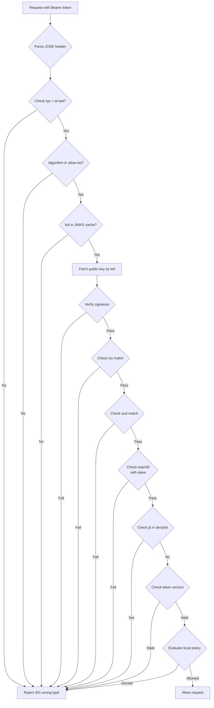
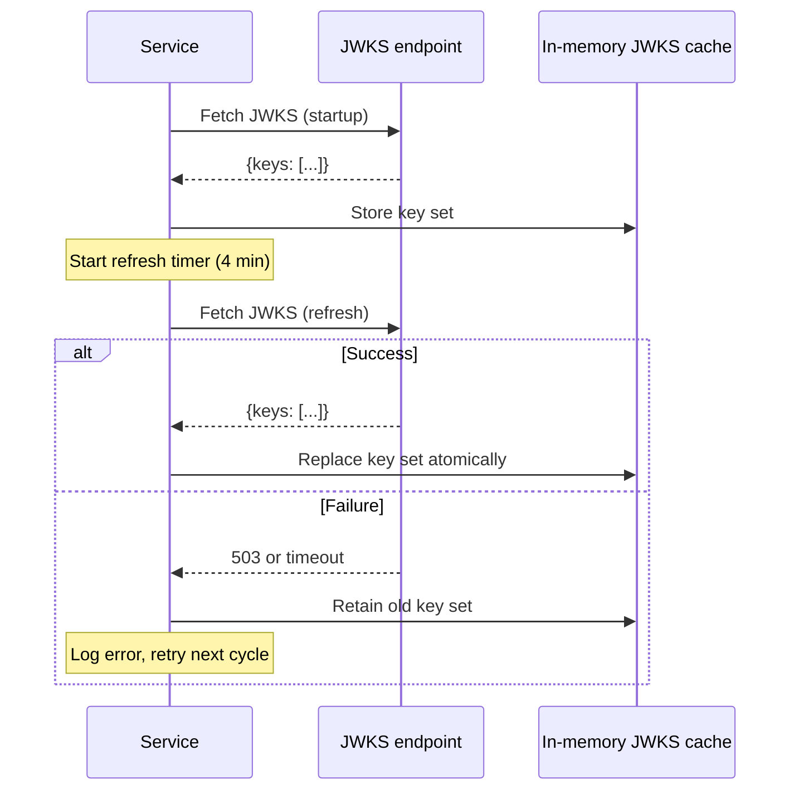
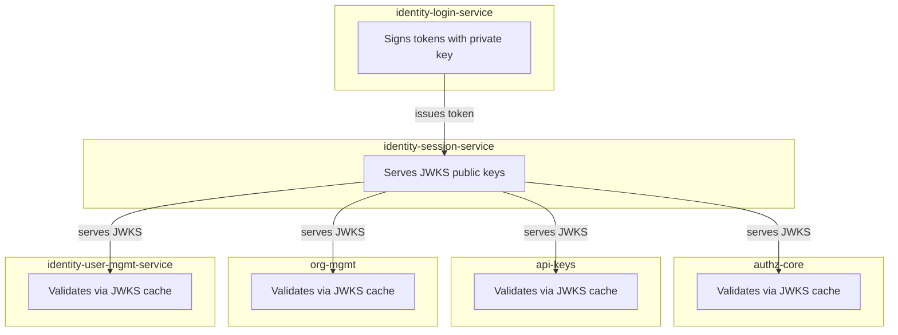

# Story 1.3: Wire All Services to Validate JWTs via JWKS

## Epic

[01-asymmetric-jwks](../JWT.md)

## Parent Epic Story

Story 1.3

## Summary

Wire all 6 services (identity-login-service, identity-session-service, identity-user-mgmt-service, authz-core, api-keys, org-mgmt) to validate JWTs using the JWKS-based `JwksBearerProvider`. Each service fetches the JWKS from identity-session-service on startup, caches it for 5 minutes, and uses it to validate token signatures locally. This eliminates the need for every service to hold the shared `JWT_SECRET`.

## Why This Story Exists

The JWT document flags "shared-secret blast radius" as a critical security issue. With HS256, every validating service also has the signing key. With JWKS-based validation, only the identity-login-service holds the private key; all other services use only the public key. This story wires the existing `JwksBearerProvider` runtime support to all services.

## Design Context

### Current State

- JWT claims module signs with HS256 from shared `JWT_SECRET`
- Generated runtime contains `JwksBearerProvider` support (not wired)
- Generated runtime contains development fallback `BearerJwtProvider` using simple signature string
- All services that validate JWTs currently share the same symmetric key
- `config.yaml` exposes JWKS configuration settings but they are not wired

### Validation Pipeline (RFC 9068) -- CRITICAL: Pipeline Ordering

The validation pipeline MUST be executed in the exact order below. This is NOT optional -- the ordering prevents specific attack vectors:

```
1. Parse JOSE header              -- Extract typ, alg, kid before ANY trust decision
2. Require typ = at+jwt           -- Reject type confusion (F-002) BEFORE signature check
3. Require algorithm from allow   -- Reject alg: none, reject HS256, reject unexpected alg
4. Choose key by kid from JWKS    -- Select public key for verification
5. Verify signature               -- CRYPTOGRAPHIC TRUST DECISION POINT
6. Validate iss, aud, exp, nbf    -- Claim validation (after trust is established)
7. Reject if jti in local deny    -- Revocation check (optimization only, NEVER bypass step 5)
8. Compare token ver to cached    -- Version check for high-risk routes
9. Evaluate local policy from     -- Authorization decision
10. If high-risk route: call      -- Selective online fallback
```

**F-002 Fix: extract_jti deprecation.** The existing repo's `extract_jti` helper that disables signature validation to pre-check denylists MUST be removed or deprecated. If retained as a pre-validation optimization:
- It MUST NEVER be used in production validation logic
- It MUST be behind a feature flag `DISABLE_EXTRACT_JTI=true` by default
- It MUST have a clear comment: "WARNING: signature validation disabled. Do NOT use as trust decision path."
- The canonical `validate_jti` check (step 7 above) MUST always follow step 5 (signature verification)

**Zero-trust principle**: Steps 1-4 are pre-trust. Step 5 is the ONLY trust decision. Steps 6-10 operate on established trust. The `extract_jti` helper inverts this and MUST be eliminated.

### Algorithm Allow-List

| Algorithm | Supported | Reason |
|-----------|-----------|--------|
| ES256 | Yes | Default algorithm |
| EdDSA | Planned | Second algorithm for future |
| RS256 | Optional | For legacy consumers; requires review |
| HS256 | **No** (deprecated) | Shared-secret blast radius |
| `alg: none` | **Never** | RFC 8725 rejection |

| Service | Issuer | Audience | Cache TTL | Clock Skew | Rate Limit |
|---------|--------|----------|-----------|------------|------------|
| identity-login-service | `https://idam.example.com` | `["myapp.com"]` | 5 min | 60s | N/A (signer) |
| identity-session-service | `https://idam.example.com` | `["myapp.com"]` | 5 min | 60s | **N/A — serves JWKS** |
| identity-user-mgmt-service | `https://idam.example.com` | `["myapp.com"]` | 5 min | 60s | **100 req/s** (F-009) |
| authz-core | `https://idam.example.com` | `["authz-core.myapp.com"]` | 5 min | 60s | **100 req/s** (F-009) |
| api-keys | `https://idam.example.com` | `["api-keys.myapp.com"]` | 5 min | 60s | **100 req/s** (F-009) |
| org-mgmt | `https://idam.example.com` | `["org-mgmt.myapp.com"]` | 5 min | 60s | **100 req/s** (F-009) |

**F-009 Fix: JWKS endpoint rate limiting.** Rate limiting is applied to the JWKS endpoint (`/.well-known/jwks.json`) only — it is the only unauthenticated endpoint and the only one with no operational reason for high request volume.

**F-011 Fix: Key health monitoring.** Add a health check endpoint to the identity-session-service:

```
GET /health/jwks
```

This endpoint returns:
```json
{
  "keys": [
    {
      "kid": "key-2026-05-01",
      "alg": "EdDSA",
      "age_seconds": 2592000,
      "active": true
    },
    {
      "kid": "key-2026-06-01",
      "alg": "EdDSA",
      "age_seconds": 0,
      "active": true
    }
  ],
  "key_count": 2,
  "last_rotation": "2026-06-01T00:00:00Z",
  "next_rotation": "2026-07-01T00:00:00Z"
}
```

**Alerting rules:**
- **CRITICAL**: `key_count == 1` for more than 10 minutes (should be 2 during overlap window — rotation has failed)
- **WARNING**: `key_count == 0` (no keys at all — service misconfigured or crashed during key generation)
- **WARNING**: `last_rotation` is more than 35 days ago (rotation has not occurred — possible stuck rotation timer)
- **CRITICAL**: JWKS endpoint health check returns non-200 (endpoint is down)

## Implementation Notes

### Initialization Sequence

1. Service starts
2. Fetch JWKS from `identity-session-service/.well-known/jwks.json`
3. Validate the response is valid JWKS JSON
4. Cache the key set locally (in-memory, 5-minute TTL)
5. Start a background task to refresh the JWKS every 4 minutes (before TTL expires)
6. On JWKS refresh: validate the new set, replace the old set atomically
7. On refresh failure: retain the old set (stale but better than nothing)

### Error Handling

| Scenario | Behavior |
|----------|----------|
| JWKS fetch fails at startup | Log error, return 503, use cached keys from previous run (if any) |
| JWKS refresh fails | Retain cached keys, log error, retry on next cycle |
| Token has unknown `kid` | Log warning, return 401 "invalid token" |
| Token signature fails to verify | Log error, return 401 "invalid token" |
| `typ` is not `at+jwt` | Reject immediately (RFC 9068 compliance) |
| `alg` is not in allow-list | Reject immediately (RFC 8725 compliance) |
| `iss` does not match | Reject immediately |
| `aud` does not contain expected | Reject immediately |
| `exp` is past (with 60s skew) | Reject immediately |
| `nbf` is future (with 60s skew) | Reject immediately |

### Metrics to Track

| Metric | Labels | Description |
|--------|--------|-------------|
| `jwks_fetch_total` | {result: "success", "failure"} | JWKS fetch attempts |
| `jwks_cache_hit_total` | - | JWTs validated from cached JWKS |
| `jwt_validation_total` | {result: "valid", "invalid"}, {reason: "exp", "sig", "iss", "aud", "typ", "alg", "kid"} | Validation results |
| `jwt_validation_latency_ms` | - | Time to validate a JWT |

## Mermaid Diagrams

### Validation Pipeline



### JWKS Refresh Cycle



### Multi-Service Validation



## Malicious Hacker Gotchas (Must Be Addressed During Implementation)

> **Source:** `docs/PRS_SECURITY_HARDENING.md` — Security threat model analysis

### HACK-101: JWKS Poisoning via Cache Update (CRITICAL — Hole #1 from PRS)

**Risk:** Attacker replaces the legitimate JWKS with one containing their own public key, then signs tokens with the corresponding private key

The story says: "On refresh failure: retain the old set." But what about a SUCCESSFUL refresh that returns a POISONED JWKS?

**Exploit path:**
1. Attacker compromises identity-session-service OR intercepts the JWKS fetch request (MITM)
2. Attacker serves a poisoned JWKS with their own EC key (not in the original key set)
3. Attacker generates a private key corresponding to the poisoned public key
4. Attacker signs a JWT with their private key, setting `kid` to the poisoned key's `kid`
5. All services that just refreshed their JWKS cache accept the attacker's token
6. Result: Full authentication bypass across all services

**Implementation requirement:**
- The JWKS refresh MUST validate that the new key set contains AT LEAST ONE key that was also in the previous key set (anti-poisoning measure)
- If the new JWKS contains ZERO keys from the old set → reject the refresh → retain old set
- Log a CRITICAL alert: "JWKS refresh contains zero keys from previous set — possible poisoning"
- Additionally: verify the JWKS response is signed (e.g., with TLS pinning or a separate HMAC)

### HACK-102: JWKS Refresh Fails Open — Stale Keys Accept Forged Tokens (CRITICAL — Hole #1 from PRS)

**Risk:** If identity-session-service is down, services fall back to stale JWKS, which an attacker can exploit

The story says: "On JWKS fetch fails at startup: Log error, return 503, use cached keys from previous run." And: "JWKS refresh failure retains the old key set."

**Exploit path:**
1. identity-session-service goes down (DDoS, crash, or attacker takes it down)
2. All services retain their cached JWKS keys from the last successful refresh
3. The cached keys might be from 5 minutes ago
4. If a key rotation happened during those 5 minutes, the cached keys are OUTDATED
5. Any token signed with the NEW private key (current key) would be REJECTED by stale caches
6. BUT: if the attacker controls a key from the rotation window (they caused the rotation, or intercepted the new key), they can sign tokens with it

**This is partially mitigated by:**
- Key rotation has an overlap window (current + next keys visible in JWKS)
- The grace period keeps old keys in JWKS for a while

**But what if the attacker can cause a key rotation and then keep identity-session-service down?** The services retain old cached keys that don't include the new key. The attacker signs with the new key → all services reject it → denial of service.

**The real exploit is different:** What if the attacker CAUSES a key rotation, captures the new private key during rotation, and THEN takes down identity-session-service?

1. Attacker triggers key rotation → new key generated
2. Attacker exfiltrates the new private key from identity-session-service (via a vulnerability or compromised host)
3. Attacker takes down identity-session-service
4. Services retain old cached JWKS → they can't verify tokens signed with the new key
5. Attacker signs tokens with the new private key → services reject them → DoS

**Wait — this is self-inflicted DoS, not privilege escalation.** The attacker can't sign with the old key because they don't have the old private key (it was rotated out).

**The real exploit is when the attacker has BOTH keys.** If the attacker compromises identity-session-service DURING the overlap window, they can get both the old and new private keys, then take down identity-session-service and sign tokens with either key.

**Implementation requirement:**
- The JWKS refresh MUST validate that at least one key in the new set matches a key in the old set (HACK-101)
- But this doesn't help if the attacker has the old private key AND takes down the service
- The only defense is: never store private keys on disk (in-memory only) and restrict access to identity-session-service
- Document: "Private keys are NEVER stored on disk. They exist only in memory and are rotated via the KeyManager."

### HACK-103: `extract_jti` Helper Bypasses Signature Validation (CRITICAL — F-002 from PRS)

**Risk:** Attacker forges a JWT that passes the jti denylist check but has an invalid signature

The story explicitly warns about `extract_jti`: "The existing repo's `extract_jti` helper that disables signature validation to pre-check denylists MUST be removed or deprecated."

**Exploit path:**
1. Attacker forges a JWT with any `jti` value they want (no valid signature needed)
2. The forged JWT has `jti = "tok_existing_valid"` (a real, non-revoked jti)
3. The validation pipeline calls `extract_jti` FIRST to check the denylist
4. `extract_jti` extracts the `jti` WITHOUT verifying the signature
5. The denylist check passes (`tok_existing_valid` is not revoked)
6. The pipeline proceeds to step 5 (signature verification) and REJECTS the token
7. BUT: some services might use `extract_jti` as a PRE-filter and skip further validation if the denylist check fails

**Wait — the story says:** "Steps 6-10 operate on established trust. The `extract_jti` helper inverts this and MUST be eliminated."

**The real exploit:** If `extract_jti` is used as a trust decision (step 7), and step 5 (signature verification) is SKIPPED or DEFERRED, the attacker's forged token passes.

**Exploit path (deferral to a bug):**
1. `extract_jti` is used to pre-filter denylist checks (optimization)
2. A bug in the pipeline causes step 5 (signature verification) to be SKIPPED for some code paths
3. Attacker forges a token with `jti = "non_revoked_jti"`
4. `extract_jti` extracts the jti without signature → denylist check passes
5. Step 5 is skipped due to the bug
6. Token is ACCEPTED

**Implementation requirement:**
- REMOVE `extract_jti` from production code entirely. Do NOT retain it.
- If retained as an optimization, it MUST be behind a feature flag `DISABLE_EXTRACT_JTI=true` by default
- It MUST have a clear comment: "WARNING: signature validation disabled. Do NOT use as trust decision path."
- The canonical `validate_jti` check (step 7) MUST always follow step 5 (signature verification)
- Audit ALL code paths to ensure step 5 is NEVER skipped

### HACK-104: JWKS Refresh Fails Open — Old Keys Accept Tokens Signed with Rotated Key (HIGH — related to Hole #1 from PRS)

**Risk:** During key rotation, old cached keys might accept tokens signed with a NEW private key

The story says: "During rotation, both old and new keys are visible." But the JWKS cache TTL is 5 minutes, and the refresh cycle is 4 minutes. If a token is signed with the NEW key (which just became active), but a service's JWKS cache still has the OLD key set, the token will be REJECTED (kid not found in cache).

**This is a denial of service, not a security breach.** The token is signed with a valid key but rejected because the cache is stale.

**The reverse exploit is more dangerous:** What if the service's cache has the NEW key (it was refreshed), but the NEW key is a POISONED key (HACK-101)?

This is covered in HACK-101. The key takeaway: **JWKS cache staleness causes false rejections (DoS), not false accepts (security breach). The security breach comes from JWKS poisoning.**

### HACK-105: Audience Mismatch Allows Cross-Service Token Reuse (HIGH — related to Hole #17 from PRS)

**Risk:** Attacker uses a token intended for one service to access another service

The story shows per-service audience values:
- authz-core: `aud: ["authz-core.myapp.com"]`
- api-keys: `aud: ["api-keys.myapp.com"]`
- org-mgmt: `aud: ["org-mgmt.myapp.com"]`

**Exploit path:**
1. Attacker obtains a valid JWT with `aud: ["authz-core.myapp.com"]`
2. Attacker uses this token to access the api-keys service
3. The api-keys service validates the token's signature (valid), issuer (valid), expiry (valid)
4. BUT: the audience check might be lenient (e.g., `aud` contains "myapp.com" instead of "api-keys.myapp.com")
5. Result: Token intended for authz-core is accepted by api-keys

**Implementation requirement:**
- Each service MUST validate that its exact audience is in the token's `aud` claim
- `aud: ["myapp.com"]` is NOT sufficient for a service expecting `aud: ["api-keys.myapp.com"]`
- Document: "Each service validates its exact audience string against the token's aud claim. Partial matches are NOT accepted."

### HACK-106: Clock Skew Manipulation Extends Token Validity (MEDIUM — Hole #6 from PRS)

**Risk:** Attacker manipulates the system clock to accept expired tokens

The story says: "exp and nbf are validated with 60-second clock skew tolerance." This means a token with `exp = now` is still accepted for 60 seconds after its expiry time.

**Exploit path:**
1. Attacker obtains a token with `exp = now - 30 seconds` (already expired by 30 seconds)
2. Attacker sets their local system clock 30 seconds AHEAD (or the service's clock is skewed)
3. The service calculates: `now - exp = 0 seconds (with 60s skew tolerance)` → token is accepted
4. Result: Attacker uses an expired token

**But wait:** The token's `exp` is in the token itself (signed). The service compares `exp` against its own clock. If the attacker manipulates the service's clock, ALL requests are affected, not just the attacker's.

**The real exploit is different:** What if the attacker FORGES a token with `exp` far in the future?

1. Attacker forges a token with `exp = now + 1 hour`
2. The token has an INVALID signature
3. The validation pipeline checks `exp` BEFORE signature verification (step 6 is after step 5, which is signature verification)
4. Wait — step 6 (exp validation) comes AFTER step 5 (signature verification). So the forged token is rejected at step 5.

**Unless... the attacker forges a token with a VALID signature (HACK-101) AND sets `exp` far in the future.** This is covered by HACK-101.

**The real clock skew exploit is on the ISSUER side:**
1. Attacker compromises the token issuer (identity-login-service)
2. Issuer creates a token with `exp = now + 1 year` (instead of `now + 5 minutes`)
3. The token has a valid signature and `exp` well in the future
4. All services accept the token for up to 1 year

**Implementation requirement:**
- The issuer MUST enforce a MAXIMUM token lifetime (e.g., 5 minutes for access tokens, 30 days for refresh tokens)
- The validation pipeline MUST also check `exp` against a MAXIMUM allowed lifetime (defensive validation)
- Document: "Access tokens MUST have `exp - iat <= 300 seconds`. Tokens with longer lifetimes are rejected."

### HACK-107: JWKS Cache Is Not Per-Tenant — Shared Cache Allows Cross-Tenant Token Validation (MEDIUM — Hole #5 from PRS)

**Risk:** A token from Tenant A can be validated against the JWKS shared by all tenants

The story shows per-service audience values but NOT per-tenant JWKS. All tenants share the same JWKS (same signing keys).

**Exploit path:**
1. Attacker has a valid token from Tenant A
2. Attacker uses this token to access a service that serves Tenant B's requests
3. The service validates the token's signature against the shared JWKS (valid)
4. The service checks `aud` (matches) and `iss` (matches)
5. The service then checks the `tenant_id` claim in the token
6. If `tenant_id` is not checked at validation time, the token is accepted
7. Result: Cross-tenant token reuse

**But the tenant_id check happens at the authorization layer (after JWT validation).** The JWT validation only checks `typ`, `alg`, `kid`, `iss`, `aud`, `exp`, `nbf`, `jti`, and `ver`. It does NOT check `tenant_id`.

**This is by design:** `tenant_id` is checked at the authorization layer, not at the JWT validation layer. The JWT validation is service-specific (audience check), but tenant-specific checks happen later.

**The risk is when the authorization layer is bypassed.** For jwt-only routes, only the JWT claims are checked — and `tenant_id` is in the JWT claims. So tenant isolation relies on the `tenant_id` claim being in the JWT AND the authorization layer checking it.

**Implementation requirement:**
- The JWT MUST include the `tenant_id` claim (this is already in Story 2.4)
- The JWT validation pipeline does NOT check `tenant_id` (it's checked at the authorization layer)
- Document: "Tenant isolation is enforced at the authorization layer, not at the JWT validation layer. The `tenant_id` claim must be present in all JWTs and checked by every authorization handler."
- Consider: should `tenant_id` be in the audience check? If a token is issued for Tenant A, should it be usable by a service serving Tenant B's requests? **Answer: Yes, the audience check is per-service, not per-tenant. The tenant_id claim in the JWT is the tenant isolation mechanism.**

### HACK-108: JWKS Refresh Timing Creates a Security Window (MEDIUM — related to Hole #9 from PRS)

**Risk:** During the 4-minute window between JWKS refreshes, services might use a key that has been rotated out

The story says: "Start a background task to refresh the JWKS every 4 minutes (before TTL expires)." The cache TTL is 5 minutes.

**Exploit path:**
1. At t=0, services refresh their JWKS cache (keys A and B are visible)
2. At t=2 minutes, identity-session-service rotates the key (new key C is generated)
3. At t=2 minutes, JWKS now contains keys A, B, and C (overlap window)
4. At t=4 minutes, services refresh their JWKS cache (get keys A, B, C)
5. At t=5 minutes, identity-session-service rotates again (new key D is generated)
6. At t=5 minutes, JWKS now contains keys A (grace), B, C, D
7. At t=7 minutes, services refresh again (get keys B, C, D)
8. At t=9 minutes, the grace period for key A ends — it's removed from JWKS
9. At t=7 minutes, a service that refreshed at t=7 has keys B, C, D
10. A token signed with key A (valid at t=6 minutes) is REJECTED by this service (key A not in cache)

**This is a false rejection (DoS), not a false accept (security breach). The key was valid when the token was signed, but is no longer in the cache.**

**The fix is the grace period:** Key A remains in the JWKS for a grace period after rotation, so services that haven't refreshed yet can still validate tokens signed with key A.

**But what if the grace period is too short?** If the grace period is 10 minutes but the JWKS refresh cycle is 15 minutes, services might miss the grace period and reject valid tokens.

**Implementation requirement:**
- The grace period MUST be LONGER than the maximum JWKS refresh cycle (e.g., if refresh cycle is 4 minutes, grace period should be at least 10 minutes)
- Document: "The JWKS key grace period must exceed the maximum JWKS refresh interval to ensure all services can validate tokens signed during the overlap window."

Change from:
```yaml
security:
  - ApiKeyHeader: []
```

To:
```yaml
security:
  - ApiKeyHeader: []
  - bearerAuth: []
```

Add to components/securitySchemes:
```yaml
bearerAuth:
  type: http
  scheme: bearer
  bearerFormat: JWT
  description: JWT validated via JWKS at /.well-known/jwks.json
```

## Design Doc References

- `design-doc.md` section 10.2: Asymmetric Signing & JWKS -- algorithm allow-list, `typ` enforcement, `iss`/`aud` validation
- `design-doc.md` section 10.11: Caching Strategy -- JWKS cache 5-minute TTL
- `design-doc.md` section 10.12: Observability -- `jwks_cache_hit_ratio`, `jwks_refresh_failures_total`, `jwt_validation_latency_ms`
- `design-doc.md` section 6.2: JWT Schema -- `alg`, `typ`, `kid`, `iss`, `aud`, `exp`, `nbf`, `jti` claims
- `service-topology-design.md`: All services that validate JWTs need JWKS configuration

## Wiki Pages to Update/Create

- `topics/topic-jwt-schema.md`: Document validation requirements per claim
- `topics/topic-authorization-flow.md`: Note JWKS cache TTL (5 minutes)
- `topics/topic-token-lifecycle.md`: (new) Document validation pipeline

## Acceptance Criteria

- [ ] All 6 services that receive JWTs validate them via JWKS
- [ ] Each service fetches JWKS on startup, caches for 5 minutes
- [ ] `typ` is validated to equal `at+jwt`; tokens with wrong `typ` are rejected
- [ ] Algorithm is validated against allow-list; `alg: none` is explicitly rejected
- [ ] `iss` is validated against expected issuer
- [ ] `aud` is validated to contain expected audience
- [ ] `exp` and `nbf` are validated with 60-second clock skew
- [ ] Unknown `kid` in JWT header returns 401 "invalid token"
- [ ] JWKS refresh failure retains the old key set (graceful degradation)
- [ ] Metrics: `jwks_cache_hit_ratio` and `jwks_refresh_failures_total` are emitted
- [ ] Metrics: `jwt_validation_total{result,reason}` and `jwt_validation_latency_ms` are emitted
- [ ] No service holds the HS256 shared secret for JWT validation

## Dependencies

- Depends on Story 1.1 (key generation) and Story 1.2 (JWKS endpoint)
- Required for all downstream epics (Epic 2 claims schema, Epic 4 hybrid authz)

## Risk / Trade-offs

- **JWKS refresh failure**: If identity-session-service is down during refresh, services retain stale JWKS. This is acceptable -- stale keys are valid until token expiry. The risk is that a rotated-out key remains in the cache, but since keys are in-memory only and rotated on schedule, this window is short.
- **Clock skew tolerance**: 60 seconds is generous but safe. NTP drift on Linux is typically under 100ms, so 60s is a safety margin for clock changes, not drift.
- **Algorithm allow-list**: Starting with only ES256. If EdDSA or RS256 is added later, they are added to the allow-list without breaking existing tokens.

## Tests

### Unit Tests

- [ ] **typ enforcement rejects wrong type**: Given a valid JWT with `typ: refresh+token`, assert the validation pipeline returns 401 with reason `invalid_token_type` — the pipeline checks `typ` BEFORE any signature verification
- [ ] **typ enforcement rejects missing typ**: Given a valid JWT with no `typ` header field, assert rejection with reason `invalid_token_type`
- [ ] **typ enforcement accepts `at+jwt`**: Given a valid JWT with `typ: at+jwt`, assert the pipeline passes the type check and continues to signature verification
- [ ] **Algorithm allow-list rejects `alg: none`**: Given a JWT with `alg: none` in the header, assert the pipeline rejects immediately with reason `algorithm_not_allowed` (RFC 8725 compliance)
- [ ] **Algorithm allow-list rejects HS256**: Given a JWT signed with HS256 (the deprecated symmetric algorithm), assert the pipeline rejects it even if the signature is valid
- [ ] **Algorithm allow-list accepts EdDSA**: Given a JWT with `alg: EdDSA` and a valid signature from the public key in the JWKS cache, assert the pipeline passes the algorithm check
- [ ] **Algorithm allow-list accepts ES256 co-default**: Given a JWT with `alg: ES256` and a valid signature from the ES256 key in the JWKS cache, assert the pipeline passes (interoperability)
- [ ] **iss validation rejects wrong issuer**: Given a JWT with `iss: https://evil.example.com` and otherwise valid claims, assert the pipeline returns 401 with reason `invalid_issuer`
- [ ] **iss validation accepts correct issuer**: Given a JWT with `iss: https://idam.example.com`, assert the pipeline passes
- [ ] **aud validation rejects missing audience**: Given a JWT with no `aud` claim, assert the pipeline returns 401 with reason `invalid_audience`
- [ ] **aud validation rejects wrong audience**: Given a JWT with `aud: other-service` when the service expects `authz-core.myapp.com`, assert rejection with reason `invalid_audience`
- [ ] **aud validation accepts matching audience**: Given a JWT with `aud` containing the expected audience value, assert the pipeline passes
- [ ] **exp validation rejects expired token (with skew)**: Given a JWT whose `exp` is 61 seconds ago (past the 60-second skew tolerance), assert the pipeline rejects with reason `token_expired`
- [ ] **exp validation accepts token just before expiry (with skew)**: Given a JWT whose `exp` is 30 seconds from now, assert the pipeline passes
- [ ] **nbf validation rejects future token**: Given a JWT whose `nbf` is 120 seconds in the future (past 60s skew), assert rejection with reason `not_yet_valid`
- [ ] **Unknown kid returns 401**: Given a JWT with a `kid` not present in the JWKS cache, assert the pipeline returns 401 with reason `unknown_key`
- [ ] **Valid key resolves from JWKS cache**: Given a JWT with a valid `kid`, assert the pipeline finds the public key in the JWKS cache and proceeds to signature verification
- [ ] **Signature verification rejects invalid signature**: Given a JWT with valid `typ`, `iss`, `aud`, `exp` but an invalid signature, assert the pipeline returns 401 with reason `invalid_signature`
- [ ] **Signature verification accepts valid signature**: Given a JWT signed with the private key corresponding to the `kid` in the JWKS cache, assert signature verification passes

### Integration Tests (BDD-style with `rstest_bdd`)

- [ ] **Scenario: Valid token passes full pipeline**: `given` a JWT issued by identity-session-service with all correct claims → `when` authz-core receives it → `then` the token is accepted and local policy is evaluated from claims
- [ ] **Scenario: Expired token is rejected at step 6**: `given` a valid JWT with `exp` in the past → `when` authz-core validates it → `then` the pipeline returns 401 at step 6 (exp validation) without reaching step 7 (jti denylist)
- [ ] **Scenario: JWKS refresh at startup**: `given` an authz-core service with no cached JWKS → `when` it starts → `then` it fetches JWKS from identity-session-service and caches the key set
- [ ] **Scenario: JWKS refresh failure retains old keys**: `given` a service with a cached JWKS key set → `when` the identity-session-service returns 503 during refresh → `then` the service retains and uses the old key set, logs an error
- [ ] **Scenario: Token with new kid after rotation**: `given` a consumer whose JWKS cache has key-A → `when` the issuer rotates and issues a token with key-B's kid → `then` if the consumer's JWKS cache has been refreshed, the new key is used; if not, the token is rejected (grace period overlap prevents this in production)
- [ ] **Scenario: All 6 services validate JWTs**: `given` a JWT issued from identity-session-service → `when` each of the 6 services (identity-login, identity-session, identity-user-mgmt, authz-core, api-keys, org-mgmt) validates it → `then` all 6 accept it (assuming correct `aud` per service)
- [ ] **Scenario: Metrics are emitted on valid token**: `given` a valid JWT → `when` a service validates it → `then` `jwt_validation_total{result: "valid"}` and `jwt_validation_latency_ms` are emitted

### Security Regression Tests

- [ ] **Reject `alg: none` token**: Inject a JWT with `alg: none` into the validation pipeline — assert 401 rejection (RFC 8725)
- [ ] **Reject token with `typ: refresh+token`**: Inject a JWT with `typ: refresh+token` — assert it is rejected before any signature check (F-002 pipeline ordering)
- [ ] **Reject token with wrong `iss`**: Inject a JWT from a different issuer — assert 401
- [ ] **Reject token with `extract_jti` helper**: If the legacy `extract_jti` helper is present, assert it is behind a `DISABLE_EXTRACT_JTI=true` feature flag and NOT used in production validation (F-002)
- [ ] **No HS256 secret in config**: Verify no service config file, environment variable, or source code contains the literal string `JWT_SECRET` used for HS256 validation

### Edge Cases

- [ ] **Malformed JWT header**: Send a request with a JWT where the header segment cannot be decoded as base64 — assert the pipeline returns 401 with a clear error message (not a panic/500)
- [ ] **Oversized JWT**: Send a JWT exceeding the token size budget (target <8KB, max <750B) — assert the pipeline rejects or truncates gracefully
- [ ] **JWKS cache concurrent access**: Spawn 100 concurrent requests that all trigger a JWKS refresh simultaneously — assert only one fetch is made (single-flight) and all requests receive a valid key set
- [ ] **Clock skew edge**: Set the system clock to 59 seconds ahead of the JWT's `iat` — assert the pipeline accepts (within 60s skew). Set to 61 seconds ahead — assert rejection
- [ ] **Multiple audiences in `aud`**: JWT with `aud: ["svc-a", "svc-b"]` — assert a service matching either audience passes

### Cleanup

- Validation tests are stateless — no cleanup needed for individual token validation scenarios
- Integration tests that modify the JWKS cache must reset the cache between scenarios (each service has its own in-memory JWKS cache instance)
- `extract_jti` cleanup: if the legacy helper exists in code, integration tests must verify it is disabled in the active validation path
