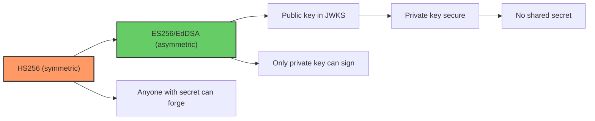
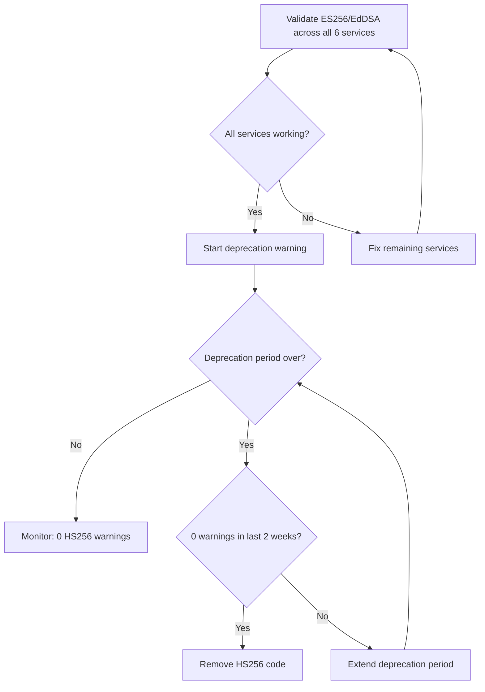

# Story 1.4: Deprecate HS256 Signing Path

## Epic

[01-asymmetric-jwks](../JWT.md)

## Parent Epic Story

Story 1.4

## Summary

Once all 6 services have been validated to work with JWKS-based ES256 or EdDSA, deprecate the HS256 signing path. Remove the HMAC secret configuration option and all code paths that use HS256 signing. Add a deprecation warning period before removing the code entirely.

## Why This Story Exists

The JWT document recommends ES256/EdDSA exclusively: "HS256 is symmetric -- anyone with the secret can forge tokens. Asymmetric (ES256/EdDSA) solves this because the public key (in JWKS) can be freely distributed." HS256 signing is a legacy path that should not be available in production.

## Design Context

### Current State

- `design-doc.md` section 10.1 mentions HS256 as a signing algorithm option
- The HS256 path exists in the codebase as a fallback for development
- No deprecation timeline exists

### Deprecation Timeline

| Phase | Duration | Action |
|-------|----------|--------|
| Phase 1 | 2 weeks | Deprecation warning logged when HS256 is used |
| Phase 2 | 2 weeks | HS256 requests return 400 with deprecation message |
| Phase 3 | After | HS256 code removed entirely |

### Deprecation Warning

```rust
static HS256_DEPRECATED: AtomicBool = AtomicBool::new(false);

fn log_deprecation_warning() {
    if !HS256_DEPRECATED.load(Ordering::Relaxed) {
        warn!("HS256 signing is deprecated. All services should use ES256/EdDSA via JWKS.");
        HS256_DEPRECATED.store(true, Ordering::Relaxed);
    }
}
```

## Mermaid Diagrams

### Deprecation Timeline

```mermaid
gantt
    title HS256 Deprecation Timeline
    dateFormat YYYY-MM-DD
    axisFormat %m/%d
    section Deprecation
    Phase 1: Warning logged       :2026-05-01, 14d
    Phase 2: Return 400 deprecation :2026-05-15, 14d
    Phase 3: Code removed          :2026-05-29, 0d
```

### Signing Algorithm Migration



### Validation Before Removal



## OpenAPI Changes

- Remove HS256 from the list of supported signing algorithms in all OpenAPI specs
- Update the JWT section in each spec to reference ES256/EdDSA only

```yaml
# In each OpenAPI spec's security scheme:
securitySchemes:
  BearerAuth:
    type: http
    scheme: bearer
    bearerFormat: JWT
    description: |
      ES256 (ECDSA P-256) or EdDSA (Ed25519) signed JWT.
      HS256 is deprecated and will be removed in v2.0.
```

## Design Doc References

- `design-doc.md` section 10.1: Token Security -- update to remove HS256 from supported algorithms
- `design-doc.md` section 10.11: Caching Strategy -- JWKS cache TTL when HS256 is removed

## Wiki Pages to Update/Create

- `topics/topic-jwt-schema.md`: Remove HS256 references
- `topics/topic-token-security.md`: Document deprecation timeline

## Acceptance Criteria

- [ ] Deprecation warning is logged when HS256 is used (Phase 1)
- [ ] HS256 requests return 400 with deprecation message (Phase 2)
- [ ] HS256 code is removed from all 6 services (Phase 3)
- [ ] All OpenAPI specs updated to reference ES256/EdDSA only
- [ ] HS256 secret configuration option is removed
- [ ] Unit tests verify: HS256 rejection, ES256/EdDSA acceptance
- [ ] Documentation: migration guide for any remaining HS256 consumers

## Dependencies

- Depends on Story 1.3 (JWKS validation) being validated across all 6 services

## Risk / Trade-offs

- **Breaking change**: Removing HS256 is a breaking change for any client that still uses HS256-signed tokens. The deprecation period (2+ weeks) gives consumers time to migrate.
- **Development environment**: In development, HS256 may be convenient (no JWKS infrastructure needed). Consider providing a "dev mode" flag that allows HS256 but only in development configurations (not production).
