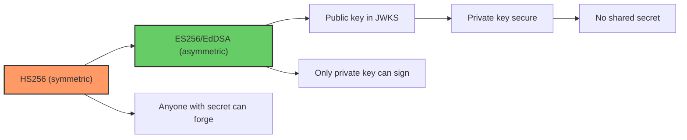
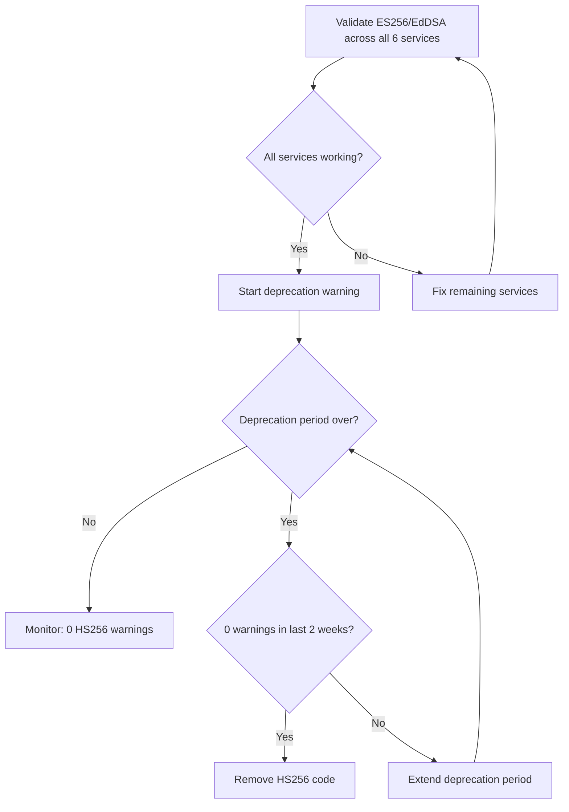

# Story 1.4: Deprecate HS256 Signing Path

## Epic

[01-asymmetric-jwks](../JWT.md)

## Parent Epic Story

Story 1.4

## Summary

Once all 6 services have been validated to work with JWKS-based ES256 or EdDSA, deprecate the HS256 signing path. Remove the HMAC secret configuration option and all code paths that use HS256 signing. Add a deprecation warning period before removing the code entirely.

## Why This Story Exists

The JWT document recommends ES256/EdDSA exclusively: "HS256 is symmetric -- anyone with the secret can forge tokens. Asymmetric (ES256/EdDSA) solves this because the public key (in JWKS) can be freely distributed." HS256 signing is a legacy path that should not be available in production.

## Design Context

### Current State

- `design-doc.md` section 10.1 mentions HS256 as a signing algorithm option
- The HS256 path exists in the codebase as a fallback for development
- No deprecation timeline exists

### Deprecation Timeline

| Phase | Duration | Action |
|-------|----------|--------|
| Phase 1 | 2 weeks | Deprecation warning logged when HS256 is used |
| Phase 2 | 2 weeks | HS256 requests return 400 with deprecation message |
| Phase 3 | After | HS256 code removed entirely |

### Deprecation Warning

```rust
static HS256_DEPRECATED: AtomicBool = AtomicBool::new(false);

fn log_deprecation_warning() {
    if !HS256_DEPRECATED.load(Ordering::Relaxed) {
        warn!("HS256 signing is deprecated. All services should use ES256/EdDSA via JWKS.");
        HS256_DEPRECATED.store(true, Ordering::Relaxed);
    }
}
```

## Mermaid Diagrams

### Deprecation Timeline

```mermaid
gantt
    title HS256 Deprecation Timeline
    dateFormat YYYY-MM-DD
    axisFormat %m/%d
    section Deprecation
    Phase 1: Warning logged       :2026-05-01, 14d
    Phase 2: Return 400 deprecation :2026-05-15, 14d
    Phase 3: Code removed          :2026-05-29, 0d
```

### Signing Algorithm Migration



### Validation Before Removal



## OpenAPI Changes

- Remove HS256 from the list of supported signing algorithms in all OpenAPI specs
- Update the JWT section in each spec to reference ES256/EdDSA only

```yaml
# In each OpenAPI spec's security scheme:
securitySchemes:
  BearerAuth:
    type: http
    scheme: bearer
    bearerFormat: JWT
    description: |
      ES256 (ECDSA P-256) or EdDSA (Ed25519) signed JWT.
      HS256 is deprecated and will be removed in v2.0.
```

## Design Doc References

- `design-doc.md` section 10.1: Token Security -- update to remove HS256 from supported algorithms
- `design-doc.md` section 10.11: Caching Strategy -- JWKS cache TTL when HS256 is removed

## Wiki Pages to Update/Create

- `topics/topic-jwt-schema.md`: Remove HS256 references
- `topics/topic-token-security.md`: Document deprecation timeline

## Acceptance Criteria

- [ ] Deprecation warning is logged when HS256 is used (Phase 1)
- [ ] HS256 requests return 400 with deprecation message (Phase 2)
- [ ] HS256 code is removed from all 6 services (Phase 3)
- [ ] All OpenAPI specs updated to reference ES256/EdDSA only
- [ ] HS256 secret configuration option is removed
- [ ] Unit tests verify: HS256 rejection, ES256/EdDSA acceptance
- [ ] Documentation: migration guide for any remaining HS256 consumers

## Dependencies

- Depends on Story 1.3 (JWKS validation) being validated across all 6 services

## Risk / Trade-offs

- **Breaking change**: Removing HS256 is a breaking change for any client that still uses HS256-signed tokens. The deprecation period (2+ weeks) gives consumers time to migrate.
- **Development environment**: In development, HS256 may be convenient (no JWKS infrastructure needed). Consider providing a "dev mode" flag that allows HS256 but only in development configurations (not production).

## Tests

### Unit Tests

- [ ] **Phase 1: HS256 usage logs deprecation warning**: Given the deprecation flag is set (Phase 1), when a JWT is signed with HS256, assert that exactly one `warn!` log message is emitted containing "HS256 signing is deprecated" and that the `AtomicBool` flag is set so subsequent HS256 usage does not repeat the warning
- [ ] **Phase 2: HS256 signing returns 400**: Given the deprecation flag is in Phase 2, when the signing service attempts to create a JWT with HS256, assert the signing function returns a `400` error (not `401`, not success) with a message indicating deprecation
- [ ] **Phase 2: HS256 token validation rejected**: Given the deprecation flag is in Phase 2, when a consumer service receives a JWT signed with HS256, assert the JWKS validation pipeline returns 401 with `algorithm_not_allowed` (HS256 is not in the allow-list after Phase 2)
- [ ] **Phase 3: HS256 signing code path removed**: After Phase 3, verify that the signing function does NOT contain any `HS256` algorithm variant — the enum or match arm for `HS256` should not compile (code literally removed, not just disabled)
- [ ] **Phase 3: HS256 config option removed**: Verify `JWT_SECRET` environment variable or config option is no longer referenced in the signing module
- [ ] **ES256 signing still works after HS256 removal**: Given ES256 key material, assert that token signing and JWKS-based validation still succeed after the HS256 code is removed
- [ ] **EdDSA signing still works after HS256 removal**: Same as above but for EdDSA tokens

### Integration Tests (BDD-style with `rstest_bdd`)

- [ ] **Scenario: Phase 1 logs warning**: `given` a service in HS256 deprecation Phase 1 → `when` a token is signed with HS256 → `then` the log output contains the deprecation warning exactly once, and subsequent HS256 signing in the same process does not re-log
- [ ] **Scenario: Phase 2 returns 400**: `given` a service in HS256 deprecation Phase 2 → `when` a signing request with HS256 is made → `then` the response is HTTP 400 with `{"error": "HS256 is deprecated"}`
- [ ] **Scenario: Phase 2 consumers reject HS256 tokens**: `given` a consumer service where the HS256 code path is removed from the allow-list → `when` it receives an HS256-signed JWT → `then` validation returns 401 `algorithm_not_allowed`
- [ ] **Scenario: Phase 3 clean removal**: `given` a fully migrated codebase → `when` attempting to compile with HS256 references → `then` compilation fails (no HS256 symbol exists)
- [ ] **Scenario: Migration completes without downtime**: `given` all 6 services have been verified working with EdDSA → `when` Phase 2 begins → `then` 0 HS256 validation errors are observed in the metrics (`jwt_validation_total{reason: "algorithm_not_allowed"}` should be 0 for legitimate traffic)

### Security Regression Tests

- [ ] **No HS256 secret in production config**: Verify that in the production deployment config, no `JWT_SECRET` or HMAC secret is defined — only `JWKS_ISSUER`, `JWKS_CACHE_TTL_SECS`, and `ALGORITHM_ALLOW_LIST`
- [ ] **Dev mode isolation**: If a dev mode flag exists, assert that dev-mode HS256 cannot be enabled in production (the flag is gated behind `debug_assertions!` or a separate `DEV` build feature that is never used in production builds)
- [ ] **No HS256 tokens in the wild post-Phase 3**: Monitor `jwt_validation_total{reason: "invalid_signature"}` or `algorithm_not_allowed` for 7 days post-Phase 3 to confirm 0 HS256-related failures

### Edge Cases

- [ ] **Partial migration**: Simulate a scenario where 5 of 6 services have migrated but one still has HS256 enabled — assert the deprecation warning is logged for the one lagging service and does NOT block the other 5
- [ ] **Rapid config change**: If the service is moved from Phase 1 to Phase 2 in the same process lifecycle, assert the deprecation behavior updates correctly (the AtomicBool state and error response behavior switch atomically)

### Cleanup

- HS256 code removal (Phase 3) is the cleanup itself — the old signing function, HMAC imports, and `JWT_SECRET` config should all be purged
- Integration tests for Phase 1 and Phase 2 should run in the same test binary but with a flag to simulate each phase (use `rstest::fixture` to set the phase state)
- Post-Phase 3 tests must not reference any HS256 code paths — they should compile against the migrated codebase
