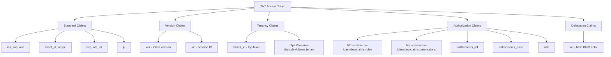
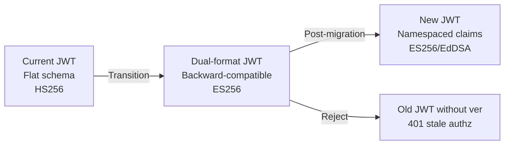
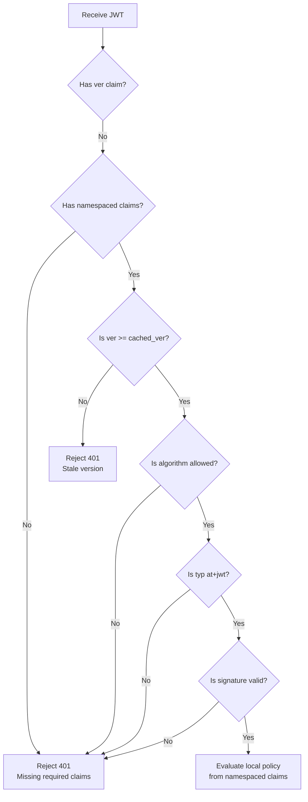

# Story 2.1: Define the New Namespaced Claim Structure

## Epic

[02-claims-schema-evolution](../claims.md)

## Parent Epic Story

Story 2.1

## Summary

Define the complete JWT claim structure: standard RFC 9068 claims, a collision-resistant custom namespace (`https://sesame-idam.dev/claims`) containing authz data, version claims, and optional delegation claims. This is the blueprint for all JWT claim work in the project.

## Why This Story Exists

The current JWT payload embeds PII (email, phone), lacks versioning, has no tenant claim, uses a single-string `user_role` instead of a `roles` array, and has no namespaced structure for collision-resistant custom claims. This story defines the target schema that Epic 2 implements.

## Design Context

### Current Claims (Flat Schema)

```json
{
  "sub": "user-uuid",
  "email": "user@example.com",
  "email_verified": true,
  "name": "John Doe",
  "preferred_username": "johnd",
  "user_id": "user-uuid",
  "first_name": "John",
  "last_name": "Doe",
  "org_id": "org-uuid",
  "org_name": "Acme Inc",
  "user_role": "Admin",
  "user_permissions": ["invoices:write", "invoices:read", "users:manage"],
  "mfa_enabled": true,
  "is_platform_admin": false,
  "phone_number": "+141****1234",
  "phone_verified": true,
  "iat": 1705312800,
  "exp": 1705313700
}
```

### Problems with Current Schema

1. **No tenant claim** -- multi-tenancy is core to Sesame but not in JWT
2. **No `ver`** -- no way to invalidate authz snapshots without full token expiry
3. **No `entitlements_ref`** -- full permission arrays bloat tokens
4. **No `scope`** -- not RFC 9068 compliant
5. **No `sid`** -- session-level revocation not supported
6. **No `act`** -- delegation not supported
7. **PII embedded** -- email and phone in every token
8. **Flat structure** -- no namespace for collision-resistant custom claims
9. **`user_role` is single string** -- not compatible with multi-role users

### Target Schema

```json
{
  "iss": "https://idam.example.com",
  "sub": "user-uuid",
  "aud": ["myapp.com"],
  "client_id": "web-portal",
  "scope": "profile:read preferences:write orders:read",
  "exp": 1715003600,
  "nbf": 1715003300,
  "iat": 1715003300,
  "jti": "tok_abc123",
  "ver": 42,
  "sid": "ses_01JV8W...",
  "tenant_id": "tenant-uuid",
  "user_id": "user-uuid",
  "user_type": "customer",
  "https://sesame-idam.dev/claims": {
    "tenant": "tenant-uuid",
    "portal": "web",
    "roles": ["admin", "billing-viewer"],
    "permissions": ["org:admin", "billing:read"],
    "entitlements_ref": "ent_2c6a7a9f",
    "entitlements_hash": "sha256:7a0d...",
    "risk": "normal"
  }
}
```

### Namespace URI Choice

The JWT document proposes `https://sesame-idam.dev/claims`. This is a valid approach per RFC 7519:
- Registered claims (RFC 7519 Section 4.1) use the standard claim names: `iss`, `sub`, `aud`, `exp`, `nbf`, `iat`, `jti`
- Public names (RFC 7519 Section 4.1) use URI-controlled names to avoid collision
- Private names (RFC 7519 Section 4.2) use URIs controlled by the producer

`https://sesame-idam.dev/claims` is a URI-controlled namespace. The domain `sesame-idam.dev` is controlled by the Sesame project, making it collision-resistant.

## Implementation Notes

### Claim Classification

| Category | Claims | Purpose |
|----------|--------|---------|
| **RFC 9068 standard** | `iss`, `sub`, `aud`, `exp`, `nbf`, `iat`, `jti` | Core token validation |
| **RFC 9068 optional** | `client_id`, `scope` | OAuth access token profile |
| **Version** | `ver`, `sid` | Token snapshot versioning and session identification |
| **Tenancy** | `tenant_id`, `https://sesame-idam.dev/claims.tenant` | Hard-segment isolation boundary |
| **Identity** | `user_id`, `user_type` | User identity (convenience + classification) |
| **Authorization** | `https://sesame-idam.dev/claims.roles`, `.permissions`, `.entitlements_ref`, `.entitlements_hash`, `.risk` | Authorization decisions |
| **Delegation** | `act` | RFC 8693 actor claim (optional) |

### Removed Claims

| Claim | Reason | Replacement |
|-------|--------|-------------|
| `email` | PII in token violates minimal claims principle | Fetch from user profile endpoint |
| `email_verified` | PII in token | Fetch from user profile endpoint |
| `name` | Unnecessary; `user_type` suffices | Fetch from user profile endpoint |
| `preferred_username` | Redundant | Fetch from user profile endpoint |
| `first_name`, `last_name` | PII in token | Fetch from user profile endpoint |
| `phone_number` | PII in token | Fetch from user profile endpoint |
| `phone_verified` | PII in token | Fetch from user profile endpoint |
| `user_role` (single string) | Not compatible with multi-role | `roles` array in namespaced claims |
| `user_permissions` (flat) | Bloats tokens | `permissions` array + `entitlements_ref` in namespaced claims |
| `mfa_enabled` | Not needed for authorization decisions | `risk` claim in namespaced claims (elevated if MFA required) |
| `is_platform_admin` | Redundant with `roles` array | `roles` array includes "platform_admin" if applicable |
| `org_id`, `org_name` | Can be stale; use tenant context | `tenant` in namespaced claims; org resolution on demand |

### Backward Compatibility

During migration, the new claims structure must be backward-compatible:
- The Rust `AccessClaims` struct uses `#[serde(default)]` for optional fields
- Old JWTs (with flat claims) can be deserialized into the new struct with missing fields defaulting to `None`
- Old JWTs without `ver`, `sid`, or namespaced claims are rejected by the version check (Epic 5)
- The transition period allows both old and new JWTs, but old JWTs will have limited functionality (no versioning, no tenant context)

## Mermaid Diagrams

### New Claims Hierarchy



### Claim Migration Path



### Validation of New vs Old JWTs



## OpenAPI Changes

- `LoginResponse` schema: Add `token_version` field (uint64, monotonically increasing)
- `LoginResponse` schema: Add `session_id` field (string, session identification)
- No changes to request schemas needed

```yaml
components:
  schemas:
    LoginResponse:
      type: object
      required: [access_token, refresh_token, token_version]
      properties:
        access_token:
          type: string
          description: JWT access token (ES256-signed)
        refresh_token:
          type: string
          description: Rotating refresh token
        token_version:
          type: integer
          format: int64
          description: Monotonically increasing token version (for revocation)
        session_id:
          type: string
          description: Session identifier
```

## Design Doc References

- `design-doc.md` section 6.2: JWT Schema -- updated with new namespaced structure
- `design-doc.md` section 10.1: Token Security -- claim namespace property
- `design-doc.md` section 10.4: Token Versioning & Revocation -- `ver` claim
- `design-doc.md` section 10.5: Delegation & Actor Claims -- `act` claim
- `design-doc.md` section 10.11: Caching Strategy -- entitlement snapshot cache
- `topics/topic-jwt-schema.md`: Currently RS256 flat schema -- needs complete update
- `topics/topic-login-flow.md`: References old claim structure

## Wiki Pages to Update/Create

- `topics/topic-jwt-schema.md`: Complete rewrite with new claims structure
- `topics/topic-token-lifecycle.md`: (new) Document version claims
- `topics/topic-claims-schema.md`: (new) Detailed claim specification

## Acceptance Criteria

- [ ] The target JWT claim structure is documented in this story
- [ ] All standard RFC 9068 claims are included: `iss`, `sub`, `aud`, `client_id`, `scope`, `exp`, `nbf`, `iat`, `jti`
- [ ] Version claims are included: `ver` (uint64), `sid` (string)
- [ ] Tenancy claims are included: `tenant_id` (top-level), `https://sesame-idam.dev/claims.tenant` (namespaced)
- [ ] Authorization claims are namespaced: `roles`, `permissions`, `entitlements_ref`, `entitlements_hash`, `risk`
- [ ] Delegation claim is optional: `act` (RFC 8693 ActorClaim)
- [ ] PII claims are removed: `email`, `email_verified`, `phone_number`, `phone_verified`, `first_name`, `last_name`, `name`, `preferred_username`
- [ ] `user_role` (single string) is replaced with `roles` (array) in namespaced claims
- [ ] The OpenAPI `LoginResponse` schema includes `token_version` and `session_id`
- [ ] The namespace URI `https://sesame-idam.dev/claims` is documented as collision-resistant per RFC 7519

## Dependencies

- Depends on Story 1.3 (JWKS validation infrastructure for ES256 tokens)
- Required by Epic 3 (token lifecycle), Epic 4 (hybrid authz), Epic 5 (versioning), Epic 6 (delegation)

## Risk / Trade-offs

- **Removing PII from tokens**: Consumers that currently extract email/phone from tokens must switch to the user profile endpoint. This is intentional -- PII should not be embedded in tokens. The migration path is to fetch `GET /api/v1/identity/users/me` when PII is needed.
- **Namespace URI complexity**: The `https://sesame-idam.dev/claims` key is a URI string, not a simple JSON object key. This is valid per RFC 7519 but may require special handling in some JWT libraries. The `serde` attribute `#[serde(rename = "https://sesame-idam.dev/claims")]` handles this in Rust.
- **Token size increase**: The namespaced structure adds one extra key in the JWT header (`https://sesame-idam.dev/claims`), but removes PII fields. Net effect: token size stays similar or decreases (PII removal saves more bytes than namespaced structure adds).
- **Backward compatibility**: Old JWTs without `ver` or namespaced claims are rejected. This is acceptable because:
  1. The transition is planned (Story 1.4 provides dual-mode)
  2. Tokens have short TTLs (5 minutes), so old tokens expire quickly
  3. A 5-minute window of old tokens is acceptable during migration
