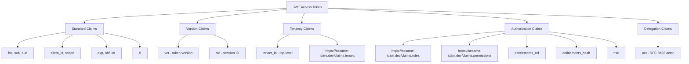
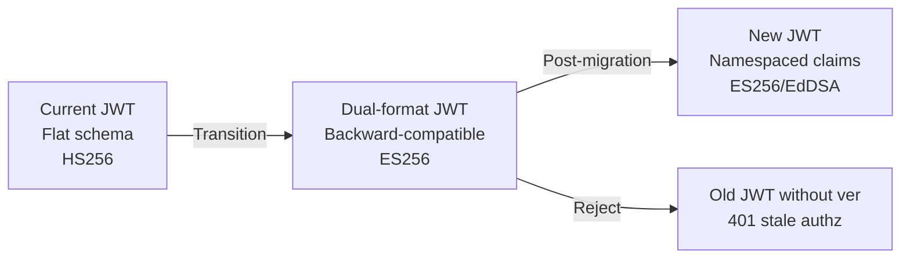
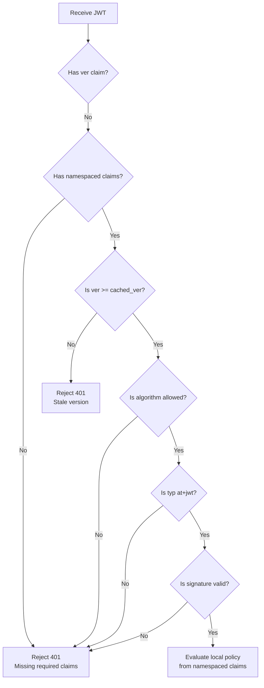

# Story 2.1: Define the New Namespaced Claim Structure

## Epic

[02-claims-schema-evolution](../claims.md)

## Parent Epic Story

Story 2.1

## Summary

Define the complete JWT claim structure: standard RFC 9068 claims, a collision-resistant custom namespace (`https://sesame-idam.dev/claims`) containing authz data, version claims, and optional delegation claims. This is the blueprint for all JWT claim work in the project.

## Why This Story Exists

The current JWT payload embeds PII (email, phone), lacks versioning, has no tenant claim, uses a single-string `user_role` instead of a `roles` array, and has no namespaced structure for collision-resistant custom claims. This story defines the target schema that Epic 2 implements.

## Design Context

### Current Claims (Flat Schema)

```json
{
  "sub": "user-uuid",
  "email": "user@example.com",
  "email_verified": true,
  "name": "John Doe",
  "preferred_username": "johnd",
  "user_id": "user-uuid",
  "first_name": "John",
  "last_name": "Doe",
  "org_id": "org-uuid",
  "org_name": "Acme Inc",
  "user_role": "Admin",
  "user_permissions": ["invoices:write", "invoices:read", "users:manage"],
  "mfa_enabled": true,
  "is_platform_admin": false,
  "phone_number": "+141****1234",
  "phone_verified": true,
  "iat": 1705312800,
  "exp": 1705313700
}
```

### Problems with Current Schema

1. **No tenant claim** -- multi-tenancy is core to Sesame but not in JWT
2. **No `ver`** -- no way to invalidate authz snapshots without full token expiry
3. **No `entitlements_ref`** -- full permission arrays bloat tokens
4. **No `scope`** -- not RFC 9068 compliant
5. **No `sid`** -- session-level revocation not supported
6. **No `act`** -- delegation not supported
7. **PII embedded** -- email and phone in every token
8. **Flat structure** -- no namespace for collision-resistant custom claims
9. **`user_role` is single string** -- not compatible with multi-role users

### Target Schema

```json
{
  "iss": "https://idam.example.com",
  "sub": "user-uuid",
  "aud": ["myapp.com"],
  "client_id": "web-portal",
  "scope": "profile:read preferences:write orders:read",
  "exp": 1715003600,
  "nbf": 1715003300,
  "iat": 1715003300,
  "jti": "tok_abc123",
  "ver": 42,
  "sid": "ses_01JV8W...",
  "tenant_id": "tenant-uuid",
  "user_id": "user-uuid",
  "user_type": "customer",
  "https://sesame-idam.dev/claims": {
    "tenant": "tenant-uuid",
    "portal": "web",
    "roles": ["admin", "billing-viewer"],
    "permissions": ["org:admin", "billing:read"],
    "entitlements_ref": "ent_2c6a7a9f",
    "entitlements_hash": "sha256:7a0d...",
    "risk": "normal"
  }
}
```

### Namespace URI Choice

The JWT document proposes `https://sesame-idam.dev/claims`. This is a valid approach per RFC 7519:
- Registered claims (RFC 7519 Section 4.1) use the standard claim names: `iss`, `sub`, `aud`, `exp`, `nbf`, `iat`, `jti`
- Public names (RFC 7519 Section 4.1) use URI-controlled names to avoid collision
- Private names (RFC 7519 Section 4.2) use URIs controlled by the producer

`https://sesame-idam.dev/claims` is a URI-controlled namespace. The domain `sesame-idam.dev` is controlled by the Sesame project, making it collision-resistant.

## Implementation Notes

### Claim Classification

| Category | Claims | Purpose |
|----------|--------|---------|
| **RFC 9068 standard** | `iss`, `sub`, `aud`, `exp`, `nbf`, `iat`, `jti` | Core token validation |
| **RFC 9068 optional** | `client_id`, `scope` | OAuth access token profile |
| **Version** | `ver`, `sid` | Token snapshot versioning and session identification |
| **Tenancy** | `tenant_id`, `https://sesame-idam.dev/claims.tenant` | Hard-segment isolation boundary |
| **Identity** | `user_id`, `user_type` | User identity (convenience + classification) |
| **Authorization** | `https://sesame-idam.dev/claims.roles`, `.permissions`, `.entitlements_ref`, `.entitlements_hash`, `.risk` | Authorization decisions |
| **Delegation** | `act` | RFC 8693 actor claim (optional) |

### Removed Claims

| Claim | Reason | Replacement |
|-------|--------|-------------|
| `email` | PII in token violates minimal claims principle | Fetch from user profile endpoint |
| `email_verified` | PII in token | Fetch from user profile endpoint |
| `name` | Unnecessary; `user_type` suffices | Fetch from user profile endpoint |
| `preferred_username` | Redundant | Fetch from user profile endpoint |
| `first_name`, `last_name` | PII in token | Fetch from user profile endpoint |
| `phone_number` | PII in token | Fetch from user profile endpoint |
| `phone_verified` | PII in token | Fetch from user profile endpoint |
| `user_role` (single string) | Not compatible with multi-role | `roles` array in namespaced claims |
| `user_permissions` (flat) | Bloats tokens | `permissions` array + `entitlements_ref` in namespaced claims |
| `mfa_enabled` | Not needed for authorization decisions | `risk` claim in namespaced claims (elevated if MFA required) |
| `is_platform_admin` | Redundant with `roles` array | `roles` array includes "platform_admin" if applicable |
| `org_id`, `org_name` | Can be stale; use tenant context | `tenant` in namespaced claims; org resolution on demand |

### Backward Compatibility

During migration, the new claims structure must be backward-compatible:
- The Rust `AccessClaims` struct uses `#[serde(default)]` for optional fields
- Old JWTs (with flat claims) can be deserialized into the new struct with missing fields defaulting to `None`
- Old JWTs without `ver`, `sid`, or namespaced claims are rejected by the version check (Epic 5)
- The transition period allows both old and new JWTs, but old JWTs will have limited functionality (no versioning, no tenant context)

## Mermaid Diagrams

### New Claims Hierarchy



### Claim Migration Path



### Validation of New vs Old JWTs



## Malicious Hacker Gotchas (Must Be Addressed During Implementation)

> **Source:** `docs/PRS_SECURITY_HARDENING.md` — Security threat model analysis

### HACK-211: Namespace URI Can Be Spoofed by a Different Issuer (CRITICAL — Hole #1 from PRS)

**Risk:** Attacker forges a JWT with `https://sesame-idam.dev/claims` to inject fake authorization data

The story defines `https://sesame-idam.dev/claims` as a URI-controlled namespace. Per RFC 7519, public names use "URI-controlled names to avoid collision." But RFC 7519 does NOT guarantee that a namespace URI is only used by its owner.

**Exploit path:**
1. Attacker controls a domain (e.g., `evil-claims.com`)
2. Attacker forges a JWT signed with a known/compromised key
3. Attacker includes in the JWT: `"https://evil-claims.com/claims": {"roles": ["admin"]}`
4. The attacker knows this namespace is NOT Sesame's
5. BUT: what if the service's deserialization code does NOT filter by namespace?
6. The service deserializes the JWT into `AccessClaims` struct
7. If the struct has a field like `pub sx: SxClaims` with `#[serde(rename = "https://sesame-idam.dev/claims")]`, then `serde` will ONLY map the `https://sesame-idam.dev/claims` key to `sx`
8. The attacker's `evil-claims.com/claims` would be silently ignored — CORRECT
9. BUT: what if the service's validation code iterates over ALL keys in the JWT and checks them?
10. Result: If the validation code iterates over all top-level keys, it might find the attacker's namespace and process it incorrectly

**The real exploit is different:** What if the attacker forges a JWT using the SAME `iss` claim as Sesame?

**Exploit path (trusted issuer + forged namespace):**
1. Attacker obtains a valid Sesame JWT (from a log, proxy, or data breach)
2. The JWT has `iss: "https://idam.example.com"` and valid signature
3. Attacker changes the JWT payload: replaces `sx.roles: ["customer"]` with `sx.roles: ["admin"]`
4. The attacker re-signs the JWT with the COMPROMISED private key
5. Result: Attacker has a valid JWT with admin privileges
6. This is NOT a namespace spoofing issue — it's a key compromise issue

**The namespace URI is safe FROM SPOOFING because:**
- `serde` only maps the exact URI key to the `sx` field
- Other URIs are silently ignored
- The `iss` claim + signature verification prevent unauthorized issuers

**But there IS a risk:** What if a different service (not Sesame) also uses `https://sesame-idam.dev/claims`?

**Exploit path (namespace collision with another issuer):**
1. An internal service at Sesame uses `https://sesame-idam.dev/claims` for its OWN purposes
2. The JWT validation code in that service does NOT verify the `iss` claim
3. A Sesame-issued JWT with `https://sesame-idam.dev/claims` is processed by the internal service
4. The internal service reads `sx.roles` from the JWT and uses it for authorization
5. Result: The internal service authorizes based on Sesame's claims, which might not be the intended behavior

**Implementation requirement:**
- The JWT validation pipeline MUST verify the `iss` claim matches the trusted issuer before processing ANY claims
- The `iss` verification MUST happen BEFORE any namespace claim processing
- Add a test: "JWT from untrusted issuer is rejected even if it contains valid namespace claims"
- Document: "JWT issuer must be verified before processing namespace claims. Untrusted issuers are rejected at the signature validation step."

### HACK-212: Malformed Namespace URI Causing Deserialization Errors (HIGH — related to Hole #6 from PRS)

**Risk:** Attacker crafts a JWT with a malformed namespace URI that causes deserialization to panic or produce unexpected results

The story shows: `#[serde(rename = "https://sesame-idam.dev/claims")]`. The key contains `://` which is unusual in JSON keys. While valid per RFC 7519, it could cause issues with some JWT libraries.

**Exploit path (URI parsing error):**
1. Attacker crafts a JWT where the namespaced key is slightly malformed: `"https://SESAME-IDAM.DEV/claims"` (uppercase)
2. The deserializer tries to match this against the `#[serde(rename = "https://sesame-idam.dev/claims")]` attribute
3. Since JSON keys are case-sensitive, `SESAME-IDAM.DEV` ≠ `sesame-idam.dev`
4. The `sx` field deserializes to `None` or default values
5. The user has no roles or permissions → `sx.roles = []`
6. If the authorization logic treats empty roles as "no permissions" → user is denied (safe)
7. BUT: if the authorization logic treats empty roles as "default access" → user is granted unintended access (DANGEROUS)

**Exploit path (null byte in namespace URI):**
1. Attacker crafts a JWT with key `"https://sesame-idam.dev/claims\x00"`
2. Some JWT libraries might strip the null byte during parsing
3. The key becomes `"https://sesame-idam.dev/claims"` (matching the serde rename)
4. The `sx` field is populated with attacker-controlled data
5. If the attacker controls the payload, they can inject `roles: ["admin"]`
6. Result: Authorization bypass via null byte injection

**Implementation requirement:**
- After deserialization, validate that `sx` is `Some(...)` and that it was populated from the expected namespace URI
- Reject JWTs where `sx` is populated but the `iss` claim doesn't match the trusted issuer
- Add input validation: if any JWT header or claim contains null bytes (`\x00`), reject the token immediately
- Document: "JWTs with null bytes in any claim are rejected. Null bytes are not valid in JWT claims per RFC 7519."

### HACK-213: Empty `sx` Claims Treated as Default Access (CRITICAL — related to Hole #3 from PRS)

**Risk:** A JWT without namespaced claims is treated as having default access instead of "no access"

The story says: "Old JWTs without `ver` or namespaced claims are rejected. This is acceptable because... a 5-minute window of old tokens is acceptable during migration."

**Exploit path (zero-access vs default-access confusion):**
1. Attacker has a JWT from an unauthenticated session (no login)
2. The JWT has valid signature (forged with a known key) but NO `sx` claims
3. The deserializer sets `sx = None` (missing namespace)
4. The authorization code checks: `if sx.roles.contains("admin")` → false → denied (correct)
5. BUT: what if the authorization code checks: `if !sx.has_restriction()` → default access granted?
6. Result: The JWT without sx claims is treated as "default access" instead of "no access"

**The story says:** "Old JWTs without `ver` or namespaced claims are rejected by the version check (Epic 5)." But this only rejects JWTs without `ver`. What about JWTs that HAVE `ver` but don't have `sx`?

**Exploit path (ver without sx):**
1. Attacker forges a JWT with `ver: 42` and valid signature, but NO `sx` claims
2. The version check passes: `42 >= cached_ver(41)` → true
3. The authorization code reads `sx = None` → treats as "no restrictions" → grants default access
4. Result: Attacker gains access without proper authorization claims

**Implementation requirement:**
- JWTs with `ver` MUST also have valid `sx` claims (roles, permissions)
- If `sx` is `None` or empty, the JWT MUST be rejected (not granted default access)
- Add a validation step: "After version check, verify `sx` is Some and contains at least one role or permission"
- Document: "JWTs with ver claim must also have valid sx claims. JWTs without sx claims are rejected."

---

## OpenAPI Changes

- `LoginResponse` schema: Add `token_version` field (uint64, monotonically increasing)
- `LoginResponse` schema: Add `session_id` field (string, session identification)
- No changes to request schemas needed

```yaml
components:
  schemas:
    LoginResponse:
      type: object
      required: [access_token, refresh_token, token_version]
      properties:
        access_token:
          type: string
          description: JWT access token (ES256-signed)
        refresh_token:
          type: string
          description: Rotating refresh token
        token_version:
          type: integer
          format: int64
          description: Monotonically increasing token version (for revocation)
        session_id:
          type: string
          description: Session identifier
```

## Design Doc References

- `design-doc.md` section 6.2: JWT Schema -- updated with new namespaced structure
- `design-doc.md` section 10.1: Token Security -- claim namespace property
- `design-doc.md` section 10.4: Token Versioning & Revocation -- `ver` claim
- `design-doc.md` section 10.5: Delegation & Actor Claims -- `act` claim
- `design-doc.md` section 10.11: Caching Strategy -- entitlement snapshot cache
- `topics/topic-jwt-schema.md`: Currently RS256 flat schema -- needs complete update
- `topics/topic-login-flow.md`: References old claim structure

## Wiki Pages to Update/Create

- `topics/topic-jwt-schema.md`: Complete rewrite with new claims structure
- `topics/topic-token-lifecycle.md`: (new) Document version claims
- `topics/topic-claims-schema.md`: (new) Detailed claim specification

## Acceptance Criteria

- [ ] The target JWT claim structure is documented in this story
- [ ] All standard RFC 9068 claims are included: `iss`, `sub`, `aud`, `client_id`, `scope`, `exp`, `nbf`, `iat`, `jti`
- [ ] Version claims are included: `ver` (uint64), `sid` (string)
- [ ] Tenancy claims are included: `tenant_id` (top-level), `https://sesame-idam.dev/claims.tenant` (namespaced)
- [ ] Authorization claims are namespaced: `roles`, `permissions`, `entitlements_ref`, `entitlements_hash`, `risk`
- [ ] Delegation claim is optional: `act` (RFC 8693 ActorClaim)
- [ ] PII claims are removed: `email`, `email_verified`, `phone_number`, `phone_verified`, `first_name`, `last_name`, `name`, `preferred_username`
- [ ] `user_role` (single string) is replaced with `roles` (array) in namespaced claims
- [ ] The OpenAPI `LoginResponse` schema includes `token_version` and `session_id`
- [ ] The namespace URI `https://sesame-idam.dev/claims` is documented as collision-resistant per RFC 7519

## Dependencies

- Depends on Story 1.3 (JWKS validation infrastructure for ES256 tokens)
- Required by Epic 3 (token lifecycle), Epic 4 (hybrid authz), Epic 5 (versioning), Epic 6 (delegation)

## Risk / Trade-offs

- **Removing PII from tokens**: Consumers that currently extract email/phone from tokens must switch to the user profile endpoint. This is intentional -- PII should not be embedded in tokens. The migration path is to fetch `GET /api/v1/identity/users/me` when PII is needed.
- **Namespace URI complexity**: The `https://sesame-idam.dev/claims` key is a URI string, not a simple JSON object key. This is valid per RFC 7519 but may require special handling in some JWT libraries. The `serde` attribute `#[serde(rename = "https://sesame-idam.dev/claims")]` handles this in Rust.
- **Token size increase**: The namespaced structure adds one extra key in the JWT header (`https://sesame-idam.dev/claims`), but removes PII fields. Net effect: token size stays similar or decreases (PII removal saves more bytes than namespaced structure adds).
- **Backward compatibility**: Old JWTs without `ver` or namespaced claims are rejected. This is acceptable because:
  1. The transition is planned (Story 1.4 provides dual-mode)
  2. Tokens have short TTLs (5 minutes), so old tokens expire quickly
  3. A 5-minute window of old tokens is acceptable during migration

## Tests

### Unit Tests

- [ ] **Target schema deserializes**: Create a JWT payload JSON matching the target schema exactly (all claims present) and assert it deserializes into `AccessClaims` with no errors and all fields populated correctly
- [ ] **Old flat schema deserializes with defaults**: Create a legacy JWT payload (flat, PII included, no `ver`, no namespaced claims) and assert it deserializes with `ver=None`, `sx=None`, `sid=None` (due to `#[serde(default)]` on optional fields). This validates backward-compatibility
- [ ] **Namespace key serializes correctly**: Serialize `AccessClaims` to JSON and assert the claims object key is the literal string `"https://sesame-idam.dev/claims"` (not `"claims"` or any other variation)
- [ ] **`https://sesame-idam.dev/claims.tenant` matches top-level `tenant_id`**: Given a claims struct with `tenant_id` and `sx.tenant`, assert both values are identical (consistency invariant)
- [ ] **`roles` is an array**: Given a claims struct with `roles = ["admin", "billing-viewer"]`, assert serialization produces a JSON array, not a single string
- [ ] **PII fields are absent from serialized token**: Serialize a new `AccessClaims` struct and assert the resulting JSON does NOT contain keys: `email`, `email_verified`, `phone_number`, `phone_verified`, `first_name`, `last_name`, `name`, `preferred_username`
- [ ] **`entitlements_hash` is a SHA-256 string**: Given a claims struct with an `entitlements_hash`, assert it matches the format `"sha256:<hex>"` where the hex portion is exactly 64 characters
- [ ] **`act` claim is optional**: Serialize a claims struct with `act=None` and assert the `act` key is omitted from the JSON (not present as `null`). Serialize with `act=Some(ActorClaim{...})` and assert it is present
- [ ] **Token size within budget**: Serialize a realistic `AccessClaims` struct (with roles, permissions, tenant, version, session) and assert the payload is under 8 KB (target: <600 bytes p95, max <750 bytes)
- [ ] **`ver` is monotonic unsigned**: Assert that `ver: u64` accepts values up to `u64::MAX` and rejects negative values (type system enforces this)
- [ ] **`sid` format validation**: Given a session ID like `"ses_01JV8W..."`, assert it matches the expected prefix pattern and length

### Integration Tests (BDD-style with `rstest_bdd`)

- [ ] **Scenario: New claims are present in issued token**: `given` a successful login with a user having `org_admin` role → `when` identity-login-service issues an access token → `then` the decoded JWT contains `typ=at+jwt`, `ver` > 0, `sid` present, `sx.tenant` present, `sx.roles` includes `"org_admin"`, and no PII fields
- [ ] **Scenario: Legacy token deserializes**: `given` an old HS256-signed JWT with flat claims and PII → `when` it is deserialized into `AccessClaims` → `then` PII fields are parsed but ignored by validation logic; `ver=None` triggers version check rejection (Epic 5)
- [ ] **Scenario: Missing namespace claims**: `given` a JWT with valid signature but no namespaced claims block → `when` a service decodes it → `then` `sx` deserializes to `None` or empty struct, and the claim evaluation treats the user as having no roles/permissions
- [ ] **Scenario: LoginResponse includes new fields**: `given` a successful login → `when` the `POST /auth/login` endpoint returns → `then` the response JSON includes `token_version` (integer) and `session_id` (string) fields

### Security Regression Tests

- [ ] **No PII in token payload**: Generate 100 tokens with diverse user data (including sensitive names, emails, phone numbers) and assert NONE of them appear in the JWT payload (only in the external profile endpoint)
- [ ] **Namespace URI collision resistance**: Assert the namespace URI `https://sesame-idam.dev/claims` cannot be spoofed by a different issuer — JWT validation should only accept this namespace from the trusted `iss` (verified in Story 1.3 pipeline)
- [ ] **`user_role` single string is rejected**: Assert that old JWTs with `user_role: "Admin"` (single string, not array) are deserialized but the `roles` array in `sx` is empty (migration path), preventing authorization based on stale role format

### Edge Cases

- [ ] **Empty `roles` array**: A user with no assigned roles — assert `sx.roles = []` serializes as empty JSON array, not `null` or omitted
- [ ] **Very long `entitlements_ref`**: Inject an `entitlements_ref` of 200 characters — assert serialization succeeds and the JWT payload stays under the size budget
- [ ] **Malformed namespace URI**: If a JWT is constructed with `http://sesame-idam.dev/claims` (http instead of https), assert it is either deserialized but treated as a different namespace (no match) or rejected
- [ ] **Maximum `ver` value**: Set `ver` to `u64::MAX` and assert serialization and deserialization round-trip correctly (overflow safety in version comparison logic)

### Cleanup

- No state cleanup required — claim schema tests are pure serialization/deserialization
- Integration tests must not leave old-format tokens in the token cache — ensure the test fixture clears any token caches between scenarios
- Legacy flat-schema test data must not be committed to the repo — generate old-format tokens in-memory in test fixtures only
