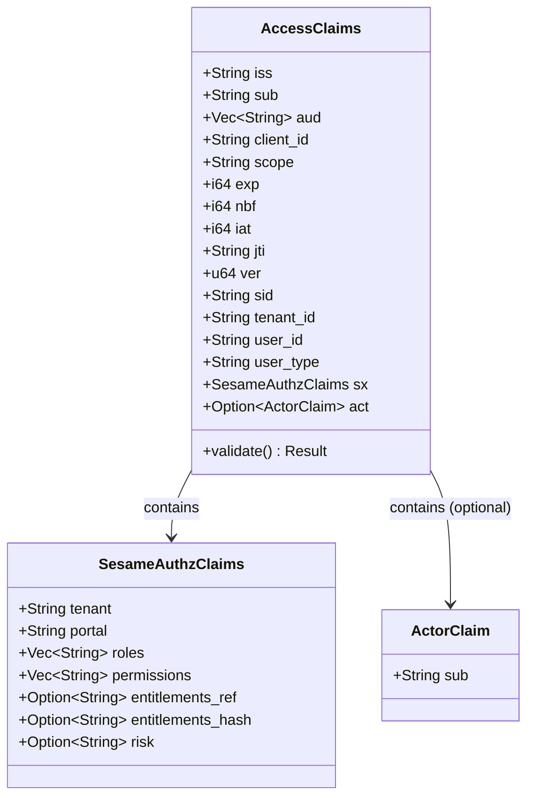
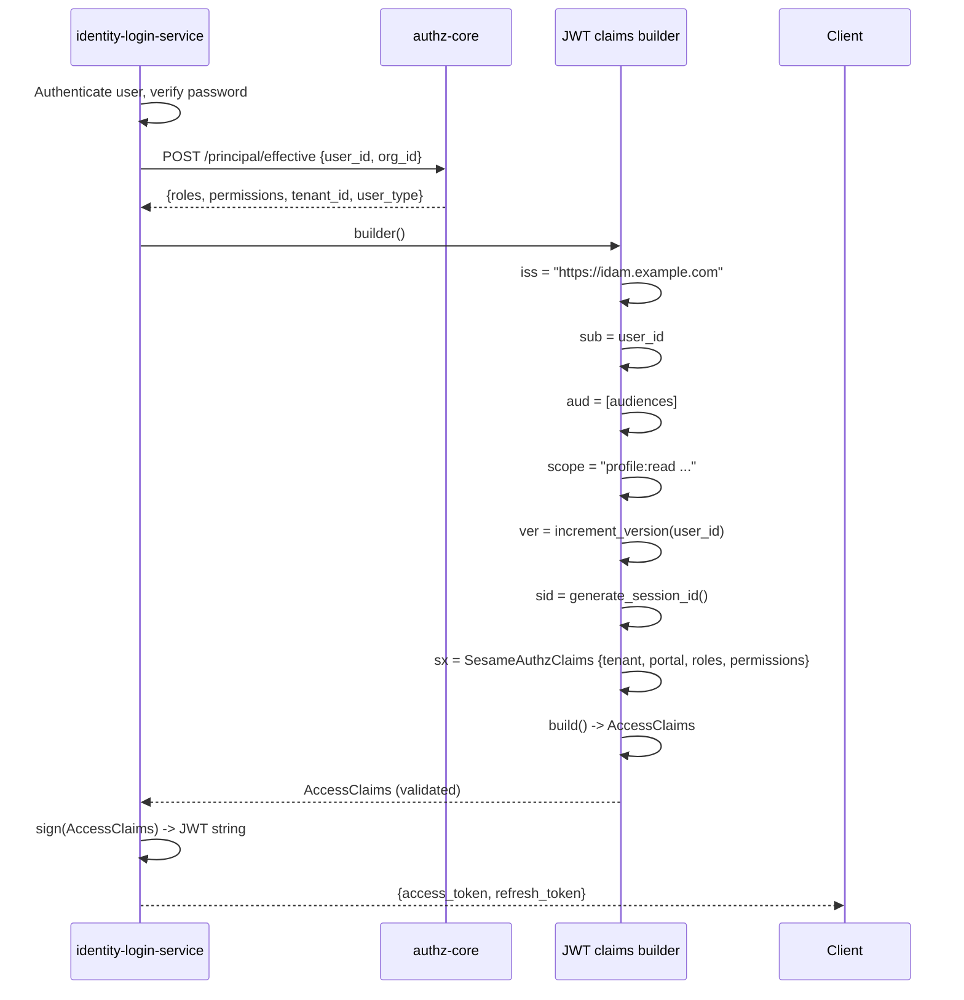
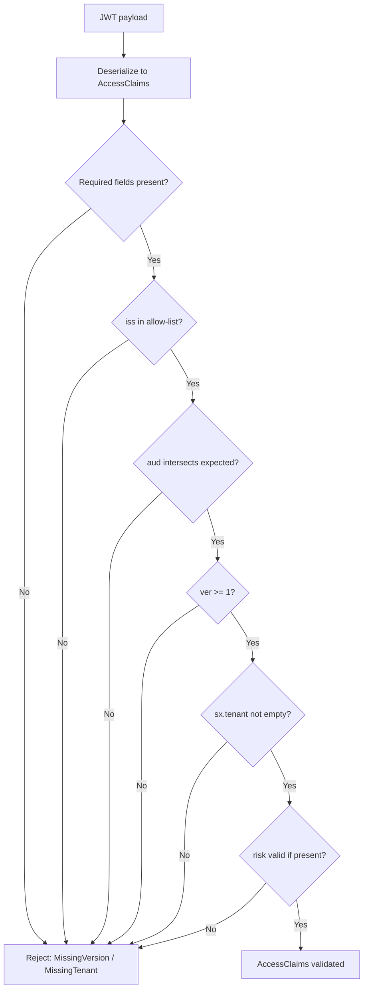

# Story 2.2: Implement New TokenClaims Rust Structs

## Epic

[02-claims-schema-evolution](../claims.md)

## Parent Epic Story

Story 2.2

## Summary

Implement the Rust structs that represent the new JWT claim structure: `ActorClaim` for RFC 8693 `act`, `SesameAuthzClaims` for the namespaced authz data, and `AccessClaims` as the top-level structure. Ensure backward-compatible deserialization during migration and validate required claims on parse.

## Why This Story Exists

The new claim structure defined in Story 2.1 needs Rust implementations that can serialize/deserialize JWT payloads, validate required claims, and provide typed access to each claim. This story implements those Rust types.

## Design Context

### Current Rust Types (from JWT document)

The JWT document references `TokenClaims` structure with registered claims (`sub`, `iss`, `aud`, `exp`, `iat`, `jti`) plus namespaced custom claims for `email`, `org_id`, `portal_type`, and `roles`. The current code signs tokens with HS256.

### Target Rust Types

```rust
// ActorClaim: RFC 8693 delegation actor
#[derive(Debug, Clone, Serialize, Deserialize, PartialEq)]
pub struct ActorClaim {
    pub sub: String,
    // Optional: tenant, portal, roles can be added later
}

// SesameAuthzClaims: namespaced authorization data
#[derive(Debug, Clone, Serialize, Deserialize, PartialEq)]
pub struct SesameAuthzClaims {
    pub tenant: String,
    pub portal: String,
    pub roles: Vec<String>,
    pub permissions: Vec<String>,
    pub entitlements_ref: Option<String>,
    pub entitlements_hash: Option<String>,
    pub risk: Option<String>,
}

// AccessClaims: top-level JWT claim structure
#[derive(Debug, Clone, Serialize, Deserialize, PartialEq)]
pub struct AccessClaims {
    // Standard claims
    pub iss: String,
    pub sub: String,
    pub aud: Vec<String>,
    pub client_id: String,
    pub scope: String,
    pub exp: i64,
    pub nbf: i64,
    pub iat: i64,
    pub jti: String,
    // Version claims
    pub ver: u64,
    pub sid: String,
    // Tenancy
    pub tenant_id: String,
    pub user_id: String,
    pub user_type: String,
    // Namespaced authz claims
    #[serde(rename = "https://sesame-idam.dev/claims")]
    pub sx: SesameAuthzClaims,
    // Optional delegation
    pub act: Option<ActorClaim>,
}
```

### Serialization Considerations

1. **URI key serialization**: The `https://sesame-idam.dev/claims` key must be serialized as a string, not a nested object. The `serde(rename = "...")` attribute handles this.

2. **Deserialization order**: When deserializing, JWT libraries typically deserialize the JOSE header first, then the payload. The payload is deserialized into `AccessClaims`. If the JWT was signed with an old schema (without `ver` or namespaced claims), deserialization fails or produces `None` for required fields.

3. **Backward-compatible deserialization**: Use `#[serde(default)]` on optional fields. However, `ver`, `sid`, and `sx` are required for the new schema -- old JWTs without them should be rejected.

### Validation on Parse

```rust
impl AccessClaims {
    pub fn validate(&self) -> Result<(), JwtValidationError> {
        // Issuer validation
        if !ALLOWED_ISSUERS.contains(&self.iss.as_str()) {
            return Err(JwtValidationError::InvalidIssuer);
        }
        // Audience validation
        if !self.aud.iter().any(|a| EXPECTED_AUDIENCE.contains(a)) {
            return Err(JwtValidationError::InvalidAudience);
        }
        // Token version must be present
        if self.ver == 0 {
            return Err(JwtValidationError::MissingVersion);
        }
        // Tenant must be present
        if self.tenant_id.is_empty() {
            return Err(JwtValidationError::MissingTenant);
        }
        // Authz claims namespace must be present
        if self.sx.tenant.is_empty() {
            return Err(JwtValidationError::MissingAuthzClaims);
        }
        // Risk claim must be valid if present
        if let Some(risk) = &self.sx.risk {
            if !["normal", "elevated", "critical"].contains(&risk.as_str()) {
                return Err(JwtValidationError::InvalidRisk);
            }
        }
        Ok(())
    }
}
```

## Implementation Notes

### Error Types

```rust
#[derive(Debug, Clone, PartialEq)]
pub enum JwtValidationError {
    InvalidIssuer,
    InvalidAudience,
    MissingVersion,
    MissingTenant,
    MissingAuthzClaims,
    InvalidRisk,
    InvalidTokenVersion,
    Expired,
    NotYetValid,
    SignatureInvalid,
}
```

### JWT Claims Builder

```rust
impl AccessClaims {
    pub fn builder() -> AccessClaimsBuilder {
        AccessClaimsBuilder::new()
    }
}

pub struct AccessClaimsBuilder {
    claims: PartialAccessClaims,
}

impl AccessClaimsBuilder {
    pub fn new() -> Self { ... }
    pub fn iss(mut self, iss: String) -> Self { ... }
    pub fn sub(mut self, sub: String) -> Self { ... }
    pub fn aud(mut self, aud: Vec<String>) -> Self { ... }
    pub fn client_id(mut self, client_id: String) -> Self { ... }
    pub fn scope(mut self, scope: String) -> Self { ... }
    pub fn exp(mut self, exp: i64) -> Self { ... }
    pub fn nbf(mut self, nbf: i64) -> Self { ... }
    pub fn iat(mut self, iat: i64) -> Self { ... }
    pub fn jti(mut self, jti: String) -> Self { ... }
    pub fn ver(mut self, ver: u64) -> Self { ... }
    pub fn sid(mut self, sid: String) -> Self { ... }
    pub fn tenant_id(mut self, tenant_id: String) -> Self { ... }
    pub fn user_id(mut self, user_id: String) -> Self { ... }
    pub fn user_type(mut self, user_type: String) -> Self { ... }
    pub fn sx(mut self, sx: SesameAuthzClaims) -> Self { ... }
    pub fn act(mut self, act: ActorClaim) -> Self { ... }
    pub fn build(self) -> Result<AccessClaims, JwtError> { ... }
}
```

### Location in Codebase

The new types go in `common/src/jwt.rs` (or `common/src/token_claims.rs` as a new module). They must be part of the shared crate that all 6 services depend on.

## Mermaid Diagrams

### Claim Structure in Memory



### Claim Construction Flow



### Validation Flow



## OpenAPI Changes

No OpenAPI changes needed for Rust struct implementation (internal code). The OpenAPI schema changes are covered in Story 2.1.

## Design Doc References

- `design-doc.md` section 6.2: JWT Schema -- new namespaced structure
- `design-doc.md` section 10.1: Token Security -- claim structure
- `design-doc.md` section 10.4: Token Versioning -- `ver` claim implementation
- `design-doc.md` section 10.5: Delegation -- `ActorClaim` structure

## Wiki Pages to Update/Create

- `topics/topic-jwt-schema.md`: Document the Rust struct definitions
- `topics/topic-token-lifecycle.md`: Document claims builder pattern
- `topics/topic-claims-schema.md`: (new) Rust type specification

## Acceptance Criteria

- [ ] `ActorClaim` struct is implemented with `sub` field (RFC 8693)
- [ ] `SesameAuthzClaims` struct is implemented with all authz fields
- [ ] `AccessClaims` struct is implemented with all standard, version, tenancy, and authz fields
- [ ] The `https://sesame-idam.dev/claims` key is correctly serialized/deserialized using serde rename
- [ ] `AccessClaims::validate()` checks all required fields: `iss`, `aud`, `ver`, `tenant_id`, `sx.tenant`
- [ ] `AccessClaims::validate()` rejects invalid `risk` values
- [ ] All structs implement `Serialize`, `Deserialize`, `Clone`, `Debug`, `PartialEq`
- [ ] A JWT claims builder pattern is implemented for token construction
- [ ] The types are in the shared crate accessible to all 6 services
- [ ] Unit tests cover: valid claims, missing `ver`, missing `tenant_id`, missing `sx.tenant`, invalid `risk`, valid `act` claim

## Dependencies

- Depends on Story 2.1 (claim structure defined)
- Required by Story 2.2 (claims implementation), Story 3.1 (token construction in refresh), Story 4.2 (JWT middleware), Story 5.1 (version claim access)

## Risk / Trade-offs

- **Required fields**: `ver`, `sid`, and `sx` are required in the new schema. Old JWTs (signed during HS256 transition) will fail deserialization or validation. This is acceptable -- tokens have 5-minute TTLs, so old tokens expire quickly.
- **Serde rename**: The URI key `https://sesame-idam.dev/claims` requires `#[serde(rename = "...")]`. This works but is less ergonomic than a regular Rust field name. It is necessary per RFC 7519 for collision-resistant custom claims.
- **Builder pattern overhead**: The builder pattern adds code volume but provides clarity and validation at construction time. It is the right trade for an IAM system where token correctness is critical.
