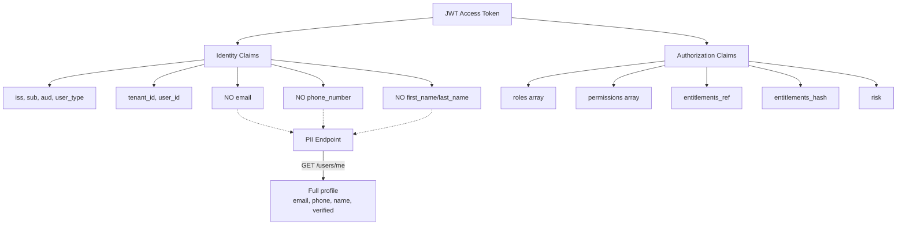
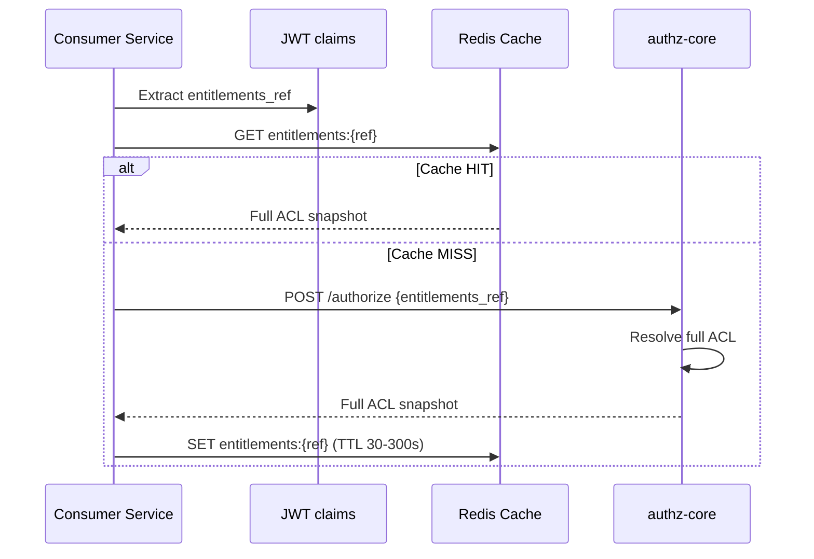
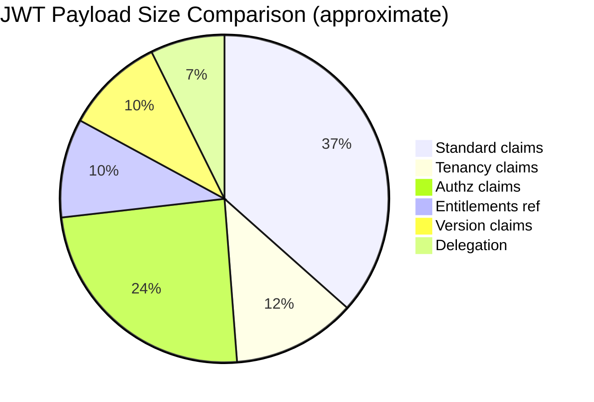

# Story 2.3: Replace PII Fields with References

## Epic

[02-claims-schema-evolution](../claims.md)

## Parent Epic Story

Story 2.3

## Summary

Remove PII fields (`email`, `email_verified`, `phone_number`, `phone_verified`, `first_name`, `last_name`, `name`, `preferred_username`) from the JWT access token. Replace the full permission array with a compact `entitlements_ref` (reference to full ACL snapshot) and `entitlements_hash` (SHA-256 hash of the ACL snapshot). Consumers that need PII or full ACLs must fetch them from dedicated endpoints.

## Why This Story Exists

The JWT document identifies PII in tokens as a risk: it violates the principle of minimal claims (RFC 9068) and increases PII exposure surface. The current JWT embeds email, phone, and full name in every token, which is unnecessary for authorization decisions. Additionally, embedding a full permission array bloats tokens and makes them stale quickly.

## Design Context

### PII Removal

The following claims are removed from the access token:

| Removed Claim | Current Use | Replacement |
|--------------|-------------|-------------|
| `email` | User identification | `GET /api/v1/identity/users/me` endpoint |
| `email_verified` | Verification status | Same endpoint |
| `phone_number` | Contact info | Same endpoint |
| `phone_verified` | Verification status | Same endpoint |
| `first_name`, `last_name` | Display name | Same endpoint |
| `name` | Display name | Same endpoint |
| `preferred_username` | Username | Same endpoint |

### Entitlements Reference vs Full Array

| Aspect | Full Array (Current) | Entitlements Reference (New) |
|--------|---------------------|------------------------------|
| Size | 200-2000 bytes (scales with user complexity) | ~40 bytes (SHA-256 hash) + ~36 bytes (UUID ref) |
| Freshness | Stale until next login | Determined by `ver` claim + cache |
| Lookup cost | None (embedded) | One Redis/DB lookup for full ACL |
| Update cost | Re-sign entire token | Increment `ver`, update cache |

### Entitlements Snapshot Format

The entitlements snapshot is stored in Redis or a cache layer:

```
Key: entitlements:{entitlements_ref}
TTL: 30-300 seconds (configurable)
Value: {
  "version": 42,
  "permissions": ["org:admin", "billing:read", "billing:write"],
  "roles": ["admin", "billing-viewer"],
  "tenant": "tenant-uuid",
  "hash": "sha256:7a0d..."
}
```

The `entitlements_hash` is SHA-256 of the canonical JSON representation of the entitlements snapshot. This allows consumers to verify the snapshot has not changed without fetching the full data.

### Consumer Migration

Services that currently extract PII or permissions from the JWT must be updated:

1. **Frontend SDK**: If the frontend extracts email/phone from the JWT, it must switch to `GET /api/v1/identity/users/me`
2. **Backend services**: If backend services extract permissions from the JWT for route-level authorization, they must switch to the new claims structure (`https://sesame-idam.dev/claims.permissions`)
3. **Entitlement lookups**: Services that need the full ACL must fetch it using the `entitlements_ref` as a cache key

## Implementation Notes

### Token Construction Changes

In the login handler (identity-login-service):

```
Before:
  claims.email = user.email
  claims.email_verified = user.email_confirmed
  claims.phone_number = user.phone_number
  claims.phone_verified = user.phone_confirmed
  claims.first_name = user.first_name
  claims.last_name = user.last_name
  claims.user_permissions = resolve_permissions(user_id, org_id)

After:
  claims.tenant_id = tenant_id
  claims.sx.tenant = tenant_id
  claims.sx.portal = app_name
  claims.sx.roles = resolve_roles(user_id, org_id)
  claims.sx.permissions = resolve_permissions(user_id, org_id)  // bounded set
  claims.sx.entitlements_ref = generate_entitlements_ref(user_id, org_id, version)
  claims.sx.entitlements_hash = compute_hash(claims.sx)  // for verification
```

### Entitlements Reference Generation

```rust
pub fn generate_entitlements_ref(user_id: &str, org_id: &str, version: u64) -> String {
    // Generate a UUID-based reference
    format!("ent_{}", uuid::Uuid::new_v5(
        &uuid::Uuid::NAMESPACE_SHA256,
        format!("{}:{}:{}", user_id, org_id, version).as_bytes()
    ))
}
```

The reference is deterministic for the same (user, org, version) tuple, which allows consistent caching. The actual entitlements data is stored in Redis with key `entitlements:{entitlements_ref}`.

### Redis Integration

When generating a new access token:
1. Compute the entitlements snapshot for the user
2. Generate the `entitlements_ref` and `entitlements_hash`
3. Store the snapshot in Redis with key `entitlements:{entitlements_ref}`, TTL 30-300 seconds
4. Include the reference and hash in the JWT claims

When validating the token:
1. Extract `entitlements_ref` from `sx`
2. Optional: fetch the full snapshot from Redis for fine-grained checks
3. The `entitlements_hash` allows consumers to verify the snapshot integrity

## Mermaid Diagrams

### PII Removal Impact



### Entitlements Lookup Flow



### Token Size Reduction



Old vs New:

| Component | Old JWT (bytes) | New JWT (bytes) | Delta |
|-----------|----------------|----------------|-------|
| Standard claims | 150 | 200 (+50) | +50 |
| Tenancy | 0 | 50 | +50 |
| Identity PII | 200 | 0 | -200 |
| Authz (full array) | 300 | 140 (array + ref) | -160 |
| Version | 0 | 80 | +80 |
| **Total** | **650** | **520** | **-130** |

## OpenAPI Changes

- `LoginResponse` schema: No PII fields in response (token contains no PII)
- New endpoint needed: `GET /api/v1/identity/users/me` (if not already present) returns full profile including PII
- `entitlements_ref` and `entitlements_hash` are in the JWT payload, not in OpenAPI schemas (they are internal JWT claims)

## Design Doc References

- `design-doc.md` section 6.2: JWT Schema -- PII note that email/phone are NOT included
- `design-doc.md` section 10.11: Caching Strategy -- entitlement snapshot cache (30-300s TTL)
- `design-doc.md` section 10.12: Observability -- `token_size_bytes` metric

## Wiki Pages to Update/Create

- `topics/topic-jwt-schema.md`: Note PII removal and entitlements_ref
- `topics/topic-claims-schema.md`: (new) Document entitlement snapshot format

## Acceptance Criteria

- [ ] `email`, `email_verified`, `phone_number`, `phone_verified`, `first_name`, `last_name`, `name`, `preferred_username` are removed from JWT claims
- [ ] `entitlements_ref` is generated deterministically for (user, org, version)
- [ ] `entitlements_hash` is SHA-256 of the canonical JSON representation of the entitlements snapshot
- [ ] Entitlements snapshots are stored in Redis with key `entitlements:{ref}` and TTL 30-300 seconds
- [ ] JWT payload size is under 8KB budget (target: ~520 bytes vs old ~650 bytes)
- [ ] The consumer migration path is documented: PII must be fetched from `GET /api/v1/identity/users/me`
- [ ] Unit tests verify: PII fields are not in the token, entitlements_ref is deterministic, hash matches snapshot

## Dependencies

- Depends on Story 2.2 (claims struct implementation)
- Intersects with Epic 7 (caching strategy) for entitlement snapshot cache

## Risk / Trade-offs

- **Consumer migration**: Services that extract PII from the JWT must be updated to use the user profile endpoint. This is a breaking change for existing consumers. The migration window is short because tokens have 5-minute TTLs.
- **Entitlements cache miss**: If the entitlements cache is empty, consumers must make an additional call to resolve the full ACL. This adds latency for the first request after token issue. The cache TTL (30-300s) minimizes this.
- **Deterministic reference**: The `entitlements_ref` is deterministic, which means if the entitlements data changes but the reference is the same (unlikely with version bumping), the cache would serve stale data. This is mitigated by the `ver` claim and cache TTL.
