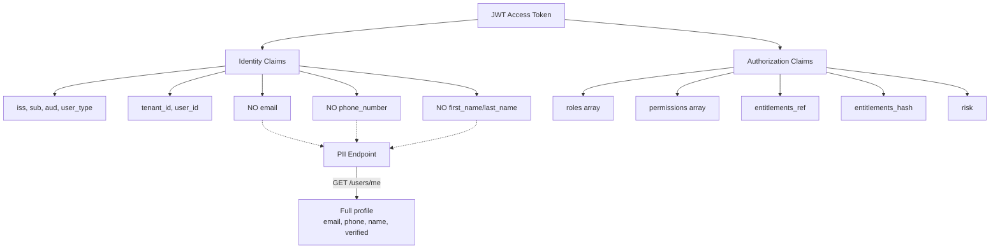
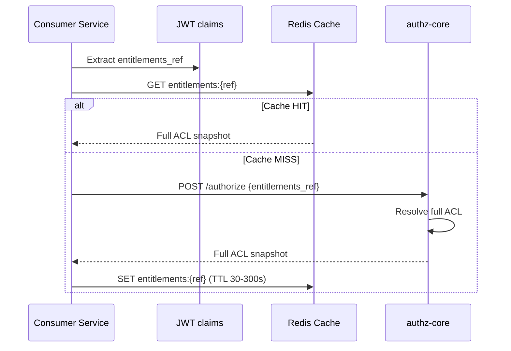
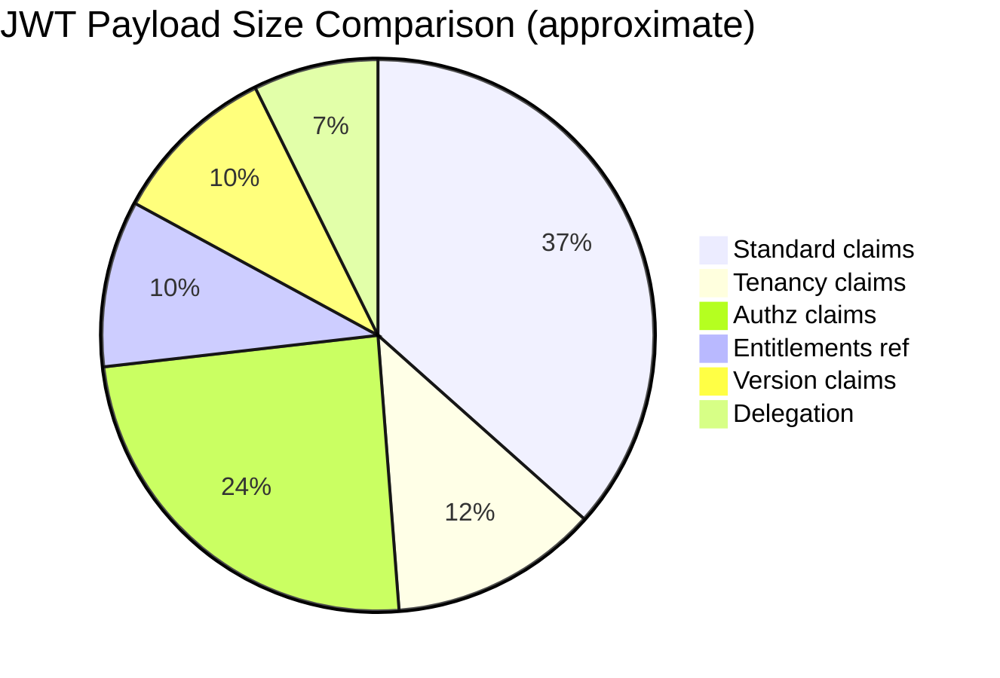

# Story 2.3: Replace PII Fields with References

## Epic

[02-claims-schema-evolution](../claims.md)

## Parent Epic Story

Story 2.3

## Summary

Remove PII fields (`email`, `email_verified`, `phone_number`, `phone_verified`, `first_name`, `last_name`, `name`, `preferred_username`) from the JWT access token. Replace the full permission array with a compact `entitlements_ref` (reference to full ACL snapshot) and `entitlements_hash` (SHA-256 hash of the ACL snapshot). Consumers that need PII or full ACLs must fetch them from dedicated endpoints.

## Why This Story Exists

The JWT document identifies PII in tokens as a risk: it violates the principle of minimal claims (RFC 9068) and increases PII exposure surface. The current JWT embeds email, phone, and full name in every token, which is unnecessary for authorization decisions. Additionally, embedding a full permission array bloats tokens and makes them stale quickly.

## Design Context

### PII Removal

The following claims are removed from the access token:

|| Removed Claim | Current Use | Replacement | Security Note |
|--------------|-------------|-------------|-------------|
| `email` | User identification | `GET /api/v1/identity/users/me` endpoint | PII isolation per RFC 9068 |
| `email_verified` | Verification status | Same endpoint | PII isolation per RFC 9068 |
| `phone_number` | Contact info | Same endpoint | PII isolation per RFC 9068 |
| `phone_verified` | Verification status | Same endpoint | PII isolation per RFC 9068 |
| `first_name`, `last_name` | Display name | Same endpoint | PII isolation per RFC 9068 |
| `name` | Display name | Same endpoint | PII isolation per RFC 9068 |
| `preferred_username` | Username | Same endpoint | PII isolation per RFC 9068 |

### Entitlements Hash Verification (F-007 Fix)

The `entitlements_hash` is NOT only for consumer verification — it MUST be verified by any service that accepts a cached entitlements snapshot from Redis. The verification process:

```rust
fn verify_entitlements_hash(
    snapshot: &EntitlementsSnapshot,
    expected_hash: &str,
) -> Result<(), AuthError> {
    let computed = compute_sha256_canonical_json(snapshot);
    if computed != expected_hash {
        return Err(AuthError::EntitlementsHashMismatch);
        // TODO: Invalidate cache entry and re-fetch from authz-core
    }
    Ok(())
}
```

This prevents tenant bleed if Redis is compromised — a modified ACL snapshot would fail hash verification and the consumer would reject it, falling back to authz-core for the authoritative result.

### Entitlements Reference vs Full Array

| Aspect | Full Array (Current) | Entitlements Reference (New) |
|--------|---------------------|------------------------------|
| Size | 200-2000 bytes (scales with user complexity) | ~40 bytes (SHA-256 hash) + ~36 bytes (UUID ref) |
| Freshness | Stale until next login | Determined by `ver` claim + cache |
| Lookup cost | None (embedded) | One Redis/DB lookup for full ACL |
| Update cost | Re-sign entire token | Increment `ver`, update cache |

### Entitlements Snapshot Format

The entitlements snapshot is stored in Redis or a cache layer:

```
Key: entitlements:{entitlements_ref}
TTL: 30-300 seconds (configurable)
Value: {
  "version": 42,
  "permissions": ["org:admin", "billing:read", "billing:write"],
  "roles": ["admin", "billing-viewer"],
  "tenant": "tenant-uuid",
  "hash": "sha256:7a0d..."
}
```

The `entitlements_hash` is SHA-256 of the canonical JSON representation of the entitlements snapshot. This allows consumers to verify the snapshot has not changed without fetching the full data.

### Consumer Migration

Services that currently extract PII or permissions from the JWT must be updated:

1. **Frontend SDK**: If the frontend extracts email/phone from the JWT, it must switch to `GET /api/v1/identity/users/me`
2. **Backend services**: If backend services extract permissions from the JWT for route-level authorization, they must switch to the new claims structure (`https://sesame-idam.dev/claims.permissions`)
3. **Entitlement lookups**: Services that need the full ACL must fetch it using the `entitlements_ref` as a cache key

## Implementation Notes

### Token Construction Changes

In the login handler (identity-login-service):

```
Before:
  claims.email = user.email
  claims.email_verified = user.email_confirmed
  claims.phone_number = user.phone_number
  claims.phone_verified = user.phone_confirmed
  claims.first_name = user.first_name
  claims.last_name = user.last_name
  claims.user_permissions = resolve_permissions(user_id, org_id)

After:
  claims.tenant_id = tenant_id
  claims.sx.tenant = tenant_id
  claims.sx.portal = app_name
  claims.sx.roles = resolve_roles(user_id, org_id)
  claims.sx.permissions = resolve_permissions(user_id, org_id)  // bounded set
  claims.sx.entitlements_ref = generate_entitlements_ref(user_id, org_id, version)
  claims.sx.entitlements_hash = compute_hash(claims.sx)  // for verification
```

### Entitlements Reference Generation

```rust
pub fn generate_entitlements_ref(user_id: &str, org_id: &str, version: u64) -> String {
    // Generate a UUID-based reference
    format!("ent_{}", uuid::Uuid::new_v5(
        &uuid::Uuid::NAMESPACE_SHA256,
        format!("{}:{}:{}", user_id, org_id, version).as_bytes()
    ))
}
```

The reference is deterministic for the same (user, org, version) tuple, which allows consistent caching. The actual entitlements data is stored in Redis with key `entitlements:{entitlements_ref}`.

### Redis Integration

When generating a new access token:
1. Compute the entitlements snapshot for the user
2. Generate the `entitlements_ref` and `entitlements_hash`
3. Store the snapshot in Redis with key `entitlements:{entitlements_ref}`, TTL 30-300 seconds
4. Include the reference and hash in the JWT claims

When validating the token:
1. Extract `entitlements_ref` from `sx`
2. Optional: fetch the full snapshot from Redis for fine-grained checks
3. The `entitlements_hash` allows consumers to verify the snapshot integrity

## Mermaid Diagrams

### PII Removal Impact



### Entitlements Lookup Flow



### Token Size Reduction



Old vs New:

| Component | Old JWT (bytes) | New JWT (bytes) | Delta |
|-----------|----------------|----------------|-------|
| Standard claims | 150 | 200 (+50) | +50 |
| Tenancy | 0 | 50 | +50 |
| Identity PII | 200 | 0 | -200 |
| Authz (full array) | 300 | 140 (array + ref) | -160 |
| Version | 0 | 80 | +80 |
| **Total** | **650** | **520** | **-130** |

## OpenAPI Changes

- `LoginResponse` schema: No PII fields in response (token contains no PII)
- New endpoint needed: `GET /api/v1/identity/users/me` (if not already present) returns full profile including PII
- `entitlements_ref` and `entitlements_hash` are in the JWT payload, not in OpenAPI schemas (they are internal JWT claims)

## Design Doc References

- `design-doc.md` section 6.2: JWT Schema -- PII note that email/phone are NOT included
- `design-doc.md` section 10.11: Caching Strategy -- entitlement snapshot cache (30-300s TTL)
- `design-doc.md` section 10.12: Observability -- `token_size_bytes` metric

## Wiki Pages to Update/Create

- `topics/topic-jwt-schema.md`: Note PII removal and entitlements_ref
- `topics/topic-claims-schema.md`: (new) Document entitlement snapshot format

## Malicious Hacker Gotchas (Must Be Addressed During Implementation)

> **Source:** `docs/PRS_SECURITY_HARDENING.md` — Security threat model analysis

These are specific attack vectors identified during threat modeling. Each must be considered and mitigated during implementation. If a gotcha cannot be fully mitigated, document the residual risk.

### HACK-201: Entitlements Hash NOT Verified Against Fetched Snapshot (CRITICAL — Hole #1 from PRS)

**Risk:** Cache poisoning via Redis → full privilege escalation

The `verify_entitlements_hash()` function is defined but there's no enforcement that it is CALLED. If a consumer fetches a cached snapshot from Redis and DOES NOT verify the hash, they may act on poisoned data.

**Exploit path:**
1. Attacker compromises Redis (or exploits an insider threat, or predicts cache keys)
2. Attacker modifies the cached entitlements snapshot for user A to include `permissions: ["admin:all"]`
3. Consumer fetches the modified snapshot from Redis
4. Consumer DOES NOT call `verify_entitlements_hash()` — or calls it but ignores the result
5. Consumer grants admin access to user A

**Implementation requirement:**
- `verify_entitlements_hash()` MUST be called after every Redis cache fetch
- The function signature is correct: it takes `(snapshot, expected_hash)` and returns `AuthError::EntitlementsHashMismatch` on mismatch
- **MUST NOT be optional** — callers must handle the error and fall back to authz-core
- The "TODO: Invalidate cache entry and re-fetch from authz-core" in the function body MUST be implemented

```rust
fn verify_entitlements_hash(
    snapshot: &EntitlementsSnapshot,
    expected_hash: &str,
) -> Result<(), AuthError> {
    let computed = compute_sha256_canonical_json(snapshot);
    let computed_str = format!("sha256:{}", computed);
    if computed_str != expected_hash {
        // Invalidate the poisoned cache entry
        METRICS.entitlements_cache_poison_detected.inc();
        return Err(AuthError::EntitlementsHashMismatch);
    }
    Ok(())
}
```

### HACK-202: Entitlements Hash Computed Over Wrong Data (HIGH — Hole #1 from PRS)

**Risk:** Hash covers partial data → false security

The `entitlements_hash` is "SHA-256 of the canonical JSON representation of the entitlements snapshot." But the token also contains `sx.permissions` (a separate field). If the hash covers only the entitlements snapshot stored in Redis but NOT the `sx.permissions` array in the JWT itself, there's a disconnect.

**Exploit path:**
1. `sx.permissions` in JWT = `["user:read"]`
2. Entitlements snapshot in Redis = `{"permissions": ["admin:all", "billing:write"]}`
3. The hash verifies the Redis snapshot (correct)
4. But the handler checks `sx.permissions` (from JWT) not the Redis snapshot
5. Result: permissions in Redis say "admin", handler checks JWT claim and gets "user:read"
6. The hash provides NO protection — it verifies the wrong data source

**Implementation requirement:**
- Decide: which data source is authoritative for permissions?
  - Option A: Redis snapshot is authoritative, JWT `sx.permissions` is a cache hint
  - Option B: JWT `sx.permissions` is authoritative, Redis snapshot is supplementary
- If Option A: consumers MUST use the Redis snapshot (after hash verification) and ignore `sx.permissions`
- If Option B: the `sx.permissions` array MUST be included in the hash computation (not just the Redis snapshot)
- This decision MUST be documented in the story

### HACK-203: Entitlements Reference Can Be Predicted (HIGH — Hole #20 from PRS)

**Risk:** Attacker can enumerate entitlements snapshots

The `generate_entitlements_ref()` function is deterministic: `uuid::Uuid::new_v5(NAMESPACE_SHA256, "user_id:org_id:version")`. If an attacker knows a user_id and org_id, they can compute the entitlements ref for any version.

**Exploit path:**
1. Attacker knows user_id (from URL path or JWT) and org_id (from JWT)
2. Attacker computes `entitlements_ref` for version 1, 2, 3...
3. Attacker queries Redis for `entitlements:{ref}` for each version
4. Attacker finds the latest version's snapshot (which has all current permissions)
5. Attacker reads the full permissions list (may reveal internal system structure)

**Implementation requirement:**
- Consider using a non-deterministic ref (random UUID) instead of version-based
- OR add authentication to Redis entitlements access (only authenticated consumers can read)
- Document: "Entitlements refs are deterministic and potentially enumerable. This is acceptable because the ref is useless without Redis access, and the snapshot is cached with a short TTL"

### HACK-204: Entitlements TTL Too Long (MEDIUM — Hole #14 from PRS)

**Risk:** Entitlements remain valid after permission changes

The entitlements cache TTL is 30-300 seconds (configurable). A user demoted from admin to user still has `permissions: ["admin:all"]` cached for up to 300 seconds (5 minutes).

**Exploit path:**
1. User is admin with permissions cached for 300s
2. User is demoted (ver bumped to 43)
3. User's cached entitlements still contain `["admin:all"]` for up to 300s more
4. The `ver` claim provides protection (if version check is deployed), but without it, the cached permissions are valid for 5 minutes

**Implementation requirement:**
- Keep TTL at 30-300s (document as a trade-off)
- Add `entitlements:{user_id}:{version}` key pattern to allow versioned cache entries
- Ensure the version in the JWT matches the version in the cached snapshot (cross-check)

### HACK-205: PII Removal Breaks Existing Consumers (MEDIUM — operational risk)

**Risk:** If PII is removed from JWT but existing consumers still expect it, they'll break

The "Consumer Migration" section describes the process, but there's no migration window specified. Existing frontend SDKs may expect `email` in the JWT and will fail silently or crash.

**Implementation requirement:**
- Document the migration window: "PII will be removed from JWTs after deployment. Frontend SDKs must be updated BEFORE or SIMULTANEOUSLY with the deployment"
- Consider a transition period where BOTH PII and entitlements_ref are present in the JWT
- Or document: "Migration must be coordinated — PII removal is a BREAKING CHANGE for all consumers"

### HACK-206: Entitlements Snapshot Contains Tenant ID — Cache Key Must Include Tenant (HIGH — Hole #8 from PRS)

**Risk:** Cross-tenant entitlements bleed

The entitlements snapshot format shows `"tenant": "tenant-uuid"`. If the cache key is `entitlements:{entitlements_ref}` and the ref is deterministic from `(user_id, org_id, version)`, two users from different tenants but with the same `(user_id, org_id, version)` would share the same cache entry.

**Exploit path:**
1. User A from Tenant A has `entitlements_ref = "ent_abc123"`
2. User B from Tenant B has the same `entitlements_ref = "ent_abc123"` (same user_id, org_id, version)
3. Both share the same Redis key `entitlements:ent_abc123`
4. Tenant A's admin permissions are served to Tenant B's user

**Implementation requirement:**
- The cache key MUST include the tenant: `entitlements:{tenant_id}:{entitlements_ref}`
- OR the ref generation MUST include the tenant_id: `format!("{}:{}:{}:{}", user_id, org_id, version, tenant_id)`
- This is critical for the multi-tenant isolation model

### HACK-207: Hash Algorithm Not Specified (LOW — but important)

**Risk:** Hash computation algorithm is ambiguous

The story says "SHA-256" in one place and "blake3" in another. The `verify_entitlements_hash()` comment says SHA-256, but the PRS (Hole #1) mentions blake3.

**Implementation requirement:**
- Standardize on ONE hash algorithm for the entire system
- Recommend: SHA-256 (standard, well-tested, no ambiguity)
- Document the choice: "entitlements_hash uses SHA-256 of canonical JSON"
- Canonical JSON means: sorted keys, no whitespace, consistent number formatting

---

## Acceptance Criteria

- [ ] `email`, `email_verified`, `phone_number`, `phone_verified`, `first_name`, `last_name`, `name`, `preferred_username` are removed from JWT claims
- [ ] `entitlements_ref` is generated deterministically for (user, org, version)
- [ ] `entitlements_hash` is SHA-256 of the canonical JSON representation of the entitlements snapshot
- [ ] Entitlements snapshots are stored in Redis with key `entitlements:{ref}` and TTL 30-300 seconds
- [ ] JWT payload size is under 8KB budget (target: ~520 bytes vs old ~650 bytes)
- [ ] The consumer migration path is documented: PII must be fetched from `GET /api/v1/identity/users/me`
- [ ] Unit tests verify: PII fields are not in the token, entitlements_ref is deterministic, hash matches snapshot

## Dependencies

- Depends on Story 2.2 (claims struct implementation)
- Intersects with Epic 7 (caching strategy) for entitlement snapshot cache

## Risk / Trade-offs

- **Consumer migration**: Services that extract PII from the JWT must be updated to use the user profile endpoint. This is a breaking change for existing consumers. The migration window is short because tokens have 5-minute TTLs.
- **Entitlements cache miss**: If the entitlements cache is empty, consumers must make an additional call to resolve the full ACL. This adds latency for the first request after token issue. The cache TTL (30-300s) minimizes this.
- **Deterministic reference**: The `entitlements_ref` is deterministic, which means if the entitlements data changes but the reference is the same (unlikely with version bumping), the cache would serve stale data. This is mitigated by the `ver` claim and cache TTL.

## Tests

### Unit Tests

- [ ] **PII fields absent from serialized token**: Serialize a fully-populated `AccessClaims` struct and assert the resulting JSON payload does NOT contain the keys: `email`, `email_verified`, `phone_number`, `phone_verified`, `first_name`, `last_name`, `name`, `preferred_username`
- [ ] **`entitlements_ref` is deterministic**: Create two `AccessClaims` with the same `(user_id, org_id, ver)` tuple — assert the generated `entitlements_ref` is identical both times
- [ ] **`entitlements_hash` matches canonical JSON**: Create a mock entitlements snapshot, compute its SHA-256 of the canonical JSON serialization, create a token with that hash — assert `token.sx.entitlements_hash == sha256(canonical_json(snapshot))`
- [ ] **`entitlements_ref` format**: Assert the generated reference matches the expected format (UUID or prefixed UUID like `"ent_<uuid>"`)
- [ ] **Hash format validation**: Assert `entitlements_hash` always has the `"sha256:"` prefix followed by a 64-character hex string
- [ ] **Token size budget respected**: Create a representative `AccessClaims` (10 roles, 10 permissions, all claims present) and assert the serialized JSON payload is < 600 bytes (target well under 750-byte budget)
- [ ] **Old PII fields NOT in token payload**: Generate a token for a user with known PII (email `"alice@corp.com"`, phone `"+14155551234"`) — assert these values are completely absent from the JWT payload

### Integration Tests (BDD-style with `rstest_bdd`)

- [ ] **Scenario: Login token has no PII**: `given` a user with a known email and phone number → `when` the user logs in and receives an access token → `then` the decoded JWT payload contains no `email`, `phone_number`, `name`, `first_name`, `last_name` fields
- [ ] **Scenario: Entitlements ref is used in consumer flow**: `given` a token with `sx.entitlements_ref` set → `when` a consumer service receives the token → `then` the service first checks the local cache for `entitlements:{ref}`, and only calls the authz API on cache miss
- [ ] **Scenario: Hash verification on consumer side**: `given` a token with `sx.entitlements_hash` and the consumer fetches the full snapshot from cache — `when` the consumer computes SHA-256 of the cached snapshot — `then` the computed hash matches `token.sx.entitlements_hash` (F-007: consumer-side hash verification)
- [ ] **Scenario: User profile endpoint serves PII**: `given` a valid JWT for user alice — `when` a consumer calls `GET /api/v1/identity/users/me` with the Bearer token — `then` the response includes `email`, `phone_number`, `name` (PII is available via the dedicated endpoint, not the token)

### Security Regression Tests

- [ ] **No PII in token even with special characters**: Test users with PII containing unicode characters, spaces, special chars (e.g., email `"用户@example.com"`, name `"O'Brien"`) — assert none of these values appear in the JWT payload
- [ ] **Entitlements hash prevents tampering**: If a consumer modifies the entitlements snapshot in the cache, assert that recomputing the SHA-256 produces a different hash than the one in the token — the consumer must reject the mismatch

### Edge Cases

- [ ] **Empty entitlements snapshot**: A user with no assigned entitlements — assert `entitlements_ref` is still generated (from the zero-length canonical JSON) and `entitlements_hash` is the SHA-256 of `{}`
- [ ] **Entitlements snapshot with 1000 permissions**: Generate a token for a user with a large entitlements set — assert the token still uses `entitlements_ref` + `entitlements_hash` and stays under the 750-byte budget (the full 1000 permissions are NOT embedded in the token)
- [ ] **Deterministic ref on version bump**: When `ver` is bumped, assert the `entitlements_ref` changes (the reference is version-dependent), ensuring stale cache entries are not served

### Cleanup

- Entitlements snapshots in Redis cache must be cleaned between integration test runs — use a unique Redis prefix or namespace per test run
- Test fixtures must not include PII test data in version-controlled files — generate test PII in-memory only
