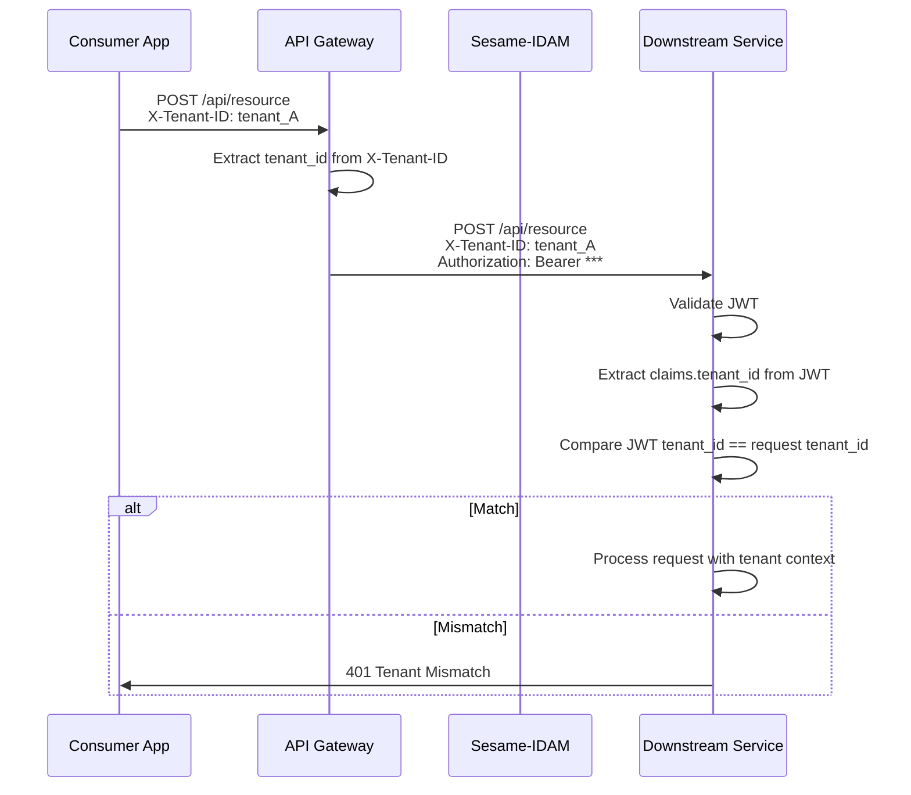
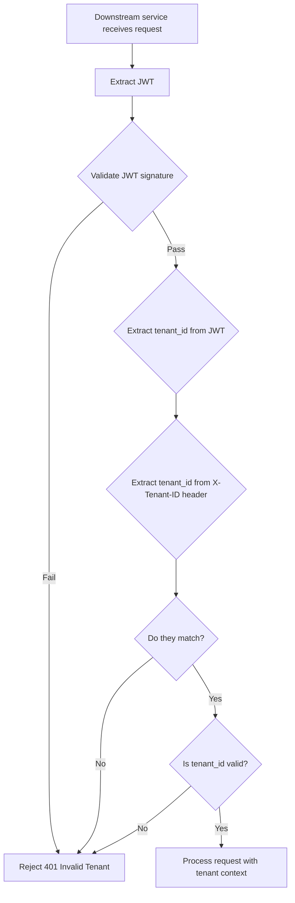

# Story 2.4: Add Tenant to JWT Claims

## Epic

[02-claims-schema-evolution](../claims.md)

## Parent Epic Story

Story 2.4

## Summary

Add the `tenant_id` claim (UUID) to every access token in both the top-level and the namespaced claims structure. This enables downstream services to validate tenant context without a database call, enforcing the hard-segment multi-tenant isolation boundary defined in the Tenancy Model.

## Why This Story Exists

The JWT document identifies "No tenant claim (despite multi-tenancy being core to Sesame)" as a gap. The Tenancy Model wiki states that `tenant_id` is the hard-segment isolation boundary with "zero bleed" between tenants. Every API request includes `X-Tenant-ID`, but the JWT does not carry this claim. Embedding it in the token enables downstream services to validate tenant context without a database call.

## Design Context

### Current State

- Tenants are identified by the `X-Tenant-ID` header in API requests
- `tenant_id` is not in the JWT claims
- The design doc mentions `tenant_id` in the JWT payload example (section 6.2) but the current implementation does not include it
- The Tenancy Model wiki states: "Do include `tenant_id` in JWT claims (`access_token` payload)" -- this is a documented requirement, not yet implemented

### Tenancy Model Requirements

From `topics/topic-tenancy-model.md`:
- **Tenant = Hard-Segment isolation boundary**
- **Same email on different tenants = unrelated users**
- **UNIQUE(tenant_id, email)** prevents duplicate emails within a tenant
- **No cross-tenant identity**: Users, orgs, keys, sessions NEVER cross tenant boundaries
- **Do**: include `tenant_id` in JWT claims
- **Do not**: use `tenant_id` in user-facing URLs

### Claim Placement

`tenant_id` appears in two places:
1. **Top-level**: `tenant_id` at the root of the JWT payload (convenience, backward compat with design doc examples)
2. **Namespaced**: `https://sesame-idam.dev/claims.tenant` in the namespaced authz claims

Both contain the same UUID value. This redundancy ensures that:
- Code that reads the top-level `tenant_id` (from the design doc) still works
- New code reads from the namespaced `sx.tenant` (collision-resistant)

## Implementation Notes

### Claim Population

In the login handler:

```
1. Extract tenant_id from X-Tenant-ID header (or API key context)
2. Set claims.tenant_id = tenant_id
3. Set claims.sx.tenant = tenant_id
4. Validate that the user's tenant matches the request tenant_id
```

### Validation in Downstream Services

```rust
impl AccessClaims {
    pub fn validate_tenant(&self, expected_tenant: &str) -> Result<(), JwtError> {
        if self.tenant_id != expected_tenant {
            return Err(JwtError::TenantMismatch {
                expected: expected_tenant.to_string(),
                actual: self.tenant_id.clone(),
            });
        }
        if self.sx.tenant != expected_tenant {
            return Err(JwtError::TenantMismatch {
                expected: expected_tenant.to_string(),
                actual: self.sx.tenant.clone(),
            });
        }
        Ok(())
    }
}
```

### Tenancy in Different User Types

| User Type | tenant_id in JWT | Notes |
|-----------|-----------------|-------|
| `customer` | Same as request `X-Tenant-ID` | User belongs to this tenant |
| `platform` | Same as request `X-Tenant-ID` | Platform user operates within this tenant |
| `platform_admin` (global) | May be null or "all" | Platform admins may operate across tenants; this is an enterprise feature |

Platform admin tokens that operate across tenants are an **Enterprise opt-in** feature per the Tenancy Model. For the base implementation, all tokens have a single `tenant_id` matching the request tenant.

## Mermaid Diagrams

### Tenant Claim Flow



### Multi-Tenant Isolation in JWT

```mermaid
graph TB
    subgraph "Tenant A (hauliage)"
        A1["User: alice@hauliage.com"]
        A2[JWT: tenant_id = tenant_hauliage]
        A1 --> A2
    end
    subgraph "Tenant B (rerp)"
        B1["User: alice@rerp.com"]
        B2[JWT: tenant_id = tenant_rerp]
        B1 --> B2
    end
    
    Note: alice@hauliage.com and alice@rerp.com are COMPLETELY unrelated users
    Note: Their JWTs have DIFFERENT tenant_id claims
    Note: No cross-tenant identity exists
```

### Downstream Tenant Validation



## Malicious Hacker Gotchas (Must Be Addressed During Implementation)

> **Source:** `docs/PRS_SECURITY_HARDENING.md` — Security threat model analysis

### HACK-241: Tenant ID Can Be Stolen via JWT Token Replay (CRITICAL — Hole #5 from PRS)

**Risk:** Attacker steals a JWT and uses it to access a different tenant's data

The story says: `tenant_id` is in the JWT payload (signed, not encrypted). The design doc says: "Do include `tenant_id` in JWT claims." But the JWT is NOT encrypted — it's base64url-encoded JSON. Anyone who intercepts the JWT can read the `tenant_id`.

**Exploit path (tenant enumeration via stolen JWT):**
1. Attacker compromises a user's network traffic (MITM, proxy, or log access)
2. Attacker captures the user's JWT: `eyJhbGciOiJFUzI1NiJ9.eyJ0ZW5hbnRfaWQiOiJ0ZW5hbnRfYWJjIiwic3ViIjoidXNlcl8xMjMiLC...`
3. The attacker decodes the JWT payload: `{"tenant_id": "tenant_abc", "sub": "user_123", ...}`
4. The attacker now knows the exact tenant_id of the compromised user
5. The attacker can use this tenant_id to target other users in the same tenant
6. Result: Tenant enumeration from a stolen token

**This is a design limitation:** the `tenant_id` is in the JWT payload (base64url-encoded, not encrypted). Anyone who can read the JWT can read the tenant_id.

**But the risk is limited:** the `tenant_id` is already visible from the `X-Tenant-ID` header. If the attacker has intercepted the JWT, they likely also have access to the `X-Tenant-ID` header. So the JWT payload does not add significant risk beyond what's already exposed.

**The real risk is different:** What if the attacker FORGES a JWT with a different `tenant_id` to access another tenant's data?

**Exploit path (tenant ID forgery):**
1. Attacker forges a JWT with `tenant_id: "tenant_abc"` and a valid signature (using a compromised key)
2. Attacker sends the forged JWT to the service
3. The service validates the signature → valid
4. The service extracts `tenant_id` from the JWT → `tenant_abc`
5. The service queries the database with `WHERE tenant_id = 'tenant_abc'`
6. If the attacker's query targets tenant_abc's data → attacker gains access
7. BUT: the attacker doesn't need to forge the tenant_id — they just need to forge ANY valid JWT

**The tenant_id forgery is NOT a vulnerability by itself** — it's a consequence of key compromise. The real protection is the JWT signature verification.

**The real exploit is different:** What if the JWT's `tenant_id` doesn't match the request's `X-Tenant-ID` header?

**Exploit path (tenant mismatch via header manipulation):**
1. Attacker has a valid JWT with `tenant_id: "tenant_abc"` (user from tenant A)
2. Attacker modifies the `X-Tenant-ID` header to `tenant_xyz`
3. The attacker sends the request to a service in tenant xyz
4. The service extracts `X-Tenant-ID` from the request → `tenant_xyz`
5. The service extracts `tenant_id` from the JWT → `tenant_abc`
6. The service compares: `tenant_abc != tenant_xyz` → REJECT (correct, per the story)
7. BUT: what if the service does NOT compare them? What if it only uses the JWT's tenant_id?
8. Result: The user from tenant A accesses tenant xyz's data using their tenant A JWT

**This is the CRITICAL exploit:** if the downstream service does NOT validate `claims.tenant_id == X-Tenant-ID`, a user's JWT can be used to access ANY tenant's data.

**Implementation requirement:**
- EVERY downstream service MUST validate `claims.tenant_id == X-Tenant-ID` before processing any request
- If the service receives no `X-Tenant-ID` header, it MUST reject the request with 400
- The validation MUST happen BEFORE any database query — the tenant_id is used to construct the WHERE clause
- Add a middleware: "Tenant ID Validation Middleware" that runs before route handlers
- Log a WARN entry whenever a tenant mismatch is detected: "Tenant mismatch: JWT=tenant_abc, X-Tenant-ID=tenant_xyz"
- Document: "Every downstream service MUST validate claims.tenant_id == X-Tenant-ID. Mismatches are logged and rejected."

### HACK-242: Tenant ID in JWT Is NOT Confidential — Leaks to All Token Consumers (HIGH — related to Hole #1 from PRS)

**Risk:** The `tenant_id` in the JWT reveals tenant information to any service or client that can read the JWT

The story acknowledges: "The JWT is signed, not encrypted. Any service that can decode the JWT can see the `tenant_id`." This is by design, but it means:

**Exploit path (tenant information leakage):**
1. Attacker gains access to a downstream service's logs (e.g., via an SSRF bug, or access to the service's debug endpoint)
2. The service's request logs include the JWT (e.g., in the `Authorization` header)
3. The attacker decodes the JWT and reads the `tenant_id`
4. The attacker now knows which tenants are using the platform
5. If the service logs multiple JWTs, the attacker can map out all tenants on the platform
6. Result: Tenant enumeration via log analysis

**But this is a general JWT risk, not specific to the tenant_id claim.** Any claim in the JWT is visible to anyone who can read the token.

**The real risk is different:** What if the `tenant_id` is used in a context where it should NOT be visible?

**Exploit path (tenant_id visible in URL fragments):**
1. Attacker crafts a malicious HTML page that includes an `` tag pointing to the API
2. The browser includes the JWT in the `Authorization` header
3. If the API returns a redirect (302) to a URL containing the JWT, the JWT (including `tenant_id`) is leaked to the redirect target
4. Result: tenant_id leakage via redirect URLs

**Implementation requirement:**
- Consider: should `tenant_id` be in the JWT payload at all? The `X-Tenant-ID` header already carries this information.
- Alternative: remove `tenant_id` from the JWT payload and rely solely on the `X-Tenant-ID` header
- If `tenant_id` is retained in the JWT, it must be treated as EXPOSED INFORMATION (not confidential)
- Document: "`tenant_id` in the JWT is NOT confidential. Any entity that can read the JWT can read the tenant_id. Treat it as public information."

### HACK-243: Tenant ID Mismatch Validation Can Be Bypassed by Omitting X-Tenant-ID (CRITICAL — related to Hole #5 from PRS)

**Risk:** Attacker omits the `X-Tenant-ID` header to bypass tenant validation

The story shows: `validate_tenant()` checks that the JWT's `tenant_id` matches the request's `X-Tenant-ID`. But what happens if the header is MISSING?

**Exploit path (missing header bypass):**
1. Attacker sends a request without the `X-Tenant-ID` header
2. The service extracts `X-Tenant-ID` → None
3. The service extracts `tenant_id` from the JWT → `tenant_abc`
4. The service calls `validate_tenant(None)`
5. If `validate_tenant(None)` compares `tenant_abc == None` → returns `Err(JwtError::TenantMismatch)` → REJECTED (correct)
6. BUT: what if `validate_tenant()` returns `Ok(())` when the expected tenant is `None`? (e.g., if the function treats `None` as "no tenant constraint")
7. Result: The request is processed without tenant context, potentially exposing all tenants' data

**This is the CRITICAL exploit:** if the tenant validation function does NOT handle the `None` case correctly, ALL tenants' data could be exposed.

**The risk is real:** if the downstream service has a bug where it does NOT pass the `X-Tenant-ID` to the database query layer, the attacker can omit the header and access ALL data in the database (not just one tenant's data).

**Implementation requirement:**
- The `validate_tenant()` function MUST return `Err` when `expected_tenant` is `None`
- The JWT middleware MUST reject requests without an `X-Tenant-ID` header with 400 Bad Request
- The database layer MUST ALWAYS include `WHERE tenant_id = ?` in every query — NEVER allow queries without tenant scoping
- Add an audit: "Search all database queries in the codebase and verify that every query includes a tenant_id WHERE clause"
- Document: "Requests without X-Tenant-ID are rejected with 400. Database queries ALWAYS include tenant_id WHERE clause."

### HACK-244: Tenant ID in JWT Is Fixed at Issue Time — Cannot Reflect Real-Time Tenant Changes (MEDIUM — related to Hole #3 from PRS)

**Risk:** A user's tenant context changes (e.g., they are moved to a different tenant by an admin), but their JWT still contains the old tenant_id

The story says: "A token's `tenant_id` is fixed at issue time." This is correct for a JWT — the payload is signed and cannot be changed without invalidating the signature.

**Exploit path:**
1. User A is in tenant_abc and has a valid JWT with `tenant_id: "tenant_abc"`
2. Admin moves user A to tenant_xyz (via org management API)
3. User A continues to use their old JWT (with `tenant_id: "tenant_abc"`)
4. The service validates the JWT → `tenant_abc` is valid → processed
5. The service queries the database with `WHERE tenant_id = 'tenant_abc'` → returns tenant_abc's data
6. BUT: user A is now in tenant_xyz, so the data returned is from the WRONG tenant
7. Result: user A sees data from their PREVIOUS tenant (tenant_abc) even though they've been moved

**This is a design gap:** the user's tenant_id in the JWT is stale after a tenant move. The user must re-authenticate to get a new JWT with the updated tenant_id.

**Implementation requirement:**
- Document: "When a user's tenant changes, all existing JWTs MUST be invalidated (added to denylist)."
- The org management API that handles tenant moves MUST trigger a version bump AND denylist ALL existing tokens for the affected user
- The version bump ensures new tokens have the updated tenant context
- Document: "Tenant moves trigger an immediate version bump and token denylist for the affected user."

### HACK-245: Tenant ID UUID Format Can Be Manipulated via UUID Spoofing (MEDIUM — related to Hole #6 from PRS)

**Risk:** Attacker crafts a JWT with a `tenant_id` that looks like a valid UUID but targets a non-existent tenant

The story says: "`tenant_id` is a valid UUID format." But a UUID is just a 36-character string. An attacker can forge a UUID that doesn't correspond to any real tenant.

**Exploit path:**
1. Attacker forges a JWT with `tenant_id: "00000000-0000-0000-0000-000000000000"` (all zeros)
2. The UUID format validation passes (it's a valid UUID)
3. The service queries the database with `WHERE tenant_id = '00000000-0000-0000-0000-000000000000'`
4. No results are returned (no such tenant exists) → empty result set
5. If the service treats an empty result set as "access denied" → safe
6. BUT: if the service treats an empty result set as "all data" (no rows found → return everything) → DANGEROUS

**Implementation requirement:**
- The service MUST verify that the `tenant_id` from the JWT corresponds to a REAL tenant in the database
- If the tenant does not exist → reject with 401 "Invalid tenant"
- The tenant validation MUST happen BEFORE any data query
- Document: "The JWT's tenant_id is verified against the tenant registry. Non-existent tenants are rejected."

---

## OpenAPI Changes
- No changes to request schemas needed (tenant_id is derived from `X-Tenant-ID` header)

```yaml
components:
  schemas:
    LoginResponse:
      type: object
      properties:
        tenant_id:
          type: string
          format: uuid
          description: Tenant UUID (hard-segment isolation boundary)
```

## Design Doc References

- `design-doc.md` section 6.2: JWT Schema -- `tenant_id` field already present in the design doc example
- `design-doc.md` section 5.0: Multi-Tenant Partitioning -- tenant_id column on every major entity
- `topics/topic-tenancy-model.md`: "Do include `tenant_id` in JWT claims (`access_token` payload)"
- `topics/topic-tenancy-model.md`: Tenancy Model Core Rules -- tenant_id maps to isolation boundary

## Wiki Pages to Update/Create

- `topics/topic-tenancy-model.md`: Verify that JWT tenant_id is documented as implemented
- `topics/topic-jwt-schema.md`: Document tenant_id in JWT claims

## Acceptance Criteria

- [ ] `tenant_id` (UUID) is included in every access token at the top level
- [ ] `tenant_id` is included in the namespaced claims: `https://sesame-idam.dev/claims.tenant`
- [ ] Both top-level and namespaced `tenant_id` contain the same UUID value
- [ ] The `tenant_id` in the JWT matches the `X-Tenant-ID` header from the login request
- [ ] Downstream services can validate `claims.tenant_id` against the request's `X-Tenant-ID`
- [ ] Platform admin tokens (if implemented) have the correct `tenant_id`
- [ ] Unit tests verify: tenant_id matches request, tenant_id is valid UUID, tenant_id is present in both locations

## Dependencies

- Depends on Story 2.2 (claims struct implementation includes `tenant_id` field)
- Intersects with Epic 4 (hybrid authz) for tenant-scoped route classification

## Risk / Trade-offs

- **Tenant ID in JWT is not encrypted**: The JWT is signed, not encrypted. Any service that can decode the JWT can see the `tenant_id`. This is intentional -- `tenant_id` is not a secret, it is an authorization boundary. The risk is that a stolen JWT reveals the tenant, which is already visible from the `X-Tenant-ID` header.
- **Platform admin cross-tenant access**: Platform admins (e.g., Sesame operators) may need to operate across tenants. This is an Enterprise opt-in feature. For the base implementation, all tokens have a single `tenant_id`. Cross-tenant admin tokens would use a special `tenant_id` value (e.g., "all" or null) with elevated risk level.
- **No tenant change after token issue**: A token's `tenant_id` is fixed at issue time. If a user moves between tenants (unlikely, as users are strictly scoped to one tenant), they must re-authenticate to get a new token. This is correct -- there is no cross-tenant identity.

## Tests

### Unit Tests

- [ ] **`tenant_id` matches between top-level and namespaced claims**: Create an `AccessClaims` with `tenant_id = "tenant-abc"` and `sx.tenant = "tenant-abc"`, assert both fields are identical (consistency invariant)
- [ ] **`tenant_id` is a valid UUID format**: Generate a `tenant_id` string and assert it matches the UUID regex pattern (`[0-9a-f]{8}-[0-9a-f]{4}-[0-9a-f]{4}-[0-9a-f]{4}-[0-9a-f]{12}`)
- [ ] **`validate_tenant()` rejects mismatch**: Create an `AccessClaims` with `tenant_id = "tenant-abc"`, call `validate_tenant("tenant-def")`, assert it returns `JwtError::TenantMismatch { expected: "tenant-def", actual: "tenant-abc" }`
- [ ] **`validate_tenant()` accepts match**: Create an `AccessClaims` with `tenant_id = "tenant-abc"`, call `validate_tenant("tenant-abc")`, assert it returns `Ok(())`
- [ ] **Top-level `tenant_id` populates on login**: Given a login request with `X-Tenant-ID: tenant-abc`, assert the issued JWT payload contains `tenant_id: "tenant-abc"` at the root level
- [ ] **Namespaced `sx.tenant` populates on login**: Same login request — assert the decoded JWT payload contains `"https://sesame-idam.dev/claims": { "tenant": "tenant-abc", ... }`
- [ ] **User's actual tenant matches request tenant**: In the login handler, given a user record with `tenant_id = "tenant-abc"` and a login request with `X-Tenant-ID: tenant-def`, assert the login is rejected (401) — users cannot authenticate as a different tenant

### Integration Tests (BDD-style with `rstest_bdd`)

- [ ] **Scenario: Tenant ID flows from login to token**: `given` a user belonging to tenant `hauliage` (UUID: `abc-123`) → `when` the user logs in with `X-Tenant-ID: abc-123` → `then` the access token's `tenant_id` field equals `abc-123` in both top-level and `sx.tenant`
- [ ] **Scenario: Cross-tenant login is rejected**: `given` a user registered under tenant `hauliage` → `when` the user attempts to login with `X-Tenant-ID: rerp` → `then` the login returns 401 with a tenant-mismatch error (not a password error — prevents tenant enumeration)
- [ ] **Scenario: Downstream service validates tenant**: `given` a JWT with `tenant_id = "hauliage"` → `when` a downstream service receives the request with `X-Tenant-ID: rerp` → `then` the service rejects the request with 401 Tenant Mismatch (the JWT tenant and header tenant don't match)
- [ ] **Scenario: Tenant ID present in LoginResponse**: `given` a successful login → `when` the `LoginResponse` is returned → `then` it includes a `tenant_id` field matching the tenant of the authenticated user
- [ ] **Scenario: Different users on different tenants have different JWT tenants**: `given` user alice on tenant `hauliage` and user alice on tenant `rerp` → `when` both login → `then` alice@hauliage's JWT has `tenant_id = hauliage_uuid` and alice@rerp's JWT has `tenant_id = rerp_uuid` — confirming zero cross-tenant identity

### Security Regression Tests

- [ ] **Tenant ID cannot be forged in token**: If a client modifies the `tenant_id` claim in a validly-signed token, assert that the JWT signature verification fails (the token cannot be tampered with — only the issuer can set the tenant)
- [ ] **Tenant ID matches request header**: For every login request, assert `claims.tenant_id == X-Tenant-ID` header value — never allow the token's tenant to differ from the request's tenant
- [ ] **No tenant_id leakage across login sessions**: Assert that a login to tenant A never results in a JWT containing tenant B's UUID (test with sequential logins to different tenants using the same client)

### Edge Cases

- [ ] **Malformed tenant_id UUID**: If a request sends `X-Tenant-ID: not-a-uuid`, assert the login fails before token generation (tenant validation happens before JWT issuance)
- [ ] **Null tenant_id**: If the user's database record has no `tenant_id` (data corruption edge case), assert the login handler rejects it (500 error, not a token issued with null tenant)
- [ ] **Tenant ID with special characters in UUID**: UUIDs should only contain hex characters and hyphens — assert any `tenant_id` containing non-hex characters is rejected

### Cleanup

- Tenant data in the test database must be isolated per test — use unique UUIDs for each test's tenant to prevent cross-test leakage
- Redis cache keys prefixed with tenant_id must be cleaned between test scenarios (use `DEL hauliage:*` or a per-test Redis namespace)
- Integration tests must not leave tokens in a "stale" state — tokens are 5-minute TTL, so they expire naturally; no explicit cleanup needed for JWT tokens
