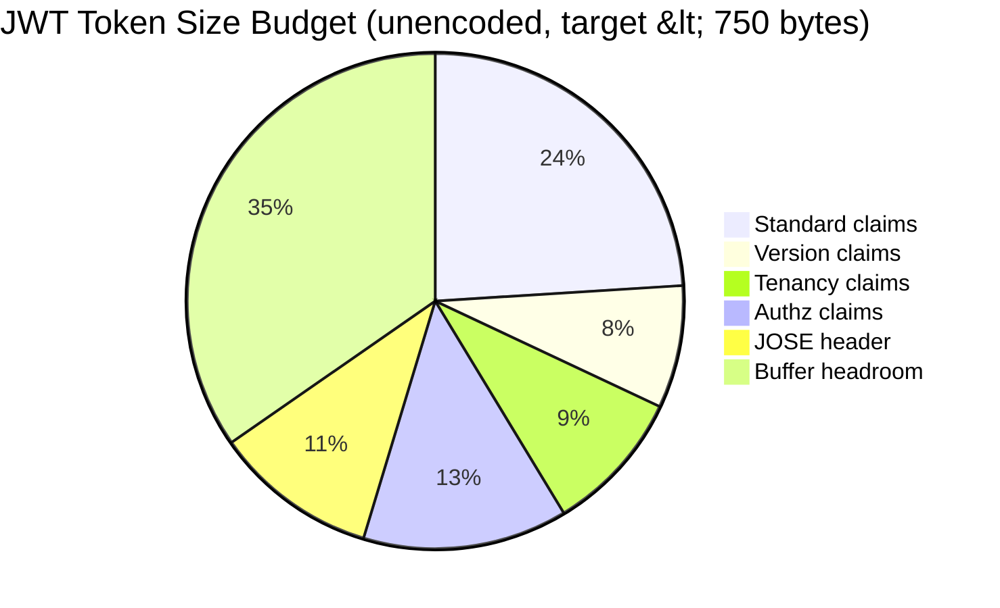
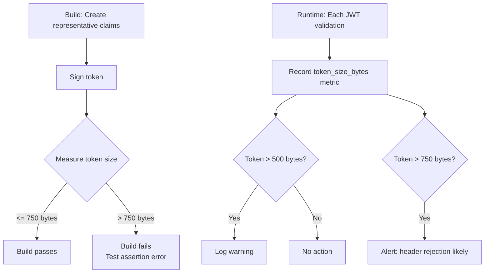
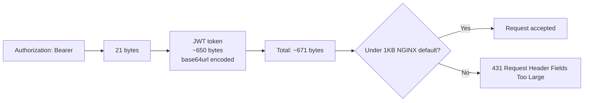

# Story 2.5: Token Size Budget Enforcement

## Epic

[02-claims-schema-evolution](../claims.md)

## Parent Epic Story

Story 2.5

## Summary

Implement token size measurement and budget enforcement. The JWT document recommends keeping tokens under 8KB comfortably, preferably in the low kilobytes. This story adds build-time tests that fail if representative tokens exceed the budget, and runtime metrics that track token size distribution.

## Why This Story Exists

The JWT document identifies token size as a critical constraint: NGINX defaults to 1KB `client_header_buffer_size` with 4 × 8KB for large headers, Apache's `LimitRequestFieldSize` defaults to 8190 bytes per header field, AWS ALB allows 16KB single header and 64KB total request headers. Microsoft Entra explicitly limits `groups` emission and switches to overage patterns once group membership pushes tokens toward header-size limits. Embedding large resource lists or full ACLs in tokens is a real problem.

## Design Context

### Token Size Budget

| Component | Target Size (bytes) | Notes |
|-----------|-------------------|-------|
| Standard claims | ~200 | iss, sub, aud, client_id, scope, exp, nbf, iat, jti |
| Version claims | ~80 | ver, sid |
| Tenancy claims | ~90 | tenant_id, sx.tenant |
| Authorization claims | ~140 | roles, permissions, entitlements_ref, entitlements_hash, risk |
| JOSE header | ~100 | alg, typ, kid |
| Base64url overhead | ~33% | JWT encoding adds ~33% overhead |
| **Total** | **~1,100 bytes** | Well under 8KB budget |

### Size Mitigations

1. **Remove PII**: email, phone, name fields removed from JWT (Story 2.3)
2. **Entitlements reference**: SHA-256 hash + UUID reference (~76 bytes) instead of full ACL array (potentially 500-2000 bytes)
3. **Compact JSON encoding**: Use shortest possible JSON representation
4. **Bounded permission arrays**: Per role, max N permissions. If a role has more, resolution returns top-level role name
5. **Short token lifetime**: 5 minutes default. Refresh frequently.

### Header Budget

JWTs are sent in the `Authorization: Bearer <token>` header. The header size matters because:

| Proxy / LB | Single Header Limit | Total Header Limit |
|------------|-------------------|-------------------|
| NGINX default | 1KB | 16KB (4 × 4KB) |
| NGINX large buffers | 16KB | 64KB |
| Apache | 8190 bytes | N/A |
| AWS ALB | 16KB | 64KB |

A 1,100-byte token becomes ~1,470 bytes with base64url encoding (33% overhead). Adding "Authorization: Bearer " prefix (~21 bytes), the total header is ~1,500 bytes. This fits within NGINX default 1KB buffer... wait, it doesn't. 1,470 bytes exceeds 1,024 bytes.

**This is a real constraint.** The JWT token (without encoding) must be under ~750 bytes to fit within NGINX's default 1KB header buffer. Let's recalculate:

| Component | Size (bytes) | Notes |
|-----------|-------------|-------|
| Standard claims | ~180 | Optimized: iss, sub, aud (single), client_id, scope, exp, nbf, iat, jti |
| Version claims | ~60 | ver, sid |
| Tenancy claims | ~70 | tenant_id, sx.tenant |
| Authorization claims | ~100 | roles, permissions (bounded to 10), ent_ref, ent_hash, risk |
| JOSE header | ~80 | alg, typ, kid |
| **Total (unencoded)** | **~490 bytes** | **With 33% overhead: ~650 bytes** |
| "Authorization: Bearer " | 21 bytes | |
| **Total header** | **~671 bytes** | **Under 1KB NGINX default** |

This target of ~750 bytes unencoded is the budget for this story.

## Implementation Notes

### Build-Time Test

```rust
#[test]
fn test_token_size_budget() {
    // Create a representative token with:
    // - 10 roles
    // - 10 permissions
    // - Standard + version + tenancy + authz claims
    let claims = create_representative_claims();
    let token = sign_token(&claims);
    
    // JWT is 3 base64url-encoded parts separated by dots
    let parts: Vec<&str> = token.split('.').collect();
    let total_size: usize = parts.iter().map(|p| p.len()).sum();
    
    // Budget: 750 bytes unencoded
    assert!(
        total_size <= 750,
        "Token size {} bytes exceeds budget of 750 bytes",
        total_size
    );
}
```

### Runtime Metrics

```rust
// In the JWT middleware:
use prometheus::{register_histogram, Histogram};

static TOKEN_SIZE_BYTES: Histogram = register_histogram!(
    "token_size_bytes",
    "Token size in bytes"
).unwrap();

// On each validation:
let size = token.len();
TOKEN_SIZE_BYTES.observe(size as f64);
```

### Token Size Distribution

Track and alert on:
- p50, p95, p99, max token sizes
- Tokens exceeding 500 bytes (warning)
- Tokens exceeding 750 bytes (error -- likely causing header rejections)

## Mermaid Diagrams

### Token Size Components



### Size Budget Enforcement Pipeline



### NGINX Header Budget



## OpenAPI Changes

No OpenAPI changes. Token size is an internal implementation detail. The OpenAPI spec documents the token as a string -- the actual size is not part of the API contract.

## Design Doc References

- `design-doc.md` section 7.3: JWT Size Management -- already mentions token size mitigations (organization limit, permission cap, compact encoding, short lifetime). Update with new budget numbers.
- `design-doc.md` section 10.12: Observability -- `token_size_bytes` metric

## Wiki Pages to Update/Create

- `topics/topic-jwt-schema.md`: Document the token size budget
- `topics/topic-claims-schema.md`: (new) Document claim-by-claim size estimates

## Acceptance Criteria

- [ ] Build-time test creates a representative token and verifies size <= 750 bytes (unencoded)
- [ ] Token size budget is defined as 750 bytes unencoded (650 bytes base64url encoded)
- [ ] "Authorization: Bearer " header overhead (21 bytes) is accounted for in total header size
- [ ] Total header size (~671 bytes) fits within NGINX default 1KB client_header_buffer_size
- [ ] Runtime `token_size_bytes` histogram metric is emitted for every JWT validation
- [ ] Warning log when token size exceeds 500 bytes
- [ ] Alert when token size exceeds 750 bytes (header rejection likely)
- [ ] Unit test verifies: 10 roles + 10 permissions + all claims fits within budget
- [ ] Unit test verifies: 100 roles + 100 permissions fails the budget (assertion test)

## Dependencies

- Depends on Story 2.3 (PII removal reduces token size)
- Depends on Story 2.2 (claims struct implementation)

## Risk / Trade-offs

- **Strict budget may block deployment**: If the budget is too tight, legitimate use cases (users with many roles/permissions) may fail. The budget accounts for bounded permission arrays (max 10 per role). If a user legitimately has more than 10 effective permissions, the token will exceed the budget and the user must refresh or use `entitlements_ref` to fetch the full ACL.
- **Base64url encoding overhead**: The 33% overhead is fixed by the JWT format. There is no way to reduce this without switching to a different encoding (e.g., COSE for CBOR-encoded JWTs). This is a standard JWT trade-off.
- **NGINX configuration override**: If consumers deploy with custom NGINX configurations that increase `client_header_buffer_size` to 8KB or 16KB, the budget constraint is relaxed. However, most deployments use defaults, so the 1KB budget is the safe assumption.

## Tests

### Unit Tests

- [ ] **Representative token fits budget**: Create a token with 10 roles, 10 permissions, all standard + version + tenancy + authz claims — assert the unencoded payload is <= 750 bytes (assertion test — should pass)
- [ ] **100 roles + 100 permissions exceeds budget**: Create a token with 100 roles, 100 permissions — assert the unencoded payload is > 750 bytes (this is an intentional failure test — the assertion should fail, confirming the budget catch works)
- [ ] **JOSE header size is within budget**: Assert the JOSE header (alg, typ, kid) is <= 100 bytes when serialized to JSON
- [ ] **Base64url encoding increases size by ~33%**: Take a claims JSON of 490 bytes, encode it as base64url, assert the result is approximately 650 bytes (within 30-36% overhead range)
- [ ] **Authorization header total fits NGINX 1KB**: Serialize a representative token, add "Authorization: Bearer " prefix (21 bytes), assert total <= 1024 bytes
- [ ] **Compact JSON reduces size**: Compare `serde_json::to_string` (pretty-printed) vs `serde_json::to_string_pretty` — assert the compact form saves significant bytes and is the format used for JWT payloads
- [ ] **Token size histogram records valid token**: When a valid token (< 750 bytes) is validated, assert the `token_size_bytes` histogram receives a sample at the token's byte size

### Integration Tests (BDD-style with `rstest_bdd`)

- [ ] **Scenario: Token size metric recorded on every validation**: `given` a valid access token for a user with 3 roles → `when` a downstream service validates it → `then` the `token_size_bytes` histogram metric is emitted with the token's size in bytes
- [ ] **Scenario: Warning log for oversized token**: `given` a token that is 600 bytes (over the 500-byte warning threshold) → `when` a service validates it → `then` a warning log is emitted: "Token size 600 bytes exceeds 500 byte warning threshold"
- [ ] **Scenario: Alert for very oversized token**: `given` a token that is 800 bytes (over the 750-byte error threshold) → `when` a service validates it → `then` an alert-level log/trace is emitted: "Token size 800 bytes exceeds 750 byte budget — header rejection likely"
- [ ] **Scenario: NGINX header budget test**: `given` a representative token of 490 bytes — `when` it is sent in an `Authorization: Bearer ` header — `then` the total header size (~511 bytes) is under NGINX's default 1KB `client_header_buffer_size` and the request would be accepted

### Security Regression Tests

- [ ] **Token size cannot bypass budget via encoding tricks**: Create a token with intentionally short key names (e.g., `"a": "b"` instead of `"sub": "user-123"`) — assert the budget test still measures the full claims structure, not just the encoded form
- [ ] **Large `entitlements_ref` doesn't inflate token**: Inject a 200-character `entitlements_ref` — assert the total token size still stays under 750 bytes (the ref is a small part of the total budget)

### Edge Cases

- [ ] **Empty token payload**: Create a JWT with only the minimum required claims (iss, sub, aud, exp, iat, jti, ver, sid, tenant_id, sx) — assert the size is the minimum possible (approximately the baseline of ~350 bytes)
- [ ] **Maximum roles/permissions at budget limit**: Create a token with the maximum number of roles/permissions that still fits under 750 bytes — assert the size is close to (but not exceeding) the budget, confirming the budget is being utilized effectively
- [ ] **Token size stability across rebuilds**: Run the build-time budget test multiple times — assert the token size does not drift between runs (no random UUIDs or timestamps in the representative claims)

### Cleanup

- Build-time tests are stateless — no cleanup needed
- Integration tests that emit metrics must reset the metrics registry between test scenarios (use `prometheus::Registry::new()` per test, or clear the default registry)
- No database or cache cleanup needed — token size tests are pure payload measurement
