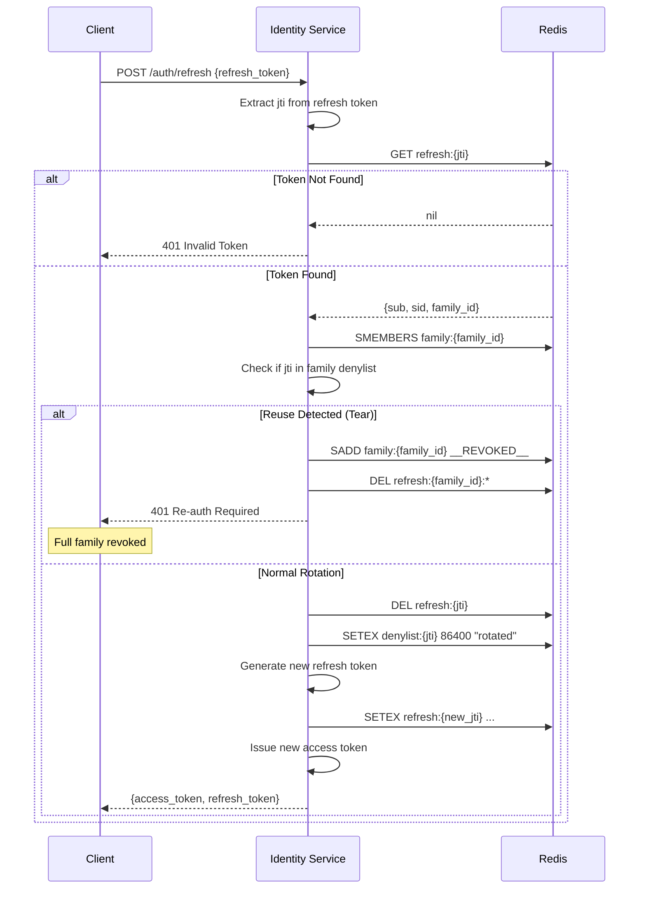
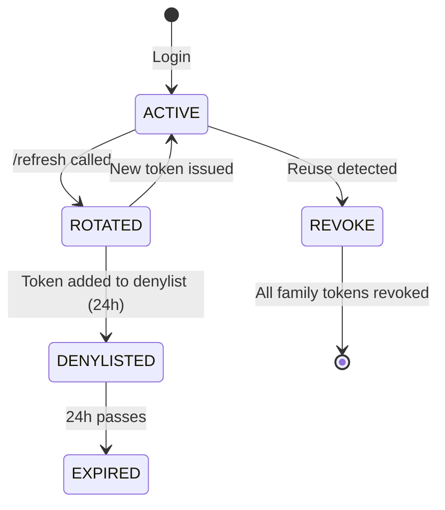
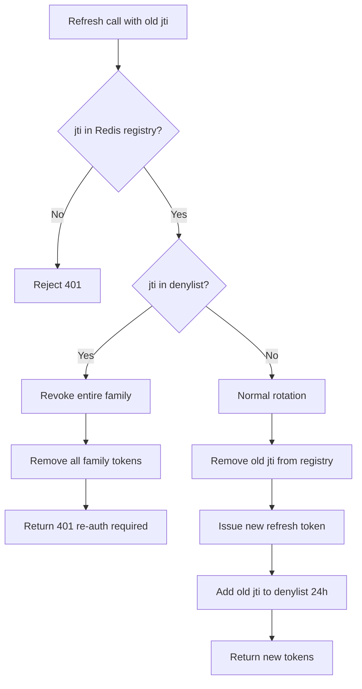

# Story 3.1: Implement Refresh Token Rotation

## Epic

[03-token-lifecycle](../tokens.md)

## Parent Epic Story

Story 3.1

## Summary

Implement rotating refresh tokens where each `/refresh` call validates the old token, invalidates it, issues a new refresh token with a new `jti`, and stores the old `jti` in the denylist cache for family TTL. The new access token is signed with fresh claims (including updated token version if authz has changed).

## Why This Story Exists

The JWT document emphasizes rotating refresh tokens as the primary revocation mechanism. Without rotation, a stolen refresh token can be replayed indefinitely until it expires. With rotation, a stolen token is detected on reuse (the old `jti` is in the denylist) and the entire token family is invalidated.

## Design Context

### Current State

- Refresh tokens stored in Redis + PostgreSQL
- Session tokens stored in both PG + Redis
- `redis.rs` module handles refresh-token metadata, per-user session sets, and jti blacklist
- No explicit rotation logic is documented or implemented

### Refresh Token Structure

```rust
#[derive(Debug, Clone, Serialize, Deserialize)]
pub struct RefreshToken {
    pub jti: String,           // Unique token ID (also in access token denylist)
    pub sub: String,           // User ID (subject)
    pub sid: String,           // Session ID
    pub family_id: String,     // Token family identifier (for reuse detection)
    pub iat: i64,              // Issued at
    pub exp: i64,              // Expiration (7-30 days)
    pub client_id: String,     // Client application
    pub scopes: String,        // Space-delimited scopes
}
```

### Redis Data Structures

| Key | Type | TTL | Purpose |
|-----|------|-----|---------|
| `refresh:{jti}` | Hash | 30 days | Refresh token metadata |
| `family:{family_id}` | Set | 24 hours | All jti values in the family |
| `denylist:{jti}` | String | 24 hours | Used refresh token (replay detection) |
| `session:{sid}` | Hash | 30 days | Active session state |

### Token Family Design

- Each login creates one token family (`family_id`)
- All refresh tokens from the same login session share the same `family_id`
- When a token is reused (old jti found in denylist), ALL tokens in the family are revoked
- This prevents the "tear" scenario where attacker and legitimate user both have the same token
- F-005: When reuse is detected, the system MUST trigger cross-session notification (push notification, email, or in-app signal) to inform the user of potential compromise
- F-015: All refresh tokens are DPoP-bound (see Story 8.2). A stolen refresh token without the matching DPoP proof key cannot be replayed, further reducing the risk window between theft and detection.

## Implementation Notes

### Refresh Flow

```
Client -> POST /auth/refresh {refresh_token: "rt_xxx"}
  -> 1. Decode and validate refresh token
  -> 2. Look up refresh:{jti} in Redis
  -> 3. If not found: reject 401 (invalid or expired token)
  -> 4. Check family:{family_id} set for denylist:{jti}
  -> 5. If found in denylist: revoke ALL family tokens, require re-auth 401
  -> 6. Remove old refresh token from Redis
  -> 7. Generate new refresh token (new jti, same family_id)
  -> 8. Store new refresh token in Redis
  -> 9. Issue new access token with fresh claims (including updated ver)
  -> 10. Store old jti in denylist for 24 hours
  -> 11. Return {access_token, refresh_token}
```

### Denylist TTL

| Scenario | Denylist TTL | Reason |
|----------|-------------|--------|
| Normal rotation | 24 hours | Prevents replay of the old token |
| Reuse detected (tear scenario) | Until token exp | Full family revocation + cross-session notification (F-005) |
| Logout | 0 (immediate) | Full family invalidated |

### Redis Operations

```
DEL refresh:{old_jti}                    # Remove old token from registry
SADD family:{family_id} denylist:{old_jti}  # Mark family for reuse detection
EXPIRE family:{family_id} 86400          # 24 hours
SETEX denylist:{old_jti} 86400 "rotated" # 24 hours denylist
SETEX refresh:{new_jti} 2592000 {token_data}  # 30 days
```

## Mermaid Diagrams

### Refresh Token Rotation



### Token Family State Machine



### Denylist Flow



## OpenAPI Changes

- `/auth/refresh` POST request: Document the rotating refresh token behavior
- `/auth/refresh` POST response: Add `token_version` field (to match new claims schema)
- Error response 401: Add `reason: "token_rotated"` for reuse detection

```yaml
paths:
  /auth/refresh:
    post:
      responses:
        '200':
          description: New tokens issued (refresh token rotated)
          content:
            application/json:
              schema:
                $ref: '#/components/schemas/TokenResponse'
        '401':
          description: Invalid or revoked token
          content:
            application/json:
              schema:
                $ref: '#/components/schemas/Error'
                example:
                  reason: "token_rotated"
                  message: "Refresh token was previously used. All tokens in this family have been revoked."
```

## Design Doc References

- `design-doc.md` section 10.1: Token Security -- "Rotating token families stored in Redis with reuse detection"
- `design-doc.md` section 10.4: Token Versioning & Revocation -- Layer 2: rotating refresh tokens
- `design-doc.md` section 4.2: identity-session-service -- "Token Refresh: EXTREME, LOW cost (DB lookup + JWT sign)"
- `design-doc.md` section 8.2: Login + JWT Enrichment Flow -- refresh step
- `service-topology-design.md`: identity-session-service handles refresh (EXTREME freq, LOW cost)

## Wiki Pages to Update/Create

- `topics/topic-token-lifecycle.md`: (new) Document rotation flow
- `topics/topic-login-flow.md`: Update with rotation details
- `topics/topic-authorization-flow.md`: Note rotation in refresh step

## Acceptance Criteria

- [ ] Each `/refresh` call validates the refresh token against Redis
- [ ] Old refresh token is removed from Redis on successful rotation
- [ ] New refresh token is issued with a new `jti`
- [ ] Old `jti` is added to denylist cache for 24 hours (family TTL)
- [ ] New access token is issued with fresh claims (updated `ver` if authz changed)
- [ ] Reuse of a rotated token is detected (old jti in denylist)
- [ ] When reuse is detected, ALL tokens in the family are revoked
- [ ] Reuse detection returns 401 with reason "token_rotated"
- [ ] No "tear" scenario: both attacker and legitimate user cannot use the same token
- [ ] Redis data structures: `refresh:{jti}` (hash), `family:{family_id}` (set), `denylist:{jti}` (string)
- [ ] Metrics: `token_refresh_total`, `refresh_reuse_detected_total`, `refresh_rotation_failures_total` are emitted

## Dependencies

- Depends on Story 1.3 (JWKS validation for access tokens)
- Depends on Story 2.2 (AccessClaims struct with `ver` field for fresh claims)
- Intersects with Story 3.2 (family/reuse detection implementation)

## Risk / Trade-offs

- **Redis dependency**: Rotation is Redis-backed. If Redis is down, rotation cannot be verified. Fallback: if Redis is unavailable, treat the token as valid (fail open) and log an error. This is acceptable because the token has a short TTL anyway.
- **Family TTL choice**: 24 hours is a reasonable balance between replay protection and storage overhead. A shorter TTL (1 hour) reduces storage but allows token replay within the window. A longer TTL (7 days) increases storage but provides better protection.
- **Storage overhead**: Each refresh adds a new `refresh:{jti}` entry (30 days TTL) and a `denylist:{jti}` entry (24 hours). For high-traffic services, this can add up. The 24-hour denylist TTL ensures entries expire quickly.

## Tests

### Unit Tests

- [ ] **Refresh token structure round-trip**: Create a `RefreshToken` with all fields populated (jti, sub, sid, family_id, iat, exp, client_id, scopes), serialize to JSON, deserialize back — assert all fields match
- [ ] **`RefreshToken.jti` is unique**: Assert that two `RefreshToken` instances created with `uuid::Uuid::new_v4()` always produce different `jti` values
- [ ] **Denylist TTL is 24 hours**: Assert the denylist entry uses exactly `EXPIRE denylist:{jti} 86400` (24 hours in seconds)
- [ ] **Family TTL is 24 hours**: Assert `family:{family_id}` set uses `EXPIRE family:{family_id} 86400`
- [ ] **Refresh token TTL is 30 days**: Assert `refresh:{jti}` hash uses `EXPIRE refresh:{jti} 2592000` (30 days)
- [ ] **Session TTL is 30 days**: Assert `session:{sid}` hash uses `EXPIRE session:{sid} 2592000` (30 days)
- [ ] **Family ID is deterministic per session**: Assert that all refresh tokens issued during the same login session share the same `family_id` (derived from the session ID)

### Integration Tests (BDD-style with `rstest_bdd`)

- [ ] **Scenario: Normal refresh rotation**: `given` a valid refresh token for user-123 with family `fam-abc` → `when` a `/auth/refresh` request is made with that token → `then` the old `refresh:{jti}` is deleted from Redis, a new `refresh:{new_jti}` is created with the same `family_id`, the old `jti` is added to `denylist:{jti}` with 24h TTL, and `{access_token, refresh_token}` is returned
- [ ] **Scenario: Reuse detection triggers family revocation**: `given` a refresh token that has already been used (its `jti` is in `denylist:{jti}`) → `when` a `/auth/refresh` request is made with that token → `then` all tokens in `family:{family_id}` are deleted from Redis, and a 401 response with `reason: "token_rotated"` is returned
- [ ] **Scenario: Invalid refresh token (not in Redis)**: `given` a malformed or expired refresh token → `when` `/auth/refresh` is called → `then` the response is 401 (token not found in `refresh:{jti}`)
- [ ] **Scenario: New access token has updated version**: `given` a token with `ver: 42` and authz has changed → `when` the token is refreshed → `then` the new access token has `ver: 43` (bumped version)
- [ ] **Scenario: Cross-session notification on reuse**: `given` reuse is detected for family `fam-abc` → `when` the revocation logic runs → `then` a cross-session notification signal is emitted (push notification, email, or in-app alert) to the user's registered endpoints (F-005)
- [ ] **Scenario: Metrics emitted on successful rotation**: `given` a successful `/auth/refresh` → `then` `token_refresh_total{result: "rotated"}` and `refresh_rotation_failures_total` metrics are emitted
- [ ] **Scenario: Metrics emitted on reuse detection**: `given` a reuse detection event → `then` `refresh_reuse_detected_total` is incremented

### Security Regression Tests

- [ ] **Refresh token cannot be replayed after rotation**: After a successful rotation, assert that the old refresh token is rejected (its `jti` is in the denylist, causing family revocation)
- [ ] **Denylist prevents replay within 24h**: Assert that a refresh token used 1 minute ago is still in the denylist 23 hours later (the 24h TTL protects against replay)
- [ ] **Stale refresh token cannot bypass rotation**: Assert that a refresh token from more than 30 days ago is rejected (its `refresh:{jti}` entry has expired from Redis)
- [ ] **Replay attack on active token is detected**: If an attacker has a refresh token and uses it while the legitimate user also refreshes, the first replayed token triggers family revocation (preventing the "tear" scenario)

### Edge Cases

- [ ] **Concurrent refresh requests**: If two `/auth/refresh` requests are made simultaneously with the same token, assert that the first succeeds (rotation) and the second is rejected (reuse detection via denylist) — this must be race-condition free
- [ ] **Redis unavailable during refresh**: If Redis returns an error (connection refused), assert the refresh handler fails closed (401 error, NOT fail open) — rotation requires Redis state to be reliable
- [ ] **Empty family set**: If `family:{family_id}` set is empty (cleanup bug), assert the refresh still proceeds normally (empty set is not an error condition)
- [ ] **Very large `family_id`**: Inject a 1000-character `family_id` — assert Redis operations succeed (no key size issues)

### Cleanup

- Redis state must be cleaned between test scenarios — use a unique Redis key prefix per test run or use `FLUSHDB` in a test fixture
- Test refresh tokens created in unit tests that write to Redis must be deleted after the test (cleanup step)
- Integration tests must verify that denylist entries expire after 24 hours — use a mocked clock or speed up time in tests
