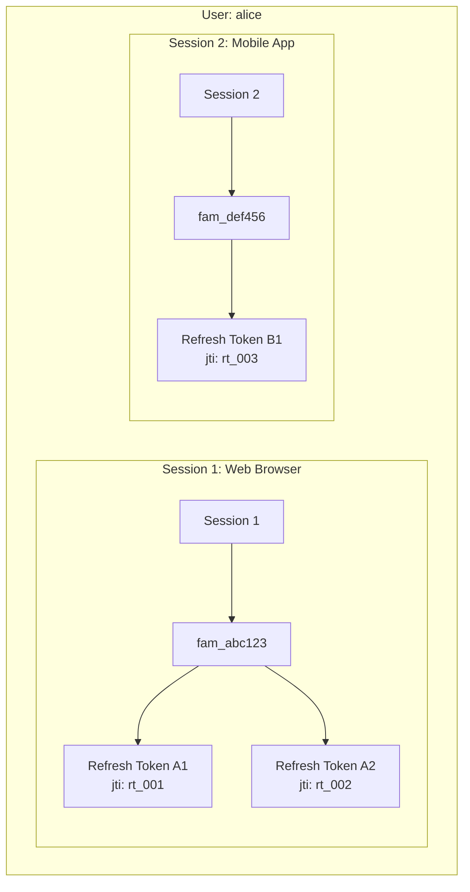
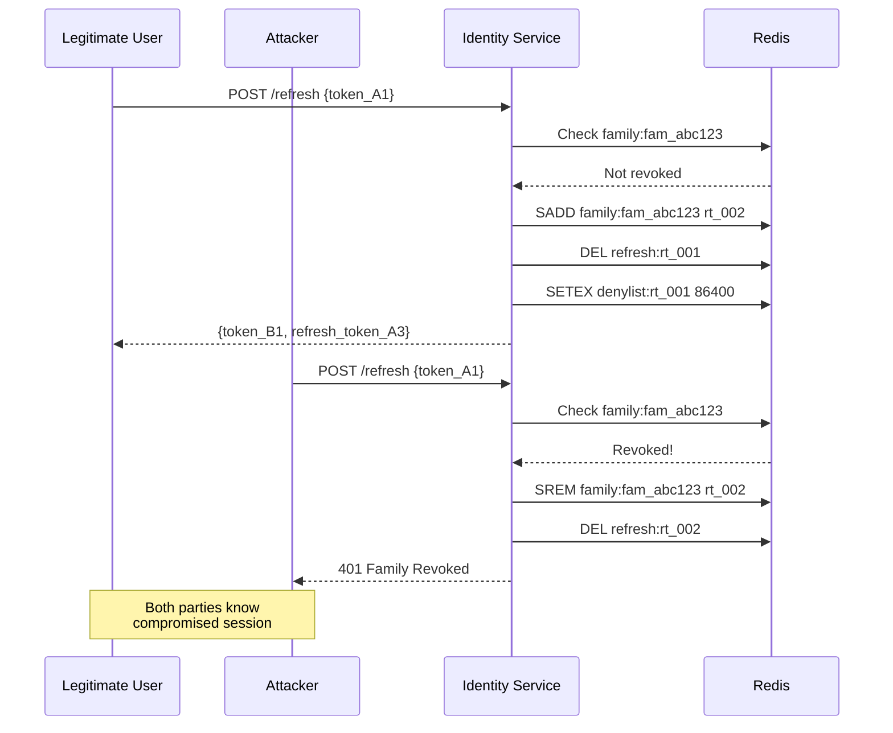
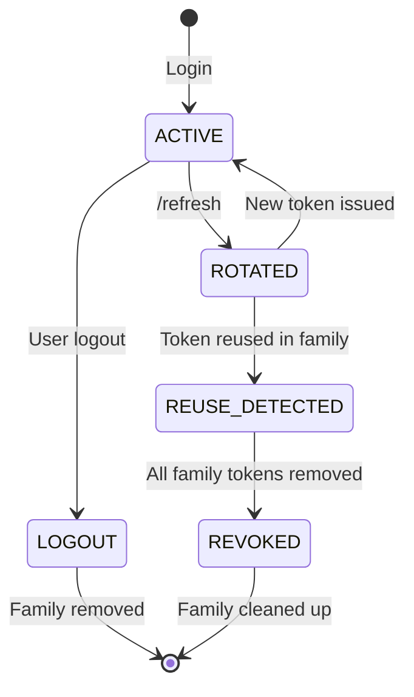

# Story 3.2: Implement Refresh Token Family / Reuse Detection

## Epic

[03-token-lifecycle](../tokens.md)

## Parent Epic Story

Story 3.2

## Summary

Implement token family grouping and reuse detection. Each active user session has one token family. When a token is used, the entire family is marked for reuse detection. If the same family token is used twice, all tokens are invalidated and the user must re-authenticate. This prevents the "tear" scenario where both the attacker and legitimate user have the same token.

## Why This Story Exists

The JWT document identifies refresh token rotation as insufficient without reuse detection: "Without reuse detection, a stolen refresh token can be replayed by both the legitimate user and the attacker." The "tear" scenario: attacker steals token A, legitimate user uses token A, attacker uses token A again -- both have valid tokens until the legitimate user rotates. With family-based detection, the moment token A is reused, the entire family is revoked and both parties know (legitimate user sees 401, attacker gets nothing).

## Design Context

### Token Family Structure

Each user session has a single token family. All refresh tokens issued during that session share the same `family_id`.

```
Login (Session 1)
  -> family_id: "fam_abc123"
  -> Refresh Token A (jti: "rt_001"): family_id = "fam_abc123"
  
/refresh with A
  -> family_id: "fam_abc123"
  -> Refresh Token B (jti: "rt_002"): family_id = "fam_abc123"
  -> A is added to denylist for 24h

/refresh with B
  -> family_id: "fam_abc123"
  -> Refresh Token C (jti: "rt_003"): family_id = "fam_abc123"
  -> B is added to denylist for 24h
  
If attacker uses A (already in denylist):
  -> Reuse detected for family "fam_abc123"
  -> ALL tokens in family are revoked (A, B, C)
  -> User must re-authenticate
```

### Multiple Sessions

A user can have multiple active sessions (e.g., web browser + mobile app). Each session has its own token family:

```
Session 1 (Web): family_id = "fam_abc123"
  -> Refresh Token A1 (jti: "rt_001")
  -> Refresh Token A2 (jti: "rt_002")

Session 2 (Mobile): family_id = "fam_def456"
  -> Refresh Token B1 (jti: "rt_003")
  
If attacker uses A1 (reuse on Session 1):
  -> Only Session 1 tokens are revoked (A1, A2)
  -> Session 2 tokens (B1) remain valid
  -> Web user must re-auth, mobile user continues
```

This is the correct behavior -- the tear scenario only affects the compromised session, not all sessions.

### Redis Data Structures

| Key | Type | TTL | Purpose |
|-----|------|-----|---------|
| `family:{family_id}` | Set | 24 hours | All jti values in the family |
| `family:{family_id}:revoked` | Boolean | Until cleanup | Marks family as compromised |
| `session:{family_id}` | Hash | 30 days | Session metadata |

## Implementation Notes

### Family ID Generation

```rust
pub fn generate_family_id() -> String {
    // UUID v4 for uniqueness
    format!("fam_{}", uuid::Uuid::new_v4())
}
```

### Family Lookup

On every `/refresh`:

```rust
// 1. Extract family_id from refresh token
let family_id = token.family_id;

// 2. Check if family is marked as revoked
let revoked = redis.get::<_, bool>(&format!("family:{family_id}:revoked")).unwrap_or(false);
if revoked {
    return Err(AuthError::FamilyRevoked);
}

// 3. Check if token's jti is in the family's jti set
let jti_set = redis.smembers::<_, Vec<String>>(&format!("family:{family_id}")).unwrap_or_default();
if jti_set.contains(&token.jti) {
    // Token was already used in this family -> reuse detected
    redis.set(&format!("family:{family_id}:revoked"), true).unwrap();
    // Invalidate all tokens in this family
    for other_jti in &jti_set {
        if other_jti != &token.jti {
            redis.del(&format!("refresh:{other_jti}")).ok();
        }
    }
    return Err(AuthError::FamilyRevoked);
}

// 4. Add new jti to family set
redis.sadd(&format!("family:{family_id}"), new_jti).unwrap();
```

### Logout-All vs Session-Only Logout

| Action | Affected Families | Redis Operation |
|--------|------------------|-----------------|
| Logout (single session) | One family | `DEL refresh:{jti}`, `SREM family:{family_id}:{jti}` |
| Logout-all | All families for user | For each family: revoke + remove all tokens |

## Mermaid Diagrams

### Token Family Diagram



### Reuse Detection Flow



### Multiple Session Isolation

```mermaid
flowchart TD
    A[Attacker uses Session 1 token] --> B{Session 1 family revoked?}
    B -->|Yes| C[Session 1: 401 re-auth required]
    B -->|No| D[Session 1: token accepted]
    
    E[Session 2 token still valid?] --> F{Session 2 family revoked?}
    F -->|No| G[Session 2: continues working]
    F -->|Yes| H[Session 2: 401 re-auth required]
    
    Note: Only the compromised session is affected<br/>Other sessions remain valid
```

### Family State Machine



## OpenAPI Changes

- `/auth/refresh` response: Add `reason: "family_revoked"` for reuse detection
- Error response 401: Document the family_revoked reason with guidance to re-authenticate

```yaml
components:
  schemas:
    Error:
      type: object
      properties:
        reason:
          type: string
          enum: ["invalid_token", "token_expired", "token_rotated", "family_revoked", "insufficient_permissions"]
        message:
          type: string
```

## Design Doc References

- `design-doc.md` section 10.4: Token Versioning & Revocation -- Layer 2: rotating refresh tokens with reuse detection
- `design-doc.md` section 10.1: Token Security -- "Rotating token families stored in Redis with reuse detection (revoke family on replay)"
- `topics/topic-token-lifecycle.md`: (new) Document family structure

## Wiki Pages to Update/Create

- `topics/topic-token-lifecycle.md`: (new) Document family-based reuse detection
- `topics/topic-login-flow.md`: Update with multiple session handling

## Acceptance Criteria

- [ ] Each login creates a unique token family with `family_id`
- [ ] All refresh tokens from the same login share the same `family_id`
- [ ] On `/refresh`, the service checks if the family is already marked as revoked
- [ ] If a token from a family is reused, ALL tokens in that family are revoked
- [ ] Token reuse detection returns 401 with reason "family_revoked"
- [ ] Revoke only affects the compromised family -- other sessions remain valid
- [ ] Logout removes only the specific session's family tokens
- [ ] Redis data structures: `family:{family_id}` (set), `family:{family_id}:revoked` (bool)
- [ ] Metrics: `refresh_reuse_detected_total` counts family revocations

## Dependencies

- Depends on Story 3.1 (refresh token rotation)
- Intersects with Story 3.5 (logout-all implementation)

## Risk / Trade-offs

- **Family ID persistence**: The `family_id` must be stored with the refresh token in Redis. If the refresh token is compromised, the attacker can see the `family_id` (it's in the JWT or stored in Redis). This is not a security issue -- the family_id is a non-secret identifier.
- **Multiple sessions**: A user can have many active sessions. If the user logs out of all sessions (logout-all), all families must be revoked. This requires iterating over all families for the user, which is O(n) where n is the number of sessions. For most users, n is small (< 5).
- **Redis set size**: The `family:{family_id}` set can grow to the number of refreshes for a session. With 30-day refresh tokens and daily refreshes, the set has ~30 entries. This is small and fits efficiently in Redis.

## Tests

### Unit Tests

- [ ] **`generate_family_id()` format**: Assert the generated family ID matches the pattern `fam_<uuid>` (e.g., `fam_550e8400-e29b-41d4-a716-446655440000`)
- [ ] **`generate_family_id()` uniqueness**: Assert two consecutive calls to `generate_family_id()` produce different values
- [ ] **Family ID never duplicates across users**: Assert that family IDs are globally unique (no collision between users' sessions) — use property-based testing to generate 10,000 family IDs and assert all are unique
- [ ] **`family:{family_id}:revoked` check returns false for new family**: Given a fresh `family_id` not yet in Redis, assert `redis.get(&format!("family:{family_id}:revoked"))` returns `None` or `false`
- [ ] **Family lookup correctly identifies reused jti**: Given a family set `{"rt_001", "rt_002"}` and a request with `jti = "rt_001"`, assert `jti_set.contains(&jti)` returns `true` (reuse detected)
- [ ] **Family lookup correctly identifies fresh jti**: Given a family set `{"rt_001", "rt_002"}` and a request with `jti = "rt_003"`, assert `jti_set.contains(&jti)` returns `false` (new token, no reuse)
- [ ] **Logout removes correct family only**: Given a user with families `fam_abc` and `fam_def`, assert that logout of `fam_abc` does NOT delete `refresh:{jti}` entries belonging to `fam_def`

### Integration Tests (BDD-style with `rstest_bdd`)

- [ ] **Scenario: First login creates family**: `given` a user who logs in for the first time → `when` the login handler executes → `then` a `family:{family_id}` set is created in Redis with the initial refresh token's jti, and `family:{family_id}:revoked` is not set
- [ ] **Scenario: Second refresh adds jti to family set**: `given` a family with 1 token (jti `rt_001`) → `when` the user refreshes and gets `rt_002` → `then` the family set contains both `rt_001` and `rt_002`
- [ ] **Scenario: Reuse triggers family revocation**: `given` a family with tokens `rt_001` and `rt_002`, where `rt_001` is already in the denylist → `when` `/auth/refresh` is called with `rt_001` → `then` `family:{family_id}:revoked` is set to true, all `refresh:{jti}` entries for that family are deleted, and a 401 with `reason: "family_revoked"` is returned
- [ ] **Scenario: Reuse only affects compromised session**: `given` a user with Session 1 (family `fam_abc`, tokens `rt_001`, `rt_002`) and Session 2 (family `fam_def`, token `rt_003`) → `when` Session 1's token `rt_001` is reused → `then` only `fam_abc` tokens are revoked; `rt_003` (Session 2) remains valid and can be used for `/refresh`
- [ ] **Scenario: Logout-all revokes all families**: `given` a user with 3 active families (Web, Mobile, API) → `when` a logout-all request is made → `then` all `family:{family_id}` sets and their `refresh:{jti}` entries are deleted across all 3 families
- [ ] **Scenario: Metrics track family revocations**: `given` a family revocation event → `then` `refresh_reuse_detected_total` is incremented with a `family_revoked` label
- [ ] **Scenario: Concurrent refresh on same token**: `given` a single refresh token shared by two concurrent requests → `when` both requests hit `/auth/refresh` simultaneously → `then` one succeeds (normal rotation) and the other fails (reuse detected) — no data corruption in Redis

### Security Regression Tests

- [ ] **Stolen token detected immediately**: `given` a refresh token stolen from the client → `when` the attacker uses it → `then` the legitimate user's next refresh detects the reuse and triggers family revocation (attacker gets 401, legitimate user is notified)
- [ ] **Family ID cannot be spoofed**: If a client sends a request with a `family_id` belonging to a different user, assert the refresh is rejected (the `family_id` is derived from the refresh token's stored state, not the request)
- [ ] **Token rotation is atomic**: Assert that between checking `family:{family_id}:revoked` and adding the new jti to the set, no other thread can slip in and cause a race condition (use Redis transactions or Lua scripts to ensure atomicity)

### Edge Cases

- [ ] **100 sessions for a single user**: Inject 100 families for a single user (simulating an extreme case) — assert logout-all completes within a reasonable time (< 1 second)
- [ ] **Empty family set on revocation**: If `family:{family_id}` set is empty when revocation is triggered, assert the revocation logic handles this gracefully (no Redis errors, family marked as revoked, 401 returned)
- [ ] **Family ID collision**: Simulate a UUID collision (two different families with the same `family_id`) — assert the system handles this by treating them as the same family (which is the expected behavior; true UUID collisions are astronomically unlikely)
- [ ] **Session with 1000 refreshes**: A session that has been refreshed 1000 times — assert the `family:{family_id}` set still fits efficiently in Redis (no memory issues)

### Cleanup

- Redis state must be cleaned between test scenarios — use a unique Redis key prefix per test run or `FLUSHDB` in a test fixture
- Test fixtures must not leave stale `family:{family_id}:revoked` flags between runs
- When testing logout-all, assert that no partial cleanup leaves orphaned family entries (every family entry should be fully removed)
