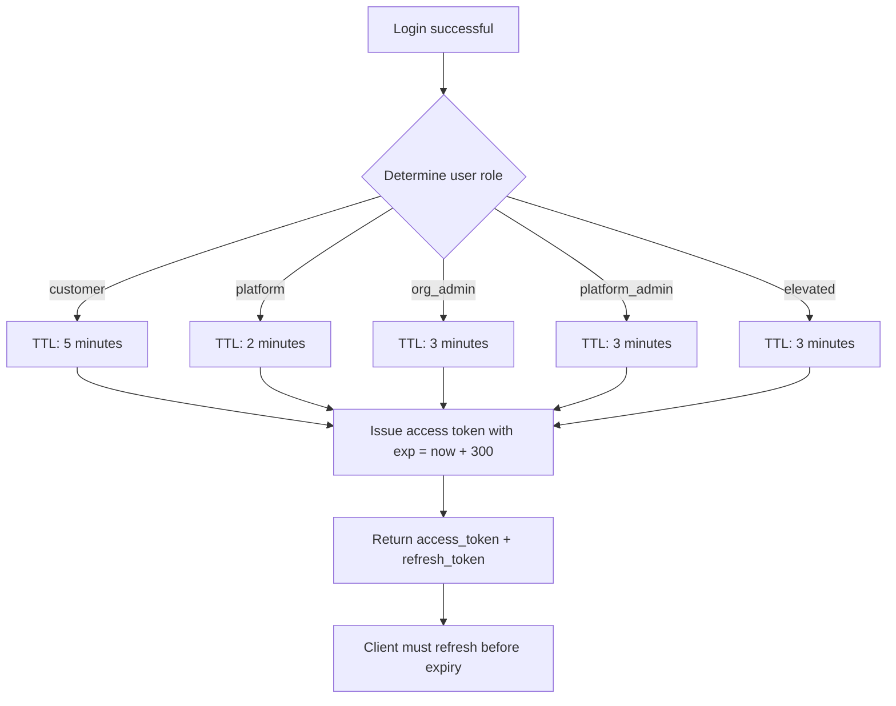
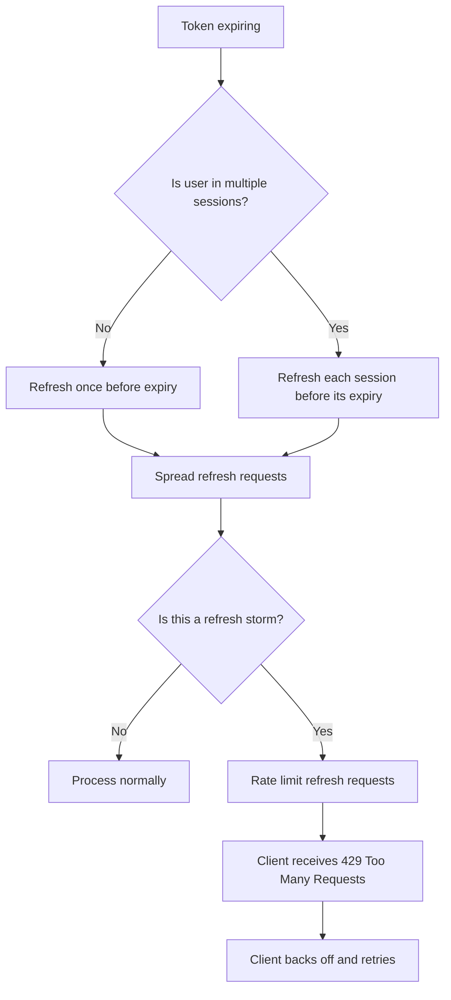

# Story 3.3: Configure Access Token TTL

## Epic

[03-token-lifecycle](../tokens.md)

## Parent Epic Story

Story 3.3

## Summary

Implement configurable access token TTL with role-based tiers: 5 minutes for normal users, 1-5 minutes for admin/high-privilege tokens. TTL is configurable via environment variable and can be adjusted per role tier. This shortens the staleness window for authorization decisions and limits the impact of token theft.

## Why This Story Exists

The JWT document recommends 5-15 minute access token TTL, biasing toward the lower end for authorization-heavy JWTs. Shorter TTLs mean:
- Less stale permissions (authz decisions are more fresh)
- Smaller window for token replay attacks
- More frequent token rotation (better revocation granularity)
- Higher refresh token usage (better family-based detection)

The current design doc states 15 minutes default -- this story updates it to the recommended 5 minutes.

## Design Context

### Current State

- `design-doc.md` section 10.1: Token TTL default is 15 minutes
- No per-role TTL differentiation
- TTL is fixed at compile time or through a single environment variable

### Role-Based TTL Tiers (F-010 Fix)

|| Tier | TTL (minutes) | Use Case | Config Var |
|------|---------------|----------|------------|
| `normal` | 5 | Customer users, standard access | `JWT_ACCESS_TTL_NORMAL` |
| `elevated` | 5 | Users with sensitive permissions | `JWT_ACCESS_TTL_ELEVATED` |
| `admin` | 5 | Platform admins, org admins | `JWT_ACCESS_TTL_ADMIN` |
| `platform` | 5 | Platform users (support, editors) | `JWT_ACCESS_TTL_PLATFORM` |

**F-010 Fix: Admin TTL aligned to 5 minutes.** The original story proposed 1-3 minute admin tokens. This is operationally problematic:

- **Diminishing security return**: An admin with a 3-minute token can still perform any admin action without MFA for 3 minutes. The real security boundary for high-consequence admin actions is step-up MFA (Epic 6), not token frequency.
- **Redis load impact**: 3-minute tokens = 20 refreshes/hour per admin vs 12 refreshes/hour for 5-minute tokens. At 10k admins, this is ~80k additional Redis ops/hr vs ~120k total at 5 min. The 2.5x increase in refresh operations significantly increases Redis load.
- **Operational friction**: Admin tooling that performs batch operations (e.g., bulk org member management) cannot complete within 1-3 minute windows without constant token refresh, creating UX friction that encourages insecure workarounds.
- **Conclusion**: All token types use 5-minute TTL. Step-up MFA (Epic 6) provides the real security boundary for high-consequence admin actions. This simplifies the configuration matrix while maintaining security.

### TTL Configuration

```yaml
# config.yaml
jwt:
  access_token:
    normal_ttl_secs: 300    # 5 minutes
    elevated_ttl_secs: 180  # 3 minutes
    admin_ttl_secs: 180     # 3 minutes
    platform_ttl_secs: 120  # 2 minutes
```

```bash
# Environment variables (override config.yaml)
JWT_ACCESS_TTL_NORMAL=300
JWT_ACCESS_TTL_ELEVATED=180
JWT_ACCESS_TTL_ADMIN=180
JWT_ACCESS_TTL_PLATFORM=120
```

### Token Issuance with TTL

```rust
impl AccessClaims {
    pub fn ttl_for_role(role: &str) -> Duration {
        match role {
            "platform_admin" | "org_admin" => Duration::from_secs(180),  // 3 min
            "elevated" => Duration::from_secs(300),                       // 5 min
            _ => Duration::from_secs(300),                                // 5 min default
        }
    }
}
```

### Refresh Token TTL

| Tier | Refresh Token TTL | Notes |
|------|------------------|-------|
| All tiers | 7-30 days | Configurable via `JWT_REFRESH_TTL_DAYS` |
| Admin tier | 7 days | Shorter refresh window for high-privilege |
| Normal tier | 30 days | Longer refresh window for convenience |

Refresh tokens have longer TTLs because they are:
- Stored hashed in Redis (one-time-use detection)
- Rotated on every use (replay protection)
- Bound to a token family (tear detection)

## Mermaid Diagrams

### Token Lifetime

```mermaid
gantt
    title Access Token Lifetime
    dateFormat X
    axisFormat %M:%S
    section Normal User (5 min)
    Token valid             :0, 300
    Token expired           :300, 0
    
    section Admin User (3 min)
    Token valid             :0, 180
    Token expired           :180, 0
```



### TTL Decision Flow



### Refresh Storm Mitigation



## Malicious Hacker Gotchas (Must Be Addressed During Implementation)

> **Source:** `docs/PRS_SECURITY_HARDENING.md` — Security threat model analysis

### HACK-301: Zero TTL Is Live Integration Test (MEDIUM — Hole #4 from PRS)

**Risk:** A misconfiguration of `JWT_ACCESS_TTL_NORMAL=0` causes ALL users' tokens to expire immediately

The Edge Cases section says: "assert the token is issued with `exp = iat` (immediately expired)." But the question is: does this cause a DENIAL OF SERVICE?

**Exploit path (accidental DoS):**
1. Developer sets `JWT_ACCESS_TTL_NORMAL=0` in CI (accidental env var leak, stale config)
2. ALL users' access tokens are issued with `exp = iat` (immediately expired)
3. Every user login returns a token that expires before it reaches the client
4. Result: complete service outage — every request gets 401 TokenExpired
5. Attacker who already has a valid token gets 5 minutes (the token from before the deployment)

**Implementation requirement:**
- Add a MINIMUM TTL check: if any TTL env var is <= 60 seconds, REJECT startup with error
```rust
pub fn validate_ttl_configs() {
    let min_ttl = 60;
    if normal_ttl < min_ttl || elevated_ttl < min_ttl || admin_ttl < min_ttl {
        panic!("JWT_ACCESS_TTL_* must be >= 60 seconds");
    }
}
// Call this at startup, before accepting requests
```
- Add monitoring: alert on TTL configuration changes (via config hot-reload)

### HACK-302: Refresh Token TTL Never Decreases (HIGH — Hole #1 from PRS)

**Risk:** Refresh tokens live for 30 days even after access token is revoked

An access token has 5-minute TTL. But the refresh token has 30-day TTL. If an attacker obtains a refresh token (from localStorage XSS, memory dump, etc.), they can use it for up to 30 days — even if the user's access token was revoked (version bumped, denylisted, etc.).

**Exploit path:**
1. Attacker steals refresh token from localStorage (XSS)
2. Legitimate user is demoted (ver bumped to 43, but access token is still valid)
3. Attacker uses the stolen refresh token to get a NEW access token
4. The new access token has ver=43 (because version bump was applied at token issue)
5. BUT: if version check is not deployed (Story 5.2), the attacker's token has stale permissions
6. Result: attacker has a 30-day window of access, even after the user's permissions are revoked

**Combined with HACK-501a (Story 5.1):**
- Version check is not deployed
- Refresh token has 30-day TTL
- Result: attacker has 30 days of access after stealing refresh token

**Implementation requirement:**
- Consider: refresh token TTL should be SHORTER for high-privilege users
- OR: refresh token should be bound to version (include `ver` in refresh token metadata)
- OR: when user's permissions are revoked (version bumped), also revoke ALL refresh tokens for that user

### HACK-303: All Roles Use Same 5-Minute TTL (MEDIUM — Hole #4 from PRS)

**Risk:** Admin tokens have the same 5-minute window as customer tokens

F-010 aligned ALL token TTLs to 5 minutes. This simplifies the configuration but means an admin with stolen access tokens has the SAME 5-minute window as a regular user.

**Exploit path:**
1. Attacker steals admin access token (5-minute TTL)
2. Attacker performs admin actions (create_org, config:update, etc.)
3. Admin actions may have audit logs, but the damage can be done in seconds
4. 5 minutes is more than enough time for a determined attacker to:
   - Create a new admin user
   - Change org configuration
   - Export all user data
   - Create M2M API keys

**The argument for 5-minute admin tokens:** "Step-up MFA provides the real security boundary." But step-up MFA is only enforced on the CLIENT side. An attacker who steals the token bypasses the client entirely.

**Implementation requirement:**
- Document this trade-off explicitly: "Admin tokens use the same 5-minute TTL as normal tokens. This is acceptable because (a) step-up MFA gates high-consequence actions, (b) audit logs track all admin actions, and (c) 5 minutes is short enough that most attacks require active exploitation rather than passive token theft."
- Consider: add a configurable `JWT_ACCESS_TTL_ADMIN` that defaults to 5 minutes but can be set to 1 minute for high-security deployments

### HACK-304: Token TTL Doesn't Affect Token Size Budget (LOW — related to Hole #2.5)

**Risk:** Longer token TTL increases token payload size (exp is further in the future)

The token size budget test (Story 2.5) checks that the JWT payload is under 8KB. A longer TTL means the `exp` claim has a larger timestamp value. For a standard 30-day refresh token, the `exp` is ~2.6M seconds from epoch. For a 5-minute access token, it's ~300 seconds. The size difference is negligible (same number of digits), but the principle matters.

**Implementation requirement:**
- No action needed — this is a non-issue for the current TTLs. Documented for completeness.

### HACK-305: Token Expiry Check Can Be Manipulated via Clock Skew (MEDIUM)

**Risk:** Attacker can delay requests to exploit clock skew

The test says: "Token 61 seconds past expiry is rejected (past 60-second clock skew tolerance)." This means tokens that are up to 60 seconds past their `exp` are STILL accepted.

**Exploit path:**
1. Attacker has a token with `exp = T+300` (5-minute token, expires in 300 seconds)
2. Attacker delays the request by 60 seconds (via traffic shaping, network manipulation, etc.)
3. The token is 60 seconds past expiry
4. Server accepts it because of the 60-second clock skew tolerance
5. Result: token effectively has a 6-minute window instead of 5 minutes

**Implementation requirement:**
- The 60-second clock skew tolerance is a reasonable operational trade-off
- Document: "Clock skew tolerance of 60 seconds is acceptable for operational reasons. Attackers can extend token validity by at most 60 seconds."
- Consider: the tolerance should be asymmetric — reject tokens that are MORE than 60 seconds expired, but accept tokens that are LESS than 60 seconds early (to prevent false rejections)

### HACK-306: Refresh Token Rotation Without Access Token Rotation (HIGH)

**Risk:** Refresh token is rotated, but access token keeps the same exp window

When a user refreshes:
1. Old refresh token (rt_A) is invalidated
2. New refresh token (rt_B) is issued
3. New access token (at_B) is issued
4. BUT: if the new access token has the same TTL as the old one, the attacker who obtained at_A can still use it for up to 5 minutes

**Combined with HACK-302:**
- If the attacker stole rt_A (30-day TTL), they can keep refreshing indefinitely
- Each refresh gives them a new access token
- Result: indefinite access as long as rt_A is valid (up to 30 days)

**Implementation requirement:**
- Document: "Refresh token rotation does NOT invalidate access tokens issued before the rotation. An attacker with a valid refresh token can keep obtaining new access tokens until the refresh token is revoked."
- This is the fundamental limitation of JWT-based auth: access tokens cannot be revoked without a version check + denylist mechanism.

---

## OpenAPI Changes
- No changes to request/response shapes needed -- TTL is an internal implementation detail

```yaml
components:
  schemas:
    LoginResponse:
      properties:
        access_token:
          type: string
          description: JWT access token (ES256-signed). Expires in 5 minutes for normal users, 1-3 minutes for elevated/admin roles.
        refresh_token:
          type: string
          description: Rotating refresh token (7-30 day TTL).
```

## Design Doc References

- `design-doc.md` section 10.1: Token Security -- TTL updated from 15 minutes to 5 minutes normal / 1-3 minutes admin
- `design-doc.md` section 10.4: Token Versioning & Revocation -- Layer 1: short access-token TTLs to cap staleness
- `service-topology-design.md`: identity-session-service handles refresh (EXTREME freq, LOW cost)

## Wiki Pages to Update/Create

- `topics/topic-token-lifecycle.md`: (new) Document TTL tiers
- `topics/topic-login-flow.md`: Update with role-based TTL

## Acceptance Criteria

- [ ] Normal user access tokens expire in 5 minutes (300 seconds)
- [ ] Admin/high-privilege access tokens expire in 1-3 minutes
- [ ] Platform user access tokens expire in 2 minutes
- [ ] TTL is configurable via environment variables (`JWT_ACCESS_TTL_*`)
- [ ] TTL defaults are enforced even when environment variables are not set
- [ ] The `exp` claim in the JWT reflects the correct TTL
- [ ] Expired tokens are rejected with 401 "token expired"
- [ ] Refresh token TTL is longer (7-30 days) than access token TTL
- [ ] Metrics: `token_ttl_seconds` histogram tracks issued token TTLs

## Dependencies

- Depends on Story 2.2 (AccessClaims struct with `exp` field)
- Intersects with Story 3.1 (refresh rotation -- shorter tokens mean more frequent refreshes)

## Risk / Trade-offs

- **Frequent refreshes**: 5-minute tokens mean clients must refresh every 5 minutes. This increases refresh token usage and Redis load. The impact is mitigated by:
  - Refresh is cached in Redis (30s TTL)
  - Refresh tokens are stored hashed (fast lookup)
  - Clients should refresh proactively (e.g., at 4:30 minutes, not at 5:00)
- **Admin token short TTL**: All token types use 5-minute TTL (F-010 fix). Step-up MFA (Epic 6) provides the real security boundary for high-consequence admin actions. This simplifies the configuration matrix while maintaining security.
- **Client-side TTL tracking**: Clients must track token expiry and refresh proactively. If a client sends a request at exactly 5 minutes, the token is expired and the request fails. This is a client-side responsibility -- the backend returns 401 and the client must refresh first.

## Tests

### Unit Tests

- [ ] **Normal user TTL is 300 seconds**: Assert `ttl_for_role("customer")` returns `Duration::from_secs(300)` (5 minutes)
- [ ] **Elevated user TTL is 300 seconds**: Assert `ttl_for_role("elevated")` returns `Duration::from_secs(300)` (F-010: aligned to 5 minutes, same as normal)
- [ ] **Admin user TTL is 300 seconds**: Assert `ttl_for_role("org_admin")` and `ttl_for_role("platform_admin")` return `Duration::from_secs(300)` (F-010: aligned to 5 minutes)
- [ ] **Platform user TTL is 300 seconds**: Assert `ttl_for_role("platform")` returns `Duration::from_secs(300)` (F-010: aligned to 5 minutes)
- [ ] **Unknown role defaults to 300 seconds**: Assert `ttl_for_role("unknown_role")` returns `Duration::from_secs(300)` (the default arm)
- [ ] **All roles produce the same TTL**: Assert `ttl_for_role("customer") == ttl_for_role("org_admin") == ttl_for_role("platform") == Duration::from_secs(300)` — confirming F-010 alignment
- [ ] **`exp` claim is correct**: Given a login at `iat = 1000` with 300s TTL, assert the issued JWT has `exp = 1300`
- [ ] **Refresh token TTL is configurable**: Assert that `JWT_REFRESH_TTL_DAYS` env var, when set to `14`, produces a refresh token with `exp - iat = 14 * 86400` seconds

### Integration Tests (BDD-style with `rstest_bdd`)

- [ ] **Scenario: Normal user gets 5-minute token**: `given` a customer user logs in → `when` the access token is decoded → `then` `exp - iat = 300` seconds
- [ ] **Scenario: Admin user gets 5-minute token**: `given` an org_admin logs in → `when` the access token is decoded → `then` `exp - iat = 300` seconds (same as normal, F-010 fix)
- [ ] **Scenario: Expired token is rejected**: `given` a token with `exp` in the past → `when` a service validates it → `then` the validation returns 401 with `token_expired`
- [ ] **Scenario: Token just before expiry is accepted**: `given` a token with `exp` 1 second in the future → `when` a service validates it → `then` the token is accepted
- [ ] **Scenario: Token 61 seconds past expiry is rejected**: `given` a token with `exp` 61 seconds ago → `when` a service validates it → `then` the token is rejected (past 60-second clock skew tolerance, per Story 1.3)
- [ ] **Scenario: Environment variable overrides default**: `given` `JWT_ACCESS_TTL_NORMAL=600` is set → `when` a normal user logs in → `then` the access token has `exp - iat = 600` seconds
- [ ] **Scenario: Short TTL increases refresh rate**: `given` a client with a 5-minute token → `when` the client makes requests over 30 minutes → `then` the `/auth/refresh` endpoint is called at least 6 times (one per token expiry)
- [ ] **Scenario: Metrics track issued TTLs**: `given` tokens are issued for different user types → `then` `token_ttl_seconds{role: "customer"}`, `token_ttl_seconds{role: "org_admin"}`, etc. are emitted with the correct values

### Security Regression Tests

- [ ] **Admin token cannot get extended TTL via role spoofing**: If a client claims to be an admin, assert the TTL is determined by the user's ACTUAL role in the system (from the authz service), not by any client-supplied role field
- [ ] **TTL cannot be manipulated at token issuance**: Assert that the `exp` claim is set by the server-side TTL function, not by any value from the request body
- [ ] **Refresh token TTL always exceeds access token TTL**: Assert that for every role tier, `refresh_token_ttl > access_token_ttl` — a refresh token should NEVER expire before its associated access token

### Edge Cases

- [ ] **Zero TTL**: If `JWT_ACCESS_TTL_NORMAL=0` is accidentally set, assert the token is issued with `exp = iat` (immediately expired) — this should cause the token to be rejected on first use, serving as a live integration test that the TTL is enforced
- [ ] **Negative TTL**: If a misconfiguration causes `ttl_for_role` to return a negative duration, assert the token issuance fails with a clear error (not a token with `exp < iat` issued to a user)
- [ ] **Maximum TTL**: If `JWT_ACCESS_TTL_NORMAL=3600` (1 hour) is set, assert the token is issued with a 1-hour expiry — confirm the budget test (Story 2.5) still passes with the longer-lived token
- [ ] **Concurrent logins with different roles**: `given` a user who logs in as both a customer and an org_admin at the same time → `then` both tokens are issued with the correct TTL for their respective roles (5 minutes for both, since F-010 aligned them)

### Cleanup

- No state cleanup required — TTL tests are stateless assertions on token claims
- Integration tests that rely on `exp` timing must either use a mocked clock or account for real-time drift between test steps
- Environment variable overrides must be reset between test runs — use `std::env::remove_var` in test teardown to restore the default state
