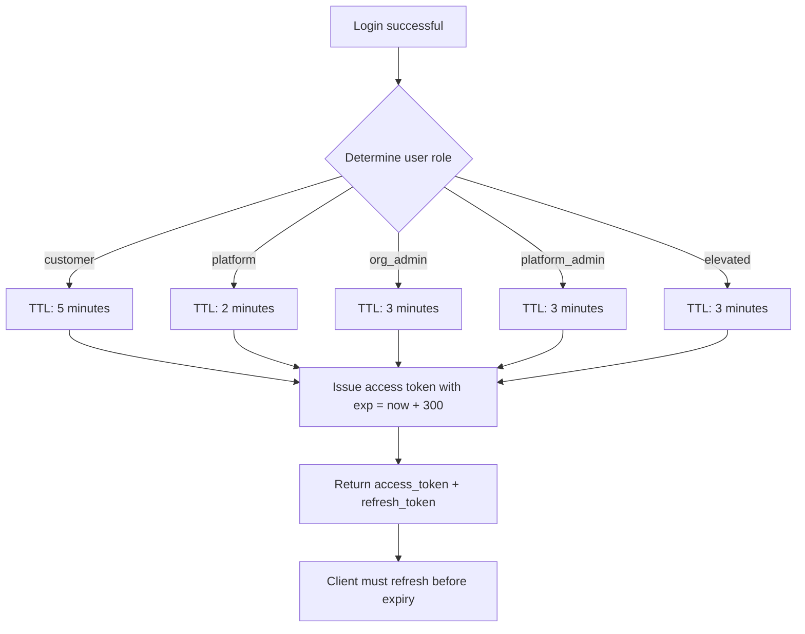
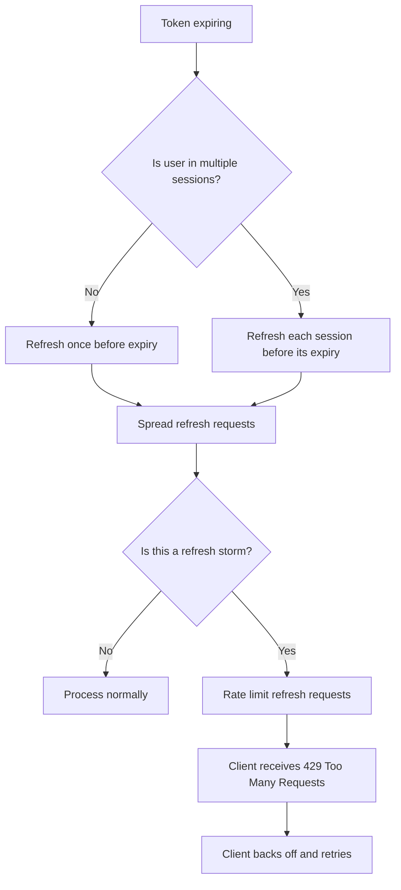

# Story 3.3: Configure Access Token TTL

## Epic

[03-token-lifecycle](../tokens.md)

## Parent Epic Story

Story 3.3

## Summary

Implement configurable access token TTL with role-based tiers: 5 minutes for normal users, 1-5 minutes for admin/high-privilege tokens. TTL is configurable via environment variable and can be adjusted per role tier. This shortens the staleness window for authorization decisions and limits the impact of token theft.

## Why This Story Exists

The JWT document recommends 5-15 minute access token TTL, biasing toward the lower end for authorization-heavy JWTs. Shorter TTLs mean:
- Less stale permissions (authz decisions are more fresh)
- Smaller window for token replay attacks
- More frequent token rotation (better revocation granularity)
- Higher refresh token usage (better family-based detection)

The current design doc states 15 minutes default -- this story updates it to the recommended 5 minutes.

## Design Context

### Current State

- `design-doc.md` section 10.1: Token TTL default is 15 minutes
- No per-role TTL differentiation
- TTL is fixed at compile time or through a single environment variable

### Role-Based TTL Tiers

| Tier | TTL (minutes) | Use Case | Config Var |
|------|---------------|----------|------------|
| `normal` | 5 | Customer users, standard access | `JWT_ACCESS_TTL_NORMAL` |
| `elevated` | 3 | Users with sensitive permissions | `JWT_ACCESS_TTL_ELEVATED` |
| `admin` | 1-3 | Platform admins, org admins | `JWT_ACCESS_TTL_ADMIN` |
| `platform` | 2 | Platform users (support, editors) | `JWT_ACCESS_TTL_PLATFORM` |

### TTL Configuration

```yaml
# config.yaml
jwt:
  access_token:
    normal_ttl_secs: 300    # 5 minutes
    elevated_ttl_secs: 180  # 3 minutes
    admin_ttl_secs: 180     # 3 minutes
    platform_ttl_secs: 120  # 2 minutes
```

```bash
# Environment variables (override config.yaml)
JWT_ACCESS_TTL_NORMAL=300
JWT_ACCESS_TTL_ELEVATED=180
JWT_ACCESS_TTL_ADMIN=180
JWT_ACCESS_TTL_PLATFORM=120
```

### Token Issuance with TTL

```rust
impl AccessClaims {
    pub fn ttl_for_role(role: &str) -> Duration {
        match role {
            "platform_admin" | "org_admin" => Duration::from_secs(180),  // 3 min
            "elevated" => Duration::from_secs(300),                       // 5 min
            _ => Duration::from_secs(300),                                // 5 min default
        }
    }
}
```

### Refresh Token TTL

| Tier | Refresh Token TTL | Notes |
|------|------------------|-------|
| All tiers | 7-30 days | Configurable via `JWT_REFRESH_TTL_DAYS` |
| Admin tier | 7 days | Shorter refresh window for high-privilege |
| Normal tier | 30 days | Longer refresh window for convenience |

Refresh tokens have longer TTLs because they are:
- Stored hashed in Redis (one-time-use detection)
- Rotated on every use (replay protection)
- Bound to a token family (tear detection)

## Mermaid Diagrams

### Token Lifetime

```mermaid
gantt
    title Access Token Lifetime
    dateFormat X
    axisFormat %M:%S
    section Normal User (5 min)
    Token valid             :0, 300
    Token expired           :300, 0
    
    section Admin User (3 min)
    Token valid             :0, 180
    Token expired           :180, 0
```



### TTL Decision Flow



### Refresh Storm Mitigation



## OpenAPI Changes

- `LoginResponse` schema: Document the token expiry time (exp claim) in description
- No changes to request/response shapes needed -- TTL is an internal implementation detail

```yaml
components:
  schemas:
    LoginResponse:
      properties:
        access_token:
          type: string
          description: JWT access token (ES256-signed). Expires in 5 minutes for normal users, 1-3 minutes for elevated/admin roles.
        refresh_token:
          type: string
          description: Rotating refresh token (7-30 day TTL).
```

## Design Doc References

- `design-doc.md` section 10.1: Token Security -- TTL updated from 15 minutes to 5 minutes normal / 1-3 minutes admin
- `design-doc.md` section 10.4: Token Versioning & Revocation -- Layer 1: short access-token TTLs to cap staleness
- `service-topology-design.md`: identity-session-service handles refresh (EXTREME freq, LOW cost)

## Wiki Pages to Update/Create

- `topics/topic-token-lifecycle.md`: (new) Document TTL tiers
- `topics/topic-login-flow.md`: Update with role-based TTL

## Acceptance Criteria

- [ ] Normal user access tokens expire in 5 minutes (300 seconds)
- [ ] Admin/high-privilege access tokens expire in 1-3 minutes
- [ ] Platform user access tokens expire in 2 minutes
- [ ] TTL is configurable via environment variables (`JWT_ACCESS_TTL_*`)
- [ ] TTL defaults are enforced even when environment variables are not set
- [ ] The `exp` claim in the JWT reflects the correct TTL
- [ ] Expired tokens are rejected with 401 "token expired"
- [ ] Refresh token TTL is longer (7-30 days) than access token TTL
- [ ] Metrics: `token_ttl_seconds` histogram tracks issued token TTLs

## Dependencies

- Depends on Story 2.2 (AccessClaims struct with `exp` field)
- Intersects with Story 3.1 (refresh rotation -- shorter tokens mean more frequent refreshes)

## Risk / Trade-offs

- **Frequent refreshes**: 5-minute tokens mean clients must refresh every 5 minutes. This increases refresh token usage and Redis load. The impact is mitigated by:
  - Refresh is cached in Redis (30s TTL)
  - Refresh tokens are stored hashed (fast lookup)
  - Clients should refresh proactively (e.g., at 4:30 minutes, not at 5:00)
- **Admin token short TTL**: 1-3 minute admin tokens are short but intentional -- admin actions are high-risk and benefit from short staleness windows. Admin users should use step-up MFA (separate flow) rather than long-lived tokens.
- **Client-side TTL tracking**: Clients must track token expiry and refresh proactively. If a client sends a request at exactly 5 minutes, the token is expired and the request fails. This is a client-side responsibility -- the backend returns 401 and the client must refresh first.
