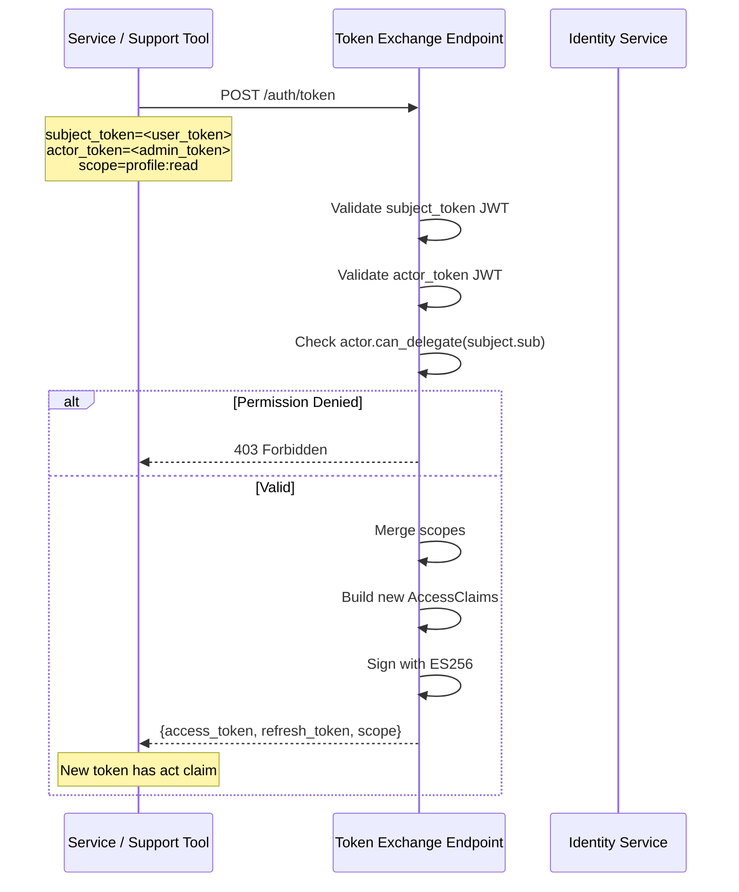
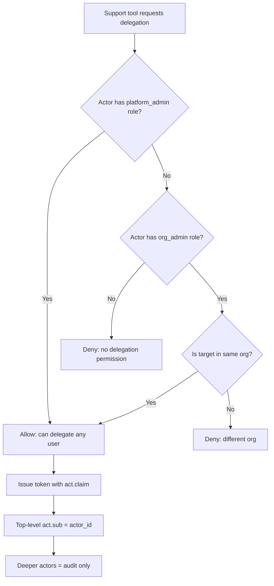

# Story 3.4: Implement RFC 8693 Token Exchange

## Epic

[03-token-lifecycle](../tokens.md)

## Parent Epic Story

Story 3.4

## Summary

Implement RFC 8693 token exchange endpoint that accepts a valid access token as a subject token and issues a new access token with delegated claims (`act` claim). Used for service-to-service delegation and support tool impersonation.

## Why This Story Exists

The JWT document emphasizes RFC 8693 `act` claim support for delegation: "The actor must not accidentally inherit more privilege than intended." Without token exchange, there is no standards-compliant way for a service to act on behalf of a user or for a support tool to impersonate a user.

## Design Context

### RFC 8693 Token Exchange

RFC 8693 defines a standard token exchange endpoint. Sesame implements it with:

```
POST /auth/token
Content-Type: application/x-www-form-urlencoded

grant_type=urn:ietf:params:oauth:grant-type:token-exchange
subject_token=<existing_access_token>
subject_token_type=urn:ietf:params:oauth:token-type:access_token
actor_token=<actor_access_token>    # optional, for nested delegation
scope=profile:read orders:write
```

Response:

```json
{
  "access_token": "<new_jwt>",
  "refresh_token": "<new_refresh>",
  "token_type": "Bearer",
  "expires_in": 300,
  "scope": "profile:read orders:write",
  "issued_token_type": "urn:ietf:params:oauth:token-type:access_token"
}
```

### Actor Claim Structure

```rust
#[derive(Debug, Clone, Serialize, Deserialize)]
pub struct ActorClaim {
    pub sub: String,
    pub tenant: String,
    pub portal: String,
}
```

The `act` claim in the new token contains:
- `sub`: The actor's user ID
- `tenant`: The actor's tenant (must match the subject's tenant)
- `portal`: The actor's application context

### Token Exchange Use Cases

| Use Case | Subject Token | Actor Token | Result |
|----------|--------------|-------------|--------|
| Service delegation | User token | Service API key | Token with `act: {sub: svc_id}` |
| Support impersonation | Admin token | User token | Token with `act: {sub: admin_id}` |
| Nested delegation | Token (already has act) | Another token | Token with nested `act` chain |

## Implementation Notes

### Validation Pipeline

```
1. Validate subject_token is a valid JWT
2. Validate actor_token is a valid JWT (if provided)
3. Extract claims from both tokens
4. Verify actor has permission to act on behalf of subject
5. Verify tenant match (actor.tenant == subject.tenant)
6. Merge scopes: min(subject.scope ∩ requested.scope, actor.scope)
7. Issue new token with:
   - All subject claims (iss, sub, aud, etc.)
   - act claim containing actor's identity
   - New exp, jti, sid
   - New ver (bumped from subject's ver)
```

### Permission Check

The actor must have explicit permission to delegate. This is checked against the actor's roles/permissions in the JWT:

```rust
pub fn can_delegate(actor_claims: &SesameAuthzClaims, target_user_id: &str) -> bool {
    // Platform admins can delegate any user
    if actor_claims.roles.contains(&"platform_admin".to_string()) {
        return true;
    }
    // Org admins can delegate users in their org
    if actor_claims.roles.contains(&"org_admin".to_string()) {
        // Check if target_user is in the same org as the actor
        return users_in_same_org(&actor_claims, target_user_id);
    }
    // Regular users cannot delegate
    false
}
```

### Nested Delegation

RFC 8693 allows nested delegation (a token already has an `act` claim, and a third party acts on behalf of that actor). Sesame supports this by including the full chain:

```json
{
  "act": {
    "sub": "admin_123",
    "chain": [
      {
        "sub": "user_456",
        "chain": [
          {
            "sub": "support_tool"
          }
        ]
      }
    ]
  }
}
```

**Decision rule**: Only the top-level `act.sub` is used for access control. Deeper nested actors are audit information only.

## Mermaid Diagrams

### Token Exchange Flow



### Actor Claim Chain



### Token Exchange vs Login

```mermaid
flowchart LR
    subgraph "Login Flow"
        A[User credentials] --> B[Verify password]
        B --> C[Issue JWT with user claims]
    end
    subgraph "Token Exchange"
        D[Subject token (JWT)] --> E[Validate subject JWT]
        E --> F[Extract subject claims]
        G[Actor token (JWT)] --> H[Validate actor JWT]
        H --> I[Check actor permission to delegate]
        I --> J[Issue new JWT with act claim]
    end
    C -.->|Can be subject| D
```

## OpenAPI Changes

Add new endpoint to `openapi/idam/identity-login-service/openapi.yaml`:

```yaml
paths:
  /auth/token:
    post:
      summary: Token Exchange (RFC 8693)
      operationId: exchangeToken
      description: |
        Exchange a subject token for a new token with delegated claims (RFC 8693).
        The actor must have permission to act on behalf of the subject.
      requestBody:
        required: true
        content:
          application/x-www-form-urlencoded:
            schema:
              type: object
              required: [grant_type, subject_token]
              properties:
                grant_type:
                  type: string
                  enum: [urn:ietf:params:oauth:grant-type:token-exchange]
                subject_token:
                  type: string
                  description: The subject access token (JWT)
                subject_token_type:
                  type: string
                  default: urn:ietf:params:oauth:token-type:access_token
                actor_token:
                  type: string
                  description: Optional actor token for nested delegation
                scope:
                  type: string
                  description: Space-delimited scopes to request
      responses:
        '200':
          description: New token issued with act claim
          content:
            application/json:
              schema:
                $ref: '#/components/schemas/TokenExchangeResponse'
        '401':
          description: Invalid subject or actor token
        '403':
          description: Actor does not have permission to delegate
```

Add new schema:

```yaml
components:
  schemas:
    TokenExchangeResponse:
      type: object
      required: [access_token, token_type, expires_in]
      properties:
        access_token:
          type: string
          description: New access token with act claim
        refresh_token:
          type: string
          description: New rotating refresh token
        token_type:
          type: string
          example: Bearer
        expires_in:
          type: integer
          format: int64
          description: Token lifetime in seconds
        scope:
          type: string
          description: Granted scopes
        issued_token_type:
          type: string
          example: urn:ietf:params:oauth:token-type:access_token
```

## Design Doc References

- `design-doc.md` section 10.5: Delegation & Actor Claims (RFC 8693)
- `design-doc.md` section 6.2: JWT Schema -- `act` claim in namespaced claims
- `design-doc.md` section 10.4: Token Versioning -- version bump on delegation
- `topics/topic-delegation.md`: (new) Document RFC 8693 support

## Wiki Pages to Update/Create

- `topics/topic-delegation.md`: (new) Document RFC 8693 token exchange
- `topics/topic-token-lifecycle.md`: Add token exchange to token lifecycle
- `topics/topic-login-flow.md`: Note token exchange as an alternative to login

## Acceptance Criteria

- [ ] `POST /auth/token` accepts `grant_type=urn:ietf:params:oauth:grant-type:token-exchange`
- [ ] Subject token is validated as a JWT (ES256 signature, typ=at+jwt, iss, aud, exp)
- [ ] Actor token is validated as a JWT (if provided)
- [ ] Actor's permission to delegate is checked against roles/permissions
- [ ] Tenant match is enforced (actor.tenant == subject.tenant)
- [ ] New token includes `act` claim with actor's identity
- [ ] Only top-level `act.sub` is used for access control decisions
- [ ] Deeper nested actors are audit-only (not decision inputs)
- [ ] Scopes are merged: min(subject.scope ∩ requested.scope, actor.scope)
- [ ] New token has fresh `exp`, `jti`, `sid`, and bumped `ver`
- [ ] Token exchange is logged with issuer, subject, actor, scopes, decision_source
- [ ] Metrics: `token_exchange_total{result: "success", "denied"}` is emitted

## Dependencies

- Depends on Story 1.3 (JWKS validation), Story 2.2 (AccessClaims struct), Story 2.4 (tenant_id in JWT)
- Intersects with Story 6.1 (RFC 8693 token exchange implementation)

## Risk / Trade-offs

- **Actor impersonation risk**: An actor with platform_admin can impersonate any user in any tenant. This is intentional for support tools but must be strictly audited. Every token exchange is logged with actor_id, subject_id, and scope.
- **Nested delegation complexity**: Supporting nested `act` chains adds complexity. The decision rule (only top-level act.sub matters) simplifies this but means deeper actors are invisible to authorization decisions. If per-layer delegation control is needed, this would require a more complex authorization model.
- **Scope merging**: The `min(subject.scope ∩ requested.scope, actor.scope)` rule ensures the new token's scopes are the intersection of what the subject has, what the actor requested, and what the actor is allowed to grant. This prevents privilege escalation through scope manipulation.

## Tests

### Unit Tests

- [ ] **`can_delegate` returns true for platform_admin**: Given an actor with `roles = ["platform_admin"]`, assert `can_delegate(actor_claims, "any_user_id")` returns `true`
- [ ] **`can_delegate` returns true for org_admin same org**: Given an actor with `roles = ["org_admin"]` and the target is in the same org, assert `can_delegate` returns `true`
- [ ] **`can_delegate` returns false for org_admin different org**: Given an actor with `roles = ["org_admin"]` and the target is in a different org, assert `can_delegate` returns `false`
- [ ] **`can_delegate` returns false for regular user**: Given an actor with `roles = ["customer"]`, assert `can_delegate` returns `false` (regular users cannot delegate)
- [ ] **`can_delegate` handles empty roles**: Given an actor with `roles = []` (empty array), assert `can_delegate` returns `false`
- [ ] **Tenant match check**: Assert that `actor.tenant == subject.tenant` is enforced — if the actor's tenant differs from the subject's tenant, the exchange is rejected
- [ ] **Scope merging produces intersection**: Given subject scopes `"profile:read orders:write"`, requested `"orders:write invoices:read"`, and actor scopes `"orders:write"`, assert the resulting scopes are `"orders:write"` (intersection of all three)
- [ ] **Scope merging rejects over-requested scope**: Given subject has `"profile:read"` but actor requests `"profile:read orders:write"`, assert the result is `"profile:read"` (subject's scopes limit the result)
- [ ] **Nested `act` chain is preserved**: Given an actor_token with `act.sub = "user_456"` and `act.chain = [{sub: "support_tool"}]`, assert the new token's `act` includes the full chain

### Integration Tests (BDD-style with `rstest_bdd`)

- [ ] **Scenario: Service delegation (user token + service key)**: `given` a valid user access token as subject and a service API key as actor → `when` `POST /auth/token` is called with `grant_type=token-exchange` → `then` a new access token is returned with `act.sub = "svc_id"` and the subject's claims are preserved
- [ ] **Scenario: Support tool impersonation**: `given` an org_admin's access token as actor and a user's token as subject → `when` token exchange is requested → `then` the new token has `act.sub = "admin_id"` and the admin's scope is intersected with the requested scope
- [ ] **Scenario: Cross-tenant delegation is rejected**: `given` an actor from tenant `hauliage` and a subject from tenant `rerp` → `when` token exchange is requested → `then` the response is 403 Forbidden (tenant mismatch)
- [ ] **Scenario: Non-admin user delegation is rejected**: `given` a regular user's token as actor trying to delegate another user's token as subject → `when` token exchange is requested → `then` the response is 403 Forbidden (actor lacks delegation permission)
- [ ] **Scenario: Invalid subject token is rejected**: `given` a malformed or expired JWT as the subject token → `when` token exchange is requested → `then` the response is 401 Invalid Token
- [ ] **Scenario: Missing actor_token is accepted (self-delegation)**: `given` a valid subject token without an actor_token → `when` token exchange is requested → `then` the new token is issued without an `act` claim (self-delegation produces a token with fresh claims but no actor)
- [ ] **Scenario: New token has bumped version**: `given` a subject token with `ver: 42` → `when` token exchange succeeds → `then` the new access token has `ver: 43` (bumped version)
- [ ] **Scenario: Metrics track exchange results**: `given` a successful token exchange → `then` `token_exchange_total{result: "success"}` is emitted; `given` a denied exchange → `then` `token_exchange_total{result: "denied"}` is emitted
- [ ] **Scenario: Audit log includes all required fields**: `given` a token exchange request → `then` the structured log includes `issuer`, `subject`, `client_id`, `session_id`, `token_id`, `token_version`, `route`, `decision_source: "exchange"`, and `actor subject`

### Security Regression Tests

- [ ] **Actor cannot delegate scope it does not have**: Given an actor with `"profile:read"` requesting `"profile:read orders:write"`, assert the new token only contains `"profile:read"` (scope cannot be expanded beyond actor's own scopes)
- [ ] **Actor cannot escalate privilege via subject token**: Given a low-privilege subject token, assert that the actor cannot produce a token with more permissions than the subject has
- [ ] **`act.sub` is set by the server, not the client**: Assert that the `act.sub` claim in the new token is derived from the validated actor token, not from any client-supplied value
- [ ] **Nested actors are audit-only**: Assert that downstream authorization decisions only consider `act.sub` (the top-level actor), NOT the nested chain members
- [ ] **Token exchange endpoint requires authentication**: Assert that the `/auth/token` endpoint requires a valid `subject_token` — requests without a subject token are rejected with 401

### Edge Cases

- [ ] **Empty subject token**: Send an empty string as `subject_token` — assert the exchange is rejected with 401 (not a panic or 500)
- [ ] **Subject token is a refresh token**: Send a refresh token (not an access token) as the subject token — assert it is rejected (only `at+jwt` tokens are accepted as subjects)
- [ ] **Max depth nested delegation**: Simulate a chain with 10 levels of nested `act` claims — assert the exchange still succeeds and only the top-level `act.sub` is used for decisions
- [ ] **Token exchange with all scopes removed**: Given a subject with scopes `"profile:read"` and the actor requests scope `""` (empty) — assert the new token has no scopes (empty scope is valid, it means the delegated token has no permissions)
- [ ] **Concurrent token exchanges with same subject**: Two concurrent token exchange requests using the same subject token — assert both succeed independently (each produces a new token with a fresh `jti` and bumped `ver`)

### Cleanup

- No state cleanup required — token exchange is stateless (no persistent side effects other than audit logs and metrics)
- Integration tests must not leave partially-validated tokens in caches — clear the JWKS cache and any token caches between scenarios
- Audit log tests should use an in-memory log collector to avoid polluting the real log system
