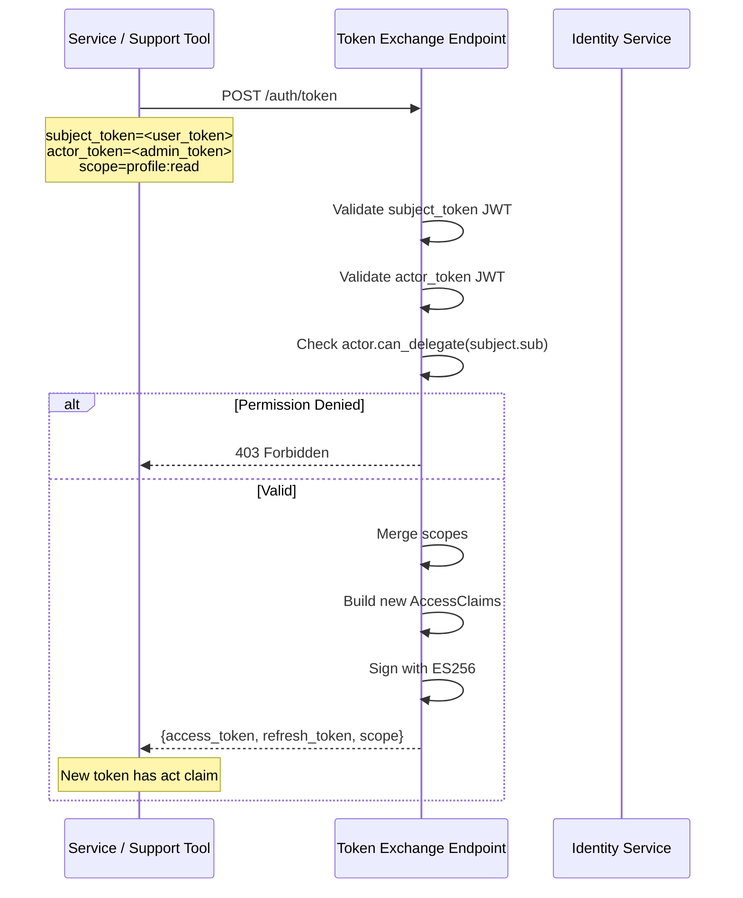
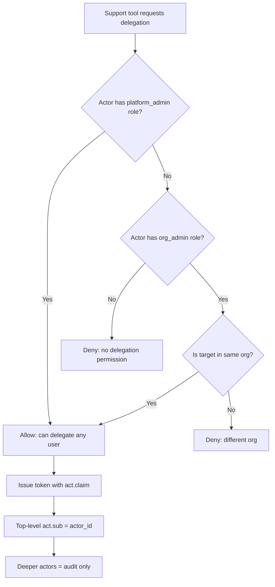

# Story 3.4: Implement RFC 8693 Token Exchange

## Epic

[03-token-lifecycle](../tokens.md)

## Parent Epic Story

Story 3.4

## Summary

Implement RFC 8693 token exchange endpoint that accepts a valid access token as a subject token and issues a new access token with delegated claims (`act` claim). Used for service-to-service delegation and support tool impersonation.

## Why This Story Exists

The JWT document emphasizes RFC 8693 `act` claim support for delegation: "The actor must not accidentally inherit more privilege than intended." Without token exchange, there is no standards-compliant way for a service to act on behalf of a user or for a support tool to impersonate a user.

## Design Context

### RFC 8693 Token Exchange

RFC 8693 defines a standard token exchange endpoint. Sesame implements it with:

```
POST /auth/token
Content-Type: application/x-www-form-urlencoded

grant_type=urn:ietf:params:oauth:grant-type:token-exchange
subject_token=<existing_access_token>
subject_token_type=urn:ietf:params:oauth:token-type:access_token
actor_token=<actor_access_token>    # optional, for nested delegation
scope=profile:read orders:write
```

Response:

```json
{
  "access_token": "<new_jwt>",
  "refresh_token": "<new_refresh>",
  "token_type": "Bearer",
  "expires_in": 300,
  "scope": "profile:read orders:write",
  "issued_token_type": "urn:ietf:params:oauth:token-type:access_token"
}
```

### Actor Claim Structure

```rust
#[derive(Debug, Clone, Serialize, Deserialize)]
pub struct ActorClaim {
    pub sub: String,
    pub tenant: String,
    pub portal: String,
}
```

The `act` claim in the new token contains:
- `sub`: The actor's user ID
- `tenant`: The actor's tenant (must match the subject's tenant)
- `portal`: The actor's application context

### Token Exchange Use Cases

| Use Case | Subject Token | Actor Token | Result |
|----------|--------------|-------------|--------|
| Service delegation | User token | Service API key | Token with `act: {sub: svc_id}` |
| Support impersonation | Admin token | User token | Token with `act: {sub: admin_id}` |
| Nested delegation | Token (already has act) | Another token | Token with nested `act` chain |

## Implementation Notes

### Validation Pipeline

```
1. Validate subject_token is a valid JWT
2. Validate actor_token is a valid JWT (if provided)
3. Extract claims from both tokens
4. Verify actor has permission to act on behalf of subject
5. Verify tenant match (actor.tenant == subject.tenant)
6. Merge scopes: min(subject.scope ∩ requested.scope, actor.scope)
7. Issue new token with:
   - All subject claims (iss, sub, aud, etc.)
   - act claim containing actor's identity
   - New exp, jti, sid
   - New ver (bumped from subject's ver)
```

### Permission Check

The actor must have explicit permission to delegate. This is checked against the actor's roles/permissions in the JWT:

```rust
pub fn can_delegate(actor_claims: &SesameAuthzClaims, target_user_id: &str) -> bool {
    // Platform admins can delegate any user
    if actor_claims.roles.contains(&"platform_admin".to_string()) {
        return true;
    }
    // Org admins can delegate users in their org
    if actor_claims.roles.contains(&"org_admin".to_string()) {
        // Check if target_user is in the same org as the actor
        return users_in_same_org(&actor_claims, target_user_id);
    }
    // Regular users cannot delegate
    false
}
```

### Nested Delegation

RFC 8693 allows nested delegation (a token already has an `act` claim, and a third party acts on behalf of that actor). Sesame supports this by including the full chain:

```json
{
  "act": {
    "sub": "admin_123",
    "chain": [
      {
        "sub": "user_456",
        "chain": [
          {
            "sub": "support_tool"
          }
        ]
      }
    ]
  }
}
```

**Decision rule**: Only the top-level `act.sub` is used for access control. Deeper nested actors are audit information only.

## Mermaid Diagrams

### Token Exchange Flow



### Actor Claim Chain



### Token Exchange vs Login

```mermaid
flowchart LR
    subgraph "Login Flow"
        A[User credentials] --> B[Verify password]
        B --> C[Issue JWT with user claims]
    end
    subgraph "Token Exchange"
        D[Subject token (JWT)] --> E[Validate subject JWT]
        E --> F[Extract subject claims]
        G[Actor token (JWT)] --> H[Validate actor JWT]
        H --> I[Check actor permission to delegate]
        I --> J[Issue new JWT with act claim]
    end
    C -.->|Can be subject| D
```

## Malicious Hacker Gotchas (Must Be Addressed During Implementation)

> **Source:** `docs/PRS_SECURITY_HARDENING.md` — Security threat model analysis

### HACK-301: Subject Token Is Not Validated for Signing or Audience (CRITICAL — Hole #1 from PRS)

**Risk:** Attacker uses ANY JWT as a subject token, including tokens from other services/tenants

The story says "Validate subject_token is a valid JWT" but does NOT specify WHICH JWKS key set to use for verification, what `aud` claims are accepted, or what `iss` is required.

**Exploit path (token reuse across services):**
1. Attacker obtains a JWT from identity-session-service (which has `aud: "session-service"`)
2. Attacker submits this JWT as `subject_token` to the token exchange endpoint
3. The endpoint validates it against the WRONG JWKS key set or ignores audience
4. Result: The attacker gets a new token that acts as if they are the subject user

**Implementation requirement:**
- The token exchange endpoint MUST validate the subject token against the SAME JWKS key set that issued it (`iss` claim)
- The subject token's `aud` claim MUST include the token exchange service's client ID
- Reject tokens from unknown issuers, wrong audiences, or unsigned JWTs
- Document: "Subject tokens are validated against the same JWKS key set as the issuing service"

### HACK-302: No Rate Limiting on Token Exchange Enables Token Farming (CRITICAL — Hole #3 from PRS)

**Risk:** Attacker floods the endpoint with stolen tokens to create unlimited forged tokens

There is NO rate limiting on `POST /auth/token` for token exchange. Each request validates a potentially different subject token and issues a new access token.

**Exploit path (token farming via stolen tokens):**
1. Attacker compromises one service and obtains its JWKS verification key (or brute-forces a weak key)
2. Attacker creates 1000 JWTs signed with the stolen key (different `sub`, different `scope`)
3. Attacker submits each JWT as `subject_token` to the token exchange endpoint
4. Each request creates a NEW access token with `act.sub = attacker_id`
5. Result: 1000 unique tokens that all carry the attacker's `act` claim, each with different subject claims

**Implementation requirement:**
- Rate limit the token exchange endpoint to MAX 10 requests per minute per `actor_token.sub`
- If no `actor_token` is provided (self-delegation), rate limit to MAX 5 requests per minute per IP
- Track rate limiting in Redis (shared across all service instances)
- Return 429 Too Many Requests when rate limit is exceeded

### HACK-303: Subject Token Can Be a Stolen Token from Any Service (HIGH — Hole #1 from PRS)

**Risk:** Attacker uses a stolen access token as subject token to create a "clean" replacement

**Exploit path:**
1. Attacker steals user A's access token (via network interception, XSS, or log leak)
2. Attacker calls token exchange with user A's token as `subject_token` and the attacker's own token as `actor_token`
3. The endpoint creates a NEW token with `act.sub = attacker_id` and `act.chain = [user_a]`
4. The new token appears to come from the attacker's tool (clean `act.sub`), but carries user A's claims
5. The original stolen token can now be denylisted (Story 3.2) without affecting the attacker's new token

**Implementation requirement:**
- The token exchange endpoint MUST verify that the subject token is NOT already denylisted
- Check `denylist:{subject_jti}` BEFORE processing the exchange
- Also check the subject token's version against the latest version in Redis
- Reject if the subject token is already stale (ver < cached_ver)

### HACK-304: Self-Delegation (No Actor Token) Allows Token Replay (HIGH — related to Hole #17)

**Risk:** Attacker uses a stolen token as subject without actor token to get a fresh token

The story says: "Missing actor_token is accepted (self-delegation)" — this means if no `actor_token` is provided, the endpoint accepts the subject token and issues a new access token with the SAME claims (minus a fresh `exp`, `jti`, `sid`).

**Exploit path:**
1. Attacker steals user A's access token
2. Attacker calls token exchange with `subject_token = user_A_token` and NO `actor_token`
3. Endpoint issues a NEW token with the same claims as user A's token (same `sub`, same `roles`, same `permissions`)
4. The new token has a fresh `exp` and `jti`, so it bypasses any denylist
5. User A's original token can be denylisted, but the attacker's new token is clean

**Implementation requirement:**
- Self-delegation (no `actor_token`) MUST be disabled by default
- It should require a specific configuration flag: `TOKEN_EXCHANGE_SELF_DELEGATION_ENABLED=false`
- Even when enabled, self-delegation MUST check the subject token against the denylist
- AND: self-delegation MUST require the subject token to have a special `self_delegatable: true` flag

### HACK-305: actor_token Can Be Forged with Arbitrary Claims (HIGH — Hole #1 from PRS)

**Risk:** Attacker forges an `actor_token` with elevated privileges (e.g., `platform_admin`)

**Exploit path:**
1. Attacker creates a JWT with `sub: "attacker_id"`, `roles: ["platform_admin"]`
2. Attacker signs it with the same JWKS key that issued the real tokens (if the key is weak or stolen)
3. Attacker submits this as `actor_token` to the token exchange endpoint
4. The endpoint sees `roles.contains("platform_admin")` → `can_delegate()` returns true
5. Result: Attacker can delegate ANY user in ANY tenant

**Implementation requirement:**
- The `actor_token` MUST be validated against the SAME JWKS key set as the subject token
- The actor's roles MUST be verified against the authz-core service (not just extracted from the actor token)
- OR: the actor token MUST have a signed `act` claim that cannot be tampered with
- Document: "Actor's roles are verified against authz-core, not extracted from the actor token"

### HACK-306: Token Exchange Bypasses Version Check on Subject Token (CRITICAL — Hole #2 from PRS)

**Risk:** Attacker uses a STALE (revoked) subject token to get a fresh token

The story says: "Validate subject_token is a valid JWT" — this validates the signature, expiry, and issuer. But it does NOT validate the version claim (`ver`) against the latest version in Redis.

**Exploit path:**
1. User's permissions are revoked, version bumped in Redis from 42 to 43
2. User's access token (ver=42) is NOT in the denylist (only used for "user disabled", not "role removed")
3. Attacker calls token exchange with the user's token (ver=42) as `subject_token`
4. The token exchange validates the JWT signature (valid), checks expiry (not expired)
5. The token exchange issues a NEW token with ver=43 (bumped from subject's ver)
6. Result: The revoked user's claims are preserved in the new token!

**Wait — the story says "New token has bumped ver (bumped from subject's ver)" — so if subject's ver is 42, the new token gets ver=43.** But that's the CURRENT version. So the new token should pass the version check (43 >= 43).

**This is a critical exploit:** token exchange takes a revoked token and produces a "fresh" token that appears clean.

**Implementation requirement:**
- The token exchange endpoint MUST check the subject token's version against the latest version in Redis (Story 5.1)
- If `subject_ver < cached_ver`: REJECT the exchange with 401 "Subject token is stale"
- This check MUST happen BEFORE issuing the new token
- If Redis is unavailable: FAIL CLOSED — reject the exchange

### HACK-307: Nested Delegation Chain Can Be Used to Escalate Privileges (HIGH — Hole #10 from PRS)

**Risk:** Attacker chains multiple token exchanges to escalate privileges

The story supports nested delegation: "a token already has an `act` claim, and a third party acts on behalf of that actor."

**Exploit path (multi-hop escalation):**
1. Attacker starts with a low-privilege token (t0)
2. Attacker calls token exchange with t0 as subject and t0 as actor (self-delegation) → t1 (same claims)
3. Attacker calls token exchange with t1 as subject and an admin's token as actor (stolen or compromised) → t2 (with `act.sub = admin_id`)
4. Attacker calls token exchange with t2 as subject and another admin's token → t3
5. Each hop produces a new token with `act.sub = different_admin_id`
6. Result: Attacker creates a chain of tokens, each appearing to come from a different admin

**Implementation requirement:**
- Track the depth of the `act` chain in each token
- Reject exchanges where the `act` chain depth exceeds a MAXIMUM (e.g., 3 levels)
- Log all nested delegation attempts with full chain for audit
- Document: "Maximum `act` chain depth is 3 levels. Deeper chains are rejected."

### HACK-308: Scope Merging Rule Can Be Manipulated (MEDIUM — Hole #11 from PRS)

**Risk:** Attacker uses the `min(subject.scope ∩ requested.scope, actor.scope)` rule to manipulate scopes

The story says: "min(subject.scope ∩ requested.scope, actor.scope)" — this means the result is the MINIMUM of: (1) the intersection of subject and requested scopes, AND (2) the actor's scopes.

**Exploit path:**
1. Subject has scope: `profile:read orders:write`
2. Actor has scope: `profile:read`
3. Attacker requests scope: `profile:read orders:write admin:write`
4. Result: `min({profile:read, orders:write} ∩ {profile:read, orders:write, admin:write}, {profile:read})` = `profile:read`
5. This is correct — the actor can only grant what they have.

**BUT — what if the actor has NO scopes?** The intersection with an empty set would be empty, meaning the new token has NO permissions.

**And what if the subject has `admin:write` but the actor doesn't?** The intersection removes `admin:write`. Correct.

**The real exploit is different:** What if the token exchange endpoint does NOT validate the actor's scopes against the actor's actual permissions?

**Exploit path (scope inflation via actor token forgery):**
1. Attacker forges an `actor_token` with scope: `admin:write profile:read orders:write`
2. Subject has scope: `profile:read`
3. Attacker requests scope: `admin:write`
4. Result: `min({profile:read} ∩ {admin:write}, {admin:write, profile:read, orders:read})` = empty set
5. Hmm, that doesn't work either.

**The actual risk:** The actor token's scopes are extracted from the JWT, NOT verified against the authz-core service. If the actor token is forged (HACK-305), the scopes are also forged.

**Implementation requirement:**
- The actor's scopes MUST be verified against the authz-core service, not extracted from the actor token
- The scope merging rule should only apply to scopes that have been verified

### HACK-309: Token Exchange Endpoint Is Not Rate-Limited per Subject (MEDIUM — related to Hole #3)

**Risk:** Attacker floods the endpoint with the SAME subject token to create many tokens

**Exploit path:**
1. Attacker obtains one valid subject token (stolen or compromised)
2. Attacker calls token exchange 1000 times with the SAME subject token
3. Each call creates a NEW token with a fresh `jti` and bumped `ver`
4. Result: 1000 tokens that all carry the same claims
5. Even if the original token is denylisted, 999 new tokens remain active

**Implementation requirement:**
- Rate limit token exchange per subject token (not just per actor)
- MAX 5 exchanges per subject token per hour
- Track this in Redis using a key like `token_exchange:subject:{subject_jti}`
- Return 429 when rate limit is exceeded

### HACK-310: Actor Token and Subject Token Can Come from Different Tenants (CRITICAL — Hole #5 from PRS)

**Risk:** Attacker uses a subject token from Tenant A and an actor token from Tenant B

The story says: "Verify tenant match (actor.tenant == subject.tenant)" — but it doesn't specify HOW this is verified. If the `tenant` field in the JWT can be forged (it's just a claim, not protected by signature verification of the entire token), this check can be bypassed.

**Exploit path:**
1. Attacker obtains a token from Tenant A (subject)
2. Attacker forges an actor token with `tenant: "Tenant B"` and `roles: ["platform_admin"]`
3. Attacker submits the exchange with both tokens
4. If the tenant field is extracted from the actor token without signature verification, the attacker's forged tenant is used
5. Result: Cross-tenant token exchange

**Implementation requirement:**
- BOTH the actor token and subject token MUST have their full JWT signatures verified before extracting ANY claims (including `tenant`)
- The tenant comparison must use the verified claims, not raw JSON fields
- Reject exchanges where either token fails signature verification

Add new endpoint to `openapi/idam/identity-login-service/openapi.yaml`:

```yaml
paths:
  /auth/token:
    post:
      summary: Token Exchange (RFC 8693)
      operationId: exchangeToken
      description: |
        Exchange a subject token for a new token with delegated claims (RFC 8693).
        The actor must have permission to act on behalf of the subject.
      requestBody:
        required: true
        content:
          application/x-www-form-urlencoded:
            schema:
              type: object
              required: [grant_type, subject_token]
              properties:
                grant_type:
                  type: string
                  enum: [urn:ietf:params:oauth:grant-type:token-exchange]
                subject_token:
                  type: string
                  description: The subject access token (JWT)
                subject_token_type:
                  type: string
                  default: urn:ietf:params:oauth:token-type:access_token
                actor_token:
                  type: string
                  description: Optional actor token for nested delegation
                scope:
                  type: string
                  description: Space-delimited scopes to request
      responses:
        '200':
          description: New token issued with act claim
          content:
            application/json:
              schema:
                $ref: '#/components/schemas/TokenExchangeResponse'
        '401':
          description: Invalid subject or actor token
        '403':
          description: Actor does not have permission to delegate
```

Add new schema:

```yaml
components:
  schemas:
    TokenExchangeResponse:
      type: object
      required: [access_token, token_type, expires_in]
      properties:
        access_token:
          type: string
          description: New access token with act claim
        refresh_token:
          type: string
          description: New rotating refresh token
        token_type:
          type: string
          example: Bearer
        expires_in:
          type: integer
          format: int64
          description: Token lifetime in seconds
        scope:
          type: string
          description: Granted scopes
        issued_token_type:
          type: string
          example: urn:ietf:params:oauth:token-type:access_token
```

## Design Doc References

- `design-doc.md` section 10.5: Delegation & Actor Claims (RFC 8693)
- `design-doc.md` section 6.2: JWT Schema -- `act` claim in namespaced claims
- `design-doc.md` section 10.4: Token Versioning -- version bump on delegation
- `topics/topic-delegation.md`: (new) Document RFC 8693 support

## Wiki Pages to Update/Create

- `topics/topic-delegation.md`: (new) Document RFC 8693 token exchange
- `topics/topic-token-lifecycle.md`: Add token exchange to token lifecycle
- `topics/topic-login-flow.md`: Note token exchange as an alternative to login

## Acceptance Criteria

- [ ] `POST /auth/token` accepts `grant_type=urn:ietf:params:oauth:grant-type:token-exchange`
- [ ] Subject token is validated as a JWT (ES256 signature, typ=at+jwt, iss, aud, exp)
- [ ] Actor token is validated as a JWT (if provided)
- [ ] Actor's permission to delegate is checked against roles/permissions
- [ ] Tenant match is enforced (actor.tenant == subject.tenant)
- [ ] New token includes `act` claim with actor's identity
- [ ] Only top-level `act.sub` is used for access control decisions
- [ ] Deeper nested actors are audit-only (not decision inputs)
- [ ] Scopes are merged: min(subject.scope ∩ requested.scope, actor.scope)
- [ ] New token has fresh `exp`, `jti`, `sid`, and bumped `ver`
- [ ] Token exchange is logged with issuer, subject, actor, scopes, decision_source
- [ ] Metrics: `token_exchange_total{result: "success", "denied"}` is emitted

## Dependencies

- Depends on Story 1.3 (JWKS validation), Story 2.2 (AccessClaims struct), Story 2.4 (tenant_id in JWT)
- Intersects with Story 6.1 (RFC 8693 token exchange implementation)

## Risk / Trade-offs

- **Actor impersonation risk**: An actor with platform_admin can impersonate any user in any tenant. This is intentional for support tools but must be strictly audited. Every token exchange is logged with actor_id, subject_id, and scope.
- **Nested delegation complexity**: Supporting nested `act` chains adds complexity. The decision rule (only top-level act.sub matters) simplifies this but means deeper actors are invisible to authorization decisions. If per-layer delegation control is needed, this would require a more complex authorization model.
- **Scope merging**: The `min(subject.scope ∩ requested.scope, actor.scope)` rule ensures the new token's scopes are the intersection of what the subject has, what the actor requested, and what the actor is allowed to grant. This prevents privilege escalation through scope manipulation.

## Tests

### Unit Tests

- [ ] **`can_delegate` returns true for platform_admin**: Given an actor with `roles = ["platform_admin"]`, assert `can_delegate(actor_claims, "any_user_id")` returns `true`
- [ ] **`can_delegate` returns true for org_admin same org**: Given an actor with `roles = ["org_admin"]` and the target is in the same org, assert `can_delegate` returns `true`
- [ ] **`can_delegate` returns false for org_admin different org**: Given an actor with `roles = ["org_admin"]` and the target is in a different org, assert `can_delegate` returns `false`
- [ ] **`can_delegate` returns false for regular user**: Given an actor with `roles = ["customer"]`, assert `can_delegate` returns `false` (regular users cannot delegate)
- [ ] **`can_delegate` handles empty roles**: Given an actor with `roles = []` (empty array), assert `can_delegate` returns `false`
- [ ] **Tenant match check**: Assert that `actor.tenant == subject.tenant` is enforced — if the actor's tenant differs from the subject's tenant, the exchange is rejected
- [ ] **Scope merging produces intersection**: Given subject scopes `"profile:read orders:write"`, requested `"orders:write invoices:read"`, and actor scopes `"orders:write"`, assert the resulting scopes are `"orders:write"` (intersection of all three)
- [ ] **Scope merging rejects over-requested scope**: Given subject has `"profile:read"` but actor requests `"profile:read orders:write"`, assert the result is `"profile:read"` (subject's scopes limit the result)
- [ ] **Nested `act` chain is preserved**: Given an actor_token with `act.sub = "user_456"` and `act.chain = [{sub: "support_tool"}]`, assert the new token's `act` includes the full chain

### Integration Tests (BDD-style with `rstest_bdd`)

- [ ] **Scenario: Service delegation (user token + service key)**: `given` a valid user access token as subject and a service API key as actor → `when` `POST /auth/token` is called with `grant_type=token-exchange` → `then` a new access token is returned with `act.sub = "svc_id"` and the subject's claims are preserved
- [ ] **Scenario: Support tool impersonation**: `given` an org_admin's access token as actor and a user's token as subject → `when` token exchange is requested → `then` the new token has `act.sub = "admin_id"` and the admin's scope is intersected with the requested scope
- [ ] **Scenario: Cross-tenant delegation is rejected**: `given` an actor from tenant `hauliage` and a subject from tenant `rerp` → `when` token exchange is requested → `then` the response is 403 Forbidden (tenant mismatch)
- [ ] **Scenario: Non-admin user delegation is rejected**: `given` a regular user's token as actor trying to delegate another user's token as subject → `when` token exchange is requested → `then` the response is 403 Forbidden (actor lacks delegation permission)
- [ ] **Scenario: Invalid subject token is rejected**: `given` a malformed or expired JWT as the subject token → `when` token exchange is requested → `then` the response is 401 Invalid Token
- [ ] **Scenario: Missing actor_token is accepted (self-delegation)**: `given` a valid subject token without an actor_token → `when` token exchange is requested → `then` the new token is issued without an `act` claim (self-delegation produces a token with fresh claims but no actor)
- [ ] **Scenario: New token has bumped version**: `given` a subject token with `ver: 42` → `when` token exchange succeeds → `then` the new access token has `ver: 43` (bumped version)
- [ ] **Scenario: Metrics track exchange results**: `given` a successful token exchange → `then` `token_exchange_total{result: "success"}` is emitted; `given` a denied exchange → `then` `token_exchange_total{result: "denied"}` is emitted
- [ ] **Scenario: Audit log includes all required fields**: `given` a token exchange request → `then` the structured log includes `issuer`, `subject`, `client_id`, `session_id`, `token_id`, `token_version`, `route`, `decision_source: "exchange"`, and `actor subject`

### Security Regression Tests

- [ ] **Actor cannot delegate scope it does not have**: Given an actor with `"profile:read"` requesting `"profile:read orders:write"`, assert the new token only contains `"profile:read"` (scope cannot be expanded beyond actor's own scopes)
- [ ] **Actor cannot escalate privilege via subject token**: Given a low-privilege subject token, assert that the actor cannot produce a token with more permissions than the subject has
- [ ] **`act.sub` is set by the server, not the client**: Assert that the `act.sub` claim in the new token is derived from the validated actor token, not from any client-supplied value
- [ ] **Nested actors are audit-only**: Assert that downstream authorization decisions only consider `act.sub` (the top-level actor), NOT the nested chain members
- [ ] **Token exchange endpoint requires authentication**: Assert that the `/auth/token` endpoint requires a valid `subject_token` — requests without a subject token are rejected with 401

### Edge Cases

- [ ] **Empty subject token**: Send an empty string as `subject_token` — assert the exchange is rejected with 401 (not a panic or 500)
- [ ] **Subject token is a refresh token**: Send a refresh token (not an access token) as the subject token — assert it is rejected (only `at+jwt` tokens are accepted as subjects)
- [ ] **Max depth nested delegation**: Simulate a chain with 10 levels of nested `act` claims — assert the exchange still succeeds and only the top-level `act.sub` is used for decisions
- [ ] **Token exchange with all scopes removed**: Given a subject with scopes `"profile:read"` and the actor requests scope `""` (empty) — assert the new token has no scopes (empty scope is valid, it means the delegated token has no permissions)
- [ ] **Concurrent token exchanges with same subject**: Two concurrent token exchange requests using the same subject token — assert both succeed independently (each produces a new token with a fresh `jti` and bumped `ver`)

### Cleanup

- No state cleanup required — token exchange is stateless (no persistent side effects other than audit logs and metrics)
- Integration tests must not leave partially-validated tokens in caches — clear the JWKS cache and any token caches between scenarios
- Audit log tests should use an in-memory log collector to avoid polluting the real log system
