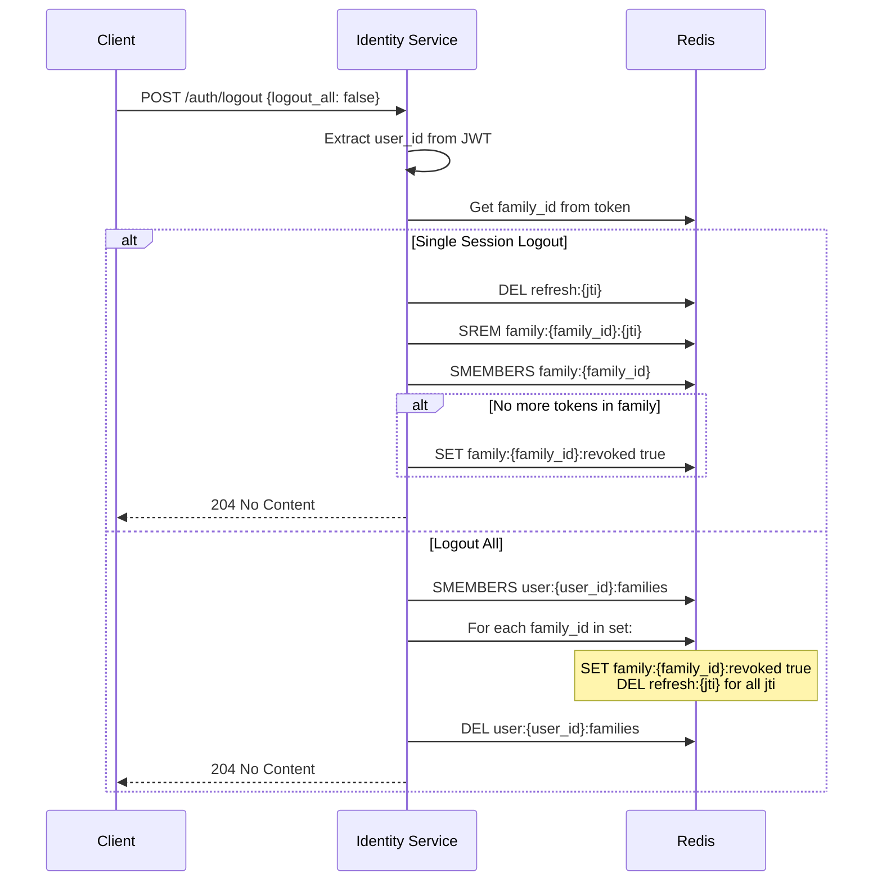
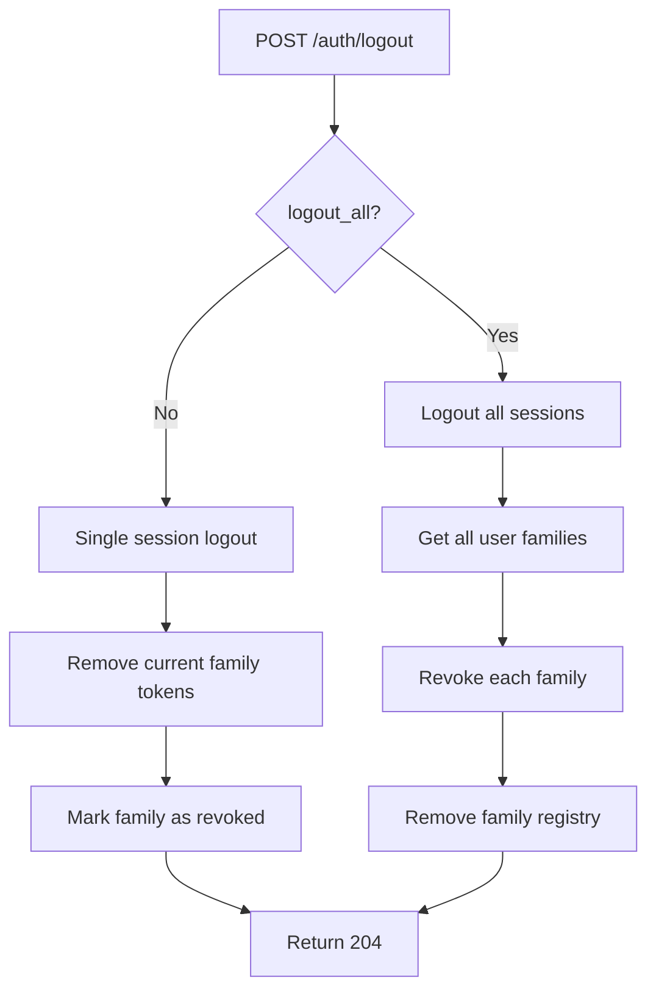
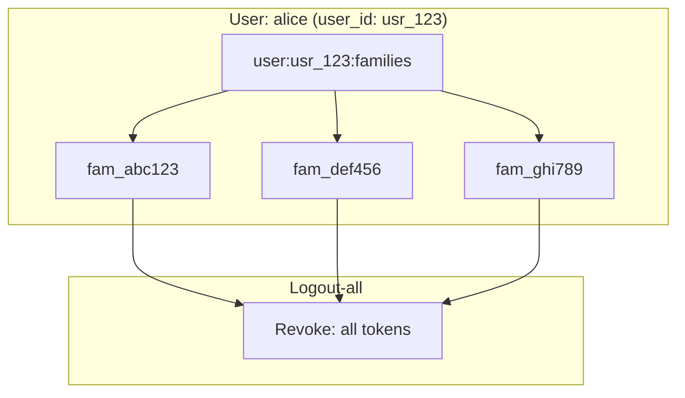

# Story 3.5: Implement Rotating Refresh Token Logout

## Epic

[03-token-lifecycle](../tokens.md)

## Parent Epic Story

Story 3.5

## Summary

Implement logout functionality that invalidates the entire token family in Redis on `/auth/logout`. Both the specific session's tokens and (optionally) all tokens across all sessions for a user can be invalidated. The response does not confirm logout to prevent user enumeration (security best practice).

## Why This Story Exists

The JWT document emphasizes that "logout/revocation" must be effective -- a logout should immediately prevent all tokens from being used. Without proper family-based revocation, a logout only invalidates the current session's tokens while leaving other sessions active (which may be desired or undesired depending on the use case).

## Design Context

### Current State

- `/auth/logout` endpoint exists in identity-session-service spec
- Currently the endpoint likely just revokes the current refresh token
- No family-based revocation is implemented
- No distinction between "logout this session" and "logout all sessions"

### Logout Types

| Type | Redis Operation | Use Case |
|------|----------------|----------|
| **Single-session logout** | Remove tokens for one family | User logs out of one device/browser |
| **Logout-all** | Remove all families for a user | User wants to log out everywhere |

### Redis Operations

#### Single-Session Logout

```
DEL refresh:{jti}                    # Remove current refresh token
SREM family:{family_id}:{jti}        # Remove from family set
# Check if family set is empty
SMEMBERS family:{family_id}
# If empty, mark family as revoked
SET family:{family_id}:revoked true
EXPIRE family:{family_id} 86400
```

#### Logout-All

```
# For each family belonging to the user:
SADD family:{family_id}:revoked true  # Mark all families as compromised
SMEMBERS family:{family_id}           # Get all tokens in family
# For each token jti in the family:
DEL refresh:{jti}                     # Remove all tokens
```

### Logout-All User Discovery

To implement logout-all, the service must know all token families for a user. Two approaches:

| Approach | Pros | Cons |
|----------|------|------|
| **Family registry**: `user:{user_id}:families` (set of family_ids) | Simple, O(1) lookup | Requires maintaining the set |
| **Scan family keys**: `SMEMBERS family:*` with user sub | No extra state | O(n) scan, not scalable |

**Decision**: Use the family registry approach. On each login, add the `family_id` to `user:{user_id}:families`. On logout, iterate over this set and revoke all families.

```
SET user:{user_id}:families fam_abc123,fam_def456,fam_ghi789
EXPIRE user:{user_id}:families 2592000  # 30 days
```

## Implementation Notes

### Logout API

```
POST /auth/logout
Authorization: Bearer {access_token}

{
  "logout_all": false    // Optional. If true, logout from all sessions.
}
```

### Response Behavior

| Scenario | HTTP Status | Response Body | Rationale |
|----------|------------|---------------|-----------|
| Logout single session | 204 No Content | None | Security: don't confirm logout to prevent enumeration |
| Logout all | 204 No Content | None | Same rationale |
| Invalid token | 401 Unauthorized | `{"reason": "invalid_token"}` | Token is not valid, so no logout can occur |

The 204 response with no body prevents attackers from discovering whether a user has an account by observing whether logout succeeds or fails. This is a security best practice.

### Metrics

| Metric | Labels | Purpose |
|--------|--------|---------|
| `token_logout_total` | {type: "single", "all"} | Count logout events |
| `token_logout_families_total` | {type: "single", "all"} | Number of families revoked |

## Mermaid Diagrams

### Logout Flow



### Logout Types



### Family Registry



## OpenAPI Changes

Add to `openapi/idam/identity-session-service/openapi.yaml`:

```yaml
paths:
  /auth/logout:
    post:
      summary: Logout (revoke session)
      operationId: logout
      requestBody:
        content:
          application/json:
            schema:
              type: object
              properties:
                logout_all:
                  type: boolean
                  default: false
                  description: If true, logout from all sessions. Default: false.
      responses:
        '204':
          description: Logged out successfully (no content to prevent enumeration)
        '401':
          description: Invalid token
```

## Design Doc References

- `design-doc.md` section 10.4: Token Versioning & Revocation -- Layer 2: rotating refresh tokens with reuse detection
- `design-doc.md` section 10.1: Token Security -- "Rotating token families stored in Redis with reuse detection"
- `design-doc.md` section 8.2: Login + JWT Enrichment Flow -- logout step
- `service-topology-design.md`: identity-session-service handles logout (MEDIUM frequency, LOW cost)

## Wiki Pages to Update/Create

- `topics/topic-token-lifecycle.md`: (new) Document logout flow
- `topics/topic-login-flow.md`: Update logout behavior (204 no content)

## Acceptance Criteria

- [ ] Single-session logout removes the current family's tokens from Redis
- [ ] Single-session logout returns 204 No Content (no body)
- [ ] Logout-all removes ALL families for the user from Redis
- [ ] Logout-all removes the `user:{user_id}:families` registry
- [ ] Logout-all returns 204 No Content (no body)
- [ ] Invalid token returns 401 with reason "invalid_token"
- [ ] Both single and all logout prevent the revoked token from being used
- [ ] Metrics: `token_logout_total{type: "single", "all"}` and `token_logout_families_total` are emitted
- [ ] No confirmation response body (security best practice to prevent enumeration)
- [ ] Family registry `user:{user_id}:families` is maintained and updated on each login/logout

## Dependencies

- Depends on Story 3.2 (token family structure)
- Intersects with Story 3.1 (refresh rotation)

## Risk / Trade-offs

- **Family registry maintenance**: The `user:{user_id}:families` set must be maintained on every login (add family) and logout (remove family). This adds complexity but is necessary for efficient logout-all.
- **No enumeration protection**: The 204 response prevents enumeration. If a client sends logout with an invalid token, they get 401. If valid, they get 204. This leaks whether the token is valid, but not whether a user account exists. This is an acceptable trade-off -- the alternative is to always return 204 regardless of token validity, which prevents detecting invalid token errors.
- **Logout-all performance**: For users with many active sessions (e.g., a user with 100 devices), logout-all must iterate over 100 families and revoke each one. This is O(n) where n is the number of families. For most users, n is small (< 5). For extreme cases, this could be a bottleneck. Mitigation: use pipeline Redis commands to batch deletions.
