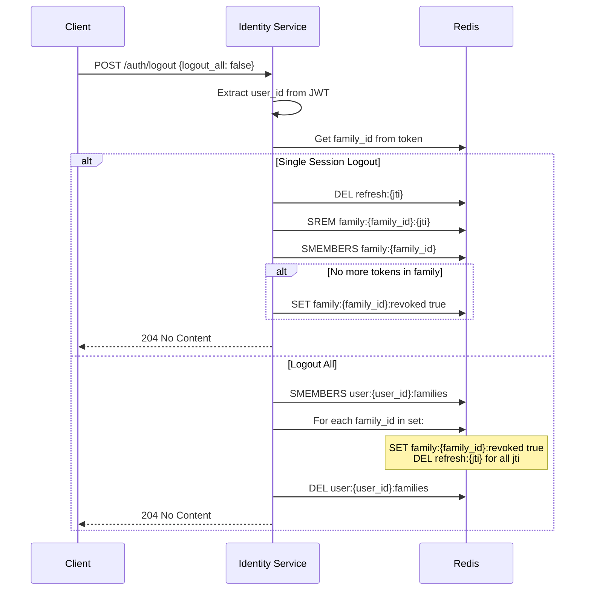
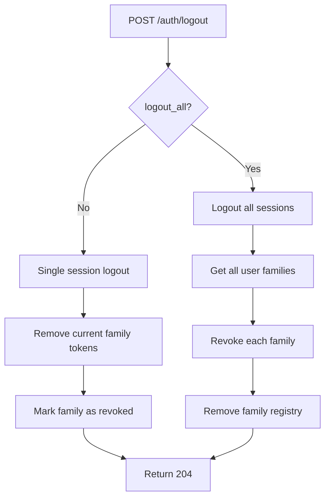
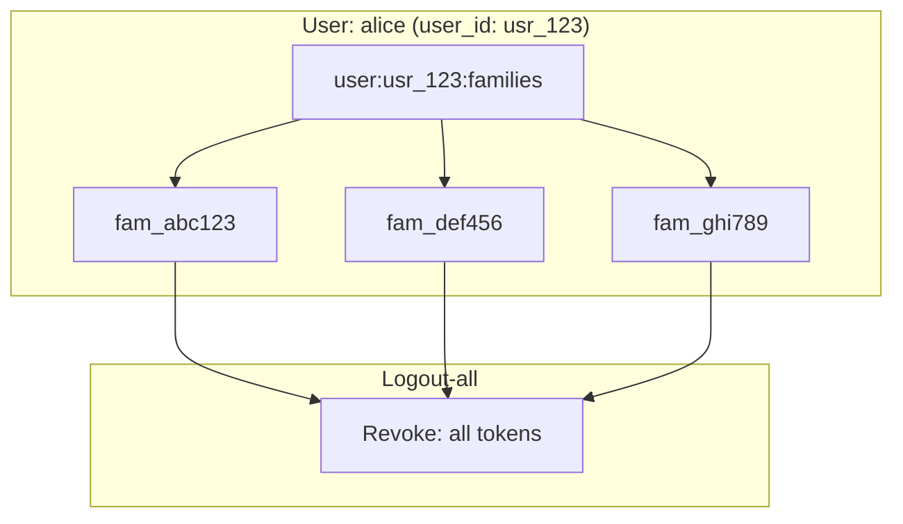

# Story 3.5: Implement Rotating Refresh Token Logout

## Epic

[03-token-lifecycle](../tokens.md)

## Parent Epic Story

Story 3.5

## Summary

Implement logout functionality that invalidates the entire token family in Redis on `/auth/logout`. Both the specific session's tokens and (optionally) all tokens across all sessions for a user can be invalidated. The response does not confirm logout to prevent user enumeration (security best practice).

## Why This Story Exists

The JWT document emphasizes that "logout/revocation" must be effective -- a logout should immediately prevent all tokens from being used. Without proper family-based revocation, a logout only invalidates the current session's tokens while leaving other sessions active (which may be desired or undesired depending on the use case).

## Design Context

### Current State

- `/auth/logout` endpoint exists in identity-session-service spec
- Currently the endpoint likely just revokes the current refresh token
- No family-based revocation is implemented
- No distinction between "logout this session" and "logout all sessions"

### Logout Types

| Type | Redis Operation | Use Case |
|------|----------------|----------|
| **Single-session logout** | Remove tokens for one family | User logs out of one device/browser |
| **Logout-all** | Remove all families for a user | User wants to log out everywhere |

### Redis Operations

#### Single-Session Logout

```
DEL refresh:{jti}                    # Remove current refresh token
SREM family:{family_id}:{jti}        # Remove from family set
# Check if family set is empty
SMEMBERS family:{family_id}
# If empty, mark family as revoked
SET family:{family_id}:revoked true
EXPIRE family:{family_id} 86400
```

#### Logout-All

```
# For each family belonging to the user:
SADD family:{family_id}:revoked true  # Mark all families as compromised
SMEMBERS family:{family_id}           # Get all tokens in family
# For each token jti in the family:
DEL refresh:{jti}                     # Remove all tokens
```

### Logout-All User Discovery

To implement logout-all, the service must know all token families for a user. Two approaches:

| Approach | Pros | Cons |
|----------|------|------|
| **Family registry**: `user:{user_id}:families` (set of family_ids) | Simple, O(1) lookup | Requires maintaining the set |
| **Scan family keys**: `SMEMBERS family:*` with user sub | No extra state | O(n) scan, not scalable |

**Decision**: Use the family registry approach. On each login, add the `family_id` to `user:{user_id}:families`. On logout, iterate over this set and revoke all families.

```
SET user:{user_id}:families fam_abc123,fam_def456,fam_ghi789
EXPIRE user:{user_id}:families 2592000  # 30 days
```

**F-017 Fix: Dead token sweep and TTL consistency.** The current design has unbounded Redis growth because:
- `refresh:{jti}` entries have 30-day TTL (matching refresh token TTL)
- `family:{family_id}` entries have 24-hour TTL
- `user:{user_id}:families` entries have 30-day TTL (correct)
- BUT: when a user logs out or is revoked, `family:{family_id}` sets and individual `refresh:{jti}` entries are deleted, BUT the corresponding entry in `user:{user_id}:families` is NOT cleaned up

This causes `user:{user_id}:families` to accumulate stale family IDs for users who have logged out or been revoked.

**Fix:** On logout-all, after revoking all families, explicitly `DEL user:{user_id}:families` (already done). On single-session logout, `SREM user:{user_id}:families family_id` after removing the family's tokens. This keeps the family registry in sync with actual active families.

## Implementation Notes

### Logout API

```
POST /auth/logout
Authorization: Bearer {access_token}

{
  "logout_all": false    // Optional. If true, logout from all sessions.
}
```

### Response Behavior

| Scenario | HTTP Status | Response Body | Rationale |
|----------|------------|---------------|-----------|
| Logout single session | 204 No Content | None | Security: don't confirm logout to prevent enumeration |
| Logout all | 204 No Content | None | Same rationale |
| Invalid token | 401 Unauthorized | `{"reason": "invalid_token"}` | Token is not valid, so no logout can occur |

The 204 response with no body prevents attackers from discovering whether a user has an account by observing whether logout succeeds or fails. This is a security best practice.

### Metrics

| Metric | Labels | Purpose |
|--------|--------|---------|
| `token_logout_total` | {type: "single", "all"} | Count logout events |
| `token_logout_families_total` | {type: "single", "all"} | Number of families revoked |

## Mermaid Diagrams

### Logout Flow



### Logout Types



### Family Registry



## OpenAPI Changes

Add to `openapi/idam/identity-session-service/openapi.yaml`:

```yaml
paths:
  /auth/logout:
    post:
      summary: Logout (revoke session)
      operationId: logout
      requestBody:
        content:
          application/json:
            schema:
              type: object
              properties:
                logout_all:
                  type: boolean
                  default: false
                  description: If true, logout from all sessions. Default: false.
      responses:
        '204':
          description: Logged out successfully (no content to prevent enumeration)
        '401':
          description: Invalid token
```

## Design Doc References

- `design-doc.md` section 10.4: Token Versioning & Revocation -- Layer 2: rotating refresh tokens with reuse detection
- `design-doc.md` section 10.1: Token Security -- "Rotating token families stored in Redis with reuse detection"
- `design-doc.md` section 8.2: Login + JWT Enrichment Flow -- logout step
- `service-topology-design.md`: identity-session-service handles logout (MEDIUM frequency, LOW cost)

## Wiki Pages to Update/Create

- `topics/topic-token-lifecycle.md`: (new) Document logout flow
- `topics/topic-login-flow.md`: Update logout behavior (204 no content)

## Acceptance Criteria

- [ ] Single-session logout removes the current family's tokens from Redis
- [ ] Single-session logout returns 204 No Content (no body)
- [ ] Logout-all removes ALL families for the user from Redis
- [ ] Logout-all removes the `user:{user_id}:families` registry
- [ ] Logout-all returns 204 No Content (no body)
- [ ] Invalid token returns 401 with reason "invalid_token"
- [ ] Both single and all logout prevent the revoked token from being used
- [ ] Metrics: `token_logout_total{type: "single", "all"}` and `token_logout_families_total` are emitted
- [ ] No confirmation response body (security best practice to prevent enumeration)
- [ ] Family registry `user:{user_id}:families` is maintained and updated on each login/logout

## Dependencies

- Depends on Story 3.2 (token family structure)
- Intersects with Story 3.1 (refresh rotation)

## Risk / Trade-offs

- **Family registry maintenance**: The `user:{user_id}:families` set must be maintained on every login (add family) and logout (remove family). This adds complexity but is necessary for efficient logout-all.
- **No enumeration protection**: The 204 response prevents enumeration. If a client sends logout with an invalid token, they get 401. If valid, they get 204. This leaks whether the token is valid, but not whether a user account exists. This is an acceptable trade-off -- the alternative is to always return 204 regardless of token validity, which prevents detecting invalid token errors.
- **Logout-all performance**: For users with many active sessions (e.g., a user with 100 devices), logout-all must iterate over 100 families and revoke each one. This is O(n) where n is the number of families. For most users, n is small (< 5). For extreme cases, this could be a bottleneck. Mitigation: use pipeline Redis commands to batch deletions.

## Tests

### Unit Tests

- [ ] **Logout response is 204 No Content**: Assert that a successful logout returns HTTP 204 with an empty body (no JSON, no HTML — just status code)
- [ ] **Logout-invalid token returns 401**: Assert that logout with an expired, malformed, or revoked refresh token returns HTTP 401 with `{"reason": "invalid_token"}`
- [ ] **Single-session logout does not affect other sessions**: Given a user with 3 families (fam_abc, fam_def, fam_ghi) — assert that single-session logout of fam_abc does NOT delete tokens in fam_def or fam_ghi
- [ ] **Logout-all removes all families**: Given a user with 3 families — assert that logout-all deletes all `refresh:{jti}` entries for all 3 families AND deletes `user:{user_id}:families`
- [ ] **Family registry is cleaned on single logout**: Given a user with families `["fam_abc", "fam_def"]` — assert that single logout of fam_abc results in `user:{user_id}:families` containing only `["fam_def"]` (SREM operation verified)
- [ ] **Family registry is deleted on logout-all**: Given a user with families `["fam_abc", "fam_def"]` — assert that logout-all results in `user:{user_id}:families` being deleted (DEL operation verified)
- [ ] **Revoked family prevents future refresh**: After logout, assert that any refresh token from the revoked family is rejected (its `jti` is in the denylist or its `family:{family_id}` is marked as revoked)

### Integration Tests (BDD-style with `rstest_bdd`)

- [ ] **Scenario: Single-session logout**: `given` a valid refresh token for user-123 with family `fam_abc` → `when` a `POST /auth/logout {logout_all: false}` request is made → `then` the response is 204 No Content, Redis `refresh:{jti}` is deleted, and `family:{fam_abc}` is marked as revoked
- [ ] **Scenario: Logout-all removes all sessions**: `given` a user with 3 active sessions (families `fam_abc`, `fam_def`, `fam_ghi`) → `when` a `POST /auth/logout {logout_all: true}` request is made → `then` the response is 204 No Content, all 3 family sets are deleted, all `refresh:{jti}` entries are deleted, and `user:{user_id}:families` is deleted
- [ ] **Scenario: Expired token logout returns 401**: `given` an expired refresh token → `when` logout is requested → `then` the response is 401 with `reason: "invalid_token"` (the token cannot be used for logout)
- [ ] **Scenario: Logout with valid access token also revokes refresh**: `given` a valid access token (derived from a refresh token) → `when` the access token's associated refresh token is used for logout → `then` the refresh token is revoked and the family is marked as revoked
- [ ] **Scenario: Metrics track logout events**: `given` a successful logout-all → `then` `token_logout_total{type: "all"}` is emitted and `token_logout_families_total{type: "all"}` reflects the number of families revoked
- [ ] **Scenario: No body in 204 response**: `given` a successful logout → `when` the response is captured → `then` the response body is empty (0 bytes) — this prevents user enumeration

### Security Regression Tests

- [ ] **Logout prevents token reuse**: After logout, assert that any attempt to use the revoked refresh token for `/auth/refresh` is rejected (the token is in the denylist or its family is revoked)
- [ ] **Logout-all revokes ALL sessions including future ones**: After logout-all, assert that even if the client attempts to use a previously-issued refresh token, it is rejected (the family is revoked and the `user:{user_id}:families` registry is deleted, preventing new families from being looked up)
- [ ] **Logout does not leak user information**: Assert that the 204 response body is always empty regardless of whether the logout was single or all — the client cannot distinguish between the two based on the response
- [ ] **Logout with invalid token does not reveal account existence**: Assert that 401 responses only indicate invalid token, not whether the user exists — the error message is generic (`"invalid_token"`), not user-specific

### Edge Cases

- [ ] **Logout with 100 active sessions**: Inject 100 families for a single user — assert logout-all completes within 1 second (use Redis pipeline to batch deletions and verify the batch size)
- [ ] **Logout after family already revoked**: Given a family that was already revoked (via reuse detection) — assert that single logout of that family does not error (idempotent: deleting an already-deleted key is safe in Redis)
- [ ] **Logout with empty family registry**: If `user:{user_id}:families` is empty (data corruption edge case) — assert logout-all still returns 204 (empty set means nothing to revoke, not an error)
- [ ] **Concurrent logout requests**: Two concurrent logout requests (one single, one all) for the same user — assert both complete without error and all families are eventually revoked (no data corruption)
- [ ] **Logout during active refresh**: A logout request arrives at the same time as a refresh request for the same family — assert the system handles this correctly (one succeeds, the other detects the revocation)

### Cleanup

- Redis state must be cleaned between test scenarios — use a unique Redis key prefix per test run or `FLUSHDB` in a test fixture
- Test fixtures must not leave stale `user:{user_id}:families` entries between runs
- Integration tests must verify that a revoked token is truly unusable — this requires a follow-up refresh attempt after logout to confirm the revocation takes effect
- Logout-all pipeline tests must verify that all Redis keys are deleted (not just some) — use `KEYS user:*` pattern scan in the test assertion
