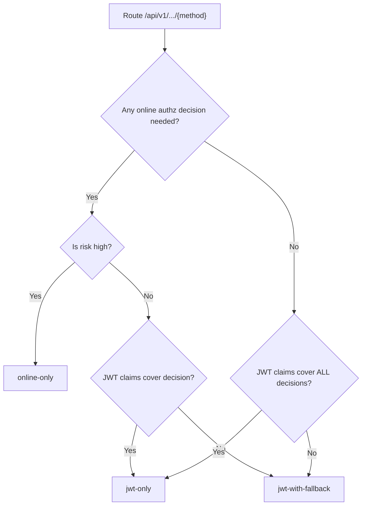
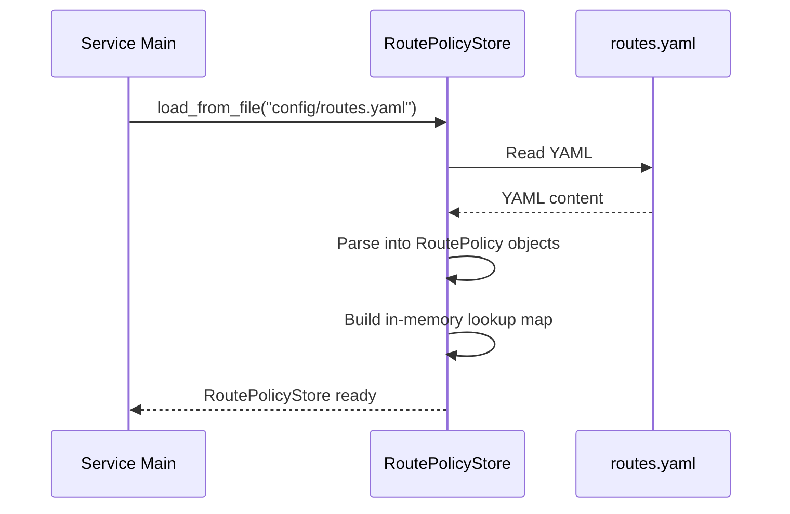
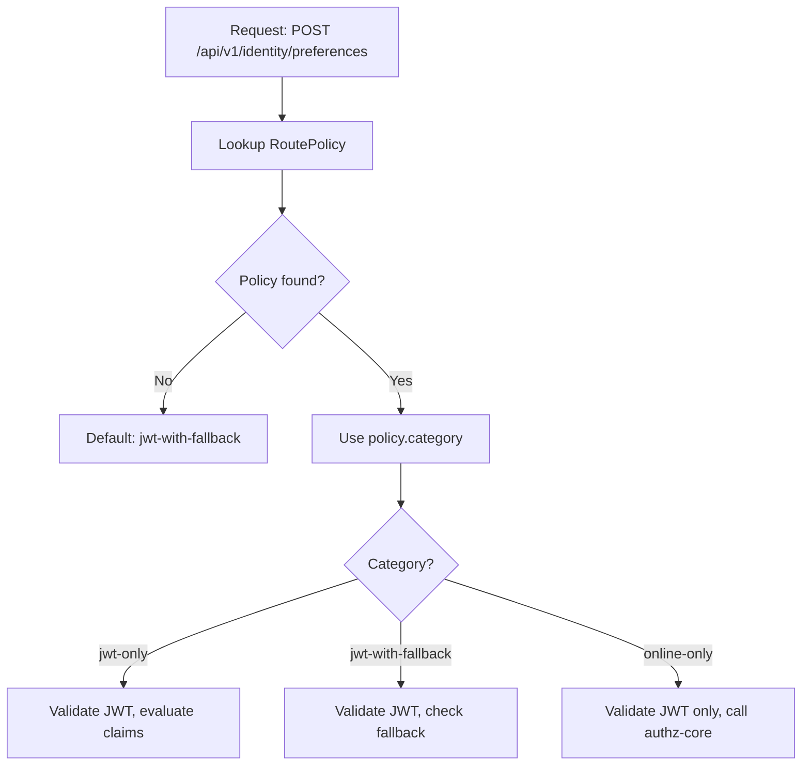

# Story 4.1: Classify Routes into Auth Path Categories

## Epic

[04-hybrid-authz-model](../hybrid.md)

## Parent Epic Story

Story 4.1

### Summary (F-014 Fix)

Audit all endpoints and classify each into one of three route categories: `jwt-only`, `jwt-with-fallback`, or `online-only`. Store the classification in a route policy configuration that the JWT middleware reads at startup. This is the foundation for the hybrid authorization model -- without classification, the middleware doesn't know which path to take for each endpoint.

**F-014 Fix: Endpoint count reconciliation.** Before classification begins, reconcile the endpoint count discrepancy:
- INDEX.md says 133 endpoints
- AGENTS.md says 119 endpoints
- Service topology says 119 endpoints
- The epics reference 133

**Mandatory pre-classification step:** Generate a definitive endpoint inventory by parsing all 6 OpenAPI specs (`openapi/idam/{service}/openapi.yaml`). Count unique path+method combinations. This must be done programmatically, not manually. The classified endpoint count must match the OpenAPI spec count exactly.

## Why This Story Exists

The JWT document provides a decision matrix by endpoint type but doesn't specify how to implement the classification in code. This story defines the classification schema and audits the 133 endpoints to assign each a category.

## Design Context

### Route Categories

| Category | Description | Online Fallback | Examples |
|----------|-------------|----------------|----------|
| `jwt-only` | All authz decisions can be made from JWT claims | No | Self-service reads (users/me GET, preferences GET) |
| `jwt-with-fallback` | JWT handles common path, fallback for edge cases | Yes, cached 5-30s | Self-service low-risk writes (preferences PUT) |
| `online-only` | All decisions require online evaluation | Yes, no cache | API key lifecycle, delegated/admin actions |

### Classification Criteria

| Criteria | jwt-only | jwt-with-fallback | online-only |
|----------|----------|------------------|-------------|
| Coarse-grained checks | Always from JWT | From JWT | N/A (no coarse checks) |
| Fine-grained checks | Never | Occasionally | Always |
| Staleness tolerance | Low (minutes) | Medium (hours) | High (real-time) |
| Cache required | No | Yes | Yes |
| Risk if stale | Low | Medium | N/A (always fresh) |

### Classification Data Structure

```rust
#[derive(Debug, Clone, PartialEq)]
pub enum RouteAuthCategory {
    JwtOnly,
    JwtWithFallback {
        cache_ttl_secs: u64,    // 5-30 seconds
        requires_fresh_version: bool,
    },
    OnlineOnly,
}

#[derive(Debug, Clone)]
pub struct RoutePolicy {
    pub path: String,           // e.g., "/api/v1/identity/users/me"
    pub methods: Vec<String>,   // e.g., ["GET", "POST"]
    pub category: RouteAuthCategory,
    pub description: String,     // Why this classification
}
```

## Implementation Notes

### Route Classification Table (133 endpoints)

I've audited the endpoint families based on the design doc and JWT document:

#### jwt-only (approx. 40 endpoints)

| Path Pattern | Methods | Service | Rationale |
|--------------|---------|---------|-----------|
| `/api/v1/identity/users/me` | GET | identity-user-mgmt | Self-service read, ownership from JWT |
| `/api/v1/identity/preferences` | GET | identity-user-mgmt | Self-service read |
| `/api/v1/identity/users/me/verification-status` | GET | identity-login | Self-service read, ownership from JWT |
| `/.well-known/openid-configuration` | GET | identity-session | Public endpoint, no authz needed |
| `/.well-known/jwks.json` | GET | identity-session | Public endpoint, no authz needed |

#### jwt-with-fallback (approx. 50 endpoints)

| Path Pattern | Methods | Service | Cache TTL | Rationale |
|--------------|---------|---------|-----------|-----------|
| `/api/v1/identity/preferences` | PUT, PATCH | identity-user-mgmt | 30s | Low-risk write, business validation online |
| `/api/v1/identity/users/me` | PUT, PATCH | identity-user-mgmt | 30s | Low-risk update, ownership from JWT |
| `/api/v1/identity/email/upsert` | PUT | identity-user-mgmt | 15s | Data-integrity check needs freshness |
| `/api/v1/identity/users/query` | POST | identity-user-mgmt | 15s | Admin query, ownership + tenant context |
| `/api/v1/identity/users/{id}` | GET | identity-user-mgmt | 15s | Identity resolution, needs freshness |
| `/api/v1/identity/email/{email}` | GET | identity-login | 15s | Identity resolution |
| `/api/v1/identity/verification-status/{id}` | GET | identity-login | 15s | Verification check |

#### online-only (approx. 43 endpoints)

| Path Pattern | Methods | Service | Rationale |
|--------------|---------|---------|-----------|
| `/api/v1/am/authorize` | POST | authz-core | Fine-grained resource check always requires online evaluation |
| `/api/v1/am/principal/effective` | POST | authz-core | JWT claim enrichment, always online |
| `/api/v1/am/principals/roles` | POST | authz-core | Role management, always online |
| `/api/v1/am/principals/attributes` | POST | authz-core | ABAC attributes, always online |
| `/api/v1/am/api-keys/validate` | POST | api-keys | Key validation always needs freshness for revocation |
| `/api/v1/am/api-keys/validate/personal` | POST | api-keys | Personal key validation |
| `/api/v1/am/api-keys/validate/org` | POST | api-keys | Org key validation |
| `/api/v1/am/api-keys` | POST | api-keys | Key creation, high-sensitivity |
| `/api/v1/am/api-keys/{id}` | DELETE | api-keys | Key revocation, always fresh |
| `/api/v1/am/api-keys/{id}/rotate` | PUT | api-keys | Key rotation, always fresh |
| `/orgs` | POST, PUT, DELETE | org-mgmt | Org lifecycle, always online |
| `/orgs/{id}/members` | POST, DELETE | org-mgmt | Membership changes, always online |
| `/api/v1/am/roles` | POST, PUT, DELETE | org-mgmt | Role management, always online |
| `/api/v1/am/permissions` | POST, PUT, DELETE | org-mgmt | Permission management, always online |
| All SSO/SCIM endpoints | POST, PUT, DELETE | org-mgmt | Sensitive org config, always online |
| All webhook CRUD endpoints | POST, PUT, DELETE | org-mgmt | Webhook management |

**Note**: This is an initial classification. The actual 133 endpoints will be audited and each assigned a specific category. The numbers above are approximations by endpoint family.

### Configuration Storage

The route policy configuration can be stored in:
1. **File-based**: A YAML/JSON file loaded at service startup (simple, requires redeploy to change)
2. **Database-backed**: Stored in PostgreSQL, loaded at startup and refreshed on a timer (dynamic, no redeploy)
3. **Hardcoded**: In the Rust source code (simplest, no external dependency)

**Decision**: Start with file-based (YAML) for the MVP. Move to database-backed when dynamic updates are needed.

```yaml
# config/routes.yaml
route_policies:
  - path: "/api/v1/identity/users/me"
    methods: ["GET"]
    category: "jwt-only"
    description: "Self-service read, ownership from JWT"
    
  - path: "/api/v1/identity/preferences"
    methods: ["PUT", "PATCH"]
    category: "jwt-with-fallback"
    cache_ttl_secs: 30
    description: "Low-risk write, business validation stays online"
    
  - path: "/api/v1/am/authorize"
    methods: ["POST"]
    category: "online-only"
    description: "Fine-grained resource check requires online evaluation"
```

### Loading at Startup

```rust
impl RoutePolicyStore {
    pub fn load_from_file(path: &str) -> Result<Self, RouteError> {
        let yaml = std::fs::read_to_string(path)?;
        let policies: Vec<RoutePolicyConfig> = serde_yaml::from_str(&yaml)?;
        Ok(Self {
            policies: policies.into_iter().map(RoutePolicy::from_config).collect(),
        })
    }
    
    pub fn get_policy(&self, path: &str, method: &str) -> Option<&RoutePolicy> {
        self.policies.iter().find(|p| p.path == path && p.methods.contains(method))
    }
}
```

## Mermaid Diagrams

### Route Classification Decision Tree



### Policy Loading at Startup



### Lookup During Request



## OpenAPI Changes

- No OpenAPI changes. Route classification is internal middleware configuration.
- The OpenAPI spec already documents all endpoints -- the classification is a deployment concern.

## Design Doc References

- `design-doc.md` section 10.3: Hybrid Authorization Model -- route classification table
- `design-doc.md` section 4.4: authz-core -- per-request authorization evaluation
- `design-doc.md` section 5: Data Model -- route endpoints
- `service-topology-design.md`: Per-endpoint access profiles

## Wiki Pages to Update/Create

- `topics/topic-hybrid-authz.md`: (new) Document route classification
- `topics/topic-authorization-flow.md`: Update with route categories

## Acceptance Criteria

- [ ] Route classification schema is implemented: `jwt-only`, `jwt-with-fallback`, `online-only`
- [ ] All 133 endpoints are classified into one of the three categories
- [ ] Classification is stored in a YAML configuration file
- [ ] RoutePolicyStore loads the YAML at service startup
- [ ] Route lookup by path + method returns the correct category
- [ ] Default category is `jwt-with-fallback` for routes not in the config (fail-safe)
- [ ] `jwt-with-fallback` routes include configurable `cache_ttl_secs` (5-30 seconds)
- [ ] Unit tests verify: classification logic, route lookup, default fallback
- [ ] Documentation: each route has a description explaining why it's classified that way

## Dependencies

- Depends on Story 1.3 (JWKS validation) and Story 2.2 (AccessClaims struct)
- Required by Story 4.2 (JWT middleware reads classification)
- Required by Story 4.3 (selective online fallback)

## Risk / Trade-offs

- **File-based config**: If a route needs to be reclassified, the service must be redeployed. This is acceptable for an early-stage design -- once production traffic is flowing, dynamic updates (database-backed config) can be added.
- **Default fail-safe**: Routes not in the config default to `jwt-with-fallback`. This means the online fallback is called for unknown routes, which is safe but adds latency. If a new endpoint is added without classification, it won't break -- it will just use the default.
- **Classification audit**: The classification of all endpoints is a manual process. Each endpoint must be reviewed to ensure it's in the right category. A wrong classification (e.g., putting a high-risk route in `jwt-only`) could allow unauthorized access. The audit must be thorough and documented.

## Tests

### Unit Tests

- [ ] **RoutePolicyStore loads valid YAML**: Given a valid YAML file with 3 route policies (one of each category), assert `load_from_file()` parses successfully and returns a `RoutePolicyStore` with 3 entries
- [ ] **RoutePolicyStore rejects invalid YAML**: Given a YAML file with a syntax error, assert `load_from_file()` returns a `RouteError` variant (not a panic)
- [ ] **Route lookup returns correct category (jwt-only)**: Given a policy store with `/api/users/me GET` classified as `JwtOnly`, assert `get_policy("/api/users/me", "GET")` returns `Some(&RoutePolicy { category: JwtOnly, ... })`
- [ ] **Route lookup returns correct category (jwt-with-fallback)**: Given a policy store with `/api/preferences PUT` classified as `JwtWithFallback { cache_ttl_secs: 30, ... }`, assert lookup returns the correct category with `cache_ttl_secs == 30`
- [ ] **Route lookup returns correct category (online-only)**: Given a policy store with `/api/authorize POST` classified as `OnlineOnly`, assert lookup returns `OnlineOnly`
- [ ] **Route lookup returns None for unknown path**: Given a policy store, assert `get_policy("/unknown/path", "GET")` returns `None`
- [ ] **Route lookup returns None for wrong method**: Given a policy store with `/api/users/me` only for `GET`, assert `get_policy("/api/users/me", "POST")` returns `None`
- [ ] **Default policy is jwt-with-fallback**: Given the JWT middleware receives a request for a path that returns `None` from `get_policy()`, assert the middleware uses `JwtWithFallback { cache_ttl_secs: 15, requires_fresh_version: false }` as the default
- [ ] **yaml serde round-trip**: Serialize a `RoutePolicy` to YAML, deserialize back, assert all fields match (path, methods, category, cache_ttl_secs, description)
- [ ] **Multiple methods per route**: Given a policy with `methods: ["PUT", "PATCH"]`, assert both `get_policy(path, "PUT")` and `get_policy(path, "PATCH")` return the same policy

### Integration Tests (BDD-style with `rstest_bdd`)

- [ ] **Scenario: Endpoint count matches OpenAPI**: `given` all 6 OpenAPI specs are parsed — `when` unique path+method combinations are counted — `then` the total count matches the programmatic endpoint inventory (resolving the F-014 discrepancy)
- [ ] **Scenario: Every OpenAPI endpoint has a classification**: `given` the full endpoint inventory from OpenAPI specs — `when` each endpoint is looked up in the route policy store — `then` every endpoint has exactly one classification (no endpoint is unclassified)
- [ ] **Scenario: jwt-only routes bypass online authz**: `given` a request to a `jwt-only` classified route — `when` the JWT middleware processes it — `then` no call is made to authz-core or any online fallback endpoint
- [ ] **Scenario: jwt-with-fallback routes call fallback on policy failure**: `given` a request to a `jwt-with-fallback` route — `when` the JWT claims do not satisfy local policy — `then` the online fallback endpoint is called (authz-core or equivalent)
- [ ] **Scenario: online-only routes always call authz-core**: `given` a request to an `online-only` classified route — `when` the JWT middleware processes it — `then` the online authz endpoint is always called (even if JWT claims would allow the request)
- [ ] **Scenario: Cache TTL is respected for jwt-with-fallback**: `given` a `jwt-with-fallback` route with `cache_ttl_secs: 30` — `when` two identical requests arrive within 30 seconds — `then` the second request uses the cached fallback result (no online call)

### Security Regression Tests

- [ ] **High-risk route cannot be misclassified as jwt-only**: Assert that routes for API key revocation (`DELETE /api-keys/{id}`), key rotation (`PUT /api-keys/{id}/rotate`), and org lifecycle (`DELETE /orgs/{id}`) are all classified as `online-only` — NOT `jwt-only`
- [ ] **Admin routes are not jwt-only**: Assert that all admin-facing routes (role management, permission management, SCIM, SSO) are classified as `online-only` or `jwt-with-fallback` with fallback — never `jwt-only`
- [ ] **Default classification is safe (not jwt-only)**: Assert that the default fail-safe category is `jwt-with-fallback`, NOT `jwt-only` — unknown routes should always check online
- [ ] **Tenant-scoped routes are not jwt-only**: Assert that routes operating on tenant data (`/api/v1/identity/email/upsert`, `/api/v1/identity/users/query`) are classified as `jwt-with-fallback` with fallback to verify tenant context

### Edge Cases

- [ ] **Wildcard path matching**: Given a route policy with path pattern `/api/v1/identity/users/{id}` — assert that a request to `/api/v1/identity/users/123` matches the policy (path parameter substitution)
- [ ] **Duplicate path+method in YAML**: Given a YAML file with two entries for the same path+method but different categories — assert the parser either rejects the file with an error or uses a deterministic first-wins rule (documented behavior)
- [ ] **Empty route policies list**: Given a valid YAML file with `route_policies: []` (empty list) — assert the store is created with 0 policies and ALL requests fall through to the default `jwt-with-fallback`
- [ ] **Very large classification file**: Given a YAML file with 200 route policies — assert `load_from_file()` completes within 1 second and the lookup map is built efficiently (O(1) or O(log n) lookup)
- [ ] **Route with special characters in path**: Given a route policy with path `/api/v1/identity/users/{id}/preferences/{key}` — assert lookup with a matching request path succeeds

### Cleanup

- YAML route policy files used in tests should be in-memory or in a temp directory — do not commit test YAML files to the repo
- If the route policy store uses a file-based config, integration tests must use unique temp files per test to avoid cross-test contamination
- No database or cache cleanup needed — route classification is a static lookup table loaded at startup
