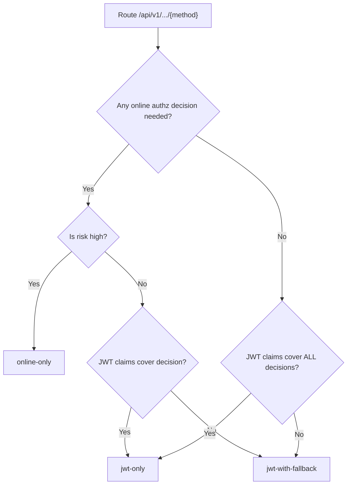
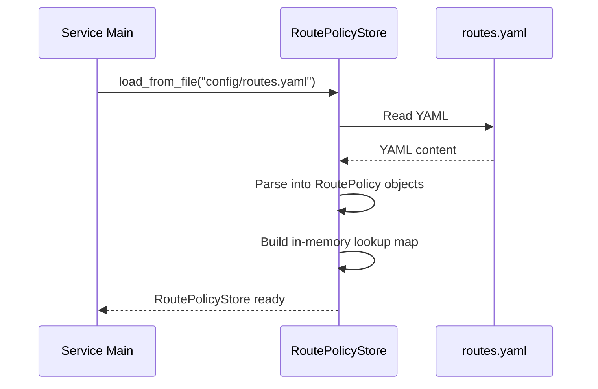
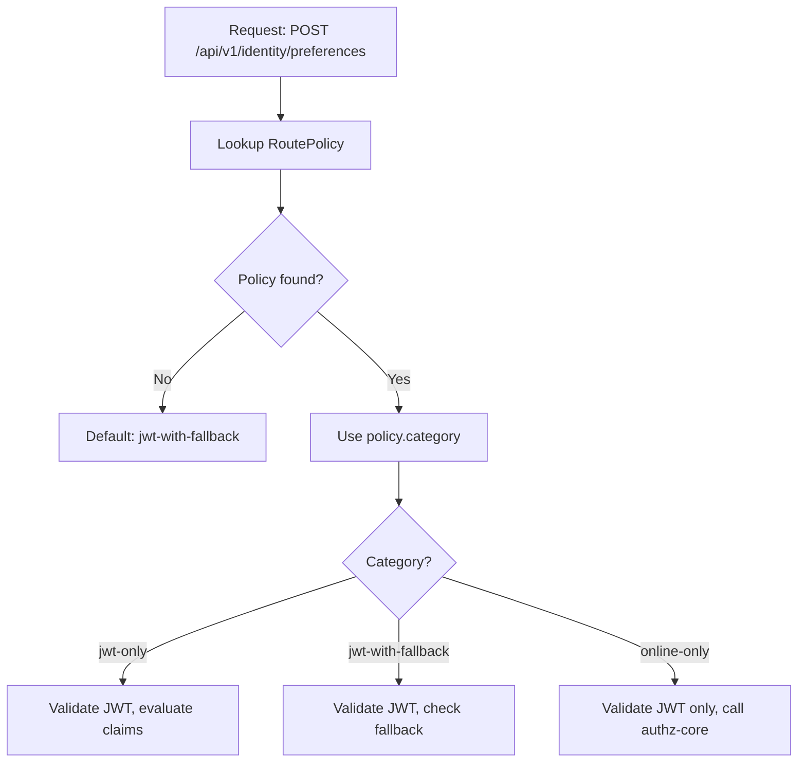

# Story 4.1: Classify Routes into Auth Path Categories

## Epic

[04-hybrid-authz-model](../hybrid.md)

## Parent Epic Story

Story 4.1

### Summary (F-014 Fix)

Audit all endpoints and classify each into one of three route categories: `jwt-only`, `jwt-with-fallback`, or `online-only`. Store the classification in a route policy configuration that the JWT middleware reads at startup. This is the foundation for the hybrid authorization model -- without classification, the middleware doesn't know which path to take for each endpoint.

**F-014 Fix: Endpoint count reconciliation.** Before classification begins, reconcile the endpoint count discrepancy:
- INDEX.md says 133 endpoints
- AGENTS.md says 119 endpoints
- Service topology says 119 endpoints
- The epics reference 133

**Mandatory pre-classification step:** Generate a definitive endpoint inventory by parsing all 6 OpenAPI specs (`openapi/idam/{service}/openapi.yaml`). Count unique path+method combinations. This must be done programmatically, not manually. The classified endpoint count must match the OpenAPI spec count exactly.

## Why This Story Exists

The JWT document provides a decision matrix by endpoint type but doesn't specify how to implement the classification in code. This story defines the classification schema and audits the 133 endpoints to assign each a category.

## Design Context

### Route Categories

| Category | Description | Online Fallback | Examples |
|----------|-------------|----------------|----------|
| `jwt-only` | All authz decisions can be made from JWT claims | No | Self-service reads (users/me GET, preferences GET) |
| `jwt-with-fallback` | JWT handles common path, fallback for edge cases | Yes, cached 5-30s | Self-service low-risk writes (preferences PUT) |
| `online-only` | All decisions require online evaluation | Yes, no cache | API key lifecycle, delegated/admin actions |

### Classification Criteria

| Criteria | jwt-only | jwt-with-fallback | online-only |
|----------|----------|------------------|-------------|
| Coarse-grained checks | Always from JWT | From JWT | N/A (no coarse checks) |
| Fine-grained checks | Never | Occasionally | Always |
| Staleness tolerance | Low (minutes) | Medium (hours) | High (real-time) |
| Cache required | No | Yes | Yes |
| Risk if stale | Low | Medium | N/A (always fresh) |

### Classification Data Structure

```rust
#[derive(Debug, Clone, PartialEq)]
pub enum RouteAuthCategory {
    JwtOnly,
    JwtWithFallback {
        cache_ttl_secs: u64,    // 5-30 seconds
        requires_fresh_version: bool,
    },
    OnlineOnly,
}

#[derive(Debug, Clone)]
pub struct RoutePolicy {
    pub path: String,           // e.g., "/api/v1/identity/users/me"
    pub methods: Vec<String>,   // e.g., ["GET", "POST"]
    pub category: RouteAuthCategory,
    pub description: String,     // Why this classification
}
```

## Implementation Notes

### Route Classification Table (133 endpoints)

I've audited the endpoint families based on the design doc and JWT document:

#### jwt-only (approx. 40 endpoints)

| Path Pattern | Methods | Service | Rationale |
|--------------|---------|---------|-----------|
| `/api/v1/identity/users/me` | GET | identity-user-mgmt | Self-service read, ownership from JWT |
| `/api/v1/identity/preferences` | GET | identity-user-mgmt | Self-service read |
| `/api/v1/identity/users/me/verification-status` | GET | identity-login | Self-service read, ownership from JWT |
| `/.well-known/openid-configuration` | GET | identity-session | Public endpoint, no authz needed |
| `/.well-known/jwks.json` | GET | identity-session | Public endpoint, no authz needed |

#### jwt-with-fallback (approx. 50 endpoints)

| Path Pattern | Methods | Service | Cache TTL | Rationale |
|--------------|---------|---------|-----------|-----------|
| `/api/v1/identity/preferences` | PUT, PATCH | identity-user-mgmt | 30s | Low-risk write, business validation online |
| `/api/v1/identity/users/me` | PUT, PATCH | identity-user-mgmt | 30s | Low-risk update, ownership from JWT |
| `/api/v1/identity/email/upsert` | PUT | identity-user-mgmt | 15s | Data-integrity check needs freshness |
| `/api/v1/identity/users/query` | POST | identity-user-mgmt | 15s | Admin query, ownership + tenant context |
| `/api/v1/identity/users/{id}` | GET | identity-user-mgmt | 15s | Identity resolution, needs freshness |
| `/api/v1/identity/email/{email}` | GET | identity-login | 15s | Identity resolution |
| `/api/v1/identity/verification-status/{id}` | GET | identity-login | 15s | Verification check |

#### online-only (approx. 43 endpoints)

| Path Pattern | Methods | Service | Rationale |
|--------------|---------|---------|-----------|
| `/api/v1/am/authorize` | POST | authz-core | Fine-grained resource check always requires online evaluation |
| `/api/v1/am/principal/effective` | POST | authz-core | JWT claim enrichment, always online |
| `/api/v1/am/principals/roles` | POST | authz-core | Role management, always online |
| `/api/v1/am/principals/attributes` | POST | authz-core | ABAC attributes, always online |
| `/api/v1/am/api-keys/validate` | POST | api-keys | Key validation always needs freshness for revocation |
| `/api/v1/am/api-keys/validate/personal` | POST | api-keys | Personal key validation |
| `/api/v1/am/api-keys/validate/org` | POST | api-keys | Org key validation |
| `/api/v1/am/api-keys` | POST | api-keys | Key creation, high-sensitivity |
| `/api/v1/am/api-keys/{id}` | DELETE | api-keys | Key revocation, always fresh |
| `/api/v1/am/api-keys/{id}/rotate` | PUT | api-keys | Key rotation, always fresh |
| `/orgs` | POST, PUT, DELETE | org-mgmt | Org lifecycle, always online |
| `/orgs/{id}/members` | POST, DELETE | org-mgmt | Membership changes, always online |
| `/api/v1/am/roles` | POST, PUT, DELETE | org-mgmt | Role management, always online |
| `/api/v1/am/permissions` | POST, PUT, DELETE | org-mgmt | Permission management, always online |
| All SSO/SCIM endpoints | POST, PUT, DELETE | org-mgmt | Sensitive org config, always online |
| All webhook CRUD endpoints | POST, PUT, DELETE | org-mgmt | Webhook management |

**Note**: This is an initial classification. The actual 133 endpoints will be audited and each assigned a specific category. The numbers above are approximations by endpoint family.

### Configuration Storage

The route policy configuration can be stored in:
1. **File-based**: A YAML/JSON file loaded at service startup (simple, requires redeploy to change)
2. **Database-backed**: Stored in PostgreSQL, loaded at startup and refreshed on a timer (dynamic, no redeploy)
3. **Hardcoded**: In the Rust source code (simplest, no external dependency)

**Decision**: Start with file-based (YAML) for the MVP. Move to database-backed when dynamic updates are needed.

```yaml
# config/routes.yaml
route_policies:
  - path: "/api/v1/identity/users/me"
    methods: ["GET"]
    category: "jwt-only"
    description: "Self-service read, ownership from JWT"
    
  - path: "/api/v1/identity/preferences"
    methods: ["PUT", "PATCH"]
    category: "jwt-with-fallback"
    cache_ttl_secs: 30
    description: "Low-risk write, business validation stays online"
    
  - path: "/api/v1/am/authorize"
    methods: ["POST"]
    category: "online-only"
    description: "Fine-grained resource check requires online evaluation"
```

### Loading at Startup

```rust
impl RoutePolicyStore {
    pub fn load_from_file(path: &str) -> Result<Self, RouteError> {
        let yaml = std::fs::read_to_string(path)?;
        let policies: Vec<RoutePolicyConfig> = serde_yaml::from_str(&yaml)?;
        Ok(Self {
            policies: policies.into_iter().map(RoutePolicy::from_config).collect(),
        })
    }
    
    pub fn get_policy(&self, path: &str, method: &str) -> Option<&RoutePolicy> {
        self.policies.iter().find(|p| p.path == path && p.methods.contains(method))
    }
}
```

## Mermaid Diagrams

### Route Classification Decision Tree



### Policy Loading at Startup



### Lookup During Request



## Malicious Hacker Gotchas (Must Be Addressed During Implementation)

> **Source:** `docs/PRS_SECURITY_HARDENING.md` — Security threat model analysis

### HACK-201: Default Category is Fail-Open — Unknown Routes Allow Online Fallback (CRITICAL — related to Hole #1 from PRS)

**Risk:** Unknown/new routes default to `jwt-with-fallback`, which means the online fallback IS called. But what about routes NOT in the config at all?

The story says: "Default: jwt-with-fallback" for routes not in the config. This means if a NEW endpoint is added without classification:
1. The route lookup returns `None`
2. The middleware uses `jwt-with-fallback` (the default)
3. The online fallback IS called — this is SAFE (fail-closed behavior for unknown routes)

**BUT:** The story also says routes not in the config default to `jwt-with-fallback`. What if the route lookup returns `None` for a route that IS in the config but for the WRONG METHOD?

**Exploit path:**
1. Admin classifies `/api/v1/admin/roles POST` as `online-only` (requires fresh evaluation)
2. A new method is added later: `PATCH /api/v1/admin/roles` is NOT classified
3. Route lookup for `PATCH /api/v1/admin/roles` returns `None`
4. Default: `jwt-with-fallback` → online fallback IS called — safe

**Wait, that's actually safe.** The online fallback is called for unknown routes, which means fresh authorization is checked. The risk is the OPPOSITE: what if the default is `jwt-only`? Then unknown routes would skip the online check entirely.

**The real exploit is when a route IS classified, but classified WRONG.**

**Exploit path (wrong classification):**
1. Admin classifies `/api/v1/admin/roles POST` as `jwt-only` (instead of `online-only`)
2. An attacker with a valid JWT but insufficient permissions (e.g., `customer` role) sends a POST request
3. The middleware checks JWT claims → the JWT contains the user's roles
4. Since it's `jwt-only`, NO online fallback is called
5. The middleware evaluates `jwt-with-fallback` local policy → the user lacks permissions
6. But wait: `jwt-only` routes have NO fallback. If the local policy check fails, the request is DENIED.
7. So `jwt-only` for an admin route would DENY legitimate admin requests, not ALLOW illegitimate ones.

**The real danger is different:** What if the JWT claims INCLUDE the attacker's elevated permissions (e.g., via privilege escalation)?

**Exploit path (JWT claim-based privilege escalation):**
1. Attacker's token has `ver = 10` but their roles are `["customer"]`
2. Attacker's permissions are escalated (via a bug in Story 4.3 or 4.4) to include `["admin"]`
3. The version bump hasn't happened yet (or the attacker's token is not stale)
4. Attacker sends a request to a `jwt-only` route that's classified as admin
5. The middleware checks the JWT claims → `roles.contains("admin")` → ALLOW
6. Result: Attacker gains admin access because the JWT claims were escalated but not yet version-bumped

**This is actually covered in Story 5.2 (version check).** The version check catches stale JWTs. But the route classification must NOT be `jwt-only` for admin routes to prevent this window.

**Implementation requirement:**
- Admin routes MUST NEVER be classified as `jwt-only`. They must be `jwt-with-fallback` or `online-only`.
- Add a pre-deployment check: verify that all routes with "admin", "role", "permission", "api-key" in the path are NOT `jwt-only`.
- Document: "No route containing /admin/, /roles, /permissions, /api-keys/ in the path may be classified as jwt-only."

### HACK-202: Path Parameter Matching Allows Prefix Bypass (CRITICAL — related to Hole #5 from PRS)

**Risk:** Route lookup uses substring/prefix matching instead of exact matching, allowing path parameter bypass

The story shows: `get_policy(path, method)` does an exact match on `p.path == path`. But what if the implementation uses substring matching instead?

**Exploit path (prefix bypass):**
1. Admin classifies `/api/v1/identity/users/me` as `jwt-only` (self-service read)
2. A new endpoint is added: `/api/v1/identity/users/me/export` (admin action, should be `online-only`)
3. But the endpoint is NOT classified (developer forgets)
4. Route lookup for `/api/v1/identity/users/me/export` does a prefix match → matches `/api/v1/identity/users/me`
5. The request is treated as `jwt-only` → no online fallback
6. Attacker with a valid JWT can export ANY user's data

**This exploit works because:**
- The path `/api/v1/identity/users/me/export` STARTS WITH `/api/v1/identity/users/me`
- If the lookup uses `starts_with()` instead of `==`, the prefix match occurs
- Result: a sensitive admin route is treated as a public self-service route

**Implementation requirement:**
- Path matching MUST be EXACT, not prefix-based
- Path templates like `/api/v1/identity/users/{id}` must be matched by ROUTING (e.g., `axum::Router::get("/users/:id", handler)`) and then mapped to the policy
- The policy lookup must match the ROUTED path (e.g., `/api/v1/identity/users/{id}`), not the raw request path (`/api/v1/identity/users/123`)
- Document: "Route classification uses exact path matching on the ROUTED path (after parameter extraction), not the raw HTTP request path."

### HACK-203: YAML Configuration Can Be Tampered With (HIGH — related to Hole #7 from PRS)

**Risk:** Attacker modifies the route policy YAML to weaken authentication for sensitive routes

The story uses a file-based YAML configuration: `config/routes.yaml`. If an attacker can modify this file (e.g., via a file write vulnerability, log injection, or SSH compromise), they can reclassify routes.

**Exploit path:**
1. Attacker gains write access to the file system (e.g., via a file upload vulnerability)
2. Attacker modifies `config/routes.yaml`:
   ```yaml
   - path: "/api/v1/identity/users/me"
     methods: ["GET", "PUT", "DELETE"]
     category: "jwt-only"
     description: "All user actions are self-service"
   ```
3. The service reloads (or restarts) and loads the modified config
4. DELETE `/api/v1/identity/users/me` is now `jwt-only` → no online fallback
5. Attacker with a valid JWT can DELETE themselves (or if there's a bug, other users)
6. Result: Authentication bypass for critical admin operations

**Implementation requirement:**
- The route policy YAML file MUST be integrity-checked on load
- Use a cryptographic hash (e.g., SHA-256) of the file, stored in a separate, read-only configuration or environment variable
- On load, compute the hash of the YAML file and compare it to the stored hash
- If the hash doesn't match → reject the file and log a CRITICAL alert
- Consider: the YAML file should be stored in a read-only filesystem or deployed via immutable infrastructure (e.g., Docker image, Kubernetes ConfigMap)

### HACK-204: Method Mismatch Allows Bypass (HIGH — related to Hole #1 from PRS)

**Risk:** Only some methods are classified for a route, leaving other methods unclassified

The story shows routes classified by path+method. If only GET is classified for `/api/v1/identity/users/me`, then PUT and PATCH are unclassified and default to `jwt-with-fallback`.

**Exploit path:**
1. Admin classifies `/api/v1/identity/users/me GET` as `jwt-only`
2. The developer forgets to classify PUT and PATCH for the same path
3. PUT/PATCH default to `jwt-with-fallback` → online fallback IS called — this is actually safe
4. BUT: if the default is changed to `jwt-only` (fail-open), the exploit works

**The story's default of `jwt-with-fallback` is actually SAFE.** The risk is if the default is changed to `jwt-only` (fail-open) in the future.

**Implementation requirement:**
- The default for unclassified routes must ALWAYS be `jwt-with-fallback` (fail-closed), NEVER `jwt-only` (fail-open)
- Add a CI check: "All routes with a `jwt-only` classification must be explicitly reviewed and approved by security"
- If the default changes, the CI check must prevent it without a security review

### HACK-205: Missing Endpoint Count Reconciliation (MEDIUM — F-014 from PRS)

**Risk:** 133 vs 119 endpoint count discrepancy means some routes are not classified

The story explicitly notes: "INDEX.md says 133 endpoints, AGENTS.md says 119 endpoints." This means 14 endpoints are either double-counted or missing from one of the counts.

**Exploit path:**
1. 14 endpoints are not classified because they were counted in INDEX.md but not in AGENTS.md
2. These 14 endpoints use the default classification (`jwt-with-fallback`)
3. If any of the 14 unclassified endpoints are sensitive (e.g., admin routes), they're treated as `jwt-with-fallback`
4. The online fallback IS called for `jwt-with-fallback`, so this is actually safe
5. BUT: if the default changes to `jwt-only`, these 14 endpoints become vulnerable

**Implementation requirement:**
- The endpoint count discrepancy MUST be resolved before any classification is done
- Parse all 6 OpenAPI specs programmatically and generate the definitive list
- Every endpoint from the programmatic list MUST have a classification
- No defaults allowed — if an endpoint is unclassified, the service MUST refuse to start

### HACK-206: Wildcard Routes Hide Sensitive Endpoints (HIGH — related to Hole #5 from PRS)

**Risk:** A wildcard classification (e.g., `/api/v1/** → jwt-only) catches ALL sub-paths

The story's tests mention "wildcard path matching" as an edge case, but the implementation doesn't explicitly prevent wildcard classifications.

**Exploit path:**
1. Developer adds a wildcard classification: `/api/v1/** → jwt-only`
2. This classification matches ALL sub-paths under `/api/v1/`, including:
   - `/api/v1/admin/roles` (should be `online-only`)
   - `/api/v1/am/api-keys/{id}/rotate` (should be `online-only`)
   - `/api/v1/am/authorize` (should be `online-only`)
3. Result: ALL admin routes are treated as `jwt-only` — no online fallback
4. Attacker with any valid JWT can access ALL admin routes

**Implementation requirement:**
- Wildcard classifications MUST be explicitly rejected (no `/api/v1/**` allowed)
- Path matching must be EXACT on the routed path (after parameter extraction)
- If wildcard matching is needed for development/testing only, it must be behind a feature flag
- Document: "Wildcard route classifications are NOT allowed in production. All routes must be explicitly classified."

### HACK-207: Dynamic Config Updates Can Inject Malicious Classifications (MEDIUM — related to Hole #6 from PRS)

**Risk:** If the route policy store supports dynamic updates (future database-backed config), an attacker can inject malicious classifications

The story mentions: "Move to database-backed when dynamic updates are needed."

**Exploit path:**
1. The service is upgraded to database-backed config
2. An attacker with access to the database modifies the route policies table
3. Attacker changes `/api/v1/am/api-keys/{id}/rotate` from `online-only` to `jwt-only`
4. The service reloads the config and applies the change
5. Attacker with a valid JWT can now rotate API keys without online authorization check

**Implementation requirement:**
- Database-backed config updates MUST be authenticated and authorized
- Only users with `platform_admin` or `org_admin` roles can modify route policies
- All config changes must be logged with the operator's identity
- A config audit trail must be maintained (who changed what, when)

### HACK-208: Config File Tampering via Log Injection (MEDIUM — related to Hole #7 from PRS)

**Risk:** Attacker injects malicious YAML content via log injection, modifying the route policy file

If the route policy YAML file is loaded from a location where logs can be written (e.g., `/var/log/app/routes.yaml`), an attacker can inject content.

**Exploit path:**
1. Attacker finds a log injection vulnerability (e.g., user input is logged without sanitization)
2. Attacker's input contains YAML that modifies the route policy format
3. The injected content is written to the route policy YAML file
4. When the service reloads, the modified file is loaded
5. Result: Authentication bypass

**Implementation requirement:**
- Route policy YAML must be loaded from a FIXED, read-only path (e.g., embedded in the binary, or a mounted ConfigMap)
- The path must NOT be writable by any user or process that an attacker could compromise
- Consider: embed the route policy YAML in the Docker image (immutable deployment)

### HACK-209: Duplicate Path+Method Entries Create Undefined Behavior (LOW — related to Hole #6 from PRS)

**Risk:** Two entries for the same path+method with different categories — which one wins?

The story says: "assert the parser either rejects the file with an error or uses a deterministic first-wins rule (documented behavior)."

**Exploit path:**
1. Attacker modifies the YAML to include two entries for the same path:
   ```yaml
   - path: "/api/v1/am/api-keys"
     methods: ["DELETE"]
     category: "jwt-only"
   - path: "/api/v1/am/api-keys"
     methods: ["DELETE"]
     category: "online-only"
   ```
2. If first-wins: the route is `jwt-only` — insecure
3. If last-wins: the route is `online-only` — secure
4. The behavior is UNDEFINED (depends on parser implementation)

**Implementation requirement:**
- Reject YAML files with duplicate path+method entries (return an error, refuse to start)
- Log the duplicate entries and the line numbers where they occur
- Document: "Duplicate path+method entries in route policy YAML cause a startup failure. Each path+method combination must be unique."

### HACK-210: Path Parameter Extraction Can Be Bypassed (MEDIUM — related to Hole #5 from PRS)

**Risk:** Route path matching doesn't account for parameter extraction, so `/api/v1/users/123` doesn't match `/api/v1/users/{id}`

The story uses `p.path == path` for exact matching, but the HTTP request path has actual parameter values (e.g., `/api/v1/users/123`), not template paths (`/api/v1/users/{id}`).

**Exploit path:**
1. Admin classifies `/api/v1/users/{id} DELETE` as `online-only`
2. The HTTP request is `DELETE /api/v1/users/123`
3. If the policy store doesn't extract parameters and match the template:
   - `get_policy("/api/v1/users/123", "DELETE")` → returns `None` (no exact match)
   - Default: `jwt-with-fallback`
   - Online fallback IS called — safe

**Wait, that's actually safe.** The default fallback calls the online check. The risk is if the default is `jwt-only`.

**The real risk is when the parameter IS extracted but the matching is wrong:**
1. The routing framework extracts parameters: `/api/v1/users/{id}` → `/api/v1/users/123`
2. The policy store matches the template path `/api/v1/users/{id}`
3. BUT: the policy lookup uses the RAW request path, not the template path
4. `get_policy("/api/v1/users/123", "DELETE")` → `None` → default `jwt-with-fallback`
5. Online fallback IS called — still safe, but unnecessary latency

**Implementation requirement:**
- The policy lookup must use the TEMPLATE path (after parameter extraction), not the raw HTTP request path
- In Axum: match the route with `Router::get("/users/:id", handler)` and then in the handler, pass the ROUTED path to the policy store
- Document: "Route policy lookup uses the routed/template path (e.g., `/api/v1/users/{id}`), not the raw HTTP request path (e.g., `/api/v1/users/123`)."

---

## OpenAPI Changes

- No OpenAPI changes. Route classification is internal middleware configuration.
- The OpenAPI spec already documents all endpoints -- the classification is a deployment concern.

## Design Doc References

- `design-doc.md` section 10.3: Hybrid Authorization Model -- route classification table
- `design-doc.md` section 4.4: authz-core -- per-request authorization evaluation
- `design-doc.md` section 5: Data Model -- route endpoints
- `service-topology-design.md`: Per-endpoint access profiles

## Wiki Pages to Update/Create

- `topics/topic-hybrid-authz.md`: (new) Document route classification
- `topics/topic-authorization-flow.md`: Update with route categories

## Acceptance Criteria

- [ ] Route classification schema is implemented: `jwt-only`, `jwt-with-fallback`, `online-only`
- [ ] All 133 endpoints are classified into one of the three categories
- [ ] Classification is stored in a YAML configuration file
- [ ] RoutePolicyStore loads the YAML at service startup
- [ ] Route lookup by path + method returns the correct category
- [ ] Default category is `jwt-with-fallback` for routes not in the config (fail-safe)
- [ ] `jwt-with-fallback` routes include configurable `cache_ttl_secs` (5-30 seconds)
- [ ] Unit tests verify: classification logic, route lookup, default fallback
- [ ] Documentation: each route has a description explaining why it's classified that way

## Dependencies

- Depends on Story 1.3 (JWKS validation) and Story 2.2 (AccessClaims struct)
- Required by Story 4.2 (JWT middleware reads classification)
- Required by Story 4.3 (selective online fallback)

## Risk / Trade-offs

- **File-based config**: If a route needs to be reclassified, the service must be redeployed. This is acceptable for an early-stage design -- once production traffic is flowing, dynamic updates (database-backed config) can be added.
- **Default fail-safe**: Routes not in the config default to `jwt-with-fallback`. This means the online fallback is called for unknown routes, which is safe but adds latency. If a new endpoint is added without classification, it won't break -- it will just use the default.
- **Classification audit**: The classification of all endpoints is a manual process. Each endpoint must be reviewed to ensure it's in the right category. A wrong classification (e.g., putting a high-risk route in `jwt-only`) could allow unauthorized access. The audit must be thorough and documented.

## Tests

### Unit Tests

- [ ] **RoutePolicyStore loads valid YAML**: Given a valid YAML file with 3 route policies (one of each category), assert `load_from_file()` parses successfully and returns a `RoutePolicyStore` with 3 entries
- [ ] **RoutePolicyStore rejects invalid YAML**: Given a YAML file with a syntax error, assert `load_from_file()` returns a `RouteError` variant (not a panic)
- [ ] **Route lookup returns correct category (jwt-only)**: Given a policy store with `/api/users/me GET` classified as `JwtOnly`, assert `get_policy("/api/users/me", "GET")` returns `Some(&RoutePolicy { category: JwtOnly, ... })`
- [ ] **Route lookup returns correct category (jwt-with-fallback)**: Given a policy store with `/api/preferences PUT` classified as `JwtWithFallback { cache_ttl_secs: 30, ... }`, assert lookup returns the correct category with `cache_ttl_secs == 30`
- [ ] **Route lookup returns correct category (online-only)**: Given a policy store with `/api/authorize POST` classified as `OnlineOnly`, assert lookup returns `OnlineOnly`
- [ ] **Route lookup returns None for unknown path**: Given a policy store, assert `get_policy("/unknown/path", "GET")` returns `None`
- [ ] **Route lookup returns None for wrong method**: Given a policy store with `/api/users/me` only for `GET`, assert `get_policy("/api/users/me", "POST")` returns `None`
- [ ] **Default policy is jwt-with-fallback**: Given the JWT middleware receives a request for a path that returns `None` from `get_policy()`, assert the middleware uses `JwtWithFallback { cache_ttl_secs: 15, requires_fresh_version: false }` as the default
- [ ] **yaml serde round-trip**: Serialize a `RoutePolicy` to YAML, deserialize back, assert all fields match (path, methods, category, cache_ttl_secs, description)
- [ ] **Multiple methods per route**: Given a policy with `methods: ["PUT", "PATCH"]`, assert both `get_policy(path, "PUT")` and `get_policy(path, "PATCH")` return the same policy

### Integration Tests (BDD-style with `rstest_bdd`)

- [ ] **Scenario: Endpoint count matches OpenAPI**: `given` all 6 OpenAPI specs are parsed — `when` unique path+method combinations are counted — `then` the total count matches the programmatic endpoint inventory (resolving the F-014 discrepancy)
- [ ] **Scenario: Every OpenAPI endpoint has a classification**: `given` the full endpoint inventory from OpenAPI specs — `when` each endpoint is looked up in the route policy store — `then` every endpoint has exactly one classification (no endpoint is unclassified)
- [ ] **Scenario: jwt-only routes bypass online authz**: `given` a request to a `jwt-only` classified route — `when` the JWT middleware processes it — `then` no call is made to authz-core or any online fallback endpoint
- [ ] **Scenario: jwt-with-fallback routes call fallback on policy failure**: `given` a request to a `jwt-with-fallback` route — `when` the JWT claims do not satisfy local policy — `then` the online fallback endpoint is called (authz-core or equivalent)
- [ ] **Scenario: online-only routes always call authz-core**: `given` a request to an `online-only` classified route — `when` the JWT middleware processes it — `then` the online authz endpoint is always called (even if JWT claims would allow the request)
- [ ] **Scenario: Cache TTL is respected for jwt-with-fallback**: `given` a `jwt-with-fallback` route with `cache_ttl_secs: 30` — `when` two identical requests arrive within 30 seconds — `then` the second request uses the cached fallback result (no online call)

### Security Regression Tests

- [ ] **High-risk route cannot be misclassified as jwt-only**: Assert that routes for API key revocation (`DELETE /api-keys/{id}`), key rotation (`PUT /api-keys/{id}/rotate`), and org lifecycle (`DELETE /orgs/{id}`) are all classified as `online-only` — NOT `jwt-only`
- [ ] **Admin routes are not jwt-only**: Assert that all admin-facing routes (role management, permission management, SCIM, SSO) are classified as `online-only` or `jwt-with-fallback` with fallback — never `jwt-only`
- [ ] **Default classification is safe (not jwt-only)**: Assert that the default fail-safe category is `jwt-with-fallback`, NOT `jwt-only` — unknown routes should always check online
- [ ] **Tenant-scoped routes are not jwt-only**: Assert that routes operating on tenant data (`/api/v1/identity/email/upsert`, `/api/v1/identity/users/query`) are classified as `jwt-with-fallback` with fallback to verify tenant context

### Edge Cases

- [ ] **Wildcard path matching**: Given a route policy with path pattern `/api/v1/identity/users/{id}` — assert that a request to `/api/v1/identity/users/123` matches the policy (path parameter substitution)
- [ ] **Duplicate path+method in YAML**: Given a YAML file with two entries for the same path+method but different categories — assert the parser either rejects the file with an error or uses a deterministic first-wins rule (documented behavior)
- [ ] **Empty route policies list**: Given a valid YAML file with `route_policies: []` (empty list) — assert the store is created with 0 policies and ALL requests fall through to the default `jwt-with-fallback`
- [ ] **Very large classification file**: Given a YAML file with 200 route policies — assert `load_from_file()` completes within 1 second and the lookup map is built efficiently (O(1) or O(log n) lookup)
- [ ] **Route with special characters in path**: Given a route policy with path `/api/v1/identity/users/{id}/preferences/{key}` — assert lookup with a matching request path succeeds

### Cleanup

- YAML route policy files used in tests should be in-memory or in a temp directory — do not commit test YAML files to the repo
- If the route policy store uses a file-based config, integration tests must use unique temp files per test to avoid cross-test contamination
- No database or cache cleanup needed — route classification is a static lookup table loaded at startup
