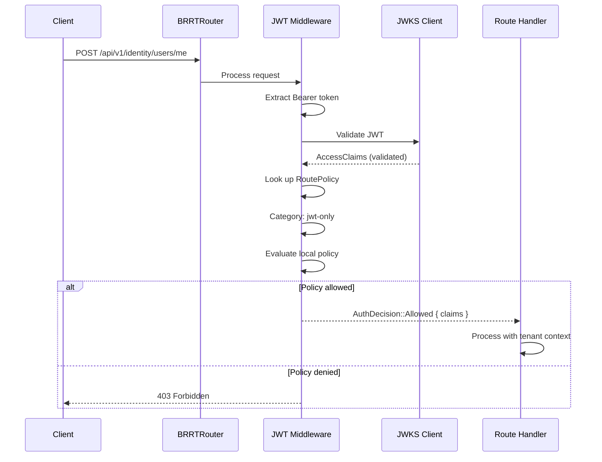
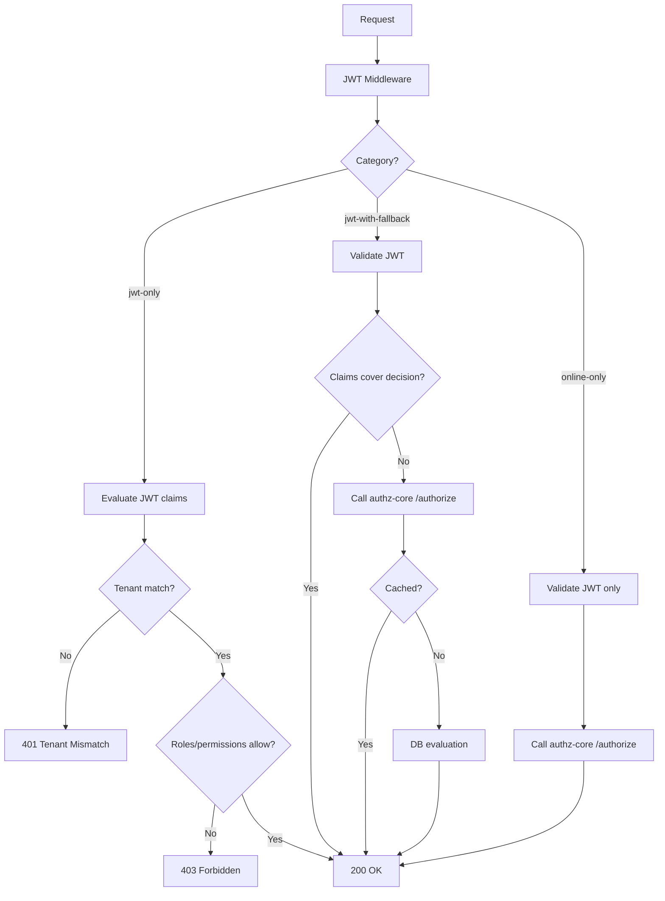
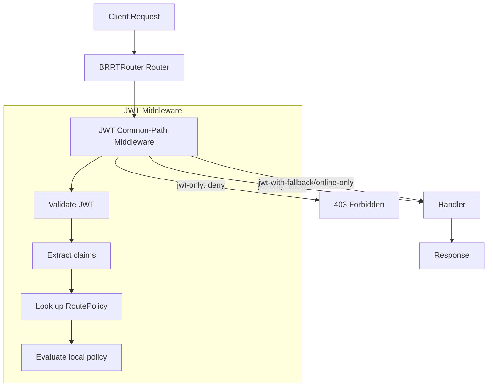

# Story 4.2: Implement JWT Common-Path Authorization Middleware

## Epic

[04-hybrid-authz-model](../hybrid.md)

## Parent Epic Story

Story 4.2

## Summary

Implement a gateway-level middleware that validates the JWT (typ, iss, aud, exp, signature) and evaluates local policy from claims. For `jwt-only` routes, this middleware returns allow/deny without calling authz-core. This is the primary mechanism for reducing online authz load.

## Why This Story Exists

The JWT document's core thesis: JWT claims handle the common path, with online fallback for high-risk decisions. This story implements the JWT common-path evaluation that replaces the current per-request authz-core call for `jwt-only` routes.

## Design Context

### Current State

- All requests currently go through the existing BRRTRouter middleware
- The middleware validates JWTs (or API keys) but doesn't evaluate authorization claims
- Fine-grained authorization requires calling authz-core `/authorize` endpoint
- No JWT common-path middleware exists

### Middleware Placement

```
Client Request
  -> BRRTRouter Router (path matching)
    -> JWT Common-Path Middleware  <-- NEW
      -> If jwt-only: evaluate claims, return allow/deny
      -> If jwt-with-fallback or online-only: continue to handler
    -> Handler (business logic)
```

### Middleware Implementation

```rust
pub struct JwtAuthMiddleware {
    route_policies: Arc<RoutePolicyStore>,
    // JWKS client for token validation (from Epic 1)
    jwks_client: Arc<JwksClient>,
}

impl JwtAuthMiddleware {
    pub async fn validate_and_authorize(
        &self,
        request: &HttpRequest,
    ) -> Result<AuthDecision, AuthError> {
        // 1. Extract Bearer token
        let token = extract_bearer_token(request)?;
        
        // 2. Validate JWT (typ, iss, aud, exp, nbf, signature)
        let claims: AccessClaims = self.jwks_client.validate(token)?;
        
        // 3. Look up route policy
        let path = request.path();
        let method = request.method().to_string();
        let policy = self.route_policies.get_policy(path, &method)
            .ok_or(AuthError::PolicyNotFound)?;
        
        // 4. Evaluate local policy from claims
        match &policy.category {
            RouteAuthCategory::JwtOnly => {
                self.evaluate_jwt_only(&claims, policy)
            }
            RouteAuthCategory::JwtWithFallback { .. } => {
                Ok(AuthDecision::JwtCommonPath { claims })
            }
            RouteAuthCategory::OnlineOnly => {
                Ok(AuthDecision::JwtCommonPath { claims })
            }
        }
    }
    
    fn evaluate_jwt_only(
        &self,
        claims: &AccessClaims,
        policy: &RoutePolicy,
    ) -> Result<AuthDecision, AuthError> {
        // 5. Evaluate local policy
        // - Check tenant_id matches request X-Tenant-ID
        // - Check roles/permissions in claims.sx
        // - Check user_type (customer vs platform)
        // - Check risk level if present
        
        let allowed = self.evaluate_local_policy(claims, policy);
        
        if allowed {
            Ok(AuthDecision::Allowed { claims })
        } else {
            Ok(AuthDecision::Denied { reason: "jwt_only_policy_violation" })
        }
    }
    
    fn evaluate_local_policy(&self, claims: &AccessClaims, policy: &RoutePolicy) -> bool {
        // 1. Tenant validation
        // 2. Role/permission check
        // 3. User type check
        // 4. Risk level check
        true // implementation placeholder
    }
}

// AuthDecision is the result of middleware evaluation
pub enum AuthDecision {
    Allowed { claims: AccessClaims },
    Denied { reason: String },
    JwtCommonPath { claims: AccessClaims },  // Continue to handler (not jwt-only)
}
```

### Local Policy Evaluation

For `jwt-only` routes, the middleware evaluates:

```
1. Tenant validation: claims.tenant_id == request X-Tenant-ID
2. User type: claims.user_type matches expected type for this route
3. Role check: claims.sx.roles contains required role (if any)
4. Permission check: claims.sx.permissions contains required permission (if any)
5. Risk check: claims.sx.risk == "normal" (if elevated/critical routes)
```

### Tenant Validation (Critical)

The tenant validation is the most critical check -- if this fails, the request must be rejected immediately:

```rust
fn validate_tenant(&self, claims: &AccessClaims, request: &HttpRequest) -> Result<(), AuthError> {
    let request_tenant = request
        .headers()
        .get("X-Tenant-ID")
        .and_then(|h| h.to_str().ok())
        .ok_or(AuthError::MissingTenantId)?;
    
    if claims.tenant_id != request_tenant {
        return Err(AuthError::TenantMismatch {
            expected: request_tenant.to_string(),
            actual: claims.tenant_id.clone(),
        });
    }
    
    Ok(())
}
```

## Mermaid Diagrams

### Middleware Flow



### JWT Common-Path vs Online Fallback



### Middleware Position in BRRTRouter Pipeline



## OpenAPI Changes

No OpenAPI changes. The middleware is internal to the routing layer. The OpenAPI spec documents the API surface -- the authorization mechanism is an implementation detail.

## Design Doc References

- `design-doc.md` section 10.3: Hybrid Authorization Model -- JWT common-path middleware
- `design-doc.md` section 6.2: JWT Schema -- claims available for local policy evaluation
- `design-doc.md` section 10.1: Token Security -- tenant validation
- `design-doc.md` section 10.9: RLS Security Model -- middleware + SesameExecutor flow
- `topics/topic-hybrid-authz.md`: (new) Document middleware position

## Wiki Pages to Update/Create

- `topics/topic-hybrid-authz.md`: (new) Document middleware implementation
- `topics/topic-login-flow.md`: Note JWT common-path middleware
- `topics/topic-authorization-flow.md`: Update with hybrid model

## Acceptance Criteria

- [ ] JWT middleware is implemented as a BRRTRouter middleware component
- [ ] Middleware extracts Bearer token from request
- [ ] JWT is validated: typ=at+jwt, iss, aud, exp, nbf, signature (via JWKS)
- [ ] RoutePolicy is looked up by path + method
- [ ] For `jwt-only` routes: local policy is evaluated from JWT claims
- [ ] Tenant validation: claims.tenant_id matches request X-Tenant-ID
- [ ] Role check: claims.sx.roles evaluated against route requirements
- [ ] Permission check: claims.sx.permissions evaluated against route requirements
- [ ] User type check: claims.user_type validated for route
- [ ] For `jwt-with-fallback` and `online-only`: JWT is validated but policy evaluation is passed to handler
- [ ] Denied requests return 403 Forbidden with reason
- [ ] Allowed requests pass AccessClaims to the handler context
- [ ] Metrics: `jwt_validation_total{route, result}` is emitted per route
- [ ] Metrics: `jwt_validation_latency_ms` is emitted per route

## Dependencies

- Depends on Story 1.3 (JWKS validation infrastructure)
- Depends on Story 2.2 (AccessClaims struct)
- Depends on Story 4.1 (RoutePolicyStore with classified routes)
- Required by Story 4.3 (online fallback integration)

## Risk / Trade-offs

- **Tenant validation in middleware**: The tenant_id is validated against the request's X-Tenant-ID header in the middleware. If a service receives a request without X-Tenant-ID (e.g., internal service-to-service call), the middleware fails. This is correct -- every request must have a tenant context.
- **Role/permission evaluation in middleware**: The middleware evaluates roles and permissions from the JWT claims. This is correct for coarse-grained checks but may be insufficient for fine-grained resource-level authorization (e.g., "can user edit THIS specific invoice?"). Fine-grained checks are handled by the online fallback (Story 4.3).
- **Middleware as a single point of failure**: If the JWT middleware is down or slow, ALL requests are blocked. This is mitigated by:
  - JWKS cache (5-minute TTL) so validation doesn't depend on network
  - In-memory RoutePolicyStore so classification doesn't depend on external config
  - JWT validation is fast (signature check + claim parsing, <1ms)

## Tests

### Unit Tests

- [ ] **Bearer token extraction works**: Given an HTTP request with `Authorization: Bearer eyJhbG...`, assert `extract_bearer_token()` returns `"eyJhbG..."` (the raw token string)
- [ ] **Bearer token extraction rejects missing header**: Given an HTTP request with no `Authorization` header, assert `extract_bearer_token()` returns `AuthError::MissingAuthorization`
- [ ] **Bearer token extraction rejects non-Bearer scheme**: Given `Authorization: Basic dXNlcjpwYXNz`, assert `extract_bearer_token()` returns an error (only `Bearer` scheme is accepted)
- [ ] **Tenant validation accepts match**: Given `claims.tenant_id = "tenant-abc"` and `X-Tenant-ID: tenant-abc`, assert `validate_tenant()` returns `Ok(())`
- [ ] **Tenant validation rejects mismatch**: Given `claims.tenant_id = "tenant-abc"` and `X-Tenant-ID: tenant-def`, assert `validate_tenant()` returns `AuthError::TenantMismatch { expected: "tenant-def", actual: "tenant-abc" }`
- [ ] **Tenant validation rejects missing header**: Given no `X-Tenant-ID` header, assert `validate_tenant()` returns `AuthError::MissingTenantId`
- [ ] **Local policy allows with matching role**: Given `claims.sx.roles = ["admin"]` and a route requiring `["admin"]`, assert `evaluate_local_policy()` returns `true`
- [ ] **Local policy denies with missing role**: Given `claims.sx.roles = ["customer"]` and a route requiring `["admin"]`, assert `evaluate_local_policy()` returns `false`
- [ ] **Local policy allows with matching permission**: Given `claims.sx.permissions = ["prefs:write"]` and a route requiring `["prefs:write"]`, assert `evaluate_local_policy()` returns `true`
- [ ] **Local policy denies with missing permission**: Given `claims.sx.permissions = ["prefs:read"]` and a route requiring `["prefs:write"]`, assert `evaluate_local_policy()` returns `false`
- [ ] **Local policy allows with normal risk**: Given `claims.sx.risk = Some("normal")` and a route allowing all risk levels, assert `evaluate_local_policy()` returns `true`
- [ ] **Local policy allows without risk claim**: Given `claims.sx.risk = None`, assert `evaluate_local_policy()` returns `true` (absence of risk claim does not cause denial)
- [ ] **jwt-only returns AuthDecision::Allowed**: Given a jwt-only route with all policy checks passing, assert `validate_and_authorize()` returns `AuthDecision::Allowed { claims }`
- [ ] **jwt-only returns AuthDecision::Denied**: Given a jwt-only route with a role check failure, assert `validate_and_authorize()` returns `AuthDecision::Denied { reason: "jwt_only_policy_violation" }`
- [ ] **jwt-with-fallback returns AuthDecision::JwtCommonPath**: Given a jwt-with-fallback route, assert `validate_and_authorize()` returns `AuthDecision::JwtCommonPath { claims }` (continues to handler)
- [ ] **online-only returns AuthDecision::JwtCommonPath**: Given an online-only route, assert `validate_and_authorize()` returns `AuthDecision::JwtCommonPath { claims }` (continues to handler)
- [ ] **PolicyNotFound error for unclassified route**: Given a path+method not in any RoutePolicy, assert `validate_and_authorize()` returns `AuthError::PolicyNotFound`

### Integration Tests (BDD-style with `rstest_bdd`)

- [ ] **Scenario: Valid jwt-only request succeeds**: `given` a user with `org_admin` role → `when` a request to `/api/users/me GET` (jwt-only) is made with a valid JWT and matching X-Tenant-ID → `then` the middleware returns `AuthDecision::Allowed` and the handler processes the request
- [ ] **Scenario: jwt-only denied due to role**: `given` a user with `customer` role → `when` a request to a route requiring `org_admin` is made → `then` the middleware returns `AuthDecision::Denied { reason: "jwt_only_policy_violation" }` and the client receives 403
- [ ] **Scenario: Tenant mismatch rejected**: `given` a valid JWT for tenant A → `when` a request with `X-Tenant-ID: B` is made → `then` the middleware rejects with `TenantMismatch` and the client receives 401
- [ ] **Scenario: jwt-with-fallback continues to handler**: `given` a valid JWT → `when` a request to a `jwt-with-fallback` route is made → `then` the middleware returns `AuthDecision::JwtCommonPath` and the handler proceeds (no 403 from middleware)
- [ ] **Scenario: online-only continues to handler**: `given` a valid JWT → `when` a request to an `online-only` route is made → `then` the middleware returns `AuthDecision::JwtCommonPath` and the handler proceeds to call authz-core
- [ ] **Scenario: Metrics emitted per route**: `given` 10 requests to `/api/users/me GET` → `then` `jwt_validation_total{route: "/api/users/me", result: "allowed"}` is emitted 10 times, and `jwt_validation_latency_ms` histogram records 10 samples
- [ ] **Scenario: Invalid JWT rejected at step 2**: `given` a request with an expired JWT → `when` the middleware processes it → `then` `jwt_validation_total{result: "denied", reason: "token_expired"}` is emitted and the handler is never called

### Security Regression Tests

- [ ] **Tenant bleed prevented**: `given` user alice from tenant A → `when` alice sends a request with `X-Tenant-ID: B` → `then` the middleware rejects with `TenantMismatch` BEFORE the handler is called (tenant validation happens at the middleware layer, not in the handler)
- [ ] **Token tampering detected**: `given` a JWT where the client modifies `sx.roles` from `["customer"]` to `["admin"]` → `then` the signature verification fails (the token is unsigned by the issuer, so it's rejected before policy evaluation)
- [ ] **Missing X-Tenant-ID blocks request**: `given` a request with a valid JWT but no `X-Tenant-ID` header → `then` the middleware rejects with 401 `MissingTenantId` (no request reaches the handler)
- [ ] **jwt-only routes cannot be bypassed**: Assert that `jwt-only` routes NEVER make a call to authz-core — the entire authorization decision is made from JWT claims alone

### Edge Cases

- [ ] **Malformed JWT header (not base64url)**: Send a request with `Authorization: Bearer not-a-jwt` — assert the middleware returns 401 with a clear error message (not a panic or 500)
- [ ] **JWT with no claims body**: Send a JWT where the payload decodes to an empty JSON object — assert deserialization into `AccessClaims` fails and the middleware returns 401
- [ ] **Concurrent requests with same token**: 100 concurrent requests with the same valid JWT — assert all 100 succeed without cache corruption or race conditions (JWKS validation is thread-safe via `Arc`/`RwLock`)
- [ ] **Very large JWT (>750 bytes)**: Send a JWT that exceeds the token size budget — assert the middleware still validates it correctly (the middleware should NOT reject based on size alone; size enforcement is a build-time test per Story 2.5)
- [ ] **JWT with unusual claim values**: A JWT with `sx.roles = []` (empty array), `sx.permissions = []` (empty array), `sx.risk = Some("elevated")` — assert policy evaluation handles empty role/permission arrays gracefully (no panic, returns appropriate allow/deny based on route requirements)

### Cleanup

- No state cleanup required — the middleware is stateless (it reads from in-memory `RoutePolicyStore` and `JwksClient`)
- Integration tests must not leave partially-validated JWTs in caches — use fresh JWTs per test scenario
- If metrics are global singletons, clear the metrics registry between test scenarios using `prometheus::Registry::new()` or similar
