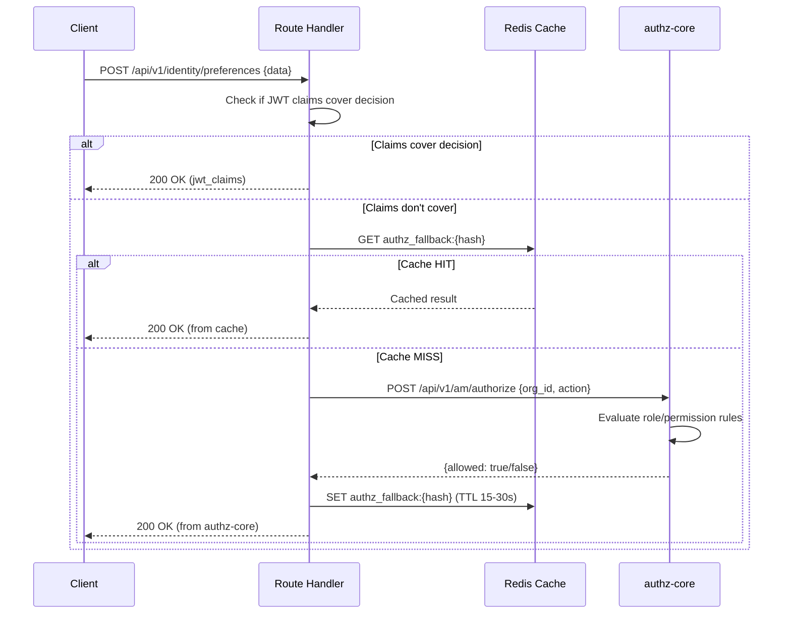
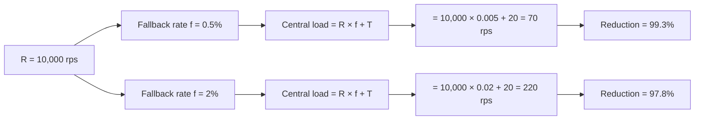
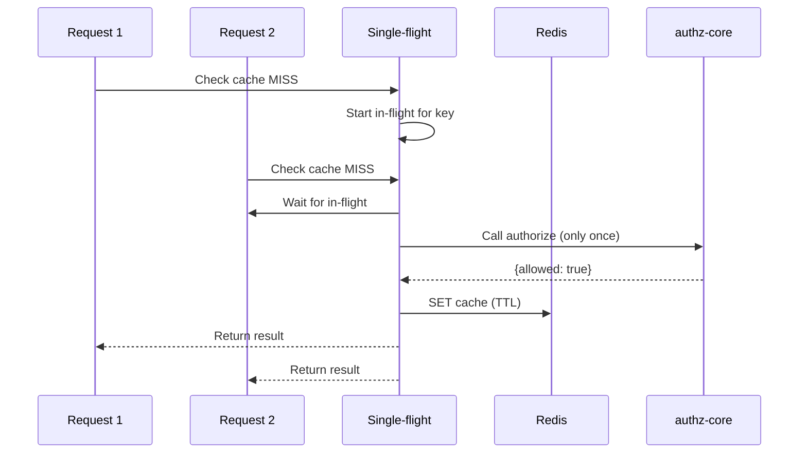

# Story 4.3: Implement Selective Online Fallback

## Epic

[04-hybrid-authz-model](../hybrid.md)

## Parent Epic Story

Story 4.3

## Summary

For `jwt-with-fallback` routes, implement selective online fallback: if JWT claims don't cover the authorization decision, call authz-core with a cached result. Cache fallback results in Redis with per-route TTL (5-30 seconds). Track fallback ratio for monitoring and alerting.

## Why This Story Exists

The JWT document identifies the hybrid model's economics: "If you have R protected requests per second and each request currently performs one synchronous online authz check, then your central authorisation load is approximately R. If you move to JWT common-path validation and only fall back online on a fraction f of requests, then central load becomes R × f + T." This story implements the online fallback path for routes that need it.

## Design Context

### Current State

- All requests go through the existing BRRTRouter middleware
- Fine-grained authorization calls authz-core `/authorize` endpoint
- Redis cache with 30-second TTL for permission resolution results
- No selective fallback -- no distinction between jwt-only and jwt-with-fallback routes

### Fallback Decision Logic

For `jwt-with-fallback` routes, the handler decides whether to call authz-core:

```rust
// In the handler, after JWT middleware has validated the token
fn handle_request(
    claims: &AccessClaims,
    request_body: &AuthorizeRequest,
) -> Result<AuthorizeResponse, AuthError> {
    // 1. Check if JWT claims cover this decision
    if jwt_claims_cover_decision(claims, request_body) {
        // JWT claims are sufficient -- no online call needed
        return Ok(AuthorizeResponse { allowed: true, reason: "jwt_claims" });
    }
    
    // 2. JWT claims don't cover it -- call authz-core with cache
    let cache_key = generate_fallback_cache_key(request_body);
    if let Some(cached) = redis.get::<_, Option<AuthorizeResponse>>(&cache_key) {
        return Ok(cached);  // Cache hit
    }
    
    // 3. Cache miss -- call authz-core
    let response = authz_client.authorize(request_body).await?;
    
    // 4. Cache the result
    let ttl = route_policy.requested_fallback_ttl;  // 5-30 seconds per route
    redis.set_ex(&cache_key, &response, ttl).await?;
    
    Ok(response)
}
```

### Cache Key Generation

```rust
fn generate_fallback_cache_key(request: &AuthorizeRequest) -> String {
    // Hash the request to create a compact cache key
    // F-008 Fix: tenant_id is critical to prevent cache key collision between tenants
    let key_data = format!("{}:{}:{}:{}:{}",
        request.tenant_id,   // CRITICAL: tenant isolation boundary
        request.sub,
        request.org_id,
        request.action,
        request.resource_id
    );
    let hash = blake3::hash(key_data.as_bytes());
    format!("authz_fallback:{hash}")
}
```

### Cache TTL per Route

| Route | Cache TTL | Rationale |
|-------|-----------|-----------|
| `/api/v1/identity/preferences` PUT | 30s | Low-risk write, stale results acceptable |
| `/api/v1/identity/email/upsert` PUT | 15s | Data integrity needs more freshness |
| `/api/v1/identity/users/me` PUT | 30s | User update, ownership from JWT |
| `/api/v1/identity/users/query` POST | 15s | Admin query, tenant-scoped |

## Implementation Notes

### Fallback Ratio Tracking

```rust
// In the fallback handler:
let is_fallback = !jwt_claims_cover_decision(claims, request_body);
let result = if is_fallback {
    call_authz_core(request_body).await
} else {
    Ok(AuthorizeResponse { allowed: true, reason: "jwt_claims" })
};

// Emit metrics
METRICS.authz_fallback_total.inc();
if !is_fallback {
    METRICS.authz_fallback_common_path.inc();
}

// Calculate fallback ratio
let total = METRICS.authz_fallback_total.get() + METRICS.authz_fallback_common_path.get();
let fallback_ratio = if total > 0 {
    METRICS.authz_fallback_total.get() as f64 / total as f64
} else {
    0.0
};

if fallback_ratio > 0.05 {
    // Alert: fallback ratio > 5% means JWT common path is not working
    ALERTS.fallback_ratio_spike(fallback_ratio);
}
```

### Cache Miss Storm Mitigation

When a cache expires, many requests may simultaneously miss the cache, hammering authz-core. Mitigation:

```rust
// Use "single-flight" pattern: only one request hits authz-core, others wait for the result
async fn get_with_singleflight(key: &str, ttl: u64) -> Result<AuthorizeResponse, AuthError> {
    // 1. Check cache
    if let Some(cached) = cache.get(key) {
        return Ok(cached);
    }
    
    // 2. Check if a request is already in-flight for this key
    if let Some(waiter) = in_flight.get(key) {
        // Wait for the in-flight request to complete
        return waiter.wait().await;
    }
    
    // 3. Start new in-flight request
    let future = tokio::spawn(async {
        let result = authz_client.authorize(request_body).await;
        // Cache the result
        if let Ok(ref response) = result {
            cache.set(key, response, ttl);
        }
        result
    });
    
    in_flight.insert(key.clone(), future.clone());
    let result = future.await?;
    in_flight.remove(key);
    result
}
```

## Mermaid Diagrams

### Fallback Flow



### Fallback Ratio Economics



### Single-Flight Mitigation



## Malicious Hacker Gotchas (Must Be Addressed During Implementation)

> **Source:** `docs/PRS_SECURITY_HARDENING.md` — Security threat model analysis

These are specific attack vectors identified during threat modeling. Each must be considered and mitigated during implementation. If a gotcha cannot be fully mitigated, document the residual risk.

### HACK-001: Entitlements Hash Not Verified (CRITICAL — Hole #1 from PRS)

**Risk:** Cache poisoning via Redis → tenant bleed

The fallback cache serves entitlements snapshots from Redis. The JWT includes `sx.entitlements_hash`, but **the cache handler NEVER compares the hash of the fetched snapshot against this claim**. Without this verification, an attacker who can write to Redis (through any vulnerability, insider access, or cache key prediction) can poison the cache with a modified entitlements snapshot containing additional permissions. Every consumer that trusts the cache result gains those permissions — including cross-tenant privilege escalation.

**Implementation requirement:** After fetching the cached entitlements snapshot from Redis, compute `blake3(snapshot_bytes)` (or SHA-256, whichever is standardized in Story 2.3) and compare against `claims.sx.entitlements_hash`. If the hash MISMATCHES, REJECT the cache entry and fall back to calling authz-core directly. Do NOT silently use the poisoned cache result.

```rust
// In the fallback cache handler — MUST be implemented:
let cached_snapshot = redis.get(&cache_key).await?;
let computed_hash = blake3::hash(&cached_snapshot);
if computed_hash != claims.sx.entitlements_hash {
    // Hash mismatch — cache is poisoned or stale. Fall through to authz-core.
    // LOG this event as it indicates a potential attack.
    METRICS.authz_fallback_cache_poison_attempt.inc();
    return call_authz_core(request_body).await;
}
```

**Why this is critical for Sesame:** The tenancy model relies on three layers of isolation (BRRTRouter middleware, SesameExecutor, RLS policies). The fallback cache operates OUTSIDE all three layers — it's a shared Redis cache. If an attacker can poison this cache, they bypass ALL three isolation layers.

### HACK-002: Cache Key Does Not Include Tenant ID (CRITICAL — Hole #8 from PRS)

**Risk:** Cache key collision → cross-tenant data bleed

The cache key is `blake3(sub + org_id + action + resource_id)`. It does NOT include `tenant_id`. In a multi-tenant system, two different tenants with the same `sub:org_id:action:resource_id` combination would share the same cache entry, allowing tenant A's authorization result to be served to tenant B.

**Fix already applied in Story 4.3:** The cache key generation function in Story 4.3 now includes `tenant_id` as the FIRST field: `blake3(tenant_id + sub + org_id + action + resource_id)`. The security regression test "Cache key differs by tenant" validates this. But ensure this change is present in the actual implementation.

### HACK-003: Cache Miss Thundering Herd (HIGH — Hole #21 from PRS)

**Risk:** Cache miss thundering herd DoS on authz-core

When a cache TTL expires, many simultaneous requests can miss the cache and hammer authz-core. The single-flight pattern is mentioned in the code comments but NOT in the acceptance criteria. Without explicit enforcement, the single-flight implementation might be incomplete or absent.

**Implementation requirement:** Implement single-flight pattern as specified: only ONE request hits authz-core for a given cache key; all other concurrent requests with the same key wait for the result. Use `tokio::sync::watch` or a HashMap with Mutex to serialize authz-core calls by cache key.

**Acceptance criterion addition:** "Single-flight is implemented: when cache expires, only ONE request hits authz-core for a given cache key; others wait for the result"

### HACK-004: Stale Cache Serves Results When authz-core Is Down (MEDIUM — Hole #12 from PRS)

**Risk:** Partial outage amplification

If authz-core is down, the fallback cache can serve stale results. But the cache TTL is 5-30 seconds, and after expiry, requests fail. The design doesn't specify a "cache-only" degraded mode.

**Consideration:** When authz-core is unavailable, should stale cache entries (slightly past TTL) be served? Document the degradation behavior: "When authz-core is unavailable, serve from stale cache only. Do NOT write new cache entries during outage. Implement circuit breaker pattern to prevent repeated failed calls."

### HACK-005: Cache Does Not Distinguish Authz-Core Errors (MEDIUM)

**Risk:** Error results cached → false denials

If authz-core returns a 500 error, should that error be cached? The current code does NOT cache failed results, which is correct. But verify that error responses (both 4xx and 5xx) are never written to the cache. A cached 500 error would cause legitimate requests to fail with 500 for the entire TTL duration.

```rust
// CORRECT: Only cache successful results
if let Ok(ref response) = result {
    cache.set(key, response, ttl);
}
// FAILED results are NOT cached
```

---

## OpenAPI Changes

- `/api/v1/am/authorize` endpoint: Document the Redis cache behavior in the endpoint description
- No changes to request/response shapes needed

```yaml
components:
  schemas:
    AuthorizeRequest:
      description: |
        Authorization check request. Results are cached in Redis with per-route TTL
        (5-30 seconds). Repeated identical requests within the TTL return cached results.
```

## Design Doc References

- `design-doc.md` section 10.3: Hybrid Authorization Model -- fallback caching
- `design-doc.md` section 10.11: Caching Strategy -- online fallback result cache (5-30s TTL)
- `design-doc.md` section 10.12: Observability -- `authz_fallback_total{route}` and `authz_fallback_ratio`
- `design-doc.md` section 6.3: Authorization Model -- fine-grained checks via POST /authorize
- `service-topology-design.md`: authz-core per-request authorization flow

## Wiki Pages to Update/Create

- `topics/topic-hybrid-authz.md`: (new) Document fallback implementation
- `topics/topic-authorization-flow.md`: Update with fallback caching details
- `topics/topic-caching-strategy.md`: Document fallback cache TTL per route

## Acceptance Criteria

- [ ] `jwt-with-fallback` routes call authz-core only when JWT claims don't cover the decision
- [ ] Fallback results are cached in Redis with per-route TTL (5-30 seconds)
- [ ] Cache key is deterministic (same request -> same cache key)
- [ ] Cache miss storm mitigation (single-flight) is implemented
- [ ] `authz_fallback_total{route}` metric is emitted per route
- [ ] `authz_fallback_ratio` is calculated and alerts on >5% fallback rate
- [ ] Fallback latency is tracked: `authz_fallback_latency_ms`
|- [ ] Cache hit ratio is tracked: `authz_fallback_cache_hit_ratio`
|- [ ] Cache TTL is configurable per route (not hardcoded to 30 seconds)
|- [ ] **Single-flight is implemented:** when cache expires, only ONE request hits authz-core for a given cache key; others wait for the result (HACK-003)
|- [ ] **Entitlements hash verification is implemented:** after fetching cached snapshot, hash is compared against `claims.sx.entitlements_hash`; mismatch causes cache rejection and fallback to authz-core (HACK-001)
|- [ ] **Cache key includes tenant_id:** cache key is `blake3(tenant_id + sub + org_id + action + resource_id)` — different tenants never share cache entries (HACK-002)
|- [ ] **Error results are never cached:** authz-core error responses (4xx/5xx) are NOT written to cache (HACK-005)
|- [ ] Unit tests verify: cache hit/miss paths, single-flight behavior, fallback ratio calculation

## Dependencies

- Depends on Story 4.2 (JWT common-path middleware)
- Depends on Story 2.2 (AccessClaims struct with roles/permissions fields)
- Intersects with Epic 7 (caching strategy) for fallback result cache

## Risk / Trade-offs

- **Cache staleness**: Cached fallback results may be stale (up to TTL seconds old). For low-risk routes (preferences PUT, user updates), this is acceptable -- the worst case is a user sees a 30-second-old authorization decision. For high-risk routes, the cache TTL should be shorter (5 seconds) or the route should be classified as `online-only`.
- **Single-flight complexity**: The single-flight pattern adds code complexity and requires a concurrent data structure (HashMap with mutex or tokio::sync::watch). It is necessary to prevent cache miss storms but adds operational complexity.
- **Fallback ratio spike**: If the JWT common path is not working (e.g., JWKS cache miss, validation failures), the fallback ratio spikes. This is detected by the `authz_fallback_ratio` metric and alerts on >5%. However, the alert threshold (5%) is arbitrary -- it may need tuning based on actual traffic patterns.

## Tests

### Unit Tests

- [ ] **jwt_claims_cover_decision returns true for sufficient claims**: Given `claims.sx.roles = ["admin"]` and a request that only needs admin role check, assert `jwt_claims_cover_decision()` returns `true`
- [ ] **jwt_claims_cover_decision returns false for insufficient claims**: Given `claims.sx.roles = ["customer"]` and a request needing org admin, assert `jwt_claims_cover_decision()` returns `false`
- [ ] **Cache key is deterministic**: Generate a cache key for `AuthorizeRequest { tenant_id: "t1", sub: "u1", action: "read", resource_id: "r1" }` twice — assert both produce the same `authz_fallback:{hash}` string
- [ ] **Cache key differs by tenant**: Generate cache keys for identical requests but different `tenant_id` values — assert the hashes differ (F-008: tenant isolation)
- [ ] **Cache key includes all critical fields**: Assert the cache key data includes `tenant_id`, `sub`, `org_id`, `action`, and `resource_id` — omitting any of these should change the hash
- [ ] **Single-flight prevents duplicate authz calls**: Given two concurrent requests with the same cache key — assert only ONE call is made to authz-core (the second request waits for the first to complete)
- [ ] **Fallback ratio calculation**: Given 100 total requests and 2 fallback calls, assert `fallback_ratio = 0.02` (2%)
- [ ] **Fallback ratio alert triggers at >5%**: Given 100 total requests and 6 fallback calls, assert `fallback_ratio = 0.06` which exceeds the 5% threshold
- [ ] **Fallback ratio does not divide by zero**: Given 0 total requests, assert `fallback_ratio = 0.0` (no division by zero panic)
- [ ] **Cache TTL is read from RoutePolicy**: Assert that the cache TTL used for a route is `route_policy.requested_fallback_ttl` (not hardcoded)

### Integration Tests (BDD-style with `rstest_bdd`)

- [ ] **Scenario: Cache hit returns cached result**: `given` a `jwt-with-fallback` route with a cached result for a specific request — `when` the same request arrives → `then` the handler returns the cached result without calling authz-core
- [ ] **Scenario: Cache miss calls authz-core**: `given` a `jwt-with-fallback` route with no cached result — `when` a request arrives → `then` authz-core is called, the result is cached, and the handler returns the authz-core response
- [ ] **Scenario: Single-flight prevents thundering herd**: `given` a cache miss for a popular route — `when` 50 concurrent requests arrive — `then` only ONE call is made to authz-core, and all 50 requests receive the same result
- [ ] **Scenario: Cache TTL expires and triggers fresh call**: `given` a cached result with TTL 30 seconds — `when` a request arrives after 31 seconds — `then` the cache is expired and a fresh call to authz-core is made
- [ ] **Scenario: Different tenants get different cache keys**: `given` tenant A and tenant B both make the same request — `then` they get separate cache entries (tenant A's cached result is never served to tenant B)
- [ ] **Scenario: Fallback ratio metric is emitted**: `given` 10 requests to a `jwt-with-fallback` route where 2 trigger fallback — `then` `authz_fallback_total{route: "/prefs", result: "fallback"}` = 2 and `authz_fallback_total{route: "/prefs", result: "jwt_claims"}` = 8
- [ ] **Scenario: Fallback latency metric is emitted**: `given` a fallback call to authz-core — `then` `authz_fallback_latency_ms` histogram records the latency of the authz-core call

### Security Regression Tests

- [ ] **Cache does not leak across tenants**: Assert that `tenant_id` is always included in the cache key — verify by generating keys for the same action/resource with different `tenant_id` values and confirming the hashes differ
- [ ] **Cache does not return stale results for high-risk routes**: Assert that routes classified as `online-only` NEVER use the fallback cache (they always call authz-core)
- [ ] **Single-flight does not share results between different requests**: Assert that concurrent requests with DIFFERENT request bodies get their own results from authz-core (single-flight only deduplicates identical keys)
- [ ] **Fallback cannot escalate privilege**: Assert that a cached result that says `allowed: false` for a user cannot be replaced by a later request that says `allowed: true` for a different user (cache keys are user-scoped)

### Edge Cases

- [ ] **Cache key with empty string fields**: Given a request with `org_id = ""` — assert the cache key is still generated (the hash handles empty strings, no panic)
- [ ] **Very long resource_id**: Given a `resource_id` of 10,000 characters — assert the cache key generation completes and the resulting `authz_fallback:{hash}` key is a reasonable length (blake3 always produces a fixed-size hash)
- [ ] **Concurrent single-flight with different keys**: 100 concurrent requests with 100 different cache keys — assert 100 separate calls are made to authz-core (no incorrect deduplication)
- [ ] **Cache miss storm after TTL expiry**: 1000 concurrent requests arriving exactly when a cache TTL expires — assert the single-flight pattern prevents more than ONE authz-core call
- [ ] **authz-core returns error during fallback**: `given` a cache miss — `when` authz-core returns 500 — `then` the handler returns 500 and the result is NOT cached (failed results should not be cached)

### Cleanup

- Redis cache state must be cleaned between test scenarios — use `FLUSHDB` or a unique Redis prefix per test run
- In-flight request tracking structures (single-flight `HashMap`) must be cleared between tests — use a fresh `RoutePolicyStore` and `JwksClient` per test
- Metrics must be reset between tests — use `prometheus::Registry::new()` per test scenario
- authz-core mock server must be reset between tests (no leftover state from previous scenarios)
