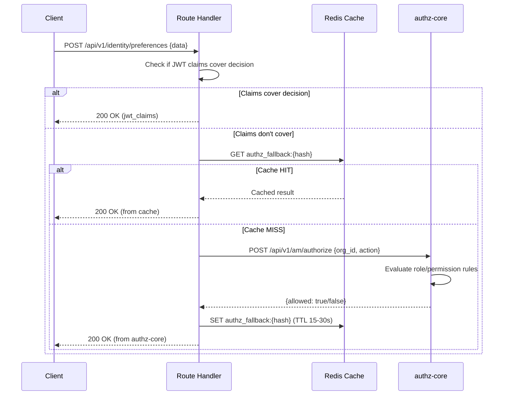
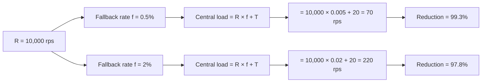
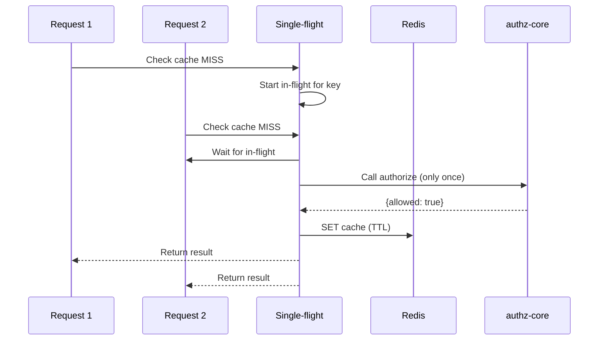

# Story 4.3: Implement Selective Online Fallback

## Epic

[04-hybrid-authz-model](../hybrid.md)

## Parent Epic Story

Story 4.3

## Summary

For `jwt-with-fallback` routes, implement selective online fallback: if JWT claims don't cover the authorization decision, call authz-core with a cached result. Cache fallback results in Redis with per-route TTL (5-30 seconds). Track fallback ratio for monitoring and alerting.

## Why This Story Exists

The JWT document identifies the hybrid model's economics: "If you have R protected requests per second and each request currently performs one synchronous online authz check, then your central authorisation load is approximately R. If you move to JWT common-path validation and only fall back online on a fraction f of requests, then central load becomes R × f + T." This story implements the online fallback path for routes that need it.

## Design Context

### Current State

- All requests go through the existing BRRTRouter middleware
- Fine-grained authorization calls authz-core `/authorize` endpoint
- Redis cache with 30-second TTL for permission resolution results
- No selective fallback -- no distinction between jwt-only and jwt-with-fallback routes

### Fallback Decision Logic

For `jwt-with-fallback` routes, the handler decides whether to call authz-core:

```rust
// In the handler, after JWT middleware has validated the token
fn handle_request(
    claims: &AccessClaims,
    request_body: &AuthorizeRequest,
) -> Result<AuthorizeResponse, AuthError> {
    // 1. Check if JWT claims cover this decision
    if jwt_claims_cover_decision(claims, request_body) {
        // JWT claims are sufficient -- no online call needed
        return Ok(AuthorizeResponse { allowed: true, reason: "jwt_claims" });
    }
    
    // 2. JWT claims don't cover it -- call authz-core with cache
    let cache_key = generate_fallback_cache_key(request_body);
    if let Some(cached) = redis.get::<_, Option<AuthorizeResponse>>(&cache_key) {
        return Ok(cached);  // Cache hit
    }
    
    // 3. Cache miss -- call authz-core
    let response = authz_client.authorize(request_body).await?;
    
    // 4. Cache the result
    let ttl = route_policy.requested_fallback_ttl;  // 5-30 seconds per route
    redis.set_ex(&cache_key, &response, ttl).await?;
    
    Ok(response)
}
```

### Cache Key Generation

```rust
fn generate_fallback_cache_key(request: &AuthorizeRequest) -> String {
    // Hash the request to create a compact cache key
    // F-008 Fix: tenant_id is critical to prevent cache key collision between tenants
    let key_data = format!("{}:{}:{}:{}:{}",
        request.tenant_id,   // CRITICAL: tenant isolation boundary
        request.sub,
        request.org_id,
        request.action,
        request.resource_id
    );
    let hash = blake3::hash(key_data.as_bytes());
    format!("authz_fallback:{hash}")
}
```

### Cache TTL per Route

| Route | Cache TTL | Rationale |
|-------|-----------|-----------|
| `/api/v1/identity/preferences` PUT | 30s | Low-risk write, stale results acceptable |
| `/api/v1/identity/email/upsert` PUT | 15s | Data integrity needs more freshness |
| `/api/v1/identity/users/me` PUT | 30s | User update, ownership from JWT |
| `/api/v1/identity/users/query` POST | 15s | Admin query, tenant-scoped |

## Implementation Notes

### Fallback Ratio Tracking

```rust
// In the fallback handler:
let is_fallback = !jwt_claims_cover_decision(claims, request_body);
let result = if is_fallback {
    call_authz_core(request_body).await
} else {
    Ok(AuthorizeResponse { allowed: true, reason: "jwt_claims" })
};

// Emit metrics
METRICS.authz_fallback_total.inc();
if !is_fallback {
    METRICS.authz_fallback_common_path.inc();
}

// Calculate fallback ratio
let total = METRICS.authz_fallback_total.get() + METRICS.authz_fallback_common_path.get();
let fallback_ratio = if total > 0 {
    METRICS.authz_fallback_total.get() as f64 / total as f64
} else {
    0.0
};

if fallback_ratio > 0.05 {
    // Alert: fallback ratio > 5% means JWT common path is not working
    ALERTS.fallback_ratio_spike(fallback_ratio);
}
```

### Cache Miss Storm Mitigation

When a cache expires, many requests may simultaneously miss the cache, hammering authz-core. Mitigation:

```rust
// Use "single-flight" pattern: only one request hits authz-core, others wait for the result
async fn get_with_singleflight(key: &str, ttl: u64) -> Result<AuthorizeResponse, AuthError> {
    // 1. Check cache
    if let Some(cached) = cache.get(key) {
        return Ok(cached);
    }
    
    // 2. Check if a request is already in-flight for this key
    if let Some(waiter) = in_flight.get(key) {
        // Wait for the in-flight request to complete
        return waiter.wait().await;
    }
    
    // 3. Start new in-flight request
    let future = tokio::spawn(async {
        let result = authz_client.authorize(request_body).await;
        // Cache the result
        if let Ok(ref response) = result {
            cache.set(key, response, ttl);
        }
        result
    });
    
    in_flight.insert(key.clone(), future.clone());
    let result = future.await?;
    in_flight.remove(key);
    result
}
```

## Mermaid Diagrams

### Fallback Flow



### Fallback Ratio Economics



### Single-Flight Mitigation



## OpenAPI Changes

- `/api/v1/am/authorize` endpoint: Document the Redis cache behavior in the endpoint description
- No changes to request/response shapes needed

```yaml
components:
  schemas:
    AuthorizeRequest:
      description: |
        Authorization check request. Results are cached in Redis with per-route TTL
        (5-30 seconds). Repeated identical requests within the TTL return cached results.
```

## Design Doc References

- `design-doc.md` section 10.3: Hybrid Authorization Model -- fallback caching
- `design-doc.md` section 10.11: Caching Strategy -- online fallback result cache (5-30s TTL)
- `design-doc.md` section 10.12: Observability -- `authz_fallback_total{route}` and `authz_fallback_ratio`
- `design-doc.md` section 6.3: Authorization Model -- fine-grained checks via POST /authorize
- `service-topology-design.md`: authz-core per-request authorization flow

## Wiki Pages to Update/Create

- `topics/topic-hybrid-authz.md`: (new) Document fallback implementation
- `topics/topic-authorization-flow.md`: Update with fallback caching details
- `topics/topic-caching-strategy.md`: Document fallback cache TTL per route

## Acceptance Criteria

- [ ] `jwt-with-fallback` routes call authz-core only when JWT claims don't cover the decision
- [ ] Fallback results are cached in Redis with per-route TTL (5-30 seconds)
- [ ] Cache key is deterministic (same request -> same cache key)
- [ ] Cache miss storm mitigation (single-flight) is implemented
- [ ] `authz_fallback_total{route}` metric is emitted per route
- [ ] `authz_fallback_ratio` is calculated and alerts on >5% fallback rate
- [ ] Fallback latency is tracked: `authz_fallback_latency_ms`
- [ ] Cache hit ratio is tracked: `authz_fallback_cache_hit_ratio`
- [ ] Cache TTL is configurable per route (not hardcoded to 30 seconds)
- [ ] Unit tests verify: cache hit/miss paths, single-flight behavior, fallback ratio calculation

## Dependencies

- Depends on Story 4.2 (JWT common-path middleware)
- Depends on Story 2.2 (AccessClaims struct with roles/permissions fields)
- Intersects with Epic 7 (caching strategy) for fallback result cache

## Risk / Trade-offs

- **Cache staleness**: Cached fallback results may be stale (up to TTL seconds old). For low-risk routes (preferences PUT, user updates), this is acceptable -- the worst case is a user sees a 30-second-old authorization decision. For high-risk routes, the cache TTL should be shorter (5 seconds) or the route should be classified as `online-only`.
- **Single-flight complexity**: The single-flight pattern adds code complexity and requires a concurrent data structure (HashMap with mutex or tokio::sync::watch). It is necessary to prevent cache miss storms but adds operational complexity.
- **Fallback ratio spike**: If the JWT common path is not working (e.g., JWKS cache miss, validation failures), the fallback ratio spikes. This is detected by the `authz_fallback_ratio` metric and alerts on >5%. However, the alert threshold (5%) is arbitrary -- it may need tuning based on actual traffic patterns.
