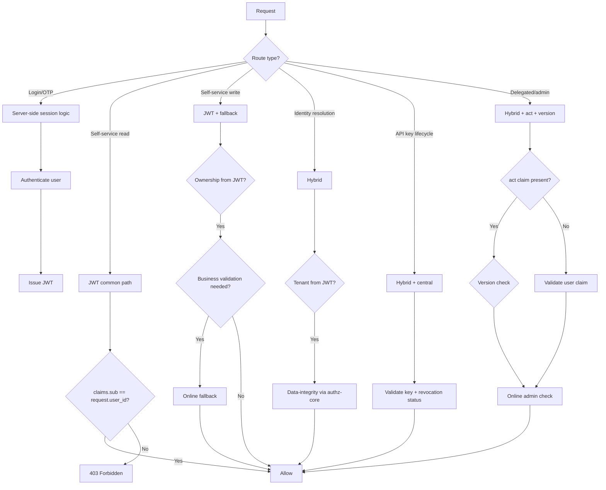
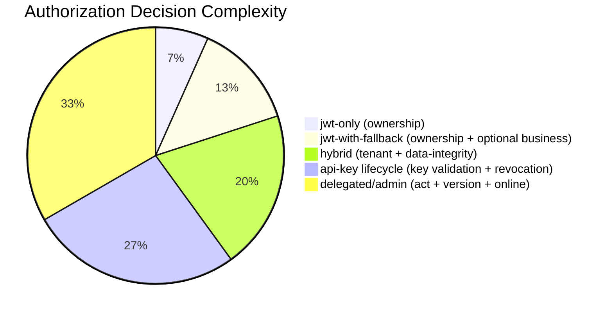

# Story 4.4: Implement Route-Specific Authorization Decisions

## Epic

[04-hybrid-authz-model](../hybrid.md)

## Parent Epic Story

Story 4.4

## Summary

Implement route-specific authorization decision logic for each of the five route types identified in the JWT document. This story defines the specific authorization strategy for each route type and implements the decision logic in the handlers.

## Why This Story Exists

The JWT document provides a decision matrix by endpoint type but doesn't specify the detailed authorization logic for each type. This story fills that gap by defining the exact decision logic for each route type.

## Design Context

### Route Type Strategies

| Route Type | Strategy | Decision Logic |
|------------|----------|---------------|
| **Login, callback, OTP** | Server-side/session logic | Not JWT common-path -- these routes CREATE trust, don't evaluate it |
| **Self-service reads** | JWT common path | Ownership check: claims.sub == request.user_id |
| **Self-service low-risk writes** | JWT + optional fallback | Ownership check from JWT, business validation via online fallback |
| **Identity resolution** | Hybrid | Cross-service hot paths need freshness -- validate tenant from JWT, call authz-core for data-integrity |
| **API key lifecycle** | Hybrid, leaning central | Validate tenant from JWT, call authz-core for revocation freshness |
| **Delegated/admin** | Hybrid with `act`, step-up, version | Validate `act` claim, check version, call authz-core |

### Implementation by Route Type

#### Login, Callback, OTP (Not Authz-Protected)

These routes are **not protected by JWT common-path authz** because they CREATE trust, not evaluate it:

```rust
// Login routes are not in the JWT middleware -- they are handled separately
async fn handle_login(request: LoginRequest) -> Result<LoginResponse, AuthError> {
    // 1. Authenticate user (password, MFA, OAuth)
    // 2. Call authz-core /principal/effective for JWT claim enrichment
    // 3. Sign and return JWT
    // 4. Store session in Redis + PG
}
```

No authorization check is needed at login time -- authentication IS the authorization.

#### Self-Service Reads (jwt-only)

```rust
async fn handle_get_users_me(
    claims: AccessClaims,  // From JWT middleware
) -> Result<UserProfile, AuthError> {
    // Ownership check: claims.sub == user_id in request context
    if claims.sub != request.user_id {
        return Err(AuthError::Forbidden);
    }
    
    // Fetch user profile from database (tenant-scoped)
    let profile = user_repo.find_by_id(request.user_id).await?;
    Ok(profile)
}
```

**Decision logic**: claims.sub (from JWT) must match the requested user_id. This is a simple equality check -- no database call needed for authorization.

#### Self-Service Low-Risk Writes (jwt-with-fallback)

```rust
async fn handle_put_preferences(
    claims: AccessClaims,  // From JWT middleware
    body: PreferencesUpdate,
) -> Result<(), AuthError> {
    // 1. Ownership check from JWT claims
    if claims.sub != body.user_id {
        return Err(AuthError::Forbidden);
    }
    
    // 2. Tenant validation from JWT
    validate_tenant(&claims)?;
    
    // 3. Business validation via online fallback (if needed)
    // e.g., "Is this user's org allowed to have custom preferences?"
    if requires_business_validation(&body) {
        let auth_result = authz_client.authorize(AuthorizeRequest {
            user_id: claims.sub,
            org_id: claims.sx.tenant,
            action: "preferences:update",
            resource: body.resource_id,
        }).await?;
        
        if !auth_result.allowed {
            return Err(AuthError::Forbidden);
        }
    }
    
    // 4. Update preferences
    user_repo.update_preferences(body).await?;
    Ok(())
}
```

**Decision logic**: Ownership from JWT (fast), business validation via online fallback (slow, cached).

#### Identity Resolution (Hybrid)

```rust
async fn handle_email_upsert(
    claims: AccessClaims,  // From JWT middleware
    body: EmailUpsert,
) -> Result<EmailInfo, AuthError> {
    // 1. Validate tenant from JWT
    validate_tenant(&claims)?;
    
    // 2. Check if user has permission to upsert email
    if !claims.sx.permissions.contains(&"email:write".to_string()) {
        return Err(AuthError::Forbidden);
    }
    
    // 3. Data-integrity check via authz-core (always online)
    // Email is the "single source of truth" -- integrity must be verified
    let auth_result = authz_client.authorize(AuthorizeRequest {
        user_id: claims.sub,
        org_id: claims.sx.tenant,
        action: "email:upsert",
        resource: body.email,
    }).await?;
    
    if !auth_result.allowed {
        return Err(AuthError::Forbidden);
    }
    
    // 4. Upsert email
    email_repo.upsert(body).await?;
    Ok(email_repo.find_by_address(body.email).await?)
}
```

**Decision logic**: Tenant from JWT (fast), permission from JWT claims (fast), data-integrity via authz-core (always online, not cached).

#### API Key Lifecycle (Hybrid, Leaning Central)

```rust
async fn handle_api_key_validate(
    claims: AccessClaims,  // From JWT middleware (if API key is validated by JWT)
    body: ApiKeyValidation,
) -> Result<ApiKeyValidationResponse, AuthError> {
    // 1. Validate API key (hash lookup, not JWT)
    let key_data = api_key_repo.validate(&body.key).await?;
    
    // 2. Validate tenant match
    if key_data.tenant_id != claims.tenant_id {
        return Err(AuthError::TenantMismatch);
    }
    
    // 3. Check revocation status (always fresh -- no cache)
    if key_data.revoked {
        return Err(AuthError::ApiKeyRevoked);
    }
    
    // 4. Return validation result
    Ok(ApiKeyValidationResponse {
        valid: true,
        tenant_id: key_data.tenant_id,
        org_id: key_data.org_id,
        scope_type: key_data.scope_type,
        permissions: key_data.permissions,
    })
}
```

**Decision logic**: API key validation always requires fresh data (revocation status). JWT tenant context is validated but the actual key lookup is online.

#### Delegated/Admin Actions (Hybrid with act, step-up, version)

```rust
async fn handle_admin_action(
    claims: AccessClaims,  // From JWT middleware
    body: AdminAction,
) -> Result<AdminActionResult, AuthError> {
    // 1. Check for act claim (delegation)
    let actor = match &claims.act {
        Some(act) => act,
        None => &ActorClaim { sub: claims.sub.clone(), tenant: claims.tenant_id.clone(), portal: claims.sx.portal.clone() },
    };
    
    // 2. Version check (if elevated risk)
    if claims.sx.risk == Some("elevated".to_string()) {
        let current_ver = version_cache.get(actor.sub).await?;
        if claims.ver < current_ver {
            return Err(AuthError::StaleAuthToken);
        }
    }
    
    // 3. Admin permission check (always online for high-consequence actions)
    let auth_result = authz_client.authorize(AuthorizeRequest {
        user_id: actor.sub.clone(),
        org_id: actor.tenant.clone(),
        action: body.action,
        resource: body.resource_id,
    }).await?;
    
    if !auth_result.allowed {
        return Err(AuthError::Forbidden);
    }
    
    // 4. Execute action
    admin_repo.execute_action(body).await?;
    Ok(AdminActionResult { success: true })
}
```

**Decision logic**: JWT tenant/actor from claims, version check (fast), admin permission via authz-core (always online).

## Mermaid Diagrams

### Route-Specific Authorization Decision Tree



### Decision Complexity by Route Type



## OpenAPI Changes

No OpenAPI changes. Route-specific authorization logic is internal to the handlers. The OpenAPI spec documents the API surface -- the authorization mechanism is an implementation detail.

## Design Doc References

- `design-doc.md` section 10.3: Hybrid Authorization Model -- route classification and decision matrix
- `design-doc.md` section 6.2: JWT Schema -- claims available for route-specific evaluation
- `design-doc.md` section 8.2: Login + JWT Enrichment Flow -- login is not authz-protected
- `topics/topic-hybrid-authz.md`: Document route-specific strategies
- `topics/topic-authorization-flow.md`: Update with route-specific logic

## Wiki Pages to Update/Create

- `topics/topic-hybrid-authz.md`: (new) Document route-specific strategies
- `topics/topic-login-flow.md`: Note login is not authz-protected
- `topics/topic-authorization-flow.md`: Update with decision logic per route type

## Acceptance Criteria

- [ ] Login/OTP routes are NOT protected by JWT common-path authz (they CREATE trust)
- [ ] Self-service read routes use jwt-only with ownership check (claims.sub == request.user_id)
- [ ] Self-service write routes use jwt-with-fallback with ownership + optional business validation
- [ ] Identity resolution routes use hybrid with tenant from JWT + data-integrity via authz-core
- [ ] API key lifecycle routes use hybrid with key validation + revocation check (always online)
- [ ] Delegated/admin routes use hybrid with act claim validation + version check + online admin check
- [ ] Each route type has documented authorization decision logic
- [ ] Unit tests verify: correct route type selection, ownership check, tenant validation, version check
- [ ] No route type uses the wrong authorization strategy (e.g., API key validation with jwt-only)

## Dependencies

- Depends on Story 4.2 (JWT common-path middleware)
- Depends on Story 4.1 (RoutePolicyStore with classified routes)
- Intersects with Story 4.3 (selective online fallback)

## Risk / Trade-offs

- **Route classification accuracy**: If a route is misclassified (e.g., a high-risk route is put in `jwt-only`), the authorization decision will be based solely on JWT claims without online verification. This could allow unauthorized access. The classification must be audited and reviewed for each route.
- **Decision logic complexity**: Each route type has different authorization logic. This adds code complexity in the handlers -- each handler must implement its own decision logic based on the route type. A generic decision framework could reduce complexity but adds abstraction overhead.
- **Online fallback for identity resolution**: Identity resolution routes (email/upsert, user lookup) always call authz-core for data-integrity. This defeats the purpose of the hybrid model for these routes (they are high-traffic cross-service endpoints). However, data-integrity cannot be compromised for performance -- the online check is intentional.
