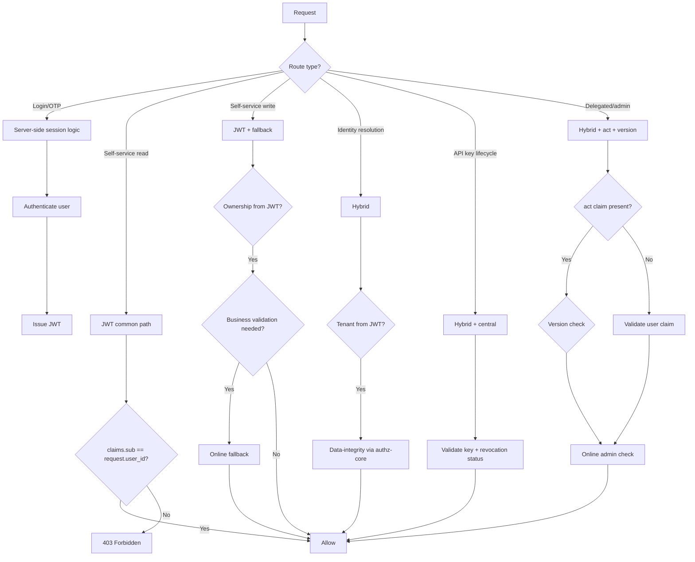
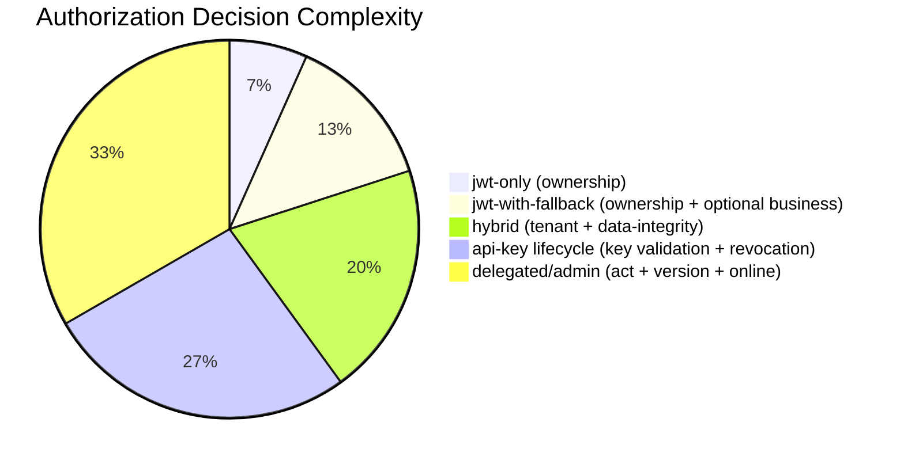

# Story 4.4: Implement Route-Specific Authorization Decisions

## Epic

[04-hybrid-authz-model](../hybrid.md)

## Parent Epic Story

Story 4.4

## Summary

Implement route-specific authorization decision logic for each of the five route types identified in the JWT document. This story defines the specific authorization strategy for each route type and implements the decision logic in the handlers.

## Why This Story Exists

The JWT document provides a decision matrix by endpoint type but doesn't specify the detailed authorization logic for each type. This story fills that gap by defining the exact decision logic for each route type.

## Design Context

### Route Type Strategies

| Route Type | Strategy | Decision Logic |
|------------|----------|---------------|
| **Login, callback, OTP** | Server-side/session logic | Not JWT common-path -- these routes CREATE trust, don't evaluate it |
| **Self-service reads** | JWT common path | Ownership check: claims.sub == request.user_id |
| **Self-service low-risk writes** | JWT + optional fallback | Ownership check from JWT, business validation via online fallback |
| **Identity resolution** | Hybrid | Cross-service hot paths need freshness -- validate tenant from JWT, call authz-core for data-integrity |
| **API key lifecycle** | Hybrid, leaning central | Validate tenant from JWT, call authz-core for revocation freshness |
| **Delegated/admin** | Hybrid with `act`, step-up, version | Validate `act` claim, check version, call authz-core |

### Implementation by Route Type

#### Login, Callback, OTP (Not Authz-Protected)

These routes are **not protected by JWT common-path authz** because they CREATE trust, not evaluate it:

```rust
// Login routes are not in the JWT middleware -- they are handled separately
async fn handle_login(request: LoginRequest) -> Result<LoginResponse, AuthError> {
    // 1. Authenticate user (password, MFA, OAuth)
    // 2. Call authz-core /principal/effective for JWT claim enrichment
    // 3. Sign and return JWT
    // 4. Store session in Redis + PG
}
```

No authorization check is needed at login time -- authentication IS the authorization.

#### Self-Service Reads (jwt-only)

```rust
async fn handle_get_users_me(
    claims: AccessClaims,  // From JWT middleware
) -> Result<UserProfile, AuthError> {
    // Ownership check: claims.sub == user_id in request context
    if claims.sub != request.user_id {
        return Err(AuthError::Forbidden);
    }
    
    // Fetch user profile from database (tenant-scoped)
    let profile = user_repo.find_by_id(request.user_id).await?;
    Ok(profile)
}
```

**Decision logic**: claims.sub (from JWT) must match the requested user_id. This is a simple equality check -- no database call needed for authorization.

#### Self-Service Low-Risk Writes (jwt-with-fallback)

```rust
async fn handle_put_preferences(
    claims: AccessClaims,  // From JWT middleware
    body: PreferencesUpdate,
) -> Result<(), AuthError> {
    // 1. Ownership check from JWT claims
    if claims.sub != body.user_id {
        return Err(AuthError::Forbidden);
    }
    
    // 2. Tenant validation from JWT
    validate_tenant(&claims)?;
    
    // 3. Business validation via online fallback (if needed)
    // e.g., "Is this user's org allowed to have custom preferences?"
    if requires_business_validation(&body) {
        let auth_result = authz_client.authorize(AuthorizeRequest {
            user_id: claims.sub,
            org_id: claims.sx.tenant,
            action: "preferences:update",
            resource: body.resource_id,
        }).await?;
        
        if !auth_result.allowed {
            return Err(AuthError::Forbidden);
        }
    }
    
    // 4. Update preferences
    user_repo.update_preferences(body).await?;
    Ok(())
}
```

**Decision logic**: Ownership from JWT (fast), business validation via online fallback (slow, cached).

#### Identity Resolution (Hybrid)

```rust
async fn handle_email_upsert(
    claims: AccessClaims,  // From JWT middleware
    body: EmailUpsert,
) -> Result<EmailInfo, AuthError> {
    // 1. Validate tenant from JWT
    validate_tenant(&claims)?;
    
    // 2. Check if user has permission to upsert email
    if !claims.sx.permissions.contains(&"email:write".to_string()) {
        return Err(AuthError::Forbidden);
    }
    
    // 3. Data-integrity check via authz-core (always online)
    // Email is the "single source of truth" -- integrity must be verified
    let auth_result = authz_client.authorize(AuthorizeRequest {
        user_id: claims.sub,
        org_id: claims.sx.tenant,
        action: "email:upsert",
        resource: body.email,
    }).await?;
    
    if !auth_result.allowed {
        return Err(AuthError::Forbidden);
    }
    
    // 4. Upsert email
    email_repo.upsert(body).await?;
    Ok(email_repo.find_by_address(body.email).await?)
}
```

**Decision logic**: Tenant from JWT (fast), permission from JWT claims (fast), data-integrity via authz-core (always online, not cached).

#### API Key Lifecycle (Hybrid, Leaning Central)

```rust
async fn handle_api_key_validate(
    claims: AccessClaims,  // From JWT middleware (if API key is validated by JWT)
    body: ApiKeyValidation,
) -> Result<ApiKeyValidationResponse, AuthError> {
    // 1. Validate API key (hash lookup, not JWT)
    let key_data = api_key_repo.validate(&body.key).await?;
    
    // 2. Validate tenant match
    if key_data.tenant_id != claims.tenant_id {
        return Err(AuthError::TenantMismatch);
    }
    
    // 3. Check revocation status (always fresh -- no cache)
    if key_data.revoked {
        return Err(AuthError::ApiKeyRevoked);
    }
    
    // 4. Return validation result
    Ok(ApiKeyValidationResponse {
        valid: true,
        tenant_id: key_data.tenant_id,
        org_id: key_data.org_id,
        scope_type: key_data.scope_type,
        permissions: key_data.permissions,
    })
}
```

**Decision logic**: API key validation always requires fresh data (revocation status). JWT tenant context is validated but the actual key lookup is online.

#### Delegated/Admin Actions (Hybrid with act, step-up, version)

```rust
async fn handle_admin_action(
    claims: AccessClaims,  // From JWT middleware
    body: AdminAction,
) -> Result<AdminActionResult, AuthError> {
    // 1. Check for act claim (delegation)
    let actor = match &claims.act {
        Some(act) => act,
        None => &ActorClaim { sub: claims.sub.clone(), tenant: claims.tenant_id.clone(), portal: claims.sx.portal.clone() },
    };
    
    // 2. Version check (if elevated risk)
    if claims.sx.risk == Some("elevated".to_string()) {
        let current_ver = version_cache.get(actor.sub).await?;
        if claims.ver < current_ver {
            return Err(AuthError::StaleAuthToken);
        }
    }
    
    // 3. Admin permission check (always online for high-consequence actions)
    let auth_result = authz_client.authorize(AuthorizeRequest {
        user_id: actor.sub.clone(),
        org_id: actor.tenant.clone(),
        action: body.action,
        resource: body.resource_id,
    }).await?;
    
    if !auth_result.allowed {
        return Err(AuthError::Forbidden);
    }
    
    // 4. Execute action
    admin_repo.execute_action(body).await?;
    Ok(AdminActionResult { success: true })
}
```

**Decision logic**: JWT tenant/actor from claims, version check (fast), admin permission via authz-core (always online).

## Mermaid Diagrams

### Route-Specific Authorization Decision Tree



### Decision Complexity by Route Type



## Malicious Hacker Gotchas (Must Be Addressed During Implementation)

> **Source:** `docs/PRS_SECURITY_HARDENING.md` — Security threat model analysis

These are specific attack vectors identified during threat modeling. Each must be considered and mitigated during implementation. If a gotcha cannot be fully mitigated, document the residual risk.

### HACK-101: Tenant ID Validation Is Not Guaranteed (CRITICAL — Hole #5 from PRS)

**Risk:** Cross-tenant data exfiltration via X-Tenant-ID header manipulation

The wiki says: "Tenant validation is critical: `claims.tenant_id == X-Tenant-ID` — mismatch = 401." But this is listed as a *requirement*, not a *guaranteed implementation*. The middleware must enforce this as the FIRST step, BEFORE any handler logic.

**Exploit path:**
1. Attacker obtains a valid JWT from Tenant A (log leak, XSS, etc.)
2. Attacker sends requests with `X-Tenant-ID: Tenant B` header
3. If middleware doesn't strictly validate `claims.tenant_id == X-Tenant-ID`, queries run against Tenant B's data
4. RLS bridge may provide a safety net, but it is "partially-verified" and "actual RLS helper SQL is not yet in the repo"

**Implementation requirement (Story 4.2, but enforced by Story 4.4 route handlers):**
- Middleware MUST validate `claims.tenant_id == X-Tenant-ID` as the FIRST check after JWT signature validation
- Return 401 TenantMismatch on any mismatch — do NOT proceed to handler
- During migration from old schema (no `tenant` claim), resolve tenant from database using `sub`, then compare against header

**Acceptance criterion:** "Middleware enforces `claims.tenant_id == X-Tenant-ID` for ALL routes. Mismatch returns 401 TenantMismatch before handler execution."

### HACK-102: Permission Injection via JWT Claims (CRITICAL — Hole #7 from PRS)

**Risk:** Privilege escalation via forged/compromised JWT

The middleware validates the signature, then trusts `sx.permissions` as an authoritative list. The handler code checks `claims.sx.permissions.contains(&"email:write".to_string())`. If the signing key is compromised, or if there's a bug in the signing code, an attacker can craft a valid JWT with arbitrary permissions.

**Exploit path:**
1. Private signing key is compromised (memory dump, insider threat, server breach)
2. Attacker crafts JWT with `sx.permissions = ["admin:all", "users:manage", "api_keys:all"]`
3. Middleware validates signature — checks pass
4. Handler trusts the claim and executes the sensitive action
5. Result: full privilege escalation

**Implementation requirement (HIGH-CONSEQUENCE ROUTES ONLY):**
For the following high-consequence routes, always verify permissions against the canonical source (authz-core or database), EVEN if JWT claims suggest permission exists:
- `admin:create_org` (create organization)
- `org:config:update` (org configuration/SSO)
- `admin:impersonate` (user impersonation)
- `api_key:create` (M2M key creation)
- `api_key:revoke` (M2M key revocation)
- `role:assign` (role assignment/modification)

The JWT claims are a "common path optimization" for the 95% of requests. But for the 5% that are high-consequence, there MUST be a canonical source verification step.

**Acceptance criterion:** "For high-consequence routes (create_org, config:update, impersonate, api_key:create/revoke, role:assign), permissions are verified against authz-core or database, not solely from JWT claims."

### HACK-103: User Enumeration via Path-Parameter Lookups (HIGH — Hole #11 from PRS)

**Risk:** User enumeration and privacy breach

The ownership check `claims.sub == request.user_id` works for `/me` endpoints (implicit user ID). But for `/api/v1/identity/users/{user_id}`, the `user_id` comes from the URL path. An attacker with a valid JWT can request any user's profile by changing the path parameter.

**Exploit path:**
1. Attacker has a valid JWT with `sub: "alice"`
2. Attacker requests `GET /api/v1/identity/users/bob` (changing path parameter)
3. This endpoint is `jwt-with-fallback` (Identity Resolution)
4. Fallback calls authz-core — if authz-core allows same-org visibility, the request succeeds
5. Attacker can enumerate all users in the org by iterating user IDs
6. Result: user profiles (email, name, phone) exposed for all org members

**Implementation requirement:**
- Add rate limiting to user lookup endpoints to prevent enumeration (e.g., 100 req/min per user)
- Consider removing public user lookup endpoints entirely, or restricting to admin org members only
- Add explicit documentation: user lookups require same-org membership or admin permission
- Consider replacing with a search endpoint that returns limited fields (names only, no PII)

**Acceptance criterion:** "User lookup endpoint at `/users/{id}` enforces same-org membership or admin permission. Rate limiting prevents enumeration attacks."

### HACK-104: Version Check Gated on Elevated Risk Only (HIGH — Hole #8 from PRS)

**Risk:** Stale permissions on normal-risk routes

The version check is gated behind `sx.risk == "elevated"` (Delegated/Admin section). Normal routes (jwt-only, jwt-with-fallback for low-risk) SKIP version checks entirely. A revoked user can still act with stale permissions on ALL normal routes for the entire token TTL (5 minutes).

**Implementation requirement:**
- Apply version checks to ALL route types, not just elevated-risk ones
- Keep the cache optimization (version cache with 15-60s TTL) — this is the correct trade-off
- Consider a "soft fail-open": if version cache is empty, perform a lightweight DB check instead of skipping entirely

**Acceptance criterion:** "Version checks apply to ALL route types, not just elevated-risk ones. The risk classification gates MFA requirements (Story 6.3), not version validation."

### HACK-105: Authz-Core as Single Point of Failure (MEDIUM — Hole #12 from PRS)

**Risk:** Partial outage when authz-core is unavailable

If authz-core goes down:
- jwt-only routes continue working (reads only)
- jwt-with-fallback routes fail (503)
- online-only routes fail (503)
- New logins fail (cannot enrich JWT claims)

The design doesn't specify a "cache-only" degraded mode. After cache TTL expiry (5-30 seconds), all fallback-dependent routes fail.

**Implementation requirement:**
- Implement a "cache-only" fallback mode: serve from Redis cache even when authz-core is unavailable
- Implement circuit breaker pattern: if authz-core returns >10% errors, stop calling it
- Document degradation behavior: which routes work, which fail, and why
- Add monitoring: alert on authz-core downtime

### HACK-106: Login Endpoint No Rate Limiting (MEDIUM — Hole #6 from PRS)

**Risk:** authz-core DoS via login flooding

Login routes call authz-core `/principal/effective` for JWT claim enrichment. There is no rate limiting on login endpoints. An attacker can flood `/auth/login` to overwhelm authz-core.

**Implementation requirement (enforced at gateway level):**
- Add rate limiting: 10 req/min per IP for login endpoints
- Per-IP, per-email, and per-IP:email combinations
- Alert on login endpoint QPS exceeding threshold

---

## OpenAPI Changes

No OpenAPI changes. Route-specific authorization logic is internal to the handlers. The OpenAPI spec documents the API surface -- the authorization mechanism is an implementation detail.

## Design Doc References

- `design-doc.md` section 10.3: Hybrid Authorization Model -- route classification and decision matrix
- `design-doc.md` section 6.2: JWT Schema -- claims available for route-specific evaluation
- `design-doc.md` section 8.2: Login + JWT Enrichment Flow -- login is not authz-protected
- `topics/topic-hybrid-authz.md`: Document route-specific strategies
- `topics/topic-authorization-flow.md`: Update with route-specific logic

## Wiki Pages to Update/Create

- `topics/topic-hybrid-authz.md`: (new) Document route-specific strategies
- `topics/topic-login-flow.md`: Note login is not authz-protected
- `topics/topic-authorization-flow.md`: Update with decision logic per route type

## Acceptance Criteria

- [ ] Login/OTP routes are NOT protected by JWT common-path authz (they CREATE trust)
- [ ] Self-service read routes use jwt-only with ownership check (claims.sub == request.user_id)
- [ ] Self-service write routes use jwt-with-fallback with ownership + optional business validation
- [ ] Identity resolution routes use hybrid with tenant from JWT + data-integrity via authz-core
- [ ] API key lifecycle routes use hybrid with key validation + revocation check (always online)
- [ ] Delegated/admin routes use hybrid with act claim validation + version check + online admin check
- [ ] Each route type has documented authorization decision logic
- [ ] Unit tests verify: correct route type selection, ownership check, tenant validation, version check
- [ ] No route type uses the wrong authorization strategy (e.g., API key validation with jwt-only)

## Dependencies

- Depends on Story 4.2 (JWT common-path middleware)
- Depends on Story 4.1 (RoutePolicyStore with classified routes)
- Intersects with Story 4.3 (selective online fallback)

## Risk / Trade-offs

- **Route classification accuracy**: If a route is misclassified (e.g., a high-risk route is put in `jwt-only`), the authorization decision will be based solely on JWT claims without online verification. This could allow unauthorized access. The classification must be audited and reviewed for each route.
- **Decision logic complexity**: Each route type has different authorization logic. This adds code complexity in the handlers -- each handler must implement its own decision logic based on the route type. A generic decision framework could reduce complexity but adds abstraction overhead.
- **Online fallback for identity resolution**: Identity resolution routes (email/upsert, user lookup) always call authz-core for data-integrity. This defeats the purpose of the hybrid model for these routes (they are high-traffic cross-service endpoints). However, data-integrity cannot be compromised for performance -- the online check is intentional.

## Tests

### Unit Tests

- [ ] **Self-service read: ownership check passes**: Given `claims.sub = "user-123"` and `request.user_id = "user-123"`, assert `handle_get_users_me()` proceeds to fetch profile and returns `Ok(UserProfile)`
- [ ] **Self-service read: ownership check fails**: Given `claims.sub = "user-123"` and `request.user_id = "user-456"`, assert `handle_get_users_me()` returns `AuthError::Forbidden` without querying the database
- [ ] **Self-service write: ownership check passes**: Given `claims.sub = body.user_id`, assert `handle_put_preferences()` passes the ownership check and continues to business validation
- [ ] **Self-service write: ownership check fails**: Given `claims.sub != body.user_id`, assert `handle_put_preferences()` returns `AuthError::Forbidden` at the ownership check step (before any business validation or DB call)
- [ ] **Self-service write: business validation triggered**: Given a preferences update with custom settings that `requires_business_validation()` returns true for, assert `authz_client.authorize()` is called with `action: "preferences:update"`
- [ ] **Self-service write: business validation skipped**: Given a standard preferences update where `requires_business_validation()` returns false, assert `authz_client.authorize()` is NOT called (common path optimization)
- [ ] **Identity resolution: tenant validation from JWT**: Given `claims.sx.tenant = "tenant-abc"` and a valid JWT tenant claim, assert `handle_email_upsert()` passes tenant validation and proceeds to permission check
- [ ] **Identity resolution: missing permission denied**: Given `claims.sx.permissions` does not contain `"email:write"`, assert `handle_email_upsert()` returns `AuthError::Forbidden` without calling authz-core
- [ ] **Identity resolution: authz-core always called for data-integrity**: Given `claims.sx.permissions.contains("email:write")`, assert `authz_client.authorize()` is called with `action: "email:upsert"` and the result determines the final allow/deny
- [ ] **API key lifecycle: tenant mismatch rejected**: Given `key_data.tenant_id != claims.tenant_id`, assert `handle_api_key_validate()` returns `AuthError::TenantMismatch` without proceeding to revocation check
- [ ] **API key lifecycle: revoked key rejected**: Given `key_data.revoked == true`, assert `handle_api_key_validate()` returns `AuthError::ApiKeyRevoked`
- [ ] **API key lifecycle: valid key accepted**: Given a non-revoked key with matching tenant, assert `handle_api_key_validate()` returns `Ok(ApiKeyValidationResponse { valid: true, ... })`
- [ ] **Delegated action: act claim present**: Given `claims.act = Some(ActorClaim { sub: "support_tool" })`, assert the actor is extracted from `act.sub` and used for authorization decisions
- [ ] **Delegated action: no act claim uses user claim**: Given `claims.act = None`, assert the actor is derived from `claims.sub` (the user themselves) and no delegation is assumed
- [ ] **Delegated action: version mismatch rejected**: Given `claims.sx.risk = Some("elevated")` and `claims.ver < version_cache.get(actor.sub)`, assert `handle_admin_action()` returns `AuthError::StaleAuthToken`
- [ ] **Delegated action: normal risk skips version check**: Given `claims.sx.risk = Some("normal")` or `claims.sx.risk = None`, assert the version cache is NOT consulted (version check only for elevated risk)
- [ ] **Delegated action: admin permission always online**: Given a valid act claim and passing version check, assert `authz_client.authorize()` is always called with the admin action and resource context
- [ ] **Route classification: login routes NOT in middleware**: Assert that login endpoint patterns (`/auth/login`, `/auth/callback/*`, `/auth/verify/*`, `/auth/login/google`, `/auth/login/github`) are NOT classified as any middleware category (they are handled by server-side session logic, not JWT common-path)
- [ ] **Route classification: self-service reads are jwt-only**: Assert that `GET /api/v1/identity/users/me` and `GET /api/v1/identity/preferences` are classified as `jwt-only`
- [ ] **Route classification: identity resolution is hybrid**: Assert that `PUT /api/v1/identity/email/upsert` and `GET /api/v1/identity/users/{id}` are classified as requiring online fallback for data-integrity

### Integration Tests (BDD-style with `rstest_bdd`)

- [ ] **Scenario: Self-service read succeeds with valid JWT**: `given` user alice with valid JWT containing `sub: "alice"` → `when` a request to `GET /api/v1/identity/users/me` is made with `X-Tenant-ID: hauliage` → `then` the handler returns alice's profile without any call to authz-core
- [ ] **Scenario: Self-service read denied with different user ID**: `given` user alice with valid JWT containing `sub: "alice"` → `when` a request to `GET /api/v1/identity/users/me` is made requesting bob's profile → `then` the middleware returns 403 Forbidden before any database query
- [ ] **Scenario: Self-service low-risk write bypasses authz-core**: `given` user alice with `permissions: ["prefs:write"]` → `when` a PUT to `/api/v1/identity/preferences` with standard settings that `requires_business_validation() == false` → `then` authz-core is NOT called and the handler proceeds directly to database update
- [ ] **Scenario: Self-service low-risk write triggers authz-core**: `given` user alice with `permissions: ["prefs:write"]` → `when` a PUT to `/api/v1/identity/preferences` with custom settings that `requires_business_validation() == true` → `then` authz-core IS called and the decision gates the update
- [ ] **Scenario: Identity resolution always calls authz-core**: `given` user with `permissions: ["email:write"]` and valid JWT → `when` a PUT to `/api/v1/identity/email/upsert` is made → `then` authz-core IS called for data-integrity verification regardless of JWT claims (email is the single source of truth)
- [ ] **Scenario: API key validation with revoked key**: `given` an API key that has been revoked in the database → `when` a validation request is made → `then` the handler returns 401 ApiKeyRevoked with the correct tenant context
- [ ] **Scenario: Delegated action with act claim and version bump**: `given` a support tool with `act` claim and `ver: 42` → `when` an admin action is taken after the user's version was bumped to 43 → `then` the request returns 401 StaleAuthToken and the action is NOT executed
- [ ] **Scenario: Login route bypasses JWT common-path authz**: `given` a request to `POST /api/v1/identity/auth/login` with valid credentials → `when` the request is processed → `then` no JWT middleware evaluation occurs (login is handled by server-side session logic and results in JWT issuance, not JWT evaluation)
- [ ] **Scenario: Cross-tenant self-service read blocked**: `given` user alice from `Tenant A` with JWT → `when` a request is made to access a resource from `Tenant B` via `X-Tenant-ID: Tenant B` → `then` tenant validation fails at the middleware layer and 401 TenantMismatch is returned

### Security Regression Tests

- [ ] **Login routes cannot be used as JWT authz entry points**: Assert that an attacker who crafts a valid JWT for a login route (`/auth/login`) gains no authorization advantage -- the route handler does not evaluate JWT claims for authorization decisions (login CREATES trust, it doesn't evaluate it)
- [ ] **Ownership claim cannot be forged**: Assert that a client cannot modify `claims.sub` in the JWT to access another user's profile -- signature verification at step 1 of the validation pipeline rejects tampered tokens
- [ ] **Act claim cannot grant unauthorized admin access**: Assert that a user with `act` claim but insufficient roles/permissions cannot execute admin actions -- the online admin permission check at step 3 of delegated actions validates regardless of the `act` claim
- [ ] **Version check cannot be bypassed**: Assert that a client cannot remove `sx.risk` from the JWT to skip version validation for elevated-risk routes -- the `act` claim validation and admin permission check are always performed regardless of risk level
- [ ] **Tenant ID in JWT matches X-Tenant-ID header**: Assert that a client cannot send a JWT for `Tenant A` with a request header `X-Tenant-ID: Tenant B` -- the middleware validates tenant consistency and rejects mismatches
- [ ] **Email upsert always verifies via authz-core**: Assert that no amount of JWT claim enrichment (even `permissions: ["email:write"]`) bypasses the authz-core call for email upsert -- data-integrity is always verified online, even when JWT claims suggest permission exists

### Edge Cases

- [ ] **Self-service read with empty JWT claims**: Given a valid JWT where `sx.roles = []` and `sx.permissions = []`, assert the self-service read handler proceeds (empty roles/permissions do not block ownership-based authorization for read routes)
- [ ] **Delegated action with missing act claim fields**: Given `claims.act` is present but `sub` field is empty string, assert the handler returns a clear 400 error (not a panic or 500)
- [ ] **Version cache miss during version check**: Given `claims.sx.risk = Some("elevated")` but the version cache has no entry for the actor, assert the handler either allows the request (no version bump needed) or denies with a clear "version unknown" error -- not a database crash or cache panic
- [ ] **Concurrent requests with same ownership check**: 100 concurrent requests from the same JWT user to `GET /api/v1/identity/users/me` -- assert all 100 succeed without race conditions (ownership check is in-memory, thread-safe)
- [ ] **Self-service write with null body**: Given a PUT to `/api/v1/identity/preferences` with an empty or null request body, assert the handler returns 400 Bad Request before any authorization check is performed
- [ ] **Identity resolution with very long email address**: Given a PUT to `/api/v1/identity/email/upsert` with an email address exceeding 256 characters, assert the handler rejects with a validation error (not an authz-core timeout)
- [ ] **API key validation for expired key**: Given an API key whose expiration date has passed but `revoked == false`, assert the handler returns a 401 ExpiredKey error (distinct from ApiKeyRevoked)

### Cleanup

- In-memory `RoutePolicyStore` used in tests must be created fresh per test scenario -- do not share state between tests
- Mock `authz_client` used in integration tests must be reset between scenarios (clear all recorded calls and response overrides)
- Redis state must be cleaned between tests if any fallback caching is tested -- use `FLUSHDB` or a unique Redis prefix per test run
- Database state created during integration tests (user profiles, preferences, emails, API keys) must be rolled back or cleaned using a test transaction rollback
- Metrics registry must be reset between test scenarios using `prometheus::Registry::new()` or equivalent to prevent cross-test metric contamination
- JWT signing/verification keys used in tests should be unique per test to prevent key collisions between concurrent test scenarios
- No files (YAML configs, test data) should be left in the filesystem after test runs -- use temporary directories or in-memory data structures
