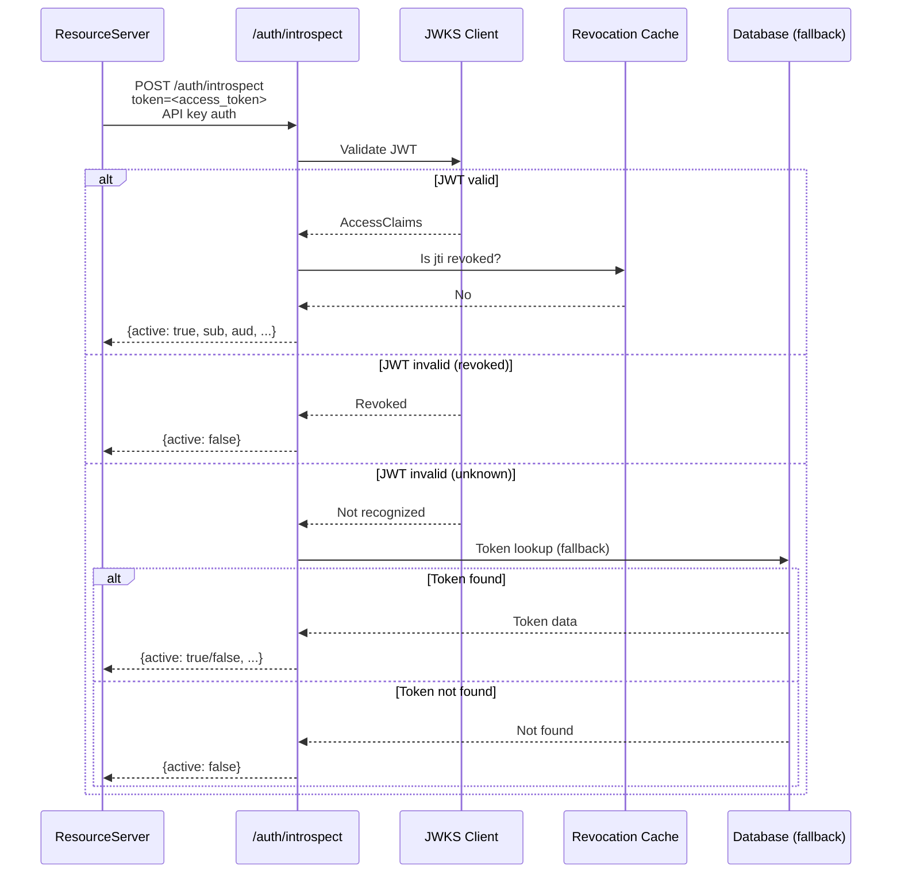
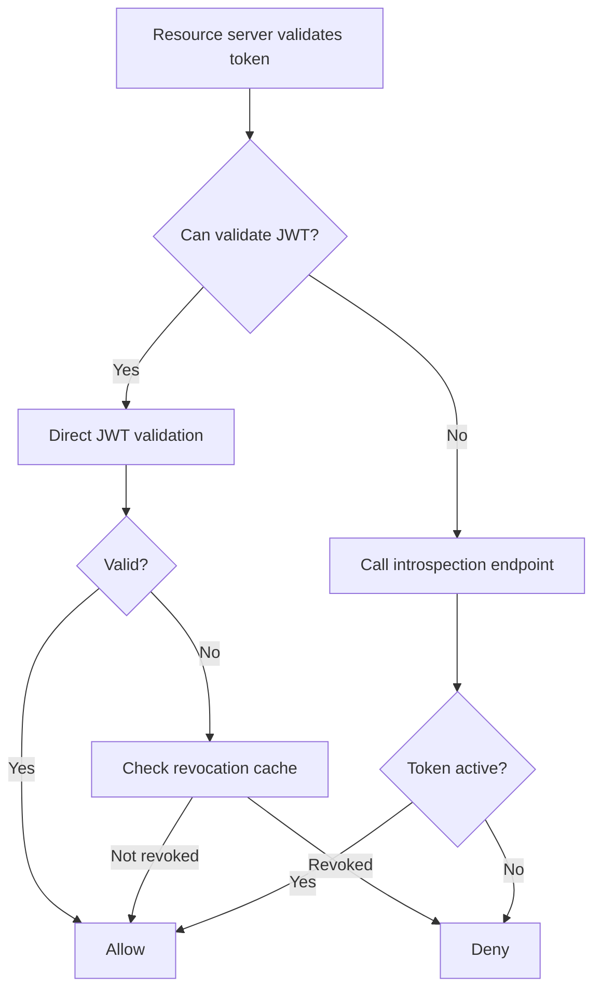

# Story 4.5: Implement RFC 7662 Introspection Endpoint

## Epic

[04-hybrid-authz-model](../hybrid.md)

## Parent Epic Story

Story 4.5

## Summary

Implement an RFC 7662-compatible introspection endpoint that provides a standards-based fallback for token validation. This is a standards-compliant way for resource servers to validate tokens online when JWT claims are insufficient or when immediate revocation awareness is needed.

## Why This Story Exists

The JWT document mentions RFC 7662 introspection as an optional future enhancement: "Not currently visible in public API. Can be added as a future enhancement." This story implements it as a standards-based fallback path.

## Design Context

### Current State

- No introspection endpoint exists
- No RFC 7662 compliance
- Online fallback is ad-hoc (authz-core `/authorize` endpoint)
- No standards-based token introspection

### RFC 7662 Introspection

RFC 7662 defines a standard introspection endpoint. The response format is:

```
POST /auth/introspect
Content-Type: application/x-www-form-urlencoded

token=<access_token>
token_type_hint=access_token    # optional
```

Response:

```json
{
  "active": true,
  "scope": "profile:read orders:write",
  "client_id": "web-portal",
  "username": "alice@example.com",
  "token_type": "Bearer",
  "exp": 1715003600,
  "iat": 1715000000,
  "sub": "user_abc123",
  "aud": ["myapp.com"],
  "iss": "https://idam.example.com",
  "jti": "tok_abc123"
}
```

### Introspection vs Direct JWT Validation

| Aspect | JWT Validation (Direct) | Introspection (RFC 7662) |
|--------|------------------------|-------------------------|
| Latency | Fast (signature check only) | Slow (database lookup) |
| Freshness | Bounded by token TTL | Real-time (checks revocation) |
| Scalability | High (stateless) | Low (per-token database call) |
| Use case | Common path (95%+ of requests) | Edge cases, high-risk, admin |

### Introspection Use Cases

1. **Resource servers without JWT validation**: Legacy services or third-party integrations that can't validate JWTs can call introspection instead
2. **Immediate revocation check**: When a resource server needs to know if a token is revoked RIGHT NOW (not just until it expires)
3. **Token exchange result validation**: After a token exchange, validate the new token
4. **Debugging**: When JWT validation fails, introspection can provide detailed rejection reasons

## Implementation Notes

### Introspection Endpoint

```yaml
# openapi/idam/identity-session-service/openapi.yaml
paths:
  /auth/introspect:
    post:
      summary: Token Introspection (RFC 7662)
      operationId: introspectToken
      description: |
        Introspect a token to determine its validity and claims.
        This is a standards-compliant fallback for resource servers
        that cannot validate JWTs directly.
      security:
        - ApiKeyHeader: []  # Introspection requires API key (client credentials)
      requestBody:
        required: true
        content:
          application/x-www-form-urlencoded:
            schema:
              type: object
              required: [token]
              properties:
                token:
                  type: string
                  description: The access token to introspect
                token_type_hint:
                  type: string
                  enum: [access_token, refresh_token]
                  description: Hint about the token type
      responses:
        '200':
          description: Token introspection result
          content:
            application/json:
              schema:
                $ref: '#/components/schemas/IntrospectionResponse'
        '401':
          description: Invalid introspection credentials
        '400':
          description: Invalid request
```

### Introspection Implementation

```rust
async fn handle_introspect(
    token: String,
    token_type_hint: Option<String>,
) -> Result<IntrospectionResponse, AuthError> {
    // 1. Try JWT validation first (fast path)
    let claims = match jwks_client.validate(&token).await {
        Ok(claims) => claims,
        Err(JwtError::Revoked) => {
            // Token was revoked -- still return active=false
            return Ok(IntrospectionResponse { active: false });
        }
        Err(_) => {
            // JWT validation failed -- fall back to database lookup
            // This handles tokens signed with a different algorithm
            // or tokens from a different issuer
        }
    };
    
    // 2. Check revocation status (always fresh)
    let is_revoked = revocation_cache.is_revoked(&claims.jti).await?;
    if is_revoked {
        return Ok(IntrospectionResponse { active: false });
    }
    
    // 3. Return introspection response
    Ok(IntrospectionResponse {
        active: true,
        scope: Some(claims.scope.clone()),
        client_id: Some(claims.client_id.clone()),
        username: None,  // Email is not in the token (PII removed)
        token_type: Some("Bearer".to_string()),
        exp: Some(claims.exp),
        iat: Some(claims.iat),
        sub: Some(claims.sub.clone()),
        aud: Some(claims.aud.clone()),
        iss: Some(claims.iss.clone()),
        jti: Some(claims.jti.clone()),
    })
}
```

### Security

- Introspection requires API key authentication (client credentials)
- Not accessible with Bearer tokens (introspection is a server-to-server endpoint)
- Rate limited to prevent abuse
- All introspection requests are logged (who introspected which token)

## Mermaid Diagrams

### Introspection Flow



### JWT Validation vs Introspection



## OpenAPI Changes

- Add `/auth/introspect` endpoint to identity-session-service spec
- Add `IntrospectionResponse` schema
- Add `token_type_hint` parameter to request

```yaml
components:
  schemas:
    IntrospectionResponse:
      type: object
      required: [active]
      properties:
        active:
          type: boolean
          description: Whether the token is active
        scope:
          type: string
          description: Scope of the token
        client_id:
          type: string
          description: Client ID that issued the token
        username:
          type: string
          description: Username (may be null)
        token_type:
          type: string
          example: Bearer
        exp:
          type: integer
          format: int64
          description: Expiration time
        iat:
          type: integer
          format: int64
          description: Issued at time
        sub:
          type: string
          description: Subject (user ID)
        aud:
          type: array
          items:
            type: string
          description: Audience
        iss:
          type: string
          description: Issuer
        jti:
          type: string
          description: JWT ID
```

## Design Doc References

- `design-doc.md` section 10.3: Hybrid Authorization Model -- RFC 7662 introspection (optional)
- `design-doc.md` section 10.1: Token Security -- introspection as a fallback
- `topics/topic-hybrid-authz.md`: Document introspection as an optional enhancement
- `topics/topic-token-lifecycle.md`: Document introspection in token lifecycle

## Wiki Pages to Update/Create

- `topics/topic-hybrid-authz.md`: (new) Document introspection endpoint
- `topics/topic-token-lifecycle.md`: Document introspection in token lifecycle

## Acceptance Criteria

- [ ] `/auth/introspect` endpoint is implemented per RFC 7662
- [ ] Response includes `active` boolean (required by RFC 7662)
- [ ] Response includes `sub`, `aud`, `iss`, `exp`, `iat`, `jti` (when active)
- [ ] Response includes `scope`, `client_id`, `token_type` (when available)
- [ ] Introspection requires API key authentication (not Bearer tokens)
- [ ] Introspection returns `active: false` for revoked tokens
- [ ] Introspection returns `active: false` for expired tokens
- [ ] Introspection returns `active: false` for invalid signatures
- [ ] Introspection is rate limited (e.g., 100 requests per minute per client)
- [ ] Metrics: `introspect_total{result: "active", "inactive"}` is emitted
- [ ] All introspection requests are logged (who introspected which token)

## Dependencies

- Depends on Story 1.3 (JWKS validation infrastructure)
- Optional enhancement -- can be implemented after the core hybrid model (Stories 4.1-4.4)

## Risk / Trade-offs

- **Introspection defeats the purpose of JWT common path**: If every resource server calls introspection instead of validating JWTs, the load reduction benefit is lost. Introspection should only be used for edge cases where JWT validation is not possible or immediate revocation is needed.
- **API key requirement**: Introspection requires API key authentication. This means the resource server must have an API key registered with Sesame. This adds onboarding complexity but is necessary to prevent unauthorized token introspection.
- **Rate limiting**: Without rate limiting, introspection can be abused (e.g., a malicious resource server introspecting millions of tokens). The rate limit (100 req/min per client) is a starting point that can be adjusted based on actual usage patterns.
