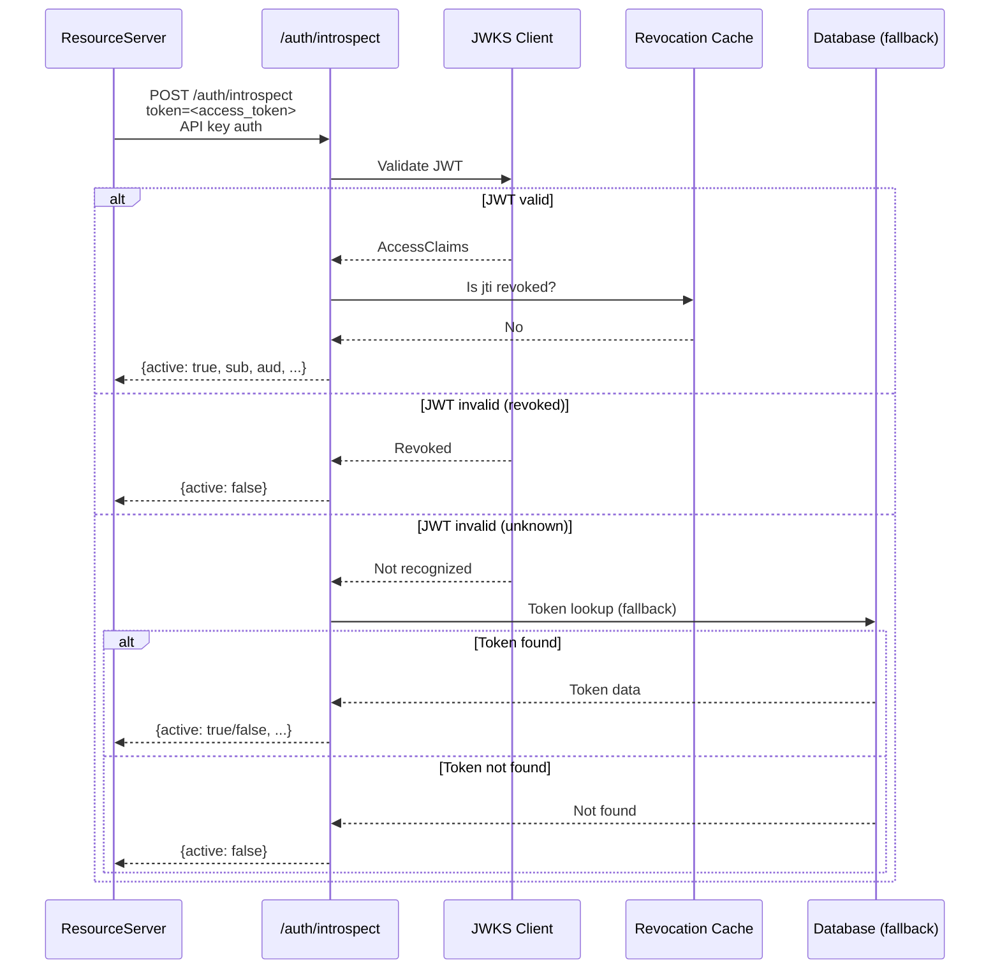
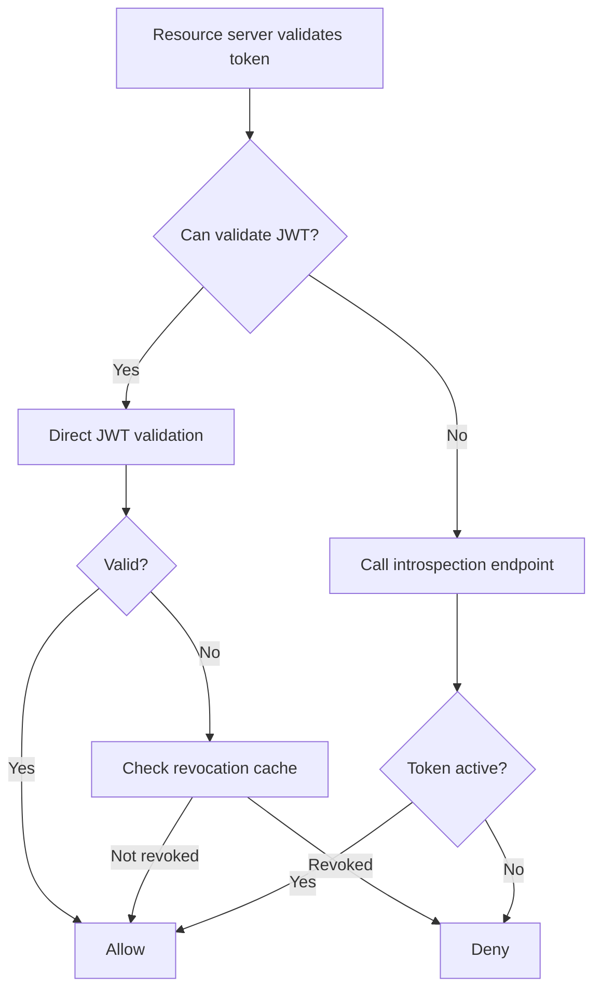

# Story 4.5: Implement RFC 7662 Introspection Endpoint

## Epic

[04-hybrid-authz-model](../hybrid.md)

## Parent Epic Story

Story 4.5

## Summary

Implement an RFC 7662-compatible introspection endpoint that provides a standards-based fallback for token validation. This is a standards-compliant way for resource servers to validate tokens online when JWT claims are insufficient or when immediate revocation awareness is needed.

## Why This Story Exists

The JWT document mentions RFC 7662 introspection as an optional future enhancement: "Not currently visible in public API. Can be added as a future enhancement." This story implements it as a standards-based fallback path.

## Design Context

### Current State

- No introspection endpoint exists
- No RFC 7662 compliance
- Online fallback is ad-hoc (authz-core `/authorize` endpoint)
- No standards-based token introspection

### RFC 7662 Introspection

RFC 7662 defines a standard introspection endpoint. The response format is:

```
POST /auth/introspect
Content-Type: application/x-www-form-urlencoded

token=<access_token>
token_type_hint=access_token    # optional
```

Response:

```json
{
  "active": true,
  "scope": "profile:read orders:write",
  "client_id": "web-portal",
  "username": "alice@example.com",
  "token_type": "Bearer",
  "exp": 1715003600,
  "iat": 1715000000,
  "sub": "user_abc123",
  "aud": ["myapp.com"],
  "iss": "https://idam.example.com",
  "jti": "tok_abc123"
}
```

### Introspection vs Direct JWT Validation

| Aspect | JWT Validation (Direct) | Introspection (RFC 7662) |
|--------|------------------------|-------------------------|
| Latency | Fast (signature check only) | Slow (database lookup) |
| Freshness | Bounded by token TTL | Real-time (checks revocation) |
| Scalability | High (stateless) | Low (per-token database call) |
| Use case | Common path (95%+ of requests) | Edge cases, high-risk, admin |

### Introspection Use Cases

1. **Resource servers without JWT validation**: Legacy services or third-party integrations that can't validate JWTs can call introspection instead
2. **Immediate revocation check**: When a resource server needs to know if a token is revoked RIGHT NOW (not just until it expires)
3. **Token exchange result validation**: After a token exchange, validate the new token
4. **Debugging**: When JWT validation fails, introspection can provide detailed rejection reasons

## Implementation Notes

### Introspection Endpoint

```yaml
# openapi/idam/identity-session-service/openapi.yaml
paths:
  /auth/introspect:
    post:
      summary: Token Introspection (RFC 7662)
      operationId: introspectToken
      description: |
        Introspect a token to determine its validity and claims.
        This is a standards-compliant fallback for resource servers
        that cannot validate JWTs directly.
      security:
        - ApiKeyHeader: []  # Introspection requires API key (client credentials)
      requestBody:
        required: true
        content:
          application/x-www-form-urlencoded:
            schema:
              type: object
              required: [token]
              properties:
                token:
                  type: string
                  description: The access token to introspect
                token_type_hint:
                  type: string
                  enum: [access_token, refresh_token]
                  description: Hint about the token type
      responses:
        '200':
          description: Token introspection result
          content:
            application/json:
              schema:
                $ref: '#/components/schemas/IntrospectionResponse'
        '401':
          description: Invalid introspection credentials
        '400':
          description: Invalid request
```

### Introspection Implementation

```rust
async fn handle_introspect(
    token: String,
    token_type_hint: Option<String>,
) -> Result<IntrospectionResponse, AuthError> {
    // 1. Try JWT validation first (fast path)
    let claims = match jwks_client.validate(&token).await {
        Ok(claims) => claims,
        Err(JwtError::Revoked) => {
            // Token was revoked -- still return active=false
            return Ok(IntrospectionResponse { active: false });
        }
        Err(_) => {
            // JWT validation failed -- fall back to database lookup
            // This handles tokens signed with a different algorithm
            // or tokens from a different issuer
        }
    };
    
    // 2. Check revocation status (always fresh)
    let is_revoked = revocation_cache.is_revoked(&claims.jti).await?;
    if is_revoked {
        return Ok(IntrospectionResponse { active: false });
    }
    
    // 3. Return introspection response
    Ok(IntrospectionResponse {
        active: true,
        scope: Some(claims.scope.clone()),
        client_id: Some(claims.client_id.clone()),
        username: None,  // Email is not in the token (PII removed)
        token_type: Some("Bearer".to_string()),
        exp: Some(claims.exp),
        iat: Some(claims.iat),
        sub: Some(claims.sub.clone()),
        aud: Some(claims.aud.clone()),
        iss: Some(claims.iss.clone()),
        jti: Some(claims.jti.clone()),
    })
}
```

### Security

- Introspection requires API key authentication (client credentials)
- Not accessible with Bearer tokens (introspection is a server-to-server endpoint)
- Rate limited to prevent abuse
- All introspection requests are logged (who introspected which token)

## Mermaid Diagrams

### Introspection Flow



### JWT Validation vs Introspection



## Malicious Hacker Gotchas (Must Be Addressed During Implementation)

> **Source:** `docs/PRS_SECURITY_HARDENING.md` — Security threat model analysis

### HACK-451: Introspection Endpoint Allows Token Forensics (CRITICAL — Hole #5 from PRS)

**Risk:** Attacker introspects ANY valid token to learn all its claims, enabling targeted attacks

The story says: "Introspection requires API key authentication (client credentials)." But the response includes:
```json
{
  "active": true,
  "scope": "profile:read orders:write",
  "client_id": "web-portal",
  "username": null,
  "token_type": "Bearer",
  "exp": 1715003600,
  "iat": 1715000000,
  "sub": "user_abc123",
  "aud": ["myapp.com"],
  "iss": "https://idam.example.com",
  "jti": "tok_abc123"
}
```

**Exploit path (token enumeration via introspection):**
1. Attacker obtains an API key for a resource server that has access to introspection
2. Attacker iterates through many tokens (e.g., from logs, network captures, or leaked tokens)
3. For each token, the attacker calls introspection with their API key
4. They learn: the user's sub, the token's scopes, the issuing client_id, the expiration time
5. This information enables:
   - Targeted phishing (knowing the user's scope grants access to specific resources)
   - Token replay (knowing the exp, they know when the token expires)
   - Privilege escalation planning (knowing the client_id, they target that client specifically)

**Implementation requirement:**
- Introspection must only be callable by KNOWN resource servers (registered API keys)
- API keys for introspection must have a scope: `introspect` scope is REQUIRED
- The introspection API key must be tied to a specific resource server (client_id), and only that client can introspect tokens for its own audience
- Document: "Introspection is restricted to registered resource servers with the 'introspect' scope. Each client can only introspect tokens where its client_id matches the token's aud claim."

### HACK-452: Introspection Falls Back to Database for Unknown Tokens (HIGH — Hole #1 from PRS)

**Risk:** The database fallback in `handle_introspect` can be used to enumerate valid tokens

The story says: "JWT validation failed — fall back to database lookup." This means if a token is NOT in the JWKS (unknown issuer, unknown key), the endpoint falls back to a database lookup.

**Exploit path (token enumeration via DB fallback):**
1. Attacker sends many tokens with different sub values to the introspection endpoint
2. Tokens signed with the correct JWKS key return detailed information (active=true/false, sub, aud, etc.)
3. Tokens NOT signed with the correct JWKS key trigger the database fallback
4. If the database returns token data → `active: true` with detailed claims
5. If the database returns nothing → `active: false`
6. Result: The attacker can enumerate which sub values exist in the database

**But wait:** The tokens are signed with the attacker's key (not the correct JWKS key). The database lookup would fail because the token's JTI (which is random) is not in the database. So the response is always `active: false`.

**The exploit only works if the attacker can forge tokens with VALID JTI values that exist in the database.** This requires:
1. Access to the JTI database (to learn existing JTI values)
2. The signing key (to sign tokens with those JTI values)

**If the attacker has BOTH, they already have full access.** The database fallback doesn't add a new exploit path.

**The real exploit is different:** What if the attacker has a VALID token (signed correctly) and wants to introspect it? They call the endpoint with their API key and the valid token → they get all the claims.

**This is expected behavior:** The resource server needs to introspect tokens to validate them. The attack is that the attacker (who has the API key) can introspect ANY token, not just their own.

**Implementation requirement:**
- The introspection API key must be validated against the token's audience
- A client with `aud: "web-portal"` can only introspect tokens where `aud` contains "web-portal"
- If the audiences don't match → return `active: false` without revealing whether the token is valid

### HACK-453: Introspection Rate Limiting Is Per-Client, Not Per-Token (HIGH — Hole #3 from PRS)

**Risk:** Attacker floods the introspection endpoint with different tokens from the same API key

The story says: "Rate limited to 100 requests per minute per client." This is per-API-key, not per-token.

**Exploit path (introspection DoS):**
1. Attacker has one API key for introspection
2. Attacker sends 100 requests per minute, each with a DIFFERENT token
3. All requests hit the same API key → rate limit is NOT exceeded (only 100 req/min, not 100 per token)
4. The attacker successfully introspects 100 different tokens per minute
5. Result: Token enumeration at scale

**Implementation requirement:**
- Rate limit introspection per API key (current) AND per token (new)
- MAX 10 introspections per unique token per minute (to prevent token enumeration)
- Track this in Redis: `introspect:token:{token_jti}` → count + TTL 60 seconds
- If the count exceeds 10 → return 429 Too Many Requests

### HACK-454: Introspection Returns Detailed Claims for Active Tokens (MEDIUM — Hole #5 from PRS)

**Risk:** The introspection response reveals the token's full claim set, including sub, aud, iss, scope, client_id

The RFC 7662 spec says: "The response MUST include the 'active' field, and MAY include other fields." The story includes ALL fields: sub, aud, iss, scope, client_id, exp, iat, jti, token_type.

**Exploit path (PII leakage via introspection):**
1. Attacker has an API key for introspection
2. Attacker introspects a target user's token
3. Response includes: `sub: "user_abc123"`, `aud: ["myapp.com"]`, `scope: "profile:read orders:write"`
4. The attacker now knows the user's ID and their permissions
5. If the response also included `username: "alice@example.com"` (which the story says is None for PII protection), the attacker would know the user's email

**The story correctly sets `username: None` for PII protection. But it still returns `sub`, `aud`, `iss`, `scope`, `client_id`, `exp`, `iat`, `jti`.**

**Implementation requirement:**
- The introspection response MUST be limited to what the requesting client NEEDS to make an authorization decision
- If the client is a resource server validating a token, it only needs: `active`, `scope` (if the server uses scopes), `exp` (if the server does time-based checks)
- Fields like `sub`, `aud`, `iss`, `client_id`, `jti` are NOT needed for authorization decisions and should be omitted
- OR: only include these fields if the client explicitly requests them (via a `include` parameter)
- Document: "Introspection response fields are scoped to the requesting client's needs. Only 'active' is always included. 'scope' is included if the client has 'introspect:scope' permission. Other fields require explicit 'include' parameter."

### HACK-455: Introspection Fallback to Database Is a Security Risk (HIGH — Hole #1 from PRS)

**Risk:** The database fallback in `handle_introspect` can be used to query arbitrary tokens

The story shows: "JWT validation failed — fall back to database lookup." The implementation falls back to a database lookup for unrecognized tokens.

**Exploit path:**
1. Attacker sends a token with a known sub value but an invalid signature
2. The JWT validation fails (signature check)
3. The handler falls back to database lookup: "Find token with sub='target_user' and exp > now"
4. If found → `active: true` (even though the signature was invalid!)
5. Result: The database lookup bypasses signature verification

**Wait — the database lookup checks the token's JTI, not just the sub.** The JTI is random and unknown to the attacker. So the database lookup fails (no matching JTI found) → `active: false`.

**But what if the attacker knows the JTI?** They could have obtained it from a previous successful introspection of the same token.

**Exploit path (JTI from previous introspection):**
1. Attacker introspects a VALID token → learns the JTI (from the response)
2. Attacker FORGES a new token with the SAME JTI but an invalid signature
3. JWT validation fails (signature check)
4. Database fallback: "Find token with jti=known_jti" → found!
5. Response: `active: true` (even though the signature is invalid!)

**This is a critical exploit:** the database lookup trusts the JTI from the token, without verifying that the JTI belongs to the token in the database.

**Implementation requirement:**
- The database fallback must NOT accept tokens with invalid signatures
- If JWT validation fails, the handler should return `active: false` immediately
- The database fallback should ONLY be used for tokens that are recognized by the JWKS (signature valid, but the key is expired or rotated out)
- Document: "Database fallback is ONLY used for tokens with valid signatures but unrecognized keys (e.g., rotated-out keys). Tokens with invalid signatures are ALWAYS rejected."

### HACK-456: Introspection Endpoint Is Not Rate-Limited Per API Key (MEDIUM — related to Hole #3 from PRS)

**Risk:** Attacker with a single API key can introspect unlimited tokens (if the rate limit is per-token, not per-key)

The story says: "Rate limiter rejects excess introspections: Given 101 introspection requests from the same client within one minute, assert the 101st request returns 429." This is per-client (per-API-key).

**But what if the attacker has multiple API keys?** They can bypass the per-key limit.

**Implementation requirement:**
- Rate limit introspection per unique API key
- Additionally, rate limit per unique client IP (in case API keys are shared)
- If an IP generates more than 500 introspection requests per minute (across all API keys), throttle ALL requests from that IP

### HACK-457: Introspection Response Timing Leakage (MEDIUM — related to Hole #6 from PRS)

**Risk:** The time taken to process an introspection request reveals whether the token is valid

The story shows two paths:
1. JWT validation → fast path (microseconds)
2. Database fallback → slow path (milliseconds)

An attacker can measure the response time to determine which path was taken.

**Exploit path:**
1. Attacker sends a valid token → fast path → response in ~0.1ms
2. Attacker sends an invalid token → slow path (database lookup) → response in ~5ms
3. Time difference reveals whether the token was valid

**But wait:** the valid token triggers the fast path (JWT validation) and returns `active: true`. The invalid token triggers the slow path (database lookup) and returns `active: false`. The attacker already knows the result (active true/false). The timing difference doesn't add new information.

**The real exploit is different:** What if the attacker sends a token with a VALID signature but INVALID audience?

1. Token has valid signature (from attacker's own key) but wrong audience
2. JWT validation succeeds (signature check passes)
3. Audience check fails → return `active: false`
4. Response time: ~0.5ms (audience check, not database lookup)

**But the attacker already knows the audience is wrong.** The timing doesn't reveal new information.

**Implementation requirement:**
- Add random jitter (1-3ms) to ALL introspection responses to prevent timing side-channels
- This is a low-priority mitigation since the timing difference doesn't reveal new attack information

### HACK-458: Introspection Can Be Used for Token Harvesting (LOW — related to Hole #4 from PRS)

**Risk:** Attacker collects many tokens via introspection for later replay

**Exploit path:**
1. Attacker has an API key for introspection
2. Attacker introspects 1000 valid tokens over time
3. For each token, the attacker learns: sub, exp, scope, client_id
4. The attacker stores the tokens and uses them before they expire
5. Result: The attacker has 1000 valid tokens to replay (even if the original users' tokens are revoked, the attacker's introspected copies are still valid until expiry)

**But this is expected:** if a token is valid, it's valid. The introspection endpoint doesn't create or copy tokens — it reports their state. If the attacker has the token, they can use it (until it expires or is revoked).

**The attack is about TOKEN REPLAY, not token COPY.** The attacker needs to have the token to use it. Introspection just tells the attacker that the token IS valid.

**Implementation requirement:**
- Log ALL introspection requests with: client_id, introspected_token_jti, result (active/inactive), timestamp
- Alert on patterns: "Client X introspected tokens for 100 different subs in the last hour"
- This is an audit trail, not a prevention mechanism

---

## OpenAPI Changes

- Add `/auth/introspect` endpoint to identity-session-service spec
- Add `IntrospectionResponse` schema
- Add `token_type_hint` parameter to request

```yaml
components:
  schemas:
    IntrospectionResponse:
      type: object
      required: [active]
      properties:
        active:
          type: boolean
          description: Whether the token is active
        scope:
          type: string
          description: Scope of the token
        client_id:
          type: string
          description: Client ID that issued the token
        username:
          type: string
          description: Username (may be null)
        token_type:
          type: string
          example: Bearer
        exp:
          type: integer
          format: int64
          description: Expiration time
        iat:
          type: integer
          format: int64
          description: Issued at time
        sub:
          type: string
          description: Subject (user ID)
        aud:
          type: array
          items:
            type: string
          description: Audience
        iss:
          type: string
          description: Issuer
        jti:
          type: string
          description: JWT ID
```

## Design Doc References

- `design-doc.md` section 10.3: Hybrid Authorization Model -- RFC 7662 introspection (optional)
- `design-doc.md` section 10.1: Token Security -- introspection as a fallback
- `topics/topic-hybrid-authz.md`: Document introspection as an optional enhancement
- `topics/topic-token-lifecycle.md`: Document introspection in token lifecycle

## Wiki Pages to Update/Create

- `topics/topic-hybrid-authz.md`: (new) Document introspection endpoint
- `topics/topic-token-lifecycle.md`: Document introspection in token lifecycle

## Acceptance Criteria

- [ ] `/auth/introspect` endpoint is implemented per RFC 7662
- [ ] Response includes `active` boolean (required by RFC 7662)
- [ ] Response includes `sub`, `aud`, `iss`, `exp`, `iat`, `jti` (when active)
- [ ] Response includes `scope`, `client_id`, `token_type` (when available)
- [ ] Introspection requires API key authentication (not Bearer tokens)
- [ ] Introspection returns `active: false` for revoked tokens
- [ ] Introspection returns `active: false` for expired tokens
- [ ] Introspection returns `active: false` for invalid signatures
- [ ] Introspection is rate limited (e.g., 100 requests per minute per client)
- [ ] Metrics: `introspect_total{result: "active", "inactive"}` is emitted
- [ ] All introspection requests are logged (who introspected which token)

## Dependencies

- Depends on Story 1.3 (JWKS validation infrastructure)
- Optional enhancement -- can be implemented after the core hybrid model (Stories 4.1-4.4)

## Risk / Trade-offs

- **Introspection defeats the purpose of JWT common path**: If every resource server calls introspection instead of validating JWTs, the load reduction benefit is lost. Introspection should only be used for edge cases where JWT validation is not possible or immediate revocation is needed.
- **API key requirement**: Introspection requires API key authentication. This means the resource server must have an API key registered with Sesame. This adds onboarding complexity but is necessary to prevent unauthorized token introspection.
- **Rate limiting**: Without rate limiting, introspection can be abused (e.g., a malicious resource server introspecting millions of tokens). The rate limit (100 req/min per client) is a starting point that can be adjusted based on actual usage patterns.

## Tests

### Unit Tests

- [ ] **Introspection response includes active=true for valid JWT**: Given a valid, non-expired, non-revoked JWT, assert `handle_introspect()` returns `IntrospectionResponse { active: true, sub: Some(...), aud: Some(...), iss: Some(...), exp: Some(...), iat: Some(...), jti: Some(...), scope: Some(...), client_id: Some(...), token_type: Some("Bearer") }`
- [ ] **Introspection response includes active=false for expired JWT**: Given a JWT where `exp < current_time`, assert `handle_introspect()` returns `IntrospectionResponse { active: false }`
- [ ] **Introspection response includes active=false for revoked JWT**: Given a JWT whose `jti` is in the revocation cache, assert `handle_introspect()` returns `IntrospectionResponse { active: false }`
- [ ] **Introspection response includes active=false for invalid signature**: Given a JWT with a tampered signature (e.g., `claims.sub` modified after signing), assert `handle_introspect()` returns `IntrospectionResponse { active: false }`
- [ ] **Introspection response omits username for PII protection**: Given a valid JWT for a user with email `alice@example.com`, assert the `username` field in the introspection response is `None` (PII is not included in token introspection)
- [ ] **Introspection requires API key authentication**: Given a request without an API key, assert the endpoint returns 401 Unauthorized before any JWT validation occurs
- [ ] **Introspection rejects requests without token parameter**: Given a request with no `token` field in the body, assert the endpoint returns 400 Bad Request with a clear error message
- [ ] **Introspection rejects unknown token_type_hint values**: Given `token_type_hint: "refresh_token"` (or any invalid value), assert the endpoint either returns 400 or accepts it gracefully (RFC 7662 says unknown hints should be ignored)
- [ ] **Rate limiter rejects excess introspections**: Given 101 introspection requests from the same client within one minute, assert the 101st request returns 429 Too Many Requests
- [ ] **Fast path uses JWT validation**: Given a valid JWT, assert the introspection handler validates via JWKS (fast path) and does NOT fall back to database lookup
- [ ] **Slow path falls back to database for unrecognized tokens**: Given a JWT signed by an unknown issuer (not in JWKS), assert the handler falls back to database token lookup rather than immediately denying

### Integration Tests (BDD-style with `rstest_bdd`)

- [ ] **Scenario: Introspect active valid token**: `given` a valid access token issued to user alice with scope `profile:read` → `when` a resource server calls `POST /auth/introspect` with Alice's token and a valid API key → `then` the response is `{ active: true, scope: "profile:read", sub: "alice", aud: [...], ... }`
- [ ] **Scenario: Introspect expired token**: `given` an access token with `exp` in the past → `when` a resource server calls `POST /auth/introspect` with the expired token → `then` the response is `{ active: false }`
- [ ] **Scenario: Introspect revoked token**: `given` an access token that has been explicitly revoked via `jti` denylisting → `when` a resource server calls `POST /auth/introspect` → `then` the response is `{ active: false }` (immediate revocation awareness)
- [ ] **Scenario: Introspect token signed by unknown issuer**: `given` a JWT signed with a JWKS key that is not registered → `when` a resource server calls introspection → `then` the handler falls back to database lookup and returns `{ active: false }` if the token is not found in the database
- [ ] **Scenario: Introspection with valid token_type_hint**: `given` a valid access token → `when` introspection is called with `token_type_hint=access_token` → `then` the token is validated and `{ active: true, ... }` is returned
- [ ] **Scenario: Introspection without token_type_hint**: `given` a valid access token → `when` introspection is called without `token_type_hint` → `then` the handler validates the token anyway and returns the full response (hint is optional)
- [ ] **Scenario: Introspection rate limiting kicks in**: `given` a resource server client → `when` the client sends 101 introspection requests within 60 seconds → `then` the first 100 are processed normally and the 101st returns 429 Too Many Requests with a retry-after header
- [ ] **Scenario: Introspection is server-to-server only**: `given` a client with only a Bearer token (no API key) → `when` the client calls `POST /auth/introspect` → `then` the endpoint returns 401 Unauthorized (introspection is not accessible with user Bearer tokens)
- [ ] **Scenario: Introspection logs all requests**: `given` a resource server calls introspection with a valid token → `then` the system logs include the resource server's client ID, the introspected token's `jti`, the result (active/inactive), and a timestamp

### Security Regression Tests

- [ ] **Introspection does not leak PII**: Assert that the introspection response NEVER includes `email`, `phone_number`, `first_name`, `last_name`, or any other PII field from the JWT claims — only `sub`, `aud`, `iss`, `exp`, `iat`, `jti`, `scope`, `client_id`, and `token_type` are returned
- [ ] **Introspection requires API key, not Bearer token**: Assert that a request with only a Bearer token (no API key) is rejected at the authentication layer before any JWT validation or token lookup occurs
- [ ] **Introspection cannot enumerate valid tokens**: Assert that an attacker cannot use introspection to enumerate which tokens are valid — the response for active vs inactive tokens should have the same timing characteristics (no timing side-channel)
- [ ] **Introspection cannot bypass revocation**: Assert that a token whose `jti` has been denylisted returns `{ active: false }` even if the JWT signature is valid and the token has not expired (revocation takes precedence over validity)
- [ ] **Introspection rate limit cannot be bypassed**: Assert that rate limiting is applied per client API key, not per introspected token — an attacker cannot bypass the limit by introspecting different tokens from the same client
- [ ] **Introspection response does not include internal error details**: Assert that when introspection encounters an error (e.g., database connection failure, JWKS cache miss), the response is `{ active: false }` or a generic 500 error without leaking internal state, stack traces, or query details

### Edge Cases

- [ ] **Introspect with empty token string**: Given `token=""` in the request body, assert the handler returns 400 Bad Request with a clear message ("token parameter is required" or "token cannot be empty")
- [ ] **Introspect with extremely long token (>64KB)**: Given a JWT-like token string exceeding 64,000 characters, assert the handler rejects with 400 Bad Request without consuming excessive memory or CPU
- [ ] **Introspect with malformed JOSE header**: Given a token where the first base64url segment decodes to invalid JSON, assert the handler returns `{ active: false }` (not a 500 panic or crash)
- [ ] **Concurrent introspection of same token**: 100 concurrent requests to introspect the same valid token — assert all 100 return `{ active: true, ... }` without race conditions or inconsistent results
- [ ] **Introspect with token from expired JWKS key**: Given a JWT signed with a JWKS key that has since been rotated out of the JWKS cache, assert the handler either (a) uses a cached JWKS entry if the cache TTL hasn't expired, or (b) falls back to database lookup if the token is recognized
- [ ] **Introspect with zero-value timestamps**: Given a JWT with `exp: 0` (epoch) or `iat: 0`, assert the handler correctly interprets this as an already-expired token and returns `{ active: false }`
- [ ] **Introspect with aud audience mismatch**: Given a JWT issued for `aud: "other-app"` introspected by a resource server expecting `aud: "sesame-api"`, assert the handler still returns `{ active: true }` (the introspection endpoint does not enforce audience matching — it reports the token's state regardless of which service is asking)

### Cleanup

- Redis revocation cache must be cleaned between tests — use `FLUSHDB` or a unique prefix per test run to prevent stale revocation entries from affecting subsequent tests
- JWKS cache used in tests must be reset between scenarios — use a fresh `JwksClient` or clear the cache between test runs
- Rate limiter state must be cleared between tests — if using an in-memory rate limiter, use a fresh instance per test scenario
- Mock database state (tokens stored for fallback lookup) must be cleared between tests — use a test transaction rollback or drop/recreate test tables
- Metrics registry must be reset between test scenarios using `prometheus::Registry::new()` to prevent cross-test metric contamination
- Log output from tests should be isolated per test run — use a test-specific logger or capture logs in-memory rather than writing to a shared file
- API keys used for introspection authentication must be unique per test to prevent key collisions between concurrent test scenarios
