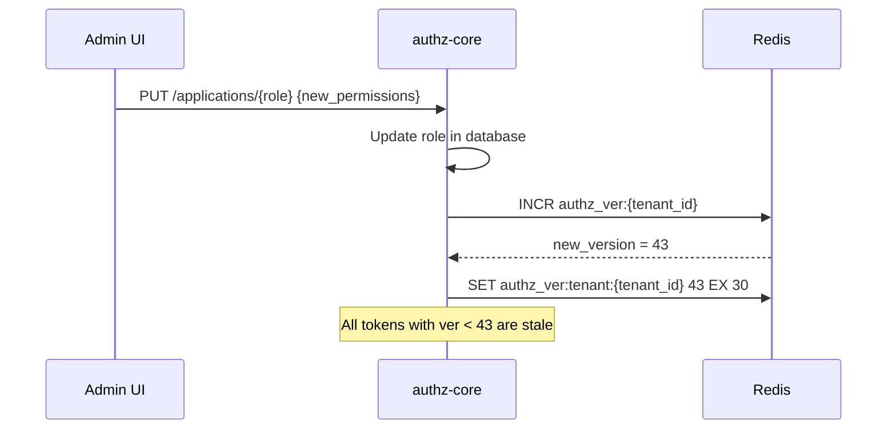
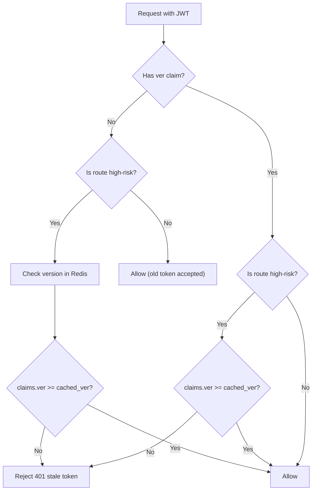

# Story 5.1: Add Token Version Claim

## Epic

[05-token-versioning](../versioning.md)

## Parent Epic Story

Story 5.1

## Summary

Add the `ver` (token version) claim to the JWT schema and implement per-subject version tracking. This is the foundation for instant privilege invalidation without relying solely on short token TTLs.

## Why This Story Exists

The JWT document identifies "stale permissions" as the primary trade-off of self-contained JWTs: "If a token is self-contained and valid for ten minutes, then any authorisation fact embedded in it can be stale for up to ten minutes unless you add version checks." Token versioning bridges the gap between short-lived tokens and immediate revocation.

## Design Context

### Current State

- No `ver` claim in JWT
- No per-subject version tracking
- Revocation relies solely on short TTLs and jti denylisting

### Token Version Design

The `ver` claim is a monotonically increasing integer per subject (and optionally per tenant):

```json
{
  "ver": 42,
  "sid": "ses_01JV8W..."
}
```

- `ver` = token version (monotonically increasing)
- `sid` = session ID (identifies which session this token belongs to)

### Version Storage

| Key | Type | TTL | Purpose |
|-----|------|-----|---------|
| `authz_ver:{sub}` | String | 15-60 seconds | Current version for subject |
| `authz_ver:tenant:{tenant_id}` | String | 15-60 seconds | Current version for tenant |

On token issue:
1. Read current version from `authz_ver:{sub}` (default 0 if not found)
2. Increment: `new_ver = current_ver + 1`
3. Store: `SET authz_ver:{sub} new_ver EX 30` (30-second TTL)
4. Include `ver` and `sid` in the JWT

On token validation:
1. Read cached version: `GET authz_ver:{sub}`
2. If `claims.ver < cached_ver`: reject with "stale authz snapshot"
3. If `claims.ver >= cached_ver`: allow

## Mermaid Diagrams

### Version Bump on Authz Change



### Version Validation on Token Access



### Version Lifecycle

```mermaid
gantt
    title Token Version Lifecycle
    dateFormat X
    axisFormat %s
    section Version 41
    Token issued (ver=41)   :0, 300
    Version bumped to 42    :100, 0
    Version bumped to 43    :200, 0
    section Version 42
    Token issued (ver=42)   :100, 300
    section Version 43
    Token issued (ver=43)   :200, 300
```



## OpenAPI Changes

- `LoginResponse` schema: Add `token_version` field
- No changes to request schemas needed

```yaml
components:
  schemas:
    LoginResponse:
      properties:
        token_version:
          type: integer
          format: int64
          description: Monotonically increasing token version (for revocation)
```

## Design Doc References

- `design-doc.md` section 10.1: Token Security -- "Token versioning: Monotonically increasing `ver` claim per subject and per tenant"
- `design-doc.md` section 10.4: Token Versioning & Revocation -- Layer 3: per-subject or per-tenant token versioning
- `design-doc.md` section 6.2: JWT Schema -- `ver` claim in standard claims table

## Wiki Pages to Update/Create

- `topics/topic-token-versioning.md`: (new) Document version claim
- `topics/topic-jwt-schema.md`: Add `ver` claim

## Malicious Hacker Gotchas (Must Be Addressed During Implementation)

> **Source:** `docs/PRS_SECURITY_HARDENING.md` — Security threat model analysis

These are specific attack vectors identified during threat modeling. Each must be considered and mitigated during implementation. If a gotcha cannot be fully mitigated, document the residual risk.

### HACK-501: Version Check FAILS OPEN When Redis Is Down (CRITICAL — Hole #8 from PRS)

**Risk:** Stale permissions persist when Redis is unavailable

The Risk/Trade-offs section says: "If Redis is down, the version check is skipped (fail open)." This is the single most dangerous design decision in the entire system. It means that when Redis is down — whether due to outage, network partition, or deliberate attack — ALL version checks are bypassed, and stale tokens with old permissions continue to work indefinitely (until their 5-minute TTL expires).

**Exploit path (targeted):**
1. Attacker identifies the tenant's Redis instance
2. Attacker disrupts Redis (DoS, network isolation, or exploits a known vulnerability)
3. Version checks are bypassed (fail open)
4. Attacker uses a stale token with elevated permissions (e.g., admin token that was demoted)
5. Result: full privilege escalation for up to 5 minutes (token TTL)

**Exploit path (opportunistic):**
1. Attacker obtains a token before a permission change (ver=42)
2. Admin revokes the attacker's permissions (version bumped to 43)
3. Attacker waits for Redis to go down (or exploits an outage condition)
4. Attacker's token with ver=42 passes validation (version check skipped)
5. Result: attacker retains elevated access

**Why this is critical:** The version check is the ONLY mechanism that provides "instant" revocation. Without it, we fall back to relying solely on token TTL (5 minutes). A 5-minute window for stale admin permissions is unacceptable.

**Implementation requirement:**
- Change the fail-open behavior to fail-CLOSED: when Redis is unavailable, reject the request with 503 Service Unavailable (not 200 OK)
- Document: "When Redis is unavailable during version validation, the request is rejected with 503. This ensures stale permissions cannot be used when the version source is unavailable."
- Alternative: implement a "lightweight fallback" — when Redis is down, perform a database lookup for the current version. This adds DB cost but is safer than fail-open.
- NEVER fail open on version check — this is a security-critical check, not an optimization

**Acceptance criterion to change:**
- "Redis failure does not cause privilege escalation" → "Redis failure causes 503 rejection, NOT 200 OK with stale permissions"

### HACK-502: Version Cache TTL Too Short — Legitimate Users Kicked Out (HIGH — Hole #14 from PRS)

**Risk:** High-availability users are denied access due to version cache expiry

The version cache TTL is 15-60 seconds. If the TTL expires, the next request checks Redis, gets the current version, and allows the request. BUT: if the user's token version is lower than the cached version (because authz changed while their token was in the cache), the user is rejected with "stale token" — even though they haven't been revoked.

**Exploit path:**
1. User has a token with ver=42 (issued at T=0, TTL=300s)
2. At T=10, admin revokes user's permissions → version bumped to 43
3. At T=15, version cache for this user expires (60s TTL)
4. At T=20, user makes a request → Redis returns ver=43
5. User's token has ver=42 < 43 → REJECTED
6. Result: user is kicked out even though they haven't re-authenticated

**Wait, this is correct behavior!** The user SHOULD be rejected if their permissions were revoked. The problem is different:

**Real exploit (race condition):**
1. User has ver=42
2. At T=10, admin revokes permissions → version bumped to 43
3. At T=10.5, another admin grants permissions back → version bumped to 44
4. User makes request at T=20 → Redis returns ver=44
5. User's token ver=42 < 44 → REJECTED
6. But the user HAS permissions (they were granted back at T=10.5)!
7. Result: false denial — the version check is correct, but the user has no way to know their permissions were restored

**Implementation requirement:**
- When a user is rejected for stale version, the response MUST include actionable guidance: "Your authentication session is stale. Please re-authenticate to continue."
- Do NOT include the technical reason ("ver 42 < 43") in the error message — it leaks internal state
- Document: "Version check uses a fail-close model. Users must re-authenticate when their token version is stale."

### HACK-503: Version Check Is NOT Applied to jwt-only Routes (HIGH — Hole #14 from PRS)

**Risk:** jwt-only routes have NO version check at all

Looking at the flowchart in Story 5.1:
```
B -->|jwt-only| D[Evaluate JWT claims]
D --> E{Tenant match?}
E -->|Yes| G{Roles/permissions allow?}
G -->|Yes| I[200 OK]
```

The version check (F) is ONLY for high-risk routes. jwt-only routes skip the version check entirely. This means:
- A user's token is verified for roles/permissions
- But the version is NEVER checked
- If the user was demoted (version bumped), their old token (with old permissions) still works for ALL jwt-only routes

**Exploit path:**
1. User has admin role (ver=42)
2. Admin revokes admin role (version bumped to 43)
3. User makes a jwt-only request (e.g., GET /api/users/me)
4. Middleware checks `claims.sx.roles` — the old token still says `["admin"]`
5. No version check is performed → request is ALLOWED
6. Result: revoked admin can still access admin-only jwt-only routes for up to 5 minutes

**This is the most common attack path:** an attacker who obtains a valid JWT (from XSS, network intercept, etc.) can use it for ALL jwt-only routes for the entire 5-minute TTL, even if their permissions were revoked.

**Implementation requirement:**
- The version check MUST be applied to ALL route types, not just high-risk ones
- OR the jwt-only routes MUST include the version check as part of their evaluation:
```rust
fn evaluate_jwt_only(...) -> AuthDecision {
    // 1. Tenant validation
    validate_tenant(claims, request)?;
    
    // 2. VERSION CHECK (CRITICAL — must apply to ALL routes)
    let cached_ver = redis.get_authz_ver(claims.sub).unwrap_or_default();
    if claims.ver < cached_ver {
        return AuthDecision::Denied { reason: "stale_token_version" };
    }
    
    // 3. Role/permission check
    evaluate_roles_permissions(claims, policy)?;
    
    AuthDecision::Allowed { claims }
}
```

**Acceptance criterion to add:**
- "Version check is applied to ALL route types (jwt-only, jwt-with-fallback, online-only) — NOT just high-risk routes"

### HACK-504: Version Bump Does NOT Invalidate Access Token JTIs (HIGH — Hole #9 from PRS)

**Risk:** Stale access tokens remain valid even after version bump

When permissions change:
1. Version is bumped from 42 → 43 in Redis
2. User's old access token (ver=42) is still in their browser/memory
3. The token is valid for 5 minutes until its `exp` claim expires
4. During those 5 minutes, the user can still make requests
5. If the version check is NOT deployed (Story 5.2), the old token works WITHOUT any check
6. Even if the version check IS deployed, the version cache has a 30-second TTL

**Combined with HACK-503 (no version check on jwt-only routes):**
The old token works for the ENTIRE 5-minute TTL on jwt-only routes, even with version check deployed.

**Implementation requirement:**
- On version bump, also invalidate ALL access token JTIs for that user/session in the denylist
- This provides IMMEDIATE revocation even before the version check is deployed
- Document: "Access token JTIs are added to the denylist on version bump. The denylist has a 24-hour TTL, ensuring stale tokens are revoked even if the version check is not yet deployed."
- This is the COMPLETE revocation mechanism: version bump + access token jti denylist

### HACK-505: Version Bump on Logout vs Logout-All (MEDIUM — Hole #9 from PRS)

**Risk:** Single logout doesn't affect other sessions

When a user logs out of one session:
- The refresh token is revoked
- The version is NOT bumped
- Other sessions' tokens remain valid

This is intentional (multi-session isolation). But if a user suspects compromise and calls "logout-all":
- ALL refresh tokens are revoked
- BUT: the version is NOT bumped (unless logout-all triggers an authz change handler)
- Access tokens issued before logout-all remain valid for up to 5 minutes

**Implementation requirement:**
- logout-all MUST bump the version (same as authz change)
- logout-all MUST also add access token JTIs to the denylist
- This ensures IMMEDIATE revocation of all access tokens, not just refresh tokens

### HACK-506: Version Claim Can Be Omitted by Old Clients (MEDIUM)

**Risk:** Old JWTs without `ver` claim are accepted by all routes

If a client doesn't include `ver` in the JWT (because it was issued by an older service version), the version check cannot be performed. The JWT would either:
- Panic on missing field (DoS)
- Default to 0 (bypass — ver=0 < any cached_ver, which would REJECT — this is safer than allowing)

**Exploit path:**
1. Attacker obtains a token issued by an older service version (no `ver` claim)
2. Token is accepted by middleware (if version check is optional)
3. Attacker has full access to all routes for the token's TTL

**Implementation requirement:**
- Tokens WITHOUT a `ver` claim MUST be rejected (fail closed)
- Or: treat missing `ver` as `ver = 0` (which will fail any version check where cached_ver > 0)
- Document: "JWTs without a `ver` claim are rejected with 401. Only tokens from the current service version are accepted."

---

## Acceptance Criteria

- [ ] `ver` (uint64) claim is included in every access token
- [ ] `sid` (session ID) claim is included in every access token
- [ ] Per-subject version is stored in Redis: `authz_ver:{sub}` with 15-60 second TTL
- [ ] Per-tenant version is stored in Redis: `authz_ver:tenant:{tenant_id}` with 15-60 second TTL
- [ ] Version is incremented on every token issue
- [ ] Version is incremented when authz changes (role/permission changes)
- [ ] Unit tests verify: version is monotonically increasing, version bump on authz change
- [ ] Metrics: `token_version_total{event: "issued", "bumped"}` is emitted

## Dependencies

- Depends on Story 2.2 (AccessClaims struct with `ver` field)
- Intersects with Story 5.2 (version cache)

## Risk / Trade-offs

- **Redis dependency for version**: The version check depends on Redis. If Redis is down, the version check is skipped (fail open). This is acceptable because the version check is a secondary check -- if Redis is unavailable, the token is still validated (signature, exp, iss, aud).
- **Version bump timing**: When authz changes occur, the version is bumped immediately. Existing tokens with older `ver` values are rejected on the NEXT request (after token validation). This means there is a window (up to token TTL) where stale tokens are still valid. This is intentional -- the version bump is a "soft" revocation that takes effect on the next validation.
- **Version overflow**: `ver` is a `u64`, so overflow is practically impossible (would take ~584,000 years at 1 bump/second). No overflow handling needed.

## Tests

### Unit Tests

- [ ] **Version claim is included in JWT payload**: Given a user authenticating and a valid login flow, assert the issued access token contains `ver` as a uint64 field in the decoded JWT payload
- [ ] **Session ID claim is included in JWT payload**: Given a user authenticating, assert the issued access token contains `sid` (session ID) as a string field in the decoded JWT payload
- [ ] **Version starts at 0 for new users**: Given a first-time user with no prior version in Redis, assert `GET authz_ver:{user_id}` returns None/nil, so the initial version read defaults to 0 and the issued token has `ver = 1` (0 + 1)
- [ ] **Version increments monotonically per user**: Given user alice issues token A (ver=1), then token B (ver=2), then token C (ver=3), assert each subsequent token has a strictly increasing version (ver_A < ver_B < ver_C)
- [ ] **Tenant version increments independently**: Given tenant abc with version 10, a role change for a different user in the same tenant bumps the tenant version to 11 while user-specific version stays at its own value (no cross-contamination)
- [ ] **Redis GET returns default 0 on cache miss**: Given `authz_ver:{new_user}` does not exist in Redis, assert the version reader returns 0 (not a panic or error)
- [ ] **Redis INCR atomically increments version**: Given concurrent token issues for the same user, assert `INCR authz_ver:{user_id}` produces strictly sequential values (42, 43, 44) with no duplicate values
- [ ] **Redis SET stores version with correct TTL**: Given version 42 is incremented for user X, assert `GET authz_ver:{X}` returns 42 within the TTL window (15-60 seconds) and returns nil after TTL expiry
- [ ] **Token issue reads current version, increments, stores, returns**: Given user with current version 7 in Redis, assert the token issue flow: (1) reads 7, (2) computes new_ver = 8, (3) sets `authz_ver:{user_id} = 8 EX 30`, (4) issues JWT with `ver: 8`, (5) emits `token_version_total{event: "issued"}` metric
- [ ] **Authz change bumps tenant version**: Given a role update that changes permissions for org in tenant abc, assert the authz change handler calls `INCR authz_ver:tenant:abc`, resulting in a tenant version bump
- [ ] **Authz change emits version bump metric**: Given a permission change, assert `token_version_total{event: "bumped"}` metric is incremented
- [ ] **Redis unavailable: token issue succeeds (fail open)**: Given Redis is unreachable during token issue, assert the handler either skips version tracking and issues the token (fail open) or returns a clear error without crashing — signature validation and other JWT operations still work
- [ ] **Version claim is uint64, not string**: Assert the `ver` claim in the JWT is encoded as a JSON number, not a string (type check on the serialized JWT)
- [ ] **Sid is unique per session**: Given two different login sessions for the same user, assert the `sid` values differ (each session gets a unique session ID)

### Integration Tests (BDD-style with `rstest_bdd`)

- [ ] **Scenario: New user gets ver=1**: `given` a brand new user with no version in Redis → `when` the user logs in → `then` the access token contains `ver: 1` and `authz_ver:{user_id} = 1` is stored in Redis with a 30-second TTL
- [ ] **Scenario: Returning user gets incremented version**: `given` user alice previously logged in and has `authz_ver:{alice} = 5` in Redis → `when` alice logs in again (or refreshes) → `then` the new token contains `ver: 6` (5 + 1) and the Redis value is updated to 6
- [ ] **Scenario: Role change bumps tenant version**: `given` tenant abc has `authz_ver:tenant:abc = 20` → `when` a platform admin changes permissions for a role in tenant abc → `then` Redis contains `authz_ver:tenant:abc = 21` and the metric `token_version_total{event: "bumped"}` is emitted
- [ ] **Scenario: LoginResponse includes token_version field**: `given` a successful login → `when` the response is parsed → `then` the `LoginResponse` schema contains `token_version: 42` (matching the token's ver claim)
- [ ] **Scenario: Concurrent login increments correctly**: `given` user bob has no existing version → `when` 10 concurrent login requests arrive simultaneously → `then` each request receives a token with a strictly increasing version (1, 2, 3, ... 10) — Redis INCR prevents duplicate values
- [ ] **Scenario: Version survives service restart**: `given` user carol has `authz_ver:{carol} = 15` stored in Redis → `when` the identity-login-service restarts (losing in-memory state) → `then` a subsequent login for carol correctly reads 15 from Redis and issues ver=16
- [ ] **Scenario: Tenant version is separate from user version**: `given` user dave has user version 5 and tenant xyz has tenant version 20 → `when` an authz change occurs for a user in tenant xyz → `then` tenant version increments to 21 while dave's user version stays at 5
- [ ] **Scenario: Version TTL expires and resets on next issue**: `given` user eve has `authz_ver:{eve} = 3` stored with 30-second TTL → `when` 31 seconds pass (TTL expired, key removed from Redis) → `then` the next login for eve starts from default 0 and issues ver=1

### Security Regression Tests

- [ ] **Version claim cannot be tampered by client**: Assert that a client cannot modify the `ver` claim in the JWT to a higher value — the signature verification rejects any tampered token before the version claim is ever evaluated
- [ ] **Version check cannot be bypassed for high-risk routes**: Assert that high-risk routes always check `claims.ver >= cached_ver` — a client cannot send a JWT with an artificially high `ver` claim to skip the version check (version is compared against the authoritative Redis value, not trusted from the token)
- [ ] **Tenant version cannot be manipulated via user version**: Assert that a malicious user cannot increment another user's version to interfere with tenant version tracking — user and tenant versions are stored in separate Redis keys with independent operations
- [ ] **Redis failure does not cause privilege escalation**: Assert that when Redis is unavailable during token validation, the system fails open (skips version check) but does NOT grant elevated privileges — signature validation, exp, iss, aud checks still apply; only the version comparison is skipped
- [ ] **Version bump on authz change cannot be denied by timing attack**: Assert that an attacker cannot prevent a version bump by flooding authz-core with requests — the INCR operation is atomic in Redis, and the authz change handler increments once per change event, not per request

### Edge Cases

- [ ] **Version claim with zero value**: Given a first-time user with no prior version, assert `ver: 1` is issued (not `ver: 0` — the version starts at 0 in Redis, is read, incremented to 1, and stored as 1)
- [ ] **Version claim with max u64**: Given `ver` reaches 18,446,744,073,709,551,615 (u64::MAX), assert the INCR operation wraps around to 0 or is capped — given the ~584,000 year timeframe at 1 bump/second, handle via saturating arithmetic or simply accept the theoretical overflow
- [ ] **Concurrent version bumps from multiple authz changes**: Given 100 concurrent role updates for the same tenant, assert each INCR is atomic and produces unique sequential values (no lost updates due to Redis INCR atomicity)
- [ ] **Redis connection timeout during version read**: Given Redis responds with a timeout during `GET authz_ver:{user_id}`, assert the handler either retries with backoff or defaults to 0 (fail open) without crashing or leaving partial state
- [ ] **Redis SETEX with zero TTL edge case**: Given an edge case where the TTL configuration results in 0 seconds, assert the handler validates TTL is at least the configured minimum (15 seconds) before calling SETEX
- [ ] **User logs out and logs in again**: Given user frank logs out (refresh token revoked) and logs in again 2 hours later, assert the version continues from where it left off (if Redis TTL still holds) or starts from 0 (if TTL expired) — behavior depends on Redis TTL relative to login interval
- [ ] **Version metric emitted on every login**: Given 50 sequential logins for the same user, assert `token_version_total{event: "issued"}` is incremented exactly 50 times (no missed metrics)

### Cleanup

- Redis state must be cleaned between test scenarios — use `FLUSHDB` or a unique Redis prefix per test run to prevent stale version entries from affecting subsequent tests
- Version counters (`authz_ver:{user_id}` and `authz_ver:tenant:{tenant_id}`) must be reset between tests — use a dedicated test Redis instance or flush
- Metrics registry must be reset between test scenarios using `prometheus::Registry::new()` to prevent cross-test metric contamination
- JWT signing/verification keys used in tests should be unique per test to prevent key collisions between concurrent test scenarios
- Session IDs (`sid`) generated during tests should be cleared between scenarios — use fresh session factories per test
- No files (version state files, config) should be left in the filesystem after test runs — use in-memory state or temporary directories
- Redis TTL behavior in tests: when testing TTL expiry, use `REDIS_MAX_TTL` override or mock the time if the test framework does not support time control
