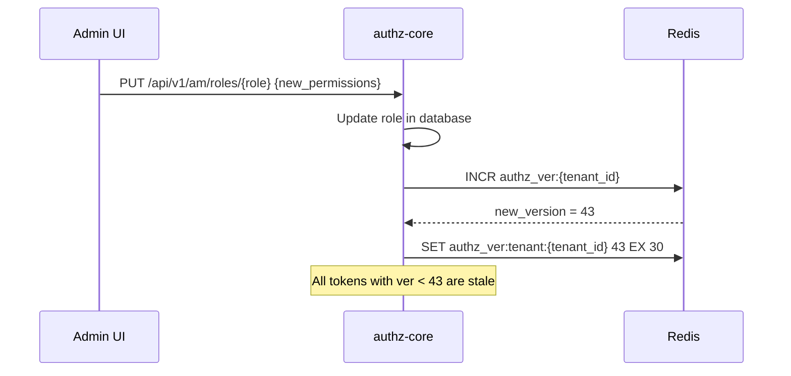

# Story 5.1: Add Token Version Claim

## Epic

[05-token-versioning](../versioning.md)

## Parent Epic Story

Story 5.1

## Summary

Add the `ver` (token version) claim to the JWT schema and implement per-subject version tracking. This is the foundation for instant privilege invalidation without relying solely on short token TTLs.

## Why This Story Exists

The JWT document identifies "stale permissions" as the primary trade-off of self-contained JWTs: "If a token is self-contained and valid for ten minutes, then any authorisation fact embedded in it can be stale for up to ten minutes unless you add version checks." Token versioning bridges the gap between short-lived tokens and immediate revocation.

## Design Context

### Current State

- No `ver` claim in JWT
- No per-subject version tracking
- Revocation relies solely on short TTLs and jti denylisting

### Token Version Design

The `ver` claim is a monotonically increasing integer per subject (and optionally per tenant):

```json
{
  "ver": 42,
  "sid": "ses_01JV8W..."
}
```

- `ver` = token version (monotonically increasing)
- `sid` = session ID (identifies which session this token belongs to)

### Version Storage

| Key | Type | TTL | Purpose |
|-----|------|-----|---------|
| `authz_ver:{sub}` | String | 15-60 seconds | Current version for subject |
| `authz_ver:tenant:{tenant_id}` | String | 15-60 seconds | Current version for tenant |

On token issue:
1. Read current version from `authz_ver:{sub}` (default 0 if not found)
2. Increment: `new_ver = current_ver + 1`
3. Store: `SET authz_ver:{sub} new_ver EX 30` (30-second TTL)
4. Include `ver` and `sid` in the JWT

On token validation:
1. Read cached version: `GET authz_ver:{sub}`
2. If `claims.ver < cached_ver`: reject with "stale authz snapshot"
3. If `claims.ver >= cached_ver`: allow

## Mermaid Diagrams

### Version Bump on Authz Change



### Version Validation on Token Access

```mermaid
flowchart TD
    A[Request with JWT] --> B{Has ver claim?}
    B -->|No| C{Is route high-risk?}
    C -->|Yes| D[Check version in Redis]
    C -->|No| E[Allow (old token accepted)]
    D --> F{claims.ver >= cached_ver?}
    F -->|No| G[Reject 401 stale token]
    F -->|Yes| H[Allow]
    B -->|Yes| I{Is route high-risk?}
    I -->|Yes| J{claims.ver >= cached_ver?}
    J -->|No| G
    J -->|Yes| H
    I -->|No| H
```

### Version Lifecycle

```mermaid
gantt
    title Token Version Lifecycle
    dateFormat X
    axisFormat %s
    section Version 41
    Token issued (ver=41)   :0, 300
    Version bumped to 42    :100, 0
    Version bumped to 43    :200, 0
    section Version 42
    Token issued (ver=42)   :100, 300
    section Version 43
    Token issued (ver=43)   :200, 300
```



## OpenAPI Changes

- `LoginResponse` schema: Add `token_version` field
- No changes to request schemas needed

```yaml
components:
  schemas:
    LoginResponse:
      properties:
        token_version:
          type: integer
          format: int64
          description: Monotonically increasing token version (for revocation)
```

## Design Doc References

- `design-doc.md` section 10.1: Token Security -- "Token versioning: Monotonically increasing `ver` claim per subject and per tenant"
- `design-doc.md` section 10.4: Token Versioning & Revocation -- Layer 3: per-subject or per-tenant token versioning
- `design-doc.md` section 6.2: JWT Schema -- `ver` claim in standard claims table

## Wiki Pages to Update/Create

- `topics/topic-token-versioning.md`: (new) Document version claim
- `topics/topic-jwt-schema.md`: Add `ver` claim

## Acceptance Criteria

- [ ] `ver` (uint64) claim is included in every access token
- [ ] `sid` (session ID) claim is included in every access token
- [ ] Per-subject version is stored in Redis: `authz_ver:{sub}` with 15-60 second TTL
- [ ] Per-tenant version is stored in Redis: `authz_ver:tenant:{tenant_id}` with 15-60 second TTL
- [ ] Version is incremented on every token issue
- [ ] Version is incremented when authz changes (role/permission changes)
- [ ] Unit tests verify: version is monotonically increasing, version bump on authz change
- [ ] Metrics: `token_version_total{event: "issued", "bumped"}` is emitted

## Dependencies

- Depends on Story 2.2 (AccessClaims struct with `ver` field)
- Intersects with Story 5.2 (version cache)

## Risk / Trade-offs

- **Redis dependency for version**: The version check depends on Redis. If Redis is down, the version check is skipped (fail open). This is acceptable because the version check is a secondary check -- if Redis is unavailable, the token is still validated (signature, exp, iss, aud).
- **Version bump timing**: When authz changes occur, the version is bumped immediately. Existing tokens with older `ver` values are rejected on the NEXT request (after token validation). This means there is a window (up to token TTL) where stale tokens are still valid. This is intentional -- the version bump is a "soft" revocation that takes effect on the next validation.
- **Version overflow**: `ver` is a `u64`, so overflow is practically impossible (would take ~584,000 years at 1 bump/second). No overflow handling needed.
