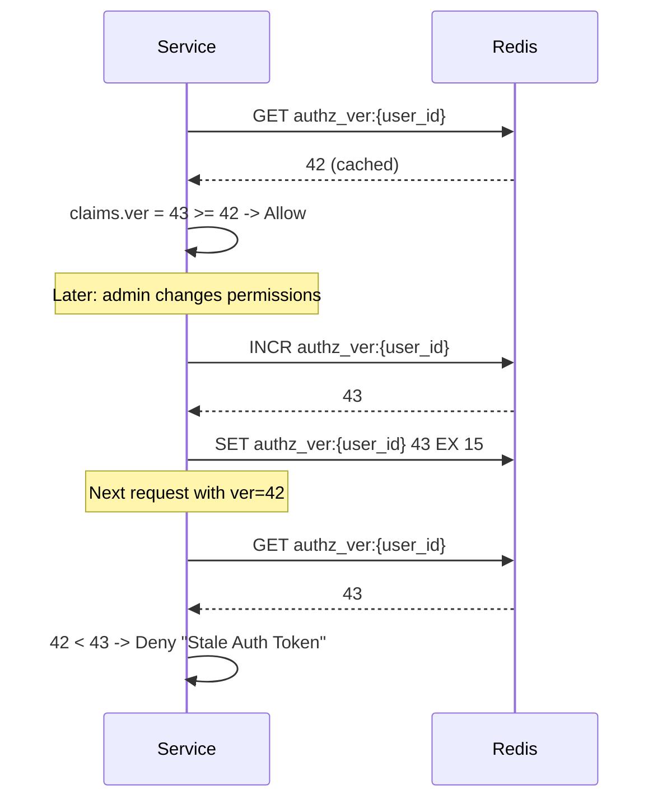
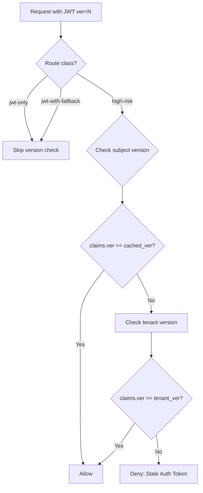
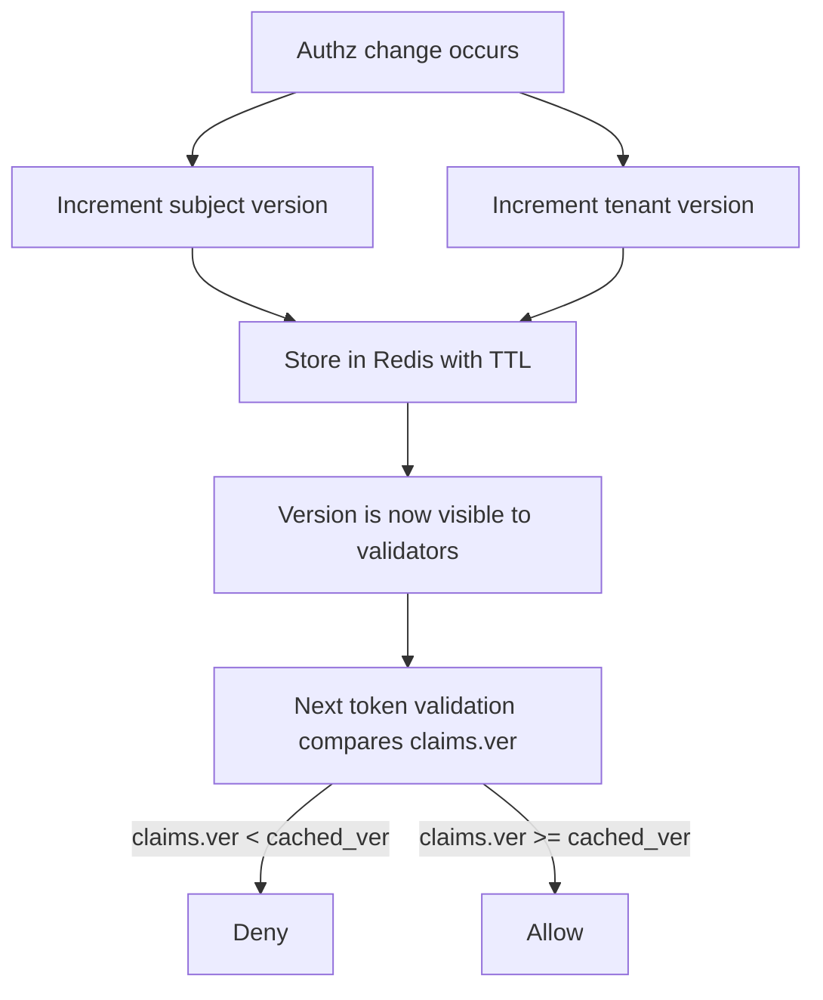

# Story 5.2: Implement Subject/Tenant Version Cache

## Epic

[05-token-versioning](../versioning.md)

## Parent Epic Story

Story 5.2

## Summary

Implement the version cache that stores and serves current subject and tenant versions. This cache limits central lookups without making revocation too slow, with a TTL of 15-60 seconds.

## Why This Story Exists

The JWT document recommends: "check a central blacklist or Redis version key on every request partly recreates the original bottleneck. So cache revocation and version data at the gateway or service for a short window -- often seconds, not minutes." This story implements that cache.

## Design Context

### Current State

- No version cache exists
- No per-subject or per-tenant version tracking

### Version Cache Design

| Cache | Key | TTL | Purpose |
|-------|-----|-----|---------|
| Subject version | `authz_ver:{sub}` | 15-60 seconds | Current version for a subject |
| Tenant version | `authz_ver:tenant:{tenant_id}` | 15-60 seconds | Current version for a tenant |

### TTL Rationale

| Cache | TTL | Rationale |
|-------|-----|-----------|
| Subject version | 15 seconds | Faster revocation for user-specific changes |
| Tenant version | 60 seconds | Less frequent tenant-wide changes, less Redis load |

### Redis Operations

```
# On token issue:
GET authz_ver:{user_id}        # Current version (default 0)
INCR authz_ver:{user_id}       # Increment (atomic)
SET authz_ver:{user_id} {new_ver} EX 15  # Store with 15s TTL

# On tenant change:
GET authz_ver:tenant:{tenant_id}
INCR authz_ver:tenant:{tenant_id}
SET authz_ver:tenant:{tenant_id} {new_ver} EX 60  # Store with 60s TTL

# On token validation:
GET authz_ver:{user_id}        # Cached version
# Compare: claims.ver >= cached_ver ?
```

### Version Comparison Logic

```rust
pub fn validate_version(
    claims_ver: u64,
    user_id: &str,
    route_class: &RouteClass,
) -> Result<(), AuthError> {
    match route_class {
        RouteClass::JwtOnly | RouteClass::JwtWithFallback => {
            // Low-risk routes: skip version check
            Ok(())
        }
        RouteClass::HighRisk => {
            // High-risk routes: check version
            let cached_ver = redis::get::<_, u64>(&format!("authz_ver:{user_id}"))
                .unwrap_or(0);
            
            if claims_ver < cached_ver {
                return Err(AuthError::StaleAuthToken {
                    expected_min_version: cached_ver,
                    actual_version: claims_ver,
                });
            }
            
            // Also check tenant version
            let tenant_cached = redis::get::<_, u64>(&format!("authz_ver:tenant:{tenant_id}"))
                .unwrap_or(0);
            
            if claims_ver < tenant_cached {
                return Err(AuthError::StaleAuthToken {
                    expected_min_version: tenant_cached,
                    actual_version: claims_ver,
                });
            }
            
            Ok(())
        }
    }
}
```

## Mermaid Diagrams

### Version Cache Flow



### Version Check Decision Tree



### Version Bump Propagation



## OpenAPI Changes

No OpenAPI changes. Version cache is internal to the validation logic.

## Design Doc References

- `design-doc.md` section 10.4: Token Versioning & Revocation -- per-subject and per-tenant versions
- `design-doc.md` section 10.11: Caching Strategy -- Subject/tenant version cache (15-60 seconds)
- `design-doc.md` section 10.12: Observability -- `version_lookup_latency_ms` metric

## Wiki Pages to Update/Create

- `topics/topic-token-versioning.md`: (new) Document version cache implementation
- `topics/topic-caching-strategy.md`: Document version cache TTL per type

## Acceptance Criteria

- [ ] Subject version is stored in Redis: `authz_ver:{sub}` with 15-second TTL
- [ ] Tenant version is stored in Redis: `authz_ver:tenant:{tenant_id}` with 60-second TTL
- [ ] Version is atomically incremented (INCR command)
- [ ] Version comparison: `claims.ver >= cached_ver` is the validity check
- [ ] High-risk routes check version; low-risk routes skip it
- [ ] Tenant version check is separate from subject version check
- [ ] Missing version key defaults to 0 (first-time user or new tenant)
- [ ] Metrics: `version_lookup_latency_ms` and `version_mismatch_total` are emitted
- [ ] Unit tests verify: version increment, version comparison, TTL expiration

## Dependencies

- Depends on Story 5.1 (ver claim in JWT)
- Intersects with Story 4.2 (JWT middleware) and Story 4.4 (route classification)

## Risk / Trade-offs

- **TTL mismatch**: The version cache TTL (15-60 seconds) is longer than the token TTL (5 minutes). This means after a version bump, stale tokens will be rejected for up to 15 seconds (subject) or 60 seconds (tenant). After the TTL expires, the cache is empty and validators skip the version check (fail open). This is a design trade-off: short cache TTL means stale tokens are eventually accepted again. If stricter revocation is needed, the TTL should be shorter (e.g., 5 seconds).
- **Redis dependency**: If Redis is down, version lookup fails. The code uses `unwrap_or(0)` to handle this gracefully -- missing version defaults to 0, which means `claims.ver >= 0` is always true, so the version check is skipped (fail open).
- **Version increment contention**: Multiple authz changes may increment the same version counter concurrently. The INCR command is atomic in Redis, so there is no lost update. The worst case is a version bump from 42 to 44 instead of 42 -> 43 -> 44. This is acceptable -- the version is only used for monotonic comparison, not for tracking exact change counts.
