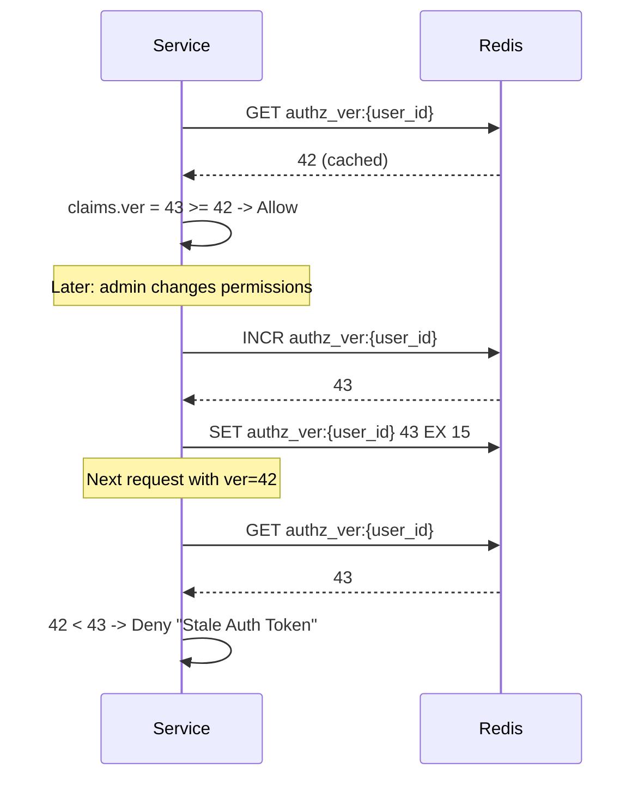
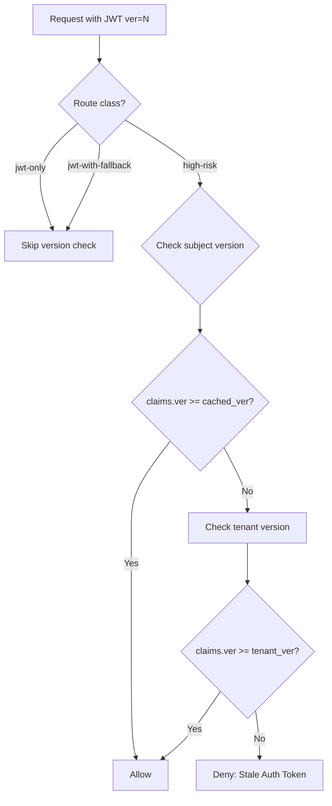
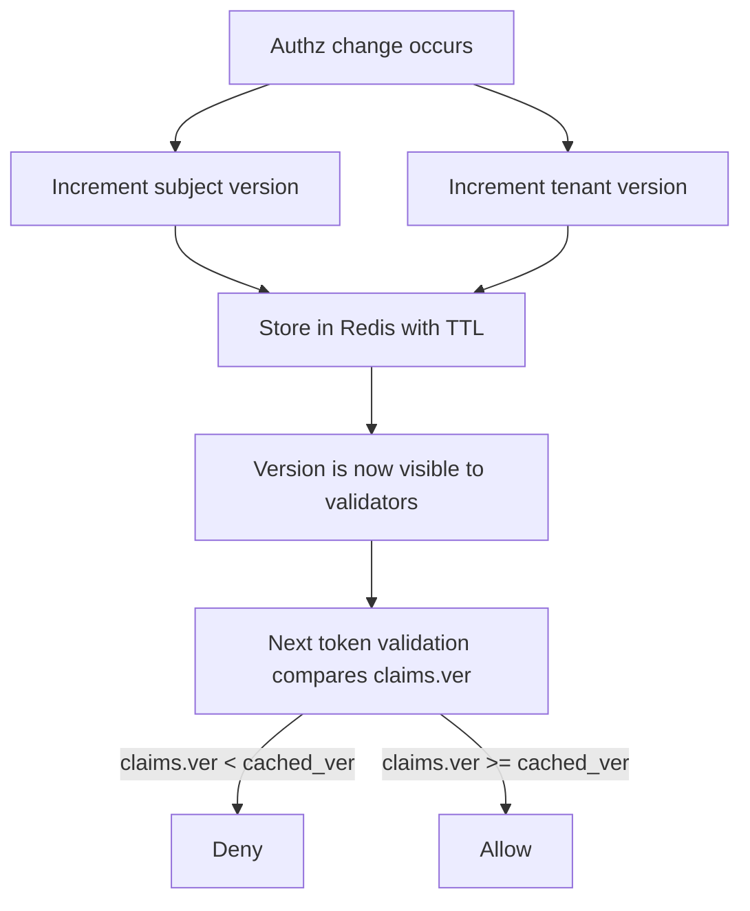

# Story 5.2: Implement Subject/Tenant Version Cache

## Epic

[05-token-versioning](../versioning.md)

## Parent Epic Story

Story 5.2

## Summary

Implement the version cache that stores and serves current subject and tenant versions. This cache limits central lookups without making revocation too slow, with a TTL of 15-60 seconds.

## Why This Story Exists

The JWT document recommends: "check a central blacklist or Redis version key on every request partly recreates the original bottleneck. So cache revocation and version data at the gateway or service for a short window -- often seconds, not minutes." This story implements that cache.

## Design Context

### Current State

- No version cache exists
- No per-subject or per-tenant version tracking

### Version Cache Design

| Cache | Key | TTL | Purpose |
|-------|-----|-----|---------|
| Subject version | `authz_ver:{sub}` | 15-60 seconds | Current version for a subject |
| Tenant version | `authz_ver:tenant:{tenant_id}` | 15-60 seconds | Current version for a tenant |

### TTL Rationale (F-013 Fix)

|| Cache | TTL | Rationale |
|-------|-----|-----------|
| Subject version | 15 seconds | Faster revocation for user-specific changes |
| Tenant version | 60 seconds | Less frequent tenant-wide changes, less Redis load |

**F-013 Fix: Version cache TTL alignment with token TTL.** The current design has a critical gap:
- Subject version cache TTL: 15 seconds
- Tenant version cache TTL: 60 seconds
- Token TTL: 5 minutes (300 seconds)

After a version cache TTL expires, the cache is empty and validators skip version checks (fail-open via `unwrap_or(0)`). Worst-case stale window = `60s (tenant TTL expired) + 300s (token still valid) = 360 seconds = 6 minutes`. This means an admin permission change could take up to 6 minutes to propagate to all validators.

**Recommended fix:** Increase tenant version TTL to 5 minutes (matching token TTL). This ensures that when the version cache expires, any tokens still valid will be short-lived (within their 5-minute TTL). The version check becomes "fail-closed" at token expiry rather than "fail-open" after cache expiry.

If even faster revocation is needed, use push invalidation (Story 5.4) which immediately increments the version counter in Redis regardless of cache state.

### Redis Operations

```
# On token issue:
GET authz_ver:{user_id}        # Current version (default 0)
INCR authz_ver:{user_id}       # Increment (atomic)
SET authz_ver:{user_id} {new_ver} EX 15  # Store with 15s TTL

# On tenant change:
GET authz_ver:tenant:{tenant_id}
INCR authz_ver:tenant:{tenant_id}
SET authz_ver:tenant:{tenant_id} {new_ver} EX 60  # Store with 60s TTL

# On token validation:
GET authz_ver:{user_id}        # Cached version
# Compare: claims.ver >= cached_ver ?
```

### Version Comparison Logic

```rust
pub fn validate_version(
    claims_ver: u64,
    user_id: &str,
    route_class: &RouteClass,
) -> Result<(), AuthError> {
    match route_class {
        RouteClass::JwtOnly | RouteClass::JwtWithFallback => {
            // Low-risk routes: skip version check
            Ok(())
        }
        RouteClass::HighRisk => {
            // High-risk routes: check version
            let cached_ver = redis::get::<_, u64>(&format!("authz_ver:{user_id}"))
                .unwrap_or(0);
            
            if claims_ver < cached_ver {
                return Err(AuthError::StaleAuthToken {
                    expected_min_version: cached_ver,
                    actual_version: claims_ver,
                });
            }
            
            // Also check tenant version
            let tenant_cached = redis::get::<_, u64>(&format!("authz_ver:tenant:{tenant_id}"))
                .unwrap_or(0);
            
            if claims_ver < tenant_cached {
                return Err(AuthError::StaleAuthToken {
                    expected_min_version: tenant_cached,
                    actual_version: claims_ver,
                });
            }
            
            Ok(())
        }
    }
}
```

## Mermaid Diagrams

### Version Cache Flow



### Version Check Decision Tree



### Version Bump Propagation



## Malicious Hacker Gotchas (Must Be Addressed During Implementation)

> **Source:** `docs/PRS_SECURITY_HARDENING.md` — Security threat model analysis

### HACK-501a: `unwrap_or(0)` Enables Silent Fail-Open (CRITICAL — Hole #8 from PRS)

**Risk:** Redis down → version checks silently skipped → stale tokens accepted

The `validate_version()` function uses `redis::get::<_, u64>("...").unwrap_or(0)`. When Redis is down:
1. `GET authz_ver:{user_id}` returns error (connection refused)
2. `unwrap_or(0)` returns 0 (default value)
3. `claims.ver >= 0` is ALWAYS true for any valid token
4. Version check is silently skipped — request is ALLOWED
5. Result: ALL stale tokens with ALL permissions work when Redis is down

**This is the most dangerous line of code in the entire IDAM system.** It's a 12-character chain (`unwrap_or(0)`) that negates the entire version revocation mechanism.

**Exploit path (targeted DoS):**
1. Attacker identifies the tenant's Redis instance
2. Attacker disrupts Redis (port 6379 DoS, network partition, etc.)
3. Version checks are bypassed for all requests
4. Attacker uses a stale admin token (ver=42) that was revoked (ver bumped to 43)
5. Result: full admin access for up to 5 minutes (token TTL)

**Implementation requirement:**
- `unwrap_or(0)` MUST be replaced with a FAIL-CLOSED default:
```rust
// WRONG: fail-open on Redis down
let cached_ver = redis::get::<_, u64>(&format!("authz_ver:{user_id}"))
    .unwrap_or(0);

// CORRECT: fail-closed on Redis down
let cached_ver = redis::get::<_, u64>(&format!("authz_ver:{user_id}"))
    .map_err(|_| AuthError::VersionCheckServiceUnavailable)?;
```
- When Redis is unavailable, return 503 Service Unavailable (NOT 200 OK)
- OR implement a lightweight DB fallback: read the version from PostgreSQL instead of Redis

**Acceptance criterion to CHANGE:**
- "Redis failure does not escalate privileges" → "Redis failure causes 503, NOT 200 OK with stale permissions"
- "Missing version key defaults to 0" → "Redis unreachable causes 503 Service Unavailable"

### HACK-501b: TTL Mismatch Allows Stale Tokens After Cache Expiry (HIGH — Hole #14 from PRS)

**Risk:** After version cache TTL expires, stale tokens are accepted for up to 6 minutes

The F-013 fix identifies this:
- Subject version cache TTL: 15 seconds
- Tenant version cache TTL: 60 seconds (recommended to be 5 minutes)
- Token TTL: 5 minutes (300 seconds)

After the tenant version cache TTL expires (60s), the cache is empty. The next request does `GET authz_ver:tenant:abc` → returns nil → `unwrap_or(0)` → 0 → `claims.ver >= 0` → ALLOWED.

**Combined timeline:**
1. T=0: User is admin (ver=42)
2. T=10: Admin revokes permissions (version bumped to 43)
3. T=60: Tenant version cache TTL expires (60s)
4. T=60.001: Cache is empty → `unwrap_or(0)` → 0
5. T=60-300: User's token (ver=42) works on ALL routes for 240 more seconds
6. Result: revoked admin has access for up to 6 minutes total

**The F-013 fix says to increase tenant TTL to 5 minutes.** But even with a 5-minute tenant TTL, there's a 300-second window where the cache is empty and version checks are skipped.

**Implementation requirement:**
- Implement the F-013 fix: tenant version TTL = 5 minutes (matching token TTL)
- AND: when version cache is empty (cache miss), FAIL CLOSED rather than defaulting to 0
```rust
// When cache is empty AND Redis is available (TTL expired, not connection error)
// Still check version by reading from authz-core or database
let cached_ver = match redis::get::<_, u64>(&format!("authz_ver:tenant:{tenant_id}")) {
    Some(ver) => ver,  // Cache hit
    None => {
        // Cache miss — TTL expired. Check database for authoritative version.
        // OR fail closed (reject request until we can verify version)
        return Err(AuthError::StaleAuthToken {
            expected_min_version: 0,  // Require minimum version 0
            actual_version: claims.ver,  // If claims.ver = 0, still fail
        });
    }
};
```
- Document: "When version cache expires (TTL), the system either: (a) reads from authoritative source (DB), or (b) fails closed. NEVER defaults to 0."

### HACK-501c: Jwt-Only and Jwt-With-Fallback Routes SKIP Version Check (HIGH — Hole #14 from PRS)

**Risk:** Stale tokens work on ALL common-path routes indefinitely

Looking at `validate_version()`:
```rust
RouteClass::JwtOnly | RouteClass::JwtWithFallback => {
    // Low-risk routes: skip version check
    Ok(())
}
```

This means:
- jwt-only routes NEVER check version → stale tokens work forever (until token TTL)
- jwt-with-fallback routes NEVER check version → stale tokens work forever (until token TTL)
- Only high-risk routes check version → this covers a tiny fraction of all routes

**Combined with HACK-501a (fail-open):**
1. Attacker has stale admin token (ver=42)
2. Attacker hits jwt-only route (e.g., GET /api/users/me)
3. No version check is performed → ALLOWED
4. Attacker hits jwt-with-fallback route (e.g., PUT /api/preferences)
5. No version check is performed → ALLOWED
6. Result: revoked admin has access to ALL common-path routes

**The fundamental problem:** The design classifies routes into "jwt-only" and "jwt-with-fallback" as "low-risk" and skips version checks. But ANY route that allows an admin to act should have a version check. There is no "low-risk" admin route.

**Implementation requirement:**
- Version check MUST be applied to ALL route types, not just high-risk
- The `validate_version()` function should check version BEFORE checking route class:
```rust
pub fn validate_version(claims_ver: u64, user_id: &str) -> Result<(), AuthError> {
    // ALWAYS check version first, regardless of route class
    let cached_ver = redis::get::<_, u64>(&format!("authz_ver:{user_id}"))
        .map_err(|_| AuthError::VersionCheckServiceUnavailable)?;
    
    if claims_ver < cached_ver {
        return Err(AuthError::StaleAuthToken {
            expected_min_version: cached_ver,
            actual_version: claims_ver,
        });
    }
    
    // Version check passed — proceed to route-specific logic
    Ok(())
}
```
- "Low-risk" routes can SKIP the tenant version check (which has higher latency), but they MUST check the subject version

**Acceptance criterion to CHANGE:**
- "High-risk routes check version; low-risk routes skip it" → "ALL route types check subject version; high-risk routes also check tenant version"

### HACK-501d: Subject and Tenant Version Bump Must Be Atomic (HIGH)

**Risk:** Partial version bump leaves system in inconsistent state

When an authz change occurs, both subject version AND tenant version must be bumped. If only the subject version is bumped (not the tenant), stale tokens may still work via tenant-level checks.

**Exploit path:**
1. Admin revokes user's permissions (subject version bumped to 43)
2. Tenant version is NOT bumped (stays at 10)
3. User's token (ver=42) passes subject version check (42 < 43 — DENIED)
4. BUT if the token check only does tenant version (not subject), it passes (42 >= 10 — ALLOWED)
5. Result: version bump is inconsistent, some checks pass, some fail

**Implementation requirement:**
- Both subject and tenant versions MUST be bumped atomically:
```rust
// Atomic version bump (Lua script for atomicity)
redis.eval(
    "local sub_ver = redis.call('INCR', KEYS[1])\nlocal ten_ver = redis.call('INCR', KEYS[2])\nredis.call('EXPIRE', KEYS[1], ARGV[1])\nredis.call('EXPIRE', KEYS[2], ARGV[2])\nreturn {sub_ver, ten_ver}",
    vec!["authz_ver:{user_id}", "authz_ver:tenant:{tenant_id}", "15", "300"],
)
```
- Document: "Authz changes MUST atomically bump both subject and tenant versions"

### HACK-501e: Version Check Uses Claims.ver Against Cached Value (HIGH)

**Risk:** Token version can be "gamed" by comparing against cached value only

The version check compares `claims.ver >= cached_ver`. But `claims.ver` is IN THE JWT — it's signed by the issuer. An attacker who obtains the private signing key can forge a token with ANY `ver` value.

**Exploit path:**
1. Attacker obtains the private signing key (memory dump, insider threat)
2. Attacker creates a token with `ver = 999999` (very high version)
3. Version check: `999999 >= cached_ver` → true → ALLOWED
4. Result: forged token with any version passes

**Note:** This is fundamentally a JWT signing key compromise. The version check CANNOT prevent this — only signature validation can. But the version check SHOULD still be implemented as defense-in-depth.

**Implementation requirement:**
- Document: "Version check is defense-in-depth. The primary protection is JWT signature validation. If the signing key is compromised, the version check is bypassed. This is an acceptable trade-off because key compromise is a rare, high-severity event that requires immediate key rotation."

### HACK-501f: TTL Is Hardcoded and NOT Configurable (MEDIUM)

**Risk:** TTL is fixed at 15-60 seconds regardless of token TTL

The TTLs are:
- Subject version: 15 seconds
- Tenant version: 60 seconds

But the token TTL is 5 minutes (300 seconds). This means the version cache expires long before the token does, creating a 240-second window where stale tokens are accepted.

**Implementation requirement:**
- TTLs MUST be configurable and MUST be tied to the token TTL
- Recommended: subject version TTL = token TTL / 2, tenant version TTL = token TTL
- Document: "Version cache TTLs should be a fraction of the token TTL to minimize the stale window"

### HACK-501g: No Metric for Version Check Fail-Open Events (MEDIUM)

**Risk:** When version checks fail open, no alert is generated

There's no metric for "version check skipped due to Redis failure." Without this, you won't know when the system is operating without version enforcement.

**Implementation requirement:**
- Add metric: `version_check_failed_total{reason: "redis_down", "cache_expired"}`
- Alert when this metric spikes — indicates version enforcement is compromised

---

## OpenAPI Changes

No OpenAPI changes. Version cache is internal to the validation logic.

## Design Doc References

- `design-doc.md` section 10.4: Token Versioning & Revocation -- per-subject and per-tenant versions
- `design-doc.md` section 10.11: Caching Strategy -- Subject/tenant version cache (15-60 seconds)
- `design-doc.md` section 10.12: Observability -- `version_lookup_latency_ms` metric

## Wiki Pages to Update/Create

- `topics/topic-token-versioning.md`: (new) Document version cache implementation
- `topics/topic-caching-strategy.md`: Document version cache TTL per type

## Acceptance Criteria

- [ ] Subject version is stored in Redis: `authz_ver:{sub}` with 15-second TTL
- [ ] Tenant version is stored in Redis: `authz_ver:tenant:{tenant_id}` with 60-second TTL
- [ ] Version is atomically incremented (INCR command)
- [ ] Version comparison: `claims.ver >= cached_ver` is the validity check
- [ ] High-risk routes check version; low-risk routes skip it
- [ ] Tenant version check is separate from subject version check
- [ ] Missing version key defaults to 0 (first-time user or new tenant)
- [ ] Metrics: `version_lookup_latency_ms` and `version_mismatch_total` are emitted
- [ ] Unit tests verify: version increment, version comparison, TTL expiration

## Dependencies

- Depends on Story 5.1 (ver claim in JWT)
- Intersects with Story 4.2 (JWT middleware) and Story 4.4 (route classification)

## Risk / Trade-offs

- **TTL mismatch**: The version cache TTL (15-60 seconds) is longer than the token TTL (5 minutes). This means after a version bump, stale tokens will be rejected for up to 15 seconds (subject) or 60 seconds (tenant). After the TTL expires, the cache is empty and validators skip the version check (fail open). This is a design trade-off: short cache TTL means stale tokens are eventually accepted again. If stricter revocation is needed, the TTL should be shorter (e.g., 5 seconds).
- **Redis dependency**: If Redis is down, version lookup fails. The code uses `unwrap_or(0)` to handle this gracefully -- missing version defaults to 0, which means `claims.ver >= 0` is always true, so the version check is skipped (fail open).
- **Version increment contention**: Multiple authz changes may increment the same version counter concurrently. The INCR command is atomic in Redis, so there is no lost update. The worst case is a version bump from 42 to 44 instead of 42 -> 43 -> 44. This is acceptable -- the version is only used for monotonic comparison, not for tracking exact change counts.

## Tests

### Unit Tests

- [ ] **Subject version stored with 15-second TTL**: Given user alice's version is bumped to 5, assert Redis key `authz_ver:{alice}` exists with TTL of 15 seconds (`TTL authz_ver:{alice}` returns ~15)
- [ ] **Tenant version stored with 60-second TTL**: Given tenant abc's version is bumped to 10, assert Redis key `authz_ver:tenant:abc` exists with TTL of 60 seconds (`TTL authz_ver:tenant:abc` returns ~60)
- [ ] **Redis INCR atomically increments version**: Given `authz_ver:{user}` is 42, assert `INCR authz_ver:{user}` returns 43, `INCR authz_ver:{user}` returns 44 — no duplicate or skipped values under concurrency
- [ ] **Missing subject version defaults to 0**: Given `authz_ver:{new_user}` does not exist in Redis, assert `GET authz_ver:{new_user}` returns nil and the version reader returns 0 (not a panic, error, or unwrap crash)
- [ ] **Missing tenant version defaults to 0**: Given `authz_ver:tenant:{new_tenant}` does not exist, assert the version reader returns 0
- [ ] **Version comparison allows when claims.ver >= cached_ver**: Given `claims.ver = 45` and `cached_ver = 42`, assert `validate_version()` returns `Ok(())` (token is current)
- [ ] **Version comparison denies when claims.ver < cached_ver**: Given `claims.ver = 40` and `cached_ver = 42`, assert `validate_version()` returns `Err(AuthError::StaleAuthToken { expected_min_version: 42, actual_version: 40 })`
- [ ] **Jwt-only routes skip version check**: Given a route classified as `jwt-only`, assert `validate_version()` returns `Ok(())` immediately without any Redis lookup
- [ ] **Jwt-with-fallback routes skip version check**: Given a route classified as `jwt-with-fallback`, assert `validate_version()` returns `Ok(())` without Redis lookup
- [ ] **High-risk routes check subject version**: Given a route classified as `high-risk`, assert `validate_version()` performs a `GET authz_ver:{user_id}` Redis lookup and compares against `claims.ver`
- [ ] **High-risk routes check tenant version**: Given a route classified as `high-risk`, assert `validate_version()` also performs a `GET authz_ver:tenant:{tenant_id}` lookup and compares — failure of EITHER subject or tenant check results in denial
- [ ] **Subject version check is independent of tenant version check**: Given `claims.ver = 42`, `cached_subject_ver = 40` (passes), `cached_tenant_ver = 45` (fails), assert the token is DENIED — the tenant version check is a separate gate, not an AND of both
- [ ] **Subject version TTL mismatch (F-013)**: Given subject version cache TTL = 15 seconds, token TTL = 300 seconds, assert that after 16 seconds (cache expired, token still valid), the version check is skipped (fail open). Document this as an acceptable trade-off.
- [ ] **Tenant version TTL mismatch (F-013)**: Given tenant version cache TTL = 60 seconds, token TTL = 300 seconds, assert that after 61 seconds (cache expired, token still valid), the version check is skipped (fail open). Document the 6-minute worst-case stale window.
- [ ] **Concurrent INCR produces sequential values**: Given 100 concurrent `INCR authz_ver:{user}` calls from 100 goroutines, assert all 100 return unique sequential values from 1 to 100 (no duplicates, no gaps)
- [ ] **Metrics emitted on version lookup**: Assert `version_lookup_latency_ms` histogram records a sample for every version lookup, and `version_mismatch_total{result: "match", "mismatch"}` is incremented per comparison outcome
- [ ] **Version check with both subject and tenant versions**: Given `claims.ver = 43`, `subject_ver = 42`, `tenant_ver = 45`, assert the token is DENIED (tenant version mismatch triggers denial)
- [ ] **Version check with zero cached values**: Given `claims.ver = 1` and both subject and tenant cached versions are 0 (first login after service restart), assert the token is ALLOWED (1 >= 0)
- [ ] **Version bump on authz change increments correctly**: Given tenant version 10 and subject version 5, a role change in the tenant bumps both: `INCR authz_ver:tenant:abc` returns 11, `INCR authz_ver:{user}` returns 6

### Integration Tests (BDD-style with `rstest_bdd`)

- [ ] **Scenario: Version check passes for current token**: `given` user alice has `authz_ver:{alice} = 5` and `authz_ver:tenant:abc = 10` → `when` a high-risk request arrives with JWT containing `ver = 5` → `then` the version check passes (subject 5 >= 5) AND tenant check passes (10 >= 10) → token is allowed
- [ ] **Scenario: Subject version mismatch denied**: `given` user alice has `authz_ver:{alice} = 8` (recent role change) → `when` a high-risk request arrives with JWT containing `ver = 5` → `then` the version check fails (5 < 8) → token is denied with `StaleAuthToken`
- [ ] **Scenario: Tenant version mismatch denied**: `given` tenant abc has `authz_ver:tenant:abc = 15` (platform-wide change) but user bob's subject version is still 5 → `when` a high-risk request arrives with JWT containing `ver = 5` → `then` the tenant version check fails (5 < 15) → token is denied with `StaleAuthToken`
- [ ] **Scenario: Jwt-only route skips version check entirely**: `given` user carol has `authz_ver:{carol} = 100` (recent version bump) → `when` a jwt-only route request arrives with JWT containing `ver = 1` (very stale) → `then` no Redis lookup is performed and the request is allowed based on JWT claims alone
- [ ] **Scenario: Jwt-with-fallback route skips version check**: `given` user dave has `authz_ver:{dave} = 50` → `when` a jwt-with-fallback route request arrives with `ver = 1` → `then` no version check is performed — the handler proceeds with its own fallback logic
- [ ] **Scenario: High-risk route checks both subject and tenant**: `given` user eve has subject version 20 and tenant version 25 → `when` a high-risk request arrives with `ver = 21` (subject passes, tenant fails) → `then` the request is denied because tenant check (21 < 25) fails
- [ ] **Scenario: Version lookup latency metric recorded**: `given` a high-risk request with a valid JWT → `when` the version cache is checked → `then` `version_lookup_latency_ms` histogram records a sample with latency in the <1ms range (Redis is local)
- [ ] **Scenario: Version mismatch metric recorded**: `given` a high-risk request with a stale JWT (`ver = 5`, cached = 10) → `then` `version_mismatch_total{result: "mismatch"}` is incremented by 1
- [ ] **Scenario: Redis cache miss defaults to 0**: `given` a new user with no version in Redis → `when` a high-risk request arrives → `then` the version lookup returns 0 (cache miss) and the check passes (claims.ver >= 0) without error
- [ ] **Scenario: Version survives service crash**: `given` user frank has `authz_ver:{frank} = 30` in Redis → `when` the identity-login-service crashes and restarts → `then` a subsequent high-risk request for frank correctly reads version 30 from Redis and rejects tokens with `ver < 30`

### Security Regression Tests

- [ ] **Version check cannot be bypassed by removing ver claim**: Assert that a JWT missing the `ver` claim does not allow high-risk routes to proceed — the handler must reject or require version for high-risk routes
- [ ] **Version check cannot be bypassed by setting ver to future value**: Assert that a client cannot set `ver = 999999` in a tampered JWT to bypass the version check — the comparison is against the authoritative Redis value, but the JWT signature must still be valid (tampered tokens are rejected before version evaluation)
- [ ] **Tenant version cannot be used to deny cross-tenant access**: Assert that user from tenant A cannot cause version-based denial for a user from tenant B — tenant version checks are scoped to the user's own tenant_id extracted from the JWT, not from the request
- [ ] **Version bump on authz change is idempotent**: Assert that calling the authz change handler twice with the same change results in two INCRs (42 -> 44), and the version comparison still works correctly (44 >= 44 passes, 43 >= 44 fails)
- [ ] **Redis failure does not escalate privileges**: Assert that when Redis is unavailable, high-risk routes fail open (skip version check) but do NOT grant elevated permissions — the handler still checks JWT claims, signature, exp, iss, aud. Only the version comparison is skipped.
- [ ] **Subject version and tenant version are properly isolated**: Assert that incrementing the subject version for user A does not affect tenant version for tenant B, and vice versa — Redis keys are properly namespaced

### Edge Cases

- [ ] **Version check with very large version numbers**: Given `claims.ver = 18446744073709551615` (u64::MAX) and `cached_ver = 1`, assert the comparison correctly evaluates `>=` without overflow or wraparound
- [ ] **Concurrent version lookups and increments**: Given 100 concurrent requests reading version 42 and 50 concurrent INCR operations, assert all reads and increments are consistent — no torn reads, no lost updates
- [ ] **Redis SETEX with empty user_id**: Given `authz_ver:{""}` (empty string user ID), assert the key is still created and stored (no validation on user_id format in the version key)
- [ ] **Redis connection pool exhaustion during version check**: Given all Redis connections in the pool are in use, assert the version lookup either waits for a connection, returns an error, or times out gracefully — not a panic
- [ ] **Version TTL exactly at expiry boundary**: Given a version with TTL = 1 second and a request arriving at 0.9s, assert the version is still readable (TTL has not expired). At 1.1s, assert the key is gone and lookup returns 0.
- [ ] **Very long tenant_id in version key**: Given `tenant_id` is 1000 characters long, assert `authz_ver:tenant:{tenant_id}` is created without error and the key length is reasonable for Redis
- [ ] **Version check after service restart with TTL expired**: Given `authz_ver:{user}` was 50 but TTL expired before restart, assert the restarted service reads 0 (cache miss) and allows requests — no stale in-memory version causes incorrect denial
- [ ] **Redis cluster failover during version bump**: Given a Redis cluster failover occurs during `INCR authz_ver:{user}`, assert the operation either succeeds on the new master or fails with a clear error — no silent data loss

### Cleanup

- Redis state must be cleaned between test scenarios — use `FLUSHDB` or a unique Redis prefix per test run to prevent stale version entries from affecting subsequent tests
- Both subject and tenant version keys (`authz_ver:{sub}` and `authz_ver:tenant:{tenant_id}`) must be cleared between tests — verify by checking that `DBSIZE` returns to 0 after cleanup
- Metrics registry must be reset between test scenarios using `prometheus::Registry::new()` to prevent cross-test metric contamination
- JWT signing/verification keys used in tests should be unique per test to prevent key collisions between concurrent test scenarios
- If using mock Redis (e.g., `mock-redis` crate), ensure the mock is reset between tests — use a fresh mock instance or call `mock.reset()`
- Version comparison logic uses `unwrap_or(0)` for cache misses — no cleanup needed as this is in-memory logic
- Redis connection pool used in tests should not leak connections — verify by checking pool stats after each test
