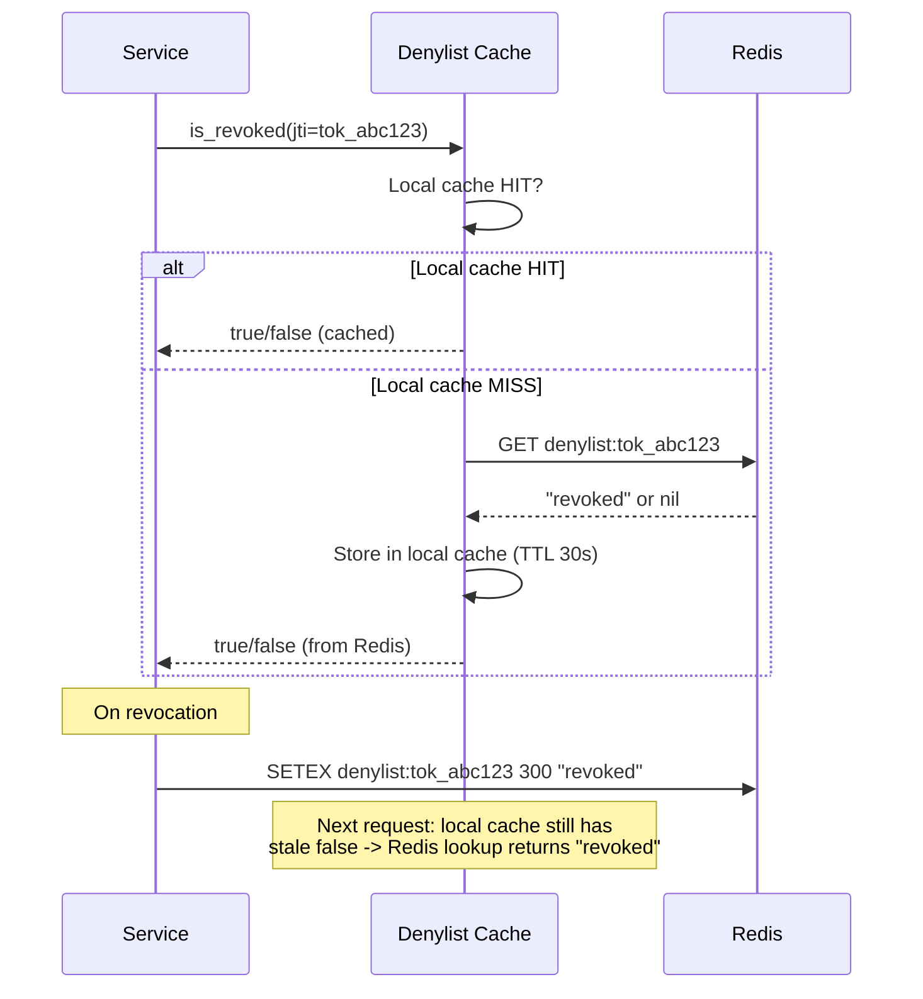
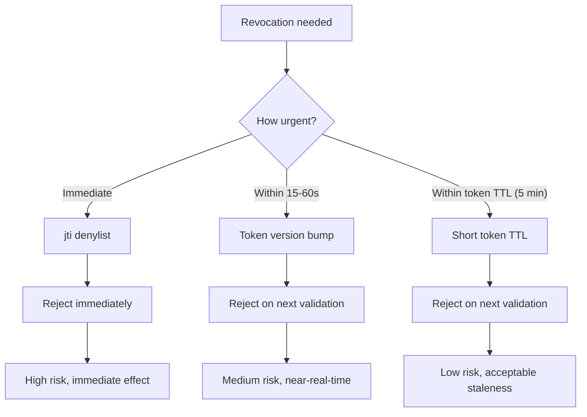

# Story 5.3: Implement Targeted jti Denylist

## Epic

[05-token-versioning](../versioning.md)

## Parent Epic Story

Story 5.3

## Summary

Implement targeted jti denylisting for exceptional, urgent revocation cases. Store in Redis with TTL matching token `exp`. Cache at gateway level for a short window. This is NOT used on every request -- only for urgent revocations where immediate effect is needed.

## Why This Story Exists

The JWT document emphasizes: "A version check that requires Redis on every request partly recreates the original bottleneck. Use short caches." The jti denylist is the third layer of revocation, used only for urgent cases (user disabled, compromised account). Token versioning (Story 5.1-5.2) handles most revocation scenarios without Redis lookups.

## Design Context

### Current State

- `redis.rs` has a blacklist of revoked token IDs
- No per-token TTL on denylist
- No gateway-level caching of denylist

### jti Denylist Design

```
Key: denylist:{jti}
Value: "revoked" (or reason for revocation)
TTL: Until token exp (dynamic per token)
```

### When to Use jti Denylist

| Scenario | Use jti denylist? | Alternative |
|----------|------------------|-------------|
| User disabled | Yes | Immediate effect needed |
| Account compromised | Yes | Immediate effect needed |
| Role removed | No | Version bump is sufficient |
| Org deleted | No | Version bump is sufficient |
| Token expired | No | Token expires naturally |
| Logout | Yes (family-based) | Family revoke (Story 3.2) |

### Denylist Operations

```
# On revocation:
SETEX denylist:{jti} {seconds_until_exp} "revoked"
# Example: SETEX denylist:tok_abc123 300 "revoked"  # 5 minutes until token expires

# On token validation:
GET denylist:{jti}
# If "revoked": Reject 401 "Token revoked"
# If nil: Token is not revoked

# Cleanup:
# TTL handles cleanup automatically
# No need for explicit expiry management
```

### Gateway-Level Caching

The denylist should be cached at the gateway/service level to avoid Redis lookups on every request:

```rust
pub struct DenylistCache {
    cache: LruCache<String, bool>,  // jti -> is_revoked
    ttl: Duration,                   // Cache TTL (seconds)
}

impl DenylistCache {
    pub fn is_revoked(&mut self, jti: &str) -> bool {
        // 1. Check local cache
        if let Some(&is_revoked) = self.cache.get(jti) {
            return is_revoked;
        }
        
        // 2. Check Redis
        let is_revoked = redis::get::<_, Option<String>>(&format!("denylist:{jti}"))
            .map(|s| s.is_some())
            .unwrap_or(false);
        
        // 3. Cache the result
        self.cache.insert(jti.to_string(), is_revoked);
        
        is_revoked
    }
}
```

**Cache TTL**: 30 seconds. This is short enough for revocation to propagate quickly but long enough to avoid Redis lookups on every request.

## Mermaid Diagrams

### Denylist Flow



### Revocation Layers Comparison



### Denylist TTL vs Token TTL

```mermaid
gantt
    title jti Denylist TTL vs Token TTL
    dateFormat X
    axisFormat %s
    section Token
    Token issued (exp = now + 300) :0, 300
    Token expires                   :300, 0
    section Denylist
    Denylist SETEX (TTL = 300)    :0, 300
    Denylist expires                :300, 0
```



## OpenAPI Changes

No OpenAPI changes. Denylist is internal to the validation logic.

## Design Doc References

- `design-doc.md` section 10.4: Token Versioning & Revocation -- Layer 4: targeted jti denylisting
- `design-doc.md` section 10.11: Caching Strategy -- Denylist cache (until token exp)
- `design-doc.md` section 10.12: Observability -- `denylist_lookup_latency_ms` metric

## Wiki Pages to Update/Create

- `topics/topic-token-versioning.md`: Document jti denylist
- `topics/topic-caching-strategy.md`: Document denylist cache

## Acceptance Criteria

- [ ] jti is added to denylist on revocation with TTL matching token `exp`
- [ ] Denylist is checked during JWT validation for high-risk routes
- [ ] Denylist is NOT checked on every request (only for high-risk)
- [ ] Gateway-level cache with 30-second TTL is implemented
- [ ] Cache TTL is short enough for revocation to propagate quickly
- [ ] Metrics: `denylist_lookup_latency_ms` and `denylist_lookup_total` are emitted
- [ ] Unit tests verify: denylist add, denylist check, cache hit/miss, TTL expiration
- [ ] Denylist entries expire automatically via Redis TTL (no explicit cleanup)

## Dependencies

- Depends on Story 5.1 (ver claim in JWT)
- Intersects with Story 3.2 (family-based revocation)

## Risk / Trade-offs

- **Gateway-level cache staleness**: If a token is revoked and added to the denylist, the gateway's local cache may still have the old value (false). This is resolved on the next Redis lookup (within 30 seconds). This is a trade-off: fast denial (no Redis lookup on cache hit) vs. potential stale cache (false negative). The 30-second cache TTL balances this.
- **Denylist size**: If many tokens are revoked, the denylist grows. However, each entry has a TTL matching the token's `exp` (5 minutes for normal tokens, 1-3 minutes for admin). After 5 minutes, all entries expire. No explicit cleanup is needed.
- **Not used on every request**: The denylist is only checked for high-risk routes. For jwt-only and jwt-with-fallback routes, the denylist is skipped. This is intentional -- the denylist is for exceptional cases, not routine validation.
