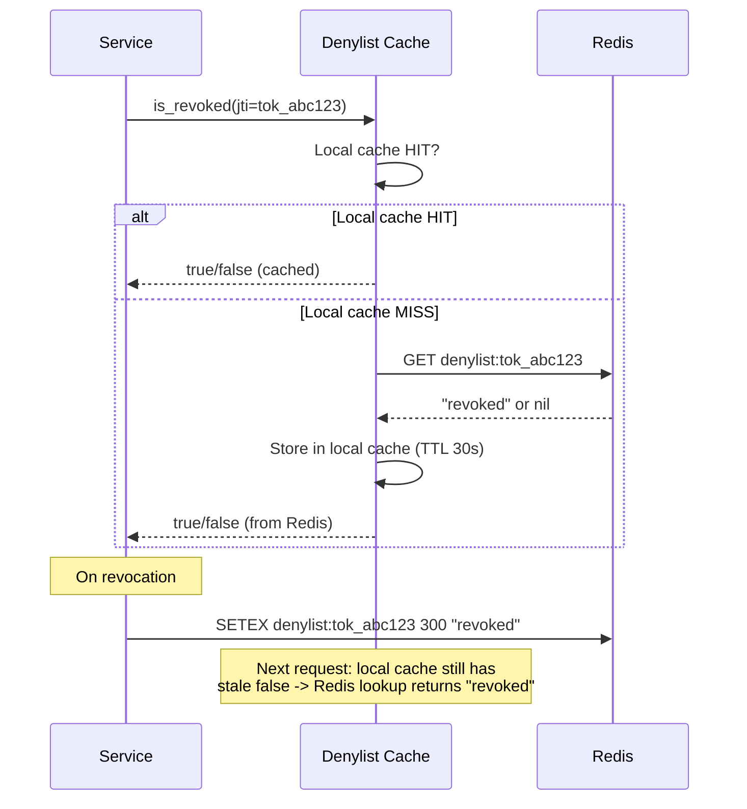
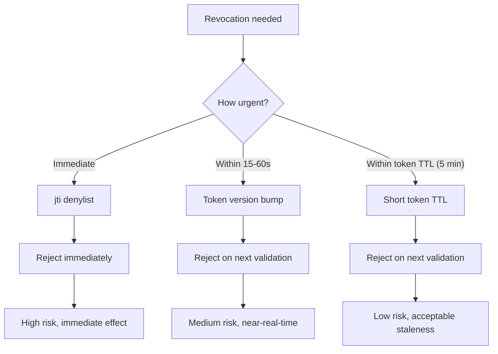

# Story 5.3: Implement Targeted jti Denylist

## Epic

[05-token-versioning](../versioning.md)

## Parent Epic Story

Story 5.3

## Summary

Implement targeted jti denylisting for exceptional, urgent revocation cases. Store in Redis with TTL matching token `exp`. Cache at gateway level for a short window. This is NOT used on every request -- only for urgent revocations where immediate effect is needed.

## Why This Story Exists

The JWT document emphasizes: "A version check that requires Redis on every request partly recreates the original bottleneck. Use short caches." The jti denylist is the third layer of revocation, used only for urgent cases (user disabled, compromised account). Token versioning (Story 5.1-5.2) handles most revocation scenarios without Redis lookups.

## Design Context

### Current State

- `redis.rs` has a blacklist of revoked token IDs
- No per-token TTL on denylist
- No gateway-level caching of denylist

### jti Denylist Design

```
Key: denylist:{jti}
Value: "revoked" (or reason for revocation)
TTL: Until token exp (dynamic per token)
```

### When to Use jti Denylist

| Scenario | Use jti denylist? | Alternative |
|----------|------------------|-------------|
| User disabled | Yes | Immediate effect needed |
| Account compromised | Yes | Immediate effect needed |
| Role removed | No | Version bump is sufficient |
| Org deleted | No | Version bump is sufficient |
| Token expired | No | Token expires naturally |
| Logout | Yes (family-based) | Family revoke (Story 3.2) |

### Denylist Operations

```
# On revocation:
SETEX denylist:{jti} {seconds_until_exp} "revoked"
# Example: SETEX denylist:tok_abc123 300 "revoked"  # 5 minutes until token expires

# On token validation:
GET denylist:{jti}
# If "revoked": Reject 401 "Token revoked"
# If nil: Token is not revoked

# Cleanup:
# TTL handles cleanup automatically
# No need for explicit expiry management
```

### Gateway-Level Caching

The denylist should be cached at the gateway/service level to avoid Redis lookups on every request:

```rust
pub struct DenylistCache {
    cache: LruCache<String, bool>,  // jti -> is_revoked
    ttl: Duration,                   // Cache TTL (seconds)
}

impl DenylistCache {
    pub fn is_revoked(&mut self, jti: &str) -> bool {
        // 1. Check local cache
        if let Some(&is_revoked) = self.cache.get(jti) {
            return is_revoked;
        }
        
        // 2. Check Redis
        let is_revoked = redis::get::<_, Option<String>>(&format!("denylist:{jti}"))
            .map(|s| s.is_some())
            .unwrap_or(false);
        
        // 3. Cache the result
        self.cache.insert(jti.to_string(), is_revoked);
        
        is_revoked
    }
}
```

**Cache TTL**: 30 seconds. This is short enough for revocation to propagate quickly but long enough to avoid Redis lookups on every request.

## Mermaid Diagrams

### Denylist Flow



### Revocation Layers Comparison



### Denylist TTL vs Token TTL

```mermaid
gantt
    title jti Denylist TTL vs Token TTL
    dateFormat X
    axisFormat %s
    section Token
    Token issued (exp = now + 300) :0, 300
    Token expires                   :300, 0
    section Denylist
    Denylist SETEX (TTL = 300)    :0, 300
    Denylist expires                :300, 0
```



## OpenAPI Changes

No OpenAPI changes. Denylist is internal to the validation logic.

## Design Doc References

- `design-doc.md` section 10.4: Token Versioning & Revocation -- Layer 4: targeted jti denylisting
- `design-doc.md` section 10.11: Caching Strategy -- Denylist cache (until token exp)
- `design-doc.md` section 10.12: Observability -- `denylist_lookup_latency_ms` metric

## Wiki Pages to Update/Create

- `topics/topic-token-versioning.md`: Document jti denylist
- `topics/topic-caching-strategy.md`: Document denylist cache

## Acceptance Criteria

- [ ] jti is added to denylist on revocation with TTL matching token `exp`
- [ ] Denylist is checked during JWT validation for high-risk routes
- [ ] Denylist is NOT checked on every request (only for high-risk)
- [ ] Gateway-level cache with 30-second TTL is implemented
- [ ] Cache TTL is short enough for revocation to propagate quickly
- [ ] Metrics: `denylist_lookup_latency_ms` and `denylist_lookup_total` are emitted
- [ ] Unit tests verify: denylist add, denylist check, cache hit/miss, TTL expiration
- [ ] Denylist entries expire automatically via Redis TTL (no explicit cleanup)

## Dependencies

- Depends on Story 5.1 (ver claim in JWT)
- Intersects with Story 3.2 (family-based revocation)

## Risk / Trade-offs

- **Gateway-level cache staleness**: If a token is revoked and added to the denylist, the gateway's local cache may still have the old value (false). This is resolved on the next Redis lookup (within 30 seconds). This is a trade-off: fast denial (no Redis lookup on cache hit) vs. potential stale cache (false negative). The 30-second cache TTL balances this.
- **Denylist size**: If many tokens are revoked, the denylist grows. However, each entry has a TTL matching the token's `exp` (5 minutes for normal tokens, 1-3 minutes for admin). After 5 minutes, all entries expire. No explicit cleanup is needed.
- **Not used on every request**: The denylist is only checked for high-risk routes. For jwt-only and jwt-with-fallback routes, the denylist is skipped. This is intentional -- the denylist is for exceptional cases, not routine validation.

## Tests

### Unit Tests

- [ ] **jti added to denylist on revocation with correct TTL**: Given a token with `exp = now + 300` is revoked, assert Redis key `denylist:{jti}` is set to `"revoked"` with a TTL of 300 seconds (`TTL denylist:{jti}` returns ~300)
- [ ] **jti key format uses `denylist:` prefix**: Given jti = `tok_abc123`, assert the Redis key is exactly `denylist:tok_abc123` (not `denylist_{jti}`, `jti:{jti}`, etc.)
- [ ] **Denylist lookup returns true for revoked jti**: Given `denylist:tok_abc123 = "revoked"` exists in Redis, assert `denylist_cache.is_revoked("tok_abc123")` returns `true`
- [ ] **Denylist lookup returns false for non-existent jti**: Given `denylist:tok_xyz789` does not exist in Redis, assert `denylist_cache.is_revoked("tok_xyz789")` returns `false`
- [ ] **Local cache HIT returns cached value without Redis call**: Given the local LRU cache contains `{jti: true}`, assert `is_revoked(jti)` returns `true` without making a Redis `GET` call
- [ ] **Local cache MISS triggers Redis lookup**: Given the local LRU cache does not contain `{jti}`, assert `is_revoked(jti)` makes a Redis `GET denylist:{jti}` call and caches the result
- [ ] **Redis result is cached in local LRU**: Given `is_revoked(jti)` performs a Redis lookup and returns `true`, assert a subsequent call to `is_revoked(jti)` returns from local cache (no Redis call)
- [ ] **Local cache evicts stale entries after TTL**: Given the local cache TTL is 30 seconds and 31 seconds have passed since a `false` entry was cached, assert the next `is_revoked(jti)` call does a fresh Redis lookup (stale cache entry is not returned)
- [ ] **Cache miss populates LRU with correct entry**: Given a cache miss for jti with value `nil` from Redis, assert the local cache stores `{jti: false}` (not `None` or a raw Redis response)
- [ ] **Denylist entry TTL matches token exp**: Given token A with `exp = now + 300` and token B with `exp = now + 60`, assert `denylist:{jti_A}` has TTL of 300 seconds and `denylist:{jti_B}` has TTL of 60 seconds
- [ ] **Denylist auto-expires via Redis TTL**: Given a denylist entry is created with TTL = 5 minutes, assert the key is automatically removed from Redis after 5 minutes (no explicit cleanup code needed)
- [ ] **Multiple jti entries coexist in Redis**: Given 10 different tokens are revoked, assert all 10 `denylist:{jti}` keys exist simultaneously in Redis with their correct individual TTLs
- [ ] **LRU cache capacity limit honored**: Given the LRU cache has capacity 1000 and 1001 unique jti values are checked, assert the cache contains exactly 1000 entries (oldest evicted)
- [ ] **Denylist is NOT checked for jwt-only routes**: Given a route classified as `jwt-only`, assert `is_revoked(jti)` is NOT called during the JWT middleware evaluation
- [ ] **Denylist is NOT checked for jwt-with-fallback routes**: Given a route classified as `jwt-with-fallback`, assert `is_revoked(jti)` is NOT called during the JWT middleware evaluation
- [ ] **Denylist IS checked for high-risk routes**: Given a route classified as `high-risk`, assert `is_revoked(jti)` IS called during the JWT middleware evaluation
- [ ] **Metrics emitted on denylist lookup**: Assert `denylist_lookup_total{result: "hit", "miss"}` is incremented per lookup outcome and `denylist_lookup_latency_ms` histogram records a sample
- [ ] **Denylist empty string jti handled gracefully**: Given jti is an empty string, assert `denylist_cache.is_revoked("")` returns `false` without error (not a panic or invalid Redis key error)

### Integration Tests (BDD-style with `rstest_bdd`)

- [ ] **Scenario: Revoked token is rejected on high-risk route**: `given` token `tok_abc` is revoked and added to `denylist:tok_abc` → `when` a request to a high-risk route arrives with JWT containing `jti: tok_abc` → `then` the denylist check returns `true` and the request is denied with 401 `TokenRevoked`
- [ ] **Scenario: Non-revoked token is allowed**: `given` token `tok_xyz` is NOT in the denylist → `when` a request to a high-risk route arrives with JWT containing `jti: tok_xyz` → `then` the denylist check returns `false` and the request proceeds to normal validation
- [ ] **Scenario: Local cache hit avoids Redis lookup**: `given` jti `tok_1` is revoked and cached in the local denylist cache → `when` 5 consecutive requests arrive with `jti: tok_1` → `then` only the first request makes a Redis lookup and the next 4 use the local cache
- [ ] **Scenario: Denylist entry expires after token TTL**: `given` token `tok_expire` is revoked with TTL = 5 minutes → `when` 5 minutes and 1 second pass → `then` the Redis key `denylist:tok_expire` no longer exists and a request with this jti is allowed (key expired)
- [ ] **Scenario: Denylist does not affect jwt-only routes**: `given` token `tok_jo` is revoked and in the denylist → `when` a request to a jwt-only route arrives with this token → `then` the denylist is NOT checked and the request is allowed based on JWT claims alone
- [ ] **Scenario: Multiple tokens revoked simultaneously**: `given` 100 different tokens are revoked and added to the denylist → `when` 100 requests arrive (one per revoked jti) → `then` all 100 are denied with 401 `TokenRevoked`
- [ ] **Scenario: Denylist survives service restart**: `given` token `tok_persist` is revoked and stored in Redis with TTL = 300 seconds → `when` the service restarts (local LRU cache cleared) → `then` a subsequent request with this jti still triggers a Redis lookup and is correctly denied
- [ ] **Scenario: Fast path (jwt-only) is faster than denylist path**: `given` a jwt-only route and a high-risk route both process the same valid token → `then` the jwt-only route completes without any denylist lookup (faster response time)
- [ ] **Scenario: Denylist lookup latency metric recorded**: `given` a request to a high-risk route → `when` the denylist is checked → `then` `denylist_lookup_latency_ms` histogram records a sample with latency in the <1ms range for cache hit and <5ms for cache miss (local Redis)
- [ ] **Scenario: Revocation with user disabled scenario**: `given` user alice's account is disabled → `when` the system revokes all of alice's active tokens → `then` all of alice's jti values are added to the denylist with correct TTL matching each token's exp

### Security Regression Tests

- [ ] **Denylist cannot be bypassed by modifying jti**: Assert that a client cannot forge a different jti to bypass a revocation — the jti is derived from the token's unique ID at issuance and cannot be arbitrarily changed
- [ ] **Denylist TTL cannot be inflated by client**: Assert that the TTL for a denylist entry is set server-side based on the token's `exp` claim, not on any client-provided value — a client cannot set an excessively long TTL for a revoked token
- [ ] **Denylist does not cause cross-tenant token revocation**: Assert that a token from tenant A revoked in tenant A's context does not affect token validation in tenant B — jti is globally unique so cross-tenant leakage is not possible
- [ ] **Denylist does not denylist expired tokens unnecessarily**: Assert that expired tokens (where `exp < now`) are NOT added to the denylist — they are naturally expired and don't need explicit revocation. Only actively valid tokens that need immediate revocation should be denylisted.
- [ ] **Local cache staleness does not create a security gap**: Assert that even with a stale local cache (false for a revoked token), the next Redis lookup (within 30 seconds) will detect the revocation — the maximum security gap is 30 seconds, which is documented
- [ ] **Denylist cache LRU does not prevent security checks**: Assert that even if the LRU cache is full and evicts entries, the system still performs Redis lookups for evicted entries — cache eviction is a performance optimization, not a security shortcut
- [ ] **Denylist entry cannot be used to enumerate tokens**: Assert that an attacker cannot use the denylist to determine which tokens exist or have been revoked — the API returns a generic 401 for both valid and revoked tokens (no distinguishing response)

### Edge Cases

- [ ] **Denylist with extremely long jti (>1KB)**: Given a jti string of 10,000 characters, assert `denylist_cache.is_revoked(jti)` returns `false` without causing Redis key length errors or cache corruption
- [ ] **Concurrent denylist additions for same jti**: Given 100 concurrent revocation requests for the same jti, assert the denylist entry is created once (or 100 times with identical TTL) — no Redis errors or inconsistent state
- [ ] **Redis connection timeout during denylist lookup**: Given Redis times out during `GET denylist:{jti}`, assert the handler either retries, falls back to denying (fail closed for security), or returns a clear error — not a panic
- [ ] **Denylist with jti containing special characters**: Given jti contains URL-safe special characters (`-`, `_`, `.`), assert the Redis key `denylist:{jti}` is created and looked up correctly (no encoding issues)
- [ ] **Denylist with zero-size tokens**: Given a token with no jti claim (malformed JWT), assert the denylist check gracefully handles the missing jti — either skips the check or rejects the token before denylist evaluation
- [ ] **LRU cache memory pressure**: Given the LRU cache reaches its capacity limit, assert eviction of the least-recently-used entries works correctly without race conditions under concurrent access
- [ ] **TTL edge case: exp exactly at token issue time**: Given a token with `exp = iat` (zero-lifetime token), assert the denylist entry is created with TTL = 0 seconds (immediately expires) or the token is rejected at issuance before being added to the denylist
- [ ] **Denylist size at peak revocation**: Given 10,000 unique tokens are revoked simultaneously, assert Redis can store all 10,000 `denylist:{jti}` keys without memory exhaustion — each entry has a short TTL so memory is reclaimed automatically

### Cleanup

- Redis state must be cleaned between test scenarios — use `FLUSHDB` or a unique Redis prefix per test run to prevent stale denylist entries from affecting subsequent tests
- Both the Redis denylist (`denylist:{jti}`) and any in-memory LRU cache state must be cleared between tests — use a fresh `DenylistCache` instance per test scenario
- Metrics registry must be reset between test scenarios using `prometheus::Registry::new()` to prevent cross-test metric contamination
- JWT signing/verification keys used in tests should be unique per test to prevent key collisions between concurrent test scenarios
- If using mock Redis, ensure the mock is reset between tests — use a fresh mock instance or call `mock.reset()`
- Denylist TTL behavior in tests: when testing TTL expiry, use `REDIS_MAX_TTL` override or mock the time if the test framework does not support time control
- Local LRU cache used in tests must be reset between scenarios — use a fresh cache instance or call `cache.clear()` between tests
