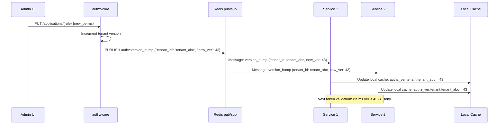
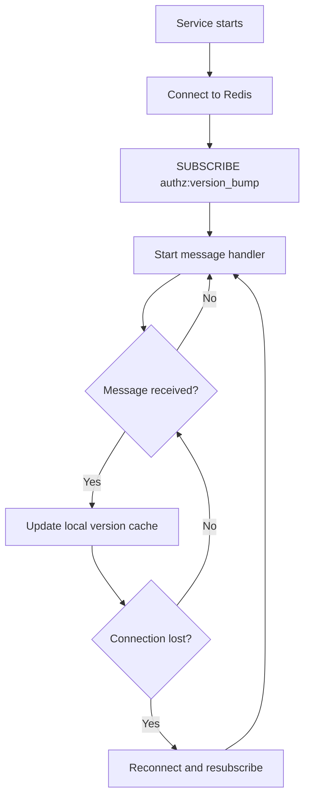

# Story 5.4: Implement Push Invalidation Events

## Epic

[05-token-versioning](../versioning.md)

## Parent Epic Story

Story 5.4

## Summary

Implement push invalidation events for important authz changes. When authz changes occur (role revoked, user disabled, org deleted), emit a version bump event. Downstream services drop cached version on receiving the bump. Uses Redis pub/sub for lightweight event delivery.

## Why This Story Exists

The JWT document identifies that "near-real-time revocation in a token-based world is an event-driven overlay on top of short-lived tokens, not an argument against tokens." Push invalidation allows services to know about version bumps immediately without waiting for the next token validation (which could be up to 60 seconds away due to cache TTL).

## Design Context

### Current State

- No push invalidation events exist
- Version bumps are stored in Redis but not propagated to services
- Services must wait for the next Redis lookup (or cached TTL) to see version bumps

### Redis Pub/Sub for Push Invalidation

Redis pub/sub is a lightweight broadcast mechanism:

```
Publisher (authz-core): PUBLISH authz:version_bump {"tenant_id": "tenant_abc", "new_ver": 43}
Subscriber (services): SUBSCRIBE authz:version_bump
```

Each subscribed service:
1. Receives the message
2. Updates its local version cache
3. Invalidates cached version lookups for affected tenants

### Event Format

```json
{
  "event": "version_bump",
  "tenant_id": "tenant_abc",
  "user_id": "user_123",       // optional, for subject-specific bumps
  "new_version": 43,
  "reason": "role_revoked",
  "timestamp": 1715000000
}
```

### Subscriber Implementation

```rust
pub struct VersionBumpSubscriber {
    local_version_cache: RwLock<HashMap<String, u64>>,  // sub -> version
    redis_pubsub: RedisPubSub,
}

impl VersionBumpSubscriber {
    pub fn start(&self) {
        self.redis_pubsub.subscribe("authz:version_bump", |msg| {
            let event: VersionBumpEvent = serde_json::from_str(&msg).unwrap();
            
            // Update local cache
            if let Some(ref user_id) = event.user_id {
                self.local_version_cache.write().insert(
                    format!("authz_ver:{user_id}"),
                    event.new_version,
                );
            }
            
            // Update tenant version
            self.local_version_cache.write().insert(
                format!("authz_ver:tenant:{}", event.tenant_id),
                event.new_version,
            );
        });
    }
    
    pub fn get_cached_version(&self, key: &str) -> Option<u64> {
        self.local_version_cache.read().get(key).copied()
    }
}
```

### Event-Driven vs Polling

| Approach | Pros | Cons |
|----------|------|------|
| **Push (pub/sub)** | Immediate propagation, no polling | Services must maintain subscription |
| **Polling (Redis GET)** | Simpler, no subscription overhead | Up to 60-second delay |

**Decision**: Use push (pub/sub) for production. Polling is acceptable for development/testing where event delivery is not critical.

## Mermaid Diagrams

### Push Invalidation Flow



### Event Propagation Timeline

```mermaid
gantt
    title Push Invalidation Timeline
    dateFormat X
    axisFormat %s
    section Event
    Authz change at t=0 :0, 0
    PUBLISH event       :10, 0
    Svc1 receives       :15, 0
    Svc2 receives       :20, 0
    Svc1 updates cache  :25, 0
    Svc2 updates cache  :30, 0
    section Validation
    Next validation     :100, 0
    claims.ver < 43     :100, 0
    Deny                :100, 0
```



### Service Subscription Lifecycle



## Malicious Hacker Gotchas (Must Be Addressed During Implementation)

> **Source:** `docs/PRS_SECURITY_HARDENING.md` — Security threat model analysis

### HACK-501: Redis Pub/Sub Is Fire-and-Forget — No Delivery Guarantees (CRITICAL — Hole #14 from PRS)

**Risk:** Missed events = stale permissions persist indefinitely

Redis pub/sub does NOT guarantee delivery. If a service is disconnected when an event is published, it misses the event entirely. The story says: "the next Redis lookup (polling) catches up after reconnection." But this means there's a GAP where the service doesn't know about the version bump.

**Exploit path (targeted):**
1. Attacker identifies which services are subscribed to `authz:version_bump`
2. Attacker disrupts the Redis connection for a specific service (e.g., by targeting its IP)
3. Attacker triggers a version bump (e.g., admin revokes attacker's permissions)
4. The event is published while the service is disconnected → MISSED
5. Service reconnects and resubscribes → misses the event forever (pub/sub is fire-and-forget)
6. Next Redis lookup catches up within 15-60 seconds (version cache TTL)
7. BUT: if the service's version cache TTL is already expired, the next request does `GET authz_ver:{user_id}` → returns nil → `unwrap_or(0)` → 0 → `claims.ver >= 0` → ALLOWED

**Combined with HACK-501a (Story 5.2) and HACK-501b (Story 5.2):**
- Missed event due to disconnection
- Next Redis lookup defaults to 0 (unwrap_or(0))
- Result: stale token accepted indefinitely until TTL expires

**Implementation requirement:**
- Push invalidation is an OPTIMIZATION, not a REQUIREMENT. The primary revocation mechanism must be:
  1. Version bump in Redis (Story 5.1)
  2. Version check on every request (Story 5.2) — FAIL CLOSED (not fail open)
  3. Token denylist for immediate revocation (Story 3.2)
- Push invalidation only REDUCES the window between version bump and service awareness. It does NOT replace the version check.
- Document: "Push invalidation is a latency optimization. It reduces the revocation window from 60 seconds (polling) to ~10ms (pub/sub). But the version check on every request is the PRIMARY revocation mechanism."

### HACK-502: Events Can Be Forged by Any Client (CRITICAL — related to Hole #7 from PRS)

**Risk:** Attacker publishes fake version bump to DENY ALL legitimate users

The event format is plain JSON published to `authz:version_bump`. There's NO authentication or signature on the event itself. Any client that can connect to Redis and publish to the channel can forge events.

**Exploit path (denial-of-service attack):**
1. Attacker obtains Redis access (via a service that connects to Redis, e.g., identity-login-service)
2. Attacker publishes a fake version bump: `PUBLISH authz:version_bump {"tenant_id": "hauliage", "new_version": 999999, "reason": "attacker"} `
3. All subscribed services receive the event and update their local cache to version 999999
4. Every legitimate user's token (ver < 999999) is now rejected with "Stale Auth Token"
5. Result: complete denial of service — ALL users locked out until the event is reverted

**Implementation requirement:**
- Events MUST be authenticated before updating the cache:
  - Verify the publisher is authz-core (check the Redis client identity or use ACL)
  - OR: sign the event with a HMAC using a shared secret (only authz-core and services know the secret)
  - OR: use Redis ACL to restrict PUBLISH to authz-core only, SUBSCRIBE to all services
- If Redis ACL is used, document: "Redis ACL must be configured to allow only authz-core to PUBLISH to the authz:version_bump channel"

### HACK-503: Fake Version Bump Can Be Used for PRIVILEGE ESCALATION (HIGH)

**Risk:** Attacker publishes fake version bump to bypass version checks

Wait — the exploit in HACK-502 was about DENIAL of service (setting version to 999999). But what about the OPPOSITE?

**Exploit path (privilege escalation):**
1. Attacker has a token with ver=42 (revoked, but version check not deployed or Redis down)
2. Attacker publishes: `PUBLISH authz:version_bump {"tenant_id": "hauliage", "new_version": 42}`
3. Services update local cache to version 42
4. Attacker's token (ver=42) passes version check (42 >= 42)
5. Result: revoked token is accepted because the fake event lowered the version

**Wait, this only works if the fake version is LOWER than the real one.** If the real version is 43 and the fake is 42, the version check still works: `claims.ver (42) < cached_ver (43)` → DENIED.

**But what if the attacker knows the real version?** If the attacker can read Redis, they can publish a fake event with the CURRENT version (43), and services update their cache to 43 (no change). The attacker's token (ver=42) is still rejected.

**The real exploit is different:** What if the attacker can make the LOCAL CACHE believe the version is LOWER than it actually is?

**Exploit path (cache poisoning via fake event):**
1. Attacker has access to authz-core's Redis connection
2. Attacker publishes: `PUBLISH authz:version_bump {"tenant_id": "hauliage", "new_version": 0}`
3. Services update local cache to version 0
4. Attacker's revoked token (ver=42) passes version check (42 >= 0)
5. Result: ALL tokens are accepted until the real version is rediscovered

**Implementation requirement:**
- Events must be SIGNED with HMAC:
  - authz-core signs every event: `HMAC-SHA256(shared_secret, event_json)`
  - Services verify the signature before updating the cache
  - If signature is invalid, reject the event and alert

### HACK-504: Event Volume DoS Can Cause Memory Exhaustion (HIGH — Hole #3 from PRS)

**Risk:** Attacker floods events to exhaust local cache memory

Each event updates the local cache in `VersionBumpSubscriber`. If an attacker floods the channel with events, every subscriber updates its cache for every event.

**Exploit path:**
1. Attacker floods `authz:version_bump` with 1 million events
2. Each subscriber processes each event and updates the local cache
3. The cache grows to 1 million entries (one per event)
4. Each service's memory usage increases by ~100MB (1M entries × 100 bytes each)
5. Result: memory exhaustion → OOM kill → service restart

**Implementation requirement:**
- Add a MAXIMUM cache size per subscriber (e.g., 10,000 entries)
- When the limit is reached, evict the oldest entries (LRU)
- OR: use a TTL on cache entries (matching the version cache TTL) so old entries expire automatically
- Rate limit event processing (e.g., max 100 events/sec per subscriber)

### HACK-505: Version Bump Event Format Is Not Signed (HIGH — Hole #7 from PRS)

**Risk:** Any client that can connect to Redis can forge version bump events

The event format is:
```json
{
  "event": "version_bump",
  "tenant_id": "tenant_abc",
  "user_id": "user_123",
  "new_version": 43,
  "reason": "role_revoked",
  "timestamp": 1715000000
}
```

There's no signature, no HMAC, no authentication. Any client that can publish to the Redis pub/sub channel can forge events with any `new_version`, any `tenant_id`, and any `reason`.

**Implementation requirement:**
- Add a `signature` field to every event: `HMAC-SHA256(shared_secret, canonical_json(event_without_signature))`
- Only authz-core (or services with the shared secret) can publish valid events
- Services MUST verify the signature before updating the cache
- If the signature is invalid: reject the event, log it, and alert

### HACK-506: Pub/Sub Events Do Not Survive Service Restarts (MEDIUM — Hole #9 from PRS)

**Risk:** After a service restart, it misses all version bumps that occurred while it was down

The service subscribes to `authz:version_bump` on startup. If the service is restarted:
1. All version bumps that occurred during the restart are MISSED
2. The service's local cache is EMPTY (fresh startup)
3. The next request does `GET authz_ver:{user_id}` from Redis
4. If Redis is unavailable: `unwrap_or(0)` → 0 → ALLOWED (HACK-501a)
5. If Redis is available: gets the current version → if `claims.ver < cached_ver` → DENIED

**The risk is only when Redis is ALSO down.** In that case, the service has NO version information and defaults to 0.

**Implementation requirement:**
- On startup, read the CURRENT version from Redis (NOT from pub/sub events)
- This is a "warm-up" step: immediately after subscribing, the service queries Redis for all known versions
- Document: "On startup, the subscriber queries Redis for current versions to initialize the local cache"

### HACK-507: Event Timestamp Is Trusted Without Validation (LOW — Hole #6 from PRS)

**Risk:** Attacker manipulates the `timestamp` field to distort metrics

The event includes a `timestamp` field used for `revocation_propagation_seconds` metric. An attacker can set the timestamp to any value, which distorts the metric and makes it harder to detect delayed propagation.

**Exploit path:**
1. Attacker publishes a fake event with `timestamp` far in the future
2. Service receives the event
3. `revocation_propagation_seconds` is negative (received_time - future_timestamp)
4. Metrics are corrupted → alerting fails

**Implementation requirement:**
- Validate `timestamp`: reject events where `timestamp > now + 60 seconds` (clock skew tolerance)
- Also reject events where `timestamp < now - 1 year` (impossibly old)

### HACK-508: Missing Event During Event-Driven Transition (MEDIUM — Hole #14 from PRS)

**Risk:** During the transition from polling to push invalidation, events may be missed

If services are upgraded one at a time (rolling update), some services may be using polling (Story 5.2) and others using push (Story 5.4). During this transition:
1. Services using polling see version bumps via Redis GET (every 15-60 seconds)
2. Services using push see version bumps via pub/sub (near-instant)
3. But if a service is upgraded to push and then disconnected, it MISSES the push event AND its polling mechanism is no longer active
4. Result: stale tokens accepted until reconnection

**Implementation requirement:**
- During the transition period, services should support BOTH polling AND push invalidation
- Push invalidation supplements polling, not replaces it
- If push events are missed, polling catches up

---

## OpenAPI Changes

No OpenAPI changes. Push invalidation is internal to the versioning system.

## Design Doc References

- `design-doc.md` section 10.4: Token Versioning & Revocation -- Layer 5: push invalidation events
- `design-doc.md` section 10.1: Token Security -- "Push invalidation events (near-real-time response for important events)"
- `design-doc.md` section 10.11: Caching Strategy -- Subject/tenant version cache (Redis pub/sub for push)

## Wiki Pages to Update/Create

- `topics/topic-token-versioning.md`: Document push invalidation events
- `topics/topic-caching-strategy.md`: Document Redis pub/sub for push

## Acceptance Criteria

- [ ] Redis pub/sub channel `authz:version_bump` is used for event delivery
- [ ] Event format includes: tenant_id, user_id (optional), new_version, reason, timestamp
- [ ] Services subscribe to the pub/sub channel on startup
- [ ] On event receipt, services update their local version cache
- [ ] Next token validation uses the updated local cache
- [ ] Stale tokens (ver < new_version) are rejected with 401 "Stale Auth Token"
- [ ] Reconnection logic handles Redis connection drops
- [ ] Metrics: `version_bump_total{reason: "role_revoked", "user_disabled", ...}` is emitted
- [ ] Metrics: `revocation_propagation_seconds` measures time from event to service awareness
- [ ] Unit tests verify: event publish, event receive, cache update, connection reconnection

## Dependencies

- Depends on Story 5.2 (version cache)
- Intersects with Epic 7 (caching strategy) for push invalidation

## Risk / Trade-offs

- **Redis pub/sub reliability**: Redis pub/sub does not guarantee delivery (no persistent queue). If a service is disconnected when an event is published, it misses the event. This is mitigated by:
  - Services reconnect and resubscribe on connection loss
  - The next Redis lookup (polling) catches up after reconnection
  - Token TTL (5 minutes) ensures stale tokens eventually expire even without push
- **Event volume**: If many authz changes occur, the pub/sub channel can become noisy. Each event triggers cache updates on all subscribed services. For high-volume scenarios, events should be batched or throttled.
- **Event-driven vs polling**: Push invalidation provides near-real-time propagation but adds complexity (subscription management, reconnection). Polling is simpler but has up to 60-second delay. The choice depends on the required revocation latency. For most use cases, polling with 30-second TTL is acceptable. Push invalidation is a "nice to have" for high-security environments.

## Tests

### Unit Tests

- [ ] **Event message format is valid JSON**: Given a `version_bump` event with tenant_id, new_version, and reason, assert the serialized message is valid JSON parseable into `VersionBumpEvent`
- [ ] **Event contains required fields**: Given a serialized event, assert it contains `event: "version_bump"`, `tenant_id`, `new_version`, `reason`, and `timestamp` fields
- [ ] **Event contains optional user_id when subject-specific**: Given a user-specific version bump, assert the event contains `user_id` field; given a tenant-wide bump, assert `user_id` is absent or `None`
- [ ] **Subscriber subscribes on startup**: Given a service starts with `VersionBumpSubscriber.start()`, assert a `SUBSCRIBE authz:version_bump` command is sent to Redis
- [ ] **Subscriber receives message and parses event**: Given a message `{"event":"version_bump","tenant_id":"abc","new_version":43,"reason":"role_revoked","timestamp":1715000000}`, assert the message handler deserializes it into a `VersionBumpEvent` struct with correct field values
- [ ] **On event receipt, subject version cache is updated**: Given an event with `user_id: "alice"` and `new_version: 43`, assert the local cache is updated: `local_version_cache["authz_ver:alice"] = 43`
- [ ] **On event receipt, tenant version cache is updated**: Given an event with `tenant_id: "abc"` and `new_version: 43`, assert the local cache is updated: `local_version_cache["authz_ver:tenant:abc"] = 43`
- [ ] **Subject event does not overwrite tenant version**: Given an event with `user_id: "alice"` and `tenant_id: "abc"` both at version 43, assert only the corresponding caches are updated — user-specific cache gets the user key, tenant cache gets the tenant key
- [ ] **On event receipt, local cache TTL is set**: Given a version bump event is received, assert the updated cache entry has an appropriate TTL (matching the version cache TTL from Story 5.2)
- [ ] **Redis connection drop triggers reconnection**: Given the Redis connection drops while subscribed, assert the subscriber detects the disconnection and initiates a reconnection with exponential backoff
- [ ] **Reconnection re-subscribes to channel**: Given a reconnection completes, assert the subscriber sends `SUBSCRIBE authz:version_bump` again on the new connection
- [ ] **Missed event due to disconnect is handled**: Given an event is published while the subscriber is disconnected, assert the subscriber does NOT process the missed event (pub/sub is fire-and-forget) — the next polling lookup catches up
- [ ] **Multiple events received in sequence**: Given 5 version bump events are published in rapid succession, assert the subscriber processes all 5 in order, updating the local cache correctly each time
- [ ] **Metrics: version_bump_total emitted on event receipt**: Assert `version_bump_total{reason: "role_revoked"}` (or the event's reason field) is incremented when an event is received
- [ ] **Metrics: revocation_propagation_seconds measured**: Assert the time from when the event was published (`timestamp` field) to when the service receives it is recorded in `revocation_propagation_seconds`
- [ ] **Subscriber handles malformed JSON gracefully**: Given a message containing invalid JSON is received on the pub/sub channel, assert the handler returns an error without crashing (not a panic or 500)
- [ ] **Subscriber handles event with missing required field**: Given an event missing the `tenant_id` field, assert the handler returns an error (invalid event) and does not update the cache
- [ ] **Subscriber handles event with missing new_version**: Given an event with `new_version = 0` or missing, assert the handler rejects the event (version 0 is not a valid bump)
- [ ] **Concurrent events update thread-safe cache**: Given 100 concurrent events arrive and the local cache uses `RwLock<HashMap>`, assert all 100 updates are applied correctly without race conditions

### Integration Tests (BDD-style with `rstest_bdd`)

- [ ] **Scenario: Push invalidation reduces revocation latency**: `given` tenant abc has `authz_ver:tenant:abc = 10` → `when` an authz change bumps the version to 11 → `then` the pub/sub event reaches all subscribed services within milliseconds (not 15-60 seconds waiting for polling)
- [ ] **Scenario: Service misses event but catches up via polling**: `given` a service is disconnected when event `ver=11` is published → `when` the service reconnects and resubscribes → `then` the missed event is not replayed (pub/sub does not guarantee delivery) but the next Redis lookup on the next request picks up version 11
- [ ] **Scenario: Multiple services receive the same event**: `given` 3 services are subscribed to `authz:version_bump` → `when` a version bump event is published → `then` all 3 services receive the event and update their local caches
- [ ] **Scenario: Subject-specific event updates only subject cache**: `given` a version bump event with `user_id: "alice"` and `tenant_id: "abc"` → `when` the event is received → `then` `local_version_cache["authz_ver:alice"] = new_version` AND `local_version_cache["authz_ver:tenant:abc"] = new_version`
- [ ] **Scenario: Tenant-wide event updates only tenant cache**: `given` a version bump event without `user_id` (tenant-wide change) → `when` the event is received → `then` only the tenant cache is updated; no subject-specific cache entries are created
- [ ] **Scenario: Stale token rejected after push invalidation**: `given` user bob has `ver = 10` and a version bump to 11 is published → `when` bob makes a high-risk request with `ver = 10` → `then` the receiving service's updated local cache returns `cached_ver = 11` and the request is denied
- [ ] **Scenario: Reconnection after Redis crash**: `given` a service is subscribed to `authz:version_bump` → `when` Redis crashes and restarts → `then` the subscriber detects the connection drop, reconnects, resubscribes, and resumes receiving events
- [ ] **Scenario: Event propagation latency under load**: `given` 10 services are subscribed → `when` a version bump event is published → `then` all 10 services receive the event within 10ms (measure `revocation_propagation_seconds` histogram)
- [ ] **Scenario: Rapid successive version bumps**: `given` tenant version goes 10 → 11 → 12 → 13 via 4 rapid events → `when` the events are processed → `then` the local cache ends at version 13 (all 4 events processed in order)
- [ ] **Scenario: Push invalidation metrics emitted**: `given` a version bump event is received by a service → `then` `version_bump_total{reason: "role_revoked"}` is incremented and `revocation_propagation_seconds` records a value in the milliseconds range

### Security Regression Tests

- [ ] **Event cannot be forged by unauthenticated client**: Assert that version bump events are only published by authz-core (the service that performs authz changes) — a malicious client cannot publish a forged event to `authz:version_bump` and trick other services
- [ ] **Event cannot escalate privileges via version manipulation**: Assert that a malicious actor cannot publish a falsified version bump event with a higher version to deny legitimate requests — only the authz-core service publishes events, and services validate the publisher identity
- [ ] **Event-driven does not bypass tenant isolation**: Assert that a version bump event for tenant A does not update the local cache of a service processing tenant B's requests — tenant_id in the event is scoped to the affected tenant
- [ ] **Redis pub/sub cannot be used for DoS**: Assert that even if an attacker can publish to the `authz:version_bump` channel, the event processing is lightweight (just updating a HashMap entry) and cannot cause a service to become unresponsive
- [ ] **Missed events do not create a security gap**: Assert that even when a service misses a pub/sub event (disconnected), the polling mechanism catches up within the version cache TTL (15-60 seconds), ensuring stale tokens are eventually rejected
- [ ] **Event volume cannot overwhelm subscribed services**: Assert that even under heavy authz change traffic (1000 events/sec), the event processing loop handles each event in <1ms — the cache update is a simple HashMap write, no database or network calls
- [ ] **Reconnection does not create version inconsistency**: Assert that during reconnection, the service does not process the same event twice (idempotent cache update) — updating the same version in the cache twice has no adverse effect

### Edge Cases

- [ ] **Event with empty tenant_id**: Given an event with `tenant_id: ""`, assert the handler rejects the event as invalid (empty tenant_id is not a valid tenant)
- [ ] **Event with new_version = 0**: Given an event with `new_version: 0`, assert the handler rejects the event (version 0 cannot be a valid bump — it means no change occurred)
- [ ] **Event with extremely large new_version**: Given an event with `new_version: 18446744073709551615` (u64::MAX), assert the cache update succeeds without overflow — the HashMap stores the value as u64
- [ ] **Event timestamp in the future**: Given an event with `timestamp` far in the future, assert the handler accepts the event (timestamp is for metric calculation only, not for validation)
- [ ] **Event timestamp in the past**: Given an event with `timestamp` from 1 year ago, assert the handler accepts the event and records a very large `revocation_propagation_seconds` value in the metrics
- [ ] **Publisher disconnects during publish**: Given authz-core is publishing an event and disconnects mid-publish, assert the partial message is either dropped by Redis or delivered as garbage — the subscriber must handle invalid JSON gracefully
- [ ] **Subscriber processes event while handling a version check**: Given the event handler updates the local cache while another thread is reading it for a version check, assert the RwLock prevents data races — readers get a consistent snapshot
- [ ] **Event with unknown reason field**: Given an event with `reason: "unknown_event_type"`, assert the handler processes the event normally and logs the unknown reason — the reason field is for metrics/metadata, not routing
- [ ] **Subscriber disconnected for extended period**: Given a subscriber is disconnected for 1 hour and 100 version bumps occur during that time, assert on reconnection the subscriber does not try to replay missed events and simply resumes from the current point — Redis pub/sub is fire-and-forget
- [ ] **Redis cluster pub/sub during failover**: Given a Redis cluster failover occurs while the subscriber is receiving events, assert the subscriber reconnects to the new master and resubscribes — no events are lost during reconnection (though some published during failover may be lost)

### Cleanup

- Redis pub/sub state must be cleaned between test scenarios — unsubscribe all subscribers and flush the test Redis database before each test run
- Local version caches in `VersionBumpSubscriber` must be reset between tests — use a fresh subscriber instance per test or call `cache.clear()`
- If using a mock Redis for pub/sub tests, ensure the mock is reset between tests — use a fresh mock instance or call `mock.reset()`
- Metrics registry must be reset between test scenarios using `prometheus::Registry::new()` to prevent cross-test metric contamination
- Redis connection used by the subscriber must be properly closed between tests — verify no connection leaks by checking connection pool stats
- Event timestamp values should be generated per test using `chrono::Utc::now()` — do not hardcode timestamps across tests
- If using Redis pub/sub in tests, ensure all test subscribers unsubscribe before the test ends — Redis does not auto-unsubscribe on connection close
- `version_bump_total` and `revocation_propagation_seconds` metrics must be cleared between tests — use a fresh `prometheus::Registry` per test scenario
