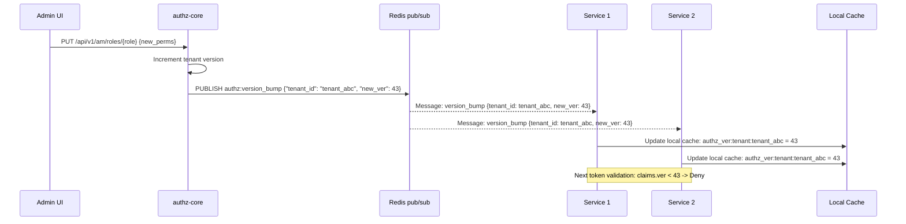
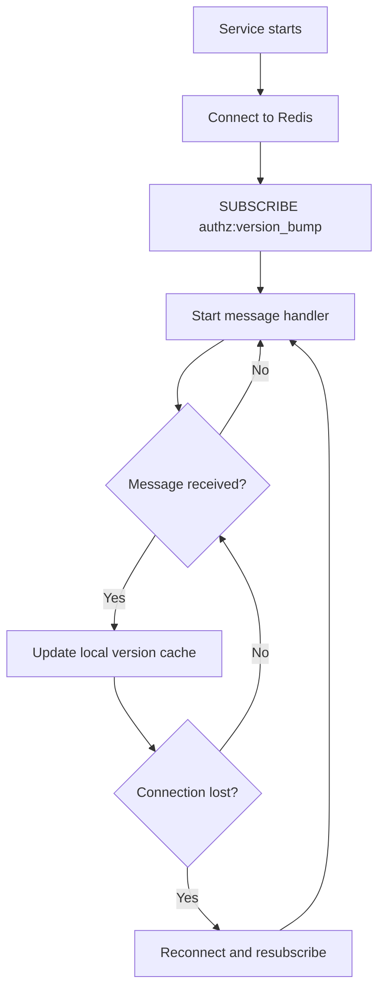

# Story 5.4: Implement Push Invalidation Events

## Epic

[05-token-versioning](../versioning.md)

## Parent Epic Story

Story 5.4

## Summary

Implement push invalidation events for important authz changes. When authz changes occur (role revoked, user disabled, org deleted), emit a version bump event. Downstream services drop cached version on receiving the bump. Uses Redis pub/sub for lightweight event delivery.

## Why This Story Exists

The JWT document identifies that "near-real-time revocation in a token-based world is an event-driven overlay on top of short-lived tokens, not an argument against tokens." Push invalidation allows services to know about version bumps immediately without waiting for the next token validation (which could be up to 60 seconds away due to cache TTL).

## Design Context

### Current State

- No push invalidation events exist
- Version bumps are stored in Redis but not propagated to services
- Services must wait for the next Redis lookup (or cached TTL) to see version bumps

### Redis Pub/Sub for Push Invalidation

Redis pub/sub is a lightweight broadcast mechanism:

```
Publisher (authz-core): PUBLISH authz:version_bump {"tenant_id": "tenant_abc", "new_ver": 43}
Subscriber (services): SUBSCRIBE authz:version_bump
```

Each subscribed service:
1. Receives the message
2. Updates its local version cache
3. Invalidates cached version lookups for affected tenants

### Event Format

```json
{
  "event": "version_bump",
  "tenant_id": "tenant_abc",
  "user_id": "user_123",       // optional, for subject-specific bumps
  "new_version": 43,
  "reason": "role_revoked",
  "timestamp": 1715000000
}
```

### Subscriber Implementation

```rust
pub struct VersionBumpSubscriber {
    local_version_cache: RwLock<HashMap<String, u64>>,  // sub -> version
    redis_pubsub: RedisPubSub,
}

impl VersionBumpSubscriber {
    pub fn start(&self) {
        self.redis_pubsub.subscribe("authz:version_bump", |msg| {
            let event: VersionBumpEvent = serde_json::from_str(&msg).unwrap();
            
            // Update local cache
            if let Some(ref user_id) = event.user_id {
                self.local_version_cache.write().insert(
                    format!("authz_ver:{user_id}"),
                    event.new_version,
                );
            }
            
            // Update tenant version
            self.local_version_cache.write().insert(
                format!("authz_ver:tenant:{}", event.tenant_id),
                event.new_version,
            );
        });
    }
    
    pub fn get_cached_version(&self, key: &str) -> Option<u64> {
        self.local_version_cache.read().get(key).copied()
    }
}
```

### Event-Driven vs Polling

| Approach | Pros | Cons |
|----------|------|------|
| **Push (pub/sub)** | Immediate propagation, no polling | Services must maintain subscription |
| **Polling (Redis GET)** | Simpler, no subscription overhead | Up to 60-second delay |

**Decision**: Use push (pub/sub) for production. Polling is acceptable for development/testing where event delivery is not critical.

## Mermaid Diagrams

### Push Invalidation Flow



### Event Propagation Timeline

```mermaid
gantt
    title Push Invalidation Timeline
    dateFormat X
    axisFormat %s
    section Event
    Authz change at t=0 :0, 0
    PUBLISH event       :10, 0
    Svc1 receives       :15, 0
    Svc2 receives       :20, 0
    Svc1 updates cache  :25, 0
    Svc2 updates cache  :30, 0
    section Validation
    Next validation     :100, 0
    claims.ver < 43     :100, 0
    Deny                :100, 0
```



### Service Subscription Lifecycle



## OpenAPI Changes

No OpenAPI changes. Push invalidation is internal to the versioning system.

## Design Doc References

- `design-doc.md` section 10.4: Token Versioning & Revocation -- Layer 5: push invalidation events
- `design-doc.md` section 10.1: Token Security -- "Push invalidation events (near-real-time response for important events)"
- `design-doc.md` section 10.11: Caching Strategy -- Subject/tenant version cache (Redis pub/sub for push)

## Wiki Pages to Update/Create

- `topics/topic-token-versioning.md`: Document push invalidation events
- `topics/topic-caching-strategy.md`: Document Redis pub/sub for push

## Acceptance Criteria

- [ ] Redis pub/sub channel `authz:version_bump` is used for event delivery
- [ ] Event format includes: tenant_id, user_id (optional), new_version, reason, timestamp
- [ ] Services subscribe to the pub/sub channel on startup
- [ ] On event receipt, services update their local version cache
- [ ] Next token validation uses the updated local cache
- [ ] Stale tokens (ver < new_version) are rejected with 401 "Stale Auth Token"
- [ ] Reconnection logic handles Redis connection drops
- [ ] Metrics: `version_bump_total{reason: "role_revoked", "user_disabled", ...}` is emitted
- [ ] Metrics: `revocation_propagation_seconds` measures time from event to service awareness
- [ ] Unit tests verify: event publish, event receive, cache update, connection reconnection

## Dependencies

- Depends on Story 5.2 (version cache)
- Intersects with Epic 7 (caching strategy) for push invalidation

## Risk / Trade-offs

- **Redis pub/sub reliability**: Redis pub/sub does not guarantee delivery (no persistent queue). If a service is disconnected when an event is published, it misses the event. This is mitigated by:
  - Services reconnect and resubscribe on connection loss
  - The next Redis lookup (polling) catches up after reconnection
  - Token TTL (5 minutes) ensures stale tokens eventually expire even without push
- **Event volume**: If many authz changes occur, the pub/sub channel can become noisy. Each event triggers cache updates on all subscribed services. For high-volume scenarios, events should be batched or throttled.
- **Event-driven vs polling**: Push invalidation provides near-real-time propagation but adds complexity (subscription management, reconnection). Polling is simpler but has up to 60-second delay. The choice depends on the required revocation latency. For most use cases, polling with 30-second TTL is acceptable. Push invalidation is a "nice to have" for high-security environments.
