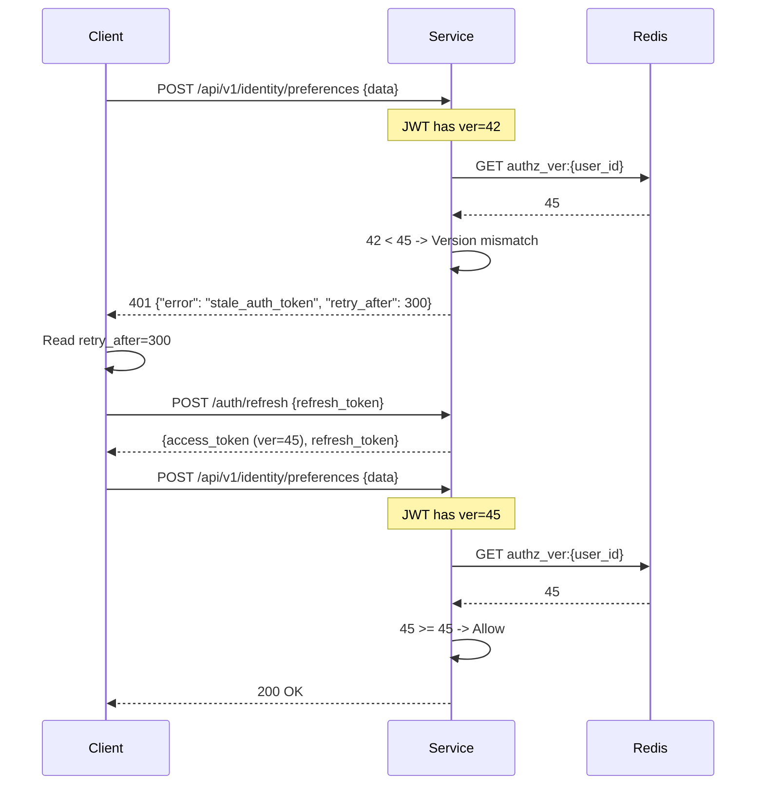
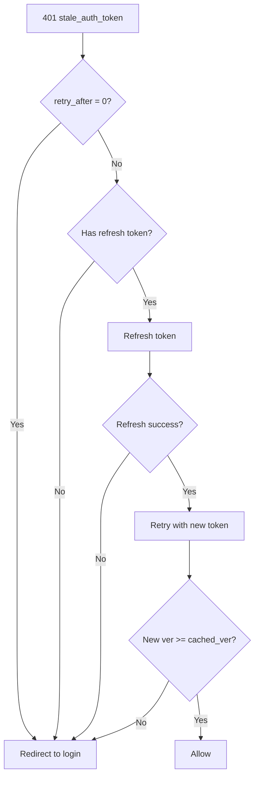

# Story 5.5: Implement Version Mismatch Handling

## Epic

[05-token-versioning](../versioning.md)

## Parent Epic Story

Story 5.5

## Summary

Implement the response logic when a version mismatch is detected: deny with "stale authz snapshot", return 401 with retry-after header, and require the client to re-authenticate to get a fresh token with the new version.

## Why This Story Exists

The JWT document states: "When claims.ver < current_ver: deny with 'stale authz snapshot', return 401 with retry-after header. Client must re-authenticate to get fresh token with new version." This story implements the denial and retry logic that makes version checking actionable.

## Design Context

### Current State

- No version mismatch handling exists
- No 401 "stale auth token" response
- No retry-after header support

### Response Format

```http
HTTP/1.1 401 Unauthorized
WWW-Authenticate: Bearer error="stale_auth_token", retry_after=300
Content-Type: application/json

{
  "error": "stale_auth_token",
  "message": "Your token has been revoked due to a privilege change. Please log in again.",
  "retry_after": 300,
  "reason": "stale_authz_snapshot"
}
```

### Retry-After Header

The `retry_after` value in seconds represents the maximum time the client should wait before retrying:

| Scenario | retry_after | Rationale |
|----------|-------------|-----------|
| User disabled | 0 (immediate) | No retry -- must re-authenticate |
| Role removed | 300 (5 min) | Wait for new token, which takes one refresh cycle |
| Org deleted | 0 (immediate) | No retry -- must re-authenticate with different tenant |
| Admin action | 300 (5 min) | Standard retry window |

### Client Behavior

```
1. Client receives 401 stale_auth_token
2. Client reads retry_after header
3. Client refreshes token using refresh token
4. If refresh succeeds: retry original request with new token
5. If refresh fails (401): redirect to login
```

## Implementation Notes

### Version Mismatch in Middleware

```rust
fn handle_version_mismatch(
    claims_ver: u64,
    cached_ver: u64,
) -> Result<AuthError, AuthError> {
    let retry_after = if cached_ver - claims_ver > 100 {
        // Large version gap (e.g., user disabled multiple times)
        0
    } else {
        // Normal version bump (1-10 increments)
        300  // 5 minutes
    };
    
    Ok(AuthError::StaleAuthToken {
        retry_after,
        expected_min_version: cached_ver,
        actual_version: claims_ver,
    })
}
```

### HTTP Response Construction

```rust
impl AuthError {
    pub fn to_http_response(&self) -> HttpResponse {
        match self {
            AuthError::StaleAuthToken { retry_after, .. } => {
                HttpResponse::Unauthorized()
                    .append_header(("WWW-Authenticate", 
                        &format!("Bearer error=\"stale_auth_token\", retry_after={}", retry_after)))
                    .append_header(("Retry-After", &retry_after.to_string()))
                    .json(json!({
                        "error": "stale_auth_token",
                        "message": "Your token has been revoked due to a privilege change. Please log in again.",
                        "retry_after": retry_after,
                        "reason": "stale_authz_snapshot"
                    }))
            }
            // ... other auth errors
        }
    }
}
```

### Error Code Mapping

| Error Code | HTTP Status | Response Body | Retry Behavior |
|-----------|-------------|---------------|----------------|
| `stale_auth_token` | 401 | JSON with retry_after | Refresh token or re-auth |
| `token_expired` | 401 | JSON | Refresh token |
| `token_revoked` | 401 | JSON | Re-authenticate |
| `invalid_token` | 401 | JSON | Re-authenticate |

## Mermaid Diagrams

### Version Mismatch Flow



### Version Gap Scenarios

```mermaid
flowchart TD
    A[Version mismatch] --> B{Gap size?}
    B -->|Small: 1-10| C[retry_after = 300 (5 min)]
    B -->|Large: >100| D[retry_after = 0 (immediate)]
    
    C --> E[Client refreshes token]
    D --> F[Client must re-authenticate]
    
    E --> G[New token with updated ver]
    G --> H[Retry original request]
    F --> I[Login flow]
    I --> G
```

### Retry Behavior



## OpenAPI Changes

- `/auth/introspect` response: Add `error` and `retry_after` fields for stale token scenarios
- All auth error responses: Document the `stale_auth_token` error code

```yaml
components:
  schemas:
    AuthError:
      type: object
      required: [error, message]
      properties:
        error:
          type: string
          enum: [stale_auth_token, token_expired, token_revoked, invalid_token, insufficient_permissions]
        message:
          type: string
        retry_after:
          type: integer
          format: int64
          description: Seconds to wait before retrying (0 = immediate re-auth required)
        reason:
          type: string
          description: Machine-readable reason for the error
```

## Design Doc References

- `design-doc.md` section 10.4: Token Versioning & Revocation -- version mismatch handling
- `design-doc.md` section 10.1: Token Security -- "If claims.ver < current_ver, deny with stale authz snapshot, return 401 with retry-after header"

## Wiki Pages to Update/Create

- `topics/topic-token-versioning.md`: Document version mismatch handling
- `topics/topic-token-lifecycle.md`: Document retry behavior

## Acceptance Criteria

- [ ] Version mismatch returns HTTP 401 Unauthorized
- [ ] Response body includes `error: "stale_auth_token"` and `reason: "stale_authz_snapshot"`
- [ ] Response includes `retry_after` header (seconds to wait)
- [ ] Response includes `retry_after` in JSON body
- [ ] Small version gaps (1-10): retry_after = 300 seconds
- [ ] Large version gaps (>100): retry_after = 0 (immediate re-auth)
- [ ] Client can refresh token after receiving stale_auth_token
- [ ] After refresh, the new token has the updated version
- [ ] Unit tests verify: version mismatch detection, retry_after calculation, error response format

## Dependencies

- Depends on Story 5.2 (version cache) and Story 5.3 (jti denylist)

## Risk / Trade-offs

- **retry_after uncertainty**: The retry_after value is a guess -- it doesn't know exactly when the client's refresh token will be valid. The 300-second default is a reasonable estimate (one refresh cycle), but the client may need to wait longer if their refresh token is expired or invalid.
- **401 vs 403**: Should a stale token return 401 (unauthorized) or 403 (forbidden)? I chose 401 because the token is technically invalid for the requested operation (it's stale). However, some frameworks treat 401 as "not authenticated" and 403 as "authenticated but not allowed." Since the token IS authenticated (valid signature), 401 with `error="stale_auth_token"` is the correct HTTP semantic.
- **Client-side retry logic**: Clients must implement retry-after handling. This is a client-side responsibility -- the backend only provides the retry_after header. The frontend SDK should handle this transparently (refresh token, retry request).
