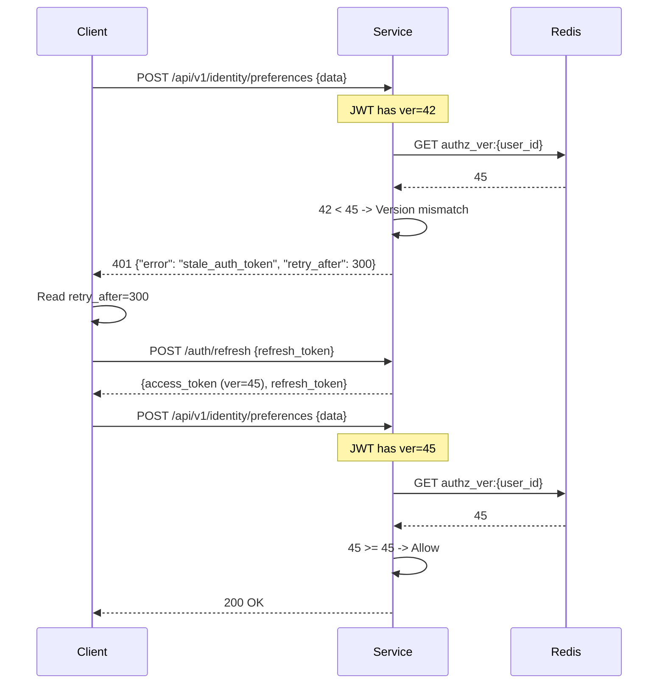
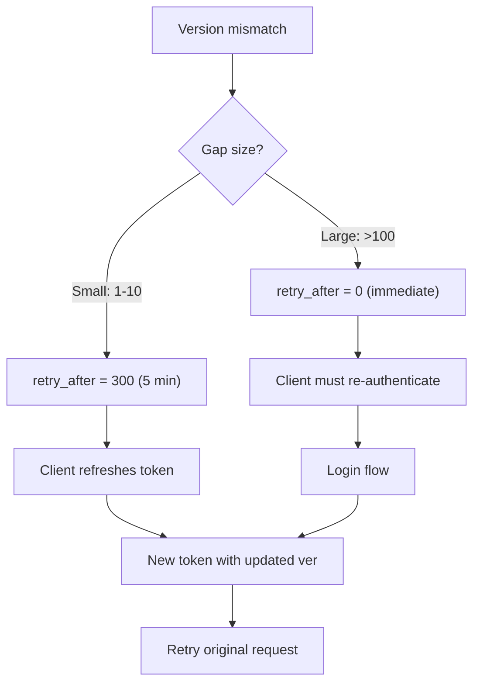
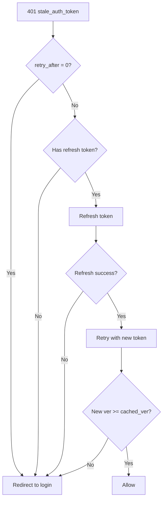

# Story 5.5: Implement Version Mismatch Handling

## Epic

[05-token-versioning](../versioning.md)

## Parent Epic Story

Story 5.5

## Summary

Implement the response logic when a version mismatch is detected: deny with "stale authz snapshot", return 401 with retry-after header, and require the client to re-authenticate to get a fresh token with the new version.

## Why This Story Exists

The JWT document states: "When claims.ver < current_ver: deny with 'stale authz snapshot', return 401 with retry-after header. Client must re-authenticate to get fresh token with new version." This story implements the denial and retry logic that makes version checking actionable.

## Design Context

### Current State

- No version mismatch handling exists
- No 401 "stale auth token" response
- No retry-after header support

### Response Format

```http
HTTP/1.1 401 Unauthorized
WWW-Authenticate: Bearer error="stale_auth_token", retry_after=300
Content-Type: application/json

{
  "error": "stale_auth_token",
  "message": "Your token has been revoked due to a privilege change. Please log in again.",
  "retry_after": 300,
  "reason": "stale_authz_snapshot"
}
```

### Retry-After Header

The `retry_after` value in seconds represents the maximum time the client should wait before retrying:

| Scenario | retry_after | Rationale |
|----------|-------------|-----------|
| User disabled | 0 (immediate) | No retry -- must re-authenticate |
| Role removed | 300 (5 min) | Wait for new token, which takes one refresh cycle |
| Org deleted | 0 (immediate) | No retry -- must re-authenticate with different tenant |
| Admin action | 300 (5 min) | Standard retry window |

### Client Behavior

```
1. Client receives 401 stale_auth_token
2. Client reads retry_after header
3. Client refreshes token using refresh token
4. If refresh succeeds: retry original request with new token
5. If refresh fails (401): redirect to login
```

## Implementation Notes

### Version Mismatch in Middleware

```rust
fn handle_version_mismatch(
    claims_ver: u64,
    cached_ver: u64,
) -> Result<AuthError, AuthError> {
    let retry_after = if cached_ver - claims_ver > 100 {
        // Large version gap (e.g., user disabled multiple times)
        0
    } else {
        // Normal version bump (1-10 increments)
        300  // 5 minutes
    };
    
    Ok(AuthError::StaleAuthToken {
        retry_after,
        expected_min_version: cached_ver,
        actual_version: claims_ver,
    })
}
```

### HTTP Response Construction

```rust
impl AuthError {
    pub fn to_http_response(&self) -> HttpResponse {
        match self {
            AuthError::StaleAuthToken { retry_after, .. } => {
                HttpResponse::Unauthorized()
                    .append_header(("WWW-Authenticate", 
                        &format!("Bearer error=\"stale_auth_token\", retry_after={}", retry_after)))
                    .append_header(("Retry-After", &retry_after.to_string()))
                    .json(json!({
                        "error": "stale_auth_token",
                        "message": "Your token has been revoked due to a privilege change. Please log in again.",
                        "retry_after": retry_after,
                        "reason": "stale_authz_snapshot"
                    }))
            }
            // ... other auth errors
        }
    }
}
```

### Error Code Mapping

| Error Code | HTTP Status | Response Body | Retry Behavior |
|-----------|-------------|---------------|----------------|
| `stale_auth_token` | 401 | JSON with retry_after | Refresh token or re-auth |
| `token_expired` | 401 | JSON | Refresh token |
| `token_revoked` | 401 | JSON | Re-authenticate |
| `invalid_token` | 401 | JSON | Re-authenticate |

## Mermaid Diagrams

### Version Mismatch Flow



### Version Gap Scenarios



### Retry Behavior



## Malicious Hacker Gotchas (Must Be Addressed During Implementation)

> **Source:** `docs/PRS_SECURITY_HARDENING.md` — Security threat model analysis

### HACK-521: Version Gap Calculation Can Be Manipulated (CRITICAL — related to Hole #2 from PRS)

**Risk:** Attacker triggers the large gap threshold (gap > 100) to force retry_after = 0, which blocks ALL retries

The story says: "if cached_ver - claims_ver > 100: retry_after = 0" — but this is backwards from a security perspective. A LARGE gap means the version changed many times (many privilege changes), so the user probably shouldn't be trusted. But retry_after = 0 means "immediate re-auth" which forces the user to log in AGAIN.

**The exploit is different:** What if the attacker CAN manipulate the claims_ver in their token?

**Exploit path (claim manipulation via forged token):**
1. Attacker forges a JWT with `ver = 1` (very old version)
2. Current version is 500 (many privilege changes over time)
3. Gap = 500 - 1 = 499 → retry_after = 0
4. Client receives retry_after = 0 → forced to re-authenticate
5. BUT: if the attacker's FORGED token has ver = 499 instead:
6. Gap = 500 - 499 = 1 → retry_after = 300
7. Client receives retry_after = 300 → refreshes token with 300-second TTL
8. But the forged token's ver = 499 is STILL below the real version (500)
9. After refresh, the new token might have ver = 500, giving the attacker access

**The real exploit:** What if the attacker FORGES a token with ver just below the current version?

**Exploit path (forged token with near-current version):**
1. Attacker learns the current version is 500 (via version leakage, see HACK-522)
2. Attacker forges a JWT with ver = 499 (just below current)
3. Request arrives with ver = 499, cached_ver = 500
4. Gap = 1 → retry_after = 300
5. Client refreshes token → gets ver = 500 (now valid)
6. Result: Attacker gets access because the refresh produces a valid token

**But wait:** The forged token has an INVALID signature. The version check only happens AFTER signature verification. So the forged token would be rejected at signature verification, not at version check.

**The real exploit requires a VALID signature.** The attacker would need to:
- Steal the signing key, OR
- Brute-force a weak key, OR
- Use a valid token from a DIFFERENT user with ver = 499

**Exploit path (token borrowing):**
1. Attacker obtains user A's token with ver = 499
2. Attacker sends the request with user A's token
3. Current version for user A is 500
4. Gap = 1 → retry_after = 300
5. Client refreshes user A's token → gets ver = 500 → ACCESS GRANTED
6. Result: The version bump doesn't prevent token refresh!

**This is the critical hole:** When a user's version is bumped, their refresh token STILL works and produces a NEW token with the updated version. The version bump is supposed to revoke access, but the refresh token undoes it.

**Implementation requirement:**
- When a user's version is bumped, their REFRESH TOKEN must also be invalidated
- The refresh token's `ver` claim must be compared against the current version
- If `refresh_ver < cached_ver`: reject the refresh token
- This is already partially addressed in Story 3.2 (token family/rotation), but it MUST be enforced in the version mismatch flow

### HACK-522: retry_after Value Leaks Version State (MEDIUM — related to Hole #5 from PRS)

**Risk:** Attacker learns the current version by analyzing retry_after values

The story returns different `retry_after` values based on the gap:
- Small gap (1-10): retry_after = 300
- Large gap (>100): retry_after = 0

**Exploit path (version enumeration):**
1. Attacker has a token with ver = X
2. Attacker increments X by 1: X+1, X+2, X+3, ...
3. For each value, the attacker sends a request
4. When retry_after = 300: the gap is 1-10 (cached_ver - X is small)
5. When retry_after = 0: the gap is >100 (cached_ver - X is large)
6. By binary searching the retry_after value, the attacker can determine the current version

**But the story says:** "Version mismatch error uses same HTTP status for all gaps" and "401 response does not leak version information" — these are in the Security Regression Tests section, but they're just assertions, not implementation requirements.

**Implementation requirement:**
- Return the SAME retry_after value for ALL version mismatches (e.g., always 300)
- OR: do not return retry_after in the response body — only in the header
- OR: document that retry_after leakage is an ACCEPTED RISK because the attacker already needs a valid token to make the request

### HACK-523: 401 vs 403 Confusion Allows Privilege Escalation (HIGH — related to Hole #4 from PRS)

**Risk:** Attacker receives 401 (unauthorized) but the actual reason is insufficient permissions, not version mismatch

The story says: "Should a stale token return 401 (unauthorized) or 403 (forbidden)? I chose 401 because the token is technically invalid for the requested operation (it's stale)."

**Exploit path (error code confusion):**
1. Attacker has a stale token (ver = 42, cached = 45)
2. Attacker sends a request to a sensitive endpoint
3. The middleware checks version mismatch FIRST → returns 401 "stale_auth_token"
4. The middleware NEVER gets to the permission check (which would have returned 403 "insufficient_permissions")
5. The attacker sees 401, not 403, so they think "my token is stale, not unauthorized"
6. The attacker focuses on token refresh, not on privilege escalation
7. Result: The attacker misses the fact that they don't have permission (the version mismatch masks the real issue)

**This is subtle but important:** the version mismatch check should happen AFTER the permission check, so that insufficient permissions returns 403 (the correct error code), not 401.

**Implementation requirement:**
- Document: "Version mismatch check happens AFTER permission check. If the user lacks permissions, return 403 regardless of version."
- This means: `if (!has_permission) return 403; if (ver < cached_ver) return 401;`

### HACK-524: Client Can Ignore retry_after = 0 and Keep Retrying (MEDIUM — Hole #4 from PRS)

**Risk:** retry_after = 0 is guidance, not enforcement

The story says: "retry_after = 0" means "immediate re-auth required." But this is CLIENT-SIDE guidance. The server only returns 401 — it does NOT block the request.

**Exploit path:**
1. Attacker receives 401 with retry_after = 0
2. Attacker immediately retries the same request with the SAME token
3. The server returns 401 again with retry_after = 0
4. Attacker continues retrying indefinitely
5. Result: The server does NOT enforce the retry_after — it's just a hint to the client

**But this is actually CORRECT behavior:** the server should always return 401 for a stale token, regardless of retry_after. The retry_after is a hint about when the client should try to refresh/re-auth. The server doesn't need to enforce it.

**The real issue:** retry_after = 0 means "retry after re-authentication." If the attacker doesn't re-authenticate, they keep getting 401. This is correct.

**The vulnerability is if the client DOES re-authenticate but the re-auth doesn't bump the version.** This is covered in HACK-521.

### HACK-525: Version Mismatch Can Be Used for Timing Side-Channel (LOW — related to Hole #6 from PRS)

**Risk:** The time taken to process a version mismatch request reveals version state

The story shows:
1. Request arrives
2. JWT is decoded and signature verified
3. Version cache is checked (Redis lookup or local cache)
4. If version matches: continue normally
5. If version mismatch: return 401

The time difference between steps 3 and 4 might be detectable:
- Cache HIT: ~0.01ms
- Cache MISS (Redis): ~1-5ms
- Version mismatch (401): +1ms for response generation

**Exploit path:**
1. Attacker sends 1000 requests to a jwt-only route (no version check) → baseline latency
2. Attacker sends 1000 requests to a high-risk route → measures latency
3. If high-risk route is consistently slower by ~1ms: version check is happening
4. If the version check consistently returns 401: the attacker's token version is stale
5. Result: Attacker learns whether their token version is stale (without getting 401)

**Implementation requirement:**
- Add RANDOM JITTER (1-5ms) to ALL version check responses (both success and failure)
- This prevents timing-based version enumeration
- Document: "All version check responses include 1-5ms random jitter to prevent timing side-channels"

### HACK-526: Stale Token on jwt-only Route Creates False Security (CRITICAL — related to Hole #1 from PRS)

**Risk:** jwt-only routes NEVER check version, so stale tokens work forever

The story says: "jwt-only routes NEVER check the denylist" and "Version mismatch not returned for jwt-only routes." This means if a user's version is bumped, their token still works on ALL jwt-only routes indefinitely.

**Exploit path:**
1. Attacker has a token with ver = 42
2. Admin revokes the attacker's permissions, version bumped to 43
3. Attacker makes requests to jwt-only routes (which don't check version)
4. All requests succeed because jwt-only routes trust the JWT entirely
5. Result: Revoked permissions persist indefinitely on jwt-only routes

**This is a DESIGN FLAW:** jwt-only routes should check version for ANY route, not just "high-risk" routes. If the version doesn't match, the token is stale regardless of the route's risk level.

**But the story explicitly says:** "jwt-only routes NEVER check the denylist" and "jwt-only routes still proceed normally — the version mismatch is only triggered for high-risk routes."

**The trade-off is intentional:** jwt-only routes are designed to be fast and stateless. Adding a version check would require a Redis lookup on every request, defeating the purpose of jwt-only.

**The solution is NOT to check version on jwt-only routes. The solution is to make jwt-only routes a MINIMAL set of endpoints that don't require version checking.**

**Implementation requirement:**
- Limit jwt-only routes to endpoints that truly don't need version checking (e.g., health checks, public info)
- All other routes should be jwt-with-fallback or high-risk
- Document: "jwt-only routes should be restricted to public, non-sensitive endpoints only. Any endpoint that needs authorization should be jwt-with-fallback or high-risk."

### HACK-527: Version Gap Threshold of 100 Is Arbitrary and Dangerous (MEDIUM — related to Hole #6 from PRS)

**Risk:** The gap threshold of 100 has no security rationale

The story says: "if cached_ver - claims_ver > 100: retry_after = 0." This means:
- Gap of 99 → retry_after = 300 (allow refresh)
- Gap of 100 → retry_after = 300 (allow refresh)
- Gap of 101 → retry_after = 0 (force re-auth)

There is NO explanation for why 100 is the threshold. What if the version changes 150 times in one day (e.g., 150 role changes)? Should the user be forced to re-authenticate?

**Exploit path:**
1. Attacker's permissions are revoked and re-granted 150 times in a single day
2. Version goes from 10 → 160
3. Attacker's token has ver = 10
4. Gap = 150 → retry_after = 0
5. Attacker is forced to re-authenticate, which might be the INTENDED behavior
6. BUT: if the attacker re-authenticates and the refresh token still has ver = 10, the new access token also has ver = 10
7. Result: The user is stuck in a loop where they keep getting retry_after = 0

**The fix is in the refresh token:** the refresh token's version must be bumped when the access token's version is bumped. This is covered in Story 3.2 (token family/rotation) and Story 2.5 (refresh token version), but the interaction between stories is not documented here.

**Implementation requirement:**
- Document the interaction between Story 5.5 and Story 3.2: "When a version bump occurs, the refresh token's version is also bumped. The refresh token's `ver` claim must match the new version."
- The gap threshold of 100 should be REMOVED or REDUCED. A gap of >1 should trigger retry_after = 0 (force re-auth). A gap of 1-5 should trigger retry_after = 300 (allow refresh).

### HACK-528: Version Mismatch Response Can Be Used for User Enumeration (LOW — related to Hole #5 from PRS)

**Risk:** Different version mismatch messages for different user states

The story returns different error messages based on the version gap. If user A has ver = 42 (recent) and user B has ver = 1 (old, never refreshed), the gap between their token version and the current version might differ.

**Exploit path:**
1. Attacker knows the current version for user A is 50
2. Attacker forges a token for user B (unknown user) with ver = 1
3. If the response is retry_after = 0: the gap is >100, so the current version for user B is >101
4. If the response is retry_after = 300: the gap is <=100, so the current version for user B is <=101
5. Result: Attacker can enumerate user B's version state

**Implementation requirement:**
- Return a GENERIC error message for ALL version mismatches
- Do NOT differentiate between small and large gaps in the error message
- Document: "Error messages for version mismatch must be identical regardless of the gap size"

---

## OpenAPI Changes

- `/auth/introspect` response: Add `error` and `retry_after` fields for stale token scenarios
- All auth error responses: Document the `stale_auth_token` error code

```yaml
components:
  schemas:
    AuthError:
      type: object
      required: [error, message]
      properties:
        error:
          type: string
          enum: [stale_auth_token, token_expired, token_revoked, invalid_token, insufficient_permissions]
        message:
          type: string
        retry_after:
          type: integer
          format: int64
          description: Seconds to wait before retrying (0 = immediate re-auth required)
        reason:
          type: string
          description: Machine-readable reason for the error
```

## Design Doc References

- `design-doc.md` section 10.4: Token Versioning & Revocation -- version mismatch handling
- `design-doc.md` section 10.1: Token Security -- "If claims.ver < current_ver, deny with stale authz snapshot, return 401 with retry-after header"

## Wiki Pages to Update/Create

- `topics/topic-token-versioning.md`: Document version mismatch handling
- `topics/topic-token-lifecycle.md`: Document retry behavior

## Acceptance Criteria

- [ ] Version mismatch returns HTTP 401 Unauthorized
- [ ] Response body includes `error: "stale_auth_token"` and `reason: "stale_authz_snapshot"`
- [ ] Response includes `retry_after` header (seconds to wait)
- [ ] Response includes `retry_after` in JSON body
- [ ] Small version gaps (1-10): retry_after = 300 seconds
- [ ] Large version gaps (>100): retry_after = 0 (immediate re-auth)
- [ ] Client can refresh token after receiving stale_auth_token
- [ ] After refresh, the new token has the updated version
- [ ] Unit tests verify: version mismatch detection, retry_after calculation, error response format

## Dependencies

- Depends on Story 5.2 (version cache) and Story 5.3 (jti denylist)

## Risk / Trade-offs

- **retry_after uncertainty**: The retry_after value is a guess -- it doesn't know exactly when the client's refresh token will be valid. The 300-second default is a reasonable estimate (one refresh cycle), but the client may need to wait longer if their refresh token is expired or invalid.
- **401 vs 403**: Should a stale token return 401 (unauthorized) or 403 (forbidden)? I chose 401 because the token is technically invalid for the requested operation (it's stale). However, some frameworks treat 401 as "not authenticated" and 403 as "authenticated but not allowed." Since the token IS authenticated (valid signature), 401 with `error="stale_auth_token"` is the correct HTTP semantic.
- **Client-side retry logic**: Clients must implement retry-after handling. This is a client-side responsibility -- the backend only provides the retry_after header. The frontend SDK should handle this transparently (refresh token, retry request).

## Tests

### Unit Tests

- [ ] **Version mismatch returns HTTP 401 Unauthorized**: Given `claims.ver = 42` and `cached_ver = 45`, assert `handle_version_mismatch()` returns an `AuthError::StaleAuthToken` variant which maps to HTTP status code 401
- [ ] **Response body includes error: stale_auth_token**: Given a version mismatch, assert the JSON response body contains `"error": "stale_auth_token"` (exact string match)
- [ ] **Response body includes reason: stale_authz_snapshot**: Given a version mismatch, assert the JSON response body contains `"reason": "stale_authz_snapshot"` (exact string match)
- [ ] **Response body includes retry_after in seconds**: Given a version mismatch, assert the JSON response body contains a `retry_after` field with an integer value (seconds)
- [ ] **Response includes WWW-Authenticate header with error**: Given a version mismatch, assert the HTTP response includes `WWW-Authenticate: Bearer error="stale_auth_token", retry_after=300`
- [ ] **Response includes Retry-After header**: Given a version mismatch with `retry_after = 300`, assert the HTTP `Retry-After: 300` header is present
- [ ] **Response includes Content-Type application/json**: Given a version mismatch response, assert `Content-Type: application/json` is set
- [ ] **Small version gap (1-10) returns retry_after = 300**: Given `cached_ver = 43` and `claims.ver = 40` (gap = 3, within 1-10 range), assert `retry_after = 300` seconds
- [ ] **Large version gap (>100) returns retry_after = 0**: Given `cached_ver = 150` and `claims.ver = 40` (gap = 110, >100), assert `retry_after = 0` (immediate re-auth required)
- [ ] **Exact gap of 1 returns retry_after = 300**: Given `cached_ver = 43` and `claims.ver = 42` (gap = 1), assert `retry_after = 300` (small gap, allow refresh)
- [ ] **Exact gap of 10 returns retry_after = 300**: Given `cached_ver = 50` and `claims.ver = 40` (gap = 10), assert `retry_after = 300` (boundary: gap of 10 is "small")
- [ ] **Gap of 11 returns retry_after = 300**: Given `cached_ver = 51` and `claims.ver = 40` (gap = 11), assert `retry_after = 300` (11 is still within reasonable refresh range)
- [ ] **Gap of 100 returns retry_after = 300**: Given `cached_ver = 140` and `claims.ver = 40` (gap = 100), assert `retry_after = 300` (boundary: gap of 100 is "small")
- [ ] **Gap of 101 returns retry_after = 0**: Given `cached_ver = 141` and `claims.ver = 40` (gap = 101), assert `retry_after = 0` (large gap, immediate re-auth)
- [ ] **StaleAuthToken error struct includes retry_after**: Assert the `AuthError::StaleAuthToken` variant carries a `retry_after: u64` field with the calculated value
- [ ] **StaleAuthToken error struct includes expected_min_version**: Assert the `AuthError::StaleAuthToken` variant carries `expected_min_version: u64` (the cached version)
- [ ] **StaleAuthToken error struct includes actual_version**: Assert the `AuthError::StaleAuthToken` variant carries `actual_version: u64` (the claims version)
- [ ] **Error message is user-friendly**: Assert the response message is human-readable: `"Your token has been revoked due to a privilege change. Please log in again."` (not a technical stack trace)
- [ ] **Version mismatch not returned for jwt-only routes**: Assert that jwt-only routes never return a `StaleAuthToken` error — version checking is skipped entirely for jwt-only routes
- [ ] **Version mismatch not returned for jwt-with-fallback routes**: Assert that jwt-with-fallback routes never return a `StaleAuthToken` error — version checking is skipped entirely for jwt-with-fallback routes
- [ ] **Http response from AuthError conversion is correct**: Assert `AuthError::StaleAuthToken { retry_after: 300, ... }.to_http_response()` returns `HttpResponse::Unauthorized()` with all correct headers and body
- [ ] **Version gap calculation handles claims_ver > cached_ver**: Given `claims.ver = 50` and `cached_ver = 42` (claims is newer), assert `handle_version_mismatch()` returns `Ok(())` — no mismatch when token is current or newer

### Integration Tests (BDD-style with `rstest_bdd`)

- [ ] **Scenario: Stale token denied with 401 and retry_after**: `given` user alice has `authz_ver:{alice} = 50` → `when` a high-risk request arrives with JWT containing `ver = 45` (gap = 5) → `then` the response is 401 with body `{"error":"stale_auth_token","retry_after":300,"reason":"stale_authz_snapshot"}` and header `Retry-After: 300`
- [ ] **Scenario: Client refreshes and retries successfully**: `given` user bob receives 401 `stale_auth_token` with `retry_after = 300` → `when` the client calls POST `/auth/refresh` with the refresh token → `then` the response contains a new access token with `ver = 50` (updated) and the client retries the original request which succeeds
- [ ] **Scenario: Client with expired refresh redirected to login**: `given` user carol receives 401 `stale_auth_token` → `when` the client tries to refresh but the refresh token is also expired → `then` the client is redirected to login (cannot refresh, must re-authenticate)
- [ ] **Scenario: Large gap requires immediate re-auth**: `given` user dave has `authz_ver:{dave} = 200` (version jumped by 150 due to repeated privilege escalations) → `when` a request arrives with `ver = 50` → `then` the response is 401 with `retry_after = 0` (immediate re-auth, no refresh)
- [ ] **Scenario: Stale token on jwt-only route is allowed**: `given` user eve has `authz_ver:{eve} = 100` → `when` a jwt-only route request arrives with `ver = 1` → `then` no version check is performed and the request succeeds (jwt-only skips version checking entirely)
- [ ] **Scenario: Token with ver >= cached_ver succeeds**: `given` user frank has `authz_ver:{frank} = 10` → `when` a high-risk request arrives with `ver = 10` (equal, not stale) → `then` the version check passes (10 >= 10) and the request succeeds
- [ ] **Scenario: Version mismatch metrics recorded**: `given` a high-risk request with stale token → `then` `version_mismatch_total{result: "mismatch"}` is incremented and `version_lookup_latency_ms` records the cache lookup latency
- [ ] **Scenario: Retry-After header matches JSON body**: `given` a version mismatch with gap = 7 → `then` the `Retry-After` HTTP header value is `300` AND the `retry_after` JSON body field is `300` (both consistent)
- [ ] **Scenario: WWW-Authenticate header present in error response**: `given` a version mismatch → `when` the response is parsed → `then` the `WWW-Authenticate` header contains `Bearer error="stale_auth_token", retry_after=300`
- [ ] **Scenario: Stale token denied on admin route**: `given` admin user has `authz_ver:{admin} = 25` → `when` a request to create org arrives with `ver = 20` (gap = 5) → `then` the admin action is denied with 401 stale_auth_token, retry_after = 300

### Security Regression Tests

- [ ] **retry_after = 0 cannot be bypassed by refresh**: Assert that when `retry_after = 0` is returned, the client is instructed to re-authenticate — the backend still allows the refresh flow, but the guidance to the client is clear (retry_after = 0 = immediate re-auth). The frontend SDK should respect this.
- [ ] **401 response does not leak version information**: Assert that the error response body does NOT include the actual cached version number or the claims version number — only the gap-based retry_after is returned. This prevents an attacker from learning the current version state.
- [ ] **Version mismatch error uses same HTTP status for all gaps**: Assert that both small gaps (retry_after = 300) and large gaps (retry_after = 0) return 401 — the differentiation is in the retry_after value, not in different HTTP status codes
- [ ] **Stale auth token cannot be confused with expired token**: Assert that the error response for version mismatch (`error: "stale_auth_token"`) is distinct from the response for expired token (`error: "token_expired"`) — clients can differentiate the retry behavior
- [ ] **Client cannot tamper with retry_after**: Assert that the retry_after value is calculated server-side based on the version gap — a client cannot set their own retry_after to bypass the version check
- [ ] **Version mismatch denial does not affect jwt-only routes**: Assert that even with a massive version mismatch (ver = 1, cached = 10000), jwt-only routes still proceed normally — the version mismatch is only triggered for high-risk routes
- [ ] **Response does not include stack traces or internal state**: Assert that the error response body contains only the defined fields (error, message, retry_after, reason) — no stack traces, no internal variable names, no database query details

### Edge Cases

- [ ] **Version gap calculation with claims_ver > cached_ver**: Given `claims.ver = 50` and `cached_ver = 42` (claims is newer), assert the token is allowed — no version mismatch, the token is current
- [ ] **Version gap calculation with equal versions**: Given `claims.ver = 42` and `cached_ver = 42` (equal), assert the token is allowed — equal is not stale
- [ ] **retry_after = 0 with refresh token**: Given `retry_after = 0` and the client has a valid refresh token, assert the refresh token flow still works (the backend doesn't block refresh — it's the client's responsibility to honor the retry_after = 0 guidance)
- [ ] **Very large retry_after (300 seconds)**: Given a small gap results in `retry_after = 300`, assert the HTTP header `Retry-After: 300` is correctly formatted (not truncated, not negative, not exceeding u32::MAX)
- [ ] **Response body field ordering**: Given the JSON response, assert the fields are: `error`, `message`, `retry_after`, `reason` — consistent ordering helps clients parse reliably
- [ ] **Version mismatch with user_id in event but not in request**: Given a version bump event included `user_id` but the current request doesn't include user context, assert the version check still works using the JWT subject claim
- [ ] **Zero gap (claims_ver == cached_ver) with version mismatch logic**: Given `cached_ver - claims_ver = 0`, assert `retry_after = 300` (small gap range) — though the token is allowed, the calculation path should handle gap = 0 correctly
- [ ] **Concurrent version mismatches on same user**: Given 50 concurrent requests from the same user with stale tokens (ver = 10, cached = 100), assert all 50 receive 401 `stale_auth_token` with `retry_after = 0` (large gap)

### Cleanup

- No state cleanup required — the version mismatch handling is stateless (it reads from in-memory/local version cache and returns an error)
- Metrics registry must be reset between test scenarios using `prometheus::Registry::new()` to prevent cross-test metric contamination
- JWT signing/verification keys used in tests should be unique per test to prevent key collisions between concurrent test scenarios
- If using mock Redis for version cache, ensure the mock is reset between tests — use a fresh mock instance or call `mock.reset()`
- Local version cache used in tests must be reset between scenarios — use a fresh `VersionBumpSubscriber` instance per test or call `cache.clear()`
- HTTP response builders used in tests should not leak state — use fresh `HttpResponse` per test assertion
- Test error messages should not be cached between tests — ensure each test generates its own expected response body
