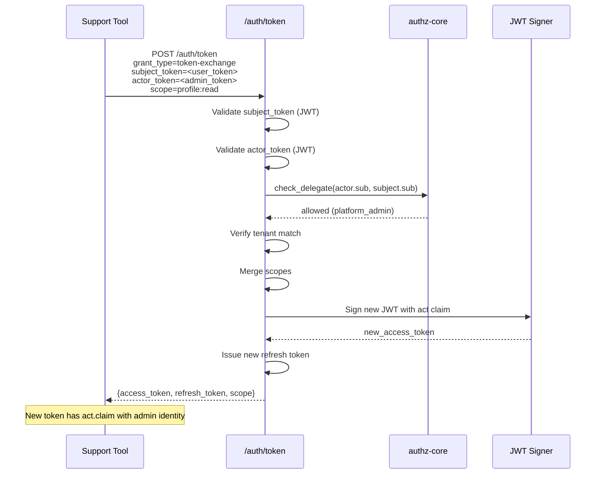
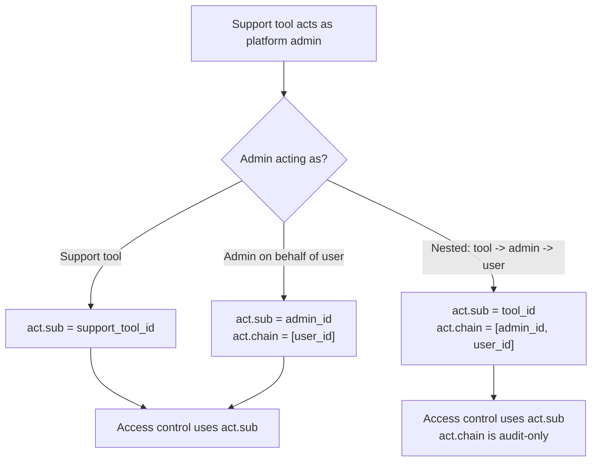
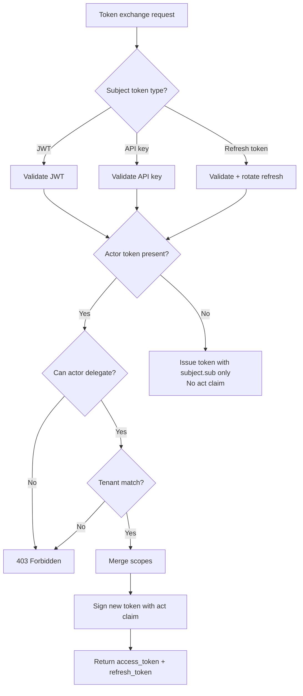

# Story 6.1: Implement RFC 8693 Token Exchange Endpoint

## Epic

[06-delegation-act](../delegation.md)

## Parent Epic Story

Story 6.1

## Summary

Implement the RFC 8693 token exchange endpoint at `POST /auth/token` that accepts a subject token and optionally an actor token, returning a new access token with an `act` claim. This endpoint handles service-to-service delegation and support tool impersonation.

## Why This Story Exists

RFC 8693 provides a standards-compliant way for a service to act on behalf of a user or for a support tool to impersonate a user. Without this endpoint, there is no standardized mechanism for delegation in the Sesame-IDAM architecture.

## Design Context

### RFC 8693 Token Exchange

The token exchange endpoint follows RFC 8693:

```
POST /auth/token
Content-Type: application/x-www-form-urlencoded

grant_type=urn:ietf:params:oauth:grant-type:token-exchange
subject_token=<access_token_or_api_key>
subject_token_type=urn:ietf:params:oauth:token-type:access_token
actor_token=<optional_actor_token>
scope=profile:read orders:write
```

Response (RFC 8693 compliant -- F-003 + F-012):

```json
{
  "access_token": "<new_jwt>",
  "refresh_token": "<new_refresh>",
  "token_type": "Bearer",
  "expires_in": 300,
  "scope": "profile:read orders:write",
  "issued_token_type": "urn:ietf:params:oauth:token-type:access_token",
  "iss": "https://idam.example.com",
  "aud": ["myapp.com"],
  "iat": 1715000000
}
```

### Actor Claim

The `act` claim in the new token identifies who the actor is:

```json
{
  "act": {
    "sub": "admin_123",
    "tenant": "tenant_abc",
    "portal": "support-portal"
  }
}
```

### Supported Subject Token Types

| Type | Validation | Result |
|------|------------|--------|
| `access_token` (JWT) | Validate JWT, extract claims | New token with `act` |
| `api_key` | Validate API key, extract claims | New token with `act` |
| `refresh_token` | Validate refresh token, rotate | New token with `act` |

## Implementation Notes

### Validation Pipeline

```
1. Extract subject_token from request
2. Validate subject_token (JWT or API key)
3. If actor_token is provided:
   a. Validate actor_token (JWT)
   b. Extract actor claims
   c. Check actor.can_delegate(subject.sub)
4. Verify tenant match (actor.tenant == subject.tenant)
5. Merge scopes: intersection(subject.scope, requested.scope, actor.scope)
6. Build new AccessClaims with act claim
7. Sign and return new token
8. Log the delegation event
```

### Authorization Check

```rust
fn can_delegate(actor_claims: &SesameAuthzClaims, target_user: &str) -> bool {
    // Platform admins can delegate any user in their tenant
    if actor_claims.sx.roles.contains(&"platform_admin".to_string()) {
        return true;
    }
    // Org admins can delegate users in their org
    if actor_claims.sx.roles.contains(&"org_admin".to_string()) {
        return users_in_same_org(actor_claims.tenant_id, target_user);
    }
    // Service accounts can delegate within their configured scope
    if actor_claims.sx.roles.contains(&"service_account".to_string()) {
        return actor_claims.sx.permissions.iter().any(|p| 
            p.starts_with("delegate:")
        );
    }
    false
}
```

## Mermaid Diagrams

### Token Exchange Flow



### Actor Claim Chain (Nested Delegation)



### Token Exchange Decision Matrix



## OpenAPI Changes

Add to `openapi/idam/identity-login-service/openapi.yaml`:

```yaml
paths:
  /auth/token:
    post:
      summary: Token Exchange (RFC 8693)
      operationId: exchangeToken
      description: |
        Exchange a subject token for a new token with delegated claims (RFC 8693).
        The actor must have permission to act on behalf of the subject.
      requestBody:
        required: true
        content:
          application/x-www-form-urlencoded:
            schema:
              type: object
              required: [grant_type, subject_token]
              properties:
                grant_type:
                  type: string
                  enum: [urn:ietf:params:oauth:grant-type:token-exchange]
                subject_token:
                  type: string
                  description: The subject access token (JWT) or API key
                subject_token_type:
                  type: string
                  default: urn:ietf:params:oauth:token-type:access_token
                  enum: 
                    - urn:ietf:params:oauth:token-type:access_token
                    - urn:ietf:params:oauth:token-type:api_key
                    - urn:ietf:params:oauth:token-type:refresh_token
                actor_token:
                  type: string
                  description: Optional actor token for nested delegation
                scope:
                  type: string
                  description: Space-delimited scopes to request
      responses:
        '200':
          description: New token issued with act claim
          content:
            application/json:
              schema:
                $ref: '#/components/schemas/TokenExchangeResponse'
        '401':
          description: Invalid subject or actor token
        '403':
          description: Actor does not have permission to delegate
```

Add new schema:

```yaml
components:
  schemas:
    TokenExchangeResponse:
      type: object
      required: [access_token, token_type, expires_in, issued_token_type]
      properties:
        access_token:
          type: string
          description: New access token with act claim
        refresh_token:
          type: string
          description: New rotating refresh token
        token_type:
          type: string
          example: Bearer
        expires_in:
          type: integer
          format: int64
          description: Token lifetime in seconds
        scope:
          type: string
          description: Granted scopes
        issued_token_type:
          type: string
          example: urn:ietf:params:oauth:token-type:access_token
```

## Design Doc References

- `design-doc.md` section 10.5: Delegation & Actor Claims (RFC 8693)
- `design-doc.md` section 6.2: JWT Schema -- `act` claim in namespaced claims
- `design-doc.md` section 10.4: Token Versioning -- version bump on delegation
- `service-topology-design.md`: identity-login-service handles token exchange (HIGH frequency)

## Wiki Pages to Update/Create

- `topics/topic-delegation.md`: (new) Document RFC 8693 support
- `topics/topic-token-lifecycle.md`: Add token exchange to token lifecycle
- `topics/topic-login-flow.md`: Note token exchange as alternative to login

## Acceptance Criteria

- [ ] `POST /auth/token` endpoint is implemented per RFC 8693
- [ ] Accepts `grant_type=urn:ietf:params:oauth:grant-type:token-exchange`
- [ ] Validates subject token (JWT, API key, or refresh token)
- [ ] Validates actor token if provided
- [ ] Checks actor.can_delegate(subject) permission
- [ ] Verifies tenant match (actor.tenant == subject.tenant)
- [ ] Merges scopes: intersection(subject.scope, requested.scope, actor.scope)
- [ ] New token includes `act` claim with actor's identity
- [ ] Nested delegation includes `act.chain` for audit
- [ ] Delegation event is logged with actor_id, subject_id, scopes
- [ ] **F-003/F-012**: TokenExchangeResponse includes `iss`, `aud`, and `iat` claims per RFC 8693
- [ ] **F-012**: Audience claim contains both the audience of the original token AND the audience of the actor token
- [ ] Metrics: `token_exchange_total{result: "success", "denied"}` is emitted
- [ ] Error responses: 401 (invalid token), 403 (no delegation permission)
- [ ] **F-021**: Browser-context CSRF assumption is documented (endpoint operates on bearer tokens only)

## Dependencies

- Depends on Story 1.3 (JWKS validation), Story 2.2 (AccessClaims struct), Story 2.4 (tenant_id in JWT)
- Intersects with Story 5.1 (token versioning on delegation)

## Risk / Trade-offs

- **Actor impersonation**: A platform admin can impersonate any user. This is intentional for support tools but must be strictly audited. Every delegation is logged with actor_id, subject_id, and scopes.
- **Nested delegation complexity**: The `act.chain` adds complexity to the authorization model. The decision rule (only top-level act.sub matters) simplifies this but means deeper actors are audit-only.
