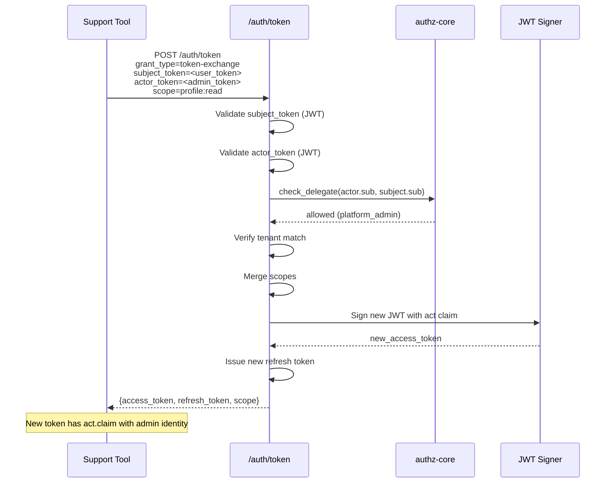
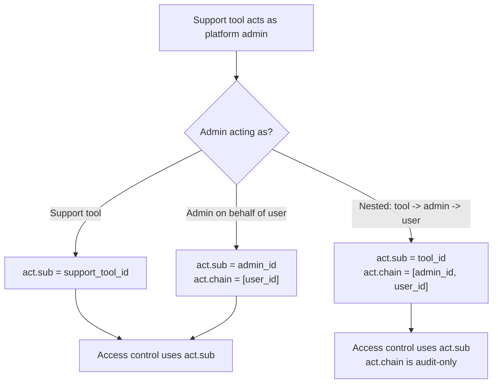
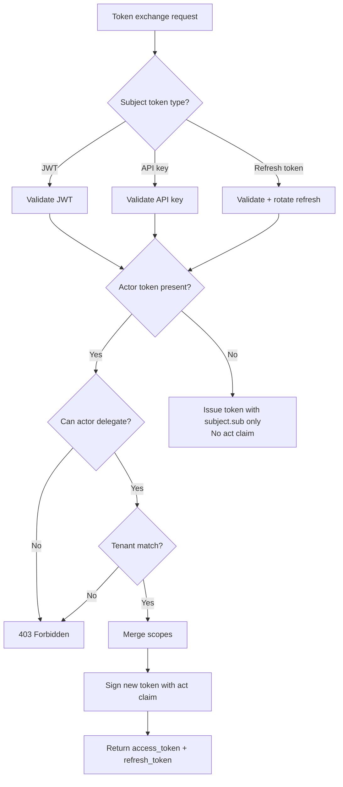

# Story 6.1: Implement RFC 8693 Token Exchange Endpoint

## Epic

[06-delegation-act](../delegation.md)

## Parent Epic Story

Story 6.1

## Summary

Implement the RFC 8693 token exchange endpoint at `POST /auth/token` that accepts a subject token and optionally an actor token, returning a new access token with an `act` claim. This endpoint handles service-to-service delegation and support tool impersonation.

## Why This Story Exists

RFC 8693 provides a standards-compliant way for a service to act on behalf of a user or for a support tool to impersonate a user. Without this endpoint, there is no standardized mechanism for delegation in the Sesame-IDAM architecture.

## Design Context

### RFC 8693 Token Exchange

The token exchange endpoint follows RFC 8693:

```
POST /auth/token
Content-Type: application/x-www-form-urlencoded

grant_type=urn:ietf:params:oauth:grant-type:token-exchange
subject_token=<access_token_or_api_key>
subject_token_type=urn:ietf:params:oauth:token-type:access_token
actor_token=<optional_actor_token>
scope=profile:read orders:write
```

Response (RFC 8693 compliant -- F-003 + F-012):

```json
{
  "access_token": "<new_jwt>",
  "refresh_token": "<new_refresh>",
  "token_type": "Bearer",
  "expires_in": 300,
  "scope": "profile:read orders:write",
  "issued_token_type": "urn:ietf:params:oauth:token-type:access_token",
  "iss": "https://idam.example.com",
  "aud": ["myapp.com"],
  "iat": 1715000000
}
```

### Actor Claim

The `act` claim in the new token identifies who the actor is:

```json
{
  "act": {
    "sub": "admin_123",
    "tenant": "tenant_abc",
    "portal": "support-portal"
  }
}
```

### Supported Subject Token Types

| Type | Validation | Result |
|------|------------|--------|
| `access_token` (JWT) | Validate JWT, extract claims | New token with `act` |
| `api_key` | Validate API key, extract claims | New token with `act` |
| `refresh_token` | Validate refresh token, rotate | New token with `act` |

## Implementation Notes

### Validation Pipeline

```
1. Extract subject_token from request
2. Validate subject_token (JWT or API key)
3. If actor_token is provided:
   a. Validate actor_token (JWT)
   b. Extract actor claims
   c. Check actor.can_delegate(subject.sub)
4. Verify tenant match (actor.tenant == subject.tenant)
5. Merge scopes: intersection(subject.scope, requested.scope, actor.scope)
6. Build new AccessClaims with act claim
7. Sign and return new token
8. Log the delegation event
```

### Authorization Check

```rust
fn can_delegate(actor_claims: &SesameAuthzClaims, target_user: &str) -> bool {
    // Platform admins can delegate any user in their tenant
    if actor_claims.sx.roles.contains(&"platform_admin".to_string()) {
        return true;
    }
    // Org admins can delegate users in their org
    if actor_claims.sx.roles.contains(&"org_admin".to_string()) {
        return users_in_same_org(actor_claims.tenant_id, target_user);
    }
    // Service accounts can delegate within their configured scope
    if actor_claims.sx.roles.contains(&"service_account".to_string()) {
        return actor_claims.sx.permissions.iter().any(|p| 
            p.starts_with("delegate:")
        );
    }
    false
}
```

## Mermaid Diagrams

### Token Exchange Flow



### Actor Claim Chain (Nested Delegation)



### Token Exchange Decision Matrix



## Malicious Hacker Gotchas (Must Be Addressed During Implementation)

> **Source:** `docs/PRS_SECURITY_HARDENING.md` — Security threat model analysis

These are specific attack vectors identified during threat modeling. Each must be considered and mitigated during implementation. If a gotcha cannot be fully mitigated, document the residual risk.

### HACK-601: Token Exchange Audience Merging Missing (CRITICAL — Hole #17 from PRS)

**Risk:** Cross-service token misuse — token issued for service A accepted by service B

The token exchange creates a new access token with merged scopes but does NOT validate or set the `aud` claim. Story 6.1's RFC 8693 response schema includes `iss` and `iat` but NOT `aud`. The security assessment (F-003) flags this: "RFC 8693 requires `iss`, `aud`, `iat`, `exp`, `sub`, `jti` in exchanged tokens."

**Exploit path:**
1. Attacker initiates token exchange with subject token `aud: ["myapp.com"]`
2. Actor token has `aud: ["support-portal.com"]`
3. New token issued WITHOUT `aud` claim
4. New token accepted by any service that doesn't check audience
5. Result: cross-service token misuse

**Implementation requirement:**
- Add `aud` to TokenExchangeResponse schema and validation pipeline (per F-003)
- The new token's `aud` must include the audience of the original token AND the audience of the actor token (per F-012)
- Add `iss` and `iat` to the response JSON

**Acceptance criterion addition (already present in original):**
- "TokenExchangeResponse includes `iss`, `aud`, and `iat` claims per RFC 8693" (F-003)
- "Audience contains both original and actor audiences" (F-012)

### HACK-602: Token Exchange Does Not Validate Audience (HIGH — Hole #17 from PRS)

**Risk:** Cross-service token misuse

**Exploit path:** Same as HACK-601 — if `aud` is not set on the new token, any service that accepts the token without validating audience will be vulnerable.

**Implementation requirement:** The audience merging logic MUST include both subject and actor audiences:
```rust
// NEW token's aud = subject_aud UNION actor_aud
let mut new_aud = Vec::new();
new_aud.extend(subject_token.aud);
new_aud.extend(actor_token.aud.map(|a| a));
new_aud.sort();
new_aud.dedup();
```

### HACK-603: Cross-Org Privilege Escalation (HIGH — Hole #15 from PRS)

**Risk:** Platform admin in org A can impersonate users in org B within the same tenant

The `can_delegate()` function in Story 6.1:
- `platform_admin`: can delegate ANY user in their tenant (including other orgs)
- `org_admin`: can delegate users in same org only

A platform admin in org A could exchange a token to act as a user in org B within the same tenant. This may or may not be the intended behavior.

**Exploit path:**
1. Attacker has platform admin token in org A
2. Initiates token exchange with user from org B as subject
3. Gets a new token with `act.sub = platform_admin (org A)` and `sub = org B user`
4. The new token can act as org B's user, with org A's admin identity as the actor
5. Result: cross-org privilege escalation

**Implementation requirement:**
- Add org-scoped validation to the token exchange: the actor's org must be validated against the subject's org
- For `platform_admin` actors, add a configurable flag: `PLATFORM_ADMIN_CROSS_ORG_DELEGATION=false` (default: true, but should be configurable)
- Document the cross-org behavior explicitly

### HACK-604: act.chain Depth Not Bounded (HIGH — Hole #20 from PRS)

**Risk:** Stack exhaustion / DoS via deeply nested delegation chains

The token exchange supports nested delegation with `act.chain` but there is no maximum chain depth limit. An attacker can create a chain 100+ levels deep, causing:
- JWT size to exceed header budget limits → 400/413/431 errors
- Stack overflow or memory exhaustion during chain parsing

**Exploit path:**
1. Attacker creates nested delegation chain: tool_1 → admin_1 → user_1 → admin_2 → user_2 → ...
2. Each level adds to the `act.chain`
3. At 100+ levels, the chain becomes very large

**Implementation requirement:**
- Add maximum chain depth limit (e.g., 10 levels)
- Reject token exchange requests where the `act.chain` would exceed the limit
- Document the limit in the story

### HACK-605: Token Exchange Can Bypass Login Rate Limits (MEDIUM)

**Risk:** Attacker uses token exchange to circumvent login rate limiting

The token exchange endpoint (`/auth/token`) accepts any valid token as the subject. An attacker who cannot use `/auth/login` due to rate limiting could instead use `/auth/token` to obtain new tokens with delegated privileges.

**Exploit path:**
1. Attacker has a valid API key (not rate-limited on login)
2. Uses token exchange with API key as subject token
3. Gets a new access token with delegated claims
4. This bypasses login rate limiting

**Implementation requirement:**
- Token exchange endpoint MUST enforce the same rate limiting as the login endpoint
- Document this in the story's risk/trade-offs section

### HACK-606: No Maximum Token TTL on Exchange (MEDIUM)

**Risk:** Attacker obtains a token with an excessively long TTL

There is no mention of a maximum token TTL on the token exchange. If the actor token has a long TTL or no TTL, the new exchanged token could also have an excessively long TTL.

**Implementation requirement:**
- Cap the new token's `expires_in` at the minimum of: subject token TTL, actor token TTL, and a configured maximum (e.g., 300 seconds / 5 minutes)
- This prevents an attacker from obtaining a long-lived token through token exchange

---

## OpenAPI Changes

Add to `openapi/idam/identity-login-service/openapi.yaml`:

```yaml
paths:
  /auth/token:
    post:
      summary: Token Exchange (RFC 8693)
      operationId: exchangeToken
      description: |
        Exchange a subject token for a new token with delegated claims (RFC 8693).
        The actor must have permission to act on behalf of the subject.
      requestBody:
        required: true
        content:
          application/x-www-form-urlencoded:
            schema:
              type: object
              required: [grant_type, subject_token]
              properties:
                grant_type:
                  type: string
                  enum: [urn:ietf:params:oauth:grant-type:token-exchange]
                subject_token:
                  type: string
                  description: The subject access token (JWT) or API key
                subject_token_type:
                  type: string
                  default: urn:ietf:params:oauth:token-type:access_token
                  enum: 
                    - urn:ietf:params:oauth:token-type:access_token
                    - urn:ietf:params:oauth:token-type:api_key
                    - urn:ietf:params:oauth:token-type:refresh_token
                actor_token:
                  type: string
                  description: Optional actor token for nested delegation
                scope:
                  type: string
                  description: Space-delimited scopes to request
      responses:
        '200':
          description: New token issued with act claim
          content:
            application/json:
              schema:
                $ref: '#/components/schemas/TokenExchangeResponse'
        '401':
          description: Invalid subject or actor token
        '403':
          description: Actor does not have permission to delegate
```

Add new schema:

```yaml
components:
  schemas:
    TokenExchangeResponse:
      type: object
      required: [access_token, token_type, expires_in, issued_token_type]
      properties:
        access_token:
          type: string
          description: New access token with act claim
        refresh_token:
          type: string
          description: New rotating refresh token
        token_type:
          type: string
          example: Bearer
        expires_in:
          type: integer
          format: int64
          description: Token lifetime in seconds
        scope:
          type: string
          description: Granted scopes
        issued_token_type:
          type: string
          example: urn:ietf:params:oauth:token-type:access_token
```

## Design Doc References

- `design-doc.md` section 10.5: Delegation & Actor Claims (RFC 8693)
- `design-doc.md` section 6.2: JWT Schema -- `act` claim in namespaced claims
- `design-doc.md` section 10.4: Token Versioning -- version bump on delegation
- `service-topology-design.md`: identity-login-service handles token exchange (HIGH frequency)

## Wiki Pages to Update/Create

- `topics/topic-delegation.md`: (new) Document RFC 8693 support
- `topics/topic-token-lifecycle.md`: Add token exchange to token lifecycle
- `topics/topic-login-flow.md`: Note token exchange as alternative to login

## Acceptance Criteria

- [ ] `POST /auth/token` endpoint is implemented per RFC 8693
- [ ] Accepts `grant_type=urn:ietf:params:oauth:grant-type:token-exchange`
- [ ] Validates subject token (JWT, API key, or refresh token)
- [ ] Validates actor token if provided
- [ ] Checks actor.can_delegate(subject) permission
- [ ] Verifies tenant match (actor.tenant == subject.tenant)
- [ ] Merges scopes: intersection(subject.scope, requested.scope, actor.scope)
- [ ] New token includes `act` claim with actor's identity
- [ ] Nested delegation includes `act.chain` for audit
- [ ] Delegation event is logged with actor_id, subject_id, scopes
- [ ] **F-003/F-012**: TokenExchangeResponse includes `iss`, `aud`, and `iat` claims per RFC 8693
- [ ] **F-012**: Audience claim contains both the audience of the original token AND the audience of the actor token
- [ ] Metrics: `token_exchange_total{result: "success", "denied"}` is emitted
- [ ] Error responses: 401 (invalid token), 403 (no delegation permission)
- [ ] **F-021**: Browser-context CSRF assumption is documented (endpoint operates on bearer tokens only)

## Dependencies

- Depends on Story 1.3 (JWKS validation), Story 2.2 (AccessClaims struct), Story 2.4 (tenant_id in JWT)
- Intersects with Story 5.1 (token versioning on delegation)

## Risk / Trade-offs

- **Actor impersonation**: A platform admin can impersonate any user. This is intentional for support tools but must be strictly audited. Every delegation is logged with actor_id, subject_id, and scopes.
- **Nested delegation complexity**: The `act.chain` adds complexity to the authorization model. The decision rule (only top-level act.sub matters) simplifies this but means deeper actors are audit-only.

## Tests

### Unit Tests

- [ ] **Endpoint accepts grant_type=urn:ietf:params:oauth:grant-type:token-exchange**: Given a POST request to `/auth/token` with `grant_type=urn:ietf:params:oauth:grant-type:token-exchange`, assert the handler dispatches to the token exchange logic (not the standard login endpoint)
- [ ] **Endpoint rejects unsupported grant_type**: Given a POST request with `grant_type=password`, assert the handler returns 400 Bad Request with an error indicating unsupported grant type
- [ ] **Subject token required**: Given a token exchange request without a `subject_token`, assert the handler returns 400 Bad Request with `error="invalid_request"`
- [ ] **Valid JWT subject token is parsed**: Given a valid JWT as `subject_token`, assert the handler extracts the claims (sub, tenant_id, scopes, aud) correctly
- [ ] **Valid API key subject token is parsed**: Given a valid API key as `subject_token`, assert the handler resolves it to the corresponding user/org claims
- [ ] **Valid refresh token subject token is parsed**: Given a valid refresh token as `subject_token`, assert the handler resolves it to the corresponding user claims
- [ ] **Invalid JWT subject token returns 401**: Given a tampered or expired JWT as `subject_token`, assert the handler returns 401 Unauthorized with `error="invalid_request"`
- [ ] **Invalid API key subject token returns 401**: Given a revoked or non-existent API key as `subject_token`, assert the handler returns 401 Unauthorized
- [ ] **Missing actor token proceeds without act claim**: Given a valid subject_token without an `actor_token`, assert the handler issues a new token with NO `act` claim (standard exchange without delegation)
- [ ] **Valid actor token is parsed**: Given an `actor_token` field containing a valid JWT, assert the handler extracts actor claims (sub, tenant_id, roles, permissions)
- [ ] **Invalid actor token returns 401**: Given an invalid `actor_token`, assert the handler returns 401 Unauthorized (actor token is optional but must be valid if provided)
- [ ] **Tenant match validation passes**: Given actor with `tenant_id = "abc"` and subject with `tenant_id = "abc"`, assert `verify_tenant_match()` returns `true`
- [ ] **Tenant match validation fails (mismatch)**: Given actor with `tenant_id = "abc"` and subject with `tenant_id = "xyz"`, assert `verify_tenant_match()` returns `false` and the handler returns 403 Forbidden
- [ ] **Platform admin can delegate any user in tenant**: Given actor with `roles = ["platform_admin"]`, assert `can_delegate(actor, "any_user")` returns `true`
- [ ] **Org admin can delegate user in same org**: Given actor with `roles = ["org_admin"]` in org_123, assert `can_delegate(actor, "user_in_org_123")` returns `true`
- [ ] **Org admin cannot delegate user in different org**: Given actor with `roles = ["org_admin"]` in org_123, assert `can_delegate(actor, "user_in_org_456")` returns `false`
- [ ] **Non-admin cannot delegate any user**: Given actor with roles = ["user"], assert `can_delegate(actor, "any_user")` returns `false`
- [ ] **Service account with delegate permission can delegate**: Given actor with `roles = ["service_account"]` and permissions containing `delegate:*`, assert `can_delegate(actor, target_user)` returns `true`
- [ ] **Service account without delegate permission cannot delegate**: Given actor with `roles = ["service_account"]` and no `delegate:*` permissions, assert `can_delegate(actor, target_user)` returns `false`
- [ ] **Scope intersection logic**: Given subject_scope = `profile:read orders:write`, requested_scope = `profile:read`, actor_scope = `profile:read orders:write:admin`, assert merged scope = `profile:read` (intersection of all three)
- [ ] **Scope intersection with no overlap returns empty**: Given subject_scope = `profile:read`, requested_scope = `orders:write`, assert merged scope = `` (empty — no common scope)
- [ ] **Scope intersection with full overlap**: Given subject_scope = `profile:read orders:write`, requested_scope = `profile:read orders:write`, actor_scope = `profile:read orders:write`, assert merged scope = `profile:read orders:write`
- [ ] **New token includes act claim when actor present**: Given valid actor and subject tokens, assert the issued JWT contains an `act` claim with the actor's identity (sub, tenant)
- [ ] **New token omits act claim when no actor present**: Given valid subject_token without actor_token, assert the issued JWT has NO `act` claim
- [ ] **New token includes act chain for nested delegation**: Given actor token with its own `act` claim (nested delegation), assert the new token contains `act.chain` with the full delegation chain
- [ ] **New token includes tenant_id**: Assert the new access token contains `tenant_id` in its claims (same as subject's tenant_id)
- [ ] **New token includes sid (session ID)**: Assert the new access token contains `sid` claim per Story 5.1
- [ ] **New token includes ver (token version)**: Assert the new access token contains `ver` claim incremented per Story 5.1
- [ ] **TokenExchangeResponse includes iss per RFC 8693**: Given a successful exchange, assert the JSON response includes `"iss": "https://idam.example.com"` (F-003)
- [ ] **TokenExchangeResponse includes aud per RFC 8693**: Given a successful exchange, assert the JSON response includes `"aud": ["myapp.com"]` (F-003)
- [ ] **TokenExchangeResponse includes iat per RFC 8693**: Given a successful exchange, assert the JSON response includes `"iat": 1715000000` (F-003)
- [ ] **Audience contains both original and actor audiences (F-012)**: Given subject token audience = `["myapp.com"]` and actor token audience = `["support-portal.com"]`, assert the response `aud` contains both: `["myapp.com", "support-portal.com"]`
- [ ] **Delegation event logged with actor_id**: Given a successful delegation, assert the logging system receives an event with `actor_id = <actor.sub>`
- [ ] **Delegation event logged with subject_id**: Given a successful delegation, assert the logging system receives an event with `subject_id = <subject.sub>`
- [ ] **Delegation event logged with scopes**: Given a successful delegation with merged scope = `profile:read`, assert the logging event includes the granted scopes
- [ ] **Metrics: token_exchange_total{result: "success"} emitted**: Assert the `token_exchange_total` counter with `result: "success"` label is incremented on successful exchange
- [ ] **Metrics: token_exchange_total{result: "denied"} emitted on 403**: Assert the `token_exchange_total` counter with `result: "denied"` label is incremented when delegation is denied (no permission)
- [ ] **Metrics: token_exchange_total{result: "denied"} emitted on 401**: Assert the `token_exchange_total` counter with `result: "denied"` label is incremented when token validation fails
- [ ] **Actor can_delegate check uses correct authority check**: Assert the `can_delegate` function first checks platform_admin role, then org_admin role, then service_account with delegate permission — in that exact order
- [ ] **Refresh token exchange rotates the refresh token**: Given a refresh token is used as the subject token, assert the old refresh token is invalidated and a new refresh token is issued
- [ ] **Refresh token exchange preserves scopes**: Given the original refresh token had scopes `profile:read orders:write`, assert the new token reflects the requested (intersected) scopes
- [ ] **Actor claim cannot be forged via actor_token**: Assert that even if a client provides a maliciously crafted `actor_token`, the actor identity is derived from the validated JWT claims, not from client-supplied fields — a fake actor_token will fail signature validation
- [ ] **Actor token must be JWT, not API key**: Assert that `actor_token` only accepts JWT tokens (not API keys) — the actor must be authenticated via JWT to prove their identity

### Integration Tests (BDD-style with `rstest_bdd`)

- [ ] **Scenario: Simple token exchange without actor**: `given` user alice has a valid access token with scopes `profile:read` → `when` the client calls POST `/auth/token` with `subject_token=<alice's_token>` and `scope=profile:read` → `then` the response contains a new access_token WITHOUT an `act` claim, the `token_exchange_total{result: "success"}` metric is incremented, and the new token has the same subject identity
- [ ] **Scenario: Platform admin delegates any user**: `given` admin bob (platform_admin) has a valid JWT and user carol has a valid access token → `when` bob calls POST `/auth/token` with `subject_token=<carol's_token>`, `actor_token=<bob's_token>`, and `scope=profile:read` → `then` the response contains a new token WITH `act.sub = "bob"`, the tenant match passes, and the delegation event is logged with `actor_id: "bob"`, `subject_id: "carol"`
- [ ] **Scenario: Org admin delegates user in same org**: `given` org_admin dave in org_123 has a valid JWT and user eve is in org_123 → `when` dave calls POST `/auth/token` with eve's token as subject → `then` the delegation succeeds with `act.sub = "dave"` and scope intersection is computed
- [ ] **Scenario: Org admin cannot delegate user in different org**: `given` org_admin frank in org_123 has a valid JWT and user grace is in org_456 → `when` frank calls POST `/auth/token` with grace's token as subject → `then` the handler returns 403 Forbidden because frank cannot delegate grace
- [ ] **Scenario: Tenant mismatch returns 403**: `given` actor from tenant "abc" has a valid JWT and subject from tenant "xyz" has a valid token → `when` the actor tries to exchange the subject's token → `then` the handler returns 403 Forbidden because tenant IDs don't match
- [ ] **Scenario: Non-admin cannot delegate**: `given` user hank (regular user, no admin role) has a valid JWT → `when` hank tries to call POST `/auth/token` with `actor_token=<hank's_token>` → `then` the handler returns 403 Forbidden
- [ ] **Scenario: Service account with delegate permission**: `given` service account svc_001 with `delegate:*` permission has a valid JWT and user iris has a valid access token → `when` svc_001 calls POST `/auth/token` with iris's token → `then` the delegation succeeds with `act.sub = "svc_001"`
- [ ] **Scenario: Scope intersection works correctly**: `given` subject token has scope `profile:read orders:write`, requested scope is `profile:read`, actor scope is `profile:read orders:write` → `when` token exchange succeeds → `then` the new token has scope `profile:read` (the intersection)
- [ ] **Scenario: Nested delegation with act.chain**: `given` support tool has JWT with `act.sub = "tool"`, admin has JWT with `act.sub = "admin"`, and user has access token → `when` the support tool calls POST `/auth/token` with admin's token as actor_token and user's token as subject_token → `then` the new token has `act.sub = "tool"` and `act.chain = ["admin", "user"]`
- [ ] **Scenario: Subject token is API key**: `given` user judy has a valid API key → `when` an actor calls POST `/auth/token` with `subject_token=<judy's_api_key>&subject_token_type=urn:ietf:params:oauth:token-type:api_key` → `then` the API key is resolved to judy's user claims and a new token is issued
- [ ] **Scenario: Subject token is refresh token**: `given` user kate has a valid refresh token → `when` an actor calls POST `/auth/token` with `subject_token=<kate's_refresh_token>&subject_token_type=urn:ietf:params:oauth:token-type:refresh_token` → `then` the refresh token is rotated (old invalidated) and a new access token is issued
- [ ] **Scenario: Expired subject token returns 401**: `given` user leo has an expired access token → `when` POST `/auth/token` is called with the expired token → `then` the handler returns 401 Unauthorized with `error="invalid_request"`
- [ ] **Scenario: Tampered subject token returns 401**: `given` user mia has a valid access token → `when` the token is tampered (claims modified, signature invalid) and POST `/auth/token` is called → `then` the handler returns 401 Unauthorized
- [ ] **Scenario: Token exchange response format matches RFC 8693**: `given` a successful token exchange → `when` the response is parsed → `then` it contains `access_token`, `refresh_token`, `token_type: "Bearer"`, `expires_in: 300`, `scope`, `issued_token_type: "urn:ietf:params:oauth:token-type:access_token"`, `iss`, `aud`, and `iat`
- [ ] **Scenario: Metrics recorded on successful exchange**: `given` a successful token exchange → `when` the response is received → `then` `token_exchange_total{result: "success"}` is incremented by 1
- [ ] **Scenario: Metrics recorded on denied exchange**: `given` a denied token exchange (no delegate permission) → `when` the 403 response is received → `then` `token_exchange_total{result: "denied"}` is incremented by 1
- [ ] **Scenario: Browser-context CSRF not applicable (bearer tokens only, F-021)**: `given` the endpoint only accepts bearer tokens in the Authorization header → `then` the endpoint operates without CSRF protection — document this as intentional since it's a machine-to-machine API endpoint, not a browser context

### Security Regression Tests

- [ ] **Actor cannot impersonate platform admin**: Assert that a non-platform admin cannot forge an `actor_token` with `roles = ["platform_admin"]` to gain platform-level delegation rights — the actor token must be a valid, signed JWT and the platform_admin role can only be assigned by the identity provider
- [ ] **Actor cannot escalate privileges via scope manipulation**: Assert that a client cannot request a scope wider than what the subject token possesses — the scope intersection logic ensures the new token never has more permissions than the subject
- [ ] **Cross-tenant delegation is impossible**: Assert that an actor from tenant A cannot use the token exchange endpoint to obtain a token on behalf of a user in tenant B — the tenant match check blocks this
- [ ] **Subject token cannot be reused after refresh token exchange**: Assert that when a refresh token is used as the subject token in a token exchange, the old refresh token is immediately invalidated and cannot be reused
- [ ] **Act claim in response does not expose actor password/secret**: Assert that the token exchange response does NOT include the actor's password, secret, or any credentials — only the actor's identity (sub, tenant, portal) in the new token's `act` claim
- [ ] **Nested delegation chain is limited**: Assert that the `act.chain` is truncated to a maximum depth (e.g., 10 levels) to prevent stack overflow or excessive memory usage in chain parsing
- [ ] **Delegation event is immutable**: Assert that once a delegation event is logged, it cannot be modified or deleted — the audit log must be append-only
- [ ] **Actor token validation is not bypassed**: Assert that a client cannot omit the `actor_token` parameter and claim platform admin privileges — the `act` claim is only added when a valid actor_token is present AND the can_delegate check passes
- [ ] **Actor cannot use token exchange to bypass rate limits**: Assert that the token exchange endpoint enforces the same rate limiting as the login endpoint — a client cannot use token exchange to circumvent login rate limits
- [ ] **Audience claim does not leak unrelated audiences**: Assert that the `aud` in the new token only includes audiences relevant to the exchange (subject's aud + actor's aud) — not unrelated audiences from other tokens
- [ ] **Token exchange endpoint is not accessible to unauthenticated requests**: Assert that the POST `/auth/token` endpoint does not require authentication on the endpoint itself (the subject_token and actor_token provide authentication) but rejects requests with invalid or missing tokens
- [ ] **No information leakage in error responses**: Assert that 401 and 403 responses do not reveal whether the failure was due to an invalid token vs. insufficient delegation permission — use generic error messages

### Edge Cases

- [ ] **Empty scope in exchange request**: Given `scope=""` in the token exchange request, assert the new token is issued with empty scope (or default scope) — no error
- [ ] **Subject token is exactly at expiration**: Given a subject token whose `exp` equals the current time (zero-lifetime), assert the exchange is rejected (token is expired)
- [ ] **Actor token has shorter lifetime than subject token**: Given an actor token expiring in 1 minute and a subject token expiring in 5 minutes, assert the new token's `expires_in` is capped at the shorter of the two (1 minute)
- [ ] **Very long act.chain (100 levels deep)**: Given a nested delegation chain with 100 levels, assert the handler processes it without stack overflow or memory exhaustion, and the chain is either accepted or truncated based on the configured max depth
- [ ] **Token exchange with zero TTL**: Given the token exchange request results in a new token with `expires_in = 0`, assert the handler either rejects this (zero TTL is not useful) or issues a token that expires immediately (edge case — unlikely in practice)
- [ ] **Concurrent token exchanges for same subject**: Given 100 concurrent token exchange requests for the same subject token (from different actors), assert each request is processed independently — the subject token is read-only and concurrent reads are safe
- [ ] **Actor token and subject token are the same**: Given the same JWT is used for both `actor_token` and `subject_token`, assert the exchange either succeeds (user delegating to themselves — `act.sub` equals `sub`) or returns a clear error
- [ ] **Subject token type is not specified**: Given a token exchange request without `subject_token_type`, assert the handler defaults to `urn:ietf:params:oauth:token-type:access_token` per RFC 8693
- [ ] **API key as subject_token with invalid key format**: Given `subject_token="not-a-valid-key-format"`, assert the handler returns 401 Invalid Request without attempting JWT parsing
- [ ] **Refresh token already rotated once**: Given a refresh token that has already been used in a token exchange, assert it cannot be used again (rotate-on-use enforcement)
- [ ] **Subject token from expired actor**: Given a subject token from a user whose account is disabled, assert the token exchange fails with 401 (disabled account) even if the token signature is valid

### Cleanup

- Redis state must be cleaned between test scenarios — use `FLUSHDB` or a unique Redis prefix per test run to prevent stale tokens, refresh tokens, and version entries from affecting subsequent tests
- JWT signing/verification keys used in tests should be unique per test to prevent key collisions between concurrent test scenarios
- Refresh tokens stored in Redis must be cleared between tests — verify by checking that `DBSIZE` returns to 0 after cleanup
- Metrics registry must be reset between test scenarios using `prometheus::Registry::new()` to prevent cross-test metric contamination
- Delegation audit log state (in-memory or file-based) must be reset between tests — use a fresh logger or clear the log buffer
- Actor and subject tokens used in tests should be generated with fresh JWTs per test to prevent token reuse across scenarios
- If using mock Redis, ensure the mock is reset between tests — use a fresh mock instance or call `mock.reset()`
- Test user accounts and API keys created during tests must be cleaned up — use test factories that roll back or delete test data between scenarios
