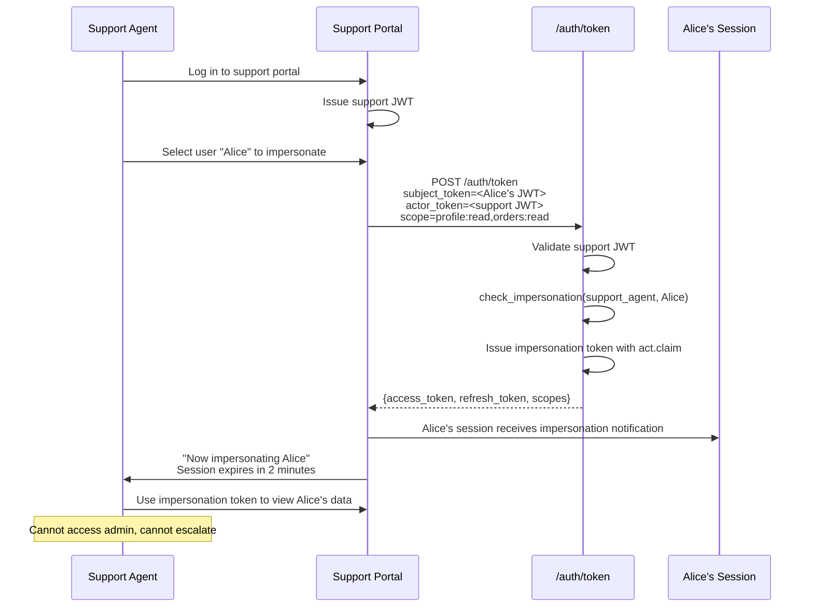
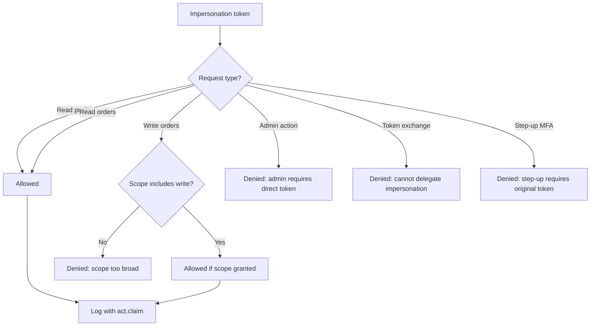
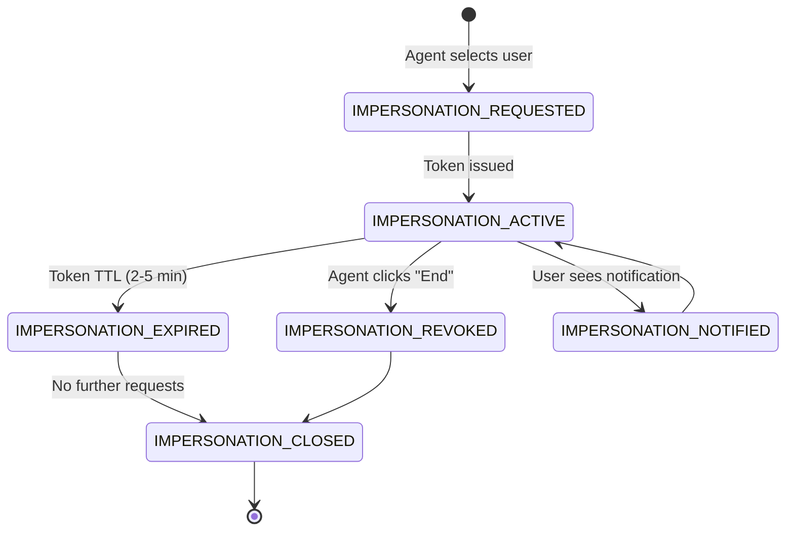
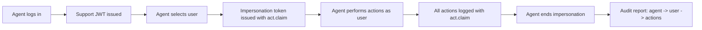

# Story 6.2: Implement Support Impersonation Flow

## Epic

[06-delegation-act](../delegation.md)

## Parent Epic Story

Story 6.2

## Summary

Implement the specific use case of support tool impersonation: a support agent logs into the support portal, selects a user to impersonate, and receives a token with `act` claim. The impersonated session has restricted capabilities (cannot access admin functions, cannot escalate privileges).

## Why This Story Exists

Support impersonation is one of the primary use cases for RFC 8693 delegation. The JWT document specifically calls out "Support tool impersonation" as a delegation scenario. This story defines the flow, restrictions, and audit requirements for support impersonation.

## Design Context

### Support Impersonation Flow

```
Support Agent -> Support Portal -> Login -> Support Portal JWT
Support Agent -> Support Portal -> Selects User Alice -> POST /auth/token
Support Portal -> Receives Alice-impersonation JWT with act.claim
Support Agent -> Impersonates Alice -> Uses impersonation token
```

### Impersonation Restrictions

The impersonation token must be restricted:

| Restriction | Enforcement | Rationale |
|-------------|-------------|-----------|
| No admin access | JWT middleware rejects if act.sub != admin | Prevent privilege escalation |
| No delegation | Token cannot be used for further delegation | Prevent chain delegation |
| No token exchange | `/auth/token` rejects if act claim present | Prevent impersonation chains |
| Short TTL | 2-5 minutes | Limit exposure window |
| Audit required | Every action logged with act claim | Full audit trail |
| Visible to user | User sees "impersonated by [agent]" | Transparency |

### Impersonation Token Structure

```json
{
  "sub": "alice_123",
  "tenant_id": "tenant_abc",
  "act": {
    "sub": "support_agent_456",
    "tenant": "tenant_abc",
    "portal": "support-portal"
  },
  "sx": {
    "roles": ["customer"],
    "permissions": [],
    "impersonated_by": "support_agent_456",
    "impersonation_scope": ["profile:read", "orders:read"]
  }
}
```

### Support Portal Authorization

```rust
fn can_impersonate(
    support_agent: &SupportAgent,
    target_user: &str,
) -> Result<(), AuthError> {
    // 1. Agent must be a support agent role
    if !support_agent.roles.contains(&"support_agent".to_string()) {
        return Err(AuthError::NotASupportAgent);
    }
    
    // 2. Agent can only impersonate users in their tenant
    let target_user_tenant = user_repo.get_tenant(target_user)?;
    if target_user_tenant != support_agent.tenant_id {
        return Err(AuthError::CrossTenantImpersonationNotAllowed);
    }
    
    // 3. Agent must have impersonation permission for the target's org
    let target_org = user_repo.get_org(target_user)?;
    if !support_agent.orgs.contains(&target_org) {
        return Err(AuthError::NotInTargetOrg);
    }
    
    // 4. Log the impersonation attempt
    audit_log::log_impersonation_attempt(
        support_agent.id,
        target_user,
        support_agent.tenant_id,
    );
    
    Ok(())
}
```

## Mermaid Diagrams

### Support Impersonation Flow



### Impersonation Restrictions



### Impersonation Session Lifecycle



### Audit Trail



## OpenAPI Changes

No new endpoints needed -- support impersonation uses the existing `/auth/token` token exchange endpoint (Story 6.1). However, document the impersonation-specific restrictions:

```yaml
components:
  schemas:
    TokenExchangeResponse:
      description: |
        When used for support impersonation:
        - Token has a short TTL (2-5 minutes)
        - act.claim contains the support agent's identity
        - Token cannot be used for admin actions or further delegation
        - All actions are logged with the act.claim for audit
```

## Design Doc References

- `design-doc.md` section 10.5: Delegation & Actor Claims -- support tool impersonation
- `design-doc.md` section 10.1: Token Security -- "Support tool impersonation with act claim"
- `design-doc.md` section 6.2: JWT Schema -- `act` claim in namespaced claims

## Wiki Pages to Update/Create

- `topics/topic-delegation.md`: Document support impersonation flow
- `topics/topic-token-lifecycle.md`: Document impersonation session lifecycle
- `topics/topic-authorization-flow.md`: Note impersonation restrictions

## Acceptance Criteria

- [ ] Support impersonation uses `/auth/token` token exchange endpoint
- [ ] Impersonation token includes `act` claim with agent identity
- [ ] Impersonation token has short TTL (2-5 minutes)
- [ ] Impersonation token cannot be used for admin actions (JWT middleware rejects)
- [ ] Impersonation token cannot be used for further delegation/token exchange
- [ ] Support agent must have `support_agent` role to initiate impersonation
- [ ] Support agent can only impersonate users in their tenant
- [ ] Impersonation is logged (agent_id, user_id, start_time, end_time)
- [ ] User is notified when their session is impersonated
- [ ] Impersonation ends when token TTL expires or agent clicks "End"
- [ ] Metrics: `impersonation_total{status: "success", "denied", "expired"}` is emitted
- [ ] Audit log includes all actions performed during impersonation

## Dependencies

- Depends on Story 6.1 (token exchange endpoint)
- Intersects with Story 5.1 (token versioning -- impersonation triggers version bump for user)

## Risk / Trade-offs

- **Token TTL too short**: 2-5 minutes may be too short for support tasks that require navigating multiple screens. Consider extending to 10 minutes for low-risk support tasks, but this increases the exposure window.
- **Impersonation visibility**: The user should be notified when impersonated, but the notification mechanism is not specified. Options: email, in-app notification, or session metadata. This story assumes in-app notification.
- **Cross-tenant impersonation**: Currently blocked (agent can only impersonate users in their tenant). This is correct for SaaS multi-tenant isolation but may be limiting for platform operators who manage multiple tenants.
