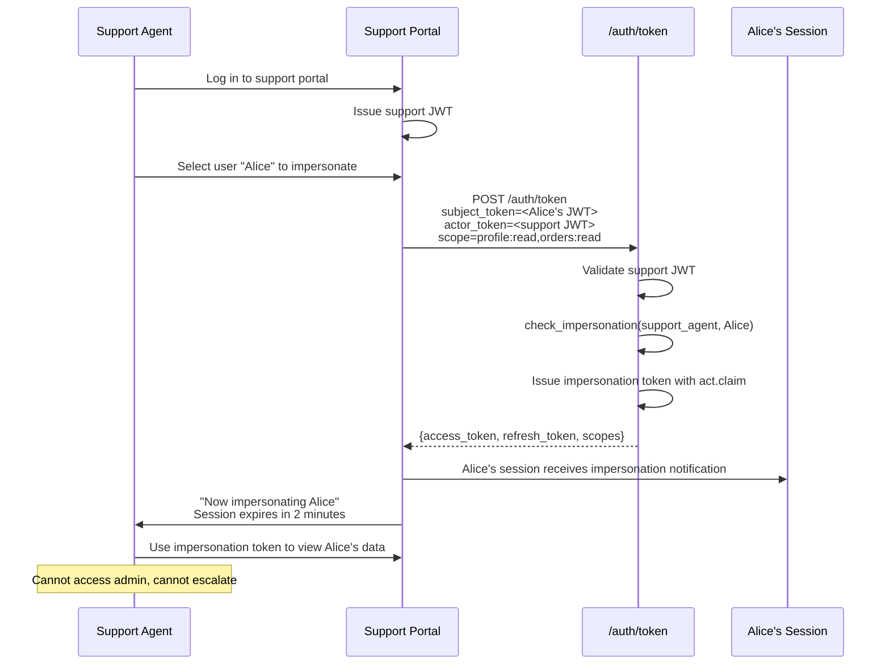
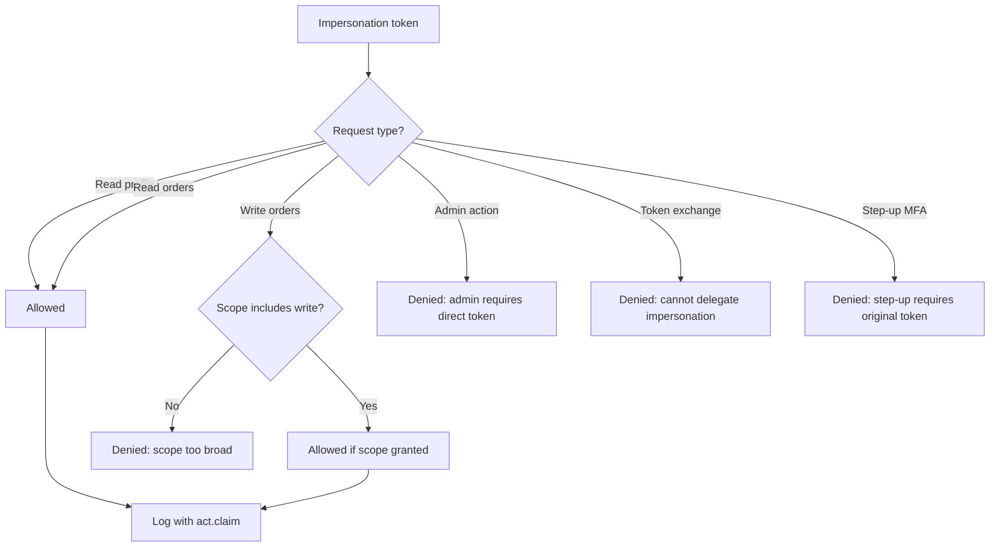
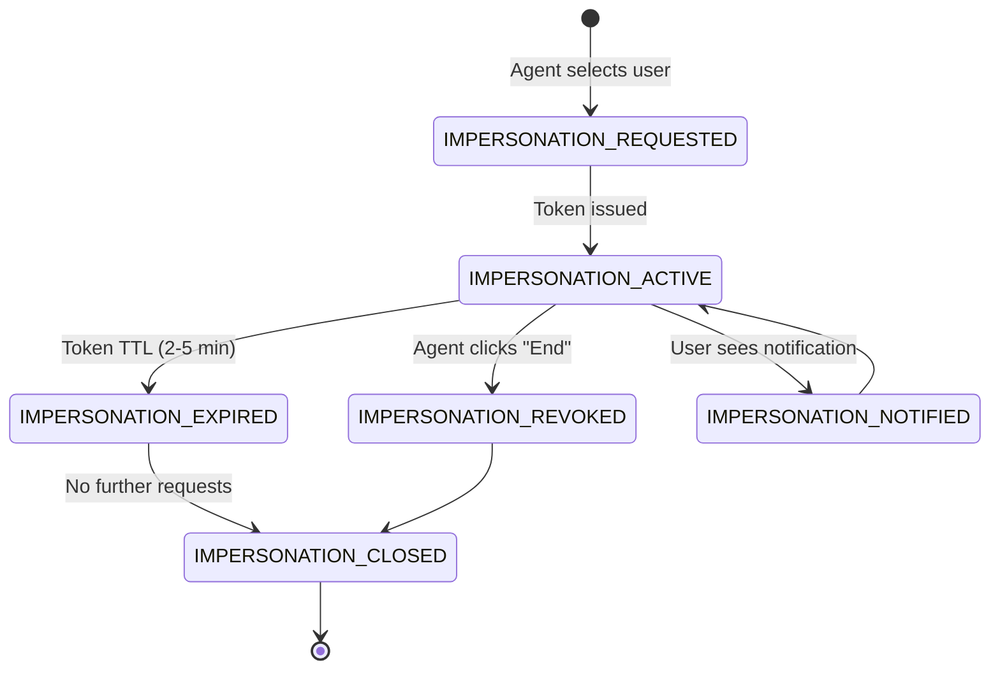
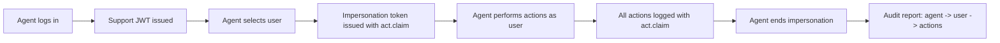

# Story 6.2: Implement Support Impersonation Flow

## Epic

[06-delegation-act](../delegation.md)

## Parent Epic Story

Story 6.2

## Summary

Implement the specific use case of support tool impersonation: a support agent logs into the support portal, selects a user to impersonate, and receives a token with `act` claim. The impersonated session has restricted capabilities (cannot access admin functions, cannot escalate privileges).

## Why This Story Exists

Support impersonation is one of the primary use cases for RFC 8693 delegation. The JWT document specifically calls out "Support tool impersonation" as a delegation scenario. This story defines the flow, restrictions, and audit requirements for support impersonation.

## Design Context

### Support Impersonation Flow

```
Support Agent -> Support Portal -> Login -> Support Portal JWT
Support Agent -> Support Portal -> Selects User Alice -> POST /auth/token
Support Portal -> Receives Alice-impersonation JWT with act.claim
Support Agent -> Impersonates Alice -> Uses impersonation token
```

### Impersonation Restrictions

The impersonation token must be restricted:

| Restriction | Enforcement | Rationale |
|-------------|-------------|-----------|
| No admin access | JWT middleware rejects if act.sub != admin | Prevent privilege escalation |
| No delegation | Token cannot be used for further delegation | Prevent chain delegation |
| No token exchange | `/auth/token` rejects if act claim present | Prevent impersonation chains |
| Short TTL | 2-5 minutes | Limit exposure window |
| Audit required | Every action logged with act claim | Full audit trail |
| Visible to user | User sees "impersonated by [agent]" | Transparency |

### Impersonation Token Structure

```json
{
  "sub": "alice_123",
  "tenant_id": "tenant_abc",
  "act": {
    "sub": "support_agent_456",
    "tenant": "tenant_abc",
    "portal": "support-portal"
  },
  "sx": {
    "roles": ["customer"],
    "permissions": [],
    "impersonated_by": "support_agent_456",
    "impersonation_scope": ["profile:read", "orders:read"]
  }
}
```

### Support Portal Authorization

```rust
fn can_impersonate(
    support_agent: &SupportAgent,
    target_user: &str,
) -> Result<(), AuthError> {
    // 1. Agent must be a support agent role
    if !support_agent.roles.contains(&"support_agent".to_string()) {
        return Err(AuthError::NotASupportAgent);
    }
    
    // 2. Agent can only impersonate users in their tenant
    let target_user_tenant = user_repo.get_tenant(target_user)?;
    if target_user_tenant != support_agent.tenant_id {
        return Err(AuthError::CrossTenantImpersonationNotAllowed);
    }
    
    // 3. Agent must have impersonation permission for the target's org
    let target_org = user_repo.get_org(target_user)?;
    if !support_agent.orgs.contains(&target_org) {
        return Err(AuthError::NotInTargetOrg);
    }
    
    // 4. Log the impersonation attempt
    audit_log::log_impersonation_attempt(
        support_agent.id,
        target_user,
        support_agent.tenant_id,
    );
    
    Ok(())
}
```

## Mermaid Diagrams

### Support Impersonation Flow



### Impersonation Restrictions



### Impersonation Session Lifecycle



### Audit Trail



## OpenAPI Changes

No new endpoints needed -- support impersonation uses the existing `/auth/token` token exchange endpoint (Story 6.1). However, document the impersonation-specific restrictions:

```yaml
components:
  schemas:
    TokenExchangeResponse:
      description: |
        When used for support impersonation:
        - Token has a short TTL (2-5 minutes)
        - act.claim contains the support agent's identity
        - Token cannot be used for admin actions or further delegation
        - All actions are logged with the act.claim for audit
```

## Design Doc References

- `design-doc.md` section 10.5: Delegation & Actor Claims -- support tool impersonation
- `design-doc.md` section 10.1: Token Security -- "Support tool impersonation with act claim"
- `design-doc.md` section 6.2: JWT Schema -- `act` claim in namespaced claims

## Wiki Pages to Update/Create

- `topics/topic-delegation.md`: Document support impersonation flow
- `topics/topic-token-lifecycle.md`: Document impersonation session lifecycle
- `topics/topic-authorization-flow.md`: Note impersonation restrictions

## Acceptance Criteria

- [ ] Support impersonation uses `/auth/token` token exchange endpoint
- [ ] Impersonation token includes `act` claim with agent identity
- [ ] Impersonation token has short TTL (2-5 minutes)
- [ ] Impersonation token cannot be used for admin actions (JWT middleware rejects)
- [ ] Impersonation token cannot be used for further delegation/token exchange
- [ ] Support agent must have `support_agent` role to initiate impersonation
- [ ] Support agent can only impersonate users in their tenant
- [ ] Impersonation is logged (agent_id, user_id, start_time, end_time)
- [ ] User is notified when their session is impersonated
- [ ] Impersonation ends when token TTL expires or agent clicks "End"
- [ ] Metrics: `impersonation_total{status: "success", "denied", "expired"}` is emitted
- [ ] Audit log includes all actions performed during impersonation

## Dependencies

- Depends on Story 6.1 (token exchange endpoint)
- Intersects with Story 5.1 (token versioning -- impersonation triggers version bump for user)

## Risk / Trade-offs

- **Token TTL too short**: 2-5 minutes may be too short for support tasks that require navigating multiple screens. Consider extending to 10 minutes for low-risk support tasks, but this increases the exposure window.
- **Impersonation visibility**: The user should be notified when impersonated, but the notification mechanism is not specified. Options: email, in-app notification, or session metadata. This story assumes in-app notification.
- **Cross-tenant impersonation**: Currently blocked (agent can only impersonate users in their tenant). This is correct for SaaS multi-tenant isolation but may be limiting for platform operators who manage multiple tenants.

## Tests

### Unit Tests

- [ ] **Support impersonation requires support_agent role**: Given a user with `roles = ["support_agent"]`, assert `can_impersonate(agent, target_user)` returns `Ok(())`; given a user with `roles = ["customer"]`, assert it returns `Err(AuthError::NotASupportAgent)`
- [ ] **Non-support user cannot initiate impersonation**: Given a user with `roles = ["admin"]` but no `support_agent` role, assert `can_impersonate()` returns `Err(AuthError::NotASupportAgent)` — having admin rights does not grant impersonation ability
- [ ] **Cross-tenant impersonation is blocked**: Given support agent in tenant "abc" targets user in tenant "xyz", assert `can_impersonate()` returns `Err(AuthError::CrossTenantImpersonationNotAllowed)`
- [ ] **Agent cannot impersonate user outside their orgs**: Given support agent assigned to org_123 and org_456, assert `can_impersonate(agent, user_in_org_789)` returns `Err(AuthError::NotInTargetOrg)`
- [ ] **Agent CAN impersonate user in their org**: Given support agent assigned to org_123 and target user in org_123, assert `can_impersonate(agent, target_user)` returns `Ok(())`
- [ ] **Impersonation token TTL is set to 2 minutes**: Given a support impersonation token is issued, assert `expires_in = 120` (2 minutes in seconds)
- [ ] **Impersonation token TTL is set to 5 minutes (default)**: Given the impersonation TTL is not explicitly overridden, assert `expires_in = 300` (5 minutes)
- [ ] **Impersonation token includes act claim**: Given an impersonation token is issued, assert the JWT payload contains an `act` claim with `sub = support_agent_id`, `tenant = tenant_id`, and `portal = "support-portal"`
- [ ] **Impersonation token includes impersonated_by in sx**: Assert the JWT `sx` claim contains `impersonated_by = support_agent_id`
- [ ] **Impersonation token includes impersonation_scope in sx**: Assert the JWT `sx` claim contains `impersonation_scope = ["profile:read", "orders:read"]` (the granted read-only scopes)
- [ ] **Admin action rejected for impersonation token**: Given a request to an admin route with an impersonation token (act claim present), assert the JWT middleware returns 403 Forbidden with a message indicating impersonation tokens cannot access admin functions
- [ ] **Token exchange rejected for impersonation token**: Given a request to POST `/auth/token` with an impersonation token as the subject token, assert the handler returns 403 Forbidden — impersonation tokens cannot be used for further delegation
- [ ] **Step-up MFA rejected for impersonation token**: Given a step-up MFA request with an impersonation token, assert the handler returns 403 Forbidden — step-up requires the original user token
- [ ] **Impersonation audit log is written on initiation**: Given an impersonation is started, assert an audit log entry is created with `actor_id = agent_id`, `subject_id = target_user_id`, `start_time = now()`, and `tenant_id`
- [ ] **Impersonation audit log is written on completion**: Given an impersonation ends (either by TTL expiry or agent click), assert a completion audit log entry is written with `end_time = now()` and `duration = end_time - start_time`
- [ ] **Metrics: impersonation_total{status: "success"} emitted**: Assert `impersonation_total{status: "success"}` is incremented when impersonation starts
- [ ] **Metrics: impersonation_total{status: "denied"} emitted**: Assert `impersonation_total{status: "denied"}` is incremented when impersonation is denied (no support_agent role, cross-tenant, wrong org)
- [ ] **Metrics: impersonation_total{status: "expired"} emitted**: Assert `impersonation_total{status: "expired"}` is incremented when an impersonation session expires by TTL
- [ ] **Impersonation token cannot escalate privileges**: Assert that the impersonation token's `sx.roles` does NOT include `admin` or `platform_admin` — even if the impersonated user has admin rights, the impersonation token strips them
- [ ] **Support agent's org list is validated on each impersonation**: Assert that `can_impersonate()` queries the database for the target user's org and checks it against the agent's assigned orgs — the check is not cached
- [ ] **Audit log entry includes all action details during impersonation**: Given an agent performs 5 actions while impersonating a user, assert 5 separate audit log entries are written, each with the act.claim context

### Integration Tests (BDD-style with `rstest_bdd`)

- [ ] **Scenario: Support agent impersonates user in same org**: `given` support_agent_456 with `roles = ["support_agent"]` and assigned to org_123 → `when` the agent selects user alice_123 (in org_123) to impersonate → `then` an impersonation token is issued with `act.sub = "support_agent_456"`, `expires_in = 300`, and the agent can view alice's profile and orders
- [ ] **Scenario: Support agent cannot impersonate user in different org**: `given` support_agent_456 assigned to org_123 → `when` the agent selects user bob_789 (in org_789) to impersonate → `then` the request is denied with 403 `NotInTargetOrg` and `impersonation_total{status: "denied"}` is incremented
- [ ] **Scenario: Cross-tenant impersonation blocked**: `given` support_agent_456 in tenant "hauliage" → `when` the agent selects user from tenant "rerp" → `then` the request is denied with 403 `CrossTenantImpersonationNotAllowed`
- [ ] **Scenario: Impersonation token used for read-only actions**: `given` agent_456 has an active impersonation token for alice → `when` the agent reads alice's profile (`GET /api/profile`) and reads alice's orders (`GET /api/orders`) → `then` both requests succeed and are logged with `act.sub = "agent_456"`
- [ ] **Scenario: Impersonation token denied for write actions without scope**: `given` agent_456 has an impersonation token with `impersonation_scope = ["profile:read", "orders:read"]` → `when` the agent tries to write an order (`POST /api/orders`) → `then` the request is denied (scope does not include write)
- [ ] **Scenario: Impersonation token denied for admin actions**: `given` agent_456 has an active impersonation token → `when` the agent tries to create a new org (`POST /api/orgs`) → `then` the JWT middleware denies the request with 403 because the token has an act claim
- [ ] **Scenario: Impersonation token cannot be used for token exchange**: `given` agent_456 has an active impersonation token → `when` the agent calls POST `/auth/token` with the impersonation token as subject_token → `then` the request is denied with 403 — impersonation tokens cannot be delegated further
- [ ] **Scenario: Impersonation token TTL expires**: `given` agent_456 has an impersonation token with `expires_in = 120` → `when` 121 seconds pass → `then` the token is rejected as expired (401) and `impersonation_total{status: "expired"}` is incremented
- [ ] **Scenario: Agent ends impersonation early**: `given` agent_456 has an active impersonation token → `when` the agent clicks "End impersonation" → `then` the token is invalidated in Redis (added to denylist), the agent is returned to the support portal, and an audit log entry records the early termination
- [ ] **Scenario: User receives impersonation notification**: `given` agent_456 starts impersonating user alice → `when` the impersonation token is issued → `then` alice receives an in-app notification "User agent_456 is impersonating you on support portal"
- [ ] **Scenario: All actions during impersonation are logged**: `given` agent_456 is impersonating alice and performs: (1) read profile, (2) read orders, (3) read settings → `then` 3 separate audit log entries are created, each containing `act.sub = "agent_456"`
- [ ] **Scenario: Non-support user cannot impersonate**: `given` user hank with `roles = ["customer"]` → `when` hank tries to call the impersonation endpoint → `then` the request is denied with 403 and `impersonation_total{status: "denied"}` is incremented
- [ ] **Scenario: Token version bumps on impersonation**: `given` user alice has `authz_ver:{alice} = 10` → `when` agent_456 starts impersonating alice → `then` alice's version is bumped to 11 (impersonation triggers a version bump per Story 5.1)
- [ ] **Scenario: Impersonation session survives support portal reconnect**: `given` agent_456 has an active impersonation token → `when` the support portal page is refreshed (browser reload) → `then` the impersonation token is still valid and the agent can continue impersonating (token is stored in the browser, not in the portal session)

### Security Regression Tests

- [ ] **Impersonation token cannot bypass admin route protection**: Assert that any admin route (create org, delete user, modify settings) checks for the presence of an `act` claim and denies the request — a forged impersonation token without an act claim would not bypass this because the token must come from the trusted token exchange endpoint
- [ ] **Impersonation chain is prevented**: Assert that an impersonation token (with act claim) cannot be used as the subject_token in a token exchange — this prevents a chain where agent impersonates user A, then impersonates user B through user A's token
- [ ] **Impersonation token cannot escalate above impersonated user's privileges**: Assert that the impersonation token's effective permissions are a subset of the impersonated user's permissions — the agent can never do something the impersonated user couldn't do themselves
- [ ] **Cross-tenant impersonation cannot be achieved via org manipulation**: Assert that even if an attacker controls two organizations, an agent assigned to org_123 cannot impersonate a user in org_456 of a different tenant — the tenant check happens before the org check
- [ ] **Impersonation audit log is tamper-proof**: Assert that audit log entries are immutable — once written, they cannot be modified or deleted. The audit log should be append-only with cryptographic hashing to detect tampering.
- [ ] **Support agent role cannot be forged**: Assert that a user cannot set `roles = ["support_agent"]` in their JWT to gain impersonation capability — the support_agent role is assigned by the identity provider, not self-proclaimed
- [ ] **Impersonation TTL cannot be extended by client**: Assert that the `expires_in` for an impersonation token is set server-side and cannot be overridden by a client parameter — a malicious portal cannot request a longer TTL
- [ ] **Impersonation notification cannot be suppressed**: Assert that the user notification is sent synchronously during the impersonation initiation — it cannot be skipped or deferred by the support portal
- [ ] **Agent cannot impersonate themselves**: Assert that a support agent cannot initiate impersonation on their own account (agent_456 cannot impersonate agent_456) — this prevents self-impersonation for audit manipulation
- [ ] **Impersonation does not affect the impersonated user's active sessions**: Assert that starting an impersonation session does NOT invalidate the impersonated user's existing sessions — the user can continue using the app normally. However, the user's token version is bumped (Story 5.1) so any high-risk requests from the user's own token may be temporarily rejected until the next login.
- [ ] **Impersonation token revocation propagates immediately**: Assert that when an agent clicks "End impersonation", the token is added to the denylist (Story 5.3) and immediately rejected on the next request — no 30-second cache staleness window
- [ ] **Actor cannot use impersonation to bypass rate limits**: Assert that the impersonation endpoint enforces the same rate limiting as the login endpoint — a malicious agent cannot use impersonation to flood the system with token requests

### Edge Cases

- [ ] **Support agent with no assigned orgs**: Given a support agent with `orgs = []`, assert `can_impersonate()` returns `Err(AuthError::NotInTargetOrg)` for any target user — an agent with no org assignments cannot impersonate anyone
- [ ] **Target user does not exist**: Given a support agent tries to impersonate a non-existent user, assert `can_impersonate()` returns an error (user not found) without leaking information about whether the user exists
- [ ] **Target user is disabled/deleted**: Given a support agent tries to impersonate a disabled user, assert `can_impersonate()` returns an error — impersonation should not be allowed for disabled accounts
- [ ] **Multiple simultaneous impersonations by same agent**: Given agent_456 is already impersonating user alice → `when` the agent tries to impersonate user bob at the same time → `then` the system either allows it (separate impersonation tokens) or denies it (one impersonation per agent) — behavior depends on policy
- [ ] **Impersonation token with zero TTL**: Given a configuration error results in `expires_in = 0` for an impersonation token, assert the token is rejected at issuance (zero TTL is not valid)
- [ ] **Agent loses support_agent role mid-impersonation**: Given agent_456 is actively impersonating user alice → `when` an admin revokes agent_456's support_agent role → `then` the existing impersonation token remains valid until TTL expiry (tokens are issued with their own permissions at issuance time, role changes affect new tokens only)
- [ ] **Impersonation during high-traffic period**: Given 1000 concurrent impersonation requests from different agents → `then` the system processes them without performance degradation (each request is a database lookup + JWT signing)
- [ ] **Agent impersonates user then immediately ends**: Given agent_456 starts impersonation and immediately clicks "End" (within 1 second), assert the audit log records a very short duration (`duration ~ 1s`) and the impersonation token is quickly revoked
- [ ] **Support portal JWT expired during impersonation**: Given the support portal's own session expires while the agent is impersonating a user → `then` the agent is redirected to re-authenticate, but the impersonation token (issued by the IDAM) may still be valid until its own TTL expires — clarify the relationship between portal session and impersonation token
- [ ] **Agent impersonates user who then changes password**: Given agent_456 is impersonating user alice → `when` alice changes her password → `then` alice's sessions are invalidated (per password change policy), but agent_456's impersonation token may still be valid until its TTL expires — this is acceptable because the impersonation token is scoped and auditable

### Cleanup

- Redis state must be cleaned between test scenarios — use `FLUSHDB` or a unique Redis prefix per test run to prevent stale tokens, denylist entries, and impersonation sessions from affecting subsequent tests
- Audit log state must be reset between tests — use a fresh audit logger or clear the log buffer between test scenarios
- Metrics registry must be reset between test scenarios using `prometheus::Registry::new()` to prevent cross-test metric contamination
- JWT signing/verification keys used in tests should be unique per test to prevent key collisions between concurrent test scenarios
- Support agent accounts and test users created during tests must be cleaned up — use test factories that roll back or delete test data between scenarios
- Impersonation notifications sent during tests should be cleared between scenarios — verify that the notification system (in-memory or Redis-based) is reset
- Impersonation tokens used in tests should be generated with fresh JWTs per test to prevent token reuse across scenarios
- If using mock Redis, ensure the mock is reset between tests — use a fresh mock instance or call `mock.reset()`
- The support agent's org assignment state in the database must be reset between tests — each test should create a clean agent-org relationship
